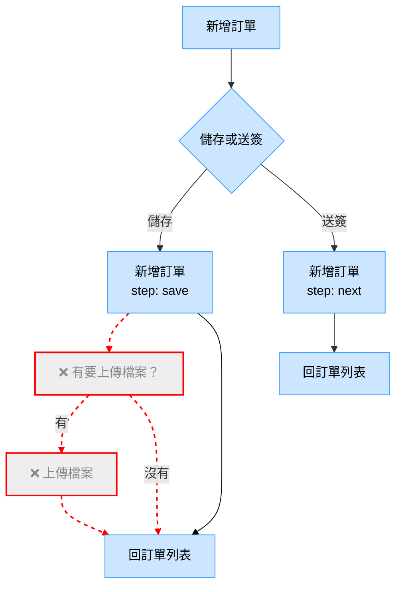
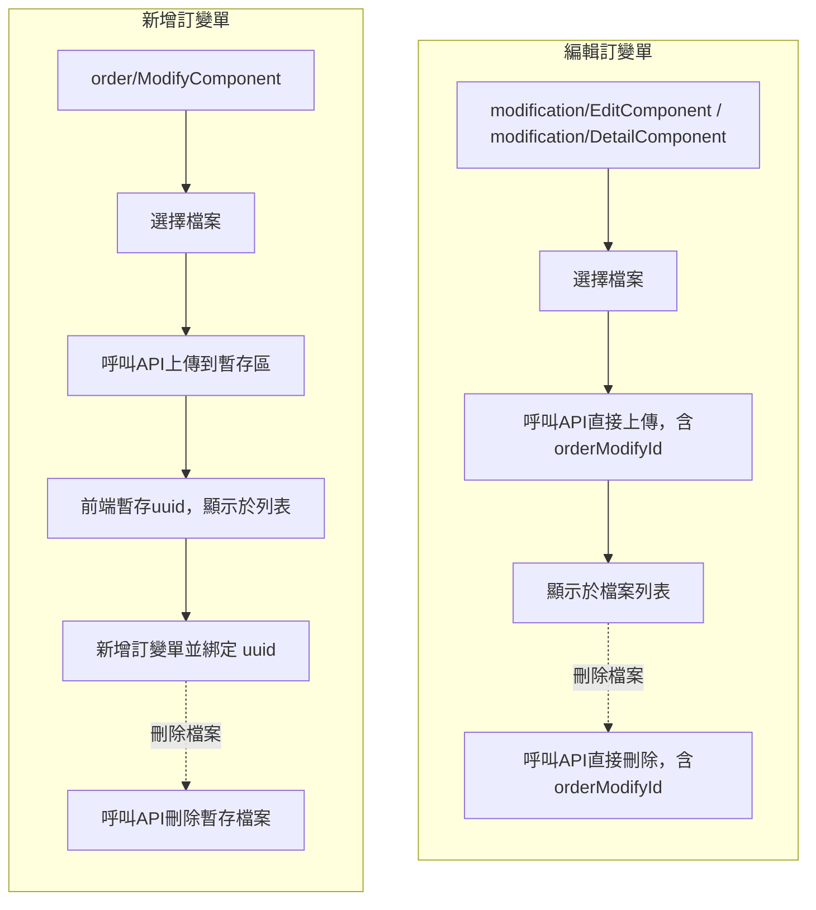
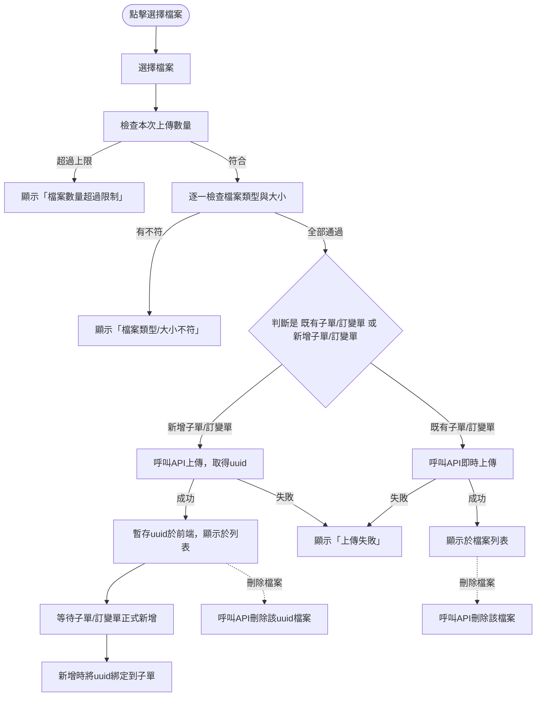
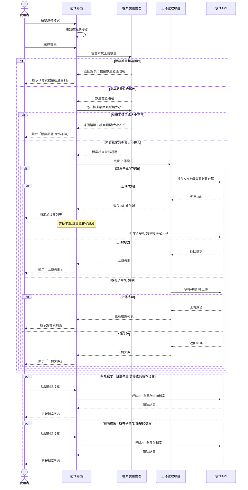
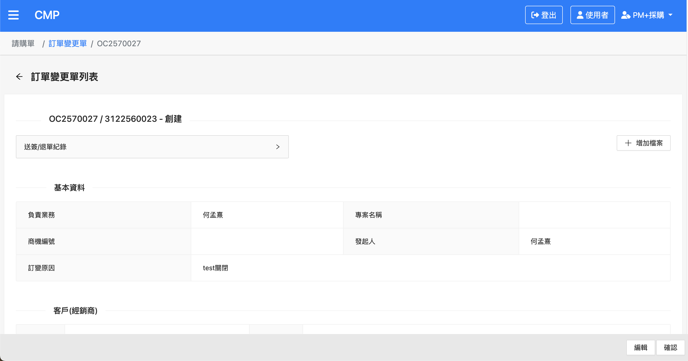
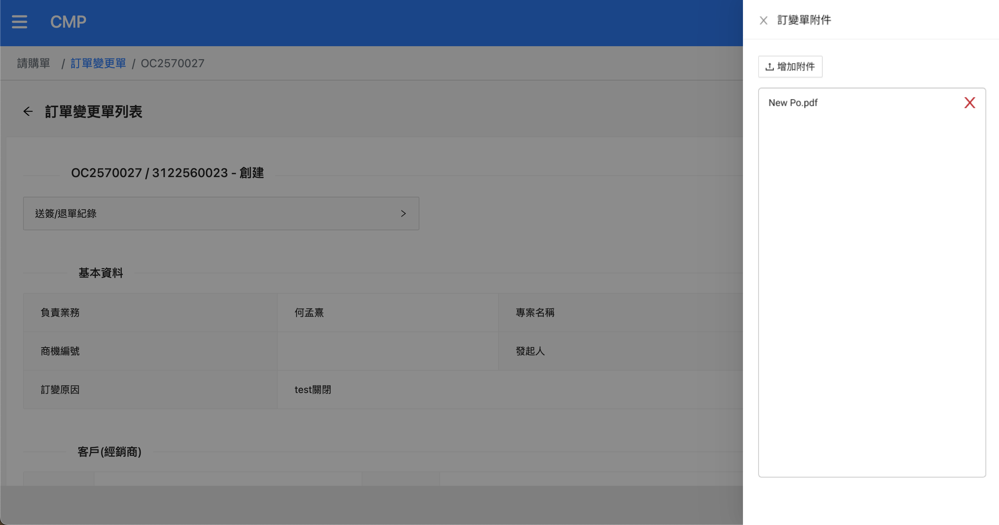
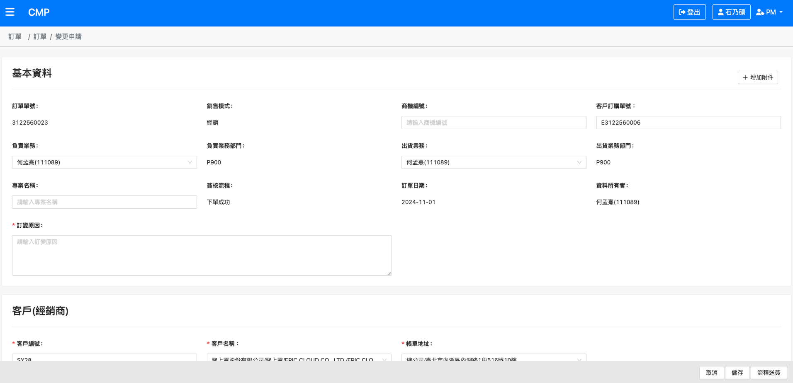
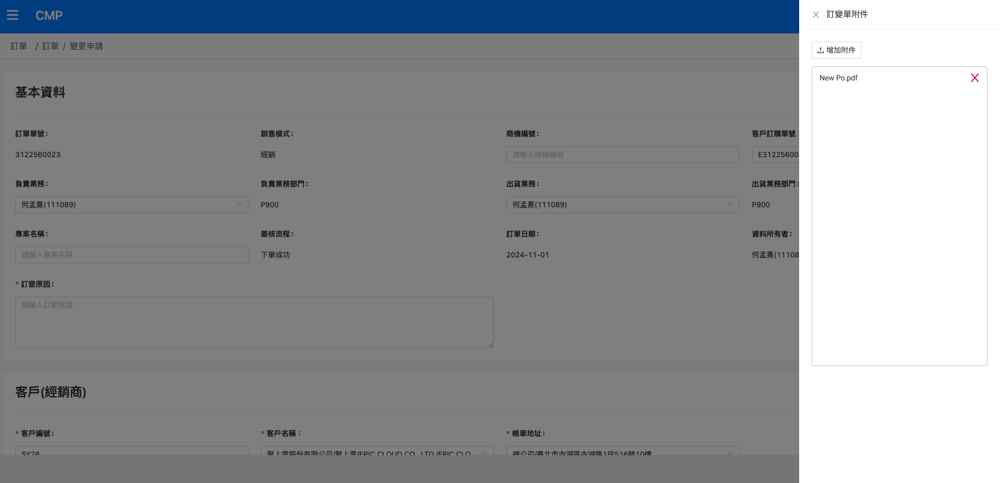

# BPM附檔需求（前台）

## 1. 需求背景
- Jira單：
  - CMP-3733 現行版本訂單：BPM附檔需求（前台）
  - CMP-3734 現行版本訂變單：BPM附檔需求（前台）

---

## 2. 功能說明

### 2.1 訂單（CMP-3733，功能異動）
1. 新增時移除「是否要上傳檔案」的判斷，改為即時上傳。
2. 上傳時直接呼叫API：
   - 若為新增子單：後端回傳該批上傳的uuid，新增時再將uuid綁定到子單，刪除時需呼叫API清除該檔案。
   - 若為既有子單：提供子單id，直接上傳。
3. 檔案大小限制：每次上傳單一檔案最大5MB。
4. 檔案類型限制：.pdf、.xlsx、.xls、.doc、.docx、.txt、.jpeg、.jpg、.png、.eml、.msg。
5. 檔案數量限制：訂單流程跑完前，跨子單加總不得超過10項（儲存時後端API也會檢查）。

### 2.2 訂變單（CMP-3734，新增功能）
1. 訂變單的檔案僅留存於訂變單中，不合併回訂單。
2. 可上傳檔案的狀態限制：創建、已抽單、已拒絕。其餘狀態僅能下載。
3. 檔案大小限制：每次上傳單一檔案最大5MB。
4. 檔案類型限制：.pdf、.xlsx、.xls、.doc、.docx、.txt、.jpeg、.jpg、.png、.eml、.msg。
5. 檔案數量限制：訂單流程跑完前，跨子單加總不得超過10項（儲存時後端API也會檢查）。

---

## 3. 附件上傳規則
- 檔案大小：單一檔案最大5MB
- 檔案類型：.pdf、.xlsx、.xls、.doc、.docx、.txt、.jpeg、.jpg、.png、.eml、.msg
- 檔案數量：跨子單加總最多10項（後端API會檢查）

---

## 4. 示意流程圖

### 4.1 新增訂單上傳檔案修正



### 4.2 訂變單上傳/刪除檔案流程圖



### 4.3 上傳檔案流程圖



<br>

> 補充說明：
> - 「新增子單」：檔案上傳後後端回傳uuid，前端暫存，等到子單正式新增時再將uuid綁定到子單。刪除時需呼叫API清除該檔案。
> - 「既有子單」：檔案會即時呼叫API上傳，成功後立即顯示於檔案列表。

### 4.4 檔案上傳循序圖



<br>
<br>

## 5. 程式調整重點

### 5.1 orders/detail.component

1. `html`：刪除「上傳檔案列表」區塊
   ```html
   <!-- 原本的上傳檔案列表 -->
   <nz-list nzBordered nzSize="small" class="list-container">
     <li nz-list-item *ngFor="let file of uploadFilesList">
       {{ file.name }}
     </li>
   </nz-list>
   ```
2. `addOrder()`：與檔案上傳有關的程式碼調整為「只要成功送出 order 就直接返回列表，不再等待檔案上傳結果」
   ```typescript
   addOrder() {
     // ...existing code...
     this.orderService.createOrder(orderData).subscribe({
       next: (res) => {
         if (res.success) {
           this.notify.success('訂單建立成功');
           this.router.navigate(['/orders']); // 直接返回列表
         }
       },
       error: (err) => {
         this.notify.error('訂單建立失敗', err.message);
       }
     });
     // 不再等待檔案上傳結果
   }
   ```
3. 其餘與上傳檔案相關的 method/屬性，將一併移除或調整：
   - `showFilesUploadModal()`：顯示上傳檔案進度視窗
   - `prepareUploadTasks()`：產生批次上傳任務
   - `uploadFiles()`：依序執行檔案上傳
   - `uploadOrderFiles()`：呼叫API上傳檔案
   - `uploadFilesList`：上傳進度與檔案狀態列表
   - 相關 UI 狀態（如 `ui.isFileUploaded`）

   ```typescript
   // 移除：
   showFilesUploadModal() { /* ... */ }
   prepareUploadTasks(orderId, subOrders) { /* ... */ }
   uploadFiles(uploadTasks) { /* ... */ }
   uploadOrderFiles(orderId, subOrderId, files) { /* ... */ }
   uploadFilesList = [];
   ```

### 5.2 attached-files.component.ts
➡️ ==**調整為訂單/訂變單共用**== 
1. `selectFileToUpload()` ：
   - 將檔案數量、類型、大小等檢查邏輯抽出為獨立 function，例如 `checkUploadCountLimit()`、`checkFileType()`、`checkFileSize()`。
   - 主流程僅負責呼叫這些檢查 function，並依據 mode（訂單/訂變單）分流。
2. 檔案上傳流程：
   先判斷 mode（訂單/訂變單），再依據是否為「新增」或「既有」子單/訂變單，決定呼叫 API 或前端暫存。
    ```typescript
    selectFileToUpload(event: any) {
      const files = this.extractFiles(event);
      // 檢查數量限制
      if (!this.checkUploadCountLimit(files, this.uploadLimit)) return;

      // 篩選合格大小、類型檔案，再往下處理，或不合格跳提示
      const validFiles = files.filter(f => this.checkFileType(f) && this.checkFileSize(f, this.maxSizeMB));
      if (this.mode === OrderMode.modify) {
        this.handleModifyOrderFiles(event, validFiles);
      } else {
        this.handleOrderFiles(event, validFiles);
      }
    }
    ```
3. 訂單/訂變單各自的上傳處理：
   依據是否有 subOrderId/modifyOrderId 決定呼叫 API 或前端暫存。
    ```typescript
     handleOrderFiles(event, files) {
       if (this.subOrderId) {
         // （不變）
         // 既有子單：直接API上傳
         // 需要：subOrderId, fileInfo
       } else {
         // （此次新增）
         // 新增子單：前端暫存檔案
         // 需要：fileInfo
         // 回傳：event uuid
       }
     }
     handleModifyOrderFiles(event, files) {
       if (this.modifyOrderId) {
         // （此次新增）
         // 既有訂變單：直接API上傳
         // 需要：modifyOrderId, fileInfo
       } else {
         // （此次新增）
         // 新增訂變單：前端暫存檔案
         // 需要：fileInfo
         // 回傳：event uuid
       }
     }
     ```
4. 檔案刪除處理：
   依據 mode 與是否為既有單據決定呼叫 API 或前端移除。
    ```typescript
    removeFile(index: number) {
      if (this.mode === OrderMode.modify) {
        if (this.modifyOrderId) {
          // （此次新增）
          // 既有訂變單：呼叫API刪除
          // 需要：modifyOrderId, fileId
        } else {
          // （此次新增）
          // 新增訂變單：呼叫API刪除
          // 需要：event uuid, fileName
        }
      } else {
        if (this.subOrderId) {
          // （不變）
          // 既有子單：呼叫API刪除
          // 需要：subOrderId, fileId
        } else {
          // （此次新增）
          // 新增子單：呼叫API刪除
          // 需要：event uuid, fileName
        }
      }
    }
    ```

---

## 6. 需要用到的 API 項目

### 6.1 現有 API
1. **既有訂單子單上傳檔案**：
   orderSvc.uploadOrderFiles(orderId, files, folder, subOrderId)
   > `POST {gateway.order}/orders/{orderId}/orderDetails/{subOrderId}/files?path=/attachment`

2. **既有訂單子單刪除檔案**：
   orderSvc.deleteOrderFile(orderId, fileId, subOrderId)
   > `DELETE {gateway.order}/orders/{orderId}/orderDetails/{subOrderId}/files/{fileId}`

### 6.2 新增需要的 API

3. **新增訂單子單上傳檔案到暫存區**
   > 

4. **刪除暫存檔案**
   > 

5. **訂變單上傳檔案列表**
   > 

6. **訂變單上傳檔案**
   > 

7. **訂變單刪除檔案**
   > 

8. **訂變單暫存檔案上傳**
   > 

9. **訂變單暫存檔案刪除**
   >

10. **訂變單下載檔案**
   >

## 7. 頁面與 Component 實現

### 7.1 核心 Component  - AttachedFilesComponent

此功能主要透過組件 `AttachedFilesComponent` 實現，用於處理檔案上傳、列表顯示和刪除功能。

#### 7.1.1 Component 位置
```
src/app/orders/sub-order/attached-files/attached-files.component.ts
src/app/orders/sub-order/attached-files/attached-files.component.html
src/app/orders/sub-order/attached-files/attached-files.component.scss
```

#### 7.1.2 Component 用途
- 統一處理訂單和訂變單的附件上傳功能
- 提供檔案選擇、上傳、列表顯示和刪除的介面
- 根據不同的使用情境(新增/編輯、訂單/訂變單)調用對應的 API

### 7.2 使用此 Component 的頁面

1. **訂單子單詳情頁面**
   - 用於訂單子單的附件管理
      ```
      src/app/orders/sub-order/sub-order.component.ts
      src/app/orders/sub-order/sub-order.component.html
      ```

2. **訂變單檢視頁面**
   - 用於檢視訂變單時的檔案上傳
      ```
      src/app/orders/modify/modify.component.ts
      src/app/orders/modify/modify.component.html
      ```
   - 單頭增加上傳附件按鈕
     
   - 點擊按鈕後展開側邊欄供使用者上傳檔案
     

3. **訂變單編輯頁面**
   - 用於編輯訂變單的附件管理
      ```
      src/app/modification/edit/edit.component.ts
      src/app/modification/edit/edit.component.html
      src/app/modification/detail/detail.component.ts
      src/app/modification/detail/detail.component.html
      ```
   - 單頭增加上傳附件按鈕
     
   - 點擊按鈕後展開側邊欄供使用者上傳檔案
    

### 7.3 相關服務

1. **OrderService**
   ```
   src/app/core/services/order.service.ts
   ```
   - 提供訂單相關的附件操作 API

2. **ModificationService**
   ```
   src/app/core/services/modification.service.ts
   ```
   - 提供訂變單相關的附件操作 API
