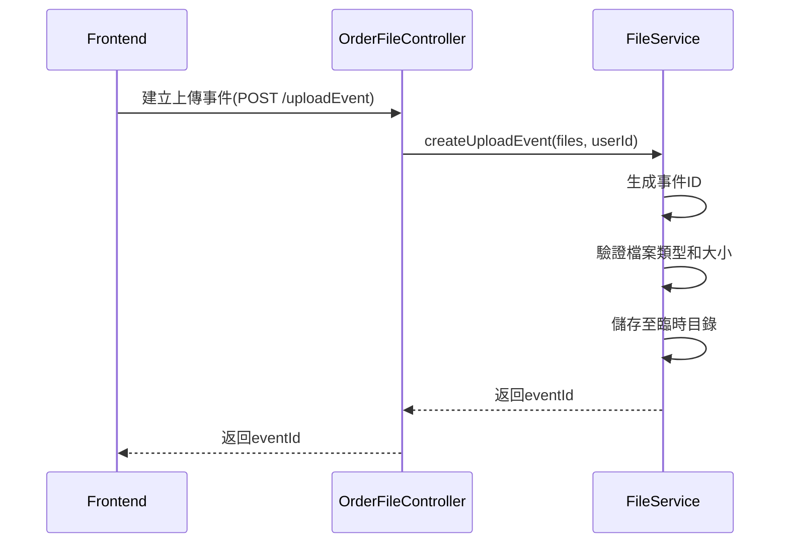
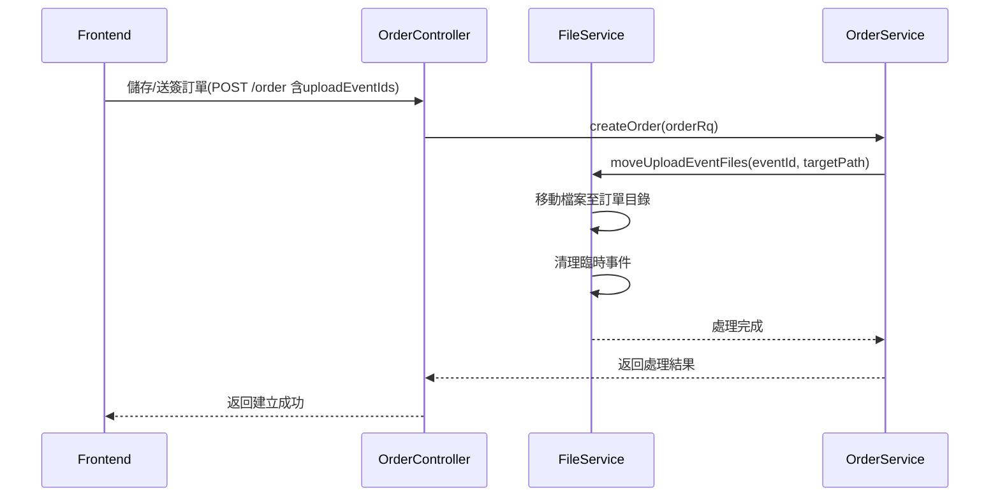
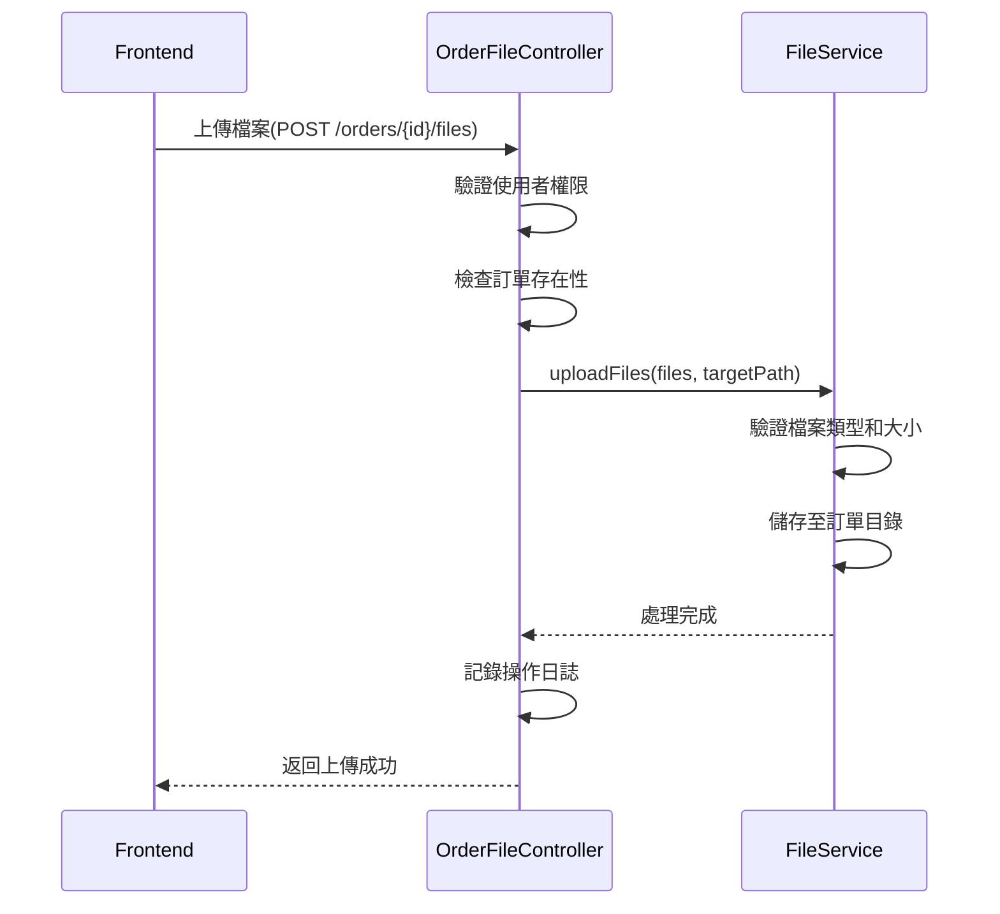
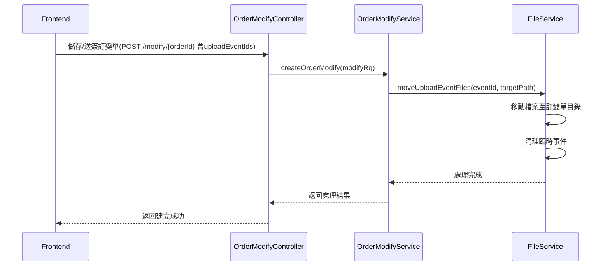
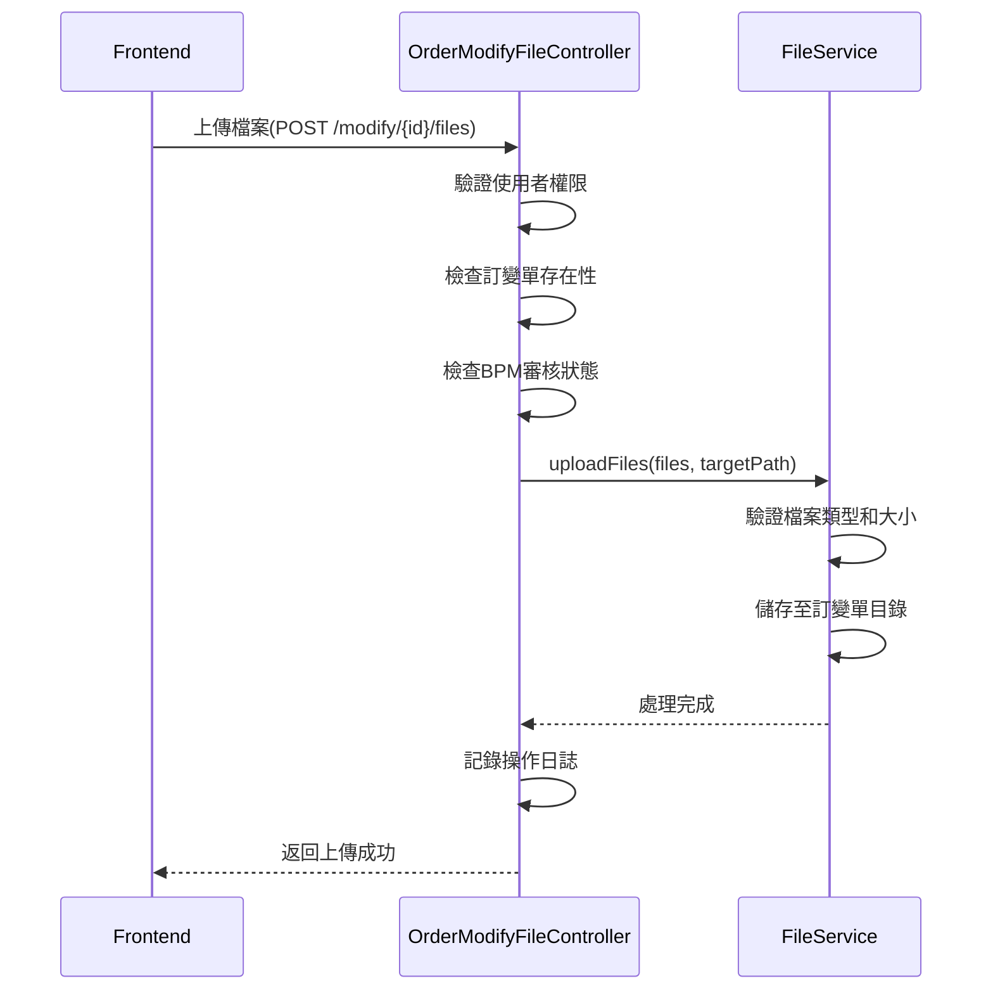
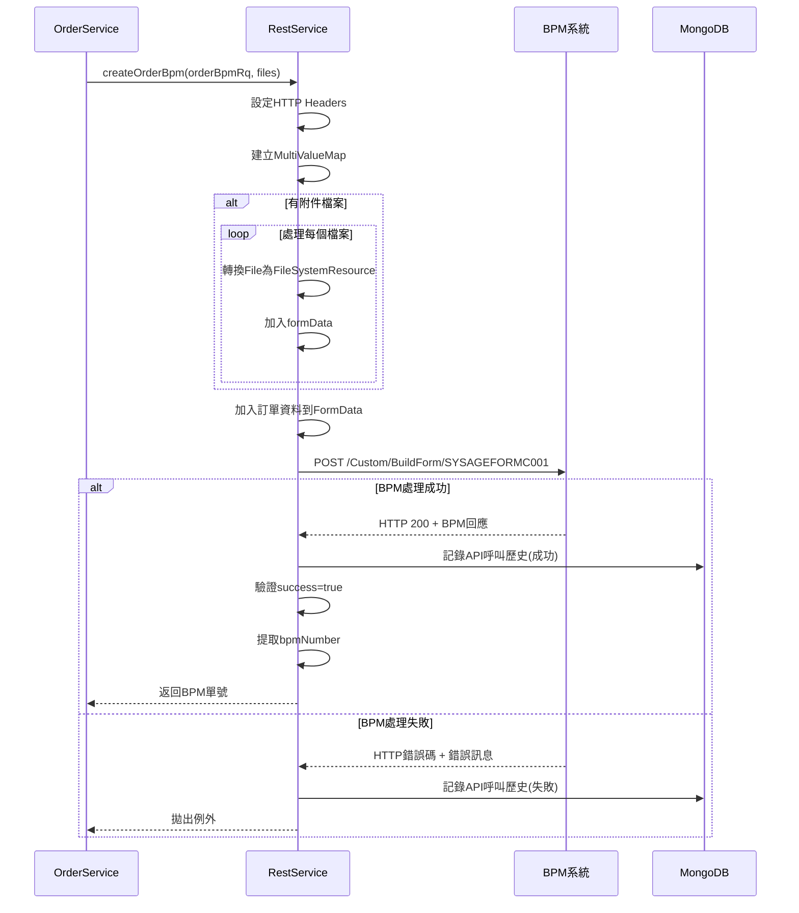
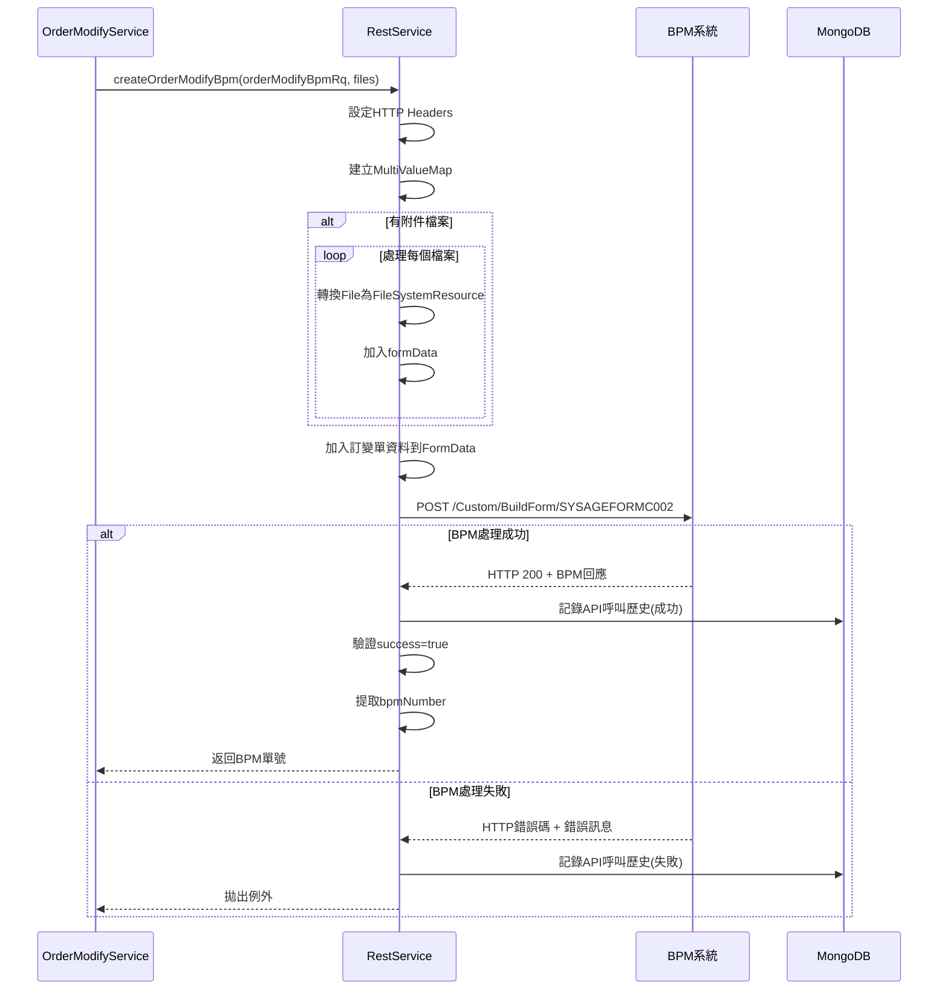

# CMP-3620 BPM附加檔案上傳 - 軟體設計文件

## 修訂紀錄
| 版本 | 日期 | 作者 | 說明 |
| :-----: | :----------: | :----------: | :-------------- |
| **v1.0.0** | 2025-06-30 | Jacky Cheng | 初稿建立 |
| **v1.1.0** | 2025-07-03 | Jacky Cheng | 1. 新增目錄 <br> 2. 功能實現詳述：新增BPM系統整合流程 <br> 3. 功能實現詳述：新增定時清理機制 <br> 4. 技術架構設計：核心組件設計補充Function實現邏輯  |

## 目錄

- [1. 需求](#1-需求)
- [2. 變更項目總覽](#2-變更項目總覽)
- [3. 資料結構與類別設計調整](#3-資料結構與類別設計調整)
  - [3-1. FileReadRs 類別設計 - 取得附加檔案列表的API回應](#3-1-filereadrs-類別設計---取得附加檔案列表的api回應)
    - [3-1-1. 類別欄位](#3-1-1-類別欄位)
    - [3-1-2. 類別說明](#3-1-2-類別說明)
- [4. 功能實現詳述](#4-功能實現詳述)
  - [4-1. 上傳事件機制](#4-1-上傳事件機制)
  - [4-2. 檔案上傳流程](#4-2-檔案上傳流程)
    - [4-2-1. 上傳事件](#4-2-1-上傳事件)
    - [4-2-2. 訂單檔案上傳流程(新增訂單)](#4-2-2-訂單檔案上傳流程新增訂單)
    - [4-2-3. 訂單檔案上傳流程(已建立訂單)](#4-2-3-訂單檔案上傳流程已建立訂單)
    - [4-2-4. 訂變單檔案上傳流程(新增訂變單)](#4-2-4-訂變單檔案上傳流程新增訂變單)
    - [4-2-5. 訂變單檔案上傳流程(已建立訂變單)](#4-2-5-訂變單檔案上傳流程已建立訂變單)
  - [4-3. BPM系統整合流程](#4-3-bpm系統整合流程)
    - [4-3-1. 調整BPM訂單申請API](#4-3-1-調整bpm訂單申請api)
    - [4-3-2. 調整BPM訂變單申請API](#4-3-2-調整bpm訂變單申請api)
  - [4-4. 定時清理機制](#4-4-定時清理機制)
- [5. 技術架構設計](#5-技術架構設計)
  - [5-1. 核心組件設計](#5-1-核心組件設計)
    - [5-1-1. FileController](#5-1-1-filecontroller)
    - [5-1-2. OrderFileController](#5-1-2-orderfilecontroller)
    - [5-1-3. OrderModifyFileController](#5-1-3-ordermodifyfilecontroller)
    - [5-1-4. FileService](#5-1-4-fileservice)
    - [5-1-5. FileReadRs](#5-1-5-filereadrs)
    - [5-1-6. OrderController](#5-1-6-ordercontroller)
    - [5-1-7. OrderService](#5-1-7-orderservice)
    - [5-1-8. OrderModifyController](#5-1-8-ordermodifycontroller)
    - [5-1-9. OrderModifyService](#5-1-9-ordermodifyservice)
    - [5-1-10. RestService](#5-1-10-restservice)
  - [5-2. API 請求與響應範例](#5-2-api-請求與響應範例)
    - [5-2-1. 訂單上傳檔案API範例](#5-2-1-訂單上傳檔案api範例)
    - [5-2-2. 訂變單上傳檔案API範例](#5-2-2-訂變單上傳檔案api範例)
    - [5-2-3. 上傳事件API範例](#5-2-3-上傳事件api範例)
    - [5-2-4. 新增訂單API範例](#5-2-4-新增訂單api範例)
    - [5-2-5. 新增訂變單API範例](#5-2-5-新增訂變單api範例)

---

## 1. 需求

> 因BPM需看到CMP訂單的附加檔案，在CMP進行BPM送審時需上傳檔案至BPM。
>
> 1. 單一檔案大小限制5MB，檔案數量上限為10
> 2. 可上傳的檔案類型包含.pdf、.xlsx、.xls、.doc、.docx、.txt、.jpeg、.jpg、.png、.eml、.msg
> 3. 訂單和訂變單的檔案分開上傳
> 4. 訂變單上傳的檔案，在BPM送簽後不可新增及刪除
> 5. 訂單的檔案數量在排程下單前不可超過10個，訂變單的檔案數量不可超過10個
> 6. 新增訂單、訂變單時，需透過上傳事件暫存檔案，待訂單、訂變單產生時，將檔案移至該單所屬的附檔資料夾
---

## 2. 變更項目總覽

|   編號  | 變更項目                                                   | 變更原因說明                                       | 影響範圍                                                                                                                                                                               |
| :---: | :----------------------------------------------------- | :------------------------------------------- | :--------------------------------------------------------------------------------------------------------------------------------------------------------------------------------- |
| **1** | 刪除現有的檔案控制器 | 現有控制器無法適應BPM系統對附件上傳的特定需求 | - 移除 `FileController.java`
| **2** | 新增訂單、訂變單專用的檔案控制器 | 上傳檔案的主要功能整合至`FileService.java`，並依照訂單、訂變單各自的需求建立控制器 | - 新增 `OrderFileController.java`<br> - 新增 `OrderModifyFileController.java`                          |
| **3** | 新增檔案讀取回應模型 | 檔案傳輸需要標準化的回應模型，以確保系統間資訊交換一致性 | - 新增 `FileReadRs.java`                           |
| **4** | 優化檔案整合服務 | 保留現有上傳功能，並新增「上傳事件」功能，可事先上傳檔案至暫存區 | - 修改 `FileService.java`<br> - 新增上傳事件功能 |
| **5** | 附件類型檢查機制 | 檔案類型必須受到嚴格控制，避免惡意檔案進入系統造成資安風險 | - 實現附件白名單檔案類型驗證
| **6** | BPM訂單申請、訂變單申請API調整 | 請求格式需改為FormData，並同時發送檔案及訂單資訊 | - 修改 `RestService.java` |

## 3. 資料結構與類別設計調整

### 3-1. FileReadRs 類別設計 - 取得附加檔案列表的API回應

#### 3-1-1. 類別欄位

```plaintext
+-----------------------------------------+
|               FileReadRs                |
+-----------------------------------------+
| - id: String                            |
| - fileName: String                      |
| - createDate: Date                      |
+-----------------------------------------+
| + getId(): String                       |
| + setId(id: String): void               |
| + getFileName(): String                 |
| + setFileName(fileName: String): void   |
| + getCreateDate(): Date                 |
| + setCreateDate(createDate: Date): void |
+-----------------------------------------+
```

#### 3-1-2. 類別說明

| 欄位名稱 | 型別 | 說明 |
|:-------------------:|:--------:|:--------------|
| **id** | String | 檔案編碼ID（JWT編碼後的檔案路徑） |
| **fileName** | String | 檔案名稱 |
| **createDate** | Date | 檔案建立日期 |

## 4. 功能實現詳述

### 4-1. 上傳事件機制

上傳事件機制提供了一種臨時存儲檔案的方式，直到這些檔案與訂單或訂變單關聯：

1. **事件生成**：
   - 前端上傳檔案時，後端生成唯一的上傳事件ID
   - ID格式為：`{yyyyMMdd}-{randomString}`

2. **臨時存儲**：
   - 檔案存儲在臨時目錄
   - 設置過期時間，過期後自動清理

3. **事件關聯**：
   - 創建訂單或訂變單時，通過傳入eventId關聯上傳事件
   - 系統將臨時檔案移動到訂單或訂變單的附件目錄

4. **事件清理**：
   - 定時清理過期的上傳事件檔案

### 4-2. 檔案上傳流程

#### 4-2-1. 上傳事件

FileService的上傳事件機制負責臨時存儲檔案，直到這些檔案與訂單或訂變單關聯：

**核心方法：createUploadEvent**

**輸入參數：**
- `MultipartFile[] files`：要上傳的檔案陣列
- `String userId`：使用者ID（用於權限控制）

**處理邏輯：**
1. 生成唯一的上傳事件ID：`{yyyyMMdd}-{randomString}`
2. 建立臨時存儲目錄：`/root/temp/{eventId}/`
3. 執行檔案類型驗證（白名單檢查）
4. 檢查檔案大小限制（單檔5MB，不可超過10個檔案）
5. 將檔案儲存至臨時目錄
6. 返回事件ID供後續使用

**錯誤處理：**
- 檔案類型不符：拋出 InvalidFileTypeException
- 檔案大小超限：拋出 FileSizeExceededException
- 檔案數量超限：拋出 FileLimitExceededException

**上傳事件流程圖：**



#### 4-2-2. 訂單檔案上傳流程(新增訂單)

**核心方法：createOrder**

**輸入參數：**
- `UserItemRs userInfo`：使用者資訊
- `OrderHeaderRq orderHeaderRq`：訂單單頭請求
- `List<OrderDetailRq> orderDetailRqList`：訂單單身請求

**處理邏輯：**
1. 驗證使用者權限和訂單資料
2. 建立訂單主體資料
3. 檢查是否包含上傳事件ID
4. 呼叫FileService.moveUploadEventFiles移轉檔案
5. 將檔案從臨時目錄移至訂單目錄
6. 清理臨時事件資料
7. 返回訂單建立結果

**流程說明：**
針對新建立的訂單，使用上傳事件機制先暫存檔案，待訂單建立完成後移轉檔案。



#### 4-2-3. 訂單檔案上傳流程(已建立訂單)

**輸入參數：**
- `String orderId`：訂單ID
- `String orderDetailId`：訂單單身ID
- `MultipartFile[] files`：要上傳的檔案陣列
- `String userId`：使用者ID
- `String roleId`：角色ID

**處理邏輯：**
1. 驗證使用者權限
2. 進行檔案驗證和儲存
3. 返回處理結果

**流程說明：**
針對已存在的訂單，直接上傳檔案至訂單的附件目錄，無需上傳事件機制。



#### 4-2-4. 訂變單檔案上傳流程(新增訂變單)

**核心方法：createOrderModify**

**輸入參數：**
- `String orderId`：訂單ID
- `String sub`：使用者ID
- `String role`：角色ID
- `OrderModifyRq orderModifyRq`：訂變單請求

**處理邏輯：**
1. 驗證使用者權限和訂變單資料
2. 建立訂變單主體資料
3. 檢查是否包含上傳事件ID
4. 呼叫FileService.moveUploadEventFiles移轉檔案
5. 將檔案從臨時目錄移至訂單目錄
6. 清理臨時事件資料
7. 返回訂變單建立結果

**流程說明：**
針對新建立的訂變單，在已建立上傳事件的基礎上，處理訂變單建立並移轉檔案。檔案上傳流程請參考4-2-1節。



#### 4-2-5. 訂變單檔案上傳流程(已建立訂變單)

**輸入參數：**
- `String modifyId`：訂變單ID
- `MultipartFile[] files`：要上傳的檔案陣列
- `String userId`：使用者ID
- `String roleId`：角色ID

**處理邏輯：**
1. 驗證使用者權限
2. 進行檔案驗證和儲存
3. 返回處理結果

**流程說明：**
針對已存在的訂變單，直接上傳檔案至訂變單的附件目錄，需考慮BPM審核狀態限制。



### 4-3. BPM系統整合流程

#### 4-3-1. 調整BPM訂單申請API

RestService的createOrderBpm方法負責將訂單資料和附件上傳至BPM系統，該方法的核心特性：

**輸入參數：**
- `OrderBpmRq orderBpmRq`：包含訂單的所有業務資訊
- `List<File> files`：要上傳至BPM的附件檔案清單

**處理邏輯：**
1. 設定HTTP Headers為MULTIPART_FORM_DATA類型
2. 建立MultiValueMap來組裝form-data
3. 將檔案轉換為FileSystemResource並加入form-data
4. 將訂單資料加入FormData欄位
5. 呼叫BPM API：`/Custom/BuildForm/SYSAGEFORMC001`
6. 解析回應並返回BPM單號



#### 4-3-2. 調整BPM訂變單申請API

RestService的createOrderModifyBpm方法負責將訂變單資料和附件上傳至BPM系統，該方法與createOrderBpm方法結構相似但針對訂變單業務需求進行調整：

**輸入參數：**
- `OrderModifyBpmRq orderModifyBpmRq`：包含訂變單的所有業務資訊
- `List<File> files`：要上傳至BPM的附件檔案清單

**處理邏輯：**
1. 設定HTTP Headers為MULTIPART_FORM_DATA類型
2. 建立MultiValueMap來組裝form-data
3. 將檔案轉換為FileSystemResource並加入form-data
4. 將訂變單資料加入FormData欄位
5. 呼叫BPM API：`/Custom/BuildForm/SYSAGEFORMC002`（注意：與訂單API不同）
6. 記錄第三方API呼叫歷史
7. 解析回應並返回BPM單號



### 4-4. 定時清理機制

為確保系統儲存空間的有效利用，需要定期清理過期的上傳事件檔案和暫存檔案。

#### 4-4-1. 清理策略

**清理條件：**
- 檔案建立時間超過設定的保留期限（預設：1天）
- 未被任何訂單或訂變單關聯的暫存檔案

#### 4-4-2. K8s CronJob

**清理腳本說明：**

1. **清理週期**：每日凌0點執行，避免影響業務高峰期
2. **保留期限**：檔案建立超過1天後自動清理
3. **清理範圍**：
   - 刪除過期檔案
   - 清理空資料夾

## 5. 技術架構設計

### 5-1. 核心組件設計

#### 5-1-1. FileController

**移除說明：**

FileController 已從系統中移除，該控制器原本負責處理檔案的基本操作。

**已移除的功能：**
1. **壓縮下載訂購證明API** - 此功能已完全刪除，不再提供批次下載功能
2. **取得採購單附加檔案列表API** - 已遷移至 `OrderFileController` 
3. **上傳檔案（已建立訂單）API** - 已遷移至 `OrderFileController`
4. **下載檔案API** - 已遷移至 `OrderFileController`

**功能遷移對應：**
- 原有的訂單相關檔案操作功能已全數遷移至 `OrderFileController`
- 檔案服務的核心邏輯保留在 `FileService` 中，提供統一的底層支援

**架構調整說明：**
為了更好地支援BPM系統整合，檔案控制器被重新設計為專用控制器模式，分別處理訂單和訂變單的檔案操作，以確保功能邊界清晰且符合業務需求。

#### 5-1-2. OrderFileController

訂單檔案專用控制器，處理與訂單相關的檔案操作。

**路徑：** `/orders/{orderId}/orderDetails/{orderDetailId}/files`

**核心方法與實作邏輯：**

##### 1. 取得訂單附件列表API
**HTTP Method：** `GET` <br>
**路徑：** `/orders/{orderId}/orderDetails/{orderDetailId}/files`
**輸入參數：**
- `@PathVariable String orderId`：訂單ID
- `@PathVariable String orderDetailId`：訂單單身ID
- `@RequestHeader("Sub") String userId`：使用者ID
- `@RequestHeader("Role") String roleId`：角色ID

**輸出參數：**
- `ResponseEntity<RsBody<List<FileReadRs>>>`：包含檔案列表的響應物件

**實作邏輯：**
- 驗證使用者權限與訂單存取權限
- 呼叫FileService.getFileList獲取檔案清單
- 返回FileReadRs列表格式的響應

##### 2. 上傳訂單附件API
**HTTP Method：** `POST` <br>
**路徑：** `/orders/{orderId}/orderDetails/{orderDetailId}/files`
**輸入參數：**
- `@PathVariable String orderId`：訂單ID
- `@PathVariable String orderDetailId`：訂單單身ID
- `@RequestParam("files") MultipartFile[] files`：上傳檔案陣列
- `@RequestParam(value = "orderProducts", required = false) String orderProducts`：商品資訊（選填）
- `@RequestHeader("Sub") String userId`：使用者ID
- `@RequestHeader("Role") String roleId`：角色ID

**輸出參數：**
- `ResponseEntity<RsBody<Void>>`：上傳結果響應物件

**實作邏輯：**
- 驗證使用者權限與訂單操作權限
- 呼叫FileService.uploadFiles執行檔案儲存
- 返回處理結果

##### 3. 下載訂單附件API
**HTTP Method：** `GET` <br>
**路徑：** `/orders/{orderId}/orderDetails/{orderDetailId}/file`
**輸入參數：**
- `@PathVariable String orderId`：訂單ID
- `@PathVariable String orderDetailId`：訂單單身ID
- `@RequestParam("id") String fileId`：檔案編碼ID

**輸出參數：**
- `ResponseEntity<InputStreamResource>`：檔案串流響應物件

**實作邏輯：**
- 驗證檔案存取權限
- 呼叫FileService.downloadFile處理檔案下載
- 返回檔案串流響應

##### 4. 刪除訂單附件API
**HTTP Method：** `DELETE`<br>
**路徑：** `/orders/{orderId}/orderDetails/{orderDetailId}/file`
**輸入參數：**
- `@PathVariable String orderId`：訂單ID
- `@PathVariable String orderDetailId`：訂單單身ID
- `@RequestParam("id") String fileId`：檔案編碼ID
- `@RequestHeader("Sub") String userId`：使用者ID
- `@RequestHeader("Role") String roleId`：角色ID

**輸出參數：**
- `ResponseEntity<RsBody<Void>>`：刪除結果響應物件

**實作邏輯：**
- 驗證使用者權限與刪除操作權限
- 呼叫FileService.deleteFile執行刪除操作
- 返回處理結果

##### 5. 建立上傳事件API
**HTTP Method：** `POST`<br>
**路徑：** `/orders/uploadEvent`
**輸入參數：**
- `@RequestParam("files") MultipartFile[] files`：上傳檔案陣列

**輸出參數：**
- `ResponseEntity<RsBody<String>>`：包含事件ID的響應物件

**實作邏輯：**
- 接收前端上傳的檔案陣列
- 呼叫FileService.createUploadEvent建立暫存事件
- 返回生成的事件ID供後續訂單建立時使用

##### 6. 刪除上傳事件檔案API
**HTTP Method：** `DELETE`<br>
**路徑：** `/orders/uploadEvent/{eventId}/{fileName}`
**輸入參數：**
- `@PathVariable String eventId`：上傳事件ID
- `@PathVariable String fileName`：檔案名稱

**輸出參數：**
- `ResponseEntity<RsBody<Void>>`：刪除結果響應物件

**實作邏輯：**
- 驗證事件ID與檔案名稱
- 呼叫fileService.deleteFile執行刪除
- 返回處理結果

#### 5-1-3. OrderModifyFileController

訂變單檔案專用控制器，處理與訂變單相關的檔案操作。

**路徑：** `/order/modify/{orderModifyId}`

**核心方法與實作邏輯：**

##### 1. 取得訂變單附件列表API
**HTTP Method：** `GET` <br>
**路徑：** `/order/modify/{orderModifyId}/files`
**輸入參數：**
- `@PathVariable String orderModifyId`：訂變單ID
- `@RequestHeader("Sub") String userId`：使用者ID
- `@RequestHeader("Role") String roleId`：角色ID

**輸出參數：**
- `ResponseEntity<RsBody<List<FileReadRs>>>`：包含檔案列表的響應物件

**實作邏輯：**
- 驗證使用者權限與訂變單存取權限
- 呼叫FileService.getFileList獲取檔案清單
- 返回FileReadRs列表格式的響應

##### 2. 上傳訂變單附件API
**HTTP Method：** `POST`<br>
**路徑：** `/order/modify/{orderModifyId}/files`
**輸入參數：**
- `@PathVariable String orderModifyId`：訂變單ID
- `@RequestParam("files") MultipartFile[] files`：上傳檔案陣列
- `@RequestHeader("Sub") String userId`：使用者ID
- `@RequestHeader("Role") String roleId`：角色ID

**輸出參數：**
- `ResponseEntity<RsBody<Void>>`：上傳結果響應物件

**實作邏輯：**
- 驗證使用者權限與訂變單操作權限
- 呼叫FileService.uploadFiles執行檔案儲存
- 返回處理結果

##### 3. 下載訂變單附件API
**HTTP Method：** `GET`<br>
**路徑：** `/order/modify/file`
**輸入參數：**
- `@PathVariable String orderModifyId`：訂變單ID
- `@RequestParam("id") String fileId`：檔案編碼ID

**輸出參數：**
- `ResponseEntity<InputStreamResource>`：檔案串流響應物件

**實作邏輯：**
- 驗證檔案存取權限
- 呼叫FileService.downloadFile處理檔案下載
- 返回檔案串流響應

##### 4. 刪除訂變單附件API
**HTTP Method：** `DELETE`<br>
**路徑：** `/order/modify/{orderModifyId}/file`
**輸入參數：**
- `@PathVariable String orderModifyId`：訂變單ID
- `@RequestParam("id") String fileId`：檔案編碼ID
- `@RequestHeader("Sub") String userId`：使用者ID
- `@RequestHeader("Role") String roleId`：角色ID

**輸出參數：**
- `ResponseEntity<RsBody<Void>>`：刪除結果響應物件

**實作邏輯：**
- 驗證使用者權限與刪除操作權限
- 呼叫FileService.deleteFile執行刪除操作
- 返回處理結果

#### 5-1-4. FileService

提供統一的檔案處理服務，為專用控制器提供底層支援。

**主要功能與實作邏輯：**

##### 1. 附件專用儲存機制

**核心方法：** `uploadFiles`

**實作邏輯：**
- 檢查目標目錄現有檔案數量，確保新增後不超過總數限制
- 對每個檔案執行以下驗證：
  - 檔案大小檢查（單檔不超過5MB）
  - 檔案類型白名單驗證
- 若目標目錄不存在則自動建立
- 將上傳的檔案存放至指定的目錄下

##### 2. 附件獲取

**核心方法：** `getFileList`

**實作邏輯：**
- 檢查指定目錄是否存在，若不存在則返回空列表
- 遍歷目錄中的所有一般檔案（排除子目錄）
- 為每個檔案建立FileReadRs物件：
  - 使用JWT工具生成安全的檔案ID（編碼檔案路徑）
  - 設定檔案名稱
  - 讀取檔案建立時間
- 返回完整的檔案資訊列表

##### 3. 附件下載

**核心方法：** `downloadFile`

**實作邏輯：**
- 使用JWT工具解析檔案ID獲得實際檔案路徑
- 驗證檔案是否存在於系統中
- 返回包含檔案串流的ResponseEntity

##### 4. 附件刪除

**核心方法：** `deleteFile`

**實作邏輯：**
- 解析JWT編碼的檔案ID獲得檔案路徑
- 檢查檔案是否存在，若不存在則拋出FileNotFoundException
- 從檔案系統中實際刪除檔案

##### 5. 附件類型檢查

**核心方法：** `validateFileType`

**實作邏輯：**
- 定義允許的檔案類型白名單，包含：
  - 文件類型：pdf, xlsx, xls, doc, docx, txt
  - 圖片類型：jpeg, jpg, png
  - 郵件類型：eml, msg
- 提取檔案副檔名並轉換為小寫進行比對
- 若檔案類型不在白名單中則拋出InvalidFileTypeException

##### 6. 上傳事件追蹤與管理

**核心方法：** `createUploadEvent` 與 `moveUploadEventFiles`

**建立上傳事件邏輯：**
- 生成唯一的事件ID，格式為「日期-隨機字串」（如：20250703-abcd1234）
- 在臨時目錄建立專屬的事件資料夾
- 呼叫uploadFiles方法將檔案儲存至暫存區
- 若建立過程失敗則清理已建立的暫存檔案

**移動事件檔案邏輯：**
- 檢查暫存事件目錄是否存在
- 建立目標目錄（如訂單或訂變單的附件目錄）
- 將暫存目錄中的所有檔案移動至目標位置
- 清理空的暫存目錄

#### 5-1-5. FileReadRs

檔案讀取響應模型，用於返回檔案信息。

```plaintext
FileReadRs
├── id: String
├── fileName: String
└── createDate: Date
```

#### 5-1-6. OrderController

調整「新增訂單」API，請求增加上傳事件ID。

**路徑：** `/order`

##### 1. 新增訂單（整合上傳事件）API
**HTTP Method：** `POST`<br>
**路徑：** `/order`
**輸入參數：**
- `@RequestBody CreateOrderRq orderRequest`：訂單請求物件（包含uploadEventIds欄位）
- `@RequestHeader("Sub") String userId`：使用者ID
- `@RequestHeader("Role") String roleId`：角色ID

**輸出參數：**
- `ResponseEntity<RsBody<OrderRs>>`：包含訂單建立結果的響應物件

**實作邏輯：**
- 接收包含上傳事件ID的OrderRq請求物件
- 驗證使用者權限與請求資料完整性
- 呼叫OrderService.createOrder處理訂單建立邏輯
- 返回訂單建立結果與訂單ID

#### 5-1-7. OrderService

調整「新增訂單」功能，增加綁定上傳事件檔案邏輯。

##### 1. 建立訂單（含檔案移轉）

**核心方法：** `createOrder`

**實作邏輯：**
- 執行原有訂單建立邏輯（驗證、儲存訂單資料）
- 檢查請求是否包含上傳事件ID
- 若有上傳事件ID：
  - 呼叫FileService.moveUploadEventFiles移轉檔案
- 返回處理結果

#### 5-1-8. OrderModifyController

調整「新增訂變單」API，請求增加上傳事件ID。

**路徑：** `/order/modify/{orderId}`

##### 1. 新增訂變單（整合上傳事件）API
**HTTP Method：** `POST` <br>
**路徑：** `/order/modify/{orderId}`
**輸入參數：**
- `@RequestBody OrderModifyRq orderModifyRequest`：訂變單請求物件（包含uploadEventIds欄位）
- `@RequestHeader("Sub") String userId`：使用者ID
- `@RequestHeader("Role") String roleId`：角色ID

**輸出參數：**
- `ResponseEntity<RsBody<OrderModifyRs>>`：包含訂變單建立結果的響應物件

**實作邏輯：**
- 接收包含上傳事件ID的OrderModifyRq請求物件
- 驗證使用者權限與原訂單存取權限
- 呼叫OrderModifyService.createOrderModify處理訂變單建立邏輯
- 返回訂變單建立結果與訂變單ID

#### 5-1-9. OrderModifyService

調整「新增訂變單」功能，增加綁定上傳事件檔案邏輯。

##### 1. 建立訂變單（含檔案移轉）
**方法：** `createOrderModify`
**實作邏輯：**
- 執行原有訂變單建立邏輯（驗證、儲存訂變單資料）
- 檢查請求是否包含上傳事件ID
- 若有上傳事件ID：
  - 呼叫FileService.moveUploadEventFiles移轉檔案
- 返回處理結果

#### 5-1-10. RestService

調整BPM「訂單申請」、「訂變單申請」API，處理檔案上傳至BPM系統。

##### 1. BPM訂單申請（含檔案上傳）
**方法：** `createOrderBpm`
**實作邏輯：**
- 接收OrderBpmRq訂單資料與檔案清單
- 設定HTTP Headers為MULTIPART_FORM_DATA格式
- 建立MultiValueMap組裝表單資料：
  - 將訂單業務資料序列化為JSON並加入表單
  - 將檔案轉換為FileSystemResource並加入表單
- 呼叫BPM API端點：`/Custom/BuildForm/SYSAGEFORMC001`
- 記錄第三方API呼叫歷史到MongoDB
- 解析BPM響應並提取單號
- 返回BPM處理結果

##### 2. BPM訂變單申請（含檔案上傳）
**方法：** `createOrderModifyBpm`
**實作邏輯：**
- 接收OrderModifyBpmRq訂變單資料與檔案清單
- 設定HTTP Headers為MULTIPART_FORM_DATA格式
- 建立MultiValueMap組裝表單資料：
  - 將訂變單業務資料序列化為JSON並加入表單
  - 將檔案轉換為FileSystemResource並加入表單
- 呼叫BPM API端點：`/Custom/BuildForm/SYSAGEFORMC002`
- 記錄第三方API呼叫歷史到MongoDB
- 解析BPM響應並提取單號
- 返回BPM處理結果

### 5-2. API 請求與響應範例

#### 5-2-1. 訂單上傳檔案API範例

##### 1. 取得訂單單身附加檔案列表
- **請求:**
  ```http
  GET /orders/2025xxxxxx/orderDetails/2025xxxxxx01/files
  Header:
    Sub: 1234567890
    Role: 1234567890
  ```
- **響應:**
  ```json
  {
    "success": true,
    "message": "查詢成功",
    "data": [
      {
        "id": "eyJhbGciOiJIUzI1NiJ9...",
        "fileName": "contract.pdf",
        "createDate": "2025-06-30T10:30:00+08:00"
      },
      {
        "id": "eyJhbGciOiJIUzI1NiJ9...",
        "fileName": "spec.docx",
        "createDate": "2025-06-30T10:35:00+08:00"
      }
    ]
  }
  ```

##### 2. 上傳訂單附件
- **請求:**
  ```http
  POST /orders/2025xxxxxx/orderDetails/2025xxxxxx01/files
  Header:
    Sub: 1234567890
    Role: 1234567890
  Form:
    files: [二進制檔案內容]
  ```
- **響應:**
  ```json
  {
    "success": true,
    "message": "檔案上傳成功",
    "data": null
  }
  ```

##### 3. 下載附件
- **請求:**
  ```http
  GET /orders/2025xxxxxx/orderDetails/2025xxxxxx01/file?id=eyJhbGciOiJIUzI1NiJ9...
  ```
- **響應:**
  ```
  [二進制檔案內容]
  ```

##### 4. 刪除附件
- **請求:**
  ```http
  DELETE /orders/2025xxxxxx/orderDetails/2025xxxxxx01/file?id=eyJhbGciOiJIUzI1NiJ9...
  Header:
    Sub: 1234567890
    Role: 1234567890
  ```
- **響應:**
  ```json
  {
    "success": true,
    "message": "檔案刪除成功",
    "data": null
  }
  ```

#### 5-2-2. 訂變單上傳檔案API範例

##### 1. 取得訂變單附加檔案列表
- **請求:**
  ```http
  GET /order/modify/OC123456789/files
  Header:
    Sub: 1234567890
    Role: 1234567890
  ```
- **響應:**
  ```json
  {
    "success": true,
    "message": "查詢成功",
    "data": [
      {
        "id": "eyJhbGciOiJIUzI1NiJ9...",
        "fileName": "change_request.pdf",
        "createDate": "2025-06-30T14:30:00+08:00"
      },
      {
        "id": "eyJhbGciOiJIUzI1NiJ9...",
        "fileName": "approval_form.docx",
        "createDate": "2025-06-30T14:35:00+08:00"
      }
    ]
  }
  ```

##### 2. 上傳訂變單附件
- **請求:**
  ```http
  POST /order/modify/OC123456789/files
  Header:
    Sub: 1234567890
    Role: 1234567890
  Form:
    files: [二進制檔案內容]
  ```
- **響應:**
  ```json
  {
    "success": true,
    "message": "檔案上傳成功",
    "data": null
  }
  ```

##### 3. 下載訂變單附件
- **請求:**
  ```http
  GET /order/modify/file?id=eyJhbGciOiJIUzI1NiJ9...
  ```
- **響應:**
  ```
  [二進制檔案內容]
  ```

##### 4. 刪除訂變單附件
- **請求:**
  ```http
  DELETE /order/modify/OC123456789/file?id=eyJhbGciOiJIUzI1NiJ9...
  Header:
    Sub: 1234567890
    Role: 1234567890
  ```
- **響應:**
  ```json
  {
    "success": true,
    "message": "檔案刪除成功",
    "data": null
  }
  ```

#### 5-2-3. 上傳事件API範例

##### 1. 新增上傳事件
- **請求:**
  ```http
  POST /orders/uploadEvent
  Form:
    files: [二進制檔案內容]
  ```
- **響應:**
  ```json
  {
    "success": true,
    "message": "上傳事件建立成功",
    "data": "20250630-abcde"
  }
  ```

##### 2. 刪除上傳事件檔案
- **請求:**
  ```http
  DELETE /orders/uploadEvent/20250630-abcde/contract.pdf
  ```
- **響應:**
  ```json
  {
    "success": true,
    "message": "檔案刪除成功",
    "data": null
  }
  ```

#### 5-2-4. 新增訂單API範例

##### 1. 新增訂單(含上傳事件)
- **請求:**
  ```http
  POST /order
  Header:
    Sub: 1234567890
    Role: 1234567890
  Body:
    {
      "data":{
        "body":[
            {
                "uploadEventIds":[
                    "20250630-abcde"
                ]
            }
        ]
      }
    }
  ```

#### 5-2-5. 新增訂變單API範例

##### 1. 新增訂變單(含上傳事件)
- **請求:**
  ```http
  POST /order/modify/2025xxxxxx
  Header:
    Sub: 1234567890
    Role: 1234567890
  Body:
    {
      "data":{
        "uploadEventIds":[
            "20250630-abcde"
        ]
      }
    }
  ```
