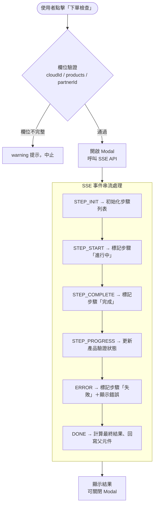
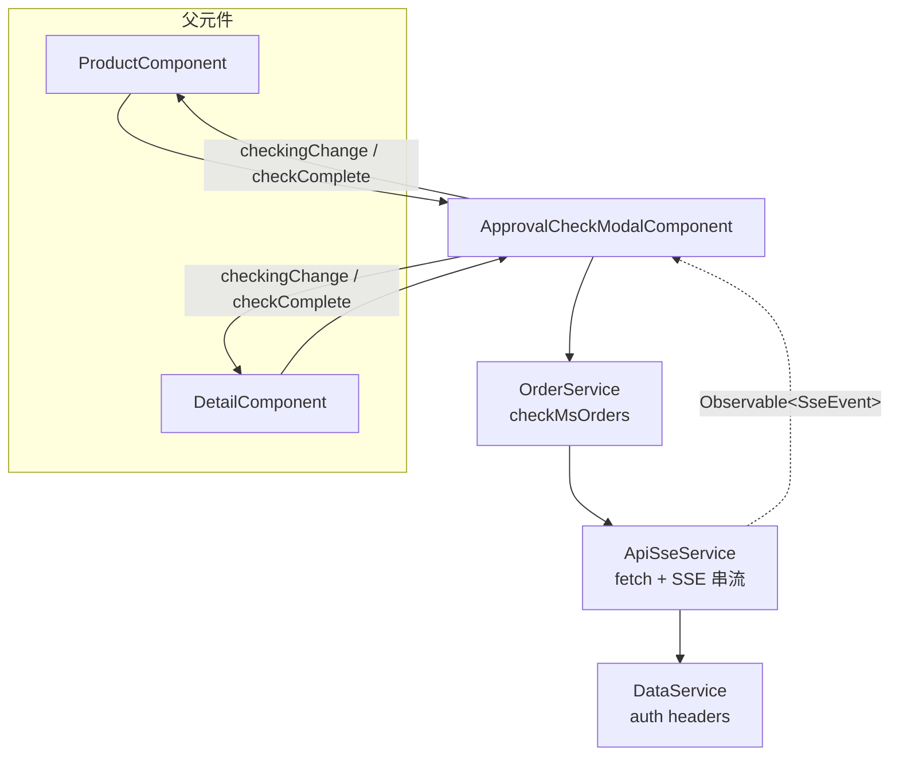
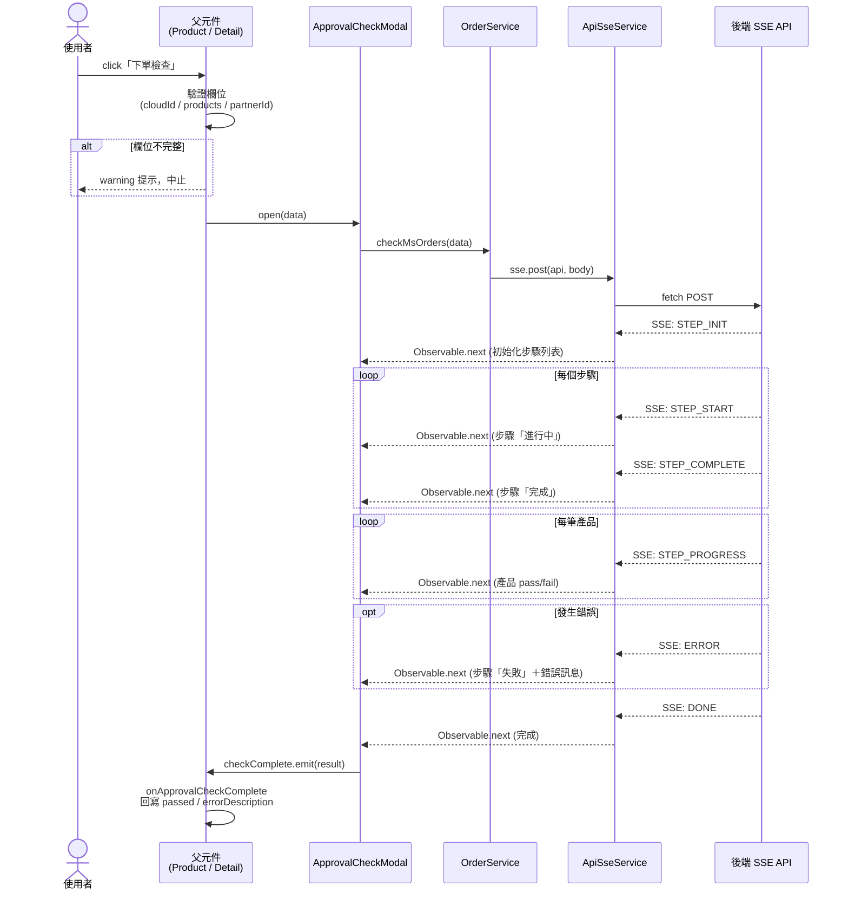
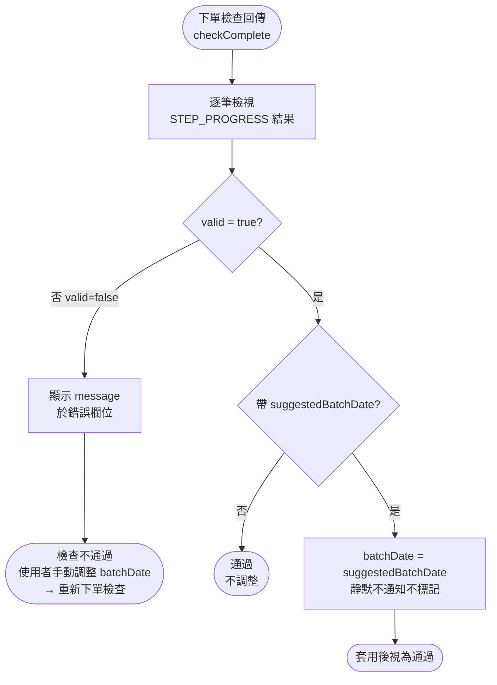

## 修訂紀錄

| **版本** | **日期** | **修訂內容** | **修訂者** |
| --- | --- | --- | --- |
| v1.3 | 2026-06-24 | **靜默調整不發通知、不標記**：`valid:true` 自動套用 `suggestedBatchDate` 後**不發 info 通知、亦不於下單日欄位顯示任何標記**，直接視為通過（對使用者完全透明）。移除 i18n `add-on auto delay message`／`add-on auto delay title` key、`product.component` 之 `notify.info` 呼叫，以及 `OrderProduct.autoDelayed` 欄位與 `microsoft-data-provider` 之 `batchDate` 欄位 `hasFeedback`/`warningTip` 標記。影響 §5.1、§5.2.2、§5.3、§5.4、§5.5、§5.6、§5.7。 | Raelynn |
| v1.0 | 2026-03-26 | 初始化文件 | Raelynn |
| v1.1 | 2026-06-18 | 新增第 5 章 [CMP-4469](https://metaage-corp.atlassian.net/browse/CMP-4469)：Add-on 依賴自動延後排程。擴充 SSE `STEP_PROGRESS` 攜帶 `isAddon` / `prerequisiteSkus` / `errorCode`；`OrderProduct` 新增 `isAddon` / `prerequisiteSkus` / `autoDelayed` 欄位；新增 3 組 i18n key。<br>**觸發時機修正**：後端會驗證 add-on 預計下單日須晚於 base，未晚於時回 `valid:false`（「add-on 的預計下單日需晚於 base 的預計下單日」）；前端於此「date-too-early」失敗（不帶需人工處理的 `errorCode`）時自動將 add-on batchDate +30min 並 Toast 通知（**累積一筆**，列出所有受影響產品），**不自動重跑下單檢查**（CMP-4469 SA 未涵蓋此情境，本 SD 補齊）；需人工處理的失敗（帶 `errorCode`，如缺少對應 base）僅顯示錯誤、不修正。<br>依據文件：[CMP-4469 SA（前端）](https://metaage-corp.atlassian.net/wiki/pages/viewpage.action?pageId=184287495)、[CMP-4400 SA（後端）](https://metaage-corp.atlassian.net/wiki/pages/viewpage.action?pageId=181862503)；如設計有衝突，以「CMP_SA_微軟下單Add-on依賴前端排程 (CMP-4469)」為主。 | Raelynn |
| v1.2 | 2026-06-24 | **第 5 章三來源對齊並依後端 SD v25 定稿（CMP-4469）**：<br>• 引用補上來源③ [4266_SD（後端）](https://metaage-corp.atlassian.net/wiki/x/lADpC)，新增 §5.1「三來源策略對照表」。<br>• **SSE 介接定案**：後端於 `STEP_PROGRESS.data` 回傳 **`suggestedBatchDate`**（= `max(base, 現在)+30 分`），**不回 `prerequisiteSkus`**；base 比對與日期計算由後端完成，前端僅套用建議值（不再於前端比對 base／自算）。<br>• **前端依 `valid` 分流**：`valid:true` 自動套用 `suggestedBatchDate`、`autoDelayed=true`、視為通過並跳 **info 通知**（add-on 名稱＋調整後日期）；`valid:false` **不自動套用**，僅顯示錯誤、由使用者手動調整 batchDate 後**重新下單檢查**通過才可送出。<br>• **影響章節**：§5.1 對照表、§5.2（欄位＋情境對照）、§5.3（僅留 `autoDelayed`）、§5.4（流程依 `valid` 分流）、§5.5、§5.6（通知文案「add-on 名稱＋調整後日期」）、§5.7（邊界 E-1～E-10 依 `valid`/`suggestedBatchDate` 分類）。 | Raelynn |

## 相關Jira單：

* CMP-4280 M1312260121008 的 訂變單 OC2620408 微軟下單檢核 timeout，前端需要支援SSE的API結構。
* CMP-4266 M1312260121008 的 訂變單 OC2620408 微軟下單檢核 timeout
* [CMP-4469](https://metaage-corp.atlassian.net/browse/CMP-4469) 微軟下單檢核：依 dynamicAttributes 檢測 add-on 與 base 相依，前端依關聯延後 add-on 子單 batch date（前台）
* [CMP-4400](https://metaage-corp.atlassian.net/browse/CMP-4400) 同上（後台主任務，本前端 SD 的後端介接來源）

## 目錄：

1. 目標
2. 功能需求
3. 實作架構設計
   * 3.1 系統流程圖
   * 3.2 元件關係圖
   * 3.3 序列圖
4. 實作
   * 4.1 後端 SSE 回應格式
   * 4.2 新增檔案
   * 4.3 修改檔案
5. CMP-4469 擴充：Add-on 依賴自動延後排程
   * 5.1 需求背景與策略決議
   * 5.2 SSE 回應格式擴充（後端介接）
   * 5.3 資料模型擴充
   * 5.4 自動延後流程
   * 5.5 修改 / 新增檔案
   * 5.6 i18n 新增 key
   * 5.7 邊界條件與例外處理

## 1. 目標

微軟下單檢查（`Microsoft/checkProducts`）因檢核項目多、耗時較長，容易發生 HTTP timeout，使用者無法得知檢核進度及結果。

本次改版將原有的**同步 HTTP 請求**替換為**SSE（Server-Sent Events）串流**（`Microsoft/checkOrders`），並以 **Modal＋進度條** 的方式即時呈現各步驟與產品驗證進度，提升使用體驗並避免 timeout 問題。

---

## 2. 功能需求

| # | 需求 | 說明 |
|---|------|------|
| 1 | SSE 串流 API 支援 | 前端以 `fetch` + `ReadableStream` 接收 SSE 事件，取代原本的 `HttpClient.post` |
| 2 | Modal 彈窗顯示 | 點擊「下單檢查」按鈕後開啟 Modal，檢查期間不可關閉 |
| 3 | 開啟前欄位驗證 | 開啟 Modal 前驗證 Cloud ID、產品清單、Partner ID，缺少時以 warning 提示 |
| 4 | 步驟進度條 | 使用 `nz-steps` 顯示後端回傳的動態步驟（STEP_INIT），並即時更新各步驟狀態 |
| 5 | 產品驗證進度 | 最後一階段以清單列出每筆產品的 pass / fail 狀態及錯誤訊息 |
| 6 | 錯誤顯示 | 步驟失敗時停留於該步驟並顯示錯誤原因；產品驗證失敗顯示 `errorDescription` |
| 7 | 完成後可關閉 | 檢查完成後 Modal 底部才顯示「關閉」按鈕 |
| 8 | 結果回寫 | 檢查完成後將 `passed` 狀態及 `errorDescription` 回寫至父元件 |

---

## 3. 實作架構設計

### 3.1 系統流程圖




### 3.2 元件關係圖




### 3.3 序列圖




---

## 4. 實作

### 4.1 後端 SSE 回應格式

API：`POST Microsoft/checkOrders`
Content-Type：`text/event-stream`

每個 SSE 事件由 `event:` 與 `data:` 兩行組成，以空行 `\n\n` 分隔。各事件格式如下：

#### SSE 事件一覽

| 事件 | 說明 | 發送時機 |
|------|------|----------|
| `STEP_INIT` | 初始化步驟列表 | 連線建立後發送一次 |
| `STEP_START` | 標記步驟開始 | 每個步驟開始時 |
| `STEP_COMPLETE` | 標記步驟完成 | 每個步驟完成時 |
| `STEP_PROGRESS` | 產品逐筆驗證結果 | 最後一步（驗證產品）逐筆回報 |
| `ERROR` | 步驟失敗 | 任一步驟發生錯誤時 |
| `DONE` | 全部完成 | 所有步驟與產品驗證結束後 |

#### 共用欄位

| 欄位 | 型別 | 說明 |
|------|------|------|
| `eventType` | `string` | 事件類型，與 `event:` 行一致 |
| `message` | `string` | 步驟描述或結果訊息 |
| `progress` | `number` | 整體進度百分比（0–100） |
| `timestamp` | `number` | Unix timestamp（ms） |

#### 各事件 `data` 欄位

**STEP_INIT**

| 欄位 | 型別 | 說明 |
|------|------|------|
| `totalSteps` | `number` | 總步驟數 |
| `data` | `string[]` | 各步驟描述，如 `["驗證合作夥伴資訊", "取得原廠客戶資訊", ...]` |

**STEP_START / STEP_COMPLETE**

| 欄位 | 型別 | 說明 |
|------|------|------|
| `stepIndex` | `number` | 步驟索引（**1-based**） |
| `totalSteps` | `number` | 總步驟數 |

**STEP_PROGRESS**

| 欄位 | 型別 | 說明 |
|------|------|------|
| `data.index` | `number` | 產品索引（**0-based**） |
| `data.valid` | `boolean` | 該產品是否驗證通過 |

> 驗證失敗時 `data` 中會額外包含 `errorDescription` 欄位。

**ERROR**

| 欄位 | 型別 | 說明 |
|------|------|------|
| `stepIndex` | `number` | 失敗的步驟索引（1-based） |
| `message` | `string` | 錯誤訊息 |

**DONE**

| 欄位 | 型別 | 說明 |
|------|------|------|
| `data` | `string` | 完成訊息，如 `"檢查商品完成"` |

#### 完整範例

```
event:STEP_INIT
data:{"eventType":"STEP_INIT","message":"步驟初始化","totalSteps":4,"data":["驗證合作夥伴資訊","取得原廠客戶資訊","取得原廠商品資訊","驗證產品"],"timestamp":1774852473733}

event:STEP_START
data:{"eventType":"STEP_START","message":"驗證合作夥伴資訊","stepIndex":1,"totalSteps":4,"progress":0,"timestamp":1774852473734}

event:STEP_COMPLETE
data:{"eventType":"STEP_COMPLETE","message":"驗證合作夥伴資訊","stepIndex":1,"totalSteps":4,"progress":25,"timestamp":1774852481746}

event:STEP_START
data:{"eventType":"STEP_START","message":"取得原廠客戶資訊","stepIndex":2,"totalSteps":4,"progress":25,"timestamp":1774852481746}

event:STEP_COMPLETE
data:{"eventType":"STEP_COMPLETE","message":"取得原廠客戶資訊","stepIndex":2,"totalSteps":4,"progress":50,"timestamp":1774852497440}

event:STEP_START
data:{"eventType":"STEP_START","message":"取得原廠商品資訊","stepIndex":3,"totalSteps":4,"progress":50,"timestamp":1774852497441}

event:STEP_COMPLETE
data:{"eventType":"STEP_COMPLETE","message":"取得原廠商品資訊","stepIndex":3,"totalSteps":4,"progress":75,"timestamp":1774852498045}

event:STEP_START
data:{"eventType":"STEP_START","message":"驗證產品","stepIndex":4,"totalSteps":4,"progress":75,"timestamp":1774852498045}

event:STEP_PROGRESS
data:{"eventType":"STEP_PROGRESS","message":"驗證通過","progress":83,"data":{"valid":true,"index":0},"timestamp":1774852498046}

event:STEP_PROGRESS
data:{"eventType":"STEP_PROGRESS","message":"驗證通過","progress":91,"data":{"valid":true,"index":1},"timestamp":1774852498046}

event:STEP_PROGRESS
data:{"eventType":"STEP_PROGRESS","message":"驗證通過","progress":100,"data":{"valid":true,"index":2},"timestamp":1774852498046}

event:STEP_COMPLETE
data:{"eventType":"STEP_COMPLETE","message":"驗證產品","stepIndex":4,"totalSteps":4,"progress":100,"timestamp":1774852498046}

event:DONE
data:{"eventType":"DONE","progress":100,"data":"檢查商品完成","timestamp":1774852498046}
```

---

### 4.2 新增檔案

#### 4.2.1 `src/app/core/services/api-sse.service.ts`（新增）

SSE 串流服務，負責透過 `fetch` API 發送 POST 請求並以 `ReadableStream` 解析 SSE 事件。

| 方法 | 說明 |
|------|------|
| `post(api, body, headers?)` | 公開方法，回傳 `Observable<SseEvent>`，取消訂閱時自動 abort 請求 |
| `doFetch()` | 執行 `fetch`，成功時交由 `readStream()` 讀取；失敗時交由 `handleHttpError()` |
| `readStream()` | 以 `ReadableStream.getReader()` 逐塊讀取，以 `\n\n` 分割 SSE 事件區塊 |
| `handleHttpError()` | 比照 `ApiService.apiErrorHandle`：401 等待 token 更新後重試、其他狀態解析錯誤訊息 |
| `waitForTokenRefresh()` | 比照 `ApiService.getRefreshTokenIsUpdate`，輪詢 `DataService.refreshToken` 變化 |
| `parseAndEmit()` | 解析 SSE 區塊中的 `event:` 和 `data:` 行，JSON 解析後透過 `NgZone.run()` 發出事件 |

**關鍵設計：**
- 使用原生 `fetch` 而非 `HttpClient`（因 `HttpClient` 不支援 SSE 串流讀取）
- 所有 callback 透過 `NgZone.run()` 確保 Angular 變更偵測正確觸發
- `Accept` header 設為 `text/event-stream, application/json, text/plain, */*` 以相容後端回應

**介面定義：**
```typescript
export interface SseEvent {
  event: string;  // 事件類型：STEP_INIT, STEP_START, STEP_COMPLETE, STEP_PROGRESS, ERROR, DONE
  data: any;      // data 行解析後的 JSON 物件
}
```

**程式碼：**
```typescript
/** SSE 事件解析結果 */
export interface SseEvent {
  /** event: 行的值，例如 'STEP_START', 'STEP_COMPLETE', 'DONE' */
  event: string;
  /** data: 行解析後的 JSON 物件 */
  data: any;
}

@Injectable({
  providedIn: 'root'
})
export class ApiSseService {

  constructor(
    private zone: NgZone,
    private dataService: DataService,
  ) {}

  /**
   * 發送 POST 請求並以 SSE 串流方式接收回應
   * @param api API 路徑（會自動加上 apiUrl 前綴）
   * @param body 請求 body（會自動 JSON.stringify）
   * @param headers 額外的 headers
   * @returns Observable<SseEvent>，每個 SSE 事件區塊發出一個值
   */
  post(api: string, body: any, headers?: Record<string, string>): Observable<SseEvent> {
    return new Observable<SseEvent>(observer => {
      const abortController = new AbortController();

      this.doFetch(api, body, headers, abortController, observer);

      // 取消訂閱時中斷請求
      return () => abortController.abort();
    });
  }

  /** 執行 fetch 請求 */
  private doFetch(
    api: string,
    body: any,
    headers: Record<string, string> | undefined,
    abortController: AbortController,
    observer: Subscriber<SseEvent>,
  ): void {
    const url = `${environment['apiUrl']}/${api}`;

    const defaultHeaders: Record<string, string> = {
      'Content-Type': 'application/json',
      'Accept': 'text/event-stream, application/json, text/plain, */*',
      ...this.dataService.getHeaderData() as Record<string, string>,
    };

    fetch(url, {
      method: 'POST',
      headers: { ...defaultHeaders, ...headers },
      body: JSON.stringify(body),
      signal: abortController.signal,
    }).then(async response => {
      if (!response.ok || !response.body) {
        await this.handleHttpError(response, api, body, headers, abortController, observer);
        return;
      }

      this.readStream(response.body, observer);
    }).catch(err => {
      if (err.name !== 'AbortError') {
        this.zone.run(() => observer.error(err));
      }
    });
  }

  /** 讀取 SSE 串流 */
  private readStream(body: ReadableStream<Uint8Array>, observer: Subscriber<SseEvent>): void {
    const reader = body.getReader();
    const decoder = new TextDecoder();
    let buffer = '';

    const read = (): void => {
      reader.read().then(({ done, value }) => {
        if (done) {
          if (buffer.trim()) {
            this.parseAndEmit(buffer, observer);
          }
          this.zone.run(() => observer.complete());
          return;
        }

        buffer += decoder.decode(value, { stream: true });

        // SSE 事件以空行分隔
        const blocks = buffer.split('\n\n');
        // 最後一個 block 可能不完整，保留在 buffer
        buffer = blocks.pop() || '';

        for (const block of blocks) {
          if (block.trim()) {
            this.parseAndEmit(block, observer);
          }
        }

        read();
      }).catch(err => {
        if (err.name !== 'AbortError') {
          this.zone.run(() => observer.error(err));
        }
      });
    };

    read();
  }

  /**
   * HTTP 錯誤處理（比照 ApiService.apiErrorHandle）
   * - 401: 等待 token 更新後自動重試
   * - 其他: 解析 response body 取得錯誤訊息
   */
  private async handleHttpError(
    response: Response,
    api: string,
    body: any,
    headers: Record<string, string> | undefined,
    abortController: AbortController,
    observer: Subscriber<SseEvent>,
  ): Promise<void> {
    const status = response.status;
    console.error(`[API-SSE] POST error`, `HTTP ${status}`);

    // 401: 等待 token 更新後重試（比照 ApiService 的 401 → getRefreshTokenIsUpdate → switchMap 重試）
    if (status === 401) {
      this.waitForTokenRefresh().then(() => {
        // token 更新後以新的 headers 重試
        this.doFetch(api, body, headers, abortController, observer);
      });
      return;
    }

    // 嘗試讀取 response body 解析錯誤訊息
    let errorMessage = `HTTP ${status}`;
    try {
      const errorBody = await response.json();
      errorMessage =
        errorBody?.info?.message ||
        `${errorBody?.error || ''} ${errorBody?.message || ''}`.trim() ||
        errorMessage;
    } catch {
      // response body 不是 JSON，使用預設錯誤訊息
    }

    this.zone.run(() => observer.error(new Error(errorMessage)));
  }

  /**
   * 等待 token 更新完成（比照 ApiService.getRefreshTokenIsUpdate）
   * 當偵測到 refreshToken 變化時 resolve
   */
  private waitForTokenRefresh(): Promise<void> {
    return new Promise(resolve => {
      let oldRefreshToken = this.dataService.refreshToken;
      let newRefreshToken = this.dataService.refreshToken;

      if (oldRefreshToken && newRefreshToken) {
        // 超時後 call API 的情況
        const timer = setInterval(() => {
          newRefreshToken = this.dataService.refreshToken;
          if (oldRefreshToken !== newRefreshToken) {
            clearInterval(timer);
            resolve();
          } else {
            oldRefreshToken = newRefreshToken;
          }
        }, 1000);
      } else if (!oldRefreshToken && !newRefreshToken) {
        // 重新整理，refreshToken = undefined 情況
        const timer = setInterval(() => {
          newRefreshToken = this.dataService.refreshToken;
          if (oldRefreshToken && newRefreshToken) {
            clearInterval(timer);
            resolve();
          } else {
            oldRefreshToken = newRefreshToken;
          }
        }, 1000);
      } else {
        resolve();
      }
    });
  }

  /** 解析 SSE 區塊並發出事件 */
  private parseAndEmit(block: string, observer: Subscriber<SseEvent>): void {
    const lines = block.split('\n');
    let eventType = '';
    let dataStr = '';

    for (const line of lines) {
      if (line.startsWith('event:')) {
        eventType = line.slice(6).trim();
      } else if (line.startsWith('data:')) {
        dataStr = line.slice(5).trim();
      }
    }

    if (!dataStr) return;

    try {
      const data = JSON.parse(dataStr);
      this.zone.run(() => {
        observer.next({
          event: eventType || data.eventType || '',
          data,
        });
      });
    } catch (e) {
      console.warn('SSE parse error:', e);
    }
  }
}
```

---

#### 4.2.2 `src/app/share/components/approval-check-modal/`（新增）

共用元件，包含 `.component.ts`、`.component.html`、`.component.scss`。

**Inputs / Outputs：**

| 類型 | 名稱 | 型別 | 說明 |
|------|------|------|------|
| Output | `checkComplete` | `EventEmitter<ApprovalCheckResult>` | 檢查完成事件，回傳 `{ passed, products }` |
| Output | `checkingChange` | `EventEmitter<boolean>` | 檢查中狀態變更事件 |

**公開方法：**

| 方法 | 說明 |
|------|------|
| `open(data: ApprovalCheckData)` | 開啟 Modal 並自動開始 SSE 檢查 |
| `close()` | 關閉 Modal，取消 SSE 訂閱 |

**SSE 事件處理邏輯：**

| 事件 | 處理 |
|------|------|
| `STEP_INIT` | `data.data` 為步驟描述字串陣列，動態建立 `CheckStep[]` |
| `STEP_START` | 將 `steps[stepIndex-1]` 設為 `'process'`，更新 `currentStepIndex` |
| `STEP_COMPLETE` | 將 `steps[stepIndex-1]` 設為 `'finish'` |
| `STEP_PROGRESS` | 依 `data.data.index`（0-based）更新 `productCheckStatuses[index]` 為 `'pass'` 或 `'fail'`，並回寫 `errorDescription` |
| `ERROR` | 將步驟設為 `'error'`、`stepsStatus = 'error'`，記錄 `errorMessage` |
| `DONE` | 綜合判斷：所有步驟無 error 且所有產品 pass → `passed = true`，觸發 `checkComplete` |

**UI 行為：**
- 步驟進度條使用 `nz-steps`，步驟標題格式：`描述前兩字 + 狀態翻譯`（如「驗證完成」「取得失敗」）
- 檢查期間 Modal 不可關閉（`nzClosable` / `nzMaskClosable` = false）
- 最後一階段以 `nz-list` 顯示每筆產品的驗證結果（✓ pass / ✕ fail / loading）
- 步驟 ≤ 2 時容器寬度 70%，避免過於空曠

**程式碼：**

---

### 4.3 修改檔案

#### 4.3.1 `src/app/share/services/order.service.ts`

新增 `checkMsOrders()` 方法，透過 `ApiSseService.post()` 呼叫 `Microsoft/checkOrders` SSE API：

```typescript
/** 檢查產品 U 數（SSE 串流） */
checkMsOrders(data: { cloudId, products, originalInfo }): Observable<SseEvent> {
  return this.sse.post(this.gateway.order + 'Microsoft/checkOrders', new RequestData(data));
}
```

#### 4.3.2 `src/app/orders/sub-order/products/product.component.ts`

| 項目 | 修改前 | 修改後 |
|------|--------|--------|
| 方法名 | `checkProducts()` | `openApprovalCheck()` |
| 呼叫方式 | 直接呼叫 `MicrosoftDataProviderService.checkProducts()` | 開啟前檢查 `cloudId`、`products`、`originalInfo['partnerId']` <br> → 缺少則 warning 並 return <br><br> → 檢查完 <br> → `approvalCheckModal.open()` |
| 結果處理 | subscribe callback | `onApprovalCheckComplete(result)` 回寫 `ui.isChecked`、`errorDescription` |

**程式碼：**

#### 4.3.3 `src/app/orders/sub-order/products/product.component.html`

| 項目 | 修改前 | 修改後 |
|------|--------|--------|
| 按鈕綁定 | `(click)="checkProducts()"` | `(click)="openApprovalCheck()"` |
| Loading 狀態 | `[nzLoading]="dataProvider.ui.isChecking"` | `[nzLoading]="isApprovalChecking"` |
| 圖示判斷 | `@if (!dataProvider.ui.isChecking)` | `@if (!isApprovalChecking)` |
| 新增元件 | — | `<app-approval-check-modal>` 並綁定 `checkingChange`、`checkComplete` Output |

**程式碼：**

#### 4.3.4 `src/app/modification/detail/detail.component.ts`

| 項目 | 修改前 | 修改後 |
|------|--------|--------|
| 方法名 | `checkProducts()` | `openApprovalCheck()` |
| 呼叫方式 | 直接呼叫 `MicrosoftDataProviderService.checkProducts()` | 開啟前檢查 `cloudId`、`products`、`originalInfo['partnerId']` <br> → 缺少則 warning 並 return <br><br> → 檢查完 <br> → `approvalCheckModal.open()` |
| 結果處理 | subscribe callback 直接更新 `subOrder` | `onApprovalCheckComplete(result)` 回寫 `productCheck`、`errorDescription` |
| 新增屬性 | — | `approvalCheckIndex`、`approvalCheckSubOrder` 記錄當前檢查的子單 |

**程式碼：**

#### 4.3.5 `src/app/modification/detail/detail.component.html`

| 項目 | 修改前 | 修改後 |
|------|--------|--------|
| 按鈕綁定 | `(click)="checkProducts(subOrder, i)"` | `(click)="openApprovalCheck(subOrder, i)"` |
| 新增元件 | — | `<app-approval-check-modal>` 並綁定 `checkingChange`（寫入 `ui.isChecking[approvalCheckIndex]`）、`checkComplete` Output |

**程式碼：**

#### 4.3.6 `src/app/share/share.module.ts`

- 新增 `ApprovalCheckModalComponent` 至 `declarations` 與 `exports`
- 新增 `NzStepsModule`、`NzProgressModule` 至 `imports`

**程式碼：**


#### 4.3.7 `src/app/orders/model/data-tool.component.ts`

PM 審核階段判斷子單是否需要下單檢查時，新增 `OrderProductStatus.fail`（下單失敗）為免檢查條件：

| 項目 | 修改前 | 修改後 |
|------|--------|--------|
| 免檢查的產品狀態 | `activate`、`removed`、`pending` | `activate`、**`fail`**、`removed`、`pending` |

> 原先只跳過已下單（activate）、已移除（removed）、待處理（pending）的品項；因 SSE 改版後下單失敗的品項也不應再重複檢查，故補上 `fail` 狀態。

**程式碼：**

#### 4.3.8 `src/assets/i18n/zh-tw.json`

新增 i18n 翻譯鍵：

| Key | Value |
|-----|-------|
| `product` | 產品 |
| `approval checking message` | 微軟下單檢查中，請稍候⋯⋯ |
| `approval success` | 完成 |
| `approval fail` | 失敗 |
| `approval in progress` | 進行中 |
| `approval waiting` | 等待 |

---

## 5. CMP-4469 擴充：Add-on 依賴自動延後排程

> 本章在既有 SSE 下單檢查架構（第 1–4 章）之上擴充，除 Jira 單外共參考**三份來源**：
>
> | # | 類型 | 文件 | 角色 |
> |---|------|------|------|
> | 來源① | 後端父單 SA | [CMP-4400_SA_微軟下單檢核，依 dynamicAttributes 檢測 add-on 與 base 相依](https://metaage-corp.atlassian.net/wiki/x/ZwDXCg) | 相依檢核需求與背景 |
> | 來源② | 前端 SA | [CMP_SA_微軟下單 Add-on 依賴前端排程 (CMP-4469)](https://metaage-corp.atlassian.net/wiki/x/BwH8Cg) | 前端行為（自動延後）之主依據 |
> | 來源③ | 後端 SD | [4266_SD_微軟下單檢核改用 SSE 架構（後端）](https://metaage-corp.atlassian.net/wiki/x/lADpC) | **SSE 回應格式之權威來源** |

### 5.1 需求背景與策略決議

微軟 New Commerce 的 **add-on** 商品（如 Teams Phone Standard 需 M365 base）必須在客戶 tenant 已存在對應 **base** SKU 時才可購買；若同子單 base 與 add-on 同時送至 Partner Center，會因建立順序競爭回傳 `400041 The addon is not purchasable without a compatible base product`，導致 add-on 下單失敗、需人工補單。本功能於下單檢查後，自動將 add-on 的預計下單日延後至晚於 base，以避免此失敗。

策略結論：

| 項目 | 結論 |
|------|------|
| 延後方式 | `valid:true` 時，前端自動套用後端建議的 add-on 下單日，無需使用者操作 |
| base 比對／日期計算 | **由後端完成**並回傳 `suggestedBatchDate`（= `max(base.batchDate, 現在)+30 分`）；前端不比對 base、不自算 |
| 觸發時機 | `checkComplete`（下單檢查回傳）後，依 `valid` 分流 |
| `valid:true`（靜默調整）| 自動套用 `suggestedBatchDate`、**視為通過**（**靜默、不另行通知、不於欄位顯示任何標記**）|
| `valid:false`（需人工處理）| **不自動套用**；顯示後端錯誤訊息（date-too-early 情況含建議日期；缺 base 則提示先購買 base），由使用者**手動調整 batchDate → 重新下單檢查**，通過後才可送出 |
| 延後間隔 | 30 分鐘（`ADDON_BATCH_DELAY_MINUTES`，已計入 `suggestedBatchDate`）|
| 前後端分工 | **後端**：取 `dynamicAttributes`、比對 base、判斷 `needAdjust`/`valid`、算 `suggestedBatchDate`（不寫 batchDate）；**前端**：依 `valid` 套用 `suggestedBatchDate` 至 add-on 的 batchDate |

> `order_to_microsoft` 排程條件為 `batchDate <= now`；add-on 套用 `max(base, 現在)+30 分` 可確保 base 先送出建立。

### 5.2 SSE 回應格式（依來源③ 4266 後端 SD）

#### 5.2.1 `STEP_PROGRESS.data` 欄位（依後端 SD v25）

| 欄位 | 型別 | 說明 |
|------|------|------|
| `data.index` | `number` | 品項索引（**0-based**，對應 request `products` 陣列順序），指向「該筆驗證結果的產品」 |
| `data.valid` | `boolean` | 該品項是否通過驗證（同時作為「是否提示使用者」之依據）|
| `message` | `string` | 驗證結果（通過或失敗原因）；`valid:false` 之需調整情況會附「建議改為 yyyy/MM/dd（台灣時間）」|
| `data.suggestedBatchDate` | `Date`（選填）| **後端新增（v25）**：add-on 需調整下單日（`needAdjust`）時回傳，值 = `max(base.batchDate, 現在)+30 分`，**由前端套用至該 add-on 的 batchDate**。不需調整時不回此欄。 |

後端回傳範例（`valid:true`，靜默調整，附 `suggestedBatchDate`）：

```
event:STEP_PROGRESS
data:{"eventType":"STEP_PROGRESS","message":"驗證通過","progress":100,"data":{"index":0,"valid":true,"suggestedBatchDate":"2026-06-25T00:30:00Z"},"timestamp":1776910740580}
```

後端回傳範例（`valid:false`，需提示使用者並套用建議值）：

```
event:STEP_PROGRESS
data:{"eventType":"STEP_PROGRESS","message":"add-on 的預計下單日需晚於 base 的預計下單日，建議改為 2026/06/25（台灣時間）","progress":90,"data":{"index":0,"valid":false,"suggestedBatchDate":"2026-06-25T00:30:00Z"},"timestamp":1782121123088}
```

> ⚠️ **日期判斷由後端負責**：`batchDate` 為 instant（DB 以 UTC 儲存），「日期(天)」一律以**台灣時區（UTC+8）**比較；`needAdjust` / `valid` / `suggestedBatchDate` 全由後端計算（安全間隔 `ADDON_BATCH_DELAY_MINUTES = 30`）。前端**不重算**，僅套用 `suggestedBatchDate`。

**後端計算規則（摘自後端 SD v25，供前端理解，不於前端重算）：**

- `needAdjust` = `add-on batchDate < max(base, 現在)+30 分`（含 add-on 早於 base 亦調整）；已晚於門檻 → 不回 `suggestedBatchDate`。
- `valid` = `add-on 日期 ≥ 今天` 且 `add-on 日期 ≥ base 日期`（過去日期或排在 base 之前 → `false`）。
- `suggestedBatchDate` = `max(base.batchDate, 現在)+30 分`（`needAdjust` 成立時才回）。

情境對照（後端範例，now = 台灣 2026-06-24 09:03）：

| 情境 | base | add-on | needAdjust | valid | suggestedBatchDate | 前端動作 |
|------|------|--------|-----------|-------|--------------------|---------|
| 昨日 base=add | 06-23 08:00 | 06-23 08:00 | 是 | false | 06-24 09:33（now+30）| 顯示錯誤·手動重檢（不套用）|
| base 昨／add 今(已過) | 06-23 08:00 | 06-24 08:00 | 是 | true | 06-24 09:33 | 靜默套用 |
| 今日 base=add(已過) | 06-24 08:00 | 06-24 08:00 | 是 | true | 06-24 09:33 | 靜默套用 |
| 今日 base 已過／add 未到 | 06-24 08:00 | 06-24 11:00 | 否 | — | 不送 | 不處理 |
| 未來 base=add(同時) | 06-25 08:00 | 06-25 08:00 | 是 | true | 06-25 08:30（base+30）| 靜默套用 |
| 未來 add 晚 base 20 分 | 06-25 08:00 | 06-25 08:20 | 是 | true | 06-25 08:30 | 靜默套用 |
| 未來 add 晚 base 40 分 | 06-25 08:00 | 06-25 08:40 | 否 | — | 不送 | 不處理 |
| add 早 base 一天 | 06-25 08:00 | 06-24 08:00 | 是 | false | 06-25 08:30（base+30）| 顯示錯誤·手動重檢（不套用）|

> 註：`needAdjust=否` 之品項整體仍回 `valid:true`（僅不送 `suggestedBatchDate`）；表中 `valid` 欄「—」僅表示「不觸發 add-on 日期調整判斷」，前端仍視為通過。

#### 5.2.2 前端分類規則（以 `suggestedBatchDate` 有無為準）

前端**不需解析 `message` 文字分類**，改以 `valid` ＋ `suggestedBatchDate` 欄位判斷：

| `valid` | `suggestedBatchDate` | 意義 | 前端動作 | 檢查結果 |
|------|------|------|------|------|
| `true` | 有 | 靜默調整（間隔不足 30 分但日期合理）| **自動套用**至 batchDate（**靜默，不通知、不標記**）| **通過** |
| `true` | 無 | 正常通過（base 已在既有訂閱、或日期已足夠分開）| 不處理 | 通過 |
| `false` | 有 | 需人工處理（過去日期、或 add-on 排在 base 之前）| **不自動套用**；顯示 `message`（含建議日期）；**使用者手動調整 → 重檢** | **不通過** |
| `false` | 無 | **缺 base**（既有訂閱與本次子單皆無對應 base）| 顯示 `message`「需先購買對應的 base 商品：{...}」；使用者需補 base | **不通過** |

> `message` 文字僅用於**顯示**（呈現於產品錯誤欄位）；分類與動作一律以 `valid` 與 `suggestedBatchDate` 欄位為準。`valid:false` 一律由使用者手動處理後重新執行下單檢查，通過後才可送出。

#### 5.2.3 向下相容

- 後端未回 `suggestedBatchDate` 時，前端不調整任何 batchDate，既有流程不受影響。
- 後端若日後調整欄位名稱或型別，僅需局部修訂 §5.2 / §5.4，整體設計（「有建議值就套用」）不變。

### 5.3 資料模型擴充

`src/app/core/models/orders.ts` 的 `OrderProduct` **不需新增任何欄位**。

> 靜默調整不於 UI 顯示任何標記，故 `OrderProduct` 不需 `autoDelayed` 等標記欄位。
> **亦不需新增 `prerequisiteSkus` / `isAddon` 欄位**：後端 v25 改回傳 `suggestedBatchDate`，前端僅在 SSE 事件處理當下直接把該值套用到 `batchDate`（既有欄位），無需持久化相依資訊。`suggestedBatchDate` 以 SSE 事件解析的**區域變數**傳遞（modal → 父元件），不必新增模型欄位。

### 5.4 自動延後流程

Modal 於 `STEP_PROGRESS` 逐筆記錄各品項的 `valid` 與 `suggestedBatchDate`（存於 `productResults`，依 index 對應；失敗訊息另寫回該品項 `errorDescription` 供顯示）；下單檢查結束（`checkComplete`）後，父元件執行 `applyAddonBatchDelay()`，**依 `valid` 分流**：

- **`valid:true`（靜默調整）**：自動將 `suggestedBatchDate` 套用至 `batchDate`、**視為通過、不顯示錯誤、不另行通知、不於欄位顯示任何標記**（對使用者完全透明）。
- **`valid:false`（需人工處理）**：**不自動套用**；於該品項錯誤欄位顯示 `message`（含後端建議日期供參考），整體檢查不通過；由**使用者手動調整** `batchDate` → **重新執行下單檢查** → 通過後方可送出。

> 前端**不重算日期、不比對 base**：base 比對與 `max(base, 現在)+30 分` 全由後端完成。`valid:true` 自動套用建議值；`valid:false` 僅顯示錯誤，由使用者手動調整並重檢。





`valid:true` 套用規則：

```
若 valid === true 且 STEP_PROGRESS.data.suggestedBatchDate 存在：
    product.batchDate = suggestedBatchDate   // 靜默套用，不通知、不標記
```

- **直接採用後端建議值**：`suggestedBatchDate = max(base.batchDate, 現在)+30 分`，已含「現在時間」與批次 5 分鐘間隔考量，前端不再 `max(原值, …)`、不重算。
- **多 add-on**：每筆 add-on 由後端各自算出 `suggestedBatchDate`，前端逐筆套用（靜默），不需理解配對關係。
- **`valid:false` 一律手動**：前端不代為套用，使用者依錯誤訊息（含建議日期）自行調整後**重新下單檢查**，通過後才可送出。
- **不需調整的情況**：`valid:true` 且未回 `suggestedBatchDate`（通過、base 在既有訂閱、或日期已足夠分開）→ 不變更、不通知。

### 5.5 修改 / 新增檔案

| # | 影響面 | 檔案 | 變更 |
|---|--------|------|------|
| 5.5.1 | 模型 | `src/app/core/models/orders.ts` | **不變**：`OrderProduct` 無需新增欄位（靜默調整不留 UI 標記） |
| 5.5.2 | 元件 | `src/app/share/components/approval-check-modal/approval-check-modal.component.ts` | 修改：新增 `ApprovalCheckProductResult`、回寫 `valid`/`suggestedBatchDate` |
| 5.5.3 | 元件 | `src/app/orders/sub-order/products/product.component.ts` | 修改：`applyAddonBatchDelay()` 套用建議下單日（靜默，不標記） |
| 5.5.4 | 元件 | `src/app/orders/sub-order/products/data-service/microsoft-data-provider.service.ts` | **不變**：`batchDate` 欄位不加任何 add-on 標記 |
| 5.5.5 | i18n | `src/assets/i18n/zh-tw.json` | 新增：1 組 key（`add-on missing base error`，見 §5.6） |
| — | Service | `src/app/share/services/order.service.ts` | **不變**：`checkMsOrders` 結構不變，新欄位由 SSE 事件攜帶 |

#### 5.5.1 `src/app/core/models/orders.ts`

**無需變更**。靜默調整僅就地更新既有 `batchDate`，不留任何 UI 標記，故不新增 `autoDelayed` 等欄位；`suggestedBatchDate` 於檢查回傳當下即套用至 `batchDate`，不存模型。

#### 5.5.2 `approval-check-modal.component.ts`

新增單筆結果介面，`ApprovalCheckResult` 加入 `productResults`：

```typescript
/** 單筆產品的下單檢查結果 (CMP-4469) */
export interface ApprovalCheckProductResult {
  index: number;                // 對應 products 陣列索引
  valid: boolean;               // 該品項是否通過驗證
  suggestedBatchDate?: string;  // 後端建議下單日（需調整時才有）
}

export interface ApprovalCheckResult {
  passed: boolean;
  products: OrderProduct[];
  productResults: ApprovalCheckProductResult[];  // 新增
}
```

`STEP_PROGRESS` 逐筆記錄 `valid` 與 `suggestedBatchDate`，並於 `checkComplete` 一併 emit：

```typescript
// STEP_PROGRESS 事件處理
this.productResults[productIndex] = {
  index: productIndex,
  valid,
  suggestedBatchDate: data.data.suggestedBatchDate,
};

// onDone() / onSSEError() emit 時帶出
this.checkComplete.emit({ passed: this.isChecked, products: this.data.products, productResults: this.productResults });
```

#### 5.5.3 `product.component.ts`

`checkComplete` 回傳後套用後端建議下單日（靜默，不重置標記、不設標記）：

```typescript
// onApprovalCheckComplete()：回傳後套用
this.applyAddonBatchDelay(result);

/** 套用後端建議的 add-on 下單日 (CMP-4469)：僅 valid:true 且帶 suggestedBatchDate 者，靜默套用不通知、不標記 */
private applyAddonBatchDelay(result: ApprovalCheckResult) {
  result.productResults?.forEach(productResult => {
    if (!productResult.valid || !productResult.suggestedBatchDate) { return; }
    const product = this.products[productResult.index];
    if (!product) { return; }

    product.batchDate = new Date(productResult.suggestedBatchDate);
  });
}
```

> `valid:false` 不在此處理：modal 已將後端 `message` 回寫至該品項 `errorDescription` 顯示，整體檢查不通過，由使用者手動調整後重檢。

#### 5.5.4 `microsoft-data-provider.service.ts`

**無需變更**。靜默調整不於 `batchDate` 欄位顯示任何 add-on 標記，故 `onCellAllocate` 的 `batchDate` 欄位**不加** `hasFeedback`/`warningTip`（僅保留既有 `yyyy/MM/dd` 格式設定）：

```typescript
case 'batchDate':
  if (product.batchDate) {
    event.item = { ...event.item, properties: { [FilterDateProperty.format]: 'yyyy/MM/dd' } };
  }
  break;
```

#### 5.5.5 `src/assets/i18n/zh-tw.json`

新增 add-on 相關 1 組 key（`add-on missing base error`，內容見 §5.6）。

> 後端介接（`Microsoft/checkOrders` SSE `STEP_PROGRESS.data` 新增 `suggestedBatchDate`）為前後端協作項目；本文件聚焦前端行為與資料處理。

### 5.6 i18n 新增 key

| Key | zh-tw 顯示 | 使用情境 |
|-----|-----------|----------|
| `add-on missing base error` | 此 add-on 商品缺少對應 base 商品，無法下單 | 缺 base 之檢核失敗訊息（備援；後端通常已於 `message` 提供具體文字）|

> `valid:true` 靜默調整**不發通知、不於欄位標記**，故不新增通知內文 key（`add-on auto delay message`）與欄位標記 key（`add-on auto delay title`）；僅保留 `valid:false` 缺 base 之備援錯誤 key。
> 依 i18n 重用原則，已先掃描 `zh-tw.json`；既有 `batchDate`、approval check、enable date、「下單失敗」狀態文案不重複新增。

### 5.7 邊界條件與例外處理

> `valid` × `suggestedBatchDate` 的核心日期情境（自動套用、靜默調整、需提示手動重檢、不需調整）已於 §5.2.1 情境對照與 §5.2.2 分類表列出；本節僅列**情境對照以外**的邊界。

| # | 情境 | 前端處理 |
|---|------|----------|
| E-1 | **缺 base**：`valid:false` 且無 `suggestedBatchDate`（既有訂閱與本次子單皆無對應 base）| 顯示 `message`「需先購買對應的 base 商品：{...}」、**不調整**；使用者需補 base 後重檢 |
| E-2 | 後端未回 `suggestedBatchDate` 欄位（後端尚未更新 / 非 add-on）| 不調整，向下相容 |
| E-3 | 同子單多個 add-on 需調整 | 各 add-on 依其各自 `suggestedBatchDate` 逐筆套用（靜默，不通知、不標記）|
| E-4 | base 子單於 Partner Center 失敗 | base / add-on 子單皆以既有「下單失敗」狀態呈現，前端不額外提示、不提供取消／調整按鈕 |
| E-5 | 使用者重新點「下單檢查」 | 重跑檢核並於回傳後依後端最新 `suggestedBatchDate` 重新套用（靜默）；無標記狀態需重置 |
| E-6 | 使用者手動把 batchDate 改更早後未再點檢查 | 前端不自動覆寫，「儲存」時直接送使用者最後設定值（下次檢查後端會再回 `suggestedBatchDate`）|
