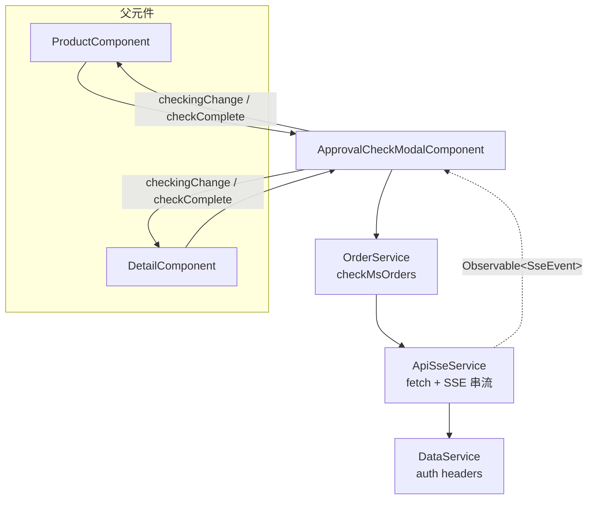
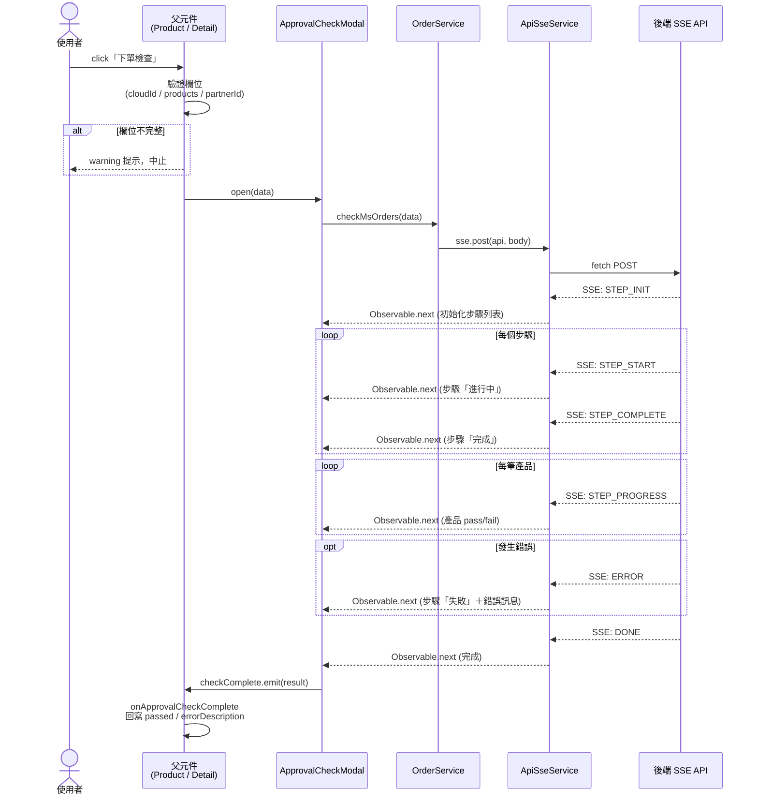
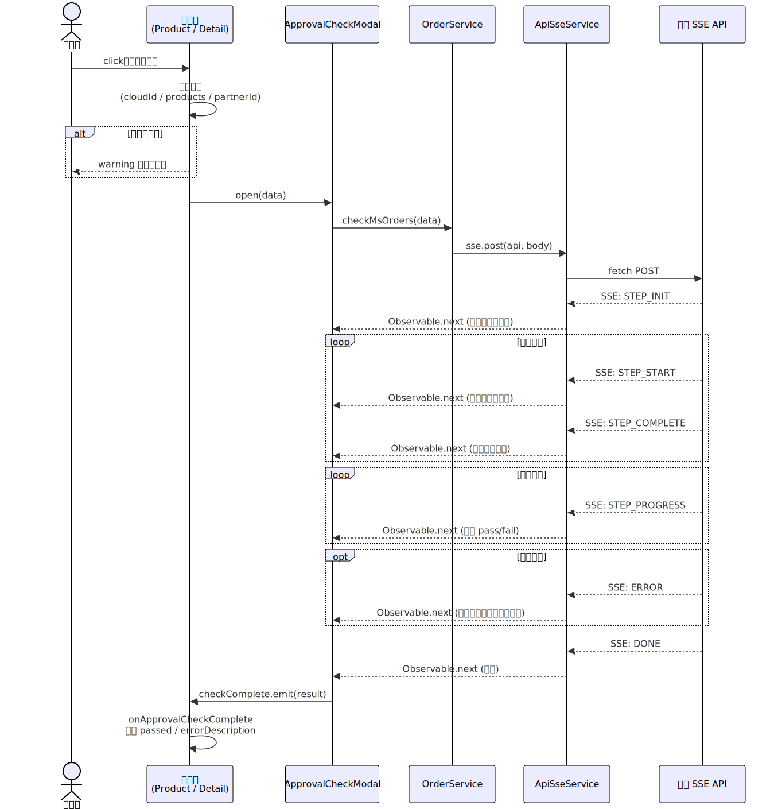

## 修訂紀錄

| **版本** | **日期** | **修訂內容** | **修訂者** |
| --- | --- | --- | --- |
| v1.0 | 2026-03-26 | 初始化文件 | Raelynn |

## 相關Jira單：

* CMP-4280 M1312260121008 的 訂變單 OC2620408 微軟下單檢核 timeout，前端需要支援SSE的API結構。
* CMP-4266 M1312260121008 的 訂變單 OC2620408 微軟下單檢核 timeout

## 目錄：

1. 目標
2. 功能需求
3. 實作架構設計
   * 3.1 系統流程圖
   * 3.2 元件關係圖
   * 3.3 序列圖
4. 實作
   * 4.1 後端 SSE 回應格式
   * 4.2 新增檔案
   * 4.3 修改檔案

## 1. 目標

微軟下單檢查（`Microsoft/checkProducts`）因檢核項目多、耗時較長，容易發生 HTTP timeout，使用者無法得知檢核進度及結果。

本次改版將原有的**同步 HTTP 請求**替換為**SSE（Server-Sent Events）串流**（`Microsoft/checkOrders`），並以 **Modal＋進度條** 的方式即時呈現各步驟與產品驗證進度，提升使用體驗並避免 timeout 問題。

---

## 2. 功能需求

| # | 需求 | 說明 |
|---|------|------|
| 1 | SSE 串流 API 支援 | 前端以 `fetch` + `ReadableStream` 接收 SSE 事件，取代原本的 `HttpClient.post` |
| 2 | Modal 彈窗顯示 | 點擊「下單檢查」按鈕後開啟 Modal，檢查期間不可關閉 |
| 3 | 開啟前欄位驗證 | 開啟 Modal 前驗證 Cloud ID、產品清單、Partner ID，缺少時以 warning 提示 |
| 4 | 步驟進度條 | 使用 `nz-steps` 顯示後端回傳的動態步驟（STEP_INIT），並即時更新各步驟狀態 |
| 5 | 產品驗證進度 | 最後一階段以清單列出每筆產品的 pass / fail 狀態及錯誤訊息 |
| 6 | 錯誤顯示 | 步驟失敗時停留於該步驟並顯示錯誤原因；產品驗證失敗顯示 `errorDescription` |
| 7 | 完成後可關閉 | 檢查完成後 Modal 底部才顯示「關閉」按鈕 |
| 8 | 結果回寫 | 檢查完成後將 `passed` 狀態及 `errorDescription` 回寫至父元件 |

---

## 3. 實作架構設計

### 3.1 系統流程圖




### 3.2 元件關係圖





### 3.3 序列圖





---

## 4. 實作

### 4.1 後端 SSE 回應格式

API：`POST Microsoft/checkOrders`
Content-Type：`text/event-stream`

每個 SSE 事件由 `event:` 與 `data:` 兩行組成，以空行 `\n\n` 分隔。各事件格式如下：

#### SSE 事件一覽

| 事件 | 說明 | 發送時機 |
|------|------|----------|
| `STEP_INIT` | 初始化步驟列表 | 連線建立後發送一次 |
| `STEP_START` | 標記步驟開始 | 每個步驟開始時 |
| `STEP_COMPLETE` | 標記步驟完成 | 每個步驟完成時 |
| `STEP_PROGRESS` | 產品逐筆驗證結果 | 最後一步（驗證產品）逐筆回報 |
| `ERROR` | 步驟失敗 | 任一步驟發生錯誤時 |
| `DONE` | 全部完成 | 所有步驟與產品驗證結束後 |

#### 共用欄位

| 欄位 | 型別 | 說明 |
|------|------|------|
| `eventType` | `string` | 事件類型，與 `event:` 行一致 |
| `message` | `string` | 步驟描述或結果訊息 |
| `progress` | `number` | 整體進度百分比（0–100） |
| `timestamp` | `number` | Unix timestamp（ms） |

#### 各事件 `data` 欄位

**STEP_INIT**

| 欄位 | 型別 | 說明 |
|------|------|------|
| `totalSteps` | `number` | 總步驟數 |
| `data` | `string[]` | 各步驟描述，如 `["驗證合作夥伴資訊", "取得原廠客戶資訊", ...]` |

**STEP_START / STEP_COMPLETE**

| 欄位 | 型別 | 說明 |
|------|------|------|
| `stepIndex` | `number` | 步驟索引（**1-based**） |
| `totalSteps` | `number` | 總步驟數 |

**STEP_PROGRESS**

| 欄位 | 型別 | 說明 |
|------|------|------|
| `data.index` | `number` | 產品索引（**0-based**） |
| `data.valid` | `boolean` | 該產品是否驗證通過 |

> 驗證失敗時 `data` 中會額外包含 `errorDescription` 欄位。

**ERROR**

| 欄位 | 型別 | 說明 |
|------|------|------|
| `stepIndex` | `number` | 失敗的步驟索引（1-based） |
| `message` | `string` | 錯誤訊息 |

**DONE**

| 欄位 | 型別 | 說明 |
|------|------|------|
| `data` | `string` | 完成訊息，如 `"檢查商品完成"` |

#### 完整範例

```
event:STEP_INIT
data:{"eventType":"STEP_INIT","message":"步驟初始化","totalSteps":4,"data":["驗證合作夥伴資訊","取得原廠客戶資訊","取得原廠商品資訊","驗證產品"],"timestamp":1774852473733}

event:STEP_START
data:{"eventType":"STEP_START","message":"驗證合作夥伴資訊","stepIndex":1,"totalSteps":4,"progress":0,"timestamp":1774852473734}

event:STEP_COMPLETE
data:{"eventType":"STEP_COMPLETE","message":"驗證合作夥伴資訊","stepIndex":1,"totalSteps":4,"progress":25,"timestamp":1774852481746}

event:STEP_START
data:{"eventType":"STEP_START","message":"取得原廠客戶資訊","stepIndex":2,"totalSteps":4,"progress":25,"timestamp":1774852481746}

event:STEP_COMPLETE
data:{"eventType":"STEP_COMPLETE","message":"取得原廠客戶資訊","stepIndex":2,"totalSteps":4,"progress":50,"timestamp":1774852497440}

event:STEP_START
data:{"eventType":"STEP_START","message":"取得原廠商品資訊","stepIndex":3,"totalSteps":4,"progress":50,"timestamp":1774852497441}

event:STEP_COMPLETE
data:{"eventType":"STEP_COMPLETE","message":"取得原廠商品資訊","stepIndex":3,"totalSteps":4,"progress":75,"timestamp":1774852498045}

event:STEP_START
data:{"eventType":"STEP_START","message":"驗證產品","stepIndex":4,"totalSteps":4,"progress":75,"timestamp":1774852498045}

event:STEP_PROGRESS
data:{"eventType":"STEP_PROGRESS","message":"驗證通過","progress":83,"data":{"valid":true,"index":0},"timestamp":1774852498046}

event:STEP_PROGRESS
data:{"eventType":"STEP_PROGRESS","message":"驗證通過","progress":91,"data":{"valid":true,"index":1},"timestamp":1774852498046}

event:STEP_PROGRESS
data:{"eventType":"STEP_PROGRESS","message":"驗證通過","progress":100,"data":{"valid":true,"index":2},"timestamp":1774852498046}

event:STEP_COMPLETE
data:{"eventType":"STEP_COMPLETE","message":"驗證產品","stepIndex":4,"totalSteps":4,"progress":100,"timestamp":1774852498046}

event:DONE
data:{"eventType":"DONE","progress":100,"data":"檢查商品完成","timestamp":1774852498046}
```

---

### 4.2 新增檔案

#### 4.2.1 `src/app/core/services/api-sse.service.ts`（新增）

SSE 串流服務，負責透過 `fetch` API 發送 POST 請求並以 `ReadableStream` 解析 SSE 事件。

| 方法 | 說明 |
|------|------|
| `post(api, body, headers?)` | 公開方法，回傳 `Observable<SseEvent>`，取消訂閱時自動 abort 請求 |
| `doFetch()` | 執行 `fetch`，成功時交由 `readStream()` 讀取；失敗時交由 `handleHttpError()` |
| `readStream()` | 以 `ReadableStream.getReader()` 逐塊讀取，以 `\n\n` 分割 SSE 事件區塊 |
| `handleHttpError()` | 比照 `ApiService.apiErrorHandle`：401 等待 token 更新後重試、其他狀態解析錯誤訊息 |
| `waitForTokenRefresh()` | 比照 `ApiService.getRefreshTokenIsUpdate`，輪詢 `DataService.refreshToken` 變化 |
| `parseAndEmit()` | 解析 SSE 區塊中的 `event:` 和 `data:` 行，JSON 解析後透過 `NgZone.run()` 發出事件 |

**關鍵設計：**
- 使用原生 `fetch` 而非 `HttpClient`（因 `HttpClient` 不支援 SSE 串流讀取）
- 所有 callback 透過 `NgZone.run()` 確保 Angular 變更偵測正確觸發
- `Accept` header 設為 `text/event-stream, application/json, text/plain, */*` 以相容後端回應

**介面定義：**
```typescript
export interface SseEvent {
  event: string;  // 事件類型：STEP_INIT, STEP_START, STEP_COMPLETE, STEP_PROGRESS, ERROR, DONE
  data: any;      // data 行解析後的 JSON 物件
}
```

**程式碼：**
```typescript
/** SSE 事件解析結果 */
export interface SseEvent {
  /** event: 行的值，例如 'STEP_START', 'STEP_COMPLETE', 'DONE' */
  event: string;
  /** data: 行解析後的 JSON 物件 */
  data: any;
}

@Injectable({
  providedIn: 'root'
})
export class ApiSseService {

  constructor(
    private zone: NgZone,
    private dataService: DataService,
  ) {}

  /**
   * 發送 POST 請求並以 SSE 串流方式接收回應
   * @param api API 路徑（會自動加上 apiUrl 前綴）
   * @param body 請求 body（會自動 JSON.stringify）
   * @param headers 額外的 headers
   * @returns Observable<SseEvent>，每個 SSE 事件區塊發出一個值
   */
  post(api: string, body: any, headers?: Record<string, string>): Observable<SseEvent> {
    return new Observable<SseEvent>(observer => {
      const abortController = new AbortController();

      this.doFetch(api, body, headers, abortController, observer);

      // 取消訂閱時中斷請求
      return () => abortController.abort();
    });
  }

  /** 執行 fetch 請求 */
  private doFetch(
    api: string,
    body: any,
    headers: Record<string, string> | undefined,
    abortController: AbortController,
    observer: Subscriber<SseEvent>,
  ): void {
    const url = `${environment['apiUrl']}/${api}`;

    const defaultHeaders: Record<string, string> = {
      'Content-Type': 'application/json',
      'Accept': 'text/event-stream, application/json, text/plain, */*',
      ...this.dataService.getHeaderData() as Record<string, string>,
    };

    fetch(url, {
      method: 'POST',
      headers: { ...defaultHeaders, ...headers },
      body: JSON.stringify(body),
      signal: abortController.signal,
    }).then(async response => {
      if (!response.ok || !response.body) {
        await this.handleHttpError(response, api, body, headers, abortController, observer);
        return;
      }

      this.readStream(response.body, observer);
    }).catch(err => {
      if (err.name !== 'AbortError') {
        this.zone.run(() => observer.error(err));
      }
    });
  }

  /** 讀取 SSE 串流 */
  private readStream(body: ReadableStream<Uint8Array>, observer: Subscriber<SseEvent>): void {
    const reader = body.getReader();
    const decoder = new TextDecoder();
    let buffer = '';

    const read = (): void => {
      reader.read().then(({ done, value }) => {
        if (done) {
          if (buffer.trim()) {
            this.parseAndEmit(buffer, observer);
          }
          this.zone.run(() => observer.complete());
          return;
        }

        buffer += decoder.decode(value, { stream: true });

        // SSE 事件以空行分隔
        const blocks = buffer.split('\n\n');
        // 最後一個 block 可能不完整，保留在 buffer
        buffer = blocks.pop() || '';

        for (const block of blocks) {
          if (block.trim()) {
            this.parseAndEmit(block, observer);
          }
        }

        read();
      }).catch(err => {
        if (err.name !== 'AbortError') {
          this.zone.run(() => observer.error(err));
        }
      });
    };

    read();
  }

  /**
   * HTTP 錯誤處理（比照 ApiService.apiErrorHandle）
   * - 401: 等待 token 更新後自動重試
   * - 其他: 解析 response body 取得錯誤訊息
   */
  private async handleHttpError(
    response: Response,
    api: string,
    body: any,
    headers: Record<string, string> | undefined,
    abortController: AbortController,
    observer: Subscriber<SseEvent>,
  ): Promise<void> {
    const status = response.status;
    console.error(`[API-SSE] POST error`, `HTTP ${status}`);

    // 401: 等待 token 更新後重試（比照 ApiService 的 401 → getRefreshTokenIsUpdate → switchMap 重試）
    if (status === 401) {
      this.waitForTokenRefresh().then(() => {
        // token 更新後以新的 headers 重試
        this.doFetch(api, body, headers, abortController, observer);
      });
      return;
    }

    // 嘗試讀取 response body 解析錯誤訊息
    let errorMessage = `HTTP ${status}`;
    try {
      const errorBody = await response.json();
      errorMessage =
        errorBody?.info?.message ||
        `${errorBody?.error || ''} ${errorBody?.message || ''}`.trim() ||
        errorMessage;
    } catch {
      // response body 不是 JSON，使用預設錯誤訊息
    }

    this.zone.run(() => observer.error(new Error(errorMessage)));
  }

  /**
   * 等待 token 更新完成（比照 ApiService.getRefreshTokenIsUpdate）
   * 當偵測到 refreshToken 變化時 resolve
   */
  private waitForTokenRefresh(): Promise<void> {
    return new Promise(resolve => {
      let oldRefreshToken = this.dataService.refreshToken;
      let newRefreshToken = this.dataService.refreshToken;

      if (oldRefreshToken && newRefreshToken) {
        // 超時後 call API 的情況
        const timer = setInterval(() => {
          newRefreshToken = this.dataService.refreshToken;
          if (oldRefreshToken !== newRefreshToken) {
            clearInterval(timer);
            resolve();
          } else {
            oldRefreshToken = newRefreshToken;
          }
        }, 1000);
      } else if (!oldRefreshToken && !newRefreshToken) {
        // 重新整理，refreshToken = undefined 情況
        const timer = setInterval(() => {
          newRefreshToken = this.dataService.refreshToken;
          if (oldRefreshToken && newRefreshToken) {
            clearInterval(timer);
            resolve();
          } else {
            oldRefreshToken = newRefreshToken;
          }
        }, 1000);
      } else {
        resolve();
      }
    });
  }

  /** 解析 SSE 區塊並發出事件 */
  private parseAndEmit(block: string, observer: Subscriber<SseEvent>): void {
    const lines = block.split('\n');
    let eventType = '';
    let dataStr = '';

    for (const line of lines) {
      if (line.startsWith('event:')) {
        eventType = line.slice(6).trim();
      } else if (line.startsWith('data:')) {
        dataStr = line.slice(5).trim();
      }
    }

    if (!dataStr) return;

    try {
      const data = JSON.parse(dataStr);
      this.zone.run(() => {
        observer.next({
          event: eventType || data.eventType || '',
          data,
        });
      });
    } catch (e) {
      console.warn('SSE parse error:', e);
    }
  }
}
```

---

#### 4.2.2 `src/app/share/components/approval-check-modal/`（新增）

共用元件，包含 `.component.ts`、`.component.html`、`.component.scss`。

**Inputs / Outputs：**

| 類型 | 名稱 | 型別 | 說明 |
|------|------|------|------|
| Output | `checkComplete` | `EventEmitter<ApprovalCheckResult>` | 檢查完成事件，回傳 `{ passed, products }` |
| Output | `checkingChange` | `EventEmitter<boolean>` | 檢查中狀態變更事件 |

**公開方法：**

| 方法 | 說明 |
|------|------|
| `open(data: ApprovalCheckData)` | 開啟 Modal 並自動開始 SSE 檢查 |
| `close()` | 關閉 Modal，取消 SSE 訂閱 |

**SSE 事件處理邏輯：**

| 事件 | 處理 |
|------|------|
| `STEP_INIT` | `data.data` 為步驟描述字串陣列，動態建立 `CheckStep[]` |
| `STEP_START` | 將 `steps[stepIndex-1]` 設為 `'process'`，更新 `currentStepIndex` |
| `STEP_COMPLETE` | 將 `steps[stepIndex-1]` 設為 `'finish'` |
| `STEP_PROGRESS` | 依 `data.data.index`（0-based）更新 `productCheckStatuses[index]` 為 `'pass'` 或 `'fail'`，並回寫 `errorDescription` |
| `ERROR` | 將步驟設為 `'error'`、`stepsStatus = 'error'`，記錄 `errorMessage` |
| `DONE` | 綜合判斷：所有步驟無 error 且所有產品 pass → `passed = true`，觸發 `checkComplete` |

**UI 行為：**
- 步驟進度條使用 `nz-steps`，步驟標題格式：`描述前兩字 + 狀態翻譯`（如「驗證完成」「取得失敗」）
- 檢查期間 Modal 不可關閉（`nzClosable` / `nzMaskClosable` = false）
- 最後一階段以 `nz-list` 顯示每筆產品的驗證結果（✓ pass / ✕ fail / loading）
- 步驟 ≤ 2 時容器寬度 70%，避免過於空曠

**程式碼：**

---

### 4.3 修改檔案

#### 4.3.1 `src/app/share/services/order.service.ts`

新增 `checkMsOrders()` 方法，透過 `ApiSseService.post()` 呼叫 `Microsoft/checkOrders` SSE API：

```typescript
/** 檢查產品 U 數（SSE 串流） */
checkMsOrders(data: { cloudId, products, originalInfo }): Observable<SseEvent> {
  return this.sse.post(this.gateway.order + 'Microsoft/checkOrders', new RequestData(data));
}
```

#### 4.3.2 `src/app/orders/sub-order/products/product.component.ts`

| 項目 | 修改前 | 修改後 |
|------|--------|--------|
| 方法名 | `checkProducts()` | `openApprovalCheck()` |
| 呼叫方式 | 直接呼叫 `MicrosoftDataProviderService.checkProducts()` | 開啟前檢查 `cloudId`、`products`、`originalInfo['partnerId']` <br> → 缺少則 warning 並 return <br><br> → 檢查完 <br> → `approvalCheckModal.open()` |
| 結果處理 | subscribe callback | `onApprovalCheckComplete(result)` 回寫 `ui.isChecked`、`errorDescription` |

**程式碼：**

#### 4.3.3 `src/app/orders/sub-order/products/product.component.html`

| 項目 | 修改前 | 修改後 |
|------|--------|--------|
| 按鈕綁定 | `(click)="checkProducts()"` | `(click)="openApprovalCheck()"` |
| Loading 狀態 | `[nzLoading]="dataProvider.ui.isChecking"` | `[nzLoading]="isApprovalChecking"` |
| 圖示判斷 | `@if (!dataProvider.ui.isChecking)` | `@if (!isApprovalChecking)` |
| 新增元件 | — | `<app-approval-check-modal>` 並綁定 `checkingChange`、`checkComplete` Output |

**程式碼：**

#### 4.3.4 `src/app/modification/detail/detail.component.ts`

| 項目 | 修改前 | 修改後 |
|------|--------|--------|
| 方法名 | `checkProducts()` | `openApprovalCheck()` |
| 呼叫方式 | 直接呼叫 `MicrosoftDataProviderService.checkProducts()` | 開啟前檢查 `cloudId`、`products`、`originalInfo['partnerId']` <br> → 缺少則 warning 並 return <br><br> → 檢查完 <br> → `approvalCheckModal.open()` |
| 結果處理 | subscribe callback 直接更新 `subOrder` | `onApprovalCheckComplete(result)` 回寫 `productCheck`、`errorDescription` |
| 新增屬性 | — | `approvalCheckIndex`、`approvalCheckSubOrder` 記錄當前檢查的子單 |

**程式碼：**

#### 4.3.5 `src/app/modification/detail/detail.component.html`

| 項目 | 修改前 | 修改後 |
|------|--------|--------|
| 按鈕綁定 | `(click)="checkProducts(subOrder, i)"` | `(click)="openApprovalCheck(subOrder, i)"` |
| 新增元件 | — | `<app-approval-check-modal>` 並綁定 `checkingChange`（寫入 `ui.isChecking[approvalCheckIndex]`）、`checkComplete` Output |

**程式碼：**

#### 4.3.6 `src/app/share/share.module.ts`

- 新增 `ApprovalCheckModalComponent` 至 `declarations` 與 `exports`
- 新增 `NzStepsModule`、`NzProgressModule` 至 `imports`

**程式碼：**


#### 4.3.7 `src/app/orders/model/data-tool.component.ts`

PM 審核階段判斷子單是否需要下單檢查時，新增 `OrderProductStatus.fail`（下單失敗）為免檢查條件：

| 項目 | 修改前 | 修改後 |
|------|--------|--------|
| 免檢查的產品狀態 | `activate`、`removed`、`pending` | `activate`、**`fail`**、`removed`、`pending` |

> 原先只跳過已下單（activate）、已移除（removed）、待處理（pending）的品項；因 SSE 改版後下單失敗的品項也不應再重複檢查，故補上 `fail` 狀態。

**程式碼：**

#### 4.3.8 `src/assets/i18n/zh-tw.json`

新增 i18n 翻譯鍵：

| Key | Value |
|-----|-------|
| `product` | 產品 |
| `approval checking message` | 微軟下單檢查中，請稍候⋯⋯ |
| `approval success` | 完成 |
| `approval fail` | 失敗 |
| `approval in progress` | 進行中 |
| `approval waiting` | 等待 |
