# CMP-4300 帳單列表加入搜尋與金額排序 — 測試結果報告

## 版本紀錄

| 版本 | 日期 | 修訂內容 | 修訂者 |
|------|------|---------|--------|
| 1.0 | 2026-06-01 | 初版測試設計（建立測項清單） | Raelynn |
| 1.1 | 2026-06-02 | UAT 實測 TC-01~TC-15 全數 Pass，回填結果與截圖 | Raelynn |
| 1.2 | 2026-06-02 | 計費時間月選擇器顯示修正補註 | Raelynn |

---

## 一、測試資訊

| 項目 | 內容 |
|------|------|
| Jira 單號 | CMP-4300 |
| 測試環境 | CMP UAT：https://cmp-uat-100.metaage.com.tw |
| 後端 | https://cmp-uat-100-svc.metaage.com.tw |
| 測試帳號 | raelynnlin@metaage.com.tw（統編 16428796） |
| 測試身份 | 業務（代理商視角，單一帳單表格） |
| 測試工具 | agent-browser (Chrome) |
| 驗證方式 | XHR 攔截 `POST …/lockedInvoices` 之 request payload，檢查 `filter.and / or / sort / pageIndex` |
| 受測檔案 | `bills-data.dataProvider.ts`、`bills-list.component.ts`、`bills-list.component.html`、`zh-tw.json` |
| 測試者 | Raelynn |
| 測試日期 | 2026-06-02 |

---

## 二、測試案例總覽

| 編號 | 群組 | 測項 | 結果 |
|------|------|------|------|
| [TC-01](#tc01) | 搜尋列與欄位搜尋 | 訂單單號文字搜尋（LIKE）+ 近三月預設 | ✅ Pass |
| [TC-02](#tc02) | 搜尋列與欄位搜尋 | 帳單月份（invoiceDate→year/month），不帶近三月 OR | ✅ Pass |
| [TC-03](#tc03) | 搜尋列與欄位搜尋 | 計費時間範圍（billingStartDate / billingEndDate） | ✅ Pass |
| [TC-04](#tc04) | 搜尋列與欄位搜尋 | 出帳幣別單選（currency EQ） | ✅ Pass |
| [TC-05](#tc05) | 金額範圍搜尋與驗證 | 未稅範圍 → 單一 WITHIN | ✅ Pass |
| [TC-06](#tc06) | 金額範圍搜尋與驗證 | 含稅範圍 → 單一 WITHIN | ✅ Pass |
| [TC-07](#tc07) | 金額範圍搜尋與驗證 | 只填單邊 → 不查詢並警告 | ✅ Pass |
| [TC-08](#tc08) | 金額範圍搜尋與驗證 | 兩邊皆空 → 不含金額條件 | ✅ Pass |
| [TC-09](#tc09) | 金額欄位排序 | 未稅欄位排序生效、條件保留 | ✅ Pass |
| [TC-10](#tc10) | 金額欄位排序 | 含稅欄位排序生效、條件保留 | ✅ Pass |
| [TC-11](#tc11) | 金額欄位排序 | 多次切換排序，條件不流失、OR 不堆疊 | ✅ Pass |
| [TC-12](#tc12) | 排序／翻頁重查 | 翻頁條件保留、pageIndex 正確 | ✅ Pass |
| [TC-13](#tc13) | 排序／翻頁重查 | 金額範圍 + 翻頁，WITHIN 保留 | ✅ Pass |
| [TC-14](#tc14) | 排序／翻頁重查 | 帳單月份 + 排序，year/month 重查冪等 | ✅ Pass |
| [TC-15](#tc15) | 排序／翻頁重查 | 計費時間 + 排序，billingStart/End 值不二次轉換 | ✅ Pass |

> **共通檢查（近三個月預設）**：只要未指定「帳單月份」，送出的 payload `filter.or` 應自動帶近三個月的 `year/month` OR（3 組）；各測項（TC-02／TC-14 除外）執行時一併確認其存在，且排序／翻頁重查時不重複堆疊。

---

## 三、測試準備

1. **登入 UAT**：開啟 `https://cmp-uat-100.metaage.com.tw`，以測試帳號完成 Microsoft 帳號登入，進入帳單頁 `/main/bills/billsList`。
2. **確認部署**：帳單列表上方應顯示 `ma-search` 搜尋列，且「出帳金額(未稅)」「出帳金額(含稅)」欄位標頭可點擊排序。
3. **安裝 XHR 攔截器**（攔 `lockedInvoices`，詳見附錄 A）。頁面導航／重載會清空攔截器，需重新安裝。
4. **驗證重點**：每次操作後讀取 `window.__cap` 內最後一次 `lockedInvoices` 的 request payload，比對 `filter.and / or / sort / pageIndex`。
5. **截圖路徑**：`documents/CMP-4300/screenshots/`，命名 `{TC編號}-{描述}.png`。

---

## 四、測試案例

### 群組一、搜尋列與欄位搜尋

#### <a id="tc01"></a>TC-01 — 訂單單號文字搜尋（LIKE）+ 近三月預設

| 項目 | 內容 |
|------|------|
| 前置 | 已登入、在帳單頁、已裝攔截器 |
| 步驟 | ① 訂單單號輸入「M131226」 ② 點「搜尋」 |
| 預期 | 對應欄位以 `LIKE` 送出、列表更新；未指定帳單月份，`or` 應帶近三月 3 組 |
| 實際 | `and = [orderErpNumber:LIKE "M131226", createCompanyId:EQ]`；`or` 近三月 3 組；回 10 筆 |
| 截圖 | 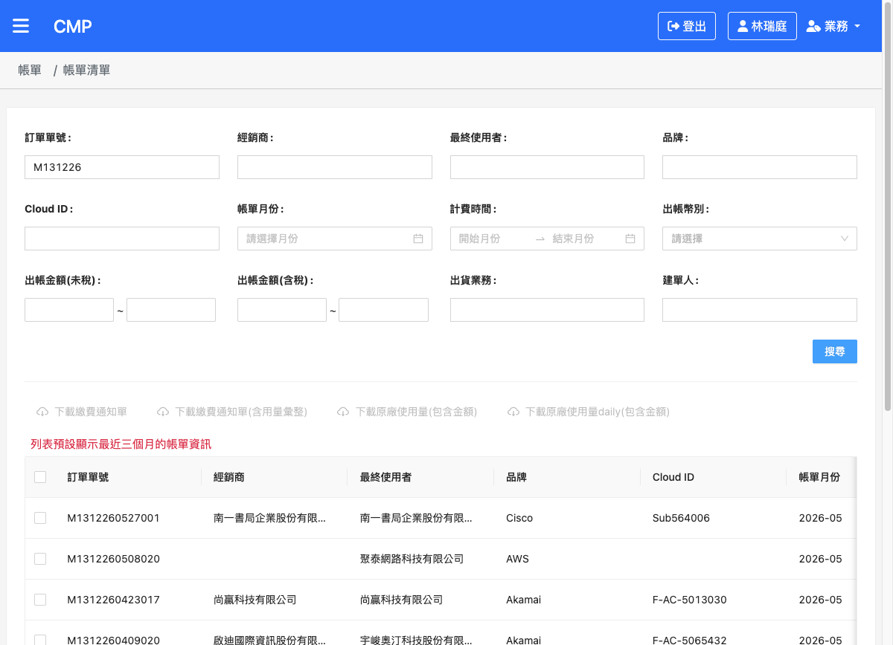 |
| 結果 | ✅ Pass |

<br>

#### <a id="tc02"></a>TC-02 — 帳單月份搜尋（invoiceDate → year/month）

| 項目 | 內容 |
|------|------|
| 前置 | 同上 |
| 步驟 | ① 帳單月份選 2026-04 ② 點「搜尋」 |
| 預期 | `and` 含 `year/month`；**不帶**近三月 OR（`or`=0） |
| 實際 | `and = [year:EQ "2026", month:EQ "04", createCompanyId:EQ]`；`or` = 0；回 10 筆 |
| 截圖 | 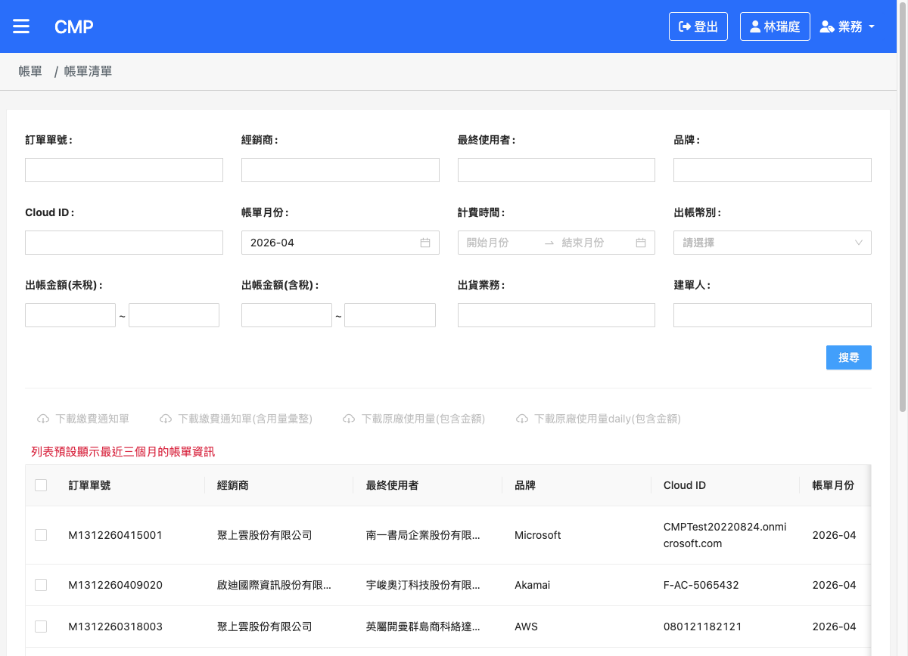 |
| 結果 | ✅ Pass |

<br>

#### <a id="tc03"></a>TC-03 — 計費時間範圍搜尋（billingDate）

| 項目 | 內容 |
|------|------|
| 前置 | 同上 |
| 步驟 | ① 計費時間選 2026-01 ~ 2026-05 ② 點「搜尋」 |
| 預期 | 輸入框顯示為年月（yyyy-MM）；送出 `billingStartDate: GTE 月初`、`billingEndDate: LTE 當月最後一天` |
| 實際 | 輸入框顯示 `2026-01` / `2026-05`；送出 `billingStartDate:GTE "2026-01-01"`、`billingEndDate:LTE "2026-05-31"`（5 月最後一天）；`or` 3 |
| 截圖 | 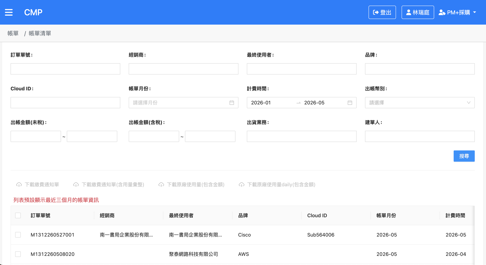 |
| 結果 | ✅ Pass |
| 備註 | 月選擇器補上 `format:'yyyy-MM'`，修正先前輸入框會帶出當天「日」（如 2026-01-02）的顯示問題；送出值不受影響 |

<br>

#### <a id="tc04"></a>TC-04 — 出帳幣別單選搜尋

| 項目 | 內容 |
|------|------|
| 前置 | 同上 |
| 步驟 | ① 出帳幣別選 USD ② 點「搜尋」 |
| 預期 | payload 含 `currency: EQ USD` |
| 實際 | `currency:EQ "USD"`；`or` 3；回 10 筆 |
| 截圖 | 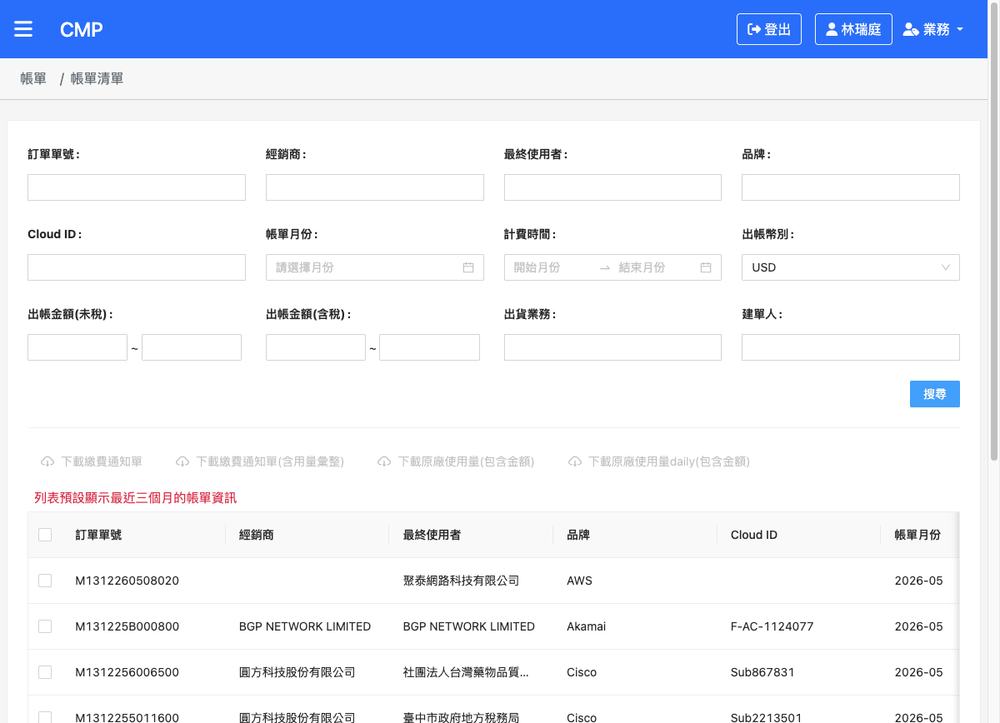 |
| 結果 | ✅ Pass |

---

### 群組二、金額範圍搜尋與驗證

#### <a id="tc05"></a>TC-05 — 出帳金額(未稅)範圍搜尋 → 單一 WITHIN

| 項目 | 內容 |
|------|------|
| 前置 | 同上 |
| 步驟 | ① 未稅下限 1000、上限 10000 ② 點「搜尋」 |
| 預期 | payload 含單一 `totalAmountIncludeExchangeRate: WITHIN [1000,10000]`（非 GTE/LTE 兩段） |
| 實際 | `totalAmountIncludeExchangeRate: WITHIN [1000,10000]`（單一條件）；`or` 3 |
| 截圖 | 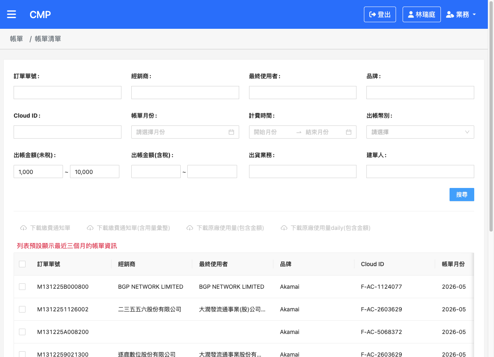 |
| 結果 | ✅ Pass |

<br>

#### <a id="tc06"></a>TC-06 — 出帳金額(含稅)範圍搜尋 → 單一 WITHIN

| 項目 | 內容 |
|------|------|
| 前置 | 同上 |
| 步驟 | ① 含稅下限 2000、上限 20000 ② 點「搜尋」 |
| 預期 | payload 含 `totalAmountIncludeExchangeRateAndTax: WITHIN [min,max]` |
| 實際 | `totalAmountIncludeExchangeRateAndTax: WITHIN [2000,20000]`；`or` 3 |
| 截圖 | 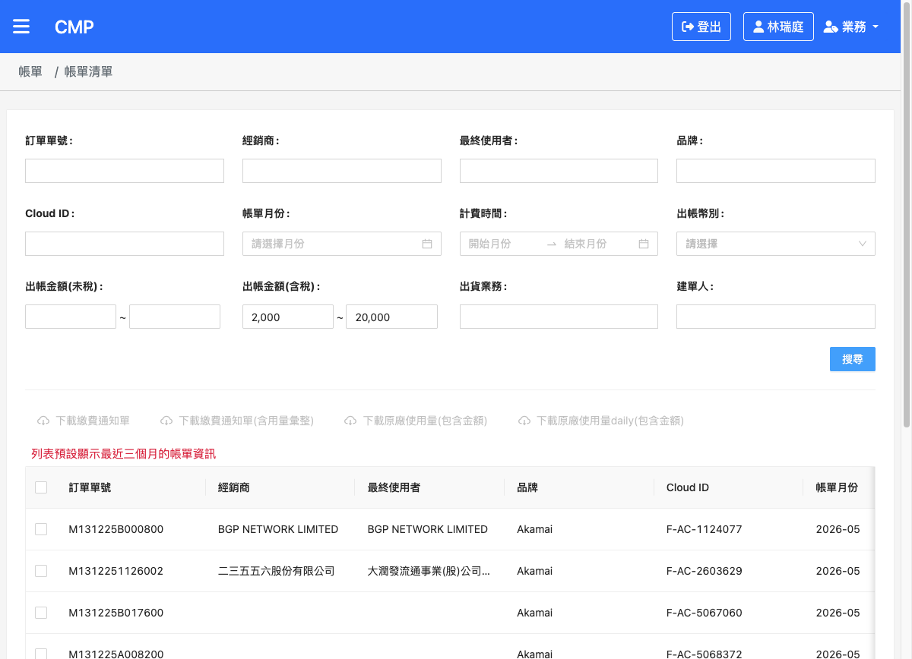 |
| 結果 | ✅ Pass |

<br>

#### <a id="tc07"></a>TC-07 — 金額只填單邊 → 不查詢並警告

| 項目 | 內容 |
|------|------|
| 前置 | 同上 |
| 步驟 | ① 只填未稅下限 5000、上限留空 ② 點「搜尋」 |
| 預期 | **不送查詢**並跳警告「金額範圍須同時填寫下限與上限」 |
| 實際 | 未送查詢（攔截 0 筆）並跳警告「金額範圍須同時填寫下限與上限」 |
| 截圖 | 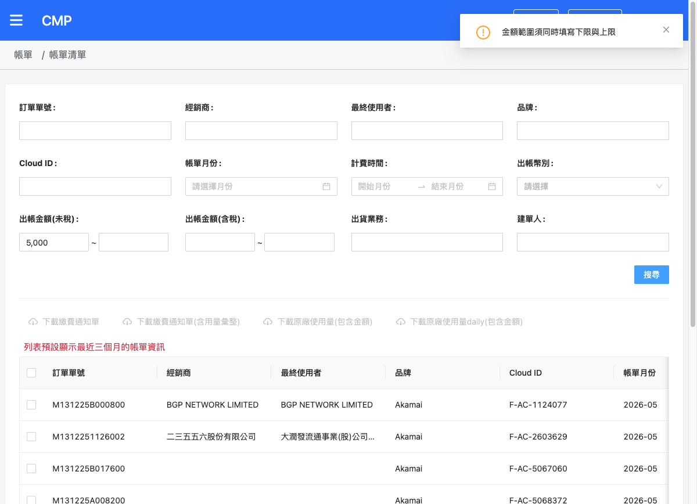 |
| 結果 | ✅ Pass |

<br>

#### <a id="tc08"></a>TC-08 — 金額兩邊皆空 → 不含金額條件

| 項目 | 內容 |
|------|------|
| 前置 | 同上 |
| 步驟 | ① 金額皆不填 ② 點「搜尋」 |
| 預期 | 正常查詢，payload 不含金額條件 |
| 實際 | `and` 僅 `createCompanyId`，無金額條件；`or` 3；回 10 筆 |
| 截圖 |  |
| 結果 | ✅ Pass |

---

### 群組三、金額欄位排序

#### <a id="tc09"></a>TC-09 — 出帳金額(未稅)欄位排序生效

| 項目 | 內容 |
|------|------|
| 前置 | 已以金額範圍(1000~10000)搜尋 |
| 步驟 | 點「出帳金額(未稅)」欄位標頭 |
| 預期 | `sort` 帶 `totalAmountIncludeExchangeRate` 且排在 `invoiceDate/_id` 前；金額 `WITHIN` 條件保留 |
| 實際 | `sort = {totalAmountIncludeExchangeRate:ASC, invoiceDate:DESC, _id:DESC}`；`WITHIN[1000,10000]` 保留；`or` 3 |
| 截圖 | 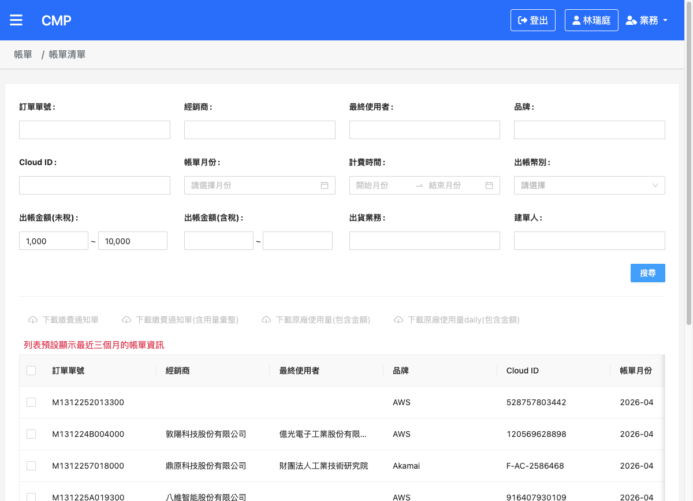 |
| 結果 | ✅ Pass |

<br>

#### <a id="tc10"></a>TC-10 — 出帳金額(含稅)欄位排序生效

| 項目 | 內容 |
|------|------|
| 前置 | 同 TC-09 結果 |
| 步驟 | 點「出帳金額(含稅)」欄位標頭 |
| 預期 | `sort` 含含稅欄位在前；條件保留 |
| 實際 | `sort = {totalAmountIncludeExchangeRateAndTax:ASC, invoiceDate, _id}`；`WITHIN` 保留；`or` 3 |
| 截圖 |  |
| 結果 | ✅ Pass |

<br>

#### <a id="tc11"></a>TC-11 — 多次切換排序，條件不流失、OR 不堆疊

| 項目 | 內容 |
|------|------|
| 前置 | 已有金額範圍搜尋結果 |
| 步驟 | 連續切換排序：未稅 ASC → 含稅 ASC → 含稅 DESC（第 3 次重查） |
| 預期 | 每次條件不流失；近月 OR 維持原數量（不堆疊）；排序方向正確切換 |
| 實際 | 第 3 次重查仍 `WITHIN[1000,10000]` 保留、`or` 維持 3（不堆疊）、`sort` 切為 `含稅:DESC` |
| 截圖 | 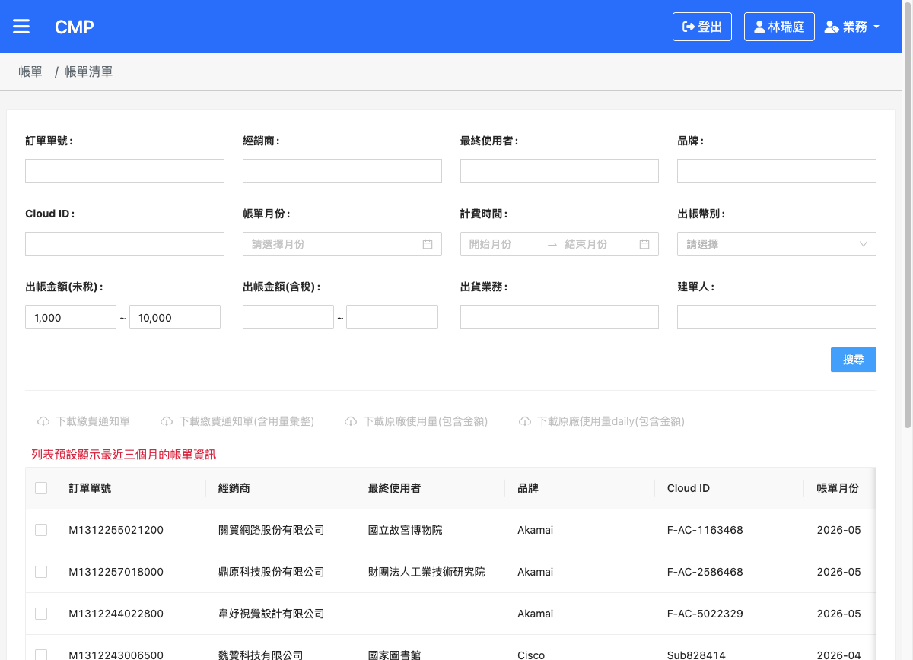 |
| 結果 | ✅ Pass |

---

### 群組四、排序／翻頁重查（條件保留與冪等）

#### <a id="tc12"></a>TC-12 — 翻頁條件保留、pageIndex 正確

| 項目 | 內容 |
|------|------|
| 前置 | 列表為多頁（金額 1000~10000 共 23 頁） |
| 步驟 | 翻至第 2 頁 |
| 預期 | `pageIndex=2`；`createCompanyId` 不重複；OR 不堆疊 |
| 實際 | `pageIndex=2`；`createCompanyId` 單一；`or` 3 |
| 截圖 | 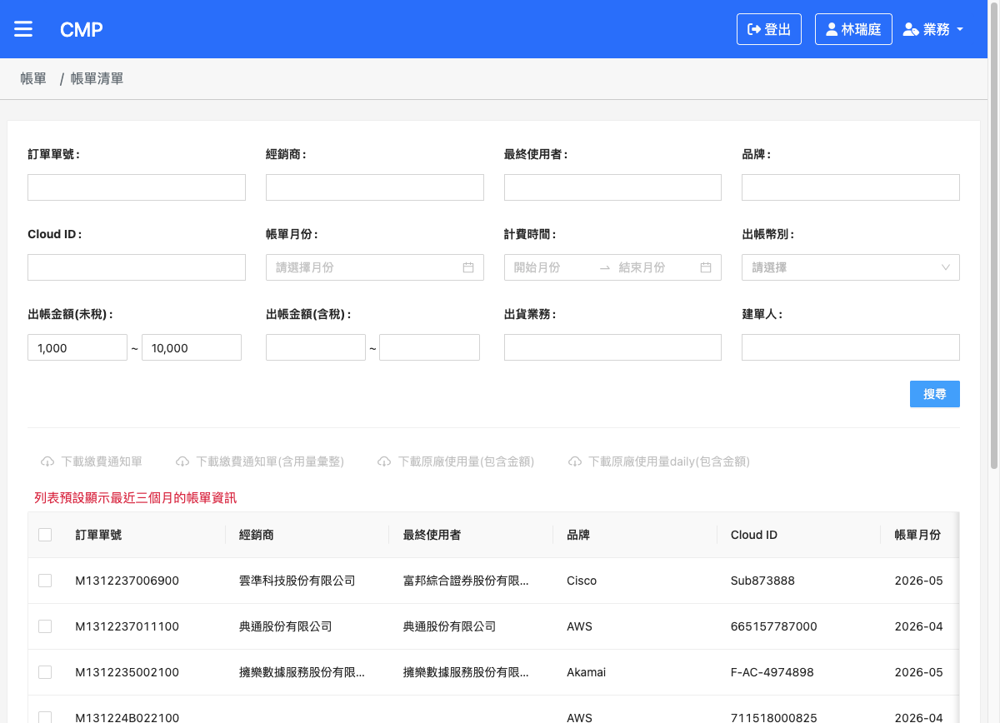 |
| 結果 | ✅ Pass |

<br>

#### <a id="tc13"></a>TC-13 — 金額範圍 + 翻頁，WITHIN 保留

| 項目 | 內容 |
|------|------|
| 前置 | 金額範圍搜尋且多頁 |
| 步驟 | 翻至第 2 頁 |
| 預期 | `WITHIN` 條件保留；`pageIndex=2`；OR 不堆疊 |
| 實際 | `WITHIN[1000,10000]` 保留；`pageIndex=2`；`or` 3；`sort` 維持 |
| 截圖 |  |
| 結果 | ✅ Pass |

<br>

#### <a id="tc14"></a>TC-14 — 帳單月份 + 排序，year/month 重查冪等

| 項目 | 內容 |
|------|------|
| 前置 | 已以帳單月份（2026-04）搜尋（TC-02） |
| 步驟 | 點金額排序 |
| 預期 | `year/month` 原樣保留、未被二次拆解；`or` 仍為 0 |
| 實際 | `year:2026, month:04` 原樣保留；`or` 仍 0；`sort` 未稅在前 |
| 截圖 | 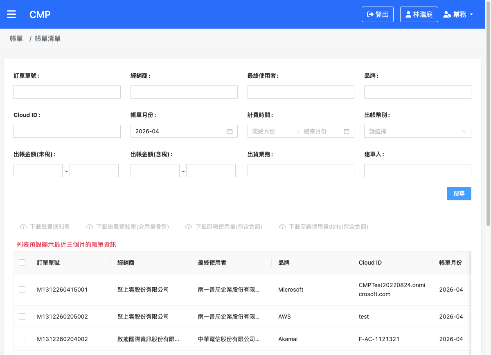 |
| 結果 | ✅ Pass |

<br>

#### <a id="tc15"></a>TC-15 — 計費時間 + 排序，billingStart/End 值不二次轉換

| 項目 | 內容 |
|------|------|
| 前置 | 已以計費時間（2026-01~05）搜尋（TC-03） |
| 步驟 | 點金額排序 |
| 預期 | `billingStartDate/billingEndDate` 欄名與值與首查相同、未被二次轉換 |
| 實際 | `billingStartDate:"2026-01-01"`、`billingEndDate:"2026-05-31"` 與首查相同、未變；`or` 3；`sort` 在前 |
| 截圖 | 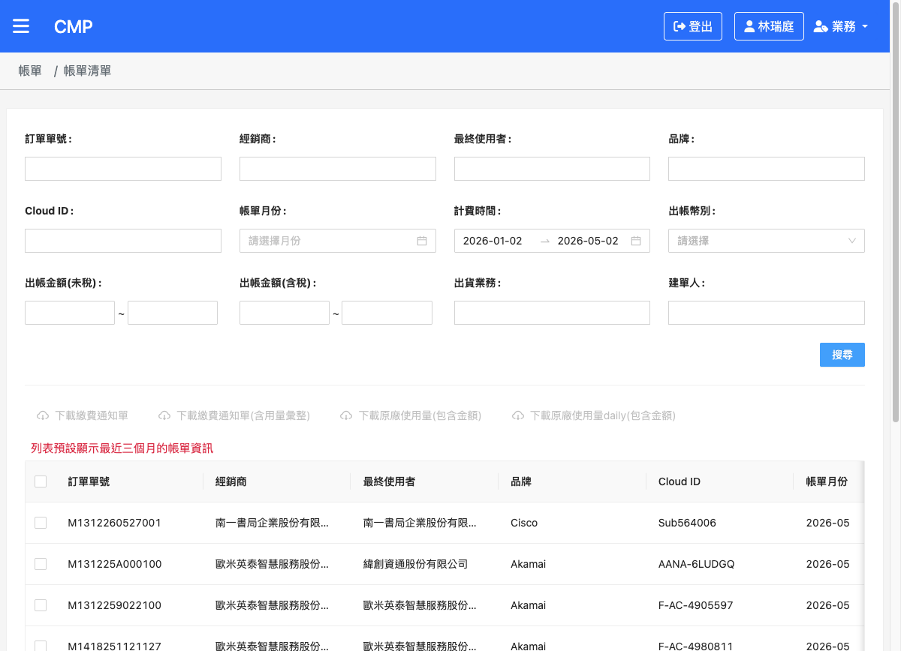 |
| 結果 | ✅ Pass |

---

## 五、測試結果總覽

| 群組 | TC 數 | Pass | Fail | Blocked | 備註 |
|------|-------|------|------|---------|------|
| 搜尋列與欄位搜尋 | 4 | 4 | 0 | 0 | TC-01 ~ TC-04 |
| 金額範圍搜尋與驗證 | 4 | 4 | 0 | 0 | TC-05 ~ TC-08 |
| 金額欄位排序 | 3 | 3 | 0 | 0 | TC-09 ~ TC-11 |
| 排序／翻頁重查 | 4 | 4 | 0 | 0 | TC-12 ~ TC-15 |
| **總計** | **15** | **15** | **0** | **0** | 全數通過 |

---

## 六、缺陷紀錄

本次測試**無遺留缺陷**。

- 計費時間月選擇器輸入框原會帶出當天「日」（如 2026-01-02）的顯示問題，已於測試中補上 `format:'yyyy-MM'` 修正（送出值不受影響）。
- 金額範圍單邊警告文案統一為「金額範圍須同時填寫下限與上限」，本機 i18n 與 UAT 一致。

---

## 七、附錄

### A. XHR 攔截器（複製即用）

```js
agent-browser eval "
(function(){
  window.__cap = [];
  const oOpen = XMLHttpRequest.prototype.open, oSend = XMLHttpRequest.prototype.send;
  XMLHttpRequest.prototype.open = function(m,u){ this.__m=m; this.__u=u; return oOpen.apply(this,arguments); };
  XMLHttpRequest.prototype.send = function(b){
    const u = this.__u || '';
    if (u.indexOf('lockedInvoices') > -1) {
      let p=null; try{ p=JSON.parse(b); }catch(e){ p=b; }
      const it = { m:this.__m, body:p };
      window.__cap.push(it);
      this.addEventListener('load', ()=>{ try{ const r=JSON.parse(this.responseText); it.count=(r.data&&r.data.length); it.page=r.page; }catch(e){} });
    }
    return oSend.apply(this,arguments);
  };
  return 'installed';
})();
"
```

讀取結果：`agent-browser eval "JSON.stringify(window.__cap)"`。頁面導航／重載後需重新安裝。

### B. 預期 Payload 對照表

| 場景 | filter 重點 |
|------|------------|
| 文字欄位（訂單單號/品牌/Cloud ID/業務/建單人） | `{field, comparator:'LIKE', value}` |
| 經銷商/最終使用者 | 轉為 `OR(fullCh/nickCh/fullEn/nickEn LIKE)` |
| 帳單月份(invoiceDate) | `and` 含 `year:EQ`、`month:EQ`；`or` 不帶近三月 |
| 計費時間(billingDate) | `billingStartDate:GTE 月初`、`billingEndDate:LTE 當月最後一天`；輸入框顯示 yyyy-MM |
| 出帳幣別(currency) | `currency:EQ <TWD/USD>` |
| 金額(未稅/含稅) | `<金額欄>:WITHIN [min,max]`（兩邊皆填才送） |
| 近三個月預設 | `or` 含 3 組 `AND(year EQ, month EQ)`（未指定帳單月份時） |
| 排序 | `sort = { <被點欄位>:ASC/DESC, invoiceDate:DESC, _id:DESC }` |

### C. 重入（排序／翻頁重查）冪等與去重規則

```
排序／翻頁 → ma-table 以「上次已處理的 filter」再次呼叫 doQuery，故各轉換須可重入：
- 金額：已是 WITHIN 則原樣保留，不重複合併
- 近三月 OR：push 前先清除舊的 year/month OR 群組，避免堆疊
- sort：保留表格帶入的排序，並以 invoiceDate/_id 墊後
- billingDate / invoiceDate：首查已改名/拆解，重查走 default 原樣保留，不二次轉換
- 併發去重：排序狀態下翻頁會同時觸發 pageIndexChange + queryParams，doQuery 以
  requestingKey 比對簽章，相同且前一筆仍進行中時回傳 EMPTY，不重複打 API
```
