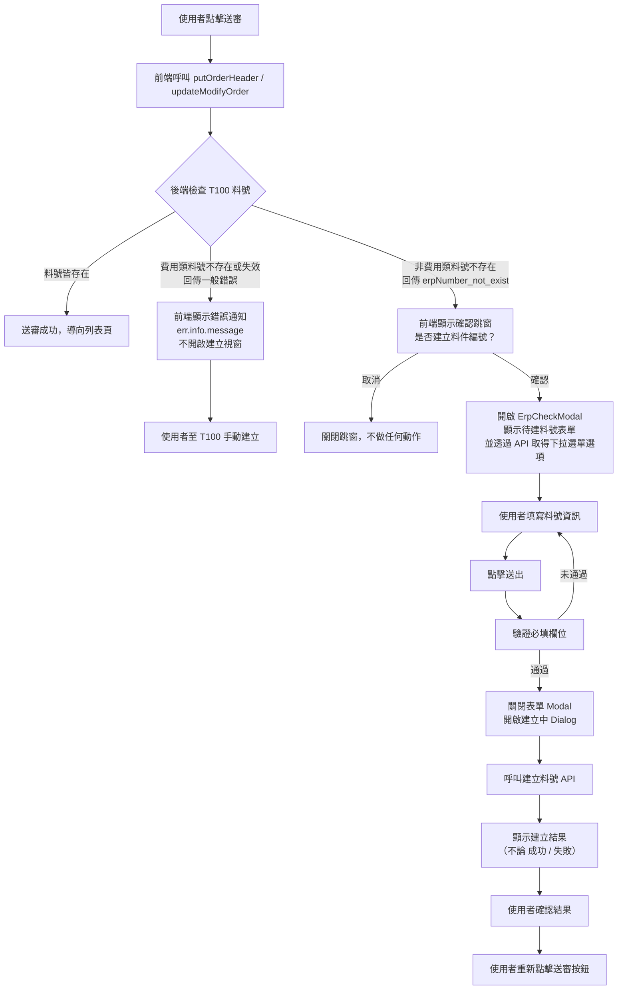
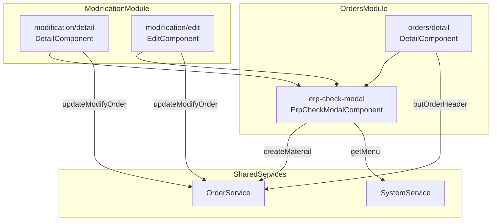
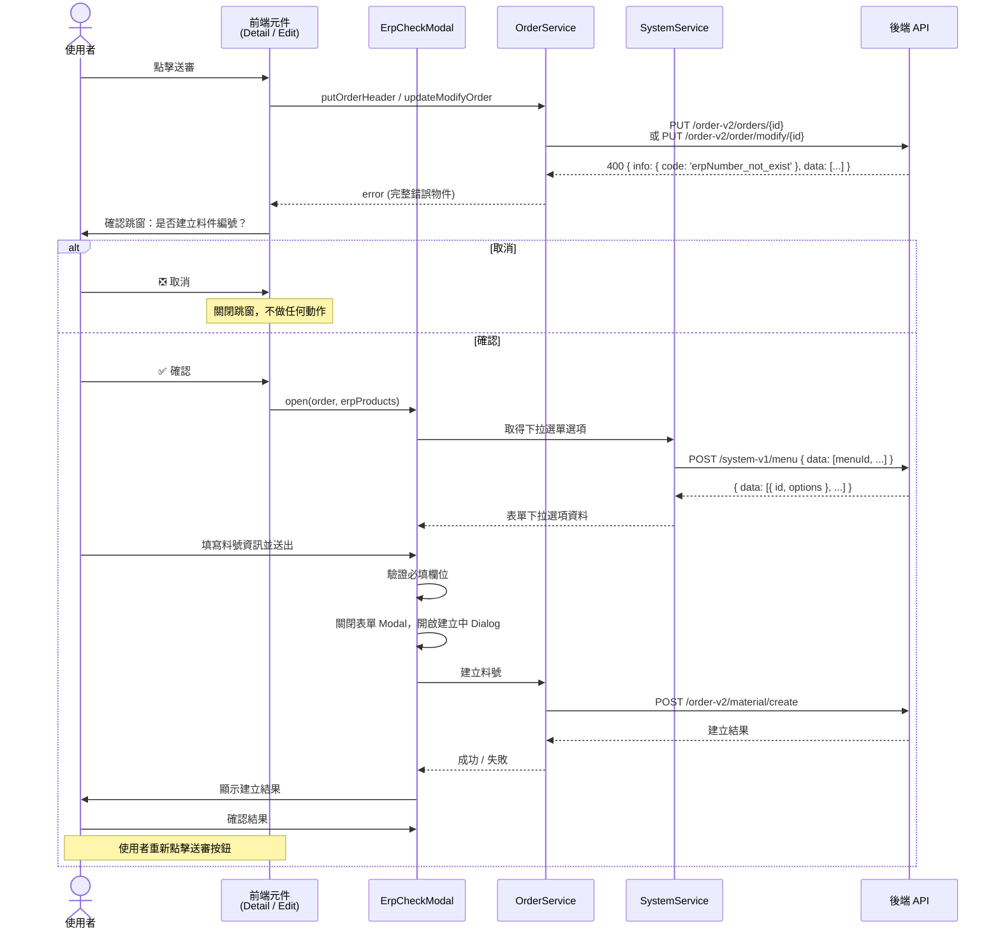

## 修訂紀錄

| **版本** | **日期** | **修訂內容** | **修訂者** |
| --- | --- | --- | --- |
| v1.0 | 2026-04-08 | 初始化文件 | Raelynn |
| v1.1 | 2026-04-14 | 4.1.3 / 4.2.1 / 4.2.4 getMenu API 改為 POST，一次傳入所有 menuId 陣列；loadFormOptions 改為單次呼叫 | Raelynn |

## 相關Jira單：

* CMP-4308 訂單：主動建立料號（前端）
* CMP-4119 訂單：主動建立料號（後端）

## 目錄：

1. 目標
2. 功能需求
3. 實作架構設計
   * 3.1 系統流程圖
   * 3.2 元件關係圖
   * 3.3 序列圖
4. 實作
   * 4.1 後端回應格式
   * 4.2 新增檔案
   * 4.3 修改檔案

## 1. 目標

當訂單或訂變單狀態在「PM審核」階段往下階段送審核時，系統需自動檢查 T100 資料庫中是否已存在對應的料件編號。若料件編號不存在，則需透過 T100 建立料號 API 進行建立。

---

## 2. 功能需求

1. **料號存在檢查**：訂單 / 訂變單在 PM 審核階段點擊「送審」時，後端會檢查 T100 是否已有對應料件編號。後端依據料號類型回傳不同錯誤：
   - **非費用類料號不存在**：回傳錯誤碼 `erpNumber_not_exist` 及需建立的料號清單 → 前端引導使用者建立。
   - **費用類料號不存在或失效**：後端回傳一般錯誤訊息（如「費用制料件在T100不存在或失效，請至T100建檔」），前端僅透過 `err.info.message` 顯示錯誤通知，**不開啟料號建立視窗**。費用類料號需使用者自行至 T100 建立後，通知 CMP 管理人員建立料號。
2. **確認跳窗**：前端收到 `erpNumber_not_exist` 錯誤碼後，彈出確認對話框詢問使用者「是否要建立料件編號？」（僅針對非費用類料號）
3. **填寫料號資訊**：使用者確認後，彈出料件新增視窗，由PM填寫欄位資訊，以卡片形式列出每個待建料號，並提供表單欄位讓使用者填寫，前台調用後台提供的API，取得欄位下拉選單選項。
4. **送出建立**：使用者填寫完成後送出，前端呼叫 API 建立料號，建立期間顯示「建立中」提示並禁止關閉瀏覽器。
5. **顯示結果**：建立完成後顯示結果訊息（成功或失敗），使用者確認後需**重新點擊送審按鈕**才能繼續審核流程。
6. **適用範圍**：訂單明細頁（`orders/detail`）、訂變單明細頁（`modification/detail`）、訂變單編輯頁（`modification/edit`）三處皆需支援。


## 3. 實作架構設計

### 3.1 系統流程圖




### 3.2 元件關係圖



### 3.3 序列圖



---

## 4. 實作

### 4.1 後端回應格式

#### 4.1.1 更新訂單 / 訂變單（料號不存在時的錯誤回應）

當 PM 審核階段送審時，若料件編號在 T100 不存在，以下兩隻 API 會回傳 **400 Bad Request**：

- `PUT /order-v2/orders/{id}`（訂單）
- `PUT /order-v2/order/modify/{id}`（訂變單）

回應格式：

```json
{
  "info": {
    "success": false,
    "code": "erpNumber_not_exist",
    "message": "料件編號不存在於T100"
  },
  "data": [
    { "erpNumber": "ABC-12345", "isCisco": true },
    { "erpNumber": "DEF-67890", "isCisco": false }
  ]
}
```

#### 4.1.1b 費用類料號不存在或失效時的錯誤回應

當訂單中包含費用類（`categoryCode = 'E'`）料號且在 T100 不存在或已失效時，後端回傳 **400 Bad Request**，但錯誤碼**不是** `erpNumber_not_exist`：

```json
{
  "info": {
    "success": false,
    "code": "expense_erpNumber_invalid",
    "message": "費用制料件在T100不存在或失效，請至T100建檔"
  }
}
```

> **前端處理方式**：此錯誤會落入通用的 error handler，透過 `err.info.message` 顯示錯誤通知（`NzNotificationService.error`），不會開啟料號建立視窗。費用類料號需使用者自行至 T100 建立。

---

#### 4.1.2 建立 T100 料件編號

- `POST /order-v2/material/create`

請求格式：

```json
{
  "data": [
    {
      "erpNumber": "ABC-12345",
      "productName": "品名",
      "productSpec": "規格",
      "classificationCode": "01",
      "categoryCode": "A",
      "productType": "P",
      "serialNumberControl": "",
      "ciscoCategory": "SAAS"
    },
    {
      "erpNumber": "DEF-67890",
      "productName": "品名",
      "productSpec": "規格",
      "classificationCode": "01",
      "categoryCode": "A",
      "productType": "P",
      "serialNumberControl": "",
      "ciscoCategory": null
    }
  ]
}
```

> **注意**：非 Cisco 品牌的料號，`ciscoCategory` 欄位需設為 `null`；送出時移除前端用的 `isCisco` 標記欄位。

#### 4.1.3 取得下拉選單選項

- `POST /system-v1/menu`

一次傳入所有需要的 menuId，各 menuId 對應欄位：

| menuId | 對應欄位 |
| --- | --- |
| `t100-material-classificationCode` | 產品分類碼 |
| `t100-material-categoryCode` | 料件類別 |
| `t100-material-productType` | 產品型式 |
| `t100-material-serialNumberControl` | 序號控管 |
| `t100-material-ciscoCategory` | Cisco 分類 |

請求格式：

```json
{
  "data": [
    "t100-material-classificationCode",
    "t100-material-categoryCode",
    "t100-material-productType",
    "t100-material-ciscoCategory",
    "t100-material-serialNumberControl"
  ]
}
```

回應格式：

```json
{
  "data": [
    {
      "id": "t100-material-categoryCode",
      "options": [
        { "code": "A", "description": "組合/加工品", "extra": null }
      ]
    },
    {
      "id": "t100-material-ciscoCategory",
      "options": [
        { "code": "01", "description": "Stock", "extra": null }
      ]
    }
  ],
  "info": {
    "code": "200",
    "message": "查詢多選單資訊成功",
    "success": true
  }
}
```

---

### 4.2 新增檔案

#### 4.2.1 `src/app/orders/detail/erp-check-modal/erp-check-modal.component.ts`

**新增元件：ErpCheckModalComponent** — T100 料件編號建立 Modal

**介面定義：**

| 介面 | 用途 |
| --- | --- |
| `ErpProduct` | 建立料件編號的表單欄位資料模型（定義於 `core/models/orders.ts`，含 `erpNumber`, `productName`, `productSpec`, `classificationCode`, `categoryCode`, `productType`, `ciscoCategory`, `serialNumberControl`, `isCisco`） |
| `SelectOption` | 下拉選單選項 `{ label, value }` |
| `FieldConfig` | 表單欄位設定（`key`, `label`, `type`, `required`, `options`, `ciscoOnly`） |
| `ErpCheckResult` | Modal 結果 `{ passed: boolean }` |
| `ErpProductPayload` | 後端回傳的待建料號項目 `{ erpNumber, isCisco }` |

**項目屬性：**

| 屬性 | 說明 |
| --- | --- |
| `@Output() checkComplete` | 建立流程結束後發出的事件（目前為擴展用途預留，各頁面模板尚未綁定此事件；現行邏輯為使用者自行重新點擊送審按鈕） |
| `isVisible` | Modal 顯示狀態 |
| `isLoading` | 載入中狀態 |
| `optionsLoading` | 選單載入中狀態 |
| `products: ErpProduct[]` | 產品清單 |
| `isSubmitted` | 是否已送出（控制驗證訊息顯示） |
| `formFields: FieldConfig[]` | 表單欄位設定陣列 |
| `createDialog` | 建立結果 Dialog 狀態物件 |

**主要方法：**

| 方法 | 說明 |
| --- | --- |
| `open(order, erpProducts)` | 開啟 Modal，初始化產品清單，呼叫 `loadFormOptions()` 載入選單 |
| `close()` | 關閉 Modal，清空產品清單 |
| `confirm()` | 驗證必填欄位 → </br>暫存 payload（移除 `isCisco`、非 Cisco 的 `ciscoCategory` 設 `null`）→ </br>關閉表單 → 開啟建立中 Dialog → </br>呼叫 `createMaterial` API |
| `onCreateDialogClose()` | 建立結果 Dialog 關閉時，發出 `checkComplete` 事件（擴展用途預留，未來可用於自動重新送審等場景） |
| `loadFormOptions()` | 呼叫 `SystemService.getMenu()` 一次傳入所有 select 欄位的 menuId 陣列，取得各欄位選項 |
| `isProductValid(product)` | 驗證單一產品必填欄位是否填寫完整 |
| `isAllValid()` | 驗證所有產品是否填寫完整 |

```typescript
import { ErpProduct, Order } from '../../../core/models/orders';

export interface SelectOption { label: string; value: string; }

export interface FieldConfig {
  key: string;
  label: string;
  type: 'input' | 'select';
  required?: boolean;
  options?: SelectOption[];
  ciscoOnly?: boolean;
}

export interface ErpCheckResult { passed: boolean; }

export interface ErpProductPayload { erpNumber: string; isCisco: boolean; }

@Component({
  selector: 'app-erp-check-modal',
  templateUrl: './erp-check-modal.component.html',
  styleUrls: ['./erp-check-modal.component.scss'],
})
export class ErpCheckModalComponent {
  @Output() checkComplete = new EventEmitter<ErpCheckResult>();

  isVisible = false;
  isLoading = false;
  optionsLoading = false;
  products: ErpProduct[] = [];
  isSubmitted = false;
  private order!: Order;
  private configBrandId = environment['brandId'];

  classificationCodeOptions: SelectOption[] = [];
  categoryCodeOptions: SelectOption[] = [];
  productTypeOptions: SelectOption[] = [];
  ciscoCategoryOptions: SelectOption[] = [];
  serialNumberControlOptions: SelectOption[] = [];

  /** 表單欄位設定 */
  formFields: FieldConfig[] = [
    { key: 'productName', label: 'commodity short name', type: 'input', required: true },
    { key: 'productSpec', label: 'specification', type: 'input', required: true },
    { key: 'classificationCode', label: 'classification code', type: 'select', required: true, options: this.classificationCodeOptions },
    { key: 'categoryCode', label: 'category code', type: 'select', required: true, options: this.categoryCodeOptions },
    { key: 'productType', label: 'product type', type: 'select', required: true, options: this.productTypeOptions },
    { key: 'serialNumberControl', label: 'serial number control', type: 'select', required: false, options: this.serialNumberControlOptions },
    { key: 'ciscoCategory', label: 'cisco category', type: 'select', required: true, options: this.ciscoCategoryOptions, ciscoOnly: true },
  ];

  createDialog = { visible: false, loading: false, title: '', message: '', passed: false };

  constructor(
    private translate: TranslateService,
    private systemSvc: SystemService,
    private orderSvc: OrderService,
    private notify: NzNotificationService,
  ) { }

  open(order: Order, erpProducts: ErpProductPayload[] = []) {
    this.order = order;
    this.isSubmitted = false;
    this.isVisible = true;
    this.products = erpProducts.map(({ erpNumber, isCisco }) => ({
      erpNumber, isCisco,
      productName: '', productSpec: '', classificationCode: '',
      categoryCode: '', productType: '', ciscoCategory: '',
      serialNumberControl: '',
    }));
    this.loadFormOptions();
  }

  close() {
    this.isVisible = false;
    this.products = [];
    this.isSubmitted = false;
  }

  confirm() {
    this.isSubmitted = true;
    if (!this.isAllValid()) { return; }

    // 非 Cisco 品牌的 ciscoCategory 設為 null，並移除 isCisco 欄位
    const products = this.products.map(({ isCisco, ...rest }) => ({
      ...rest,
      ciscoCategory: isCisco ? rest.ciscoCategory : null,
    }));

    this.close();

    this.createDialog = {
      visible: true, loading: true,
      title: this.translate.instant('erp number creating'),
      message: '', passed: false,
    };

    this.orderSvc.createMaterial(products).subscribe({
      next: (res) => {
        this.createDialog.loading = false;
        this.createDialog.passed = !!res?.info?.success;
        this.createDialog.title = this.translate.instant('erp number created');
        this.createDialog.message = res?.info?.message || '';
      },
      error: (err) => {
        this.createDialog.loading = false;
        this.createDialog.passed = false;
        this.createDialog.title = this.translate.instant('erp number failed');
        this.createDialog.message = err?.message || err;
      },
    });
  }

  onCreateDialogClose() {
    const passed = this.createDialog.passed;
    this.createDialog.visible = false;
    this.checkComplete.emit({ passed });
  }

  private loadFormOptions() {
    this.optionsLoading = true;
    const selectFields = this.formFields.filter(f => f.type === 'select');
    const menuIds = selectFields.map(f => `t100-material-${f.key}`);

    this.systemSvc.getMenu(menuIds).subscribe({
      next: (res) => {
        const menus: any[] = res?.data || [];
        selectFields.forEach(field => {
          const menuId = `t100-material-${field.key}`;
          const menuData = menus.find((m: any) => m.id === menuId);
          if (menuData?.options) {
            field.options = menuData.options.map((o: any) => ({
              label: `${o.code}-${o.description}`, value: o.code,
            }));
          }
        });
        this.optionsLoading = false;
      },
      error: () => { this.optionsLoading = false; }
    });
  }

  isProductValid(product: ErpProduct): boolean {
    return this.formFields
      .filter(f => f.required && (!f.ciscoOnly || product.isCisco))
      .every(f => !!product[f.key as keyof ErpProduct]);
  }

  isAllValid(): boolean {
    return this.products.every(p => this.isProductValid(p));
  }
}
```

#### 4.2.2 `src/app/orders/detail/erp-check-modal/erp-check-modal.component.html`

**Modal 模板** — 包含兩個 `nz-modal`：

1. **主表單 Modal**：以 `cards-grid` 排列待建料號卡片，每張卡片包含表單欄位（依 `formFields` 設定動態渲染 input / select），Footer 有取消和送出按鈕。
2. **建立結果 Dialog**：建立期間顯示載入提示（含警語「請勿關閉瀏覽器」），完成後顯示結果訊息和確認按鈕。建立中時 `nzClosable=false` 且 `nzMaskClosable=false`，防止使用者意外關閉。

```html
<nz-modal [(nzVisible)]="isVisible"
          [nzTitle]="'please fill all required input' | translate"
          [nzWidth]="1200"
          [nzClosable]="!isLoading"
          [nzMaskClosable]="false"
          [nzBodyStyle]="{ 'max-height': '70vh', 'overflow-y': 'auto' }"
          (nzOnCancel)="close()"
          [nzFooter]="modalFooter">

  <ng-container *nzModalContent>
    <div class="cards-grid">
      @for (product of products; track $index; let i = $index) {
        <nz-card class="product-card" [nzTitle]="product.erpNumber" nzSize="small">
          <form nz-form nzLayout="horizontal">
            @for (field of formFields; track field.key) {
              @if (!field.ciscoOnly || product.isCisco) {
                <nz-form-item>
                  <nz-form-label [nzSpan]="8" [nzRequired]="field.required !== false">{{ field.label | translate }}</nz-form-label>
                    @switch (field.type) {
                      @case ('input') {
                        <nz-form-control [nzSpan]="16"
                                         [nzValidateStatus]="isSubmitted && !$any(product)[field.key] ? 'error' : ''"
                                         [nzErrorTip]="'please fill input' | translate: { input: (field.label | translate) }">
                          <input nz-input
                                 [(ngModel)]="$any(product)[field.key]"
                                 [ngModelOptions]="{ standalone: true }"
                                 [placeholder]="'please fill input' | translate: { input: (field.label | translate) }" />
                        </nz-form-control>
                      }
                      @case ('select') {
                        <nz-form-control [nzSpan]="16"
                                         [nzValidateStatus]="isSubmitted && !$any(product)[field.key] ? 'error' : ''"
                                         [nzErrorTip]="'please fill select' | translate: { select: (field.label | translate) }">
                          <nz-select [(ngModel)]="$any(product)[field.key]"
                                     [ngModelOptions]="{ standalone: true }"
                                     [nzLoading]="optionsLoading"
                                     [nzPlaceHolder]="'please fill select' | translate: { select: (field.label | translate) }"
                                     nzShowSearch nzAllowClear>
                            @for (opt of field.options; track opt.value) {
                              <nz-option [nzLabel]="opt.label" [nzValue]="opt.value"></nz-option>
                            }
                          </nz-select>
                        </nz-form-control>
                      }
                    }
                </nz-form-item>
              }
            }
          </form>
        </nz-card>
      }
    </div>

    @if (products.length === 0) {
      <nz-empty [nzNotFoundContent]="'no data' | translate"></nz-empty>
    }
  </ng-container>

  <ng-template #modalFooter>
    <button nz-button (click)="close()">{{ 'cancel' | translate }}</button>
    <button nz-button nzType="primary"
            [nzLoading]="isLoading"
            [disabled]="products.length === 0 || optionsLoading"
            (click)="confirm()">
      {{ 'submit' | translate }}
    </button>
  </ng-template>
</nz-modal>

<!-- 建立料件編號結果 Dialog -->
<nz-modal [(nzVisible)]="createDialog.visible"
          [nzTitle]="createDialogTitle"
          [nzClosable]="false"
          [nzMaskClosable]="false"
          (nzOnCancel)="onCreateDialogClose()"
          [nzFooter]="createDialogFooter">

  <ng-template #createDialogTitle>{{ createDialog.title }}</ng-template>
  <ng-container *nzModalContent>
    @if (createDialog.loading) {
      <div class="px-4">
        <p>{{ 'creating material' | translate }}</p>
        <p class="text-danger">{{ 'creating material warning' | translate }}</p>
      </div>
    } @else {
      <p>{{ 'create material result' | translate }}：{{ createDialog.message }}</p>
    }
  </ng-container>

  <ng-template #createDialogFooter>
    @if (!createDialog.loading) {
      <button nz-button nzType="primary" (click)="onCreateDialogClose()">
        {{ 'confirm' | translate }}
      </button>
    }
  </ng-template>
</nz-modal>
```

#### 4.2.3 `src/app/orders/detail/erp-check-modal/erp-check-modal.component.scss`

**樣式** — 卡片格線佈局：

- `.cards-grid`：`flex-wrap` 排列，`gap: 12px`
- `.product-card`：一行三張卡片（`width: calc((100% - 24px) / 3)`），`::ng-deep` 調整 ant-card 標題字型、內距、表單項間距

```scss
.cards-grid {
  display: flex;
  flex-wrap: wrap;
  gap: 12px;
}

.product-card {
  width: calc((100% - 24px) / 3);

  ::ng-deep {
    .ant-card-head-title { font-size: 13px; }
    .ant-card-body { padding: 12px; }
    nz-form-item {
      margin-bottom: 4px;
      &:last-child { margin-bottom: 0; }
    }
    nz-form-label {
      text-align: left;
      padding: 0 4px 0 0;
      line-height: 32px;
      font-weight: 500;
    }
  }
}
```

#### 4.2.4 `src/app/share/services/system.service.ts`

**新增服務：SystemService**

```typescript
export class SystemService {
  private gateway = 'system-v1/';

  constructor(
    private api: ApiService,
  ) {}

  /**
   * 取得選單資料
   * @param menuIds 選單 ID 陣列，例如 ['t100-material-classificationCode']
   */
  getMenu(menuIds: string[]): Observable<ResponseData> {
    return this.api.post(this.gateway + 'menu', { data: menuIds });
  }
}
```

---

### 4.3 修改檔案

#### 4.3.1 `src/app/share/services/order.service.ts`

| 變更 | 說明 |
| --- | --- |
| `putOrderHeader()` 新增 `fullError` 參數 | 新增第四個參數 `fullError: boolean = false`。當 `fullError=true` 時，直接使用 `HttpClient` 發送請求（繞過 `ApiService` 的統一錯誤處理），使呼叫端能取得完整的錯誤回應物件（含 `info.code`, `data` 等），用於判斷 `erpNumber_not_exist` 錯誤碼。 |
| 新增 `updateModifyOrderWithFullError()` | 訂變單更新的 fullError 版本，直接使用 `HttpClient` 以獲取完整錯誤物件，邏輯與 `putOrderHeader(fullError=true)` 相同。 |
| 提取 `buildModifyOrderRequestData()` | 將原 `updateModifyOrder` 中的 `RequestData` 建構邏輯提取為 `private` 方法，供 `updateModifyOrderWithFullError` 共用，避免重複程式碼。 |
| 新增 `createMaterial()` | `POST /order-v2/material/create`，傳入料號資料陣列，呼叫後端建立 T100 料件編號。 |

**putOrderHeader — fullError 模式：**

```typescript
putOrderHeader(orderHeader: any, orderId: string, step: OrderButtonStep, fullError: boolean = false): Observable<ResponseData> {
  const requestData = orderHeader
    ? new RequestData({ ...orderHeader, filterAttribute: undefined, step })
    : new RequestData({ step });

  if (!fullError) {
    return this.api.put(this.gateway.order + 'orders/' + orderId, requestData);
  }

  const url = `${environment['apiUrl']}/${this.gateway.order}orders/${orderId}`;
  return this.http.put<ResponseData>(url, requestData).pipe(
    catchError((error) => {
      if (error.error?.info) {
        return throwError(() => error.error);
      }
      const errorMessage = error.error?.message || error.message || 'Unknown error';
      return throwError(() => new Error(errorMessage));
    })
  );
}
```

**updateModifyOrderWithFullError：**

```typescript
updateModifyOrderWithFullError(orderModify: OrderModify, order: any, step: ModifyButtonStep, rejectReason?: string): Observable<ResponseData> {
  const requestData = this.buildModifyOrderRequestData(orderModify, order, step, rejectReason);
  const url = `${environment['apiUrl']}/${this.gateway.order}order/modify/${orderModify.id}`;

  return this.http.put<ResponseData>(url, requestData).pipe(
    catchError((error) => {
      if (error.error?.info) {
        return throwError(() => error.error);
      }
      const errorMessage = error.error?.message || error.message || 'Unknown error';
      return throwError(() => new Error(errorMessage));
    })
  );
}
```

**createMaterial：**

```typescript
createMaterial(data: any): Observable<ResponseData> {
  return this.api.post(this.gateway.order + 'material/create', new RequestData(data));
}
```

#### 4.3.2 `src/app/orders/detail/detail.component.ts`

| 變更 | 說明 |
| --- | --- |
| 新增 `import` | 匯入 `ErpCheckModalComponent` 和 `ErpProductPayload` |
| 新增 `@ViewChild('erpCheckModal')` | 取得模板中 `<app-erp-check-modal>` 的元件實例 |
| 新增 `@ViewChild('erpConfirmContent')` | 取得模板中 `#erpConfirmContent` 的 `TemplateRef`，用於確認跳窗的兩行內容 |
| `saveOrderHeader()` 改用 `fullError=true` | 呼叫 `putOrderHeader` 時加上第四個參數 `true`，以取得完整錯誤物件 |
| `saveOrderHeader()` 新增錯誤處理 | 在 `error` 回調中判斷 `err?.info?.code === 'erpNumber_not_exist'`：顯示確認跳窗 → 使用者確認後呼叫 `erpCheckModal.open(order, erpProducts)` |

```typescript
// --- class 內新增 ---
@ViewChild('erpCheckModal') erpCheckModal!: ErpCheckModalComponent;
@ViewChild('erpConfirmContent') erpConfirmContent!: TemplateRef<any>;

// --- saveOrderHeader 修改 ---
this.orderSvc.putOrderHeader(updateHeaderData, this.orderID, step, true).subscribe({
  next: (res) => {
   // 照舊
  },
  error: (err) => {
    // 料件編號在 T100 不存在 (400 Bad Request)，詢問是否建立
    if (err?.info?.code === 'erpNumber_not_exist') {
      this.ui.isLoading = false;
      this.ui.isCustomerPoNumberUpdating = false;
      const erpProducts: ErpProductPayload[] = err.data ?? [];

      this.nzModalSvc.confirm({
        nzTitle: this.translate.instant('erp number not in t100'),
        nzContent: this.erpConfirmContent,
        nzOnOk: () => {
          this.erpCheckModal.open(this.order, erpProducts);
        }
      });
      return;
    }
    console.error('[update-orderHeader]', err);
    this.notify.error(this.translate.instant('update failed'), err?.message || err);
    this.ui.isLoading = false;
    this.ui.isCustomerPoNumberUpdating = false;
  },
});
```

#### 4.3.3 各頁面 HTML 模板

以下三個模板皆在末尾加入 `<app-erp-check-modal #erpCheckModal></app-erp-check-modal>`：

- `src/app/orders/detail/detail.component.html`
- `src/app/modification/detail/detail.component.html`
- `src/app/modification/edit/edit.component.html`

```html
<!-- T100 料件編號確認內容 -->
<ng-template #erpConfirmContent>
  <p>{{ 'confirm create erp number' | translate }}</p>
  <p class="text-danger">{{ 'create material not supported' | translate }}</p>
</ng-template>

<!-- T100 料件編號檢查 Modal -->
<!-- (checkComplete) 為擴展用途預留，目前由使用者自行重新點擊送審按鈕繼續流程 -->
<app-erp-check-modal #erpCheckModal></app-erp-check-modal>
```

#### 4.3.4 `src/app/modification/detail/detail.component.ts`

| 變更 | 說明 |
| --- | --- |
| 新增 `import` | 匯入 `ErpCheckModalComponent` 和 `ErpProductPayload` |
| 新增 `@ViewChild('erpCheckModal')` | 取得模板中 `<app-erp-check-modal>` 的元件實例 |
| 新增 `@ViewChild('erpConfirmContent')` | 取得模板中 `#erpConfirmContent` 的 `TemplateRef`，用於確認跳窗的兩行內容 |
| 改用 `updateModifyOrderWithFullError()` | 原本呼叫 `updateModifyOrder()` 改為 `updateModifyOrderWithFullError()`，以取得完整錯誤物件 |
| 新增 `erpNumber_not_exist` 錯誤處理 | 在 `error` 回調中判斷錯誤碼，邏輯同訂單明細頁：確認跳窗 → 開啟 ErpCheckModal |

```typescript
// --- class 內新增 ---
@ViewChild('erpCheckModal') erpCheckModal!: ErpCheckModalComponent;
@ViewChild('erpConfirmContent') erpConfirmContent!: TemplateRef<any>;

// --- updateModifyOrder 修改 ---
this.orderSvc.updateModifyOrderWithFullError(this.orderModify, this.orderOri, step, rejectReason).subscribe({
  next: (res) => {
    // 照舊
  },
  error: (err) => {
    if (err?.info?.code === 'erpNumber_not_exist') {
      this.ui.isSaving = false;
      const erpProducts: ErpProductPayload[] = err.data ?? [];

      this.nzModalSvc.confirm({
        nzTitle: this.translate.instant('erp number not in t100'),
        nzContent: this.erpConfirmContent,
        nzOnOk: () => {
          this.erpCheckModal.open(this.orderOri, erpProducts);
        }
      });
      return;
    }
    this.notify.error(this.translate.instant('update failed'), err?.message || err);
    this.ui.isSaving = false;
  }
});
```

#### 4.3.5 `src/app/modification/edit/edit.component.ts`

| 變更 | 說明 |
| --- | --- |
| 新增 `import` | 匯入 `ErpCheckModalComponent` 和 `ErpProductPayload` |
| 新增 `@ViewChild('erpCheckModal')` | 取得模板中 `<app-erp-check-modal>` 的元件實例 |
| 新增 `@ViewChild('erpConfirmContent')` | 取得模板中 `#erpConfirmContent` 的 `TemplateRef`，用於確認跳窗的兩行內容 |
| 改用 `updateModifyOrderWithFullError()` | 原本呼叫 `updateModifyOrder()` 改為 `updateModifyOrderWithFullError()`，以取得完整錯誤物件 |
| 新增 `erpNumber_not_exist` 錯誤處理 | 邏輯同上：確認跳窗 → 開啟 ErpCheckModal |

```typescript
// --- class 內新增 ---
@ViewChild('erpCheckModal') erpCheckModal!: ErpCheckModalComponent;
@ViewChild('erpConfirmContent') erpConfirmContent!: TemplateRef<any>;

// --- updateModifyOrder 修改 ---
this.orderSvc.updateModifyOrderWithFullError(this.orderModify, order, step, rejectReason).subscribe({
  next: (res) => {
   // 照舊
  },
  error: (err) => {
    if (err?.info?.code === 'erpNumber_not_exist') {
      this.ui.isLoading = false;
      const erpProducts: ErpProductPayload[] = err.data ?? [];

      this.nzModalSvc.confirm({
        nzTitle: this.translate.instant('erp number not in t100'),
        nzContent: this.erpConfirmContent,
        nzOnOk: () => {
          this.erpCheckModal.open(this.order, erpProducts);
        }
      });
      return;
    }
    this.notify.error(this.translate.instant('update failed'), err?.message || err);
    this.ui.isLoading = false;
  }
});
```

#### 4.3.6 `src/app/orders/orders.module.ts`

| 變更 | 說明 |
| --- | --- |
| `import ErpCheckModalComponent` | 匯入新元件 |
| 加入 `declarations` | 將 `ErpCheckModalComponent` 註冊到 `OrdersModule` |
| 加入 `exports` | 匯出 `ErpCheckModalComponent`，供 `ModificationModule` 使用 |

```typescript
import { ErpCheckModalComponent } from './detail/erp-check-modal/erp-check-modal.component';

@NgModule({
  declarations: [
    // ...
    ErpCheckModalComponent,
  ],
  exports: [
    // ...
    ErpCheckModalComponent,
  ],
})
```

#### 4.3.7 `src/assets/i18n/zh-tw.json`

新增翻譯鍵值：

| Key | 中文 |
| --- | --- |
| `erp number not in t100` | 商品料件編號不存在T100！ |
| `confirm create erp number` | 是否要建立料件編號？ |
| `classification code` | 產品分類碼 |
| `category code` | 料件類別 |
| `product type` | 產品型式 |
| `cisco category` | Cisco分類 |
| `serial number control` | 序號管制 |
| `erp number creating` | 料件編號建立中 |
| `erp number created` | 料件編號建立完成 |
| `erp number failed` | 料件編號建立失敗 |
| `creating material` | T100 料件編號建立中，請稍候⋯⋯ |
| `creating material warning` | 料號建立期間請勿關閉或重新整理瀏覽器，避免拋送錯誤！ |
| `create material result` | 本次建立結果 |
| `create material not supported` | 本功能僅支援非費用類型料號，費用類型料號仍需手動至T100建立。 |

#### 4.3.8 `src/app/core/models/orders.ts`
```typescript
/** 建立料件編號的產品資料 */
export interface ErpProduct {
  /** 料件編號 */
  erpNumber: string;
  /** 品名 */
  productName: string;
  /** 規格 */
  productSpec: string;
  /** 產品分類碼 */
  classificationCode: string;
  /** 料件類別 */
  categoryCode: string;
  /** 產品型式 */
  productType: string;
  /** Cisco分類 (僅 Cisco 料號顯示) */
  ciscoCategory: string;
  /** 序號控管 */
  serialNumberControl: string;
  /** 是否為 Cisco 品牌 */
  isCisco: boolean;
}
```