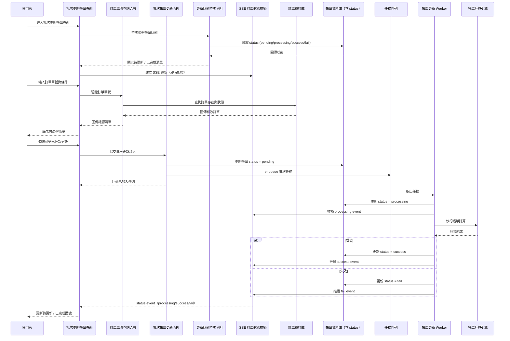
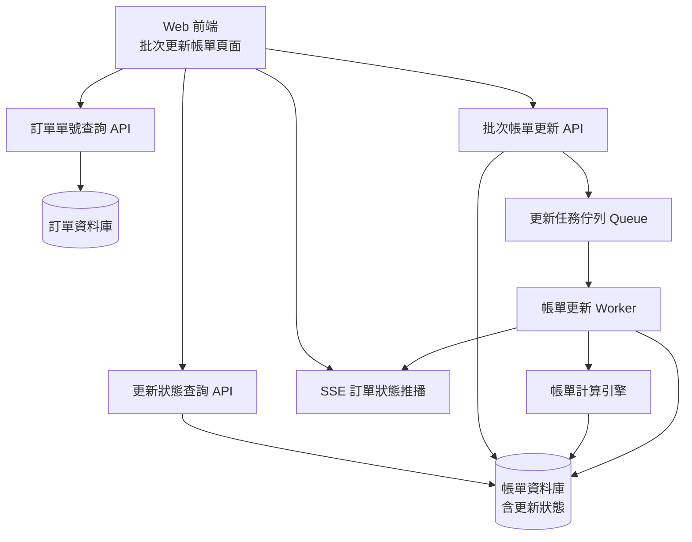

# CMP-4370_SA：批次更新帳單

## 版本紀錄

| 版本 | 日期       | 修訂內容 | 修訂者  |
| ---- | ---------- | -------- | ------- |
| 1.0  | 2026-04-17 | 初版建立 | Raelynn |

---

## 目錄

1. 需求描述
2. 範圍定義
3. 角色與權限
4. 功能需求
5. UI/UX 規格
6. 系統分析
7. 資料需求
8. API 需求
9. 使用案例（Use Case）
10. 驗收條件（AC）

---

## 1. 需求描述

### 1.1 需求來源

- 提出人：呂相佩、Cindy
- Jira Issue：
  - CMP-4370 帳單管理：新增「批次更新帳單」功能頁面（前端）
- 關聯 Issue：
  - CMP-4339 手動更新帳單速度太慢

### 1.2 功能背景

目前帳單管理模組中，更新帳單需逐張手動操作，當需要批次修正大量訂單帳單時效率極低（參考 CMP-4339）。

### 1.3 目標

在帳單管理模組中新增一個獨立的「批次更新帳單」功能頁面，讓使用者可一次輸入多組訂單單號並指定帳單月份，批次觸發帳單更新任務，大幅提升作業效率。

---

## 2. 範圍定義

### 2.1 影響範圍

#### 前端

| 模組              | 影響範圍                                                             |
| ----------------- | -------------------------------------------------------------------- |
| 帳單模組（Bills） | 新增「批次更新帳單」功能頁面（含當日更新狀態區塊、搜尋、列表等） |

#### 後端

| API         | 影響範圍                                         |
| ---------------- | ------------------------------------------------ |
| 帳單更新狀態查詢     | 查詢所有更新中/已完成訂單，供前端初始化列表      |
| 帳單更新狀態推播 SSE | 持續推送訂單狀態變化，供前端即時更新             |
| 訂單單號查詢     | 驗證訂單單號是否存在，回傳有效清單               |
| 批次更新帳單     | 接收批次訂單清單，加入更新佇列，回傳是否成功接收 |

---

## 3. 角色與權限

同「可更新帳單」功能，需具備帳單管理相關權限的使用者才能存取「批次更新帳單」頁面並執行相關操作。

---

## 4. 功能需求

帳單更新狀態初始資料來源為 Status API，後續狀態變更由 SSE 推送更新，所有狀態更新以 SSE 為即時來源，但最終一致性以 Status API 為準。並提供搜尋訂單，勾選後進行批次更新功能。

### 4.1 執行流程

1. 使用者進入「批次更新帳單」頁面時，系統需預設顯示兩個區塊：
    - 當日帳單更新狀態
      - 「待更新帳單」區塊（顯示 pending / processing）
      - 「已完成更新帳單」區塊（顯示 success / fail）
    - 批次更新帳單
      - 查詢
      - 查詢結果清單

2. 頁面初始化時，前端會呼叫「帳單更新狀態查詢 API」，取得所有當前帳單更新狀態資料並分流至對應區塊。

3. 同時建立 SSE 連線以接收後續即時狀態更新。

4. 使用者可輸入指定月份、多組訂單單號（可每行一筆或逗號分隔）、狀態（選填），點擊「搜尋」。

5. 系統驗證訂單單號格式與存在性，並顯示確認清單（僅列出有效訂單）：
   - 勾選框（更新狀態為 pending / processing 不可勾選）
   - 子單單號
   - 最終使用者
   - CloudId
   - 子單狀態
   - 帳單更新時間
   - 帳單更新狀態

6. 使用者勾選訂單並送出「批次更新帳單」。

7. 訂單加入待更新區塊（狀態：pending）。

8. 當 SSE 推播更新項目狀態為 processing 時，前端即時將該筆資料更新為「更新中」狀態。

9. 當 SSE 推播更新項目狀態為 success/fail 時
   - 從「待更新」移至「已完成」
   - success：顯示下載按鈕
   - fail：顯示錯誤原因

### 4.2 功能規則

- 批次上限為 50 筆，超過需提示並阻止送出
- 正在執行中的帳單（更新狀態為 pending / processing）的訂單不可重複觸發（checkbox disabled）
- 任務為非同步執行，不阻塞頁面操作
- UI 狀態轉換：
  - pending → processing → success / fail

---

## 5. UI/UX 規格

> 📌 **待補充**：畫面 Wireframe / Mockup

### 5.1 頁面結構
- **當日帳單更新狀態** 
    - **「待更新帳單」區塊**：更新狀態為 pending / processing 的項目，並列出總筆數
    - **「已完成更新帳單」區塊**：更新狀態為 success / fail 的項目
- **批次更新帳單**
    - **查詢條件輸入區**
    - **查詢結果清單**

---

## 6. 系統分析

### 🔹 更新狀態定義

| 狀態       | 說明 |
|------------|------|
| pending    | 已加入佇列，尚未處理 |
| processing | 處理中 |
| success    | 更新成功 |
| fail       | 更新失敗 |

### 🔹 架構說明

本系統採用：
- Status API 作為「狀態快照（snapshot）」
- SSE 作為「事件驅動（event-driven）更新機制」

確保：
- 頁面初始化正確性
- 即時狀態同步
- SSE 中斷時仍可透過 API 還原狀態


### 6.1 前後端互動序列圖



> 【備註】進入頁面即建立 SSE 連線並查詢現有任務狀態，確保即時監控所有帳單更新進度，不會遺漏先前已在執行的任務。


### 6.2 系統架構圖



## 7. 資料需求

  ### 7.1 查詢輸入區

  | 欄位名稱   | 類型         | 必填 | 說明                         |
  | ---------- | ------------ | ---- | ---------------------------- |
  | 訂單單號   | Textarea     | ✅   | 多組編號，每行一筆或逗號分隔 |
  | 帳單月份   | Date Picker  | ✅   | 格式 YYYY-MM                 |
  | 子單狀態   | Select（多選）|      | 可多選，篩選指定狀態的訂單   |

  ### 7.2 確認清單（表格）

  | 欄位名稱         |  說明                       |
  | ---------------- | -------------------------- |
  | 勾選框           |  | 可多選，部分狀態不可勾選   |
  | 訂單單號         | 主單號                     |
  | 子單單號         | 子單編號                   |
  | 最終使用者       | 客戶名稱                   |
  | CloudId         | Cloud ID                   |
  | 子單狀態         | 已啟用/未啟用/合約期滿/關閉  |
  | 帳單更新時間     | 最後更新時間               |
  | 帳單更新狀態     | 待更新/更新中/已完成/更新失敗 |

  ### 7.3 待更新帳單區塊

  | 欄位名稱         | 說明                       |
  | ---------------- | -------------------------- |
  | 訂單單號         | 主單號                     |
  | 帳單月份         | YYYY-MM               |
  | 更新狀態         | 待更新/更新中           |

  ### 7.4 已完成更新帳單區塊

  | 欄位名稱         | 說明                       |
  | ---------------- | -------------------------- |
  | 訂單單號         | 主單號                     |
  | 帳單月份         | YYYY-MM               |
  | 更新狀態         | 若成功時顯示下載按鈕 / 若失敗時顯示錯誤訊息 |

  ### 7.5 前端資料模型（View Model）

  | 欄位名稱        | 型別    | 說明           |
  |-----------------|---------|----------------|
  | id              | string  | 子單ID         |
  | orderNumber     | string  | 訂單單號       |
  | subNumber       | string  | 子單單號       |
  | endUserData.customerName.fullCh    | string  | 客戶名稱       |
  | cloudId         | string  | Cloud ID       |
  | status          | string  | 子單狀態       |
  | billingUpdateTime   | string  | 帳單更新時間   |
  | billingUpdateStatus     | string  | 帳單更新狀態   |
  | selectable      | boolean | 是否可勾選     |
  
  ### 7.6 畫面區塊資料來源

  | UI 區塊             | 資料來源 API | 
  |--------------------|-------------|
  | 待更新帳單區塊     | 帳單更新狀態查詢 API、帳單更新狀態推播 API（SSE）| 
  | 已完成帳單區塊     | 帳單更新狀態查詢 API、帳單更新狀態推播 API（SSE）  | 
  | 查詢            | 訂單單號查詢 API  | 
  | 批次更新         | 批次帳單更新 API  |

---

## 8. API 需求

### 8.1 訂單單號查詢 API

| 項目   | 內容 |
| ------ | ---- |
| Method | POST |
| 說明   | 驗證訂單單號是否存在，僅回傳有效清單 |

**輸入參數**
| 參數名稱         | 型別         | 必填 | 說明                 |
|------------------|--------------|------|----------------------|
| orderErpNumber   | string[]     | ✅   | 多組訂單單號         |
| year             | string       | ✅   | 年份（YYYY）         |
| month            | string       | ✅   | 月份（MM）           |
| status           | string[]     |      | 狀態（如 USING）     |

**Request Body 範例**
```json
{
  "orderErpNumber": ["M312xxxxx", "M312yyyyy", "M312zzzzz"],
  "year": "2026",
  "month": "04",
  "status": ["USING"]
}
```

**輸出參數**
| 參數名稱           | 型別     | 說明                       |
|--------------------|----------|----------------------------|
| orderErpNumber     | string   | 訂單單號 (312編號)           |
| subOrderId         | string   | 子單ID (for API)           |
| subNumber          | string   | 子單編號 (for 顯示)         |
| endUserData        | object   | 最終使用者資訊             |
| └─ id              | string   | 使用者ID                   |
| └─ customerName    | object   | 客戶名稱（中/英/暱稱）      |
| cloudId            | string   | Cloud ID                   |
| status             | string   | 子單狀態                   |
| billingUpdateTime  | string   | 帳單更新時間               |
| billingUpdateStatus| string   | 帳單更新狀態（pending...） |

**Response 範例**
```json
{
  "data": [
    {
      "orderErpNumber": "M312xxxxx",
      "subOrderId": "2026042177138501",
      "subNumber": "M312xxxxx-01",
      "endUserData": {
        "id": "...",
        "customerName": { "fullCh": "...", "nickCh": "...", "fullEn": "...", "nickEn": "" }
      },
      "cloudId": "Cloud123",
      "status": "已啟用",
      "billingUpdateTime": "2026-04-21 14:00",
      "billingUpdateStatus": "pending"
    }
  ]
}
```

---

### 8.2 批次帳單更新 API

| 項目   | 內容 |
| ------ | ---- |
| Method | POST |
| 說明   | 前端送出批次更新清單，回傳是否成功接收 |

**輸入參數**
| 參數名稱 | 型別     | 必填 | 說明         |
|----------|----------|------|--------------|
| id       | string[] | ✅   | 子單ID       |
| year     | string   | ✅   | 年份（YYYY） |
| month    | string   | ✅   | 月份（MM）   |

**Request Body 範例**
```json
{
  "id": ["2026042177138501", "2026042104585301"],
  "year": "2026",
  "month": "04"
}
```

**輸出參數**
| 參數名稱 | 型別   | 說明                 |
|----------|--------|----------------------|
| message  | string | 執行結果訊息         |

**Response 範例**
```json
{
  "message": "已成功加入更新佇列"
}
```

---

### 8.3 帳單更新狀態查詢 API

| 項目   | 內容 |
| ------ | ---- |
| Method | GET  |
| 說明   | 查詢所有更新項目的最新狀態，支援以 status 參數查詢（pending, processing, success, fail） |

**輸入參數**
| 參數名稱 | 型別     | 必填 | 說明                                         |
|----------|----------|------|----------------------------------------------|
| status   | string[] | ✅   | 狀態條件（pending, processing, success, fail）|

**Request Query 範例**
```
?status=pending,processing  // 查詢待更新與處理中的更新項目
?status=success,fail        // 查詢已完成與失敗的更新項目
```

**輸出參數**
| 參數名稱           | 型別   | 說明                       |
|--------------------|--------|----------------------------|
| orderErpNumber     | string | 訂單單號 (312編號)         |
| year               | string | 年份（YYYY）               |
| month              | string | 月份（MM）                 |
| billingUpdateTime  | string | 帳單更新時間               |
| billingUpdateStatus| string | 狀態（pending, processing, success, fail）|
| message            | string | 補充訊息                   |

**Response 範例**
```json
[
  {
    "orderErpNumber": "M312xxxxx",
    "year": "2026",
    "month": "04",
    "billingUpdateTime": "2026-04-21 14:00",
    "billingUpdateStatus": "success",
    "message": null
  },
  {
    "orderErpNumber": "M312yyyyy",
    "year": "2026",
    "month": "04",
    "billingUpdateTime": "2026-04-21 14:01",
    "billingUpdateStatus": "fail",
    "message": null
  }
]
```

---

### 8.4 帳單更新狀態推播 API（SSE）

| 項目   | 內容 |
| ------ | ---- |
| Method | GET  |
| 說明   | 以 SSE（Server-Sent Events）方式推播訂單狀態即時變化，前端建立連線後，後端持續推送狀態事件。推播事件包含：<br>1. 訂單進入處理中（processing）時，推播「訂單開始進行了」事件，待更新帳單的該筆項目畫面狀態轉為「更新中」<br>2. 訂單更新成功（success）或失敗（fail）時，推播「訂單更新完畢」或「訂單更新失敗」事件，該筆訂單從「待更新帳單」移至「已完成更新帳單」 |

**輸入參數**
| 參數名稱       | 型別     | 必填 | 說明                         |
|----------------|----------|------|------------------------------|
| 無             | -        | -    | 前端建立 SSE 連線即可         |

**推播事件輸出參數**
| 參數名稱           | 型別   | 說明                       |
|--------------------|--------|----------------------------|
| orderErpNumber     | string | 訂單單號 (312編號)         |
| year               | string | 年份（YYYY）               |
| month              | string | 月份（MM）                 |
| billingUpdateTime  | string | 帳單更新時間               |
| billingUpdateStatus| string | 狀態（processing,success,fail）|
| message            | string | 補充訊息                   |

**SSE Event 範例**
```json
// event: result（訂單進入處理中）
{
  "orderErpNumber": "M312xxxxx",
  "year": "2026",
  "month": "04",
  "billingUpdateTime": "2026-04-21 14:00",
  "billingUpdateStatus": "processing",
  "message": "帳單更新中"
}

// event: result（訂單更新成功）
{
  "orderErpNumber": "M312yyyyy",
  "year": "2026",
  "month": "04",
  "billingUpdateTime": "2026-04-21 14:01",
  "billingUpdateStatus": "success",
  "message": "帳單更新完畢"
}

// event: result（訂單更新失敗）
{
  "orderErpNumber": "M312yyyyy",
  "year": "2026",
  "month": "04",
  "billingUpdateTime": "2026-04-21 14:01",
  "billingUpdateStatus": "fail",
  "message": "帳單更新失敗：(失敗原因) "
}
```

---


## 9. 使用案例（Use Case）

### 9.1 UC-01：批次更新帳單（主要流程）

1. 使用者進入「批次更新帳單」頁面
2. 選擇帳單月份（YYYY-MM）
3. 輸入多組訂單單號（每行一筆或逗號分隔）
4. 點擊「搜尋」按鈕
5. 系統驗證訂單單號格式與是否存在
6. 系統顯示確認清單
7. 使用者勾選後點擊「批次更新帳單」
8. 系統批次觸發帳單更新任務
9. 頁面顯示執行結果

### 9.2 UC-02：訂單單號查詢失敗（替代流程）

1. 步驟 1-4 同 UC-01
2. 系統驗證後，僅回傳有效的訂單單號，不符合條件的訂單單號不回傳
3. 確認清單僅列出有效編號

### 9.3 UC-03：重複觸發（例外流程）

1. 步驟 1-7 同 UC-01
2. 若訂單狀態為「待更新」(pending) 或「更新中」(processing)，則該筆訂單的 checkbox 直接 disabled，無法勾選

### 9.4 UC-04：超過批次上限（例外流程）

1. 使用者輸入超過 50 筆訂單單號
2. 系統提示「批次上限為 50 筆，請減少輸入數量」
3. 使用者修正後重新提交

---

## 10. 驗收條件（AC）

| 編號   | 驗收條件 |
|--------|----------|
| AC-01 | 系統需支援輸入多組訂單單號（每行一筆或逗號分隔）、選擇帳單月份（YYYY-MM）與訂單狀態條件 |
| AC-02 | 系統需驗證輸入格式，當訂單單號超過 50 筆時需阻止送出並提示錯誤 |
| AC-03 | 點擊搜尋後，系統需驗證訂單單號存在性與格式，僅回傳有效訂單清單，無效項目需提示 |
| AC-04 | 查詢結果需顯示確認清單，且僅「待更新 / 更新中」狀態可被選取 |
| AC-05 | 狀態為 processing 或 pending 之訂單不可勾選（disabled） |
| AC-06 | 使用者可批次提交更新請求，系統需立即回應已接收並進入非同步處理流程（Queue） |
| AC-07 | 系統需採用非同步批次處理架構，不影響前端其他操作 |
| AC-08 | 系統需透過 SSE 提供即時狀態更新（pending → processing → success / fail） |
| AC-09 | 當收到 processing 狀態時，前端需將該筆資料從「待更新」標記為「更新中」 |
| AC-10 | 當收到 success 或 fail 狀態時，前端需將該筆資料移至「已更新完成」區塊 |
| AC-11 | 已完成訂單中，success 顯示下載按鈕，fail 顯示錯誤原因 |
