# CMP-4370_SA：批次更新帳單

## 版本紀錄

| 版本 | 日期       | 修訂內容 | 修訂者  |
| ---- | ---------- | -------- | ------- |
| 1.0  | 2026-06-15 | 初版建立。涵蓋：批次更新帳單前端 UI/UX 與結構輪廓（§4、§5）、非同步批次架構（Kafka `cmp-ready-to-billing` 佇列＋Worker，§6.3/§6.5）、帳單更新狀態模型（沿用既有 `RunBillingAPIStatus`／`BillingStatus`，§6.4）、狀態機與冪等（§6.7）、SSE 即時推播（比照 CMP-4280／4266，重用 `SseEvent`／`SseHelper`／`SseEmitter`／`ApiSseService`，§6.6/§8.4）、已鎖定帳單排除（§6.8）、既有後端服務對照（billing-v2／invoice-v1／Gateway，§6.11）、API 規格（訂單查詢／批次更新／狀態查詢／SSE／下載＝`type=SUMMARY_PDF`，§8）、AC（§10）。待確認事項見 §6.12。 | Raelynn |
| 1.1  | 2026-06-24 | 新增「失敗帳單重新更新」功能：<br>• 「已完成更新帳單」之 FAIL 項目提供 ⓘ 失敗原因 popover 與「重新更新」icon，單筆重跑（重用批次更新 API）<br>• 重跑結果依後端回應分流：受理者進「待更新」，已鎖定／更新中者留在「已完成」並提示<br>• 後端重跑前重查鎖定與全域狀態，受理後更新該筆歸屬（觸發者／今日）<br>• 影響範圍：§4、§5、§6.4/§6.7/§6.8、§7.4、§8.5、UC-05、AC-22～AC-24，並更新搜尋結果頁截圖 | Raelynn |

---

## 目錄

1. 需求描述
2. 範圍定義
3. 角色與權限
4. 功能需求
5. UI/UX 規格
6. 系統分析
7. 資料需求
8. API 需求
9. 使用案例（Use Case）
10. 驗收條件（AC）

---

## 1. 需求描述

### 1.1 需求來源

- 提出人：呂相佩、Cindy
- Jira Issue：
  - CMP-4370 帳單管理：新增「批次更新帳單」功能頁面（前端）
- 關聯 Issue：
  - CMP-4339 手動更新帳單速度太慢

### 1.2 功能背景

目前帳單管理模組中，更新帳單需逐張手動操作，當需要批次修正大量訂單帳單時效率極低（參考 CMP-4339）。

### 1.3 目標

在帳單管理模組中新增一個獨立的「批次更新帳單」功能頁面，讓使用者可一次輸入多組訂單單號並指定帳單月份，批次觸發帳單更新任務，大幅提升作業效率。

---

## 2. 範圍定義

### 2.1 影響範圍

#### 前端

| 模組              | 影響範圍                                                             |
| ----------------- | -------------------------------------------------------------------- |
| 帳單模組（Bills） | 新增「批次更新帳單」功能頁面（含當日更新狀態區塊、搜尋、列表等） |

#### 後端

| API         | 影響範圍                                         |
| ---------------- | ------------------------------------------------ |
| 帳單更新狀態查詢     | 查詢「當前使用者當日」更新中/已完成任務，供前端初始化列表 |
| 帳單更新狀態推播 SSE | 持續推送「當前使用者當日」任務狀態變化，供前端即時更新   |
| 訂單單號查詢     | 驗證訂單單號是否存在，回傳有效清單               |
| 批次更新帳單     | 接收批次訂單清單，加入更新佇列，回傳是否成功接收 |

---

## 3. 角色與權限

同「可更新帳單」功能，需具備帳單管理相關權限的使用者才能存取「批次更新帳單」頁面並執行相關操作。

- **權限**：**新增**一個權限（比照既有 `invoice-v1::api::runInvoice` 之命名／體系），用於控制本頁選單、頁面存取與批次更新操作。前端以 `| permission` pipe 判斷、後端依 Gateway 注入之 `Role` + IAM 檢查。

---

## 4. 功能需求

帳單更新狀態初始資料來源為 Status API，後續狀態變更由 SSE 推送更新，所有狀態更新以 SSE 為即時來源，但最終一致性以 Status API 為準。並提供搜尋訂單，勾選後進行批次更新功能。

### 4.1 執行流程

1. 使用者進入「批次更新帳單」頁面時，系統需預設顯示兩個區塊：
    - 當日帳單更新狀態
      - 「待更新帳單」區塊（顯示 START / RUNNING）
      - 「已完成更新帳單」區塊（顯示 SUCCESS / FAIL）
    - 批次更新帳單
      - 查詢
      - 結果清單

2. 頁面初始化時，前端會呼叫「帳單更新狀態查詢 API」，取得「當前使用者當日」帳單更新狀態資料並分流至對應區塊。

3. 同時建立 SSE 連線以接收後續即時狀態更新。

4. 使用者可輸入指定月份、多組訂單單號（可每行一筆或逗號分隔）、狀態（選填），點擊「搜尋」。

5. 系統驗證訂單單號格式與存在性，並顯示確認清單（僅列出有效訂單）：
   - 勾選框（更新狀態為 START / RUNNING，或帳單**已鎖定**者不可勾選）
   - 訂單單號
   - 子單單號
   - 最終使用者
   - Cloud ID
   - 子單狀態
   - 帳單更新狀態
   - 帳單更新時間

6. 使用者勾選訂單並送出「批次更新帳單」。

7. 訂單加入待更新區塊（狀態：START）。

8. 當 SSE 推播更新項目狀態為 RUNNING 時，前端即時將該筆資料更新為「更新中」狀態。

9. 當 SSE 推播更新項目狀態為 SUCCESS/FAIL 時
   - 從「待更新」移至「已完成」
   - SUCCESS：顯示下載按鈕
   - FAIL：於更新狀態欄顯示 **ⓘ 失敗原因 icon（hover/點擊以 popover 呈現 `error`）** 與 **重新更新 icon（重跑圖示）**

10. 使用者於「已完成更新帳單」區塊點擊某筆 FAIL 項目的「重新更新 icon」時：
    - 前端對該筆（單筆）呼叫批次更新帳單 API（`subOrderId` 帶單一元素），走與批次相同之冪等＋鎖定檢查（§6.7、§6.8）。
    - **依回應結果再決定是否移動**（API 接收即回、< 1s，不採樂觀移動、亦無回滾）。依 §8.5 之落點處理，**只有 `enqueued` 會移到「待更新」**：
      - `enqueued`（受理）：該筆移至「待更新帳單」（狀態 `START`），後續走 SSE。
      - `lockedSkipped`（已鎖定）：**留在「已完成更新帳單」**，提示「此帳單已鎖定，無法重跑」。
      - `skipped`（已在更新中）：**留在「已完成更新帳單」**，提示「此帳單已在更新佇列中或更新中，請稍後再試」。
    - 重新更新 icon **一律保留**，使用者可重複嘗試；待帳單解鎖或他人更新完成後再點即會被受理而進入「待更新」。原本的 ⓘ 失敗原因（`error`）保持不變，上述為本次重跑被婉拒之臨時提示。

### 4.2 功能規則

- 批次上限為 50 筆，超過需提示並阻止送出
- 正在執行中的帳單（更新狀態為 START / RUNNING）的訂單不可重複觸發（checkbox disabled）
- **已鎖定帳單不可重跑**：`locked = true` 之項目於清單以鎖頭圖示禁選，後端亦強制排除（§6.8）
- 任務為非同步執行，不阻塞頁面操作
- **失敗項目可重新更新**：「已完成更新帳單」中 FAIL 項目可由使用者點「重新更新 icon」單筆重跑（icon 一律顯示、可重複嘗試）；重跑前後端再次驗證鎖定與是否更新中（§6.8），未受理者（`lockedSkipped`/`skipped`）**留在「已完成」並提示**，僅 `enqueued` 進入「待更新」
- UI 狀態轉換（`BillingStatus`）：
  - START（待更新）→ RUNNING（更新中）→ SUCCESS（已完成）/ FAIL（更新失敗）
  - FAIL → START（使用者按「重新更新」重跑，回到待更新；§6.7）

---

## 5. UI/UX 規格

### 5.1 頁面結構
- **當日帳單更新狀態** 
    - **「待更新帳單」區塊**：更新狀態為 START / RUNNING 的項目，並列出總筆數
    - **「已完成更新帳單」區塊**：更新狀態為 SUCCESS / FAIL 的項目
- **批次更新帳單**
    - **查詢條件輸入區**
    - **結果清單**

### 5.2 畫面 — 頁面初始狀態

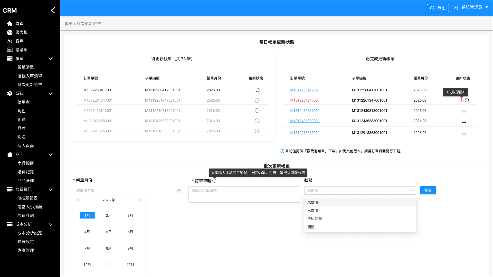

頁面進入後上半部為「**當日帳單更新狀態**」，下半部為「**批次更新帳單**」查詢區：

- **待更新帳單區塊**：標題列出總筆數（例：共 73 筆），列出 `訂單單號`、`子單單號`、`帳單月份`、`更新狀態`（RUNNING 顯示載入動畫、START 顯示時鐘圖示）。
- **已完成更新帳單區塊**：列出 `訂單單號`、`子單單號`、`帳單月份`、`更新狀態`；於更新狀態欄以 icon 呈現操作：
    - **SUCCESS**：顯示**下載圖示**（點擊下載繳費通知單）。
    - **FAIL**：顯示 **ⓘ 失敗原因 icon**（hover/點擊以 **popover** 顯示 `error` 失敗原因）＋ **重新更新 icon（重跑圖示）**（點擊單筆重跑，該筆移回「待更新帳單」，§4.1 步驟 10）。

    區塊下方註記：「目前僅提供『繳費通知單』下載，如需其他版本，請至訂單頁面另行下載。」
- **查詢條件輸入區**：
    - `*帳單月份`（必填）：月份選擇器（YYYY-MM）。
    - `*訂單單號`（必填）：多行 Textarea，旁附 ⓘ 提示「支援輸入多組訂單單號，上限 50 筆，每行一筆或以逗號分隔」。
    - `狀態`（選填，可多選）：下拉選單（未啟用 / 已啟用 / 合約期滿 / 關閉）。
    - 「搜尋」按鈕。

### 5.3 畫面 — 搜尋後（查詢結果清單）

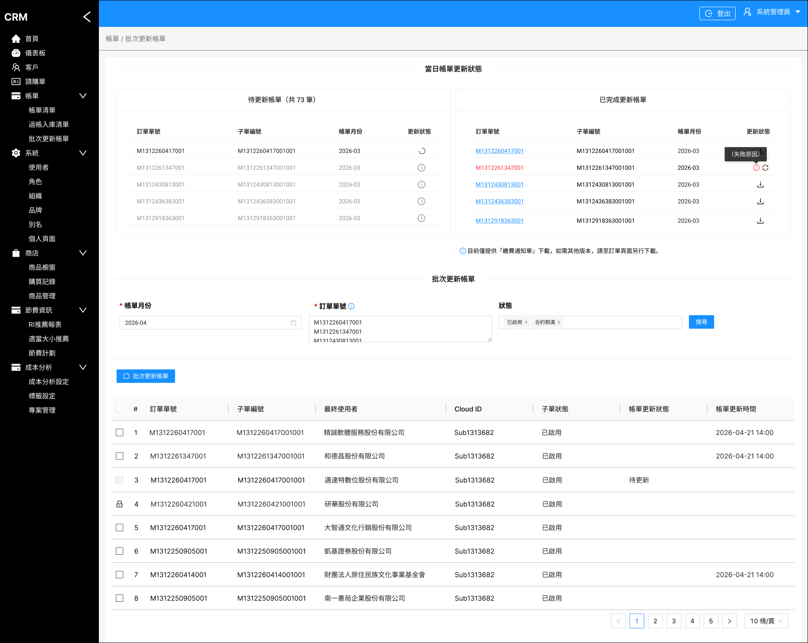

點「搜尋」後於查詢區下方顯示**查詢結果清單**與「**批次更新帳單**」送出按鈕：

- 表格欄位：勾選框、序號（#）、`訂單單號`、`子單單號`、`最終使用者`、`Cloud ID`、`子單狀態`、`帳單更新狀態`、`帳單更新時間`。
- 更新狀態為 START / RUNNING（待更新 / 更新中）之列其勾選框 **disabled**，不可重複觸發。
- **帳單已鎖定（`locked = true`）之列**：勾選欄位**以鎖頭圖示（🔒）取代勾選框**，不可選取。
- 表格底部提供分頁，採**後端分頁**：訂單單號查詢 API 以 `filter.pageIndex`/`filter.pageSize` 查詢，回應 `page`（含 `pageCount`/`dataCount`，§8.1/§8.6），前端依此分頁顯示。
- 勾選欲更新的子單後，點「批次更新帳單」送出，該批項目即進入上方「待更新帳單」區塊（START）。

### 5.4 前端結構與狀態管理輪廓

**路由與模組歸屬**

| 項目 | 規劃 |
| ---- | ---- |
| 路由路徑 | `/main/bills/batch-update`（Bills lazy-loaded 模組下，受 `AuthGuard` 保護）|
| 選單位置 | 帳單（Bills）>「批次更新帳單」（同截圖）|
| 權限 | 後端新增權限（比照 `invoice-v1::api::runInvoice`，§3）控制選單與頁面存取 |

**元件拆解（建議）**

- 頁面容器：`BatchUpdateBillComponent`
  - 當日狀態面板：`待更新帳單` 區塊 + `已完成更新帳單` 區塊（可各自為子元件）
  - 查詢區：月份 / 訂單單號 Textarea / 子單狀態下拉 / 搜尋
  - 結果表：`ma-table`（**關閉內建 `options.selection`**，於 `beforeRowSettingCell` 自繪選取欄）

**`ma-table` 選取欄設計（依 §5.3）**

| 列狀態 | 選取欄呈現 |
| ---- | ---- |
| 可更新（SUCCESS/FAIL/無任務 且未鎖定）| 啟用之 `nz-checkbox`，綁自管之已選集合 |
| START / RUNNING | `nz-checkbox` `[nzDisabled]="true"` |
| `locked = true` | 以鎖頭圖示（🔒）取代 checkbox|

> 因 `ma-table` 內建選取框不支援逐列 disabled（`Row` 僅有 `checked`），故改自繪選取欄以完整控制 disabled 與鎖頭。

**狀態管理輪廓**

| 狀態 | 來源 / 維護 |
| ---- | ---- |
| 待更新清單 / 已完成清單 | 進頁呼叫 Status API 初始化；後續由 SSE 事件增量更新 |
| 查詢結果清單 + 已選集合 | 搜尋後由訂單單號查詢 API 取得（後端分頁）；已選集合由前端維護，並**跨分頁保留**（換頁不清空已勾選）|
| SSE 連線 | 進頁建立、離頁（`ngOnDestroy`）關閉；斷線重連後重抓 Status API 還原（§8.4）|
| 送出後 | 對送出的子單**新增**為 `START` 至待更新清單；待 SSE `RUNNING` → 標更新中；`SUCCESS/FAIL` → 移至已完成 |
| 重新更新（FAIL 重跑）| 點「重新更新 icon」單筆呼叫批次更新 API，**依回應再移動**（不樂觀、不回滾）：僅 `enqueued` 移至「待更新」(`START`)；`lockedSkipped`/`skipped` 該筆**留在「已完成」**並提示對應訊息（已鎖定／更新中）。icon 一律保留可重複嘗試（§4.1 步驟 10、§6.8）|
| 重新整理/重連一致性 | 一律以 Status API 快照為準（§4、§6.6）|

---

## 6. 系統分析

### 🔹 更新狀態定義（`BillingStatus` enum，§6.4）

| 狀態 enum | 中文 | 說明 | UI 顯示 |
|-----------|------|------|---------|
| `START`   | 開始 | 已加入佇列，尚未開始計算 | 待更新 |
| `RUNNING` | 執行中 | 計算中 | 更新中 |
| `SUCCESS` | 成功 | 更新成功 | 已完成 |
| `FAIL`    | 失敗 | 更新失敗 | 更新失敗（顯示錯誤原因）|

### 🔹 架構說明

本系統採用：
- Status API 作為「狀態快照（snapshot）」
- SSE 作為「事件驅動（event-driven）更新機制」

確保：
- 頁面初始化正確性
- 即時狀態同步
- SSE 中斷時仍可透過 API 還原狀態


### 6.1 前後端互動序列圖

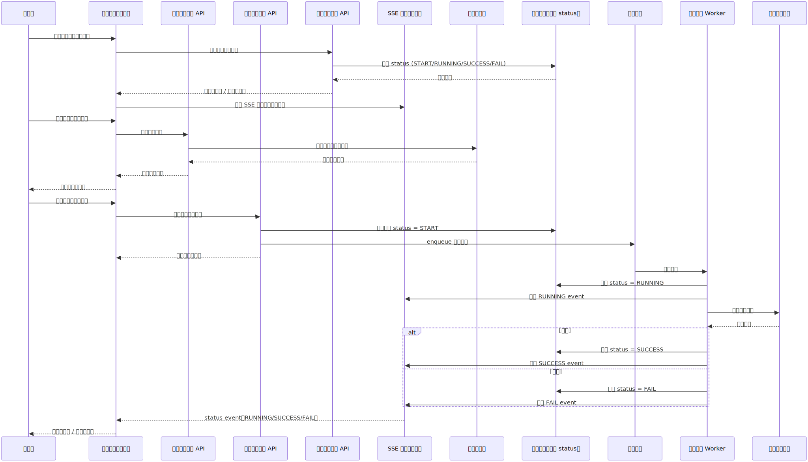


> 【備註】進入頁面即建立 SSE 連線並查詢現有任務狀態，確保即時監控「該使用者當日」帳單更新進度，不會遺漏其先前已在執行的任務。


### 6.2 系統架構圖


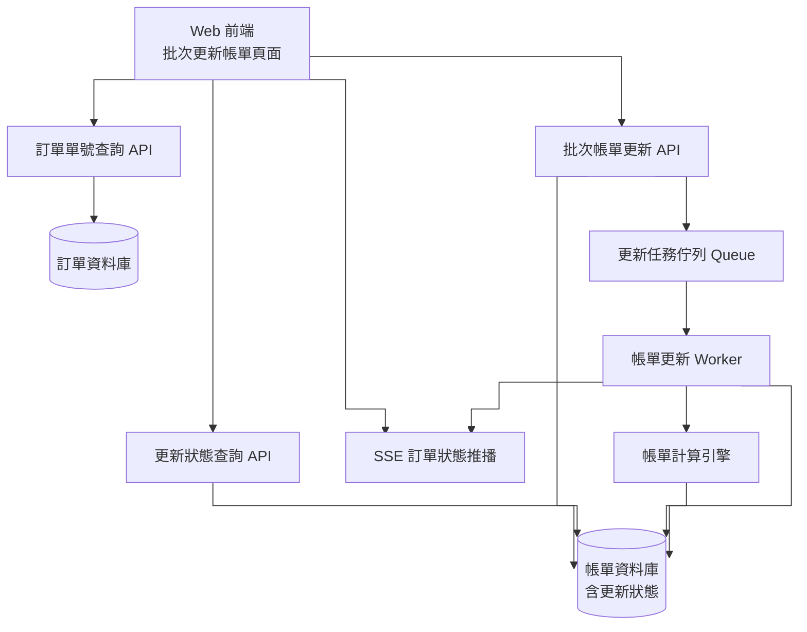

---

### 6.3 後端整體處理流程（非同步架構）

本功能後端採「**接收即回應、處理走非同步**」的設計，將「批次帳單更新 API」的職責拆為「**接收與入列（同步）**」與「**實際計算（非同步）**」兩段，避免大量帳單計算阻塞 HTTP 請求並導致 timeout（同 CMP-4280 改用串流/非同步的動機）。

整體流程分為三個責任區：

| 階段 | 元件 | 職責 |
| ---- | ---- | ---- |
| 接收層 | 批次帳單更新 API | 驗證輸入、冪等性檢查、寫入 `status = START`、推入佇列、立即回應已接收（不等待計算結果） |
| 處理層 | 任務佇列 + 帳單更新 Worker | 由佇列取出任務、逐筆呼叫帳單計算引擎、依結果回寫 `SUCCESS / FAIL`、發布狀態事件 |
| 推播層 | SSE 推播服務 | 訂閱狀態事件，將狀態變化即時推送給所有已連線之前端 |

> 接收層與處理層**完全解耦**：接收層只負責「把任務安全地放進佇列」，計算耗時與失敗都不影響 API 回應時間；前端則以 Status API（快照）＋ SSE（事件）兩個來源還原與同步狀態（§6.6）。

---

### 6.4 帳單更新狀態資料模型（沿用既有 `RunBillingAPIStatus`）

後端**已有** `RunBillingAPIStatus` 集合（model：`com.metaage.cmp.model.invoice.RunBillingAPIStatus`，「run billing api 執行狀態」），記錄每一筆「子單（orderDetailId）× 年月」的計費執行狀態。本功能**沿用此既有模型**作為 Status API 查詢來源、SSE 事件來源與冪等性判斷依據，**不需新增 collection**。

> ⚠️ **重要**：經追查現行 billing pipeline，**目前無任何元件實際寫入此 model**（進度追蹤實際走 `logMessage` ＋ `invoices.locked`）。本功能需**新建狀態寫入機制**（寫入時機見下；方向待與後端確認，詳 §6.12 第 7 點）。

> **來源檔案**（GitLab `cmp/services/model`，供追溯）：
> - 狀態 model：`src/main/java/com/metaage/cmp/model/invoice/RunBillingAPIStatus.java`
> - 狀態 enum：`src/main/java/com/metaage/cmp/model/invoice/BillingStatus.java`
> - 帳單主檔（`locked` / `lockDate` / `files`）：`src/main/java/com/metaage/cmp/model/invoice/Invoices.java`

**`RunBillingAPIStatus` 既有欄位**

| 欄位 | 型別 | 說明 / 對應本 SA |
| ---- | ---- | ---- |
| `id` | string(UUID) | 主鍵 |
| `orderDetailId` | string | 採購單 ID＝**子單ID**（本 SA 先前所稱 `subOrderId`）|
| `year` / `month` | string | 年（YYYY）/ 月（MM）|
| `status` | `BillingStatus` | 計費執行狀態 enum（見下）|
| `error` | string | 錯誤訊息（FAIL 時，對應前端「失敗原因」）|
| `createUserId` | string | 觸發者（＝本 SA 先前所稱 `triggeredBy`；取自 Gateway 注入之 `Sub`）；**重跑受理時更新為本次觸發者**，該筆即歸屬最後一次觸發者之當日面板 |
| `createDate` | Date | 創建日（＝觸發時間；「當日」過濾依據）；**重跑受理時更新為今日**，故昨日失敗、今日重跑會落入今日面板 |
| `modifyDate` | Date | 最後編輯日（＝最後狀態變更時間，對應 `billingUpdateTime`）|

**`BillingStatus` enum 與本功能採用之狀態**

既有 `BillingStatus`（`cmp/services/model`）為：`START("開始")` / `RUNNING("執行中")` / `FAIL("失敗")` / `SUCCESS("成功")`。

> ⚠️ **enum 調整註記（需後端配合，§6.12 第 7 點）**：
> - 經追查，此 enum 與 `RunBillingAPIStatus` 現行**未被使用**；現行單筆更新之狀態實際由 `invoice-v1` `checkRunBillingStatus` 以 K8s Job＋logMessage 推導，**回傳字面為 `WAIT` / `RUNNING` / `SUCCESS`**（失敗走 HTTP 500）。
> - 本功能需要明確的「排隊等待」狀態，**建議在 `BillingStatus` 新增 `WAIT("等待中")`**（與現行 `checkRunBillingStatus` 回傳字面一致）；`START` 語意不符且未使用，**保留但不採用**（不刪除，避免影響他處）。

**本功能採用之狀態（目標）**

| 狀態 | 中文 | UI 對應 | 寫入時機 |
| ---- | ---- | ---- | ---- |
| `WAIT`（建議新增）| 等待中 | 待更新 | 批次 API 入列當下 |
| `RUNNING` | 執行中 | 更新中 | Worker / generator_invoice 開始執行 |
| `SUCCESS` | 成功 | 已完成 | 計算成功 |
| `FAIL` | 失敗 | 更新失敗 | 計算失敗／逾時／重試耗盡 |

> 全文其餘章節（§4、§5、§6、§8）目前以 `START` 表示「待更新」，待此 enum 方向定案後再統一替換為 `WAIT`（§6.12 第 7 點）。

**索引（建議）**

| 索引 | 欄位 | 用途 |
| ---- | ---- | ---- |
| 唯一索引 | `(orderDetailId, year, month)` | 同一子單同一年月僅一筆 → 冪等性基礎（§6.7）|
| 查詢索引 | `(createUserId, createDate, status)` | 支援 Status API「使用者 × 當日 × 狀態」查詢與 SSE 範圍過濾（§6.6）|

**關聯資料（非本表，需 join）**

| 需求 | 來源 |
| ---- | ---- |
| `locked`（已鎖定）、`lockDate`（出帳/鎖定時間）、產生之帳單檔 `files` | **`Invoices`** 集合（`com.metaage.cmp.model.invoice.Invoices`），以 `(orderDetailId, year, month)` 對應 |
| `orderErpNumber`、`subNumber`、最終使用者、CloudId、子單狀態 | 訂單（order）資料，查詢/顯示時 join |

> **狀態真實來源（Source of Truth）**：`RunBillingAPIStatus` 為帳單計費狀態唯一權威來源；`locked` 之真實來源為 `Invoices.locked`。SSE 僅為即時通知，前端最終一致性以 Status API 為準（§4、§6.6）。

---

### 6.5 任務佇列與 Worker 設計

**入列（Enqueue）**

- 批次帳單更新 API 對通過冪等性檢查的每一筆子單，建立/更新 `RunBillingAPIStatus` 為 `START`，並各推入一則佇列訊息。
- 訊息內容至少包含：`orderDetailId`、`year`、`month`、`RunBillingAPIStatus.id`。
- 入列與寫入 `START` 需具一致性：先寫 DB（`START`）再發 Kafka。⚠️ kafka-producer 為 fire-and-forget（送出失敗仍回 200，§6.11），故無法以入列回應判定投遞成敗；改以任務表 `START` 為準，並依賴補償掃描偵測「`START` 逾時未轉 `RUNNING`」之未消費任務，重發或標記 `FAIL`。

**Worker 取出與處理**


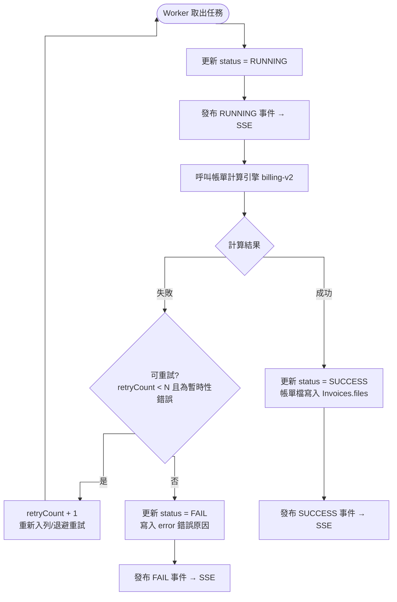

**設計要點**

| 項目 | 設計（數值為建議，待後端依實測調整，§6.12）|
| ---- | ---- |
| 併發度 | Worker 以固定併發數（pool）消化佇列；因 billing-v2 用 Selenium+Chromium 產 PDF、單筆吃資源，**建議併發 3**（可設定），避免過載。 |
| 逐筆獨立 | 每筆子單為獨立任務，單筆失敗不影響其他筆（與前端逐筆狀態轉換一致）。 |
| 單筆 timeout | 每筆計算設定上限時間，逾時視為失敗並寫入 `error`。**建議 120 秒**（產 PDF 較慢；CMP-4280 SSE 檢核 timeout 為 600 秒可參考上界）。 |
| 重試策略 | 僅對**暫時性錯誤**（引擎暫時不可用、逾時）重試，採退避（backoff）；**建議上限 2 次、間隔 5s／15s**；超過則 `FAIL`。業務性錯誤（資料不符）不重試，直接 `FAIL`。 |
| 補償機制 | 定期掃描「`RUNNING`（或 `START` 未被消費）超過門檻時間」之任務（Worker 異常中斷遺留），標記 `FAIL` 或重新入列；**建議門檻 10 分鐘**。 |
| 失敗訊息 | `FAIL` 時必須寫入可讀的 `error`，作為前端「失敗原因」顯示與 SSE `FAIL` 事件內容。 |

---

### 6.6 SSE 推播機制設計

本案 SSE 與 CMP-4280 的**請求範圍串流**不同：CMP-4280 是「一次請求 → 回報該請求進度後結束」；本案是**長連線的狀態廣播**，前端進頁即建立連線，持續接收「**該使用者當日**所有帳單更新任務」的狀態變化（含該使用者先前已在執行、尚未完成的任務），故設計重點在**連線範圍**與**多實例事件擴散**。

**可重用之既有 SSE 元件（依 CMP-4280／CMP-4266，參 Confluence「CMP_SA_SSE」「CMP_SD_後端_SSE」）**

| 元件 | 位置 | 用途 / 本功能如何重用 |
| ---- | ---- | ---- |
| `SseEvent<T>`（公版事件封裝）| `cmp/services/model`：`com.metaage.cmp.model.sse.SseEvent` | 事件統一封裝（`eventType`/`message`/`progress`/`data`/`timestamp`…）。本功能以 `STEP_PROGRESS` 事件、`data` 載單筆任務狀態（§8.4）|
| `SseHelper`（公版推送工具）| `cmp/services/model`：`com.metaage.cmp.util.SseHelper` | **「與業務無關，任何需要 SSE 的功能直接呼叫」**。本功能用 `sendData()` 推單筆狀態、`sendError()` 報錯、`sendDone()` 收尾；底層 Spring `SseEmitter` |
| `SseEmitter` + 600s timeout | Spring MVC | 連線逾時沿用 CMP-4280 之 600 秒 |
| 前置驗證 → HTTP 400 | Controller | 建立 SSE 前先驗證，失敗回 400（不進串流）—本功能比照（§8.5）|
| `ApiSseService`（前端）| CMP 前端（CMP-4280 新增）| fetch + ReadableStream 帶 Bearer Token 建立 SSE，可直接重用 |

> **與 CMP-4280 的關鍵差異（連線模型）**：CMP-4280 的 `SseEmitter` 由「發起檢核的那個請求執行緒」**同步逐步**推事件、結束即 `complete()`（請求範圍）。本功能的狀態變化來自**非同步 Worker（generator_invoice，不同 process）**，故 `SseEmitter`／`SseEvent`／`SseHelper` 雖可重用於「**事件格式與發送**」，但「**觸發推送的來源**」需改為 **Worker 經共用事件匯流通知持有連線的實例**（見下「多實例事件擴散」），而非由單一請求執行緒驅動。

**連線與事件**

| 項目 | 設計 |
| ---- | ---- |
| 端點 | `GET` 長連線，`Content-Type: text/event-stream`（事件格式同 §8.4）。 |
| 推播範圍 | 僅推播「**該連線使用者**、當日」之任務狀態變化（對應頁面「當日帳單更新狀態」為個人工作面板，即 `createUserId == 當前使用者 AND createDate 為今日`）。 |
| 事件型別 | 沿用 §8.4：`RUNNING` / `SUCCESS` / `FAIL`（`START` 由送出當下前端自行樂觀新增，不需 SSE）。 |
| 心跳 | 每隔固定秒數送出 SSE comment（`:\n\n`）作為 heartbeat，維持連線並偵測斷線。 |
| 斷線重連 | 前端重連後**重新呼叫 Status API** 取得最新快照即可還原狀態（§4：最終一致性以 Status API 為準），無需依賴事件補發。 |

**多實例事件擴散（重要）**

當後端為多實例部署時，「處理任務的 Worker」與「持有前端 SSE 連線的實例」可能不是同一台。Worker 完成狀態變更後若僅在本機發事件，其他實例上的前端將收不到推播。因此需引入**共用事件匯流（pub/sub）**：


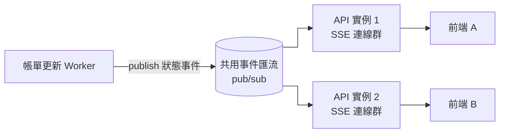

- Worker 完成 DB 狀態回寫後，向共用事件匯流發布事件（事件需帶 `createUserId`、`createDate` 供過濾）。
- 各 API 實例訂閱事件匯流，將事件轉送給自己持有的、且符合推播範圍（該使用者、當日）的 SSE 連線。
- 若部署為單實例，亦應以同一抽象介面實作（行程內事件匯流），確保未來水平擴展不需改動推播邏輯。

---

### 6.7 狀態機與冪等性（重複觸發防護）

**狀態機**


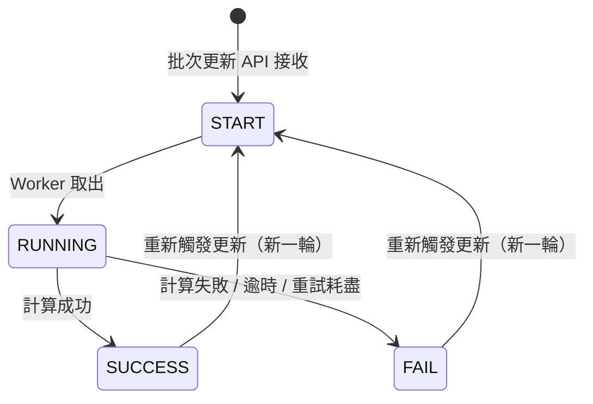

- 僅 `SUCCESS` / `FAIL` 為終態，可被使用者重新觸發回到 `START`（重新計算）。
- `START` / `RUNNING` 為進行中，**不可再次觸發**。
- **「重新更新」入口**：「已完成更新帳單」FAIL 項目的「重新更新 icon」即為 `FAIL → START` 的觸發來源，後端**重用批次更新 API**（單筆 `subOrderId`），不另設端點；其冪等、鎖定排除與一般批次送出完全一致（下方冪等性與 §6.8）。

**冪等性與重複觸發防護（後端強制）**

前端雖以 checkbox disabled 阻擋（§4.2、UC-03），但後端**必須獨立強制**，避免並發或繞過前端造成重複入列：

1. 批次更新 API 收到子單清單後，依 `(orderDetailId, year, month)` 查詢 `RunBillingAPIStatus`，並查 `Invoices.locked`。
2. 若帳單 `locked = true` → **略過該筆**（不入列），回應 `lockedSkipped` 告知（§6.8）。
3. 若狀態為 `START` 或 `RUNNING` → **略過該筆**（不重複入列），回應 `skipped` 告知前端。
4. 若無任務或狀態為 `SUCCESS` / `FAIL`（且未鎖定）→ 以 upsert 寫入/重置為 `START` 並入列；**同時將 `createUserId` 更新為本次觸發者（Gateway 注入之 `Sub`）、`createDate` 更新為今日**，使該筆歸屬本次觸發者之當日面板與 SSE 推播範圍（§6.4、§6.6）。此即「重跑受理（`enqueued`）後該筆必為本次使用者所有、可安全顯示於其『待更新』」之依據。
5. 唯一索引 `(orderDetailId, year, month)` 作為最終防線，攔截競態下的重複寫入。

---

### 6.8 後端驗證與業務規則

| 規則 | 後端行為 |
| ---- | ---- |
| 批次上限 50 筆 | 後端同步驗證。超過則回 400 並提示，整批不入列。 |
| 訂單單號存在性 | 訂單單號查詢 API 至訂單資料庫驗證存在性與歸屬，**僅回傳有效清單**（UC-02）；無效項目不回傳。查詢範圍為「**該使用者依既有訂單權限可查得**」之訂單（沿用既有訂單資料權限）。 |
| 狀態過濾 | 訂單單號查詢 API 依輸入 `status`（子單狀態）過濾子單，並關聯 `RunBillingAPIStatus` 回填 `billingUpdateStatus`，供前端決定 checkbox 是否可勾選。 |
| 查詢清單狀態取全域 | 查詢結果清單回填的 `billingUpdateStatus` 須取自 `RunBillingAPIStatus` 的**全域狀態（不分 createUserId）**。因訂單可被多位有權限者查得，若某筆已由他人觸發為 START / RUNNING，亦須在清單呈現並 disabled，避免重複觸發；最終仍由冪等性（§6.7）把關。 |
| 月份格式 | 驗證 `year`(YYYY) / `month`(MM) 格式與合理範圍。 |
| 權限 | 由 **Gateway** 驗證 Azure B2C JWT 並注入 `Sub`(userId)/`Role`(roleId) header（後端不自行解析 JWT）；後端依 `Role` + IAM 檢查帳單管理權限（新增權限，比照 `invoice-v1::api::runInvoice`，§3），`createUserId` 取自 `Sub`。SSE 連線同樣經 Gateway 驗證（§6.11）。 |
| 子單可更新性 | **不限制子單狀態**：已關閉 / 合約期滿之子單亦允許重跑帳單，後端不加阻擋（依需求方確認）。 |
| 已鎖定帳單排除 | **已鎖定（locked）帳單不可重跑**。查詢 API 回填 `locked`；批次更新 API 須**強制排除** `locked = true` 之子單（不入列），並於回應 `lockedSkipped` 告知前端（沿用 billing-v2 `addLocked` 排除已鎖定之既有邏輯，§6.11）。注意「帳單鎖定」與「子單狀態」為**不同維度**：子單狀態不限制，但帳單一旦鎖定即不可重跑。 |
| 重新更新（FAIL 重跑）須重驗鎖定與狀態 | 「重新更新」走同一支批次更新 API，**不可假設 FAIL 必可重跑**。後端須於入列前**即時重查 `Invoices.locked` 與全域 `RunBillingAPIStatus` 狀態**：已鎖定回 `lockedSkipped`、已在 `START`/`RUNNING` 回 `skipped`。此二者前端**皆留在「已完成」並提示**（不移至「待更新」、不回滾刪除），僅 `enqueued` 才進「待更新」（§4.1 步驟 10、§5.4）。<br>**設計理由**：「已完成」面板資料源（§8.3 Status API + SSE）不帶 `locked` 且為「該使用者當日」範圍；若把 `skipped`（常為他人正在更新）移入「待更新」顯示更新中，該使用者收不到他人任務之 SSE，將永久卡在「更新中」。故一律留在「已完成」、靠重複點擊在解鎖／他人完成後被受理，最為一致。 |

---

### 6.9 例外處理與邊界情境

| 情境 | 後端處理 |
| ---- | ---- |
| 帳單計算引擎暫時不可用 | 視為暫時性錯誤，依重試策略退避重試；耗盡後 `FAIL`，`error` 標示引擎錯誤。 |
| 單筆計算逾時 | 標記 `FAIL`，`error = 帳單計算逾時`，不影響同批其他筆。 |
| Worker 中途崩潰 | 補償掃描將遺留之 `RUNNING` 任務重置（§6.5）。 |
| 入列（寫 DB）後發 Kafka 失敗 | Kafka 為 fire-and-forget（§6.11），無法即時得知投遞結果；以任務表 `START` 為準，由補償掃描偵測「`START` 逾時未轉 `RUNNING`」者重發或標 `FAIL`，避免孤兒 `START`。 |
| 重複觸發（並發） | 由狀態檢查 + 唯一索引雙重防護（§6.7）。 |
| SSE 連線中斷 | 前端重連並重抓 Status API 還原；後端心跳維持連線健康。 |
| 跨日任務 | 前一日該使用者未完成之任務不在「當日」面板範圍；其狀態仍存於任務表，若於查詢清單搜得對應訂單仍會回填全域狀態。 |

---

### 6.10 非功能需求

| 類別 | 需求 |
| ---- | ---- |
| 效能 | 批次更新 API 採非同步，回應時間不隨筆數線性增加（接收即回，目標 < 1s）。 |
| 可擴展性 | Worker 與 SSE 推播支援多實例水平擴展（透過共用佇列與事件匯流，§6.5、§6.6）。 |
| 可靠性 | 任務具持久化（DB + 佇列），服務重啟不遺失；具補償與重試機制。 |
| 一致性 | 狀態最終一致性以任務表（Status API）為準；SSE 為盡力即時通知。 |
| 安全性 | 所有端點含 SSE 均受 JWT 與帳單管理權限保護。 |
| 可觀測性 | 任務狀態、失敗原因（`error`）可查詢，便於營運排查長時間 `RUNNING` / `FAIL` 任務。 |

---

### 6.11 對應既有後端服務與架構（依 Confluence「CMP 後端架構」）

> 本節將前述抽象元件對應至 CMP 既有後端服務，供開發時直接落地。資料來源：Confluence「CMP 後端架構」資料夾（billing-v2、invoice-v1、kafka-producer-v1、scheduler-v1、order-v2、connector-core 等）。

**元件對應**

| 本 SA 抽象元件 | 既有服務 / 機制 | 說明 |
| ---- | ---- | ---- |
| 批次帳單更新 API | 建議置於 billing 領域（Gateway 前綴 `billing-v1/`） | 接收子單清單、寫任務狀態、發 Kafka |
| 訂單單號查詢 API | order-v2 `GET /orders`（OrderRs） | 驗證訂單/子單存在與權限範圍 |
| 任務佇列 Queue | Kafka（經 kafka-producer-v1 `POST /send`） | Topic 沿用既有 `cmp-ready-to-billing`（觸發計費）；Key 建議用 `invoiceId`（帳單相關）以保同帳單順序 |
| 帳單更新 Worker | `billing_receiver`（`cmp-ready-to-billing` 的 consumer） | 取訊息後呼叫 billing-v2 計費 |
| 帳單計算引擎 | billing-v2 `GET /billing/{orderDetailId}?year=&month=`（Selenium+Chromium 產 PDF/PNG） | **orderDetailId 即子單ID**；單筆計費耗時長（CMP-4339 慢的根因） |
| 帳單主檔 / 下載來源 | invoice-v1（invoices collection；產出檔在 `Invoices.files`）；下載 API：`GET invoice-v1/invoice/file/{orderDetailId}?year={year}&month={month}&type={type}` | SUCCESS 後前端以此 API 下載「繳費通知單」，`type=SUMMARY_PDF`（`PDF` 為「繳費通知單(含用量彙整)」）|
| SSE 推播 | 重用公版 `SseEvent`＋`SseHelper`（`cmp/services/model`）＋ Spring `SseEmitter`；前端重用 `ApiSseService`（皆 CMP-4280／4266 既有，§6.6）| 端點本身需新增於 billing 領域服務；事件格式/發送/前端串接可直接重用，無需另造輪子 |

**關鍵架構約定（需遵循）**

1. **認證走 Gateway**：Gateway 驗證 Azure B2C JWT 後注入 `Sub`(userId)、`Role`(roleId) header，後端服務**不自行解析 JWT**（Spring Security 未啟用）。
   - `createUserId` 取自 `Sub` header；權限依 `Role` + IAM 判斷。
   - SSE 連線之驗證與「該使用者」識別同樣依 Gateway 注入之 `Sub`（修正 §6.6、§8.4 之「後端自行驗證 JWT」描述）。
2. **統一回應格式 RsBody**：經 Gateway 之 API 回應採 `{ data, info: { code, message, queryTime, exception, success }, page: { pageSize, pageIndex, pageCount, dataCount } }`（`page` 僅分頁查詢有）。詳見 §8.6。
3. **Kafka 為 fire-and-forget**：kafka-producer `send()` 立即返回，**送出失敗 HTTP 仍回 200**，呼叫方無法即時得知。故「已入列」不等於「Kafka 投遞成功」——任務狀態以任務表 `START` 為準，未被消費者轉為 `RUNNING` 的任務，由 §6.5 補償掃描（逾時偵測）處理，不可僅靠 API 入列回應判定成敗。
4. **計費同步且慢**：billing-v2 以 Selenium+Chromium 產 PDF/PNG，單筆耗時長 → 佐證本功能採非同步批次（§6.3）之必要性。
5. **SSE 端點落點（依 Confluence 前例之建議）**：
   - **Gateway 為 reactive（spring-cloud-gateway / WebFlux）**，是所有前端請求唯一入口，已負責 CORS、B2C JWT 驗證與注入 `Sub/Role/DataRule` header，且**已實際路由既有 SSE**（CMP-4280 的 `POST /Microsoft/checkOrders`，`text/event-stream`、timeout 600 秒）。可見「SSE 經 Gateway 串流」之路徑已驗證可行。
   - **CMP 無獨立 BFF 層**；既有前例（CMP-4280）是把 SSE 端點實作於**領域服務**（order 服務）再經 Gateway 路由。
   - **建議**：本功能 SSE 端點實作於**承載批次更新 API 的 billing 領域服務**，經 Gateway 路由（由 Gateway 注入 `Sub` 識別使用者）；不另立 BFF。
   - **注意**：billing-v2 為重型服務（Selenium/Chromium 產 PDF），不建議將長連線直接掛在它身上；SSE 宜置於 billing 領域中**承載 API 的前端導向服務**而非計算 worker。
   - 無論落點，持有連線之服務皆須**訂閱共用事件匯流（Kafka）**（§6.6），因 `billing_receiver`（算帳單者）與持連線者通常非同一 process。前端串接方式不受影響（一律 `fetch + ReadableStream`）。

> 既有 `scheduler-v1` 已具「觸發帳單批次處理（billing batch）」，並有 billing-v2 `POST /scheduler/runBilling/{brand}`、`GET /scheduler/getOrderInfo`（排程用批量）。本功能為**使用者手動指定訂單之批次重跑**，入口不同，但**底層計費（billing-v2）與帳單儲存（invoice-v1）可重用**。

---

### 6.12 待確認事項

| # | 項目 | 說明 |
| --- | ---- | ---- |
| 1 | 後端 Jira 單號 | 後端開發單尚未開立，待補（§1.1）。 |
| 2 | SSE 端點落點 | 已建議經 Gateway 路由、實作於承載批次更新 API 之 billing 前端導向服務（非 billing-v2 計算 worker，§6.11 第 5 點）；確切服務待後端依拓撲確認。 |
| 3 | API 實際路徑與所屬服務 | §8 各路徑（`billing-v1/…`、`order-v2/…`）為**暫定先行版**，後端有需要再調整。 |
| 4 | Kafka topic 與訊息 schema | 沿用既有 `cmp-ready-to-billing` 或新 topic；key（建議 `invoiceId`/`orderDetailId`）、payload 欄位。 |
| 5 | 並發/重試/逾時數值 | §6.5 已給**建議值**（併發 3、重試 2、timeout 120s、補償 10 分）；待後端依 billing-v2 實測調整。 |
| 6 | 狀態寫入機制與 `BillingStatus` 新增 `WAIT` | 本功能採持久化 `RunBillingAPIStatus`（§6.4），但現行 pipeline 未寫入此 model，需**新建寫入**。待確認：(a) 於共用 model `BillingStatus` **新增 `WAIT`（排隊中）**；(b) 狀態由誰寫入與發 SSE 事件（`generator_invoice` 擴充 vs 新增 consumer/wrapper）。確認 `WAIT` 後，全文「待更新」狀態值由 `START` 統一替換為 `WAIT`。 |

## 7. 資料需求

  ### 7.1 查詢輸入區

  | 欄位名稱   | 類型         | 必填 | 說明                         |
  | ---------- | ------------ | ---- | ---------------------------- |
  | 訂單單號   | Textarea     | ✅   | 多組編號，每行一筆或逗號分隔 |
  | 帳單月份   | Date Picker  | ✅   | 格式 YYYY-MM                 |
  | 子單狀態   | Select（多選）|      | 可多選，篩選指定狀態的訂單   |

  ### 7.2 確認清單（表格）

  | 欄位名稱         |  說明                       |
  | ---------------- | -------------------------- |
  | 勾選框           | 可多選；START/RUNNING（更新中）或**已鎖定**不可勾選 |
  | 訂單單號         | 主單號                     |
  | 子單單號         | 子單編號                   |
  | 最終使用者       | 客戶名稱                   |
  | CloudId         | Cloud ID                   |
  | 子單狀態         | 已啟用/未啟用/合約期滿/關閉  |
  | 帳單更新時間     | 最後更新時間               |
  | 帳單更新狀態     | 待更新/更新中/已完成/更新失敗；已鎖定者標示「已鎖定」 |

  ### 7.3 待更新帳單區塊

  | 欄位名稱         | 說明                       |
  | ---------------- | -------------------------- |
  | 訂單單號         | 主單號                     |
  | 子單單號         | 子單編號（對應 subOrderId） |
  | 帳單月份         | YYYY-MM               |
  | 更新狀態         | 待更新/更新中           |

  ### 7.4 已完成更新帳單區塊

  | 欄位名稱         | 說明                       |
  | ---------------- | -------------------------- |
  | 訂單單號         | 主單號                     |
  | 子單單號         | 子單編號（對應 subOrderId） |
  | 帳單月份         | YYYY-MM               |
  | 更新狀態         | **成功**：下載按鈕（呼叫 `GET invoice-v1/invoice/file/{orderDetailId}?year=&month=&type=SUMMARY_PDF`，繳費通知單）。**失敗**：ⓘ 失敗原因 icon（popover 顯示 `error`）＋ 重新更新 icon（單筆重跑，移回「待更新帳單」，§4.1 步驟 10）|

  ### 7.5 前端資料模型（View Model）

  | 欄位名稱        | 型別    | 說明           |
  |-----------------|---------|----------------|
  | subOrderId      | string  | 子單ID（統一命名，對齊 API）|
  | orderErpNumber  | string  | 訂單單號（312 編號，對齊 API）|
  | subNumber       | string  | 子單單號       |
  | endUserData.customerName.fullCh    | string  | 客戶名稱       |
  | cloudId         | string  | Cloud ID       |
  | status          | string  | 子單狀態（enum，顯示時翻譯）|
  | billingUpdateTime   | string  | 帳單更新時間   |
  | billingUpdateStatus     | string  | 帳單更新狀態（`BillingStatus`：START/RUNNING/SUCCESS/FAIL）|
  | locked          | boolean | 帳單是否已鎖定（true 以鎖頭圖示禁選）|
  | selectable      | boolean | 是否可勾選（START/RUNNING 或 locked 時為 false）|
  
  ### 7.6 畫面區塊資料來源

  | UI 區塊             | 資料來源 API | 
  |--------------------|-------------|
  | 待更新帳單區塊     | 帳單更新狀態查詢 API、帳單更新狀態推播 API（SSE）| 
  | 已完成帳單區塊     | 帳單更新狀態查詢 API、帳單更新狀態推播 API（SSE）  | 
  | 查詢            | 訂單單號查詢 API  | 
  | 批次更新         | 批次帳單更新 API  |

---

## 8. API 需求

> **API 路徑為建議值（待後端確認）**：以下各 API 之路徑為依 Gateway 前綴慣例（billing 領域 `billing-v1/`、訂單 `order-v2/`）提出之建議，實際路徑與所屬服務以後端定義為準（§6.12）。

### 8.1 訂單單號查詢 API

| 項目   | 內容 |
| ------ | ---- |
| Method | POST |
| 路徑（建議）| `POST /billing-v1/batchBilling/validate`（或沿用 order-v2 訂單查詢，待確認）|
| 說明   | 驗證訂單單號是否存在，僅回傳有效清單 |

**輸入參數**

採 CMP 通用 **`RqBody.filter`（MessageFilter）** 格式：查詢條件放在 `filter.and`（每筆為 `{ field, comparator, value }`），分頁放在 `filter.pageIndex` / `filter.pageSize`，排序放 `filter.sort`。

| 位置 | 參數 | 型別 | 必填 | 說明 |
|------|------|------|------|------|
| `filter.and[]` | `orderErpNumber` | string[] | ✅ | 多組訂單單號（comparator 建議 `IN`）|
| `filter.and[]` | `year` | string | ✅ | 年份（YYYY，comparator `EQ`）|
| `filter.and[]` | `month` | string | ✅ | 月份（MM，comparator `EQ`）|
| `filter.and[]` | `status` | string[] | | 子單狀態（`OrderStatus`：USING / NOT_ACTIVATED / CONTRACT_EXPIRED / CLOSE；comparator `IN`）|
| `filter` | `pageIndex` | number | ✅ | 頁碼（後端分頁，§5.3）|
| `filter` | `pageSize` | number | ✅ | 每頁筆數 |

> `field` / `comparator` 之確切名稱與可用值依後端 `MessageFilter` 規格為準（§6.12）；以下為示意。

**Request Body 範例**
```json
{
  "filter": {
    "and": [
      { "field": "orderErpNumber", "comparator": "IN", "value": ["M312xxxxx", "M312yyyyy", "M312zzzzz"] },
      { "field": "year",  "comparator": "EQ", "value": "2026" },
      { "field": "month", "comparator": "EQ", "value": "04" },
      { "field": "status", "comparator": "IN", "value": ["USING"] }
    ],
    "or": [],
    "sort": {},
    "pageSize": 10,
    "pageIndex": 1,
    "fields": []
  }
}
```

**輸出參數**
| 參數名稱           | 型別     | 說明                       |
|--------------------|----------|----------------------------|
| orderErpNumber     | string   | 訂單單號 (312編號)           |
| subOrderId         | string   | 子單ID (for API)           |
| subNumber          | string   | 子單編號 (for 顯示)         |
| endUserData        | object   | 最終使用者資訊             |
| └─ id              | string   | 使用者ID                   |
| └─ customerName    | object   | 客戶名稱（中/英/暱稱）      |
| cloudId            | string   | Cloud ID                   |
| status             | string   | 子單狀態（enum，見下方「子單狀態 enum 對照」）|
| billingUpdateTime  | string   | 帳單更新時間               |
| billingUpdateStatus| string   | 帳單更新狀態（`BillingStatus` enum：START / RUNNING / SUCCESS / FAIL；無任務則為 null）|
| locked             | boolean  | 帳單是否已鎖定（來源 `Invoices.locked`）；`true` 時前端以鎖頭圖示禁選，不可重跑（§6.8）|

> 回應為 RsBody 格式（§8.6）：清單於 `data`，分頁資訊於 `page`（`pageSize` / `pageIndex` / `pageCount` / `dataCount`），結果碼於 `info`。

> **子單狀態 enum 對照**（輸入 `status` 與輸出 `status` 一致採用 enum，中文顯示由前端翻譯）：
> 來源：既有 `OrderStatus`（`cmp/services/model` → `order/status/OrderStatus.java`），掛於 `OrderDetail.status`。
>
> | enum | 顯示 |
> | ---- | ---- |
> | `USING` | 已啟用 |
> | `NOT_ACTIVATED` | 未啟用 |
> | `CONTRACT_EXPIRED` | 合約期滿 |
> | `CLOSE` | 關閉 |


**Response 範例**
```json
{
  "data": [
    {
      "orderErpNumber": "M312xxxxx",
      "subOrderId": "2026042177138501",
      "subNumber": "M312xxxxx-01",
      "endUserData": {
        "id": "...",
        "customerName": { "fullCh": "...", "nickCh": "...", "fullEn": "...", "nickEn": "" }
      },
      "cloudId": "Cloud123",
      "status": "USING",
      "billingUpdateTime": "2026-04-21 14:00",
      "billingUpdateStatus": "START",
      "locked": false
    }
  ],
  "info": {
    "code": "core:0000",
    "message": "findOrders success",
    "queryTime": 0,
    "exception": null,
    "success": true
  },
  "page": {
    "pageSize": 10,
    "pageIndex": 1,
    "pageCount": 0,
    "dataCount": 0
  }
}
```

---

### 8.2 批次帳單更新 API

| 項目   | 內容 |
| ------ | ---- |
| Method | POST |
| 路徑（建議）| `POST /billing-v1/batchBilling` |
| 說明   | 前端送出批次更新清單，回傳是否成功接收 |

**輸入參數**
| 參數名稱    | 型別     | 必填 | 說明         |
|-------------|----------|------|--------------|
| subOrderId  | string[] | ✅   | 子單ID（統一命名，對齊查詢 API 之 `subOrderId`）|
| year        | string   | ✅   | 年份（YYYY） |
| month       | string   | ✅   | 月份（MM）   |

**Request Body 範例**
```json
{
  "subOrderId": ["2026042177138501", "2026042104585301"],
  "year": "2026",
  "month": "04"
}
```

**輸出參數**
| 參數名稱 | 型別   | 說明                 |
|----------|--------|----------------------|
| message  | string | 執行結果訊息         |

**Response 範例**
```json
{
  "message": "已成功加入更新佇列"
}
```

---

### 8.3 帳單更新狀態查詢 API

| 項目   | 內容 |
| ------ | ---- |
| Method | GET  |
| 路徑（建議）| `GET /billing-v1/batchBilling/status?status=` |
| 說明   | 查詢「**當前使用者當日**」發起之更新項目最新狀態，供「當日帳單更新狀態」面板初始化。後端依 Gateway 注入之 `Sub` 取得使用者並隱含過濾 `createUserId == 當前使用者 AND createDate 為今日`（§6.4、§6.6），前端不需傳遞使用者/日期。支援以 status 參數查詢（START, RUNNING, SUCCESS, FAIL）。 |

**輸入參數**
| 參數名稱 | 型別     | 必填 | 說明                                         |
|----------|----------|------|----------------------------------------------|
| status   | string[] | ✅   | 狀態條件（`BillingStatus`：START, RUNNING, SUCCESS, FAIL）|

> 範圍（使用者、當日）由後端依 token（`Sub`）+ `createDate` 隱含套用，不開放前端覆寫。

**Request Query 範例**
```
?status=START,RUNNING    // 查詢待更新與處理中的更新項目
?status=SUCCESS,FAIL     // 查詢已完成與失敗的更新項目
```

**輸出參數**
| 參數名稱           | 型別   | 說明                       |
|--------------------|--------|----------------------------|
| subOrderId         | string | 子單ID（即 `orderDetailId`，**前端清單唯一鍵**，用於對應 SSE 事件）|
| subNumber          | string | 子單編號（顯示用）         |
| orderErpNumber     | string | 訂單單號 (312編號)         |
| year               | string | 年份（YYYY）               |
| month              | string | 月份（MM）                 |
| billingUpdateTime  | string | 帳單更新時間（`modifyDate`）|
| billingUpdateStatus| string | 狀態（`BillingStatus`：START, RUNNING, SUCCESS, FAIL）|
| message            | string | 補充訊息（FAIL 時為 `error`）|

**Response 範例**
```json
[
  {
    "subOrderId": "2026042177138501",
    "subNumber": "M312xxxxx-01",
    "orderErpNumber": "M312xxxxx",
    "year": "2026",
    "month": "04",
    "billingUpdateTime": "2026-04-21 14:00",
    "billingUpdateStatus": "SUCCESS",
    "message": null
  },
  {
    "subOrderId": "2026042104585301",
    "subNumber": "M312yyyyy-01",
    "orderErpNumber": "M312yyyyy",
    "year": "2026",
    "month": "04",
    "billingUpdateTime": "2026-04-21 14:01",
    "billingUpdateStatus": "FAIL",
    "message": null
  }
]
```

---

### 8.4 帳單更新狀態推播 API（SSE）

| 項目   | 內容 |
| ------ | ---- |
| Method | GET  |
| 路徑（建議）| `GET /billing-v1/batchBilling/sse`（`text/event-stream`）|
| 事件格式 | **沿用公版 `SseEvent`**（`com.metaage.cmp.model.sse.SseEvent`，由 `SseHelper` 發送，§6.6 可重用元件）。SSE event `name` = `eventType`。本功能每筆任務狀態變化以 **`STEP_PROGRESS`** 事件推送（透過 `SseHelper.sendData`），該筆狀態置於 `data`；連線層錯誤以 `ERROR` 事件回報。<br>不使用 `STEP_INIT/STEP_START/STEP_COMPLETE`（那是「單一多步驟操作」用，本功能為多筆獨立任務之狀態廣播）。 |
| 逾時 | `SseEmitter` timeout **600 秒**（沿用 CMP-4280）。 |
| 說明   | 前端建立連線後，後端持續推送狀態事件：<br>1. 訂單進入處理中（`data.billingUpdateStatus = RUNNING`）→ 待更新該筆轉「更新中」<br>2. 成功（SUCCESS）/ 失敗（FAIL）→ 該筆從「待更新」移至「已完成」 |

**輸入參數**
| 參數名稱       | 型別     | 必填 | 說明                         |
|----------------|----------|------|------------------------------|
| 無 query 參數  | -        | -    | 前端建立 SSE 連線即可；範圍由後端依 token 隱含套用（該使用者當日）|

> **連線驗證（重要）**：SSE 連線須帶 JWT。原生 `EventSource` 無法自訂 `Authorization` header，故前端採 **`fetch` + `ReadableStream`** 方式建立連線並帶入 Bearer Token（**沿用 CMP-4280 的 `ApiSseService`**，§6.6）。Token 由 **Gateway** 驗證並注入 `Sub`(userId)，後端據 `Sub` 套用「該使用者當日」推播範圍（§6.6、§6.11），後端本身不解析 JWT。

**推播事件輸出參數（公版 `SseEvent<T>` 封裝）**
| 參數 | 型別 | 說明 |
|------|------|------|
| `eventType` | string | 事件類型；本功能用 `STEP_PROGRESS`（狀態更新）／`ERROR`（連線層錯誤）|
| `message` | string | 顯示訊息 |
| `timestamp` | number | 毫秒時間戳（公版自動帶入）|
| `data` | object | 業務資料＝該筆任務狀態（下列子欄位）|
| └ `subOrderId` | string | 子單ID（**前端清單唯一鍵**，對應到待更新/已完成的該筆）|
| └ `subNumber` | string | 子單編號（顯示用）|
| └ `orderErpNumber` | string | 訂單單號 (312編號) |
| └ `year` / `month` | string | 年（YYYY）/ 月（MM）|
| └ `billingUpdateTime` | string | 帳單更新時間 |
| └ `billingUpdateStatus` | string | 狀態（`BillingStatus`：RUNNING, SUCCESS, FAIL）|

**SSE Event 範例（公版 `SseEvent` 封裝）**
```json
// event: STEP_PROGRESS（訂單進入處理中）
{
  "eventType": "STEP_PROGRESS",
  "message": "帳單更新中",
  "data": {
    "subOrderId": "2026042177138501",
    "subNumber": "M312xxxxx-01",
    "orderErpNumber": "M312xxxxx",
    "year": "2026",
    "month": "04",
    "billingUpdateTime": "2026-04-21 14:00",
    "billingUpdateStatus": "RUNNING"
  },
  "timestamp": 1774852473733
}

// event: STEP_PROGRESS（訂單更新成功）
{
  "eventType": "STEP_PROGRESS",
  "message": "帳單更新完畢",
  "data": {
    "subOrderId": "2026042104585301",
    "subNumber": "M312yyyyy-01",
    "orderErpNumber": "M312yyyyy",
    "year": "2026",
    "month": "04",
    "billingUpdateTime": "2026-04-21 14:01",
    "billingUpdateStatus": "SUCCESS"
  },
  "timestamp": 1774852481746
}

// event: STEP_PROGRESS（訂單更新失敗）
{
  "eventType": "STEP_PROGRESS",
  "message": "帳單更新失敗：(失敗原因)",
  "data": {
    "subOrderId": "2026042104585301",
    "subNumber": "M312yyyyy-01",
    "orderErpNumber": "M312yyyyy",
    "year": "2026",
    "month": "04",
    "billingUpdateTime": "2026-04-21 14:01",
    "billingUpdateStatus": "FAIL"
  },
  "timestamp": 1774852481999
}
```

**SSE 連線行為**

| 項目 | 說明 |
| ---- | ---- |
| 連線範圍 | 僅推播「該使用者（`createUserId`）、`createDate` 為今日」之任務狀態變化（§6.6）。 |
| 心跳 | 每隔固定秒數送出 comment 行（`:\n\n`）維持連線。 |
| 重連 | 前端斷線重連後重新呼叫 §8.3 Status API 還原快照，不依賴事件補發。 |
| 權限 | 連線建立時驗證 JWT 與帳單管理權限。 |

---

### 8.5 後端共通行為與狀態碼

**冪等性回應（批次帳單更新 API）**

當送出清單中部分子單已處於 `START` / `RUNNING`（`skipped`），或帳單已鎖定（`lockedSkipped`），後端略過該筆並於回應中告知（§6.7、§6.8）：

```json
{
  "message": "已成功加入更新佇列",
  "enqueued":     ["2026042177138501"],
  "skipped":      ["2026042104585301"],
  "lockedSkipped":["2026042100000001"]
}
```

> **回應範圍說明（重要）**：`enqueued` / `skipped` / `lockedSkipped` **僅包含本次請求送出的 `subOrderId`**，並非後端全域佇列清單。其中 `skipped` / `lockedSkipped` 之**判斷係比對全域狀態（跨使用者）**：`skipped` 表示該筆在全域已為 `START`（排隊中）或 `RUNNING`（更新中）——可能由他人觸發；`lockedSkipped` 表示 `Invoices.locked = true`。受理之 `enqueued` 必為本次使用者所觸發，入列時該筆 `createUserId` 更新為本次使用者、`createDate` 更新為今日（§6.4、§6.7），故可安全顯示於該使用者「待更新」面板。<br>（跨使用者「正在更新中」之可見性，僅體現在**搜尋清單**之 `billingUpdateStatus`／鎖頭禁選，§6.8；個人面板仍只含本人當日任務。）

**HTTP 狀態碼**

| 狀態碼 | 適用情境 |
| ------ | -------- |
| 200 / 202 | 批次成功接收並入列（非同步處理） |
| 400 | 輸入格式錯誤、超過 50 筆上限、月份格式不符 |
| 401 | 未通過 JWT 驗證（SSE 比照，連線即拒） |
| 403 | 無帳單管理權限 |
| 500 | 後端非預期錯誤（入列失敗等） |

> 帳單計算階段的失敗**不以 HTTP 狀態碼表示**，而是透過任務 `status = FAIL` 與 SSE `FAIL` 事件（含 `error`）回報，因該階段為非同步、HTTP 請求早已回應。

---

### 8.6 共通回應格式（RsBody）與錯誤碼

經 Gateway 之 API 一律以 **RsBody** 包裝（§6.11）。SSE 事件（§8.4）為串流資料、**不套用** RsBody。

**RsBody 結構**

| 欄位 | 型別 | 說明 |
| ---- | ---- | ---- |
| `data` | object / array | 業務資料（即各 API 的輸出內容）|
| `info.code` | string | 結果代碼（由後端統一定義之回應碼，如 `core:0000`）|
| `info.message` | string | 結果訊息（可顯示）|
| `info.queryTime` | number | 處理耗時（ms）|
| `info.exception` | object | 例外資訊（成功時為 `null`）|
| `info.success` | boolean | 是否成功 |
| `page` | object | **分頁查詢時才有**；含 `pageSize` / `pageIndex` / `pageCount`（總頁數）/ `dataCount`（總筆數）|

**包裝後範例（分頁查詢，以 §8.1 為例）**

```json
{
  "data": [ /* ...訂單清單... */ ],
  "info": {
    "code": "core:0000",
    "message": "findOrders success",
    "queryTime": 0,
    "exception": null,
    "success": true
  },
  "page": {
    "pageSize": 10,
    "pageIndex": 1,
    "pageCount": 0,
    "dataCount": 0
  }
}
```

---


## 9. 使用案例（Use Case）

### 9.1 UC-01：批次更新帳單（主要流程）

1. 使用者進入「批次更新帳單」頁面
2. 選擇帳單月份（YYYY-MM）
3. 輸入多組訂單單號（每行一筆或逗號分隔）
4. 點擊「搜尋」按鈕
5. 系統驗證訂單單號格式與是否存在
6. 系統顯示確認清單
7. 使用者勾選後點擊「批次更新帳單」
8. 系統批次觸發帳單更新任務
9. 頁面顯示執行結果

### 9.2 UC-02：訂單單號查詢失敗（替代流程）

1. 步驟 1-4 同 UC-01
2. 系統驗證後，僅回傳有效的訂單單號，不符合條件的訂單單號不回傳
3. 確認清單僅列出有效編號

### 9.3 UC-03：重複觸發（例外流程）

1. 步驟 1-7 同 UC-01
2. 若訂單狀態為「待更新」(START) 或「更新中」(RUNNING)，則該筆訂單的 checkbox 直接 disabled，無法勾選

### 9.4 UC-04：超過批次上限（例外流程）

1. 使用者輸入超過 50 筆訂單單號
2. 系統提示「批次上限為 50 筆，請減少輸入數量」
3. 使用者修正後重新提交

### 9.5 UC-05：重新更新失敗帳單（替代流程）

1. 「已完成更新帳單」區塊中某筆狀態為 FAIL
2. 使用者將游標移至／點擊 ⓘ 失敗原因 icon，以 popover 檢視失敗原因（`error`）
3. 使用者點擊該筆的「重新更新 icon」
4. 前端對該筆（單一 `subOrderId`）呼叫批次更新帳單 API（不樂觀移動，待回應再處理）
5. 後端依冪等與鎖定規則處理並回應（§6.7、§6.8、§8.5），前端依落點處理：
   - `enqueued`（受理）→ 該筆移至「待更新」（`START`），後續經 SSE 推送 RUNNING → SUCCESS/FAIL
   - `lockedSkipped`（已鎖定）→ **留在「已完成」**，提示「此帳單已鎖定，無法重跑」
   - `skipped`（已在更新中）→ **留在「已完成」**，提示「此帳單已在更新佇列中或更新中，請稍後再試」
6. 重新更新 icon 一律保留；使用者可於解鎖／他人更新完成後重複點擊，屆時即被受理進入「待更新」

---

## 10. 驗收條件（AC）

| 編號   | 驗收條件 |
|--------|----------|
| AC-01 | 系統需支援輸入多組訂單單號（每行一筆或逗號分隔）、選擇帳單月份（YYYY-MM）與訂單狀態條件 |
| AC-02 | 系統需驗證輸入格式，當訂單單號超過 50 筆時需阻止送出並提示錯誤 |
| AC-03 | 點擊搜尋後，系統需驗證訂單單號存在性與格式，僅回傳有效訂單清單，無效項目需提示 |
| AC-04 | 查詢結果需顯示確認清單，且僅「待更新 / 更新中」狀態可被選取 |
| AC-05 | 狀態為 START 或 RUNNING 之訂單不可勾選（disabled） |
| AC-06 | 使用者可批次提交更新請求，系統需立即回應已接收並進入非同步處理流程（Queue） |
| AC-07 | 系統需採用非同步批次處理架構，不影響前端其他操作 |
| AC-08 | 系統需透過 SSE 提供即時狀態更新（START → RUNNING → SUCCESS / FAIL） |
| AC-09 | 當收到 RUNNING 狀態時，前端需將該筆資料從「待更新」標記為「更新中」 |
| AC-10 | 當收到 SUCCESS 或 FAIL 狀態時，前端需將該筆資料移至「已更新完成」區塊 |
| AC-11 | 已完成訂單中，SUCCESS 顯示下載按鈕；FAIL 顯示 ⓘ 失敗原因 icon（popover 呈現 `error`）與重新更新 icon |
| AC-12 | 批次更新 API 須立即回應已接收（不等待計算完成），計算於佇列/Worker 非同步進行 |
| AC-13 | 後端須以 `(orderDetailId, year, month)` 強制冪等：已 START/RUNNING 之子單再次送出時略過，不重複入列 |
| AC-14 | 後端須獨立驗證 50 筆上限與月份格式，超過/不符時回 400 並阻止整批入列 |
| AC-15 | 每筆子單為獨立任務，單筆失敗或逾時不影響同批其他筆之處理 |
| AC-16 | 計算失敗/逾時須將任務標記為 FAIL 並寫入可讀的錯誤原因（`error`），供前端顯示 |
| AC-17 | Worker 對暫時性錯誤須依退避策略重試至上限，超過則標記 FAIL |
| AC-18 | 多實例部署時，Worker 完成之狀態變化須能推播至任一實例上的前端 SSE 連線 |
| AC-19 | 前端 SSE 斷線重連後，須能由 Status API 還原當前正確狀態（最終一致性以 Status API 為準） |
| AC-20 | 所有後端端點（含 SSE）均須通過 Gateway 之 JWT 驗證與帳單管理權限檢查（後端依注入之 Sub/Role 判斷）|
| AC-21 | 已鎖定（locked）帳單不可重跑：查詢清單該列以鎖頭圖示禁選，後端須強制排除並於回應 `lockedSkipped` 告知 |
| AC-22 | 「已完成更新帳單」中 FAIL 項目須提供「重新更新 icon」並**一律顯示**（不依鎖定狀態隱藏），點擊後對該筆單筆重跑（重用批次更新 API） |
| AC-23 | 重新更新依回應落點處理（§8.5）：僅 `enqueued` 移至「待更新」；`lockedSkipped` 與 `skipped` 該筆**留在「已完成」**並提示對應訊息（已鎖定／更新中），不移動、不刪除 |
| AC-24 | 重新更新須重用批次更新 API 之冪等與鎖定規則：後端入列前即時重查 `Invoices.locked` 與全域狀態（`START`/`RUNNING`），不可僅依前端判斷 |
