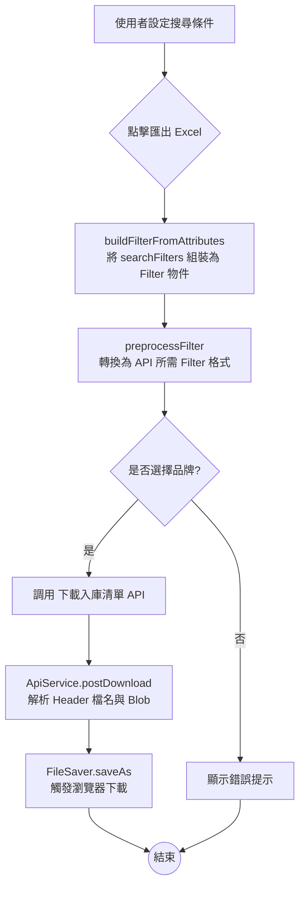
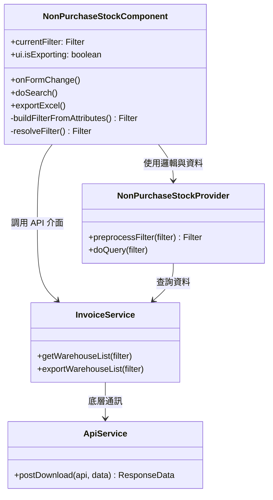
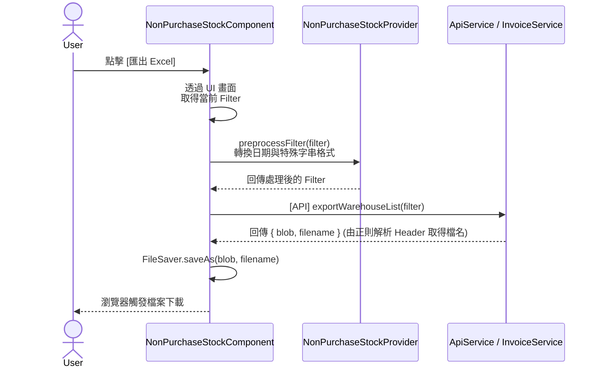

## 修訂紀錄

| **版本** | **日期** | **修訂內容** | **修訂者** |
| --- | --- | --- | --- |
| v1.0 | 2026-04-29 | 初始化文件 | Raelynn |
| v1.1 | 2026-04-29 | 補充無採購入庫 Excel 下載功能與架構設計 | Gemini |

## 相關Jira單：

* CMP-4385 無採購入庫Excel下載（前端）
* CMP-4382 無採購入庫Excel下載（後端）

## 目錄：

1. 功能需求
2. 實作架構設計
   * 2.1 系統流程圖
   * 2.2 元件關係圖
   * 2.3 序列圖
3. 實作
   * 3.1 後端 api 格式
   * 3.2 修改檔案

--- 

## 1. 功能需求

* **匯出功能**：於「無採購入庫」列表頁面新增「匯出 Excel」功能。
* **條件連動**：匯出時，需帶入畫面上設定的過濾條件（如：品牌、出帳日期區間、入庫日期區間、以及支援模糊搜尋的字串欄位）。
* **共用邏輯**：搜尋與匯出的 Filter 條件轉換邏輯必須一致。

---

## 2. 實作架構設計

### 2.1 系統流程圖



### 2.2 元件關係圖



### 2.3 序列圖



## 3. 實作
### 3.1 後端 API 格式

| 項目 | 規格說明 |
| :--- | :--- |
| **API URL** | `/invoice-v1/warehouse/export` |
| **HTTP Method** | `POST` |
| **Request Body** | 傳遞 JSON 結構的 `Filter` 物件 (包含 `and` 條件組與 `sort` 規則)，與入庫列表api（/invoice-v1/warehouse/list）相同 |
| **Response** | `Blob` 檔案流 |
| **Header** | 包含 `Content-Disposition: attachment; filename="xxx.xlsx"` 供前端解析檔名 |

### 3.2 修改檔案
1. src/app/core/services/api.service.ts
修改重點：重構 postDownload 方法中的檔名解析邏輯。
   ```typeScript
   postDownload(api: string, data: RequestData | FormData | null = null, queryMap: QueryMap = new QueryMap()): Observable < ResponseData > {
   return this.httpClient.post(`${this.apiUrl}/${api}${queryMap.toString()}`, data, {
      observe: 'response',
      responseType: 'blob'
   }).pipe(
      map((response: HttpResponse<Blob>) => {
         const resData = new ResponseData();
         const contentDisposition = response.headers.get('content-disposition');

         // 🔸 修改前
         if (contentDisposition !== null) {
         const filenameIndex = contentDisposition.indexOf('UTF-8\'\'');
         if (filenameIndex !== -1) {
            resData.filename = contentDisposition.substring(filenameIndex + 7, contentDisposition.length);
         }
         }
         //...
      }),
      catchError((error) => {...}),
      switchMap(res => {...})
   );
   }

   postDownload(api: string, data: RequestData | FormData | null = null, queryMap: QueryMap = new QueryMap()): Observable < ResponseData > {
   return this.httpClient.post(`${this.apiUrl}/${api}${queryMap.toString()}`, data, {
      observe: 'response',
      responseType: 'blob'
   }).pipe(
      map((response: HttpResponse<Blob>) => {
         const resData = new ResponseData();
         const contentDisposition = response.headers.get('content-disposition');

         // 🔸 修改後
         let filename = '';
         if (contentDisposition) {
         const match = contentDisposition.match(/filename\*?=(?:UTF-8''|")?([^\";]+)/);
         if (match?.[1]) {
            filename = decodeURIComponent(match[1]);
         }
         }
         resData.filename = filename;
         //...
      }),
      catchError((error) => {...}),
      switchMap(res => {...})
   );
   }
   ```

   說明：捨棄原先單純用 indexOf 擷取檔名的方式，改用正則表達式 /filename\*?=(?:UTF-8''|")?([^\";]+)/ 搭配 decodeURIComponent，以正確處理包含中文字元或特殊編碼的檔名。


2. src/app/posting/non-purchase-stock/non-purchase-stock.component.html
修改重點：調整畫面佈局與按鈕。

   說明：

   將原本自動觸發的 `<ma-search>` 改為手動控制的 `<ma-form>`。

   新增操作按鈕區塊，包含「搜尋」以及帶有 loading 狀態 (ui.isExporting) 的「匯出 Excel」按鈕。

   ```html
   <!-- 🔸 修改前 -->
   <ma-search [searchTitle]="'search' | translate"
            [filterAttribute]="searchFilters"
            (doSearch)="doSearch($event, true)"></ma-search>

   <!-- 🔸 修改後 -->
   <ma-form [filterAttribute]="searchFilters"
            (onFormChange)="onFormChange()"></ma-form>
   <div nz-flex [nzJustify]="'flex-end'">
   <button nz-button nzType="primary" class="mr-2"
            (click)="doSearch(currentFilter, true)">{{ 'search' | translate }}</button>
   <button nz-button (click)="exportExcel()"
            [disabled]="ui.isExporting">
      <span nz-icon [nzType]="ui.isExporting ? 'loading' : 'download'" nzTheme="outline"></span>
      {{ 'export' | translate }} Excel
   </button>
   </div>

   ```


3. src/app/posting/non-purchase-stock/non-purchase-stock.component.ts

**修改重點 (Provider)：**

新增 preprocessFilter(filter: Filter) 方法，將原本寫死在 doQuery 內的「出帳時間」、「入庫時間」轉換格式邏輯，以及多組字串（orderErpNumber 等）處理邏輯抽離，供搜尋與匯出共用。

```typeScript
class NonPurchaseStockProvider extends TableDataProvider {

  /** 🔸 filter 前置處理
   *     邏輯不變，但抽出以便查詢與匯出共用
   */
  public preprocessFilter(filter: Filter): Filter {
    // 出帳時間 invoiceDate
    const invoiceDateFilter = filter.and.filter(item => item.field === 'invoiceDate');
    if (invoiceDateFilter.length) {
      const invoiceDates = invoiceDateFilter.map(item => item.value); // 提取日期值
      const formattedInvoiceDateFilter: Condition = {
        field: 'invoiceYearMonth',
        comparator: Comparator.between,
        value: [
          DateTime.fromISO(invoiceDates[0]).toFormat("yyyyMM"),
          DateTime.fromISO(invoiceDates[1]).toFormat("yyyyMM")
        ]
      }
      filter.and = filter.and.filter(item => item.field !== 'invoiceDate'); // 移除原始條件
      filter.and.push(formattedInvoiceDateFilter); // 加入新格式條件
    }

    // 入庫時間 createDate
    const createDateFilter = filter.and.filter(item => item.field === 'createDate');
    if (createDateFilter.length) {
      const createDates = createDateFilter.map(item => item.value); // 提取日期值
      const formattedCreateDateFilter: Condition = {
        field: 'createDate',
        comparator: Comparator.between,
        value: [
          DateTime.fromISO(createDates[0]).startOf('day').toISO(),
          DateTime.fromISO(createDates[1]).endOf('day').toISO()
        ]
      };
      filter.and = filter.and.filter(item => item.field !== 'createDate'); // 移除原始條件
      filter.and.push(formattedCreateDateFilter); // 加入新格式條件
    }

    // 多組字串欄位特殊處理
    const multiValueFields = ['orderErpNumber', 'erpNumber', 'warehouseId'];
    filter.and = filter.and.map(item => {
      if (item.field && multiValueFields.includes(item.field)) {
        return applyOrLikeFilter(item);
      }
      return item;
    });

    return filter;
  }

  /** 搜尋過帳入庫清單 */
  override doQuery(filter?: Filter): Observable<boolean> {
    return new Observable(sub => {
      if (filter) {
        this.filter = this.preprocessFilter(filter);
      }

      const brand = this.filter.and.find(item => item.field === 'brandId');
      if (!brand) {
         // ...
      }

      this.loading = true;

      if (this.tabIndex === 1) {
        this.filter.sort = {
          status: Sort.asc,
          createDate: Sort.desc
        };
      }

      this.invoiceSvc.getWarehouseList(this.filter).subscribe({
        // ...
      });
    });
  }
}
```

**修改重點 (Component)：**

```typeScript
export class NonPurchaseStockComponent implements OnChanges, AfterContentInit {
  // 🔸 新增 currentFilter 儲存當下條件
  currentFilter: Filter | null = null;

  // 🔸 新增：匯出按鈕 loading 控制匯出按鈕的 UI 狀態
  ui = {
    isExporting: false,
  }

  ngOnChanges(changes: SimpleChanges) {
    // 帶入 brandList 下拉選單
    const brandFilter = this.searchFilters.find(item => item.internalVariableName === 'brandId');
    if (!brandFilter || !changes['brandList'] || !this.brandList?.length) return;

    brandFilter.options = [...this.brandList];
    brandFilter.value = this.brandList[0]?.internalVariableName;
  }

  ngAfterContentInit(): void {
    if (this.dataProvider.dataSet.length === 0) {
      this.setDefaultFilter();

      // 🔸 透過 buildFilterFromAttributes() 將 searchFilters 動態轉為 Filter
      this.currentFilter = this.buildFilterFromAttributes();
    }
  }

  /** 🔸 新增 */
  /** 更新表單的值至 Filter */
  onFormChange() {
    this.currentFilter = this.buildFilterFromAttributes();
  }

  /** API: 取得過帳清單檔案紀錄列表 */
  doSearch(eventFilter: Filter | null, haveToNotify: boolean) {

    // 🔸 將傳入的 Filter 合併目前 UI 上的品牌選擇，確保查詢條件中的 brandId 與畫面同步
    const filter = this.resolveFilter(eventFilter);

    const brandId = filter.and.find(item => item.field === 'brandId')?.value;

    if (!brandId) {
      if (haveToNotify) {
        this.notify.error(this.translate.instant('error-page'), this.translate.instant('please select first', { input: this.translate.instant('brand') }));
      }
      return;
    }

    this.resetCheckEvent();

    filter.pageIndex = 1;
    filter.pageSize = 10;
    filter.and = filter.and.filter(item => item);
    filter.and.push({
      field: 'status',
      comparator: this.tabIndex === 0 ? Comparator.not : Comparator.equal,
      value: StockInStatus.posted,
    });

    this.dataProvider.doQuery(filter).subscribe({
      complete: () => { console.log('load data finish'); }
    });
  }


  /** 🔸 新增 */
  /** 將 searchFilters 動態轉為 Filter */
  private buildFilterFromAttributes(): Filter {
    const filter = new Filter();

    this.searchFilters.forEach(({ internalVariableName: field, value, type }) => {
      if (!value) return;

      if (type === FilterAttributeType.dateRange) {
        const [start, end] = value || [];

        if (start) {
          filter.and.push({
            field,
            comparator: Comparator.greaterEqual,
            value: this.strUtilSvc.toStringUtil(FilterAttributeType.date, start),
          });
        }

        if (end) {
          filter.and.push({
            field,
            comparator: Comparator.lesserEqual,
            value: this.strUtilSvc.toStringUtil(FilterAttributeType.date, end),
          });
        }

        return;
      }

      // 判斷是否為字串類型，決定使用 like 或 equal
      const comparator = (type === FilterAttributeType.string)
        ? Comparator.like
        : Comparator.equal;

      filter.and.push({ field, comparator, value });
    });

    return filter;
  }


  /** 🔸 新增
   * 
   */
  /** 下載入庫清單 */
  exportExcel() {
    this.ui.isExporting = true;

    // 取得查詢條件
    let filter = this.buildFilterFromAttributes();

    // 檢查是否有選擇品牌
    const brandId = filter.and.find(item => item.field === 'brandId')?.value;
    if (!brandId) {
      this.notify.error(this.translate.instant('error-page'), this.translate.instant('please select first', { input: this.translate.instant('brand') }));
      this.ui.isExporting = false;
      return;
    }

    // Filter 前置處理（與 doQuery 相同）
    filter = this.dataProvider.preprocessFilter(filter);

    // 1. 與無採購入庫列表 api request 相同
    // 2. 不需要過濾入庫單狀態
    this.invoiceSvc.exportWarehouseList(filter).subscribe({
      next: (res) => {
        console.log(res)
        // 處理下載結果
        if (res.info.success) {
          if (res.info && res.info.success && res.blob) {
            FileSaver.saveAs(res.blob, res.filename);
          } else {
            this.notify.error(this.translate.instant('failed download'), res.info.message);
          }
          this.ui.isExporting = false;
        } else {
          this.ui.isExporting = false;
          this.notify.error(this.translate.instant('failed download'), res.info.message);
        }
      },
      error: (err) => {
        this.notify.error(this.translate.instant('failed download'), err);
        this.ui.isExporting = false;
      }
    });
  }

  /** 🔸 新增 */
  /** 將傳入的 Filter 合併目前 UI 上的品牌選擇，確保查詢條件中的 brandId 與畫面同步 */
  private resolveFilter(eventFilter: Filter | null): Filter {
    const filter = eventFilter ? Object.assign(new Filter(), eventFilter) : new Filter();

    const brandFilter = this.searchFilters.find(
      item => item.internalVariableName === 'brandId'
    );

    const value = brandFilter?.value;

    if (value) {
      const index = filter.and.findIndex(i => i.field === 'brandId');

      if (index >= 0) {
        filter.and[index].value = value;
      } else {
        filter.and.push({
          field: 'brandId',
          comparator: Comparator.equal,
          value
        });
      }
    }

    return filter;
  }
}
```