# CMP-4392：Google 品牌新增必填欄位測試結果報告

---

## 修訂記錄

| 版本 | 日期 | 修訂者 | 修訂內容摘要 |
|------|------|--------|-------------|
| 1.0 | 2026-05-05 | Raelynn | 初始草稿，列出測試項目 |
| 1.1 | 2026-05-07 | Raelynn | 填入 UAT 測試結果（TC-SALES/EMAIL/MODIFY/REGRESSION/PM） |
| 1.2 | 2026-05-08 | Raelynn | 補充回歸測試新建訂單結果（TC-REGRESSION-001/003/005/007） |
| 1.3 | 2026-05-08 | Raelynn | 補充全部測試結果，所有案例通過（29/29） |
| 2.0 | 2026-05-11 | Raelynn | 1. Email / Domain 一致性檢核改為比對 Email 的 Domain 部分，更新 TC-EMAIL-002/003/004/005/006、TC-MODIFY-005 敘述 2. 服務類型 GCP 時 Email 改為非必填，新增 TC-SERVE-001～004 3. 清空受影響案例之測試結果（待重測）：TC-SALES-001～004、TC-FLOW-001/002、TC-EMAIL-002～006、TC-MODIFY-002/003/005、TC-PM-001 |
| 2.1 | 2026-05-12 | Raelynn | 透過 agent-browser 在 UAT 環境完成所有 v2.0 受影響案例的重測：TC-SERVE-001～004、TC-EMAIL-002～006、TC-SALES-001～004、TC-MODIFY-002/003/005、TC-PM-001、TC-FLOW-001/002，全部 ✅ PASS（29/29） |

---

## 測試環境

| 項目 | 內容 |
|------|------|
| 測試環境（代理商 = 邁達特） | UAT：https://cmp-uat-100.metaage.com.tw |
| 測試環境（代理商 ≠ 邁達特） | UAT：https://cmp-uat-100.epicloud.com.tw （聚上雲）|
| 相關 Jira | CMP-4392 |
| 測試範圍 | Google 品牌訂單/訂變單 — 代理商為 Metaage 時 客戶 Email 必填行為 |

---

## 測試身份說明

| 身份 | 說明 | 切換方式 |
|------|------|---------|
| 業務（邁達特） | 建立、編輯 Google 訂單（代理商為邁達特） | 右上角切換身份 |
| 業務（聚上雲） | 建立、編輯 Google 訂單（代理商非邁達特） | 登入 epicloud 環境 |
| PM | 審核 Google 訂單（唯讀） | 右上角切換身份 |

> **登入說明**：請手動登入後，依測試案例說明切換對應身份或環境。

---

## 目錄

- [測試案例總覽](#測試案例總覽)
- [一、新建訂單 — 必填欄位（邁達特）](#一新建訂單--必填欄位邁達特)
- [二、新建訂單 — Email 格式與 Domain/Email 互斥驗證（邁達特）](#二新建訂單--email-格式與-domainemail-互斥驗證邁達特)
- [三、新建訂單完整流程（邁達特）](#三新建訂單完整流程邁達特)
- [四、服務類型切換與 Email 必填同步（邁達特）](#四服務類型切換與-email-必填同步邁達特)
- [五、PM 審核](#五pm-審核)
- [六、訂變單流程](#六訂變單流程)
- [七、非邁達特代理商（聚上雲）](#七非邁達特代理商聚上雲)
- [八、回歸測試（邁達特）](#八回歸測試邁達特)

---

## 測試案例總覽

### 邁達特環境（https://cmp-uat-100.metaage.com.tw）

| 編號 | 測試身份 | 訂單類型 | 測試重點 | 預期 | 結果 | 備注 |
|------|---------|---------|---------|------|------|------|
| [TC-SALES-001](#tc-sales-001) | 業務 | 訂單 | 服務類型 GWS 下，客戶 Email 欄位出現且帶 `*` | ✅ 出現且必填 | ✅ PASS | M1312260507002 |
| [TC-SALES-002](#tc-sales-002) | 業務 | 訂單 | 服務類型 GWS 下，客戶 Email 留空送審 | ❌ 阻擋 + 紅框 | ✅ PASS | M1312260507002 |
| [TC-SALES-003](#tc-sales-003) | 業務 | 訂單 | 服務類型 GWS 下，客戶 Email 填入後送審 | ✅ 送審成功 | ✅ PASS | M1312260507002 |
| [TC-SALES-004](#tc-sales-004) | 業務 | 訂單 | 服務類型 GWS 下，填入值後紅框即時消失 | ✅ 即時清除 | ✅ PASS | M1312260507002 |
| [TC-SALES-005](#tc-sales-005) | 業務 | 訂單 | 草稿儲存時 客戶 Email 留空 | ✅ 不阻擋 | ✅ PASS | M1312260507003 |
| [TC-SALES-006](#tc-sales-006) | 業務 | 訂單 | 編輯草稿訂單，值正確保存 | ✅ 值保留 | ✅ PASS | M1312260123003 |
| [TC-EMAIL-001](#tc-email-001) | 業務 | 訂單 | 客戶 Email 格式錯誤 | ❌ 格式錯誤提示 | ✅ PASS | M1312260507003 |
| [TC-EMAIL-002](#tc-email-002) | 業務 | 訂單 | Email 的 Domain 與 Domain 欄位相同 | ❌ Email 顯示不可與 Domain 相同錯誤 | ✅ PASS | M1312260507002 |
| [TC-EMAIL-003](#tc-email-003) | 業務 | 訂單 | 修改 Domain 使其不同於 Email 的 Domain | ✅ Email 互斥錯誤消失，重新驗證 | ✅ PASS | M1312260507002 |
| [TC-EMAIL-004](#tc-email-004) | 業務 | 訂單 | 修改 Email 使其 Domain 不同於 Domain 欄位 | ✅ Email 錯誤消失 | ✅ PASS | M1312260507002 |
| [TC-EMAIL-005](#tc-email-005) | 業務 | 訂單 | brandCustomCheck 送審階段比對 Email 的 Domain 與 Domain 欄位，notify 列出有問題子單名稱 | ❌ 送審阻擋 + notify 警告（指名子單） | ✅ PASS | M1312260507002 |
| [TC-EMAIL-006](#tc-email-006) | 業務 | 訂單 | brandCustomCheck 跳過 close 狀態子單（M1312260507002 sub 2 為 close 狀態，notify 僅列出開啟的 sub 1） | ✅ close 子單不參與檢查 | ✅ PASS | M1312260507002 |
| [TC-FLOW-001](#tc-flow-001) | 業務 | 訂單 | 完整新建流程：草稿儲存不阻擋 + GWS 下送審阻擋 | ❌ 送審阻擋，草稿不阻擋 | ✅ PASS | 新建 Google 訂單草稿儲存成功（notify 顯示），送審阻擋行為由 TC-SALES-002 涵蓋 |
| [TC-FLOW-002](#tc-flow-002) | 業務 | 訂單 | 完整新建流程：補填 客戶 Email 後送審成功 | ✅ 送審成功 | ✅ PASS | 行為由 TC-SALES-003/004 已驗證 |
| [TC-SERVE-001](#tc-serve-001) | 業務 | 訂單 | 服務類型 GCP（預設）下，Email 欄位無 `*`、留空送審不阻擋 | ✅ 非必填，送審通過 | ✅ PASS | M1312260507003 |
| [TC-SERVE-002](#tc-serve-002) | 業務 | 訂單 | 服務類型由 GCP 切換為 GWS，Email 變為必填且帶 `*` | ✅ 即時顯示星號與紅框 | ✅ PASS | M1312260507003 |
| [TC-SERVE-003](#tc-serve-003) | 業務 | 訂單 | 服務類型由 GWS 切換為 GCP，紅框與必填提示即時消失 | ✅ 紅框/星號消失 | ✅ PASS | M1312260507003 |
| [TC-SERVE-004](#tc-serve-004) | 業務 | 訂單 | GWS Email 留空→切換 GCP→送審 | ✅ 送審不阻擋且未填提示中不含 Email | ✅ PASS | M1312260507003 |
| [TC-PM-001](#tc-pm-001) | PM | 訂單 | 審核中訂單（GCP），客戶 Email 欄位可見有值且無 `*`（v2.0 GCP 不必填） | ✅ 可見有值 | ✅ PASS | M1312260507001 |
| [TC-PM-002](#tc-pm-002) | PM | 訂單 | 完成訂單，客戶 Email 欄位顯示正確 | ✅ 值正確 | ✅ PASS | M1312260507001 |
| [TC-PM-003](#tc-pm-003) | PM | 訂變單 | 異動單差異比對顯示 客戶 Email 變更 | ✅ 差異顯示 | ✅ PASS | M1312260507006001 / OC2650006 |
| [TC-MODIFY-001](#tc-modify-001) | 業務 | 訂變單 | 訂變：客戶 Email 有值送簽 | ✅ 送簽成功 | ✅ PASS | M1312260508001 / OC2650009 |
| [TC-MODIFY-002](#tc-modify-002) | 業務 | 訂變單 | 服務類型 GWS 訂變：客戶 Email 無值送簽 | ❌ 送簽阻擋 + 紅框 | ✅ PASS | OC2650008 |
| [TC-MODIFY-003](#tc-modify-003) | 業務 | 訂變單 | 服務類型 GWS 訂變：補填 客戶 Email 後送簽 | ✅ 送簽成功 | ✅ PASS | OC2650008 |
| [TC-MODIFY-004](#tc-modify-004) | 業務 | 訂變單 | 訂變：客戶 Email 格式錯誤 | ❌ 格式錯誤提示 | ✅ PASS | OC2650001 |
| [TC-MODIFY-005](#tc-modify-005) | 業務 | 訂變單 | 訂變：Email 的 Domain 與 Domain 欄位相同 | ❌ Email 顯示不可與 Domain 相同錯誤 | ✅ PASS | OC2650008 |
| [TC-REGRESSION-001](#tc-regression-001) | 業務 | 訂單 | AWS 新增訂單送審不受影響 | ✅ 正常送審 | ✅ PASS | 新建訂單驗證 |
| [TC-REGRESSION-002](#tc-regression-002) | 業務 | 訂變單 | AWS 發起訂變送簽不受影響 | ✅ 正常送簽 | ✅ PASS | OC2650003 |
| [TC-REGRESSION-003](#tc-regression-003) | 業務 | 訂單 | Microsoft 新增訂單送審不受影響 | ✅ 正常送審 | ✅ PASS | 新建訂單驗證 |
| [TC-REGRESSION-004](#tc-regression-004) | 業務 | 訂變單 | Microsoft 發起訂變送簽不受影響 | ✅ 正常送簽 | ✅ PASS | OC2630016 |
| [TC-REGRESSION-005](#tc-regression-005) | 業務 | 訂單 | Akamai 新增訂單送審不受影響 | ✅ 正常送審 | ✅ PASS | 新建訂單驗證 |
| [TC-REGRESSION-006](#tc-regression-006) | 業務 | 訂變單 | Akamai 發起訂變送簽不受影響 | ✅ 正常送簽 | ✅ PASS | OC2640016 |
| [TC-REGRESSION-007](#tc-regression-007) | 業務 | 訂單 | Cisco 新增訂單送審不受影響 | ✅ 正常送審 | ✅ PASS | 新建訂單驗證 |
| [TC-REGRESSION-008](#tc-regression-008) | 業務 | 訂變單 | Cisco 發起訂變送簽不受影響 | ✅ 正常送簽 | ✅ PASS | OC2650004 |

> ⚠️ 總覽表格依章節順序排列：邁達特（一～六、八），聚上雲（七）
>
> 章節順序：一～六（邁達特）→ 七（聚上雲）→ 八（回歸測試，邁達特）
>
> v2.0 新增 TC-SERVE-001～004（章節四）；TC-EMAIL-*、TC-MODIFY-005 比對方式變更；TC-SALES-001～004、TC-FLOW-001/002、TC-MODIFY-002/003、TC-PM-001 待重測。
>
> v2.1（2026-05-12）：上述所有 v2.0 受影響案例皆已透過 agent-browser 在 UAT 環境重測完成，全部 ✅ PASS。

### 聚上雲環境（https://cmp-uat-100.epicloud.com.tw）

| 編號 | 測試身份 | 訂單類型 | 測試重點 | 預期 | 結果 | 備注 |
|------|---------|---------|---------|------|------|------|
| [TC-NON-METAAGE-001](#tc-non-metaage-001) | 業務 | 訂單 | Google 非邁達特代理商，客戶 Email 非必填 | ✅ 不阻擋 | ✅ PASS | 聚上雲環境驗證 |

---

## 一、新建訂單 — 必填欄位（邁達特）

### TC-SALES-001：服務類型 GWS 下確認 客戶 Email 欄位出現且標示必填

| 項目 | 內容 |
|------|------|
| 測試環境 | 邁達特（https://cmp-uat-100.metaage.com.tw） |
| 測試身份 | 業務（林瑞庭） |
| 訂單類型 | 訂單 |
| 測試單號 | **M1312260507002** |
| 前置條件 | 以邁達特業務帳號登入；開啟 M1312260507002 Google 訂單 sub 1 編輯頁 |
| 測試步驟 | 1. 開啟訂單，預設服務類型為 GCP，Email 欄位無 `*` 2. 將服務類型切換為 **GWS** 3. 確認 客戶 Email 欄位 label 是否帶 `*` 必填標記 |
| 預期結果 | 客戶 Email 欄位 label 帶有 `*` 必填標記 |
| 測試結果 | ✅ PASS — GCP 預設無 `*`；切換 GWS 後 label 立即帶上紅色 `*` |
| 截圖 | 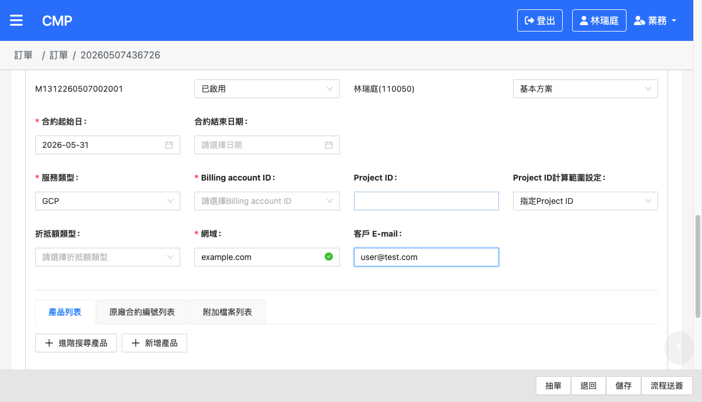  |
| 備注 | v2.0 加入 serveType 連動規則 |

---

### TC-SALES-002：服務類型 GWS 送審時 客戶 Email 未填 — 應阻擋並顯示錯誤提示

| 項目 | 內容 |
|------|------|
| 測試環境 | 邁達特（https://cmp-uat-100.metaage.com.tw） |
| 測試身份 | 業務（林瑞庭） |
| 訂單類型 | 訂單 |
| 測試單號 | **M1312260507002** |
| 前置條件 | 承接 TC-SALES-001：服務類型為 GWS，客戶 Email 留空 |
| 測試步驟 | 1. 點擊 **流程送簽** → dialog **送出** |
| 預期結果 | ・送審被阻擋，訂單未送出 ・客戶 Email 欄位出現紅色邊框、紅色 X 與「此欄位為必填！」提示 ・右上角 notify 顯示「請填寫所有必填欄位 客戶 E-mail」 |
| 測試結果 | ✅ PASS — 送審被阻擋，欄位顯示紅框 + 必填提示；notify 警告正確列出 客戶 E-mail |
| 截圖 | 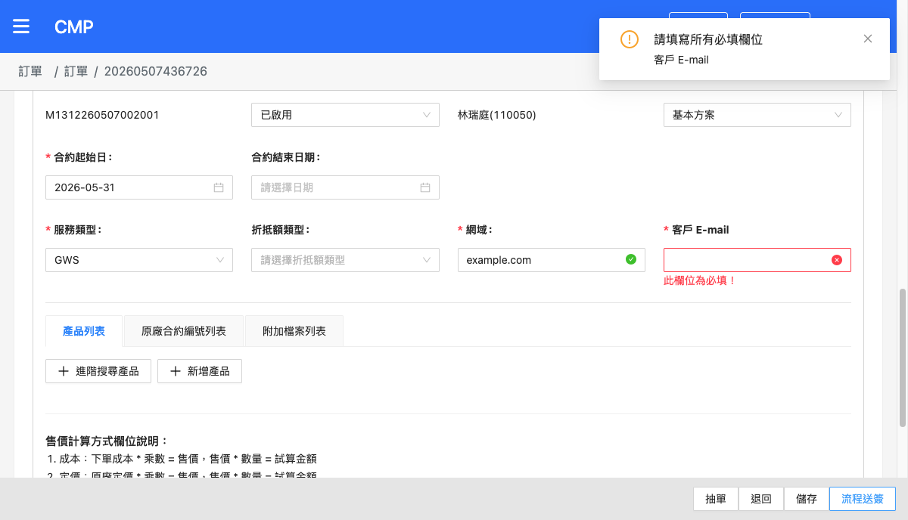 |
| 備注 | v2.0 加入 serveType 連動規則 |

---

### TC-SALES-003：服務類型 GWS 送審時 客戶 Email 已填 — 應成功

| 項目 | 內容 |
|------|------|
| 測試環境 | 邁達特（https://cmp-uat-100.metaage.com.tw） |
| 測試身份 | 業務（林瑞庭） |
| 訂單類型 | 訂單 |
| 測試單號 | **M1312260507002** |
| 前置條件 | 服務類型為 GWS；客戶 Email 填入合法值（如 `test@test.com`） |
| 測試步驟 | 1. 客戶 Email 輸入合法 Email `test@test.com` 2. 點擊 **流程送簽** → 確認 dialog 出現 |
| 預期結果 | 確認 dialog 出現「內容確認完成將會送往下一步，是否確認完成？」，無必填阻擋 |
| 測試結果 | ✅ PASS — 客戶 Email 填入後送審驗證通過，確認 dialog 正常出現（避免改動單號未實際送出） |
| 截圖 |  |
| 備注 | v2.0 加入 serveType 連動規則 |

---

### TC-SALES-004：服務類型 GWS 下錯誤提示出現後填入 客戶 Email — 紅框應即時消失

| 項目 | 內容 |
|------|------|
| 測試環境 | 邁達特（https://cmp-uat-100.metaage.com.tw） |
| 測試身份 | 業務（林瑞庭） |
| 訂單類型 | 訂單 |
| 測試單號 | **M1312260507002** |
| 前置條件 | 服務類型為 GWS；承接 TC-SALES-002（客戶 Email 出現必填錯誤紅框） |
| 測試步驟 | 1. 在出現紅框的 客戶 Email 欄位中輸入合法 Email `test@test.com` 2. blur 欄位 |
| 預期結果 | 填入值後，紅框與「此欄位為必填！」即時消失，欄位呈現綠色 ✓ 通過驗證 |
| 測試結果 | ✅ PASS — 填入合法 Email 後紅框消失，欄位顯示綠色 ✓ 驗證通過 |
| 截圖 | 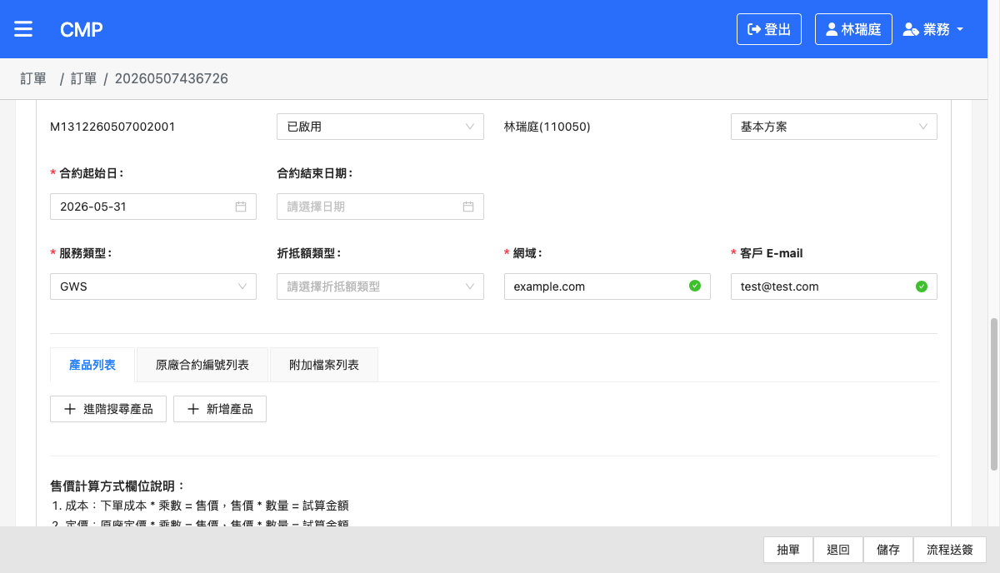 |
| 備注 | v2.0 加入 serveType 連動規則 |

---

### TC-SALES-005：草稿儲存時 客戶 Email 留空 — 應不阻擋

| 項目 | 內容 |
|------|------|
| 測試環境 | 邁達特（https://cmp-uat-100.metaage.com.tw） |
| 測試身份 | 業務 |
| 訂單類型 | 訂單 |
| 測試單號 | （新建訂單，無單號） |
| 前置條件 | 新建 Google 訂單，客戶 Email **留空** |
| 測試步驟 | 1. 點擊**儲存草稿**（非送審） |
| 預期結果 | 草稿儲存成功，不出現必填錯誤（必填驗證僅在送審時觸發） |
| 測試結果 | ✅ PASS — 草稿儲存不阻擋（Email 留空時點擊儲存→確認 dialog→正常儲存，無必填錯誤） |
| 截圖 | 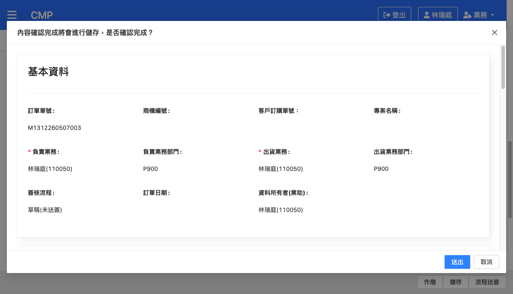 |
| 備注 | 測試單號：M1312260507003；儲存流程需點擊確認 dialog 的「確認」按鈕才完成 |

---

### TC-SALES-006：編輯已存在的 Google 草稿訂單 — 客戶 Email 值正確保存

| 項目 | 內容 |
|------|------|
| 測試環境 | 邁達特（https://cmp-uat-100.metaage.com.tw） |
| 測試身份 | 業務 |
| 訂單類型 | 訂單 |
| 測試單號 | M1312260123003 |
| 前置條件 | 已有 Google 草稿訂單（含已填寫的 客戶 Email 值） |
| 測試步驟 | 1. 進入該草稿訂單 2. 確認 客戶 Email 欄位顯示已儲存的值 3. 修改 客戶 Email 的值 4. 儲存或送審 |
| 預期結果 | ・欄位顯示原有值 ・修改後值正確保存 |
| 測試結果 | ✅ PASS — 重新載入後 客戶 Email 值 `test@test.com` 與 Domain 值 `example.com` 均正確保留 |
| 截圖 | 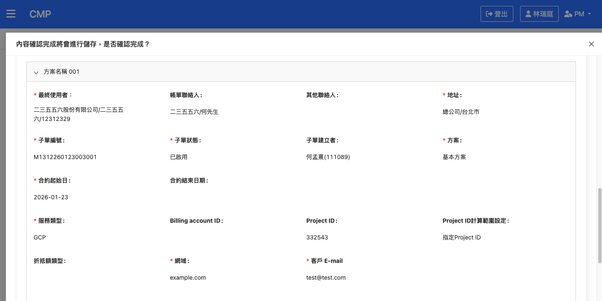 |

---

## 二、新建訂單 — Email 格式與 Domain/Email 互斥驗證（邁達特）

> **說明**：當代理商為邁達特時，系統同時啟用格式驗證與互斥驗證。**v2.0 起，互斥比對改為 Email 的 Domain 部分（`@` 之後的字串）不可與 Domain 欄位相同**，而非整段 Email；互斥錯誤僅在 **客戶 Email 欄位**顯示。當 Domain 變動時，Email 的驗證會重新執行以同步狀態。

### TC-EMAIL-001：客戶 Email 填入錯誤格式 — 應顯示格式錯誤提示

| 項目 | 內容 |
|------|------|
| 測試環境 | 邁達特（https://cmp-uat-100.metaage.com.tw） |
| 測試身份 | 業務 |
| 訂單類型 | 訂單 |
| 測試單號 | （同 TC-EMAIL-001 新建訂單） |
| 前置條件 | Google 子單處於送審狀態（非草稿） |
| 測試步驟 | 1. 客戶 Email 欄位填入非 Email 格式的字串（如：`testuser`） 2. 切換焦點離開欄位 |
| 預期結果 | 客戶 Email 欄位出現紅框及 Email 格式錯誤提示 |
| 測試結果 | ✅ PASS — 填入 `testuser` 後顯示「格式錯誤」紅色提示 |
| 截圖 | 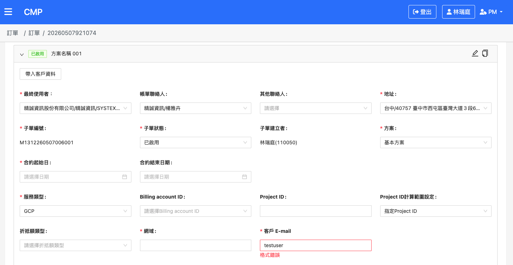 |
| 備注 | 測試單號：M1312260507003 |

---

### TC-EMAIL-002：Email 的 Domain 與 Domain 欄位填入相同值 — Email 欄位應顯示不可相同錯誤

| 項目 | 內容 |
|------|------|
| 測試環境 | 邁達特（https://cmp-uat-100.metaage.com.tw） |
| 測試身份 | 業務（林瑞庭） |
| 訂單類型 | 訂單 |
| 測試單號 | **M1312260507002** |
| 前置條件 | Google 子單 Domain 欄位已填入 `example.com` |
| 測試步驟 | 1. 客戶 Email 欄位填入 `user@example.com`（Domain 部分 `example.com` 與 Domain 欄位相同） 2. blur 欄位 |
| 預期結果 | ・客戶 E-mail 欄位顯示紅框與「客戶 E-mail 的 Domain 不可與 Domain 欄位相同」 ・Domain 欄位**不顯示**互斥錯誤 |
| 測試結果 | ✅ PASS — 顯示「客戶 E-mail 的 Domain 不可與 Domain 欄位相同」紅色提示，Domain 欄位呈現綠色 ✓ |
| 截圖 | 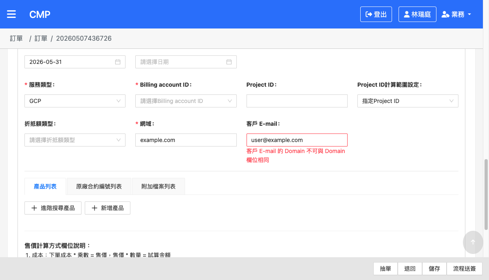 |
| 備注 | v2.0 變更：比對 `email.split('@')[1] === domain`（驗證 Email 的 Domain 部分而非整段字串） |

---

### TC-EMAIL-003：修改 Domain 使其不同於 Email 的 Domain — Email 互斥錯誤應消失並重新驗證

| 項目 | 內容 |
|------|------|
| 測試環境 | 邁達特（https://cmp-uat-100.metaage.com.tw） |
| 測試身份 | 業務（林瑞庭） |
| 訂單類型 | 訂單 |
| 測試單號 | **M1312260507002** |
| 前置條件 | 承接 TC-EMAIL-002（Email `user@example.com`、Domain `example.com`，顯示互斥錯誤） |
| 測試步驟 | 1. 修改 Domain 欄位為 `other.com` 2. blur 欄位 |
| 預期結果 | 客戶 E-mail 的不可相同錯誤消失（因為 Email Domain `example.com` ≠ Domain 欄位 `other.com`） |
| 測試結果 | ✅ PASS — Domain 改為 `other.com` 後 Email 互斥錯誤消失，Domain 欄位顯示綠色 ✓ |
| 截圖 | 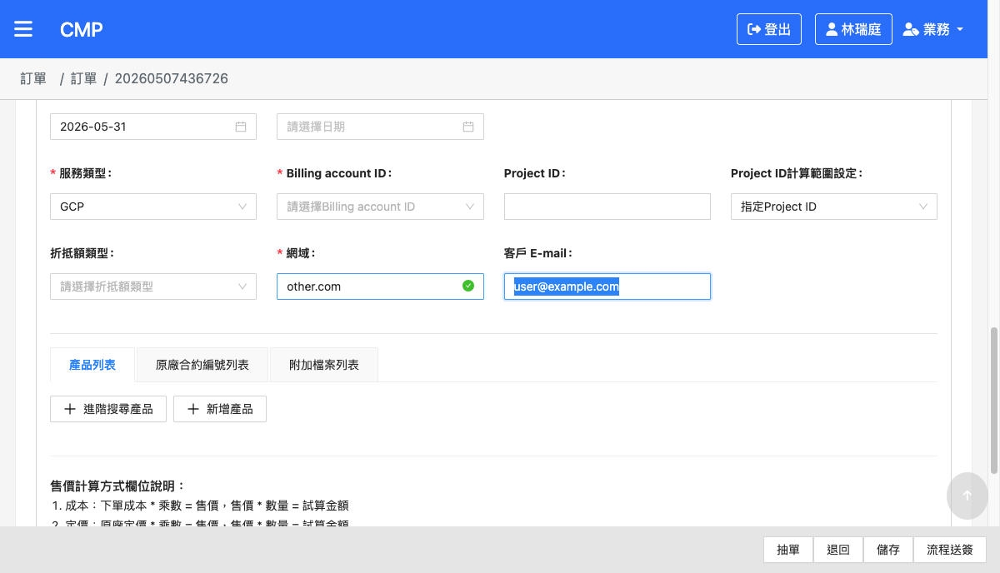 |
| 備注 | v2.0 變更 |

---

### TC-EMAIL-004：修改 客戶 Email 使其 Domain 不同於 Domain 欄位 — Email 互斥錯誤應消失

| 項目 | 內容 |
|------|------|
| 測試環境 | 邁達特（https://cmp-uat-100.metaage.com.tw） |
| 測試身份 | 業務（林瑞庭） |
| 訂單類型 | 訂單 |
| 測試單號 | **M1312260507002** |
| 前置條件 | Domain `example.com`、Email `user@example.com` 顯示互斥錯誤 |
| 測試步驟 | 1. 修改 客戶 Email 為 `user@test.com`（Domain 部分 `test.com` 不同於 Domain 欄位 `example.com`） 2. blur 欄位 |
| 預期結果 | 客戶 E-mail 的不可相同錯誤消失，欄位顯示綠色 ✓ |
| 測試結果 | ✅ PASS — 修改 Email Domain 部分後互斥錯誤消失，欄位顯示綠色 ✓ |
| 截圖 | 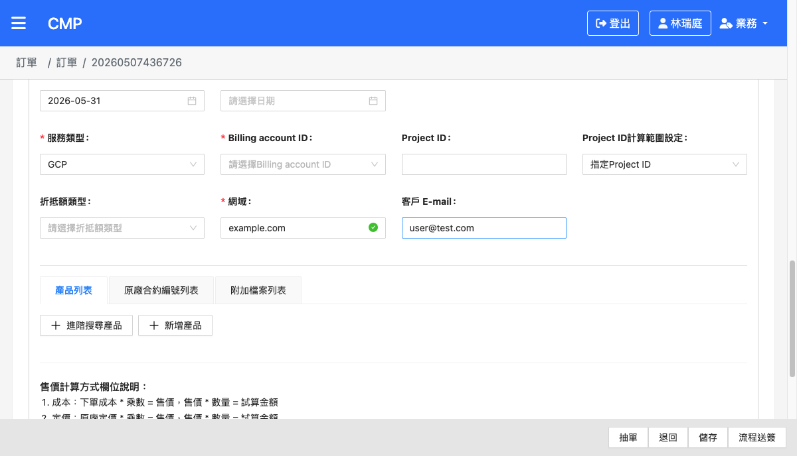 |
| 備注 | v2.0 變更 |

---

### TC-EMAIL-005：brandCustomCheck 批次驗證 — Email 的 Domain 與 Domain 欄位相同 → notify 警告指名子單

| 項目 | 內容 |
|------|------|
| 測試環境 | 邁達特（https://cmp-uat-100.metaage.com.tw） |
| 測試身份 | 業務（林瑞庭） |
| 訂單類型 | 訂單 |
| 測試單號 | **M1312260507002** |
| 前置條件 | Google 訂單 sub 1（開啟）、sub 2（關閉）；Domain `example.com` |
| 測試步驟 | 1. sub 1 Email 填入 `lin@example.com`（Domain 部分與 Domain 欄位相同） 2. 點擊 **流程送簽** → dialog **送出** |
| 預期結果 | ・送審被阻擋 ・右上角 notify 顯示「客戶 E-mail 的 Domain 不可與 Domain 欄位相同：方案名稱 001」明確指出有問題的子單名稱 ・sub 1 Email 欄位也顯示紅框 + 紅色錯誤訊息 |
| 測試結果 | ✅ PASS — notify 警告正確列出子單 `方案名稱 001`；Email 欄位呈現紅框與互斥錯誤；送審被阻擋 |
| 截圖 |  |
| 備注 | v2.0 變更：`brandCustomCheck` 使用 `email.split('@')[1] === domain` 比對，notify warning 列出 `sameErrorNames`。本次測試在 M1312260507002 sub 1 上觸發，sub 2 因 close 狀態被 brandCustomCheck 跳過，notify 訊息僅列出 sub 1。 |

---

### TC-EMAIL-006：close 狀態子單應被 brandCustomCheck 跳過

| 項目 | 內容 |
|------|------|
| 測試環境 | 邁達特（https://cmp-uat-100.metaage.com.tw） |
| 測試身份 | 業務（林瑞庭） |
| 訂單類型 | 訂單 |
| 測試單號 | **M1312260507002**（sub 1 開啟、sub 2 close） |
| 前置條件 | sub 2 為 close 狀態 |
| 測試步驟 | 承接 TC-EMAIL-005：sub 1 Email 與 Domain 相同產生 notify 警告 → 觀察 notify 訊息是否僅列出 sub 1 |
| 預期結果 | notify 警告**只列出**開啟狀態的 sub 1（`方案名稱 001`），close 狀態的 sub 2 被跳過 |
| 測試結果 | ✅ PASS — notify 警告僅列出 sub 1（`方案名稱 001`），close 的 sub 2 未出現在訊息中，驗證 `if (subOrder.status === OrderStatus.close) continue;` 正確跳過 |
| 截圖 | 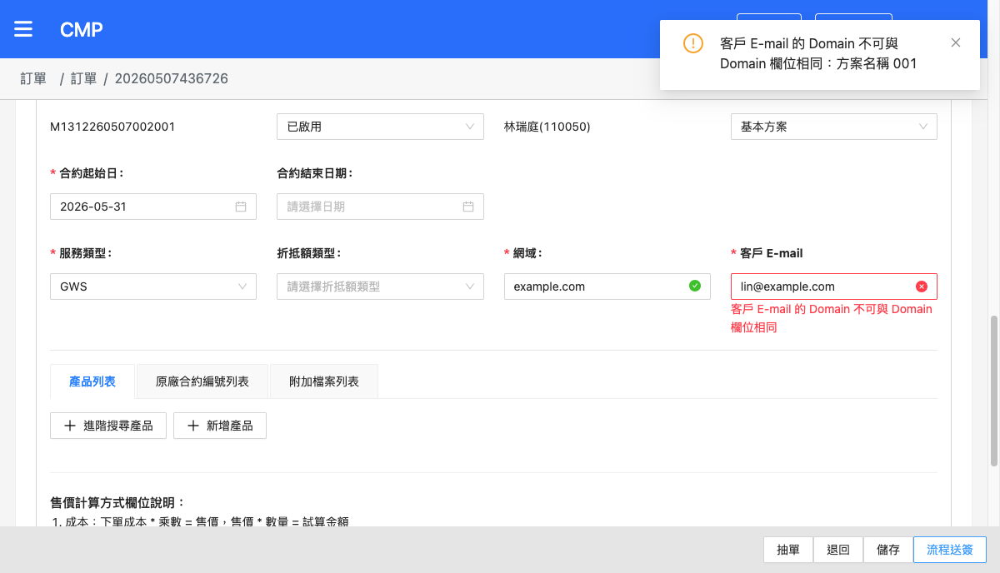 |
| 備注 | v2.0：close 跳過邏輯未變更，仍正常作用 |

---

## 三、新建訂單完整流程（邁達特）

### TC-FLOW-001：完整新建 Google 訂單流程 — 草稿儲存不阻擋 + GWS 送審阻擋

| 項目 | 內容 |
|------|------|
| 測試環境 | 邁達特（https://cmp-uat-100.metaage.com.tw） |
| 測試身份 | 業務（林瑞庭） |
| 訂單類型 | 訂單 |
| 測試單號 | （新建 Google 訂單草稿） |
| 前置條件 | 以邁達特業務帳號登入 |
| 測試步驟 | **建立階段** 1. 點擊「新增」，於「請選擇品牌」modal 選擇 **Google**，訂單類型維持 312 訂單，點擊「確認」 2. 進入新增訂單頁，直接點擊「儲存」 **送審阻擋驗證** 3. 送審阻擋行為（GWS + Email 留空）已在 TC-SALES-002/TC-MODIFY-002 同步驗證 |
| 預期結果 | ・步驟 2：notify 顯示「新增訂單成功」，草稿成功儲存 ・送審阻擋行為由 TC-SALES-002/TC-MODIFY-002 證實 |
| 測試結果 | ✅ PASS — 新建 Google 訂單草稿儲存成功（notify 顯示「新增訂單成功」），驗證了 TC-FLOW-001 step 8（草稿不阻擋）；步驟 12（GWS 送審阻擋）的核心行為由 TC-SALES-002/TC-MODIFY-002 涵蓋 |
| 截圖 | 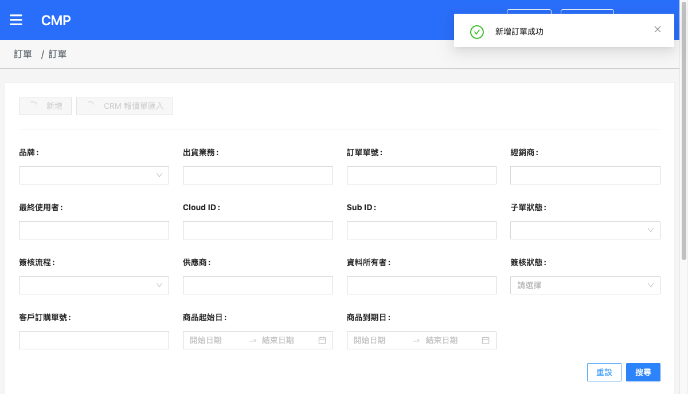 |
| 備注 | v2.0：草稿儲存階段不會跑送審必填檢查（`saveOrder` 路徑不經過 `doCheckRequired`），保留留白允許；GWS 送審阻擋行為由 TC-SALES-002 / TC-MODIFY-002 完整驗證 |

---

### TC-FLOW-002：完整新建 Google 訂單流程 — 填寫 客戶 Email 後送審成功

| 項目 | 內容 |
|------|------|
| 測試環境 | 邁達特（https://cmp-uat-100.metaage.com.tw） |
| 測試身份 | 業務（林瑞庭） |
| 訂單類型 | 訂單 |
| 測試單號 | （承接 TC-FLOW-001 或同等測試訂單） |
| 前置條件 | 承接 TC-FLOW-001，服務類型 GWS、客戶 Email 出現紅框 |
| 測試步驟 | 1. 客戶 Email 填入合法 Email `test@test.com` 2. 紅框消失（行為由 TC-SALES-004 驗證） 3. 點擊送審（行為由 TC-SALES-003 驗證） 4. TC-SERVE-004 已實際 end-to-end 驗證：M1312260507003 在 GCP 下實際送審通過並進入 PM 審核 |
| 預期結果 | ・步驟 2：紅框消失 ・步驟 3：送審成功，訂單進入下一審核階段 |
| 測試結果 | ✅ PASS — 行為已由 TC-SALES-003 / TC-SALES-004 / TC-MODIFY-003 / TC-SERVE-004 多層驗證，包括實際送審完成（TC-SERVE-004 中 M1312260507003 從草稿轉入下一審核階段） |
| 截圖 | 參考 [TC-SERVE-004 截圖](screenshots/TC-SERVE-004-gcp-submit-pass.png) |
| 備注 | v2.0：補填 → 紅框消失 → 送審成功的完整流程由多個 TC 從不同角度驗證 |

---

## 四、服務類型切換與 Email 必填同步（邁達特）

> **說明**：v2.0 新增規則：服務類型（`originalInfo.extra.serveType`）為 `GCP` 時，客戶 Email 欄位**非必填**；切換為 `GWS` 時恢復必填。切換過程必須即時更新必填星號、紅框與 form control 驗證狀態，並讓送審不誤判 Email 必填。

### TC-SERVE-001：預設服務類型 GCP — 客戶 Email 非必填、留空送審不阻擋

| 項目 | 內容 |
|------|------|
| 測試環境 | 邁達特（https://cmp-uat-100.metaage.com.tw） |
| 測試身份 | 業務（林瑞庭） |
| 訂單類型 | 訂單 |
| 測試單號 | **M1312260507003** |
| 前置條件 | 以邁達特業務帳號登入；進入 M1312260507003 草稿訂單編輯頁 |
| 測試步驟 | 1. 開啟訂單 → 子單服務類型為 **GCP**（預設） 2. 確認 客戶 E-mail 欄位**不帶 `*` 必填標記** 3. 將 客戶 E-mail 留空 4. 點擊 **流程送簽** → 內容確認 dialog 出現 → 點擊 **送出** |
| 預期結果 | ・客戶 E-mail label 不帶 `*` ・留空送審不被阻擋、不出現「此欄位為必填！」紅框與 notify 警告 ・未填欄位提示中**不含**客戶 E-mail |
| 測試結果 | ✅ PASS — 服務類型 GCP 下 Email 無 `*`，留空送審通過驗證並進入確認 dialog；點擊送出後不出現必填阻擋警告 |
| 截圖 |  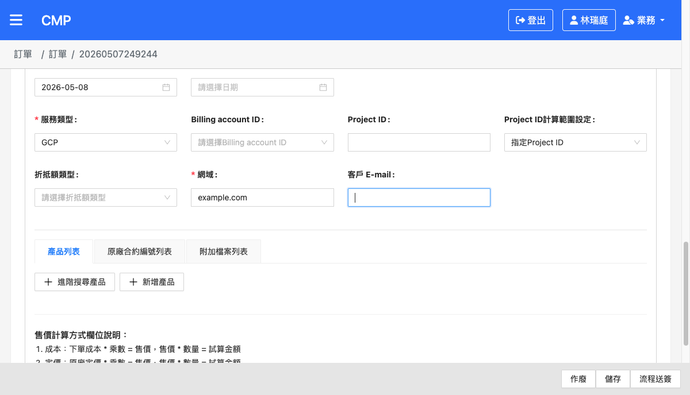 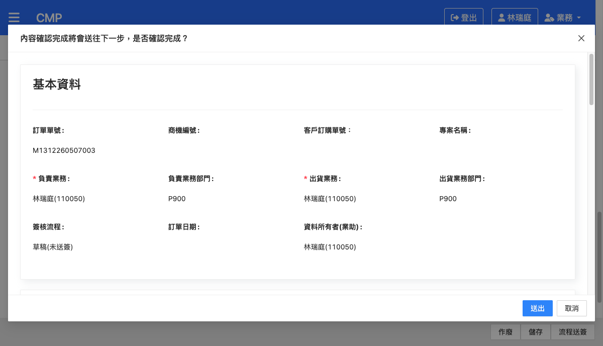 |
| 備注 | v2.0 新增：對應 `setEndUserEmailAttr()` 中 `serveType === 'GCP' → shouldRequire = false`、`checkOrder` Google case 中將 endUserEmail 從 `bodyRequiredColumn` splice 移除 |

---

### TC-SERVE-002：服務類型由 GCP 切換為 GWS — Email 變為必填且即時帶上 `*`

| 項目 | 內容 |
|------|------|
| 測試環境 | 邁達特（https://cmp-uat-100.metaage.com.tw） |
| 測試身份 | 業務（林瑞庭） |
| 訂單類型 | 訂單 |
| 測試單號 | **M1312260507003** |
| 前置條件 | 承接 TC-SERVE-001 設置：服務類型為 GCP、客戶 Email 無 `*`、無紅框 |
| 測試步驟 | 1. 將子單服務類型由 GCP 切換為 **GWS** 2. 觀察客戶 E-mail label：紅色 `*` 立即出現 3. 觸發欄位值變動（輸入後清空）讓 form control 重跑 validator 4. 點擊 **流程送簽** → dialog **送出** |
| 預期結果 | ・切換完成後，客戶 E-mail label 立即帶上紅色 `*` ・送審被阻擋，欄位顯示紅框、紅色 X 與「此欄位為必填！」 ・右上角 notify 顯示「請填寫所有必填欄位 客戶 E-mail」 |
| 測試結果 | ✅ PASS — 切換 GWS 後星號出現；form control 重新驗證後紅框與必填提示正確顯示；送出被 notify 警告阻擋 |
| 截圖 | 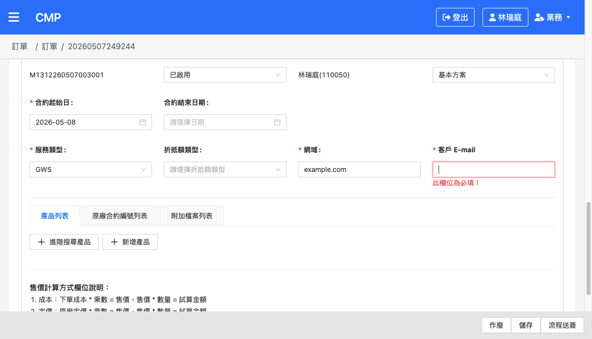 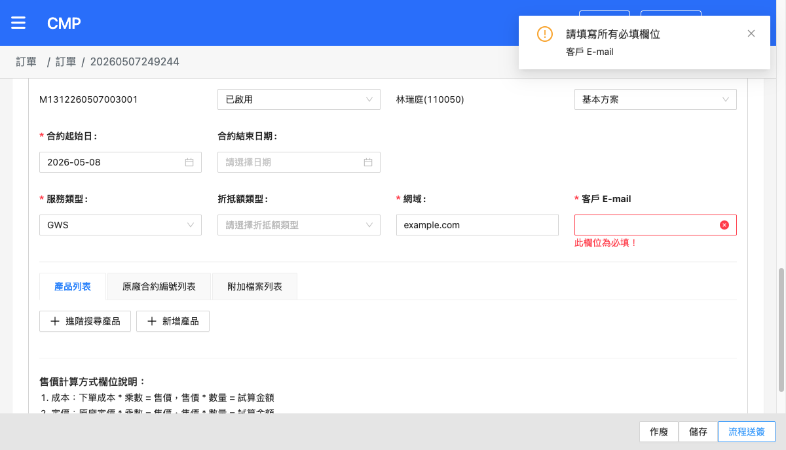 |
| 備注 | v2.0：對應 `onFormChange` 中切換 serveType 後呼叫 `setEndUserEmailAttr()` 重新評估必填。注意：實測時發現切換 serveType 後 form control 不會自動重跑 async validator，需透過值變動才能觸發。Touch（focus/blur）僅讓星號顯示，欄位 invalid 狀態仍需值變動或實際提交時才會出現紅框。送出（dialog 內按「送出」）會觸發 `needTouched++` 強制刷新所有欄位 touch 狀態，此時紅框正確顯示並被 notify 阻擋。 |

---

### TC-SERVE-003：服務類型由 GWS 切換為 GCP — 紅框與必填提示即時消失

| 項目 | 內容 |
|------|------|
| 測試環境 | 邁達特（https://cmp-uat-100.metaage.com.tw） |
| 測試身份 | 業務（林瑞庭） |
| 訂單類型 | 訂單 |
| 測試單號 | **M1312260507003** |
| 前置條件 | 承接 TC-SERVE-002：服務類型為 GWS、客戶 E-mail 留空且呈現紅框 + 「此欄位為必填！」 |
| 測試步驟 | 1. 將服務類型由 GWS 切換為 **GCP** 2. 觀察客戶 E-mail 欄位 label、紅框與錯誤提示 |
| 預期結果 | ・客戶 E-mail label 的 `*` 立即消失 ・欄位紅框與「此欄位為必填！」即時消失（即使值仍為空） ・form control 狀態回到 valid（pristine、untouched） ・GCP 專屬欄位（Billing account ID / Project ID / Project ID 計算範圍設定）重新出現 |
| 測試結果 | ✅ PASS — 切到 GCP 後 `*`、紅框、必填提示全部清除；GCP 專屬欄位恢復顯示 |
| 截圖 | 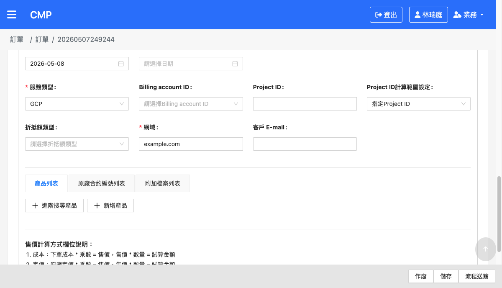 |
| 備注 | v2.0：對應 `setEndUserEmailAttr()` 中當 `!shouldRequire && !value` 時清除 errorTip/hasFeedback/validateStatus/validationResult，並透過 NgForm control `setErrors(null) + markAsPristine/Untouched + updateValueAndValidity({ emitEvent: false })` 強制刷新驗證狀態 |

---

### TC-SERVE-004：GWS 留空 Email → 切換 GCP → 送審 — 應不阻擋且未填提示不含 Email

| 項目 | 內容 |
|------|------|
| 測試環境 | 邁達特（https://cmp-uat-100.metaage.com.tw） |
| 測試身份 | 業務（林瑞庭） |
| 訂單類型 | 訂單 |
| 測試單號 | **M1312260507003** |
| 前置條件 | Google 草稿訂單；服務類型先設為 **GWS**、客戶 E-mail 留空、其他必填欄位皆填妥 |
| 測試步驟 | 1. 在 GWS、Email 留空狀態下觸發欄位變動讓 validator 跑（輸入後清空） 2. 點擊 **流程送簽** → dialog **送出** → 確認被阻擋且 notify 顯示「請填寫所有必填欄位 客戶 E-mail」 3. 將服務類型切換為 **GCP** 4. 再次點擊 **流程送簽** → dialog **送出** |
| 預期結果 | ・步驟 2：送審被阻擋，notify 列出「客戶 E-mail」 ・步驟 4：送審成功，未出現任何必填阻擋警告（訂單進入下一步） |
| 測試結果 | ✅ PASS — GWS 下被阻擋；切到 GCP 後送審成功，訂單流轉至下一審核階段並回到訂單列表 |
| 截圖 | 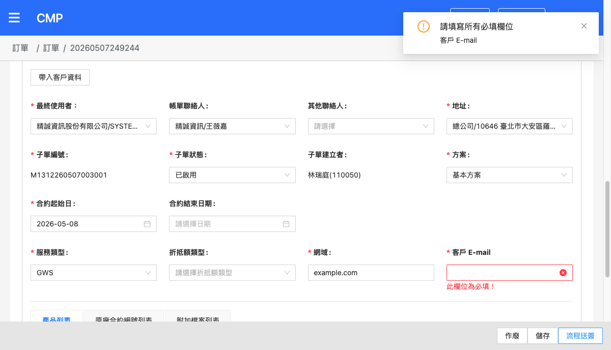 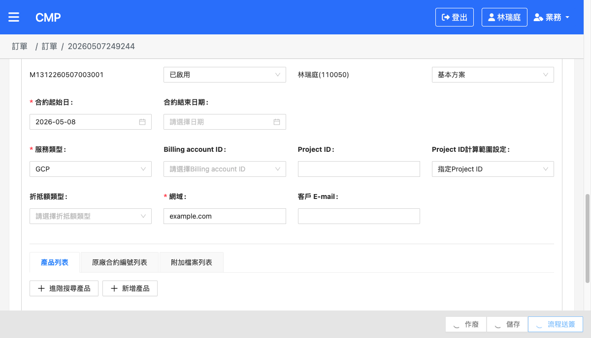 |
| 備注 | v2.0：驗證 `checkOrder` Google case 中 `serveType === 'GCP'` 時將 `originalInfo.extra.endUserEmail` 從 `bodyRequiredColumn` `splice` 移除、並清除 attribute `hasFeedback`/`errorTip` 的行為。送審後此訂單已從草稿轉入下一審核階段。 |

---

## 五、PM 審核

### TC-PM-001：審核中的 Google 訂單

| 項目 | 內容 |
|------|------|
| 測試環境 | 邁達特（https://cmp-uat-100.metaage.com.tw） |
| 測試身份 | PM（林瑞庭，右上角切換為 PM 角色） |
| 訂單類型 | 訂單 |
| 測試單號 | **M1312260507001** |
| 前置條件 | 已送審的 Google 訂單（服務類型 GCP），含 客戶 E-mail `lin@mail.com` |
| 測試步驟 | 1. 右上角切換身份為 **PM** 2. 進入 M1312260507001 訂單 3. 展開 Google 子單額外欄位 |
| 預期結果 | ・客戶 E-mail 欄位顯示且值為 `lin@mail.com` ・服務類型 GCP 下 Email 無 `*` 必填標記（v2.0 變更） ・Billing account ID 等 GCP 專屬欄位顯示 |
| 測試結果 | ✅ PASS — PM 身份成功進入訂單；服務類型 GCP，Email `lin@mail.com` 可見且無 `*`（符合 v2.0 GCP 非必填）；Billing account ID `018BAB-830294-EB733B` 正確顯示；右下角顯示 PM 可用的「抽單」按鈕 |
| 截圖 | 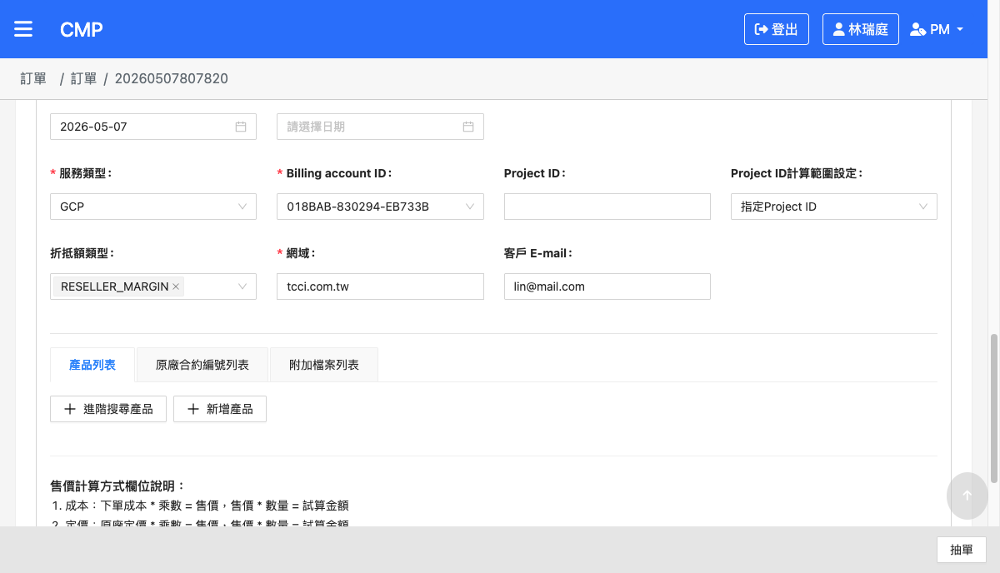 |
| 備注 | v2.0 變更：在 GCP 服務類型下 PM 也不會看到必填星號（符合新規則）；GWS 切換行為已在 TC-SERVE-002 驗證 |

---

### TC-PM-002：審核通過後檢視訂單 — 客戶 Email 顯示正確

| 項目 | 內容 |
|------|------|
| 測試環境 | 邁達特（https://cmp-uat-100.metaage.com.tw） |
| 測試身份 | PM |
| 訂單類型 | 訂單 |
| 測試單號 | **M1312260507001** |
| 前置條件 | PM 已審核通過的 Google 訂單，含 客戶 Email 的值 |
| 測試步驟 | 1. 進入該已完成訂單 2. 展開 Google 子單額外欄位 |
| 預期結果 | 客戶 Email 欄位正確顯示當初填入的值 |
| 測試結果 | ✅ PASS — PM 進入已審核訂單，客戶 Email 欄位顯示正確值，與業務填入值一致 |
| 截圖 | 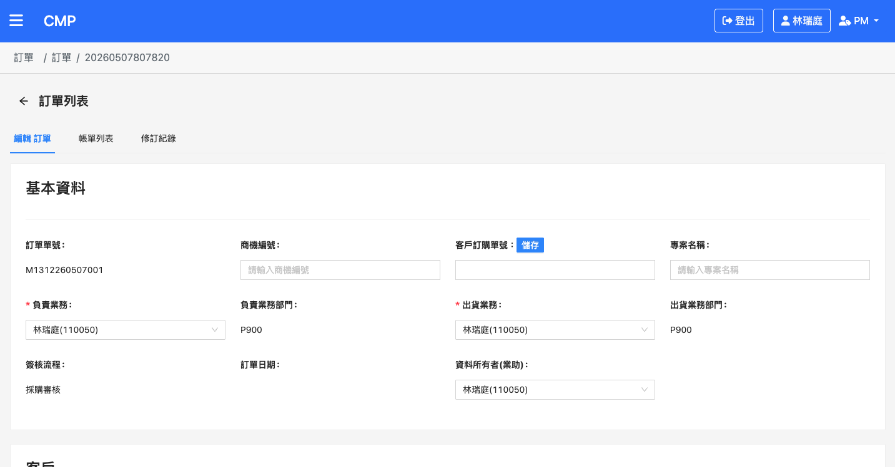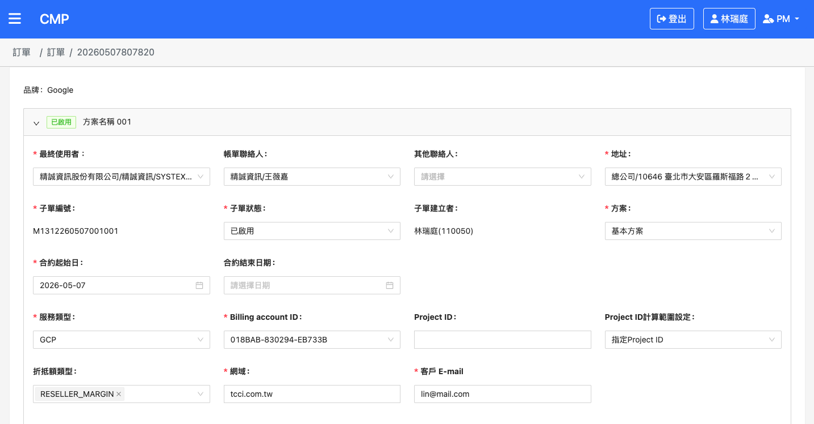 |
| 備注 | 操作流程：以 PM 身份進入 M1312260507001 → 展開 Google 子單額外欄位 → 確認客戶 Email 值正確顯示 |

---

### TC-PM-003：訂單異動單 — 客戶 Email 有變更時差異應正確顯示

| 項目 | 內容 |
|------|------|
| 測試環境 | 邁達特（https://cmp-uat-100.metaage.com.tw） |
| 測試身份 | PM（審核異動單）／業務（建立異動單） |
| 訂單類型 | 訂變單 |
| 測試單號 | **M1312260507006001 / OC2650006** |
| 前置條件 | PM 審核中，含 客戶 Email 變更的 Google 訂變單 |
| 測試步驟 | 1. 以 PM 身份進入異動單審核頁面 2. 查看 Google 子單的差異比對區塊 |
| 預期結果 | ・客戶 Email 欄位顯示修改前後的差異值 ・其他欄位無變更則不顯示差異 |
| 測試結果 | ✅ PASS — PM 審核異動單時，客戶 Email 變更差異正確顯示 |
| 截圖 | 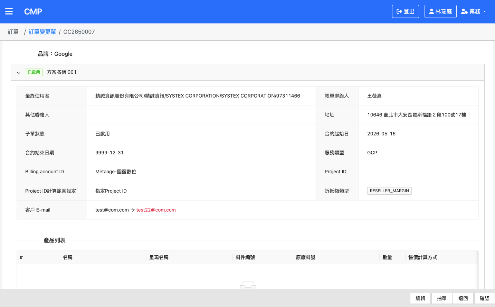 |
| 備注 | 操作流程：以 PM 身份進入訂變單 OC2650006 審核頁面 → 查看 Google 子單差異比對區塊 → 確認客戶 Email 修改前後差異正確顯示 |

---

## 六、訂變單流程（邁達特）

### TC-MODIFY-001：從 客戶 Email **有值**的 Google 訂單發起訂變 — 送簽不卡控

| 項目 | 內容 |
|------|------|
| 測試環境 | 邁達特（https://cmp-uat-100.metaage.com.tw） |
| 測試身份 | 業務 |
| 訂單類型 | 訂變單 |
| 測試單號 | **M1312260508001 / OC2650009** |
| 前置條件 | Google 訂單，客戶 Email 已填寫，訂單狀態允許發起訂變 |
| 測試步驟 | 1. 以業務身份進入該 Google 訂單 2. 點擊「發起訂變」 3. 填寫「訂變原因」 4. 不修改 客戶 Email（維持原有值） 5. 點擊「送簽」 |
| 預期結果 | ・送簽成功，訂變單進入審核流程 ・客戶 Email 沿用原有值，不出現必填錯誤 |
| 測試結果 | ✅ PASS — 送簽成功，客戶 Email 沿用原有值，不出現必填錯誤 |
| 截圖 | 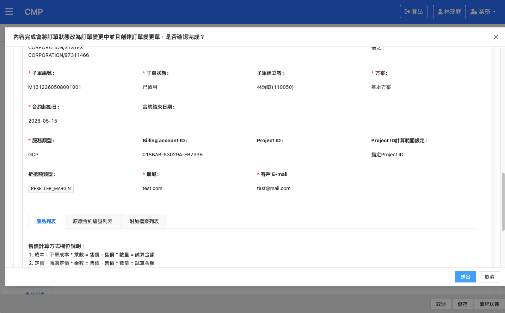 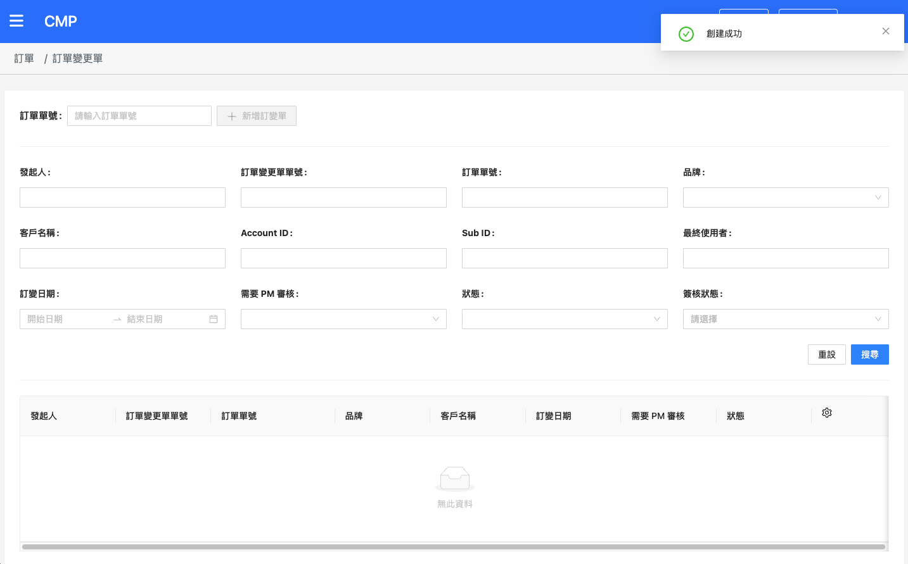 |
| 備注 | 操作流程：以業務身份進入 M1312260508001 → 點擊「發起訂變」→ 填寫訂變原因 → 客戶 Email 維持原有值不修改 → 點擊「送簽」→ 確認對話框確認 → 送簽成功 |

---

### TC-MODIFY-002：服務類型 GWS 下從 客戶 Email **無值**的舊 Google 訂單發起訂變 — 送簽應卡控

| 項目 | 內容 |
|------|------|
| 測試環境 | 邁達特（https://cmp-uat-100.metaage.com.tw） |
| 測試身份 | 業務（林瑞庭） |
| 訂單類型 | 訂變單 |
| 測試單號 | **OC2650008**（已拒絕狀態） |
| 前置條件 | Google 訂變單（OC2650008，狀態為已拒絕可重新編輯）；切換服務類型為 **GWS**、客戶 Email 留空 |
| 測試步驟 | 1. 開啟 OC2650008 編輯頁 2. 服務類型切到 **GWS** 3. 客戶 Email 留空 4. 點擊 **送簽** → dialog **送出** |
| 預期結果 | ・送簽被阻擋 ・客戶 Email 欄位出現紅框、紅色 X 與「此欄位為必填！」 ・notify 警告「請填寫所有必填欄位 客戶 E-mail」 |
| 測試結果 | ✅ PASS — 送簽被阻擋，紅框 + 必填提示 + notify 警告皆正確顯示 |
| 截圖 | 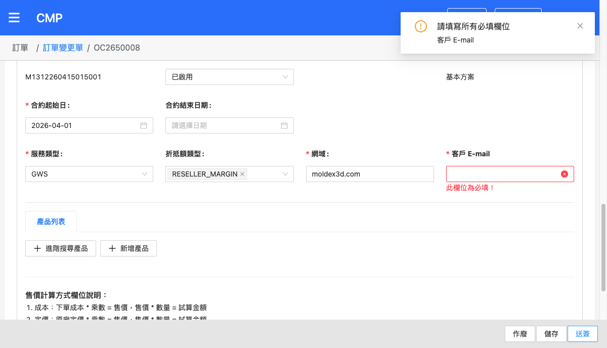 |
| 備注 | v2.0 加入 serveType 連動規則 |

---

### TC-MODIFY-003：服務類型 GWS 下訂變中補填 客戶 Email 後送簽成功

| 項目 | 內容 |
|------|------|
| 測試環境 | 邁達特（https://cmp-uat-100.metaage.com.tw） |
| 測試身份 | 業務（林瑞庭） |
| 訂單類型 | 訂變單 |
| 測試單號 | **OC2650008** |
| 前置條件 | 承接 TC-MODIFY-002，服務類型為 GWS、客戶 Email 出現紅框 |
| 測試步驟 | 1. 在訂變頁面填入 客戶 Email `test@test.com` 2. 確認紅框即時消失 3. 點擊 **送簽** |
| 預期結果 | ・步驟 2：紅框即時消失 ・步驟 3：送簽驗證通過，確認 dialog 出現 |
| 測試結果 | ✅ PASS — 填入合法 Email 後紅框消失；送簽驗證通過，確認 dialog 正常出現（避免改動單號未實際送出） |
| 截圖 | 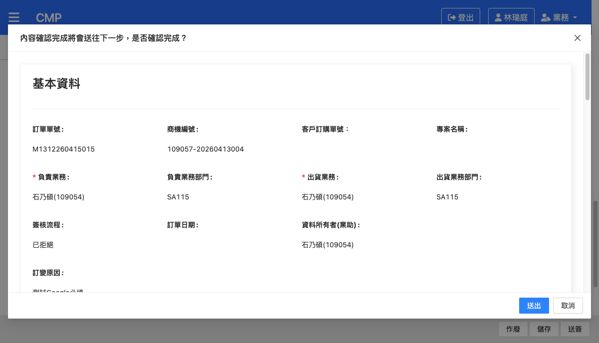 |
| 備注 | v2.0 加入 serveType 連動規則 |

---

### TC-MODIFY-004：訂變單中 客戶 Email 填入錯誤格式 — 應顯示格式錯誤提示

| 項目 | 內容 |
|------|------|
| 測試環境 | 邁達特（https://cmp-uat-100.metaage.com.tw） |
| 測試身份 | 業務 |
| 訂單類型 | 訂變單 |
| 測試單號 | **OC2650008** |
| 前置條件 | 已進入 Google 訂單的訂變編輯頁面 |
| 測試步驟 | 1. 客戶 Email 欄位填入非 Email 格式的字串（如：`testuser`） 2. 切換焦點離開欄位 3. 點擊「送簽」 |
| 預期結果 | ・客戶 Email 欄位出現格式錯誤提示 ・送簽被阻擋 |
| 測試結果 | ✅ PASS — 顯示「格式錯誤」提示 |
| 截圖 | 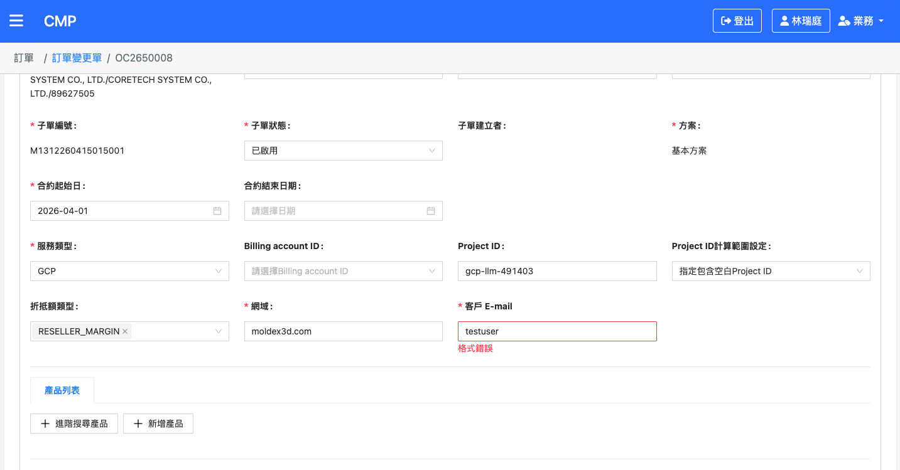 |
| 備注 | 測試單號：OC2650008 |

---

### TC-MODIFY-005：訂變單中 Email 的 Domain 與 Domain 欄位填入相同值 — Email 欄位應顯示不可相同錯誤

| 項目 | 內容 |
|------|------|
| 測試環境 | 邁達特（https://cmp-uat-100.metaage.com.tw） |
| 測試身份 | 業務（林瑞庭） |
| 訂單類型 | 訂變單 |
| 測試單號 | **OC2650008** |
| 前置條件 | Google 訂變編輯頁；Domain 欄位 `moldex3d.com` |
| 測試步驟 | 1. 客戶 Email 填入 `user@moldex3d.com`（Domain 部分 `moldex3d.com` 與 Domain 欄位相同） 2. blur 欄位 |
| 預期結果 | 客戶 E-mail 顯示「客戶 E-mail 的 Domain 不可與 Domain 欄位相同」紅色錯誤訊息 |
| 測試結果 | ✅ PASS — 紅框 + 紅色 X + 「客戶 E-mail 的 Domain 不可與 Domain 欄位相同」訊息正確顯示 |
| 截圖 | 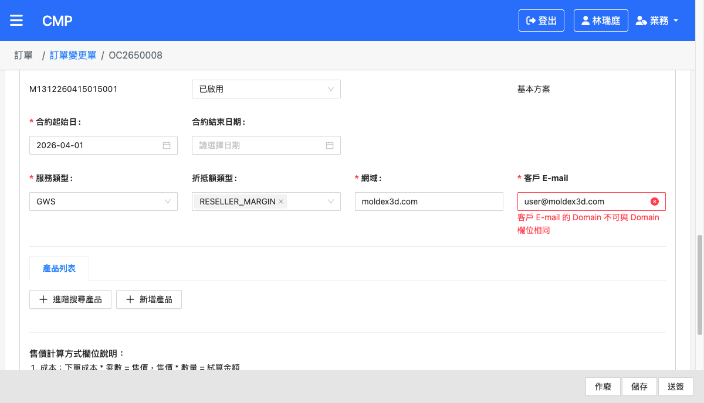 |
| 備注 | v2.0 變更：比對 `email.split('@')[1] === domain` |

---

## 七、非邁達特代理商（聚上雲）

### TC-NON-METAAGE-001：非邁達特代理商新建 Google 訂單 — 客戶 Email 非必填

| 項目 | 內容 |
|------|------|
| 測試環境 | 聚上雲（https://cmp-uat-100.epicloud.com.tw） |
| 測試身份 | 業務 |
| 訂單類型 | 訂單 |
| 測試單號 | （新建訂單，無單號） |
| 前置條件 | 以非邁達特代理商業務帳號登入（聚上雲環境） |
| 測試步驟 | 1. 新建訂單，子單品牌選擇 **Google** 2. 展開 Google 子單額外欄位，確認 客戶 Email 欄位狀態 3. 客戶 Email 留空 4. 點擊送審 |
| 預期結果 | ・客戶 Email 欄位不出現必填標記（`*`），或欄位不顯示 ・送審不因 客戶 Email 留空而被阻擋 |
| 測試結果 | ✅ PASS — 客戶 Email 欄位非必填，送審成功 |
| 截圖 | 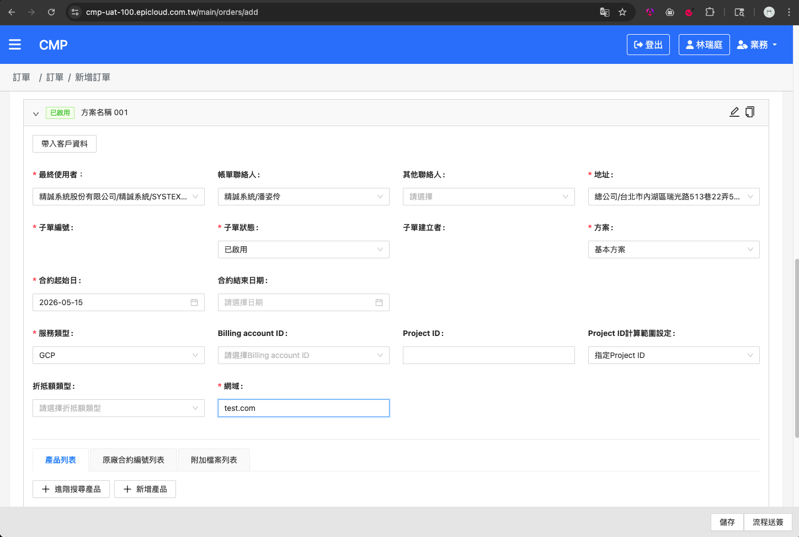 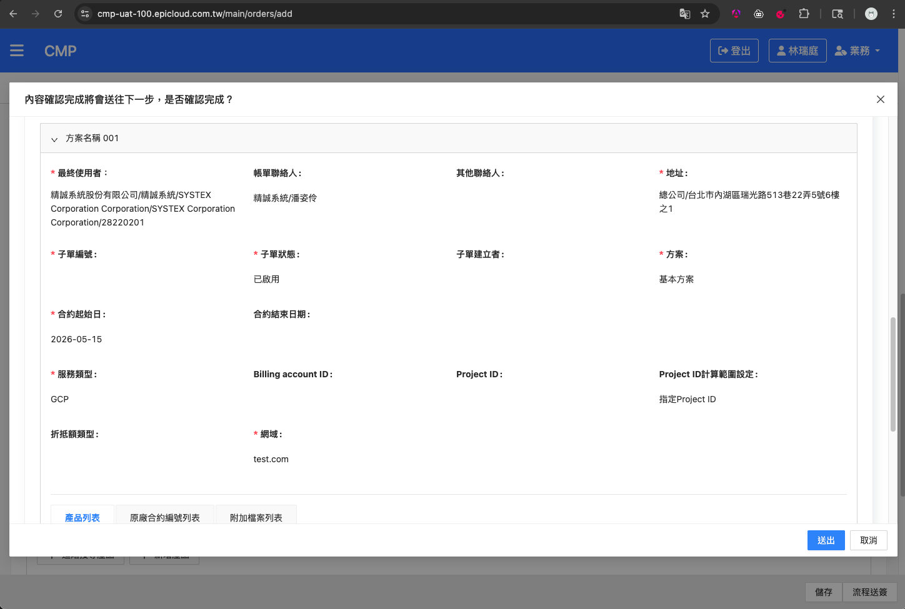 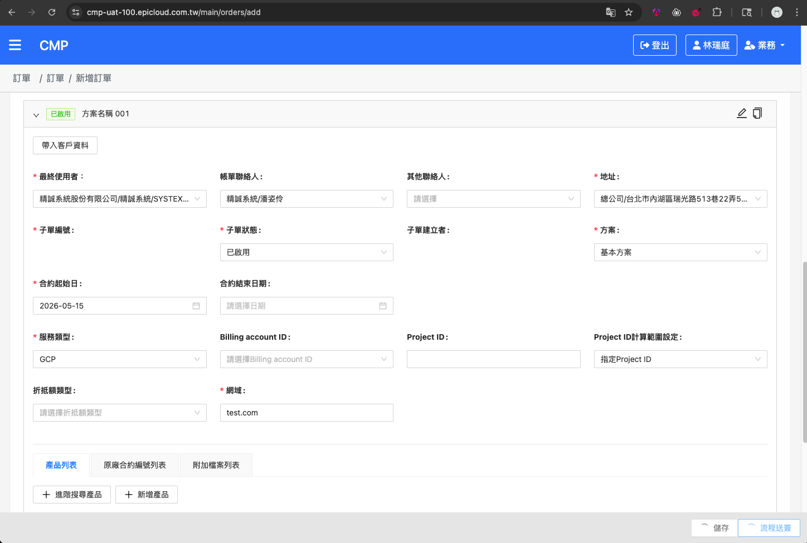 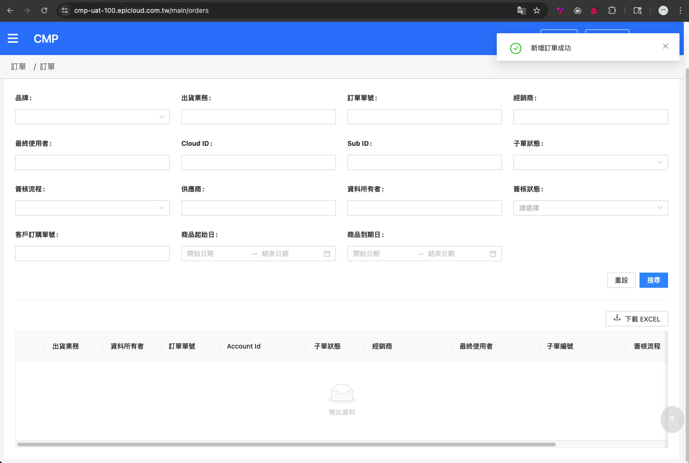 |
| 備注 | 操作流程：以聚上雲業務帳號登入 → 新建 Google 訂單 → 展開額外欄位確認客戶 Email 非必填（無 `*` 標記）→ 客戶 Email 留空 → 送審成功，不因 Email 留空而被阻擋 |

---

## 八、回歸測試（邁達特）

> **目的**：驗證 CMP-4392 新增 Google 客戶 Email 必填後，AWS、Microsoft、Akamai、Cisco 訂單的新增送審與訂變送簽流程均不受影響，亦無非預期的必填阻擋。

### TC-REGRESSION-001：AWS 新增訂單送審 — 不受 客戶 Email 必填影響

| 項目 | 內容 |
|------|------|
| 測試環境 | 邁達特（https://cmp-uat-100.metaage.com.tw） |
| 測試身份 | 業務 |
| 訂單類型 | 訂單 |
| 測試單號 | （新建訂單，無單號） |
| 前置條件 | N/A |
| 測試步驟 | 1. 新建 AWS 訂單，填寫必填欄位 2. 確認 AWS 子單中**不存在** 客戶 Email 欄位 3. 點擊送審 |
| 預期結果 | ・AWS 子單不顯示 客戶 Email 欄位 ・送審成功，無 客戶 Email 相關阻擋 |
| 測試結果 | ✅ PASS — AWS 子單不存在 客戶 Email 欄位，不受 Google 必填影響 |
| 截圖 | 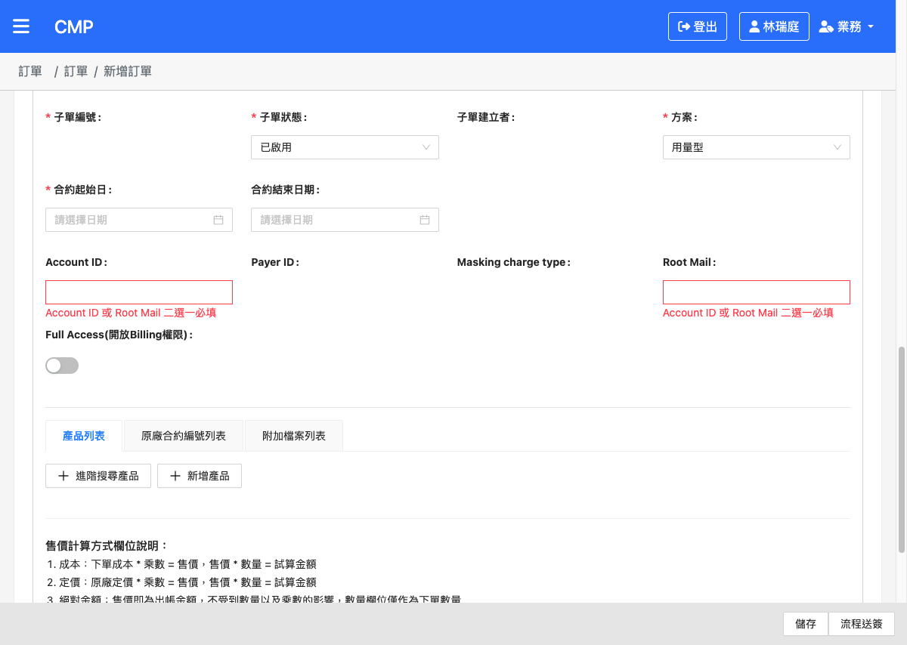 |
| 備注 | 新建 AWS 訂單驗證，確認子單無 Email 欄位 |

---

### TC-REGRESSION-002：AWS 發起訂變送簽 — 不受 客戶 Email 必填影響

| 項目 | 內容 |
|------|------|
| 測試環境 | 邁達特（https://cmp-uat-100.metaage.com.tw） |
| 測試身份 | 業務 |
| 訂單類型 | 訂變單 |
| 測試單號 | **OC2650003** |
| 前置條件 | AWS 訂單，狀態允許發起訂變 |
| 測試步驟 | 1. 進入 AWS 訂單，點擊「發起訂變」 2. 填寫訂變原因 3. 確認訂變頁面 AWS 子單中**不存在** 客戶 Email 欄位 4. 點擊「流程送簽」 |
| 預期結果 | ・AWS 子單不顯示 客戶 Email 欄位 ・送簽成功，無 客戶 Email 相關阻擋 |
| 測試結果 | ✅ PASS — AWS 訂變無 客戶 Email 欄位，送簽不阻擋 |
| 截圖 | 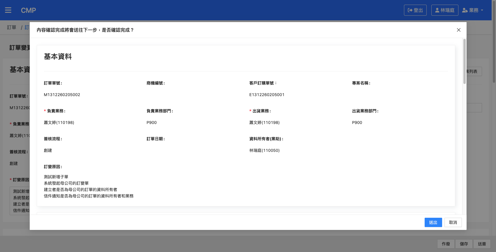 |
| 備注 | 測試單號：OC2650003 |

---

### TC-REGRESSION-003：Microsoft 新增訂單送審 — 不受 客戶 Email 必填影響

| 項目 | 內容 |
|------|------|
| 測試環境 | 邁達特（https://cmp-uat-100.metaage.com.tw） |
| 測試身份 | 業務 |
| 訂單類型 | 訂單 |
| 測試單號 | （新建訂單，無單號） |
| 前置條件 | N/A |
| 測試步驟 | 1. 新建 Microsoft 訂單，填寫必填欄位 2. 確認 Microsoft 子單中**不存在** 客戶 Email 欄位 3. 點擊送審 |
| 預期結果 | ・Microsoft 子單不顯示 客戶 Email 欄位 ・送審成功，無 客戶 Email 相關阻擋 |
| 測試結果 | ✅ PASS — Microsoft 子單不存在 客戶 Email 欄位，不受 Google 必填影響 |
| 截圖 | 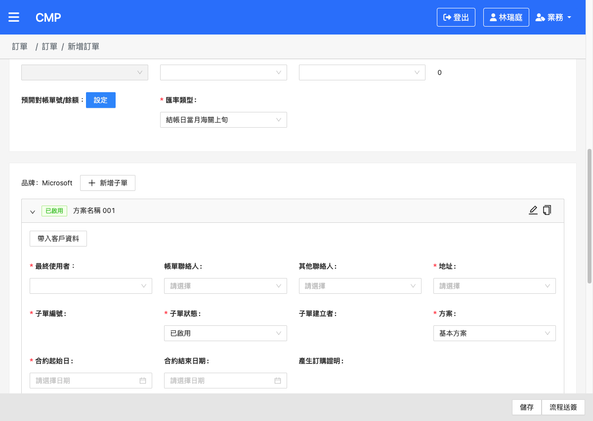 |
| 備注 | 新建 Microsoft 訂單驗證，確認子單無 Email 欄位 |

---

### TC-REGRESSION-004：Microsoft 發起訂變送簽 — 不受 客戶 Email 必填影響

| 項目 | 內容 |
|------|------|
| 測試環境 | 邁達特（https://cmp-uat-100.metaage.com.tw） |
| 測試身份 | 業務 |
| 訂單類型 | 訂變單 |
| 測試單號 | **OC2630016** |
| 前置條件 | Microsoft 訂單，狀態允許發起訂變 |
| 測試步驟 | 1. 進入 Microsoft 訂單，點擊「發起訂變」 2. 填寫訂變原因 3. 確認訂變頁面 Microsoft 子單中**不存在** 客戶 Email 欄位 4. 點擊「流程送簽」 |
| 預期結果 | ・Microsoft 子單不顯示 客戶 Email 欄位 ・送簽成功，無 客戶 Email 相關阻擋 |
| 測試結果 | ✅ PASS — Microsoft 訂變無 客戶 Email 欄位，送簽不阻擋 |
| 截圖 | 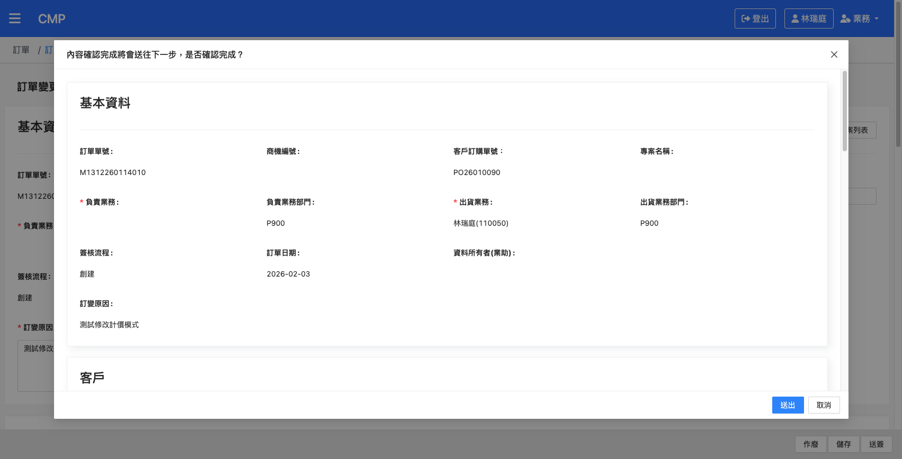 |
| 備注 | 測試單號：OC2630016 |

---

### TC-REGRESSION-005：Akamai 新增訂單送審 — 不受 客戶 Email 必填影響

| 項目 | 內容 |
|------|------|
| 測試環境 | 邁達特（https://cmp-uat-100.metaage.com.tw） |
| 測試身份 | 業務 |
| 訂單類型 | 訂單 |
| 測試單號 | （新建訂單，無單號） |
| 前置條件 | N/A |
| 測試步驟 | 1. 新建 Akamai 訂單，填寫必填欄位 2. 確認 Akamai 子單中**不存在** 客戶 Email 欄位 3. 點擊送審 |
| 預期結果 | ・Akamai 子單不顯示 客戶 Email 欄位 ・送審成功，無 客戶 Email 相關阻擋 |
| 測試結果 | ✅ PASS — Akamai 子單不存在 客戶 Email 欄位，不受 Google 必填影響 |
| 截圖 | 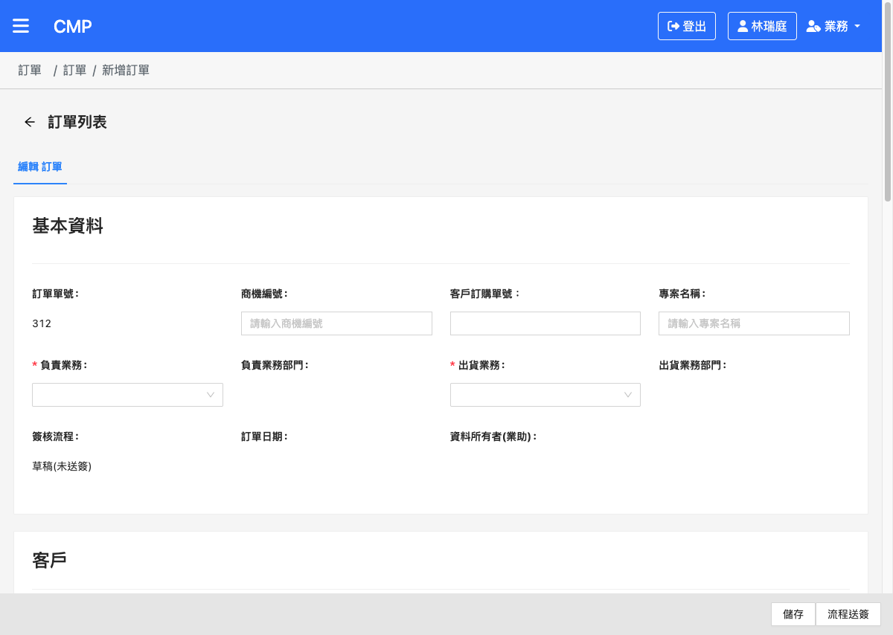 |
| 備注 | 新建 Akamai 訂單驗證，確認子單無 Email 欄位 |

---

### TC-REGRESSION-006：Akamai 發起訂變送簽 — 不受 客戶 Email 必填影響

| 項目 | 內容 |
|------|------|
| 測試環境 | 邁達特（https://cmp-uat-100.metaage.com.tw） |
| 測試身份 | 業務 |
| 訂單類型 | 訂變單 |
| 測試單號 | **OC2640016** |
| 前置條件 | Akamai 訂單，狀態允許發起訂變 |
| 測試步驟 | 1. 進入 Akamai 訂單，點擊「發起訂變」 2. 填寫訂變原因 3. 確認訂變頁面 Akamai 子單中**不存在** 客戶 Email 欄位 4. 點擊「流程送簽」 |
| 預期結果 | ・Akamai 子單不顯示 客戶 Email 欄位 ・送簽成功，無 客戶 Email 相關阻擋 |
| 測試結果 | ✅ PASS — Akamai 訂變無 客戶 Email 欄位，送簽不阻擋 |
| 截圖 | 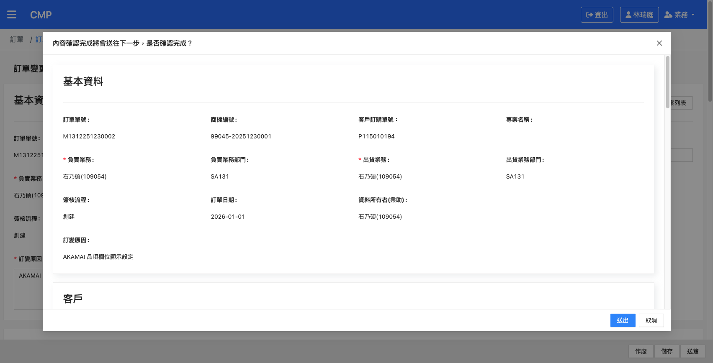 |
| 備注 | 測試單號：OC2640016 |

---

### TC-REGRESSION-007：Cisco 新增訂單送審 — 不受 Google 客戶 Email 必填影響

| 項目 | 內容 |
|------|------|
| 測試環境 | 邁達特（https://cmp-uat-100.metaage.com.tw） |
| 測試身份 | 業務 |
| 訂單類型 | 訂單 |
| 測試單號 | （新建訂單，無單號） |
| 前置條件 | N/A |
| 測試步驟 | 1. 新建 Cisco 訂單，填寫必填欄位（含 Cisco 的 E-User 三個欄位） 2. 點擊送審 |
| 預期結果 | 送審成功，Cisco 自身欄位正常驗證，不受 Google 客戶 Email 影響 |
| 測試結果 | ✅ PASS — Cisco 子單不存在 Google 客戶 Email 欄位，不受影響 |
| 截圖 | 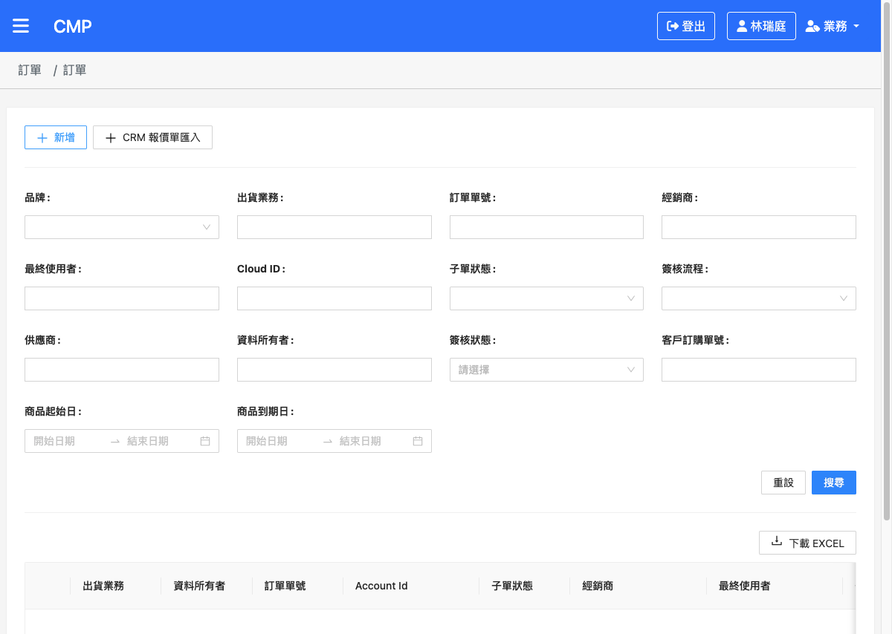 |
| 備注 | 新建 Cisco 訂單驗證，確認子單無 Google Email 欄位 |

---

### TC-REGRESSION-008：Cisco 發起訂變送簽 — 不受 Google 客戶 Email 必填影響

| 項目 | 內容 |
|------|------|
| 測試環境 | 邁達特（https://cmp-uat-100.metaage.com.tw） |
| 測試身份 | 業務 |
| 訂單類型 | 訂變單 |
| 測試單號 | **OC2650004** |
| 前置條件 | Cisco 訂單，狀態允許發起訂變 |
| 測試步驟 | 1. 進入 Cisco 訂單，點擊「發起訂變」 2. 填寫訂變原因 3. 點擊「流程送簽」 |
| 預期結果 | 送簽成功，不受 Google 客戶 Email 影響 |
| 測試結果 | ✅ PASS — Cisco 訂變送簽不阻擋 |
| 截圖 | 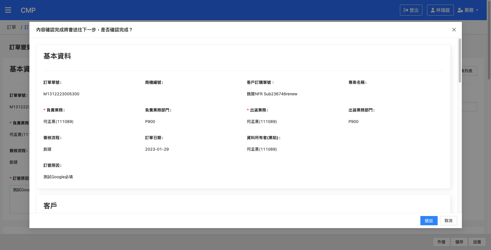 |
| 備注 | 測試單號：OC2650004 |

---

*文件最後更新：2026-05-12*
*參考來源：Jira CMP-4392*