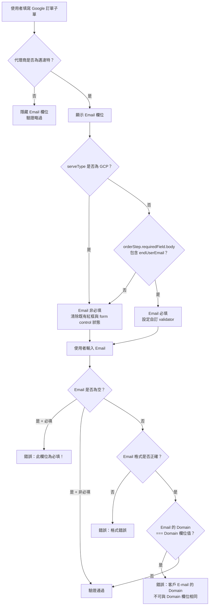
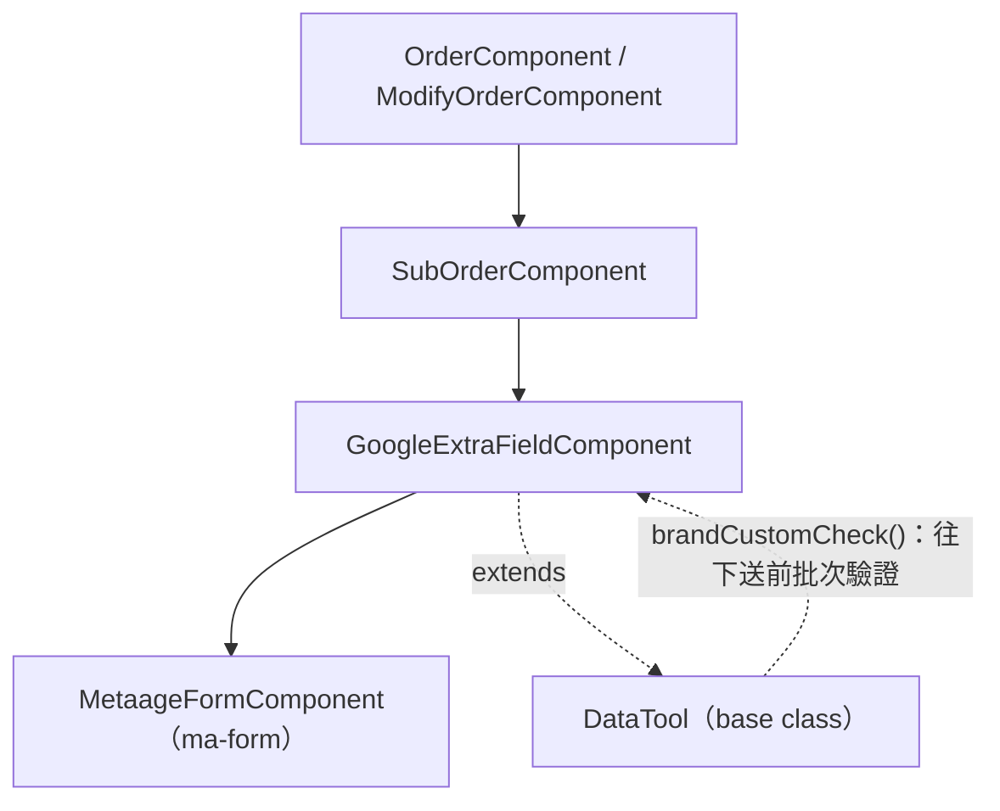
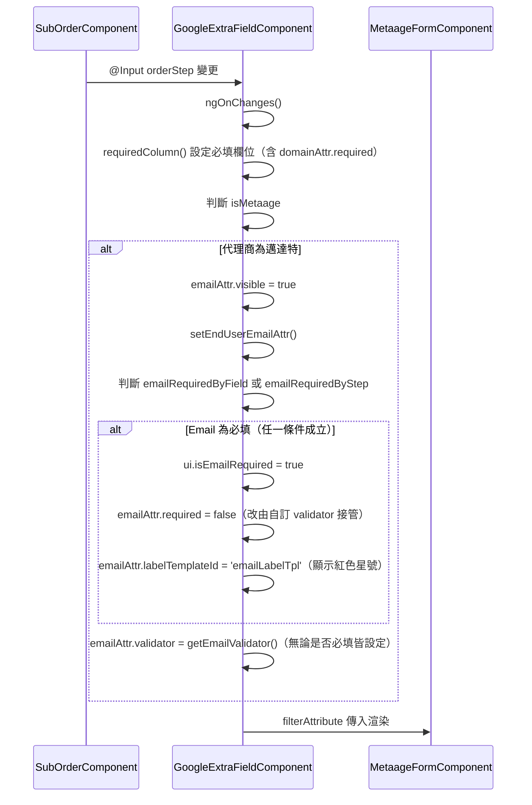
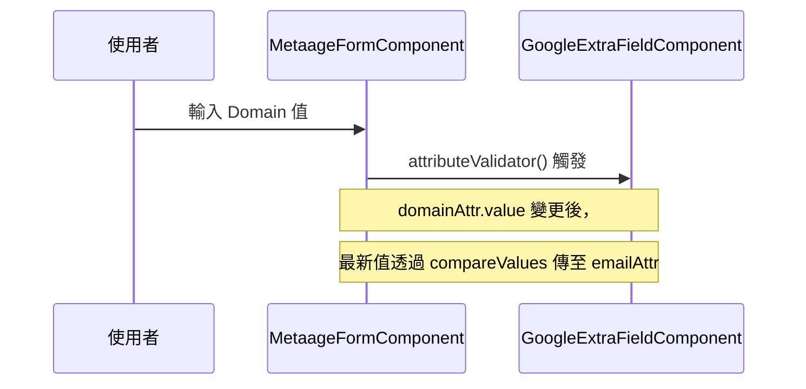
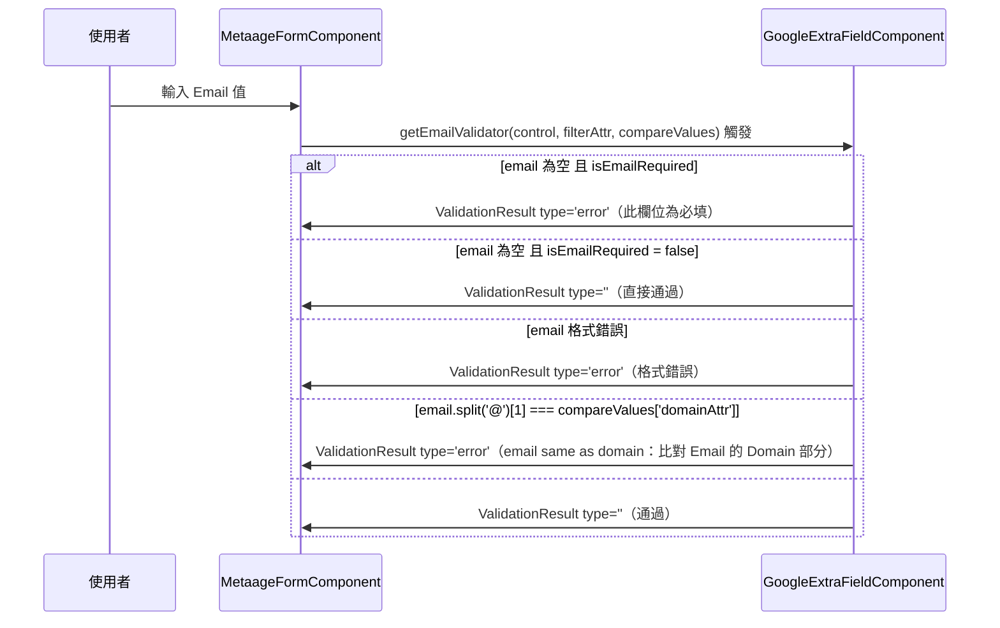
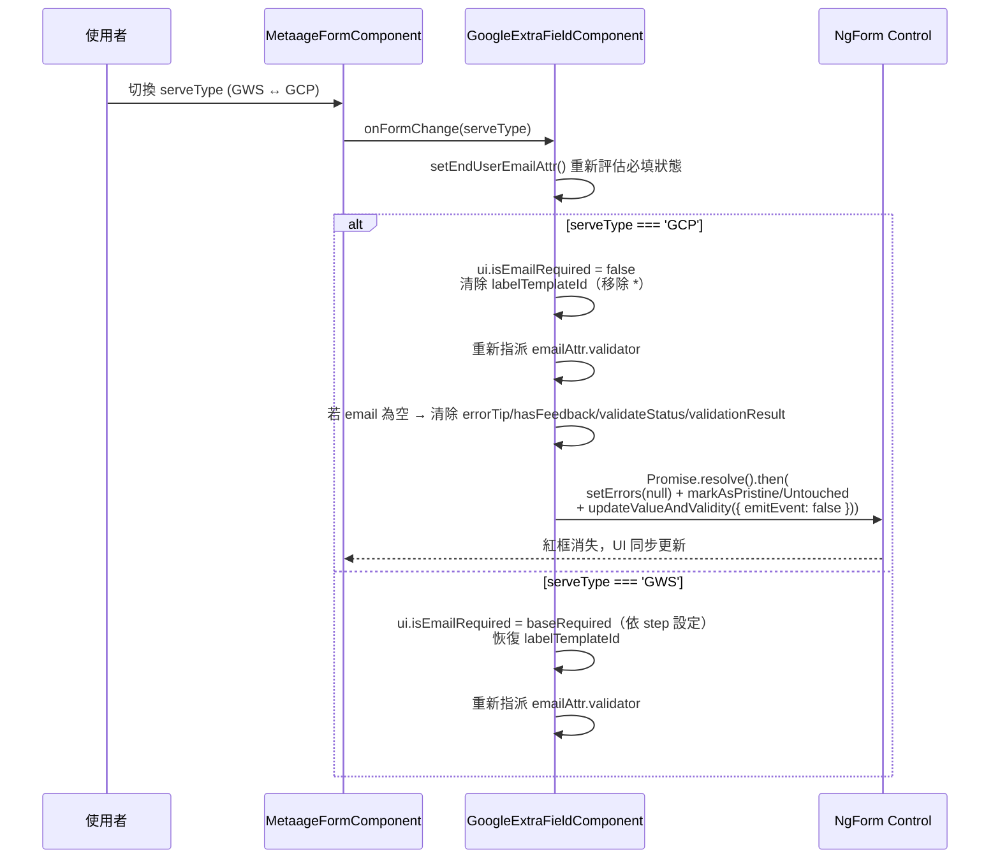
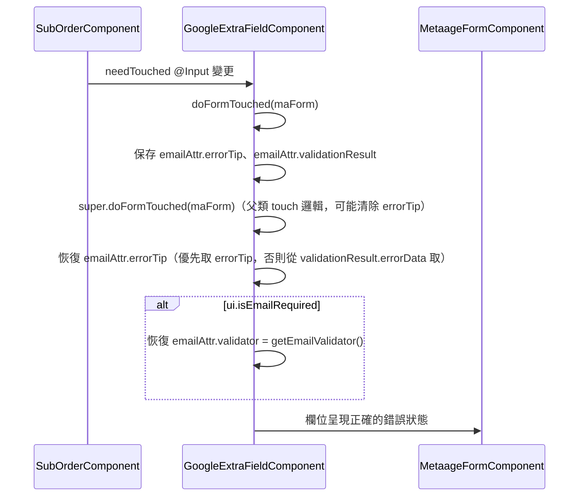
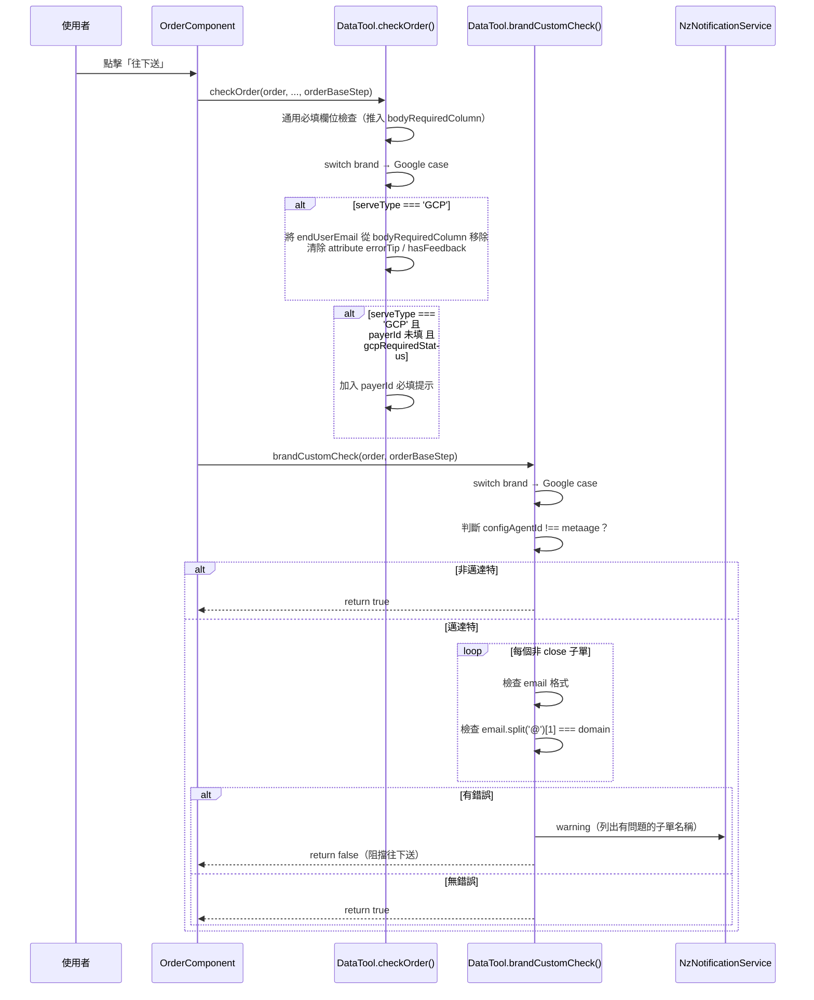

## 修訂紀錄

| **版本** | **日期** | **修訂內容** | **修訂者** |
| --- | --- | --- | --- |
| v1.0 | 2026-05-05 | 初始化文件 | Raelynn |
| v1.1 | 2026-05-06 | 移除 domain 相關客製化檢查，只有 email 檢查就好，並使用 compareValues 機制取得 domain 的更新値 | Raelynn |
| v1.2 | 2026-05-07 | 修復 domain 欄位值被 `<ma-form>` 的 `[(ngModel)]` 初始化覆蓋的問題；email validator 加入 domain fallback | Raelynn |
| v2.0 | 2026-05-11 | 1. Email 與 Domain 一致性檢核改為比對 Email 的 Domain 部分（`@` 之後）與 Domain 欄位值<br>2. 服務類型為 GCP 時，Email 欄位改為非必填（包含 UI 必填星號、validator 與送審 `bodyRequiredColumn` 同步移除）<br>3. 切換 serveType 為 GCP 時，主動清除既有的 Email 必填紅框與 form control 驗證狀態 | Raelynn |


## 相關Jira單：

* CMP-4392 訂單/訂變單：Google 品牌增加必填欄位

## 目錄：

1. 功能需求
2. 實作架構設計
   * 2.1 系統流程圖
   * 2.2 元件關係圖
   * 2.3 序列圖
     * 2.3.1 元件初始化流程
     * 2.3.2 Domain 欄位驗證流程
     * 2.3.3 Email 欄位驗證流程
     * 2.3.4 Touch 觸發流程（doFormTouched 覆寫）
     * 2.3.5 往下送批次驗證流程
3. 實作
   * 3.1 核心邏輯設計
     * 3.1.1 `setEndUserEmailAttr()` 執行前提
     * 3.1.2 Email 欄位邏輯
     * 3.1.3 為何不使用 `filterAttribute.required = true`
   * 3.2 修改檔案
     * 3.2.1 `google-extra-field.component.ts`
     * 3.2.2 `google-extra-field.component.html`
     * 3.2.3 `google-extra-field.component.scss`
     * 3.2.4 `data-tool.component.ts`
     * 3.2.5 `src/assets/i18n/zh-tw.json`

---

## 1. 功能需求

### 1.1 需求背景

Google 品牌訂單 / 訂變單，當代理商為 **邁達特** 時，子單的「客戶 E-mail」欄位必須填寫。

### 1.2 規則說明

| 條件 | 行為 |
| --- | --- |
| 代理商為邁達特 + 服務類型為 GWS | 顯示「客戶 E-mail」欄位；當訂單進入需要填寫 Email 的審核階段時，該欄位為必填 |
| 代理商為邁達特 + 服務類型為 GCP | 顯示「客戶 E-mail」欄位，但**非必填**（不顯示紅色星號，送審不卡控、紅框與必填提示需即時清除） |
| 代理商非邁達特（如聚上雲） | 不顯示「客戶 E-mail」欄位，不需填寫 |
| Email 格式錯誤 | 顯示「格式錯誤」錯誤訊息 |
| Email 的 Domain 與 Domain 欄位值相同 | 顯示「客戶 E-mail 的 Domain 不可與 Domain 欄位相同」錯誤訊息（比對 `@` 之後的字串，而非整段 Email） |
| Email 填寫合法 | 通過驗證，可正常送出 |

### 1.3 往下送前的批次驗證

Google 品牌訂單在使用者點擊「往下送」時，系統會在送出前先做一次全面檢查：

1. 若代理商不是邁達特，直接放行，不做任何檢查
2. 若代理商是邁達特，逐一檢查每張未關閉的子單：
   * 客戶 E-mail 格式是否正確（必須為合法 Email 格式）
   * 客戶 E-mail 的 Domain 部分（`@` 之後）是否與 Domain 欄位值相同
3. 若有子單的 E-mail 格式錯誤，畫面上方會彈出警告，列出有問題的子單名稱
4. 若有子單的 E-mail Domain 與 Domain 欄位相同，同樣會彈出警告並列出子單名稱
5. 服務類型為 GCP 的子單，於 `checkOrder` 階段會主動將 `originalInfo.extra.endUserEmail` 從 `bodyRequiredColumn` 移除，並清除該欄位的 `errorTip`、`hasFeedback`
6. 所有子單都沒問題，才允許往下送出

---

## 2. 實作架構設計

### 2.1 系統流程圖



### 2.2 元件關係圖



**元件說明：**

| 元件 / 類別 | 職責 |
| --- | --- |
| `GoogleExtraFieldComponent` | Google 品牌子單額外欄位；管理 `filterAttribute`、domain/email validator、UI 顯示邏輯 |
| `DataTool`（base） | 共用訂單工具；`brandCustomCheck()` 裡新增 Google case 做批次驗證 |
| `MetaageFormComponent`（`ma-form`） | 動態表單渲染；支援 `customTemplates` 讓子元件注入自訂 label template |

### 2.3 序列圖

#### 2.3.1 元件初始化流程



#### 2.3.2 Domain 欄位驗證流程



#### 2.3.3 Email 欄位驗證流程



#### 2.3.3.1 ServeType 切換 → Email 必填狀態同步



#### 2.3.4 Touch 觸發流程（doFormTouched 覆寫）



#### 2.3.5 往下送批次驗證流程



---

## 3. 實作

### 3.1 核心邏輯設計

#### 3.1.1 `setEndUserEmailAttr()` 執行前提

進入 `setEndUserEmailAttr()` 本身就代表 `isMetaage = true`，因此 email 欄位必定已顯示（`visible = true`）。
函式內的 `if` 判斷只負責「是否有必填需求」，有的話才設定 `labelTemplateId`。

---

#### 3.1.2 Email 欄位邏輯

設計關鍵：以 `baseRequired`（含 step 配置與已存在的 ui 狀態）與 `serveType` 共同決定 `shouldRequire`，每次呼叫都會重新評估（避免 sticky 狀態殘留）。

| 情境 | 行為 |
| --- | --- |
| `emailRequiredByField` **或** `requiredField.body.includes('originalInfo.extra.endUserEmail')` 或 `ui.isEmailRequired === true` | `baseRequired = true` |
| `baseRequired === true` **且** `serveType !== 'GCP'` | `shouldRequire = true`：設定 `ui.isEmailRequired`、`labelTemplateId = 'emailLabelTpl'` |
| `serveType === 'GCP'`（不論 base 為何） | `shouldRequire = false`：清除 `labelTemplateId`；若 email 為空則同步清除 `errorTip`、`hasFeedback`、`validateStatus`、`validationResult`，並透過 NgForm control `setErrors(null) + updateValueAndValidity` 強制刷新 |
| **無論是否必填** | 都要重新指派 `emailAttr.validator = getEmailValidator()` |

**Email Validator 內部規則：**

| 值狀態 | 行為 |
| --- | --- |
| 空值 + `isEmailRequired = true` | 報 required 錯誤 |
| 空值 + `isEmailRequired = false` | 直接通過（跳過） |
| 有值 + 格式不正確 | 報格式錯誤（先檢查格式，再比對 domain） |
| 有值 + 格式正確 + `email.split('@')[1] === domain` | 報一致性錯誤（client tip：`email same as domain`） |
| 有值 + 格式正確 + Email 的 Domain 與 Domain 欄位不同 | 通過 |

---

#### 3.1.3 為何不使用 `filterAttribute.required = true`

`filterAttribute.required = true` 會與其他 `errorTip`（格式錯誤、一致性錯誤）的顯示機制相牴觸，導致其他錯誤提示無法正常顯示。
因此：
- `required` 一律改設為 `false`
- 改由自訂 `validator` 接管所有驗證邏輯（包含 required、格式、一致性）
- 必填的紅色星號改以 `labelTemplateId` 搭配 `.required-label` CSS class 模擬

---

### 3.2 修改檔案

#### 3.2.1 `google-extra-field.component.ts`

**路徑：** `src/app/orders/sub-order/extra-field/google/google-extra-field.component.ts`

1. 新增 `ui` 物件與 `domainAttr` class field

```typescript
// 控制 label 動態樣式（必填紅色星號）
ui = {
  isEmailRequired: false,
}

// 網域欄位抽為 class field，供 email compareValues 機制參照
domainAttr = new FilterAttribute({
  name: this.translate.instant('domain'),
  internalVariableName: 'originalInfo.extra.domain',
  validator: this.attributeValidator,
});
```

2. 在 `filterAttribute` 陣列中引用 `domainAttr` 並設定 email 的 `compareValues`

```typescript
// 網域
 this.domainAttr,
// 客戶 E-mail：預設隱藏，僅 Metaage 代理商顯示
new FilterAttribute({
  name: this.translate.instant('customer e-mail'),
  type: FilterAttributeType.mail,
  internalVariableName: 'originalInfo.extra.endUserEmail',
  visible: false,   // 由 ngOnChanges 判斷代理商後動態顯示
  required: false,  // 必填改由自訂 validator 接管
  compareValues: { 'domainAttr': { object: this.domainAttr, property: 'value' } }
}),
```

3. `ngOnChanges()` 新增 Metaage 代理商判斷

```typescript
// 判斷是否為 Metaage 代理商
ngOnChanges(changes: SimpleChanges) {
  // 必填欄位
  // ......

  // 審核狀態
  if (changes['orderStep']) {
    this.requiredColumn(this.filterAttribute, this.orderStep, 'body');

    // 判斷是否為 Metaage 代理商
    const isMetaage = this.configAgentId['id'] === this.configCompanyId['metaage'];

    // 當代理商為 Metaage 時，email 欄位要顯示，並設定特殊 validator
    if (isMetaage) {
      const emailAttr = this.filterAttribute.find(f => f.internalVariableName === 'originalInfo.extra.endUserEmail');
      if (emailAttr) {
        emailAttr.visible = true;
      }
      // originalInfo.extra.endUserEmail，需做特殊處理（validator 和 domain 檢查）
      this.setEndUserEmailAttr();
    }

    // ......
  }
}

```

4. 新增 `setEndUserEmailAttr()`

```typescript
/** 設定客戶 email 欄位的 validator（格式檢查 + 不可與 domain 相同） */
setEndUserEmailAttr() {
  const emailAttr = this.filterAttribute.find(f => f.internalVariableName === 'originalInfo.extra.endUserEmail');
  if (!emailAttr) return;

  // 判斷 email 是否為必填：attr 本身被標為 required，或 requiredField.body 包含此欄位
  const emailRequiredByField = emailAttr.required;
  const emailRequiredByStep =
    Array.isArray(this.orderStep.requiredField?.body) &&
    this.orderStep.requiredField.body.includes('originalInfo.extra.endUserEmail');
  // serveType 為 GCP 時，email 不必填
  const serveType = this.scanDataSvc.getValue(this.subOrder, ['originalInfo', 'extra', 'serveType']) ?? 'GCP';
  const baseRequired = emailRequiredByField || emailRequiredByStep || this.ui.isEmailRequired;
  const shouldRequire = baseRequired && serveType !== 'GCP';

  this.ui.isEmailRequired = shouldRequire;
  emailAttr.required = false;                              // 必填改由 validator 接管
  emailAttr.labelTemplateId = shouldRequire ? 'emailLabelTpl' : undefined;

  // 無論是否必填，都要重新指派 validator
  emailAttr.validator = this.getEmailValidator();

  // 不必填時，若 email 為空白則清除既有的必填錯誤顯示與 form control 狀態
  if (!shouldRequire) {
    const value = this.scanDataSvc.getValue(this.subOrder, ['originalInfo', 'extra', 'endUserEmail']);
    if (!value) {
      emailAttr.errorTip = undefined;
      emailAttr.hasFeedback = false;
      (emailAttr as any).validateStatus = '';
      (emailAttr as any).validationResult = new ValidationResult({ type: '' });

      // ma-form 的紅框由 NgForm 的 control invalid 狀態驅動，
      // 替換 validator 函式不會自動觸發重算，需手動 setErrors(null) 並重跑 validate
      Promise.resolve().then(() => {
        const control = this.maForm?.form?.controls?.[emailAttr.internalVariableName];
        if (control) {
          control.setErrors(null);
          control.markAsPristine();
          control.markAsUntouched();
          control.updateValueAndValidity({ emitEvent: false });
        }
      });
    }
  }
}
```

5. 新增 `getEmailValidator()`

```typescript
/** Email validator：必填檢查 + 格式檢查 + Email 的 Domain 不可與 Domain 欄位相同 */
private getEmailValidator() {
  return (
    control: AbstractControl,
    filterAttribute: FilterAttribute,
    compareValues?: { [propertyKey: string]: any }
  ): Observable<ValidationResult> => {
    const value = control.value;
    const domainValue = compareValues?.['domainAttr'];
    let result: ValidationResult;
    let errorType = '';
    let errorTip = '';

    // filterAttribute.required = true 會干擾其他 errorTip 顯示，改由 validator 自行處理
    if (!value) {
      if (this.ui.isEmailRequired) {
        errorType = 'required';
        errorTip = this.translate.instant('This field is required!');
        result = new ValidationResult({
          type: 'error',
          errorData: { errorType, errorTip, errorValue: value }
        });
      } else {
        // 非必填時空值直接通過
        result = new ValidationResult({ type: '' });
      }
    } else {
      const regex = /^[\w-.]+@([\w-]+\.)+[\w-]{2,4}$/;
      // 比對 Email 的 Domain 部分（@ 之後），而非整段字串
      const emailDomain = value.includes('@') ? value.split('@')[1] : '';
      if (domainValue && emailDomain && emailDomain === domainValue) {
        errorType = 'sameAsDomain';
        errorTip = this.translate.instant('email same as domain');
        result = new ValidationResult({
          type: 'error',
          errorData: { errorType, errorTip, errorValue: value, domainValue }
        });
      } else if (!regex.test(value)) {
        errorType = 'format';
        errorTip = this.translate.instant('email format error');
        result = new ValidationResult({
          type: 'error',
          errorData: { errorType, errorTip, errorValue: value }
        });
      } else {
        result = new ValidationResult({ type: '' });
      }
    }

    filterAttribute.errorTip = errorTip;
    filterAttribute.validationResult = result;

    return of(result);
  };
}
```

8. `onFormChange()` — serveType 切換時即時刷新 Email 必填狀態（v2.0 新增）

```typescript
onFormChange(e: { filterAttribute: FilterAttribute[], internalVariableName: string, value: any }) {
  // ...
  // 切換服務類型需連動 Billing account ID / Project ID / Project ID 設定
  if (e.internalVariableName === 'originalInfo.extra.serveType') {
    this.filterAttribute
      .filter(f => f.internalVariableName === 'payerId' || f.internalVariableName === 'cloudId' || f.internalVariableName === 'originalInfo.extra.projectIdSetting')
      .forEach(f => {
        if (e.value === 'GCP') {
          if (f.internalVariableName === 'payerId') f.required = this.gcpRequiredStatus;
          f.visible = true;
        } else if (e.value === 'GWS') {
          f.required = false;
          f.visible = false;
          f.errorTip = '';
          f.hasFeedback = false;
        }
      });
    // 服務類型變更需重新評估 Email 必填狀態（含紅框、必填星號、validator 重新指派）
    this.setEndUserEmailAttr();
  }
}
```

6. 新增 `ngAfterViewInit()` — Domain 值回補

`<ma-form>` 使用 `[(ngModel)]="attr.value"` 綁定欄位值，在 Angular 模板初始化階段（`ngOnInit` → template rendering → `ngAfterViewInit`），`[(ngModel)]` 會將 `attr.value` 覆蓋為 `undefined`，導致 `ngOnInit` 中設定的 domain 值遺失。

修復方式：在 `ngAfterViewInit` 中從 `subOrder` 重新讀取 domain 值，並透過 `Promise.resolve().then()` 在微任務中回補，確保在 `[(ngModel)]` 初始化完成後才寫入值。

```typescript
ngAfterViewInit() {
    // [(ngModel)] 在 <ma-form> 初始化時會覆蓋 attr.value，需從 subOrder 重新回補
    const domainValue = this.scanDataSvc.getValue(this.subOrder, ['originalInfo', 'extra', 'domain']);
    if (domainValue && !this.domainAttr.value) {
      Promise.resolve().then(() => { this.domainAttr.value = domainValue; });
    }

    if (this.maForm) {
      this.initFormTouched(this.maForm);
    }
}
```

7. 覆寫 `doFormTouched()`

```typescript
/**
 * 覆寫 doFormTouched：
 * 父類 touch 邏輯會清除 errorTip，因此先保存 email 的 errorTip 與
 * validationResult，touch 後再恢復，確保錯誤提示不被清除。
 */
override doFormTouched(maForm: MetaageFormComponent) {
  const emailAttr = this.filterAttribute.find(f => f.internalVariableName === 'originalInfo.extra.endUserEmail');

  // touch 前保存狀態
  const emailErrorTip = emailAttr?.errorTip;
  const emailValidationResult = (emailAttr as any)?.validationResult as ValidationResult;

  super.doFormTouched(maForm);

  if (emailAttr) {
    // 優先使用 errorTip，如果被清掉或為空就從 validationResult.errorData 取
    emailAttr.errorTip =
      emailErrorTip ||
      (emailValidationResult?.errorData?.['errorTip'] as string) ||
      '';
    // 恢復 validator（super 呼叫後可能被清掉）
    if (this.ui.isEmailRequired) {
      emailAttr.validator = this.getEmailValidator();
    }
  }
}
```

---

#### 3.2.2 `google-extra-field.component.html`

**路徑：** `src/app/orders/sub-order/extra-field/google/google-extra-field.component.html`

```html
<ma-form #maForm
         [filterAttribute]="filterAttribute"
         [customTemplates]="{
            'domainLabelTpl': domainLabelTpl,
            'emailLabelTpl': emailLabelTpl
          }"
         (onFormChange)="onFormChange($event)"
         [readonly]="mode === OrderMode.review ? true : readOnly"></ma-form>

<ng-template #domainLabelTpl>
  <span [ngClass]="{'required-label': ui.isDomainRequired}">{{ 'domain' | translate }}</span>
</ng-template>
<ng-template #emailLabelTpl>
  <span [ngClass]="{'required-label': ui.isEmailRequired}">{{ 'customer e-mail' | translate }}</span>
</ng-template>
```

---

#### 3.2.3 `google-extra-field.component.scss`

**路徑：** `src/app/orders/sub-order/extra-field/google/google-extra-field.component.scss`

```scss
/* 仿 Ant Design 必填紅色星號，因 filterAttribute.required 已設為 false，改以此 class 模擬 */
.required-label::before {
  display: inline-block;
  margin-right: 4px;
  color: #ff4d4f;
  font-size: 14px;
  font-family: SimSun, sans-serif;
  line-height: 1;
  content: "*";
}
```

---

#### 3.2.4 `data-tool.component.ts`

**路徑：** `src/app/orders/model/data-tool.component.ts`

**(A) `brandCustomCheck()`：批次驗證 email 格式 + Email 的 Domain 不可與 Domain 欄位相同**

```typescript
// brandCustomCheck() switch 中新增 Google case
brandCustomCheck(order: Order, orderBaseStep: BaseStep): boolean {
  switch (order.body[0].brand.id) {
    case this.configBrandId['Google']:
      // 非邁達特代理商不需檢查，直接放行
      if (this.configAgentId['id'] !== this.configCompanyId['metaage']) {
        return true;
      }

      const emailRegex = /^[\w-.]+@([\w-]+\.)+[\w-]{2,4}$/;
      const sameErrorNames: string[] = [];    // Email 的 Domain === Domain 欄位 的子單
      const formatErrorNames: string[] = [];  // email 格式錯誤的子單

      for (const [index, subOrder] of order.body.entries()) {
        if (subOrder.status === OrderStatus.close) continue;

        const extra = subOrder.originalInfo?.['extra'] ?? {};
        const email = extra.endUserEmail || '';
        const domain = extra.domain || '';
        const name = subOrder.name || this.translate.instant('subOrder with index', { index: index + 1 });

        if (email && !emailRegex.test(email)) formatErrorNames.push(name);

        // 比對 Email 的 Domain 部分（@ 之後）而非整段 Email
        const emailDomain = email.includes('@') ? email.split('@')[1] : '';
        if (email && domain && emailDomain && emailDomain === domain) {
          sameErrorNames.push(name);
        }
      }

      // 有錯誤則彈出 warning，並阻擋往下送
      if (sameErrorNames.length > 0) {
        this.notify.warning(`${this.translate.instant('email same as domain')}：${sameErrorNames.join('、')}`, '');
      }
      if (formatErrorNames.length > 0) {
        this.notify.warning(`${this.translate.instant('customer e-mail')} ${this.translate.instant('email format error')}：${formatErrorNames.join(', ')}`, '');
      }

      return sameErrorNames.length === 0 && formatErrorNames.length === 0;
  }
}
```

**(B) `checkOrder()` Google case：服務類型為 GCP 時，將 `endUserEmail` 從 `bodyRequiredColumn` 移除（v2.0 新增）**

```typescript
case this.configBrandId['Google']:
  // Billing Account ID欄位在草稿(創建)、已抽單、已拒絕狀態為非必填
  const gcpRequiredStatus = !(
    orderBaseStep.currentStatus === ApprovalStatus.draft ||
    orderBaseStep.currentStatus === ApprovalStatus.drawn ||
    orderBaseStep.currentStatus === ApprovalStatus.rejected ||
    orderBaseStep.currentStatus === ModifyOrderStatus.create ||
    orderBaseStep.currentStatus === ModifyOrderStatus.drawn ||
    orderBaseStep.currentStatus === ModifyOrderStatus.rejected
  );
  const serveType = this.scanDataSvc.getValue(newData, ['originalInfo', 'extra', 'serveType']);
  const payerId = this.scanDataSvc.getValue(newData, ['payerId']);

  // 服務類型為 GCP => Billing Account ID(payerId) 為必填
  if (serveType === 'GCP' && !payerId && gcpRequiredStatus) {
    checkOrderResault.bodyRequiredColumn.push('payerId');
    this.setErrorTip(attribute, 'payerId');
  }

  // 服務類型為 GCP => 客戶 E-mail 不必填，移除主迴圈加入的必填提示與錯誤訊息
  if (serveType === 'GCP') {
    const emailField = 'originalInfo.extra.endUserEmail';
    const emailIdx = checkOrderResault.bodyRequiredColumn.indexOf(emailField);
    if (emailIdx >= 0) {
      checkOrderResault.bodyRequiredColumn.splice(emailIdx, 1);
    }
    if (attribute) {
      attribute.filter(f => f.internalVariableName === emailField).forEach(f => {
        f.hasFeedback = false;
        f.errorTip = '';
      });
    }
  }
  break;
```

---

#### 3.2.5 `src/assets/i18n/zh-tw.json`

**路徑：** `src/assets/i18n/zh-tw.json`

```json
{
  "email same as domain": "客戶 E-mail 的 Domain 不可與 Domain 欄位相同",
  "email format error": "格式錯誤",
  "originalInfo.extra.endUserEmail": "客戶 E-mail",
  "customer e-mail": "客戶 E-mail",
  "subOrder with index": "第 {{index}} 張子單"
}
```

> v2.0 將 `email same as domain` 訊息調整為「Domain 對 Domain 欄位」的語意，明確區分檢核的是 Email 的 Domain 部分而非整段字串。

---

## 4. 影響範圍分析

| 影響項目 | 說明 |
| --- | --- |
| Google 品牌訂單新建（serveType = GWS） | 邁達特環境下，email 欄位顯示且必填 |
| Google 品牌訂單新建（serveType = GCP） | 邁達特環境下，email 欄位顯示但**非必填**；切換時即時清除紅框 |
| Google 品牌訂變單 | 同上，訂變單流程相同；舊訂單 serveType 未填預設視為 GCP |
| 非邁達特環境（如聚上雲） | email 欄位不顯示，驗證略過，不影響現有流程 |
| 其他品牌（AWS、Cisco 等） | 不受影響（`brandCustomCheck` / `checkOrder` Google case 隔離） |
| 現有 domain 欄位 | 不另加 validator，行為不變；僅作為 email validator 的比對來源 |
