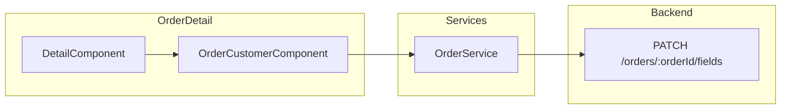
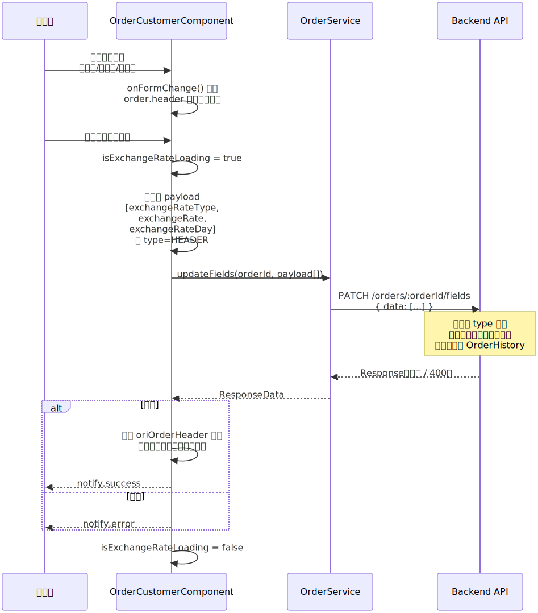
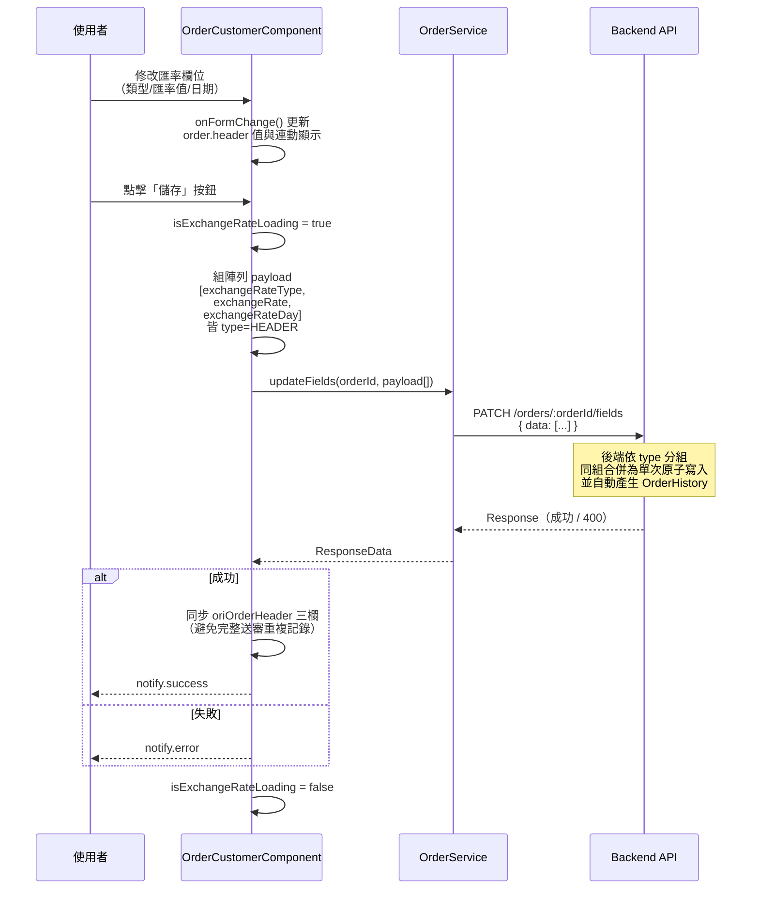
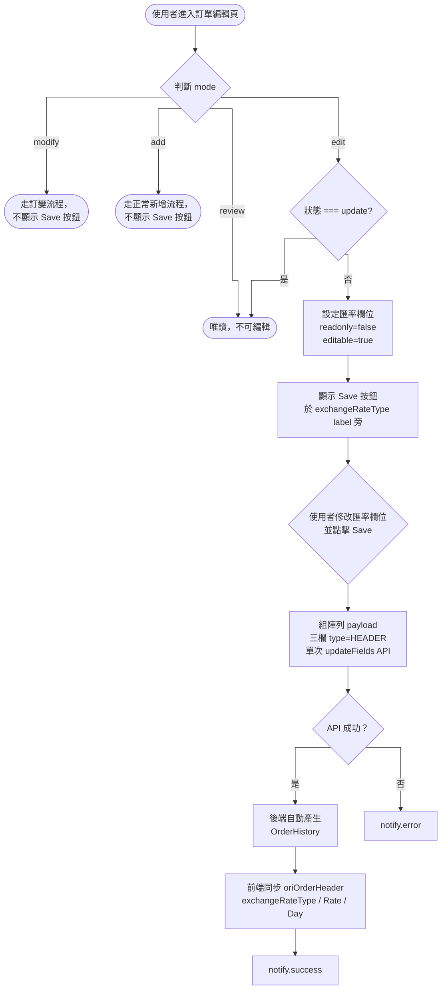

# CMP-4417 SD 允許直接修改訂單匯率（前端）

## 版本紀錄

| 版本 | 日期 | 修訂內容 | 修訂者 |
|------|------|--------|----------|
| 1.0 | 2026-05-25 | 初版 | Raelynn |

---

## 文件資訊

| 項目 | 內容 |
|------|------|
| 專案名稱 | 允許直接修改訂單匯率（無需透過訂變單）（前端） |
| Jira 單號 | CMP-4417 |
| 相關後端單號 | CMP-4429 |
| 參考實作單號 | CMP-4278（前端）、CMP-4279（後端） |
| 參考 Confluence SD | [4278_SD_418訂單：子單增加必填欄位「用途說明」](https://metaage-corp.atlassian.net/wiki/pages/viewpage.action?pageId=152567851) |
| 參考 Confluence SA | [CMP_SA_T100訂單](https://metaage-corp.atlassian.net/wiki/pages/viewpage.action?pageId=17924177) |

---

## 目錄

1. 需求描述
   * 1.1 功能背景
   * 1.2 目標
   * 1.3 參考實作
2. 匯率相關欄位說明
   * 2.1 欄位定義與位置
   * 2.2 欄位連動行為（現有邏輯）
   * 2.3 欄位在修訂紀錄中的追蹤
3. 實作架構設計
   * 3.1 組件關係圖
   * 3.2 序列圖
   * 3.3 系統流程圖
4. 後端 API 規格
   * 4.1 Request Body 格式
   * 4.2 OrderService.updateFields 簽章
   * 4.3 呼叫端使用對照
5. 實作
   * 5.1 修改檔案
     * 5.1.1 `order.service.ts`（共用）
     * 5.1.2 `order-customer.component.ts`
     * 5.1.3 `order-customer.component.html`
     * 5.1.4 `order-header.component.ts`
     * 5.1.5 `sub-order.component.ts`
     * 5.1.6 `data-tool.component.ts`（連帶修正 TranceNote 日期誤判 Bug）

---

## 1. 需求描述

### 1.1 功能背景

目前 CMP 系統在修改訂單匯率時，若訂單已進入特定狀態（如已同步 T100 或已出帳），必須建立「訂單變更單 (Order Change)」並經過審核流程方可變更。然而匯率微調頻繁且對整體流程影響較小，完整訂變流程導致作業效率低下。

### 1.2 目標

取消修改匯率時必須走「訂單變更單」的強制限制，允許具備授權之使用者直接在訂單編輯頁面修改匯率欄位（匯率類型、自訂匯率、台銀匯率指定日期），並透過共用 API `updateFields` 儲存。

### 1.3 參考實作

本功能同時參考兩個既有實作：

| 參考來源 | 用途 | 取用範圍 |
|---------|------|----------|
| CMP-4278「用途說明」（SA + SD 文件齊備） | 整體 inline save 設計思路、Save 按鈕顯示條件、`notify.success`/`notify.error` 處理慣例 | 概念層 |
| `OrderHeaderComponent` 的 `customerPoNumber` | label 內嵌 Save 按鈕的具體做法（`labelTemplateId` + `customTemplates`）、`updateFields()` 呼叫範式 | 實作層 |

> CMP-4278 的 purpose 欄位是用原生 HTML 寫在 `ma-form` 外，本案匯率欄位本來就在 `ma-form` 內，因此 **label/template 註冊** 的具體做法採用 `customerPoNumber` 模式。

核心實作共通點：

1. **即時 Save 按鈕**：僅在 `edit` 模式且 `status !== ApprovalStatus.update` 時顯示
2. **呼叫 `OrderService.updateFields()`**：泛用 API，以 `field` 參數區分更新的欄位
3. **成功後顯示 `notify.success`**

---

## 2. 匯率相關欄位說明

### 2.1 欄位定義與位置

| 欄位名稱 | internalVariableName | 所在元件 | Model 位置 |
|----------|---------------------|---------|-----------|
| 匯率類型 | `exchangeRateType` | `OrderCustomerComponent` | `OrderHeader.exchangeRateType` |
| 自訂匯率 | `exchangeRate` | `OrderCustomerComponent` | `OrderHeader.exchangeRate` |
| 台銀匯率指定日 | `exchangeRateDay` | `OrderCustomerComponent` | `OrderHeader.exchangeRateDay` |

### 2.2 欄位連動行為（現有邏輯）

| 欄位 | `BKTW`（台銀） | `CUSTOM`（自訂） |
|------|----------------|------------------|
| `exchangeRate` | 隱藏 | **顯示**，必填 |
| `exchangeRateDay` | **顯示**，必填 | 隱藏 |

本次不修改此邏輯。此連動邏輯由 `OrderCustomerComponent.onFormChange()` 的 `case 'exchangeRateType'` 分支處理切換時的顯示/隱藏與必填設定，`exchangeRateTypeInit()` 則在初始化時根據當前匯率類型設定子欄位狀態。

### 2.3 欄位在修訂紀錄中的追蹤

**修訂紀錄統一由後端處理**：`PATCH /orders/{orderId}/fields` 寫入成功後由後端自動產生對應的 OrderHistory，前端不需呼叫 `saveTranceNote()`。

前端仍需在 `updateExchangeRate()` API 成功後**同步更新 `oriOrderHeader` 中的三個匯率欄位值**，原因如下：

- `oriOrderHeader` 是前端在「完整送審流程」（`checkOrderHeader.isStart === true`）時比對 before/after 差異的基準值
- 若 inline save 後未同步，當使用者再走完整送審時，前端會將「inline save 之前的舊值」視為 before、後端會再多記一筆相同異動的 OrderHistory，造成重複記錄
- `data-tool.component.ts` 的 `saveTranceNote()` 邏輯（`exchangeRateType` 走 `Translate`、`exchangeRate` / `exchangeRateDay` 走 `comparison()`）僅在完整送審流程下觸發

---

## 3. 實作架構設計

### 3.1 組件關係圖





### 3.2 序列圖





### 3.3 系統流程圖





---

## 4. 後端 API 規格

> 後端 SD：[4429_SD_訂單直接修改匯率(後端)](https://metaage-corp.atlassian.net/wiki/spaces/CMP/pages/183074998)

### 4.1 Request Body 格式

`PATCH /orders/{orderId}/fields` 的 Request Body 為陣列，每個元素以 `type` 欄位宣告目標 collection。

**Header 欄位範例（匯率三欄）：**

```json
{
  "data": [
    { "type": "HEADER", "field": "exchangeRate",     "value": "31.5" },
    { "type": "HEADER", "field": "exchangeRateType", "value": "CUSTOM" },
    { "type": "HEADER", "field": "exchangeRateDay",  "value": "2026-05-25" }
  ]
}
```

**Body 欄位範例（子單欄位）：**

```json
{
  "data": [
    { "type": "BODY", "field": "purpose", "value": "測試用途", "orderDetailId": "abc123" }
  ]
}
```

**參數說明：**

| 參數 | 型別 | 必填 | 說明 |
|------|------|------|------|
| `type` | `'HEADER'` \| `'BODY'` | ✅ | 目標區塊：`HEADER` 更新 `orders`、`BODY` 更新 `orderDetails` |
| `field` | `string` | ✅ | 欄位名稱 |
| `value` | `string` | ✅ | 欄位新值（字串格式，後端依欄位型別轉換） |
| `orderDetailId` | `string` | `type=BODY` 時必填 | 子單 ID |

**參數行為（後端規則）：**

- 同 `type` 欄位合併為**單次原子 DB 更新**並生成一筆 OrderHistory；不同 `type` 混用 → 回傳 **400**
- `field=exchangeRate`：`value` 須為數值且 > 0，否則 400
- `field=exchangeRateType`：`value` 須為合法 `ExchangeRateType` enum，否則 400

**欄位支援對照：**

| 欄位 | type | Collection | 備註 |
|------|------|------------|------|
| `customerPoNumber` | `HEADER` | `orders` | — |
| `purpose` | `BODY` | `orderDetails` | 需傳 `orderDetailId` |
| `exchangeRate` | `HEADER` | `orders` | 須為數值且 > 0 |
| `exchangeRateType` | `HEADER` | `orders` | 須為合法 enum |
| `exchangeRateDay` | `HEADER` | `orders` | 字串 |

### 4.2 OrderService.updateFields 簽章

```typescript
updateFields(
  orderId: string,
  fields: { type: 'HEADER' | 'BODY'; field: string; value: string | number | null; orderDetailId?: string }[],
): Observable<ResponseData>
```

一次可送 N 個同 `type` 欄位，後端合併為單次原子寫入並產生一筆 OrderHistory。元素型別直接寫在簽章內，呼叫端以物件字面值傳入即可，無需 import 共用型別。

> `value` 採聯合型別保留原始 JS 型別：`exchangeRate` 等數值欄位送 `number`、文字欄位送 `string`、空值送 `null`，與整單儲存 (`putOrderHeader`) 不做型別轉換的行為一致，避免後端收到 `"32.5"` 之類的字串數字。

### 4.3 呼叫端使用對照

| 呼叫端 | 欄位 | payload |
|--------|------|-----------|
| `order-header.component.ts:437` | `customerPoNumber` | `[{ type: 'HEADER', field: 'customerPoNumber', value }]` |
| `sub-order.component.ts:778` | `purpose` | `[{ type: 'BODY', field: 'purpose', value, orderDetailId }]` |
| `order-customer.component.ts`（本案新增） | 匯率三欄 | `[{ type: 'HEADER', field: 'exchangeRate...', value }, ...]` 單次傳入 |

---

## 5. 實作

### 5.1 修改檔案

#### 5.1.1 `order.service.ts`（共用 Service）

**路徑：** `src/app/share/services/order.service.ts`

`updateFields()` 改為接收陣列；元素型別直接寫在簽章內，不另外拆 interface：

```typescript
/**
 * 通用欄位更新 API
 * @param orderId 訂單ID
 * @param fields  欲更新欄位陣列；同一次呼叫所有元素的 type 必須一致（HEADER → orders、BODY → orderDetails），否則後端回傳 400；type=BODY 時須帶 orderDetailId
 */
updateFields(
  orderId: string,
  fields: { type: 'HEADER' | 'BODY'; field: string; value: string | number | null; orderDetailId?: string }[],
): Observable<ResponseData> {
  return this.api.patch(
    this.gateway.order + `orders/${orderId}/fields`,
    new RequestData(fields)
  );
}
```

---

#### 5.1.2 `order-customer.component.ts`

**路徑：** `src/app/orders/detail/order-customer/order-customer.component.ts`

1. Component 設定 `OrderMode` / `ApprovalStatus` enum getter，供 HTML 範本內的條件判斷使用

```typescript
/** 模板用 enum getter */
get OrderMode() { return OrderMode; }
get ApprovalStatus() { return ApprovalStatus; }
```

2. 在 `exchangeRateType` 的 `FilterAttribute` 定義中新增 `labelTemplateId`，讓 Save 按鈕透過 `customTemplates` 嵌入 label 旁

```typescript
new FilterAttribute({
  name: this.translate.instant('exchange rate type'),
  internalVariableName: "exchangeRateType",
  type: FilterAttributeType.single,
  options: Object.values(ExchangeRateType).map((exchangeRateType) => new OptionAttribute({
    name: this.translate.instant(exchangeRateType as string),
    internalVariableName: exchangeRateType as ExchangeRateType,
  })),
  value: ExchangeRateType.customsEarlyOfMonth,
  labelTemplateId: 'exchangeRateTmp',  // ← CMP-4417 新增
  validator: this.attributeValidator,
  section: 3,
}),
```

3. `ui` 物件新增 `isExchangeRateLoading` 狀態，控制儲存按鈕的 loading 與 disabled 表現

```typescript
ui = {
  ...existing,
  isExchangeRateLoading: false, // 匯率儲存載入狀態
}
```

4. 在 `updateReadOnly()` 的一般模式分支末端加入「匯率欄位可編輯狀態」邏輯：edit 模式下，只要不在「訂單變更中」（`ApprovalStatus.update`），匯率三欄一律開放編輯

```typescript
// CMP-4417: 編輯模式下，除「訂單變更中」外可直接編輯匯率三欄
if (this.mode === OrderMode.edit) {
  const exchangeFields = ['exchangeRateType', 'exchangeRate', 'exchangeRateDay'];
  const canEditExchangeRate = this.orderStep.currentStatus !== ApprovalStatus.update;

  this.filterAttribute
    .filter(f => exchangeFields.includes(f.internalVariableName))
    .forEach(f => {
      f.readonly = !canEditExchangeRate;
      f.editable = canEditExchangeRate;
    });
}
```

> 設計理由：與 §5.1.3 的 Save 按鈕顯示判斷（`status !== ApprovalStatus.update`）對稱，避免「按鈕顯示卻欄位 readonly」之類的不一致；且未來若 `ApprovalStatus` enum 新增狀態，預設「除 `update` 外皆可編輯」更符合「訂變中才是特例」的業務語意。

5. 新增 `updateExchangeRate()` 方法：依當前匯率類型組陣列 payload，**單次呼叫** `updateFields` API。後端依 `type` 分組合併為單次原子 DB 寫入並**自動產生 OrderHistory**；前端僅需在成功後同步 `oriOrderHeader`，避免後續完整送審時對相同異動重複比對

**Payload 組成規則（與 §2.2 欄位顯示連動一致）：**

| `exchangeRateType` | 送出欄位 |
|---|---|
| `CUSTOM` | `exchangeRateType` + `exchangeRate` |
| `BKTW` | `exchangeRateType` + `exchangeRateDay` |
| 其他 | 只送 `exchangeRateType` |

未送出的欄位 DB 維持原值（不主動清空），與既有完整送審流程行為一致。

**前端驗證：** 進入 API 呼叫前先檢核 `exchangeRateType === CUSTOM` 時 `exchangeRate` 須為**大於 0 的有效數值**（`Number.isFinite` 且 `> 0`），不合法則顯示「匯率必須大於 0」notify 並中止流程，避免無謂呼叫並與後端規格 §4.1 一致。

```typescript
/**
 * CMP-4417 直接更新匯率欄位
 * 單次 API 呼叫，依當前匯率類型決定隨行送出的欄位：
 *   CUSTOM → 加送 exchangeRate
 *   BKTW   → 加送 exchangeRateDay
 *   其他   → 只送 exchangeRateType
 * 後端合併為一次原子更新並自動產生一筆 OrderHistory。
 */
updateExchangeRate(): void {
  if (this.ui.isExchangeRateLoading) { return; }

  const header = this.order.header;

  // CUSTOM 模式：匯率必須為大於 0 的有效數值
  if (header.exchangeRateType === ExchangeRateType.customs) {
    const rate = Number(header.exchangeRate);
    if (!Number.isFinite(rate) || rate <= 0) {
      this.notify.error(
        this.translate.instant('update failed'),
        this.translate.instant('exchange rate must be greater than zero'),
      );
      return;
    }
  }

  this.ui.isExchangeRateLoading = true;

  // 保留原始型別：exchangeRate 為 number、exchangeRateDay 為 string、空值送 null
  const payload: { type: 'HEADER' | 'BODY'; field: string; value: string | number | null }[] = [
    { type: 'HEADER', field: 'exchangeRateType', value: header.exchangeRateType ?? null },
  ];
  if (header.exchangeRateType === ExchangeRateType.customs) {
    payload.push({ type: 'HEADER', field: 'exchangeRate', value: header.exchangeRate ?? null });
  } else if (header.exchangeRateType === ExchangeRateType.bktw) {
    payload.push({ type: 'HEADER', field: 'exchangeRateDay', value: header.exchangeRateDay ?? null });
  }

  this.orderSvc.updateFields(header.id, payload).subscribe({
    next: (res) => {
      if (!res?.info?.success) {
        this.notify.error(this.translate.instant('update failed'), res?.info?.message || '');
      } else {
        // 同步 oriOrderHeader，只同步本次實際送出的欄位，避免完整送審時重複記錄
        this.oriOrderHeader.exchangeRateType = header.exchangeRateType;
        if (header.exchangeRateType === ExchangeRateType.customs) {
          this.oriOrderHeader.exchangeRate = header.exchangeRate;
        } else if (header.exchangeRateType === ExchangeRateType.bktw) {
          this.oriOrderHeader.exchangeRateDay = header.exchangeRateDay;
        }

        this.notify.success(this.translate.instant('update successfully'), '');
      }
      this.ui.isExchangeRateLoading = false;
    },
    error: (err) => {
      console.error('[update-exchangeRate]', err);
      this.notify.error(this.translate.instant('update failed'), err?.message || '');
      this.ui.isExchangeRateLoading = false;
    }
  });
}
```

> **畫面值更新說明**：與 `customerPoNumber` / CMP-4278 相同，API 成功後不需額外更新畫面值。原因：匯率欄位透過 `ma-form` 的 `onFormChange` 事件已將修改值寫入 `order.header`，畫面已顯示最新的 `filterAttribute.value`。

> **修訂紀錄處理**：修訂紀錄統一由後端 `updateFields` 寫入時自動產生，前端不呼叫 `saveTranceNote()`。`oriOrderHeader` 同步仍須保留，避免完整送審流程比對 before/after 時將相同異動再記一次。

---

#### 5.1.3 `order-customer.component.html`

**路徑：** `src/app/orders/detail/order-customer/order-customer.component.html`

1. `ma-form` 全域 `[readonly]` 綁定使用「`mode === review` 或 `status === update`」的明確判斷，避免 ma-form 全域 readonly 覆寫個別欄位的 `f.readonly=false` 設定

```html
<ma-form #customerForm
         [filterAttribute]="filterAttribute"
         [readonly]="mode === OrderMode.review || order.header.status === ApprovalStatus.update"
         ...>
```

> 若使用 `[readonly]="readOnly"`，`approval/fail/purchasing/progress/part/invalid` 6 個狀態下會被父層判定為 readonly，ma-form 元件層級的 readonly 會覆蓋個別欄位設定，導致匯率欄位開放失效。採此判斷後，非匯率欄位的 readonly 仍由 `updateReadOnly()` 既有 else 分支邏輯（`f.readonly = f.readonly !== undefined ? f.readonly : true`）正確處理。

2. `customTemplates` 中註冊 `exchangeRateTmp`

```html
<ma-form #customerForm
         [filterAttribute]="filterAttribute"
         [readonly]="mode === OrderMode.review || order.header.status === ApprovalStatus.update"
         [customTemplates]="{
          // ...
          'exchangeRateTmp': exchangeRateTmp
         }"></ma-form>
```

3. 新增 `#exchangeRateTmp` template：在 `exchangeRateType` label 旁嵌入即時 Save 按鈕；按鈕僅在 `mode === edit` 且 `status !== update` 時顯示

```html
<!-- CMP-4417 匯率類型 label（含即時 Save 按鈕） -->
<ng-template #exchangeRateTmp>
  <span>{{ 'exchange rate type' | translate }}：</span>
  @if (mode === OrderMode.edit && order.header.status !== ApprovalStatus.update) {
    <button nz-button nzType="primary" nzSize="small"
            [nzLoading]="ui.isExchangeRateLoading"
            [disabled]="ui.isExchangeRateLoading"
            (click)="updateExchangeRate()">
      {{ 'save' | translate | titlecase }}
    </button>
  }
</ng-template>
```

顯示條件對照：

| 條件 | Save 按鈕 |
|------|----------|
| `mode !== OrderMode.edit` | 不顯示 |
| `status === ApprovalStatus.update`（訂單變更中） | 不顯示 |
| `mode === OrderMode.edit` 且 `status !== update` | ✅ 顯示 |

---

#### 5.1.4 `order-header.component.ts`

**路徑：** `src/app/orders/detail/order-header/order-header.component.ts`

`customerPoNumber`（line 437 附近）的 `updateFields` 呼叫採陣列格式（`type: HEADER`）：

```typescript
this.orderSvc.updateFields(this.order.header.id, [
  { type: 'HEADER', field: 'customerPoNumber', value: this.order.header.customerPoNumber ?? '' }
]).subscribe({
  // ... 後續處理
});
```

---

#### 5.1.5 `sub-order.component.ts`

**路徑：** `src/app/orders/sub-order/sub-order.component.ts`

`purpose`（line 778 附近）的 `updateFields` 呼叫採陣列格式（`type: BODY`，須帶 `orderDetailId`）：

```typescript
this.orderSvc.updateFields(this.order.header.id, [
  { type: 'BODY', field: 'purpose', value: content ?? '', orderDetailId: this.subOrder.id }
]).subscribe({
  // ... 後續處理
});
```

> **後端契約提醒**：同一次 `updateFields()` 呼叫所傳入陣列的所有元素 `type` 必須一致，否則後端會回傳 400（DB 不會被異動）。目前三個呼叫端皆為單一 `type`，無混用風險；若日後需同時更新 `HEADER` + `BODY` 欄位，須拆為兩次呼叫。

---

#### 5.1.6 `data-tool.component.ts`（連帶修正既有 Bug）

**路徑：** `src/app/orders/model/data-tool.component.ts`

**問題：** `saveTranceNote()` 對 `exchangeRate` / `exchangeRateDay` 兩個欄位走 default 分支進入 `comparison()`，而 `comparison()` 又會把 oldData/newData 丟給 `formatDateIfValid()` 嘗試以 Luxon `DateTime.fromISO` 與 `new Date()` 解析為日期。實測結果：

| 欄位 | 型別 | 原值 | `formatDateIfValid` 後 |
|---|---|---|---|
| `exchangeRate` | number | `1` / `32.5` / `100` | 皆為 `1970-01-01`（被當 Unix epoch 毫秒）|
| `exchangeRateDay` | string | `'15'` | `0015-01-01`（被當 ISO 年份）|
| `exchangeRateDay` | string | `'01'` | `0001-01-01` |

→ 修訂紀錄會偵測到實際變動並建立 TranceNote，但顯示的 old/new 都是同一個錯誤日期，使用者看不出實際差異。

**修法：** 在 `saveTranceNote()` switch 內為 `exchangeRate` 與 `exchangeRateDay` 新增 case，跳過 `formatDateIfValid`、以原值（必要時 `String()` 包裝）寫入 TranceNote：

```typescript
// 自訂匯率 / 台銀匯率指定日：值為數值或 01~31 的日字串，
// formatDateIfValid 會誤判為 epoch/年份，直接以原值比對
case 'exchangeRate':
case 'exchangeRateDay': {
  const key = item.internalVariableName;
  const oldVal = oriData[key] ?? '';
  const newVal = newData[key] ?? '';
  if (oldVal !== newVal) {
    const tranceNote = new TranceNote;
    tranceNote.type = 'UPDATE';
    tranceNote.field = key;
    tranceNote.oldData = String(oldVal);
    tranceNote.newData = String(newVal);
    tranceNote.message = item.name;
    newData.tranceNote.push(tranceNote);
  }
  break;
}
```

**影響範圍：**
- **CMP-4417 直接修改匯率流程**：已避開（走 `updateFields` → 後端自動產生 OrderHistory，前端不呼叫 `saveTranceNote`），此處修正屬於後備。
- **完整送審流程**：原本對這兩個欄位的修訂紀錄顯示錯誤，修正後可正確記錄變動前後值。

> 其他純數值字串／number 型別的 `FilterAttribute` 欄位（例如 `quantity`、`total` 等）若進入 default 分支，理論上也會有同樣的誤判問題，但目前並未在 `OrderCustomerComponent` 的 `filterAttribute` 內，超出本案範圍。建議後續另開單，把 `formatDateIfValid` 的判斷條件改嚴格（要求字串含 `-` 或 `:` 且長度 ≥ 8）以從根源解決。

