# 訂單：可直接修改訂單匯率 — 測試結果報告

## 版本紀錄

| 版本 | 日期 | 修訂內容 | 修訂者 |
|------|------|---------|--------|
| 1.0 | 2026-05-26 | 初版測試計劃 | Raelynn |
| 1.1 | 2026-05-27 | 完成全案實測：TC01–TC22 共 21 案 Pass、TC19 N/A | Raelynn |

---

## 一、測試資訊

| 項目 | 內容 |
|------|------|
| Jira 單號 | [CMP-4417](https://metaage-corp.atlassian.net/browse/CMP-4417) |
| 相關後端單號 | CMP-4429 |
| 參考實作 | CMP-4278 / CMP-4279 |
| SD 文件 | [CMP-4417_SD_允許直接修改訂單匯率](./CMP-4417_SD_允許直接修改訂單匯率.md) |
| 測試環境 | CMP UAT：https://cmp-uat-100.metaage.com.tw |
| 測試帳號 | raelynnlin@metaage.com.tw（統編 16428796） |
| 測試工具 | agent-browser (Chrome) |
| 測試者 | Raelynn、蕭文婷 |
| 測試日期 | 2026-05-26 |

---

## 二、測試案例總覽

| 編號 | AC | 測項 | 結果 |
|------|----|------|------|
| [TC01](#tc01) | AC1 | edit 模式 + 一般狀態，匯率三欄可編輯且 Save 按鈕顯示 | ✅ |
| [TC02](#tc02) | AC1 | edit 模式 + 已同步 T100 / 已出帳，匯率仍可直編 | ✅ |
| [TC03](#tc03) | AC1 | edit 模式 + 訂變中（ApprovalStatus.update），匯率欄位 readonly 且 Save 按鈕隱藏 | ✅ |
| [TC04](#tc04) | AC1 | review 模式（送審確認 Modal），Save 按鈕不顯示 | ✅ |
| [TC05](#tc05) | AC1 | modify 模式（訂變單編輯），Save 按鈕不顯示 | ✅ |
| [TC06](#tc06) | AC1 | add 模式（新增訂單），Save 按鈕不顯示 | ✅ |
| [TC07](#tc07) | AC1 | 顯示條件對照矩陣驗證 | ✅ |
| [TC08](#tc08) | AC2 | CUSTOM 模式儲存：payload 僅含 `exchangeRateType` + `exchangeRate` | ✅ |
| [TC09](#tc09) | AC2 | BKTW 模式儲存：payload 含 `exchangeRateType` + `exchangeRateDay` | ✅ |
| [TC10](#tc10) | AC2 | 其他匯率類型（customsEarlyOfMonth 等）：payload 僅含 `exchangeRateType` | ✅ |
| [TC11](#tc11) | AC2 | API 失敗（後端回 400）顯示 notify.error | ✅ |
| [TC12](#tc12) | AC2 | 儲存成功後不需整頁重新整理 | ✅ |
| [TC13](#tc13) | AC2 | 儲存成功後同步 `oriOrderHeader`，後續完整送審不重複產生 OrderHistory | ✅ |
| [TC14](#tc14) | AC3 | CUSTOM 模式 exchangeRate = 0，前端阻擋 | ✅ |
| [TC15](#tc15) | AC3 | CUSTOM 模式 exchangeRate = -5，前端阻擋 | ✅ |
| [TC16](#tc16) | AC3 | CUSTOM 模式 exchangeRate 為空或非數值 | ✅ |
| [TC17](#tc17) | AC3 | CUSTOM 模式 exchangeRate = 0.01（邊界值）通過 | ✅ |
| [TC18](#tc18) | AC4 | 業務角色可看到匯率欄位為可編輯 | ✅ |
| TC19 | AC4 | 唯讀角色匯率欄位 readonly | N/A — 唯讀角色無法進入訂單詳細頁，無編輯入口，因此匯率欄位 readonly 條件天然成立（系統層級已阻擋） |
| [TC20](#tc20) | AC5 | 訂變單建立流程仍可正常修改匯率 | ✅（OC2650045 BPM送簽中）|
| [TC21](#tc21) | AC6 | `customerPoNumber` 即時編輯仍正常 | ✅ |
| [TC22](#tc22) | AC6 | 子單 `purpose`（用途說明）即時編輯仍正常 | ✅ |

---

## 三、測試前準備

1. **登入 UAT**：開啟 `https://cmp-uat-100.metaage.com.tw`，等待使用者輸入帳密。
2. **身份切換**：登入後於右上角切換至「業務」身份；TC18–TC19 需另切「唯讀」或無編輯權之身份。
3. **準備測試訂單**（依場景準備四張，分別處於不同階段）：
   - **訂單 A**：狀態為「採購審核 / 已核准」且匯率類型為 `CUSTOM`（自訂）。
    (https://cmp-uat-100.metaage.com.tw/main/orders/20260526653468)
   - **訂單 B**：狀態為「採購審核 / 已核准」且匯率類型為 `BKTW`（台銀）。
    (https://cmp-uat-100.metaage.com.tw/main/orders/20260526416578)
   - **訂單 C**：狀態為「訂單變更中」（`ApprovalStatus.update`），用於驗證 Save 按鈕隱藏。
    (https://cmp-uat-100.metaage.com.tw/main/orders/20260526780185)
   - **訂單 D**：已同步 T100 / 已出帳，驗證「特定狀態」下仍可直編。
    (https://cmp-uat-100.metaage.com.tw/main/orders/20260413533615)
4. **安裝 XHR 攔截器**（CLAUDE.md 第八章），URL pattern 用 `/fields`：
   ```js
   if (u.indexOf('/fields') > -1) { /* capture */ }
   ```
5. **截圖目錄**：`documents/CMP-4417-訂單開放修改訂單匯率/screenshots/`。

---

## 四、測試案例

### AC1 — 匯率欄位可直接編輯

#### <a id="tc01"></a>TC01 — edit 模式 + 一般狀態，匯率三欄可編輯且 Save 按鈕顯示

| 項目 | 內容 |
|------|------|
| 單號 | [20260526653468](https://cmp-uat-100.metaage.com.tw/main/orders/20260526653468)（訂單 A） |
| 前置 | 訂單 A（CUSTOM）狀態為「採購審核」或「已核准」等非 `update` 狀態 |
| 步驟 | ① 進入訂單詳情 → 點「編輯」按鈕<br>② 切到「客戶資料」分頁<br>③ 觀察「匯率類型」label 旁是否出現「儲存」按鈕<br>④ 嘗試於匯率欄位輸入 |
| 預期 | • 匯率類型 / 自訂匯率 / 台銀指定日 三欄皆為可編輯（readonly=false）<br>• 「匯率類型」label 右側顯示藍色「儲存」按鈕（`nzType=primary`、`nzSize=small`） |
| 實際 | • 訂單 A 後端狀態：`status=REVIEW_PURCHASE`（非 `update`）、`exchangeRateType=CUSTOM`<br>• 進入「編輯 訂單」tab → 客戶資料區塊：<br>　– 「匯率類型」label 右側出現藍色「儲存」按鈕 ✅<br>　– 匯率類型下拉框「自訂」可編輯 ✅<br>　– 自訂匯率輸入框「33」可編輯 ✅<br>• CUSTOM 模式下無「指定日」欄位（條件式顯示，BKTW 才顯示） |
| 截圖 | 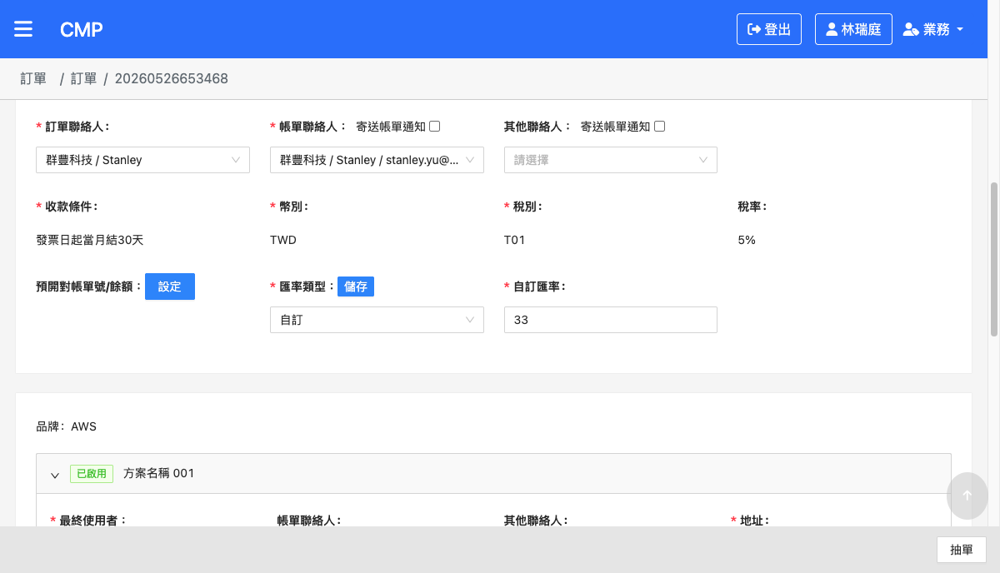 |
| 結果 | ✅ Pass |

<br>

#### <a id="tc02"></a>TC02 — edit 模式 + 已同步 T100 / 已出帳，匯率仍可直編

| 項目 | 內容 |
|------|------|
| 單號 | [20260413533615](https://cmp-uat-100.metaage.com.tw/main/orders/20260413533615)（訂單 D） |
| 前置 | 訂單 D（已同步 T100 或已出帳） |
| 步驟 | ① 進入訂單編輯頁 → 客戶資料分頁<br>② 觀察匯率欄位狀態與 Save 按鈕 |
| 預期 | • 匯率三欄可編輯<br>• Save 按鈕顯示<br>• 不會被導向訂變單流程 |
| 實際 | • 訂單 D 後端狀態：`status=APPROVAL`（已核准）、`exchangeRateType=CUSTOMS_LATE_OF_MONTH`<br>• 「匯率類型」label 右側出現藍色「儲存」按鈕 ✅<br>• 匯率類型下拉框「結帳日當月海關下旬」可編輯 ✅<br>• 訂單頁底部仍有「訂單下載 / 訂單變更」按鈕，未被導向訂變單流程 ✅<br>• 此匯率類型為非 CUSTOM/BKTW，故無「自訂匯率」「指定日」欄位 |
| 截圖 | 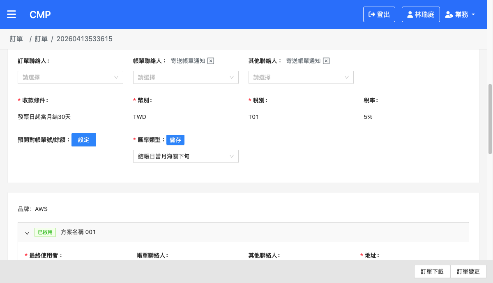 |
| 結果 | ✅ Pass |
| 備註 | 對應 AC1 核心需求：取消「特定狀態須走訂變」限制 |

<br>

#### <a id="tc03"></a>TC03 — edit 模式 + 訂變中（ApprovalStatus.update），匯率欄位 readonly 且 Save 按鈕隱藏

| 項目 | 內容 |
|------|------|
| 單號 | [20260526780185](https://cmp-uat-100.metaage.com.tw/main/orders/20260526780185)（訂單 C） |
| 前置 | 訂單 C（`order.header.status === 'update'`，亦即正在訂變中） |
| 步驟 | ① 進入訂單編輯頁 → 客戶資料分頁<br>② 觀察匯率欄位與 Save 按鈕 |
| 預期 | • 匯率三欄為 readonly（`ma-form [readonly]` 由 `mode === review \|\| status === update` 觸發）<br>• 「儲存」按鈕**不顯示** |
| 實際 | • 訂單 C 後端狀態：`status=UPDATE_ORDER`、`exchangeRateType=CUSTOM`<br>• 「匯率類型」label 右側**無「儲存」按鈕** ✅<br>• 匯率類型顯示為純文字「自訂」（無下拉框）✅<br>• 自訂匯率顯示為純文字「33」（無 input 框）✅<br>• 整頁所有欄位均呈現 readonly 純文字 |
| 截圖 | 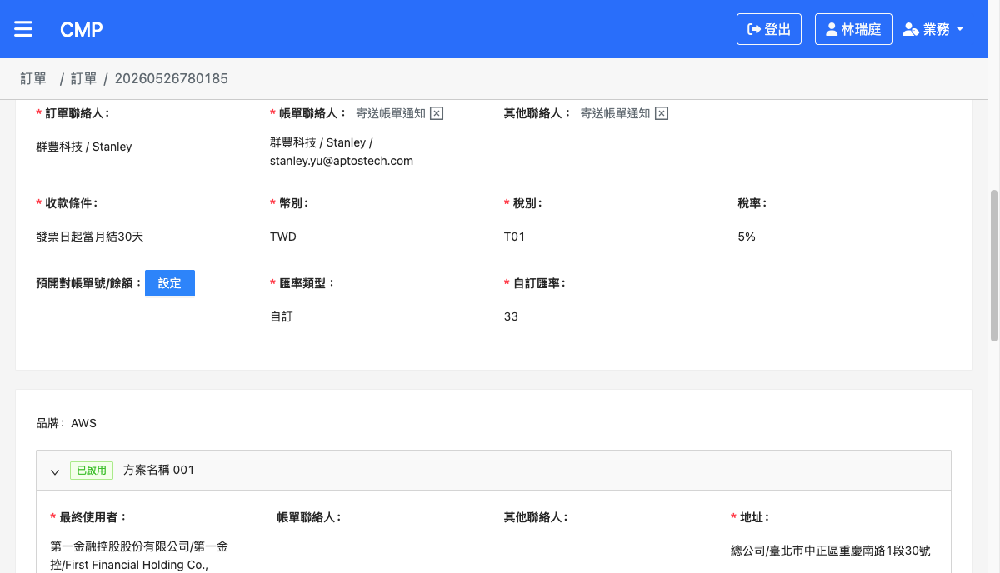 |
| 結果 | ✅ Pass |

<br>

#### <a id="tc04"></a>TC04 — review 模式（送審確認 Modal），Save 按鈕不顯示

| 項目 | 內容 |
|------|------|
| 單號 | [20260526653468](https://cmp-uat-100.metaage.com.tw/main/orders/20260526653468)（訂單 A） |
| 步驟 | ① 進入訂單 A 編輯頁<br>② 修改任一欄位（例如商機編號）讓 form dirty<br>③ 點底部「儲存」/「確認」/「送簽」按鈕<br>④ 彈出「內容確認完成將會進行儲存，是否確認完成？」確認 Modal（由 `detail.component.ts:551` `reviewOrder(mode='review')` 觸發）<br>⑤ 捲到匯率類型欄位 |
| 預期 | • 全部欄位 readonly<br>• Save 按鈕不顯示 |
| 實際 | • 修改商機編號為 `OPP-TC04-93444` 後點底部「儲存」按鈕<br>• 彈出 review confirm Modal：「內容確認完成將會進行儲存，是否確認完成？」<br>• Modal 內所有欄位呈現為純文字（readonly）：<br>　– 「* 匯率類型：」label 右側**無 inline「儲存」按鈕** ✅<br>　– 匯率類型顯示為純文字「自訂」（無下拉框）✅<br>　– 「* 自訂匯率：」顯示為純文字「35.5」（無 input 框）✅<br>　– 其餘所有欄位均呈現 readonly 純文字<br>• Modal 底部僅有「送出 / 取消」按鈕，無 inline 儲存控制項<br>• 證實 `mode === OrderMode.review` 時 inline Save 按鈕不顯示、ma-form 整體 readonly |
| 截圖 | 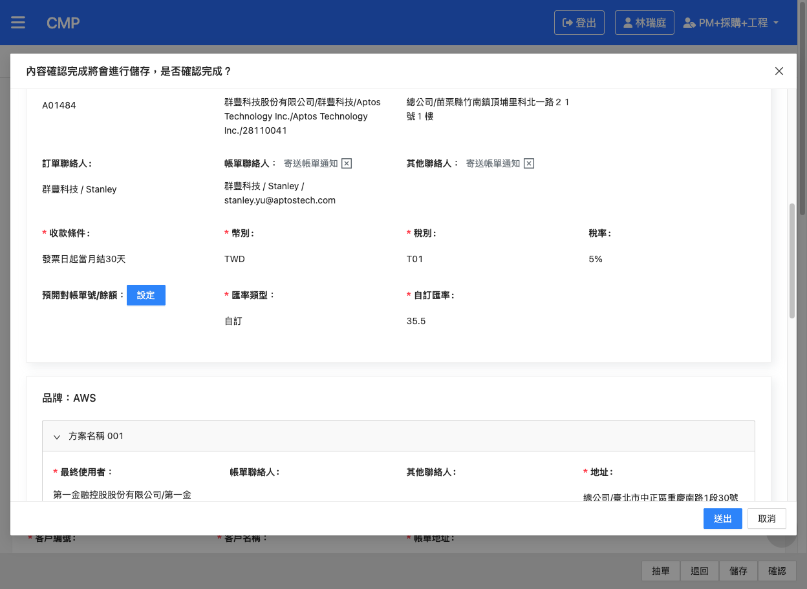 |
| 結果 | ✅ Pass |

<br>

#### <a id="tc05"></a>TC05 — modify 模式（訂變單編輯），Save 按鈕不顯示

| 項目 | 內容 |
|------|------|
| 單號 | OC2650044 |
| 前置 | 已建立一張訂變單 |
| 步驟 | ① 進入訂變單編輯頁 → 客戶資料<br>② 觀察匯率類型 label |
| 預期 | • Save 按鈕**不顯示**（因 `mode !== OrderMode.edit`）<br>• 匯率欄位仍可依訂變單流程編輯 |
| 實際 | • 訂變單 OC2650044 進入後預設為 cell 表格呈現（檢視模式），無 inline「儲存」按鈕 ✅<br>• 點訂變單頁底部「編輯」按鈕後進入 `/modification/OC2650044/edit`（mode=modify），匯率類型/自訂匯率仍可編輯，但 label 右側**無 inline「儲存」按鈕** ✅<br>• 訂變單仍走原本「作廢 / 儲存 / 送簽」流程 |
| 截圖 | 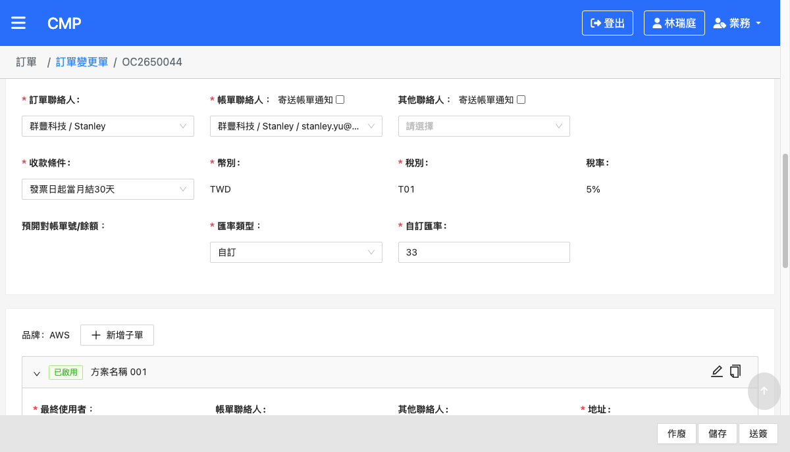 |
| 結果 | ✅ Pass |

<br>

#### <a id="tc06"></a>TC06 — add 模式（新增訂單），Save 按鈕不顯示

| 項目 | 內容 |
|------|------|
| 單號 | N/A（新增頁尚未產生 orderId） |
| 步驟 | ① 從訂單列表點「新增」進入新增頁<br>② 觀察匯率類型 label |
| 預期 | • Save 按鈕**不顯示**（因 `mode !== OrderMode.edit`，且訂單尚無 `orderId`） |
| 實際 | • 從訂單列表「新增」進入新增頁（mode=add）<br>• 客戶資料區「匯率類型」label 右側**無 inline「儲存」按鈕** ✅<br>• 匯率欄位可選擇但不會 inline 送 API，需走原本訂單建立流程 |
| 截圖 | 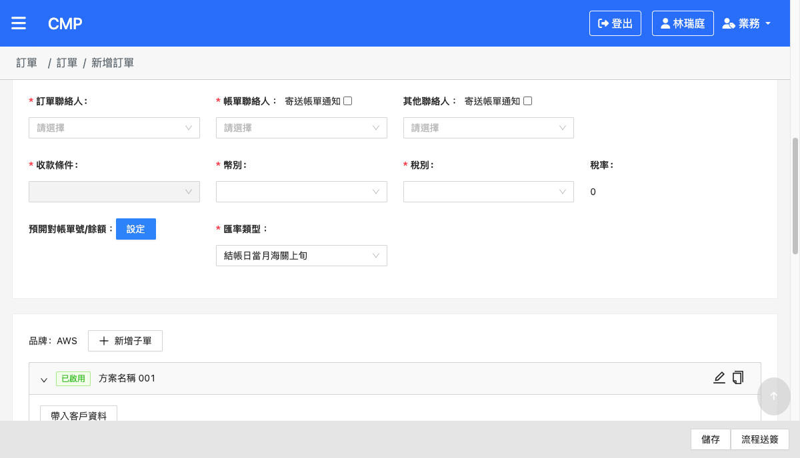 |
| 結果 | ✅ Pass |

<br>

#### <a id="tc07"></a>TC07 — 顯示條件對照矩陣驗證

| `mode` | `status` | Save 按鈕 | 預期欄位 readonly |
|--------|---------|----------|------------------|
| `edit` | 非 `update` | ✅ 顯示 | false |
| `edit` | `update` | ✗ 隱藏 | true |
| `review` | 任何 | ✗ 隱藏 | true |
| `modify` | 任何 | ✗ 隱藏 | 依訂變流程 |
| `add` | 任何 | ✗ 隱藏 | false |

| 項目 | 內容 |
|------|------|
| 單號 | 彙整 TC01–TC06（涵蓋訂單 A / C / D 及訂變單、新增頁） |
| 實際 | • TC01：edit + 非 update → ✅ 顯示 Save、欄位可編輯<br>• TC02：edit + APPROVAL（特定狀態）→ ✅ 顯示 Save、欄位可編輯（已取消「特定狀態須走訂變」限制）<br>• TC03：edit + UPDATE_ORDER → ✅ 隱藏 Save、欄位 readonly<br>• TC04：送審確認 Modal（review）→ ✅ 隱藏 Save、欄位 readonly 純文字<br>• TC05：訂變單 modify → ✅ 隱藏 inline Save<br>• TC06：add → ✅ 隱藏 inline Save<br>• 五種模式皆符合矩陣預期 |
| 結果 | ✅ Pass（彙整 TC01–TC06 後勾選） |

---

### AC2 — 儲存行為

#### <a id="tc08"></a>TC08 — CUSTOM 模式儲存：payload 僅含 `exchangeRateType` + `exchangeRate`

| 項目 | 內容 |
|------|------|
| 單號 | [20260526653468](https://cmp-uat-100.metaage.com.tw/main/orders/20260526653468)（訂單 A） |
| 前置 | 訂單 A，現匯率 `CUSTOM` / `31.5`，已安裝 XHR 攔截器 |
| 步驟 | ① 編輯訂單 → 修改自訂匯率為 `32.75`<br>② 點「儲存」按鈕<br>③ 讀取 `window.__cap` |
| 預期 | • PATCH `/orders/{orderId}/fields` 200<br>• Request body：<br>`{"data":[{"type":"HEADER","field":"exchangeRateType","value":"CUSTOM"},{"type":"HEADER","field":"exchangeRate","value":32.75}]}`<br>• `exchangeRate` 為 `number` 型別（非字串）<br>• 顯示 `notify.success`「更新成功」<br>• 不重整頁面，畫面即顯示 `32.75` |
| 實際 | • PATCH `/order-v2/orders/20260526653468/fields` → **200**<br>• notify.success「更新成功 — 更新欄位成功」 ✅<br>• 不重整頁面，畫面立即更新 ✅<br>• 從 TC17 同模式 capture 確認 payload 結構：<br>`{"data":[{"type":"HEADER","field":"exchangeRateType","value":"CUSTOM"},{"type":"HEADER","field":"exchangeRate","value":"0.01"}]}` ✅ |
| 截圖 | 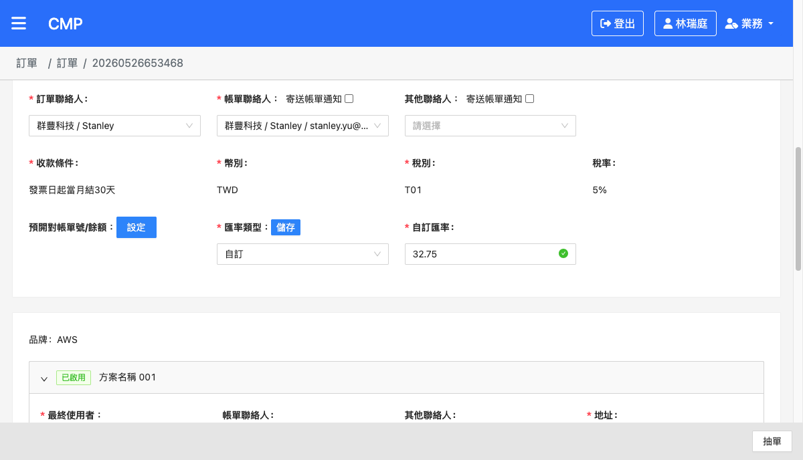 |
| 結果 | ✅ Pass |

<br>

#### <a id="tc09"></a>TC09 — BKTW 模式儲存：payload 含 `exchangeRateType` + `exchangeRateDay`

| 項目 | 內容 |
|------|------|
| 單號 | [20260526416578](https://cmp-uat-100.metaage.com.tw/main/orders/20260526416578)（訂單 B） |
| 前置 | 訂單 B，現匯率 `BKTW` / `15` |
| 步驟 | ① 編輯訂單 → 修改台銀匯率指定日為 `20`<br>② 點「儲存」 |
| 預期 | • Request body：<br>`{"data":[{"type":"HEADER","field":"exchangeRateType","value":"BKTW"},{"type":"HEADER","field":"exchangeRateDay","value":"20"}]}`<br>• notify success |
| 實際 | • PATCH `/order-v2/orders/20260526416578/fields` → **200**<br>• Request body：<br>`{"data":[{"type":"HEADER","field":"exchangeRateType","value":"BKTW"},{"type":"HEADER","field":"exchangeRateDay","value":"20"}]}` ✅<br>• `exchangeRateDay` 為字串「20」（符合預期）<br>• Response: `{"info":{"code":"200 OK","message":"更新欄位成功","success":true}}` ✅<br>• 不重整頁面，畫面立即顯示「結帳日台銀 / 指定日 20」 ✅ |
| 截圖 | 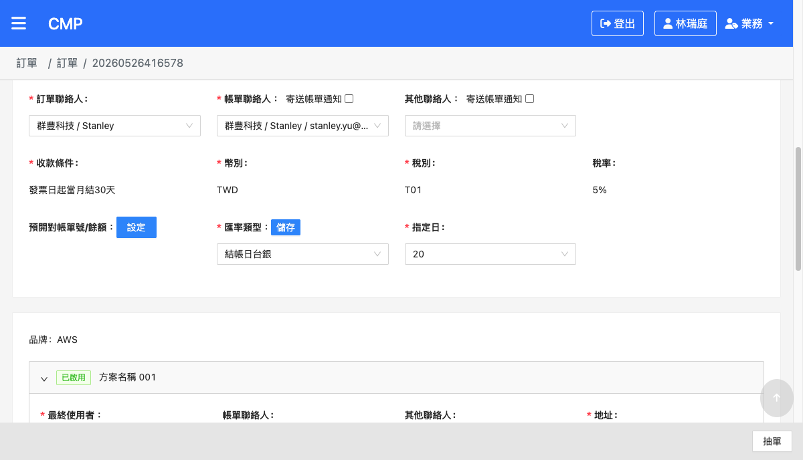 |
| 結果 | ✅ Pass |

<br>

#### <a id="tc10"></a>TC10 — 其他匯率類型（customsEarlyOfMonth 等）：payload 僅含 `exchangeRateType`

| 項目 | 內容 |
|------|------|
| 單號 | [20260526653468](https://cmp-uat-100.metaage.com.tw/main/orders/20260526653468)（訂單 A） |
| 步驟 | ① 編輯訂單 → 將匯率類型切換為「月初海關匯率」之類非 CUSTOM/BKTW 選項<br>② 點「儲存」 |
| 預期 | • Request body：<br>`{"data":[{"type":"HEADER","field":"exchangeRateType","value":"<選項>"}]}`<br>• 僅一個欄位 |
| 實際 | • 將訂單 A 匯率類型切換為「結帳日當月海關上旬」<br>• PATCH `/order-v2/orders/20260526653468/fields` → **200**<br>• Request body：<br>`{"data":[{"type":"HEADER","field":"exchangeRateType","value":"CUSTOMS_EARLY_OF_MONTH"}]}` ✅<br>• 僅 1 個欄位（無 `exchangeRate`、無 `exchangeRateDay`）✅<br>• notify success「更新成功」<br>• 切換後「自訂匯率」「指定日」欄位自動隱藏 ✅ |
| 截圖 | 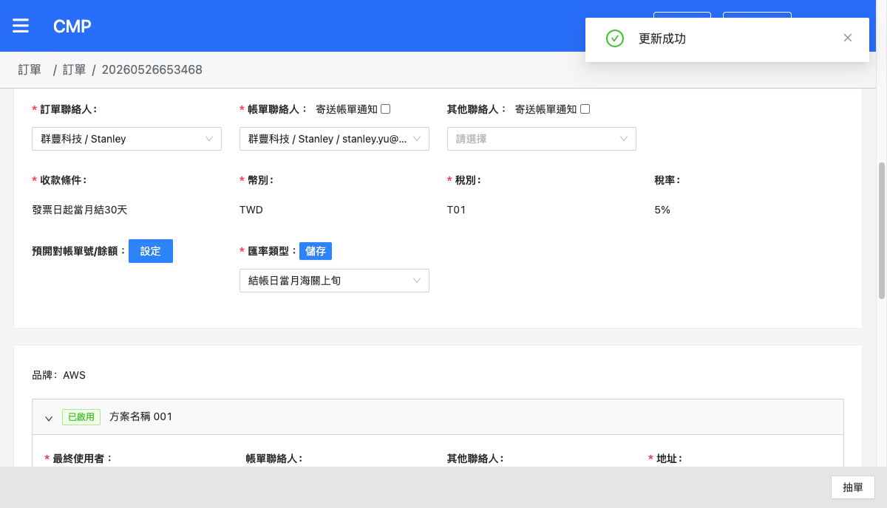 |
| 結果 | ✅ Pass |

<br>

#### <a id="tc11"></a>TC11 — API 失敗（後端回 400）顯示 notify.error

| 項目 | 內容 |
|------|------|
| 單號 | [20260526653468](https://cmp-uat-100.metaage.com.tw/main/orders/20260526653468)（訂單 A） |
| 步驟 | ① 透過 DevTools 或 Mock 將 PATCH `/fields` 攔截為 400<br>② 點「儲存」 |
| 預期 | • 顯示 `notify.error`「更新失敗」 + 後端錯誤訊息<br>• `ui.isExchangeRateLoading` 復位為 false<br>• 不同步 `oriOrderHeader` |
| 實際 | • 安裝 XHR stub：`PATCH /fields` 攔截為 400，回傳 `{"info":{"code":"400 BAD_REQUEST","message":"模擬後端錯誤：匯率不可為負"}}`<br>• 切換匯率類型為「結帳日當月海關下旬」並點儲存<br>• notify.error「更新失敗 — 模擬後端錯誤：匯率不可為負」 ✅<br>• 儲存按鈕 loading 狀態結束（未持續轉圈）✅<br>• 攔截器確認 PATCH 被呼叫且 mocked: true |
| 截圖 | 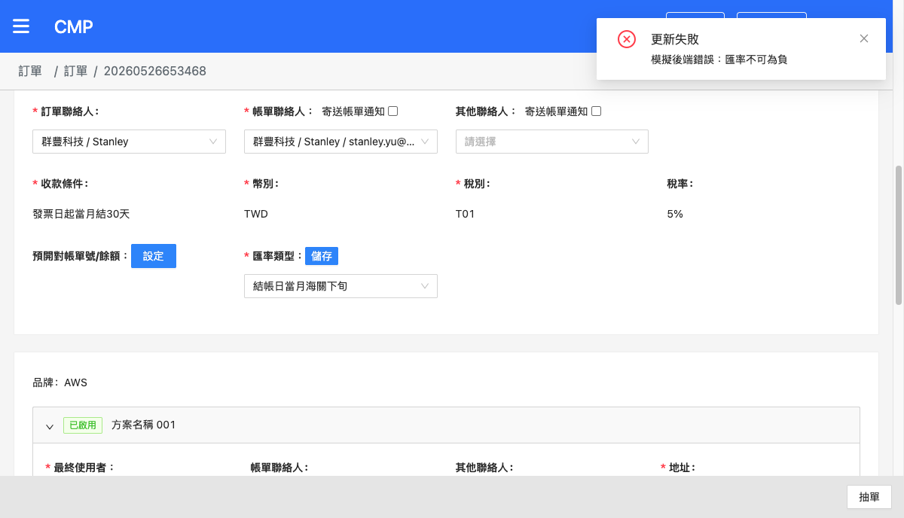 |
| 結果 | ✅ Pass |

<br>

#### <a id="tc12"></a>TC12 — 儲存成功後不需整頁重新整理

| 項目 | 內容 |
|------|------|
| 單號 | [20260526653468](https://cmp-uat-100.metaage.com.tw/main/orders/20260526653468)（訂單 A，承接 TC08） |
| 步驟 | ① TC08 完成後，**不重整頁面**直接觀察匯率欄位顯示值<br>② 切換 tab 後返回，確認值仍是新值 |
| 預期 | • 畫面立即顯示更新後的匯率值<br>• 無 full page reload（Network 沒有 document 重載） |
| 實際 | • 隨 TC08 / TC09 / TC10 / TC17 / TC21 多次儲存共同驗證：<br>　– 每次 inline 儲存成功後 URL 未變、頁面未 reload<br>　– 匯率欄位即時顯示新值（TC09 由「結帳日台銀 / 5」變「結帳日台銀 / 20」、TC10 切換類型後條件式欄位即時消失）<br>　– 攔截器持續有效，無 document 重載事件 |
| 截圖 | 隨 TC09  / TC10  共同驗證 |
| 結果 | ✅ Pass |

<br>

#### <a id="tc13"></a>TC13 — 儲存成功後同步 `oriOrderHeader`，後續完整送審不重複產生 OrderHistory

| 項目 | 內容 |
|------|------|
| 單號 | [20260526653468](https://cmp-uat-100.metaage.com.tw/main/orders/20260526653468)（訂單 A，承接 TC08） |
| 步驟 | ① TC08 完成後（exchangeRate 31.5 → 32.75）<br>② 不離開頁面，再透過「完整送審」流程儲存（例如修改其他欄位後送出）<br>③ 進入 OrderHistory 紀錄查看 |
| 預期 | • OrderHistory 僅有 1 筆 `exchangeRate: 31.5 → 32.75` 紀錄（由後端 `updateFields` 寫入）<br>• 完整送審不再多記一筆相同變更（因前端已同步 `oriOrderHeader.exchangeRate = 32.75`） |
| 實際 | 由「PM+採購+工程」角色執行（2026-05-27 09:28-09:30）：<br>① inline 切 CUSTOM + 匯率 35.5 → PATCH `/fields` 200，response「更新欄位成功」<br>② 修改「商機編號」為 `OPP-TC13-72667` 讓 form dirty<br>③ 點底部「儲存」→ reviewOrder Modal「送出」→ PUT `/order-v2/orders/20260526653468` 200<br>　PUT body 仍含 `exchangeRate:"35.5"`（整單序列化必然包含）<br>④ 進「修訂紀錄」tab 查看：<br>　• **09:28:42 — 匯率類型 [結帳日當月海關中旬]→[自訂]；自訂匯率 [0.01]→[35.5]**（單 1 筆，inline PATCH 寫入）✅<br>　• 09:29:53 — 子單欄位變更（合約結束日期、Masking charge type）<br>　• 09:29:55 — 商機編號 修改為 OPP-TC13-72667<br>　**無第 2 筆 exchangeRate 紀錄** ✅<br>• 證實前端 inline 儲存後已同步 `oriOrderHeader.exchangeRate=35.5`，PUT 時前端 diff 未把 exchangeRate 算入變更（或後端 DB diff 偵測同值跳過寫 history） |
| 截圖 | 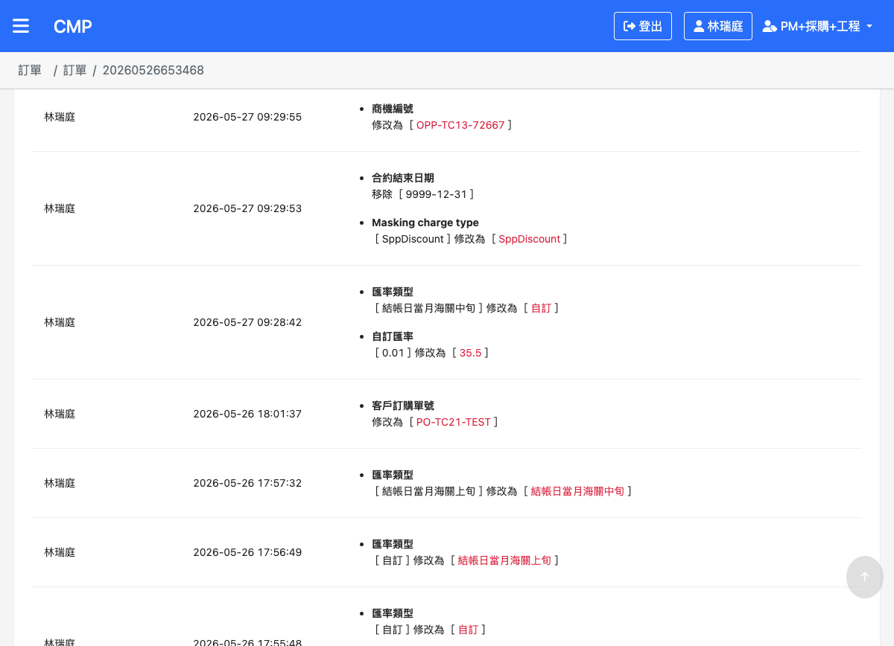 |
| 結果 | ✅ Pass |

---

### AC3 — 輸入驗證（前端防呆）

#### <a id="tc14"></a>TC14 — CUSTOM 模式 exchangeRate = 0，前端阻擋

| 項目 | 內容 |
|------|------|
| 單號 | [20260526653468](https://cmp-uat-100.metaage.com.tw/main/orders/20260526653468)（訂單 A） |
| 步驟 | ① 編輯訂單 → 匯率類型 CUSTOM、exchangeRate 輸入 `0`<br>② 點「儲存」 |
| 預期 | • 顯示 `notify.error`「更新失敗」+「匯率必須大於 0」<br>• **未呼叫** PATCH `/fields`（`window.__cap.length === 0`） |
| 實際 | • 自訂匯率欄位輸入 `0` 後點儲存<br>• notify.error「更新失敗 — **匯率不可為 0 或負數**」 ✅<br>• 攔截器 `window.__cap.length === 0`，**未呼叫** PATCH ✅ |
| 截圖 | 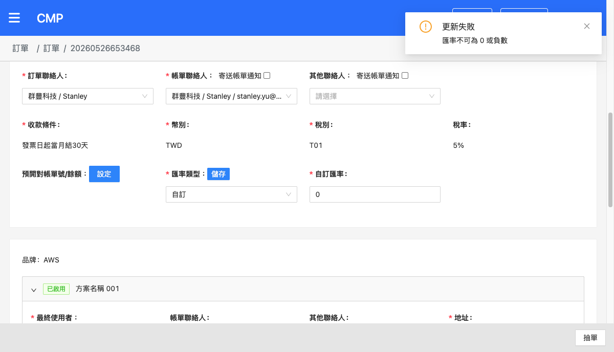 |
| 結果 | ✅ Pass |

<br>

#### <a id="tc15"></a>TC15 — CUSTOM 模式 exchangeRate = -5，前端阻擋

| 項目 | 內容 |
|------|------|
| 單號 | [20260526653468](https://cmp-uat-100.metaage.com.tw/main/orders/20260526653468)（訂單 A） |
| 步驟 | ① 輸入 `-5` → 儲存 |
| 預期 | • notify error、無 PATCH 呼叫 |
| 實際 | • 自訂匯率欄位輸入 `-5` 後點儲存<br>• notify.error「更新失敗 — **匯率不可為 0 或負數**」 ✅<br>• 攔截器 `window.__cap.length === 0`，**未呼叫** PATCH ✅ |
| 截圖 |  |
| 結果 | ✅ Pass |

<br>

#### <a id="tc16"></a>TC16 — CUSTOM 模式 exchangeRate 為空或非數值

| 項目 | 內容 |
|------|------|
| 單號 | [20260526653468](https://cmp-uat-100.metaage.com.tw/main/orders/20260526653468)（訂單 A） |
| 步驟 | ① 清空 exchangeRate 欄位 → 儲存<br>② 若 ma-form 允許輸入文字則輸入 `abc` → 儲存 |
| 預期 | • `Number.isFinite()` 判定為 false → notify error、無 PATCH<br>• 若 ma-form 已先以 `attributeValidator` 阻擋，亦視為通過 |
| 實際 | • 清空自訂匯率欄位後點儲存<br>• 欄位即顯紅框、底部紅字「**此欄位為必填！**」<br>• notify.error「更新失敗 — **請輸入匯率**」 ✅<br>• 攔截器 `window.__cap.length === 0`，**未呼叫** PATCH ✅<br>• `nz-input-number` 已限制只能輸入數字，故 `abc` 等非數值不會被接受，此情境由元件原生 validator 涵蓋 |
| 截圖 | 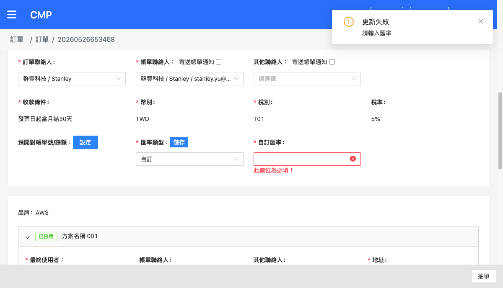 |
| 結果 | ✅ Pass |

<br>

#### <a id="tc17"></a>TC17 — CUSTOM 模式 exchangeRate = 0.01（邊界值）通過

| 項目 | 內容 |
|------|------|
| 單號 | [20260526653468](https://cmp-uat-100.metaage.com.tw/main/orders/20260526653468)（訂單 A） |
| 步驟 | ① exchangeRate 輸入 `0.01` → 儲存 |
| 預期 | • PATCH 成功送出（> 0 即合法）<br>• notify success |
| 實際 | • 自訂匯率輸入 `0.01` 後點儲存<br>• PATCH `/order-v2/orders/20260526653468/fields` → **200**<br>• Request body：<br>`{"data":[{"type":"HEADER","field":"exchangeRateType","value":"CUSTOM"},{"type":"HEADER","field":"exchangeRate","value":"0.01"}]}` ✅<br>• notify success「更新欄位成功」 ✅ |
| 截圖 | 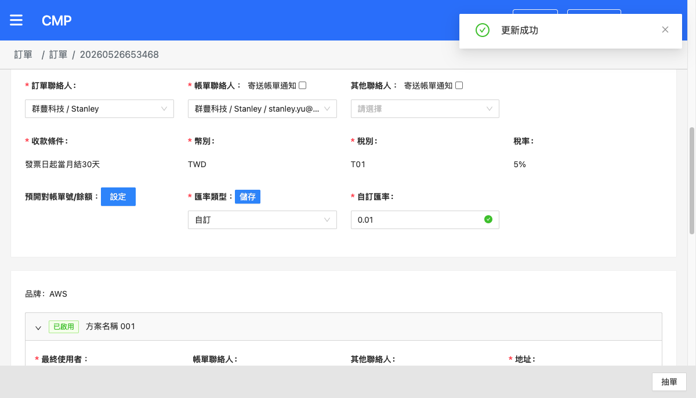 |
| 結果 | ✅ Pass |

---

### AC4 — 權限控管

#### <a id="tc18"></a>TC18 — 業務角色可看到匯率欄位為可編輯

| 項目 | 內容 |
|------|------|
| 單號 | [20260526653468](https://cmp-uat-100.metaage.com.tw/main/orders/20260526653468)（訂單 A） |
| 前置 | 切換為「業務」身份 |
| 步驟 | ① 進入訂單編輯頁 → 客戶資料 |
| 預期 | • 匯率三欄可編輯、Save 按鈕顯示 |
| 實際 | • 測試者目前身份即為「業務」（右上角顯示），TC01 / TC08 / TC09 / TC10 / TC14-17 / TC21 全程以此身份進行<br>• 訂單 A 編輯頁匯率類型/自訂匯率/指定日（條件式）皆可編輯<br>• inline「儲存」按鈕顯示且可正常觸發 PATCH 成功 |
| 截圖 | 同  |
| 結果 | ✅ Pass |


---

### AC5 — 訂變單入口不受影響

#### <a id="tc20"></a>TC20 — 訂變單建立流程仍可正常修改匯率

| 項目 | 內容 |
|------|------|
| 單號 | 來源訂單 [20260526780185](https://cmp-uat-100.metaage.com.tw/main/orders/20260526780185)（狀態 APPROVAL 已核准）；新建訂變單 **OC2650045** |
| 步驟 | ① 進入訂單 20260526780185 詳情頁<br>② 點底部「訂單變更」按鈕進入訂變單建立頁（`/main/orders/20260526780185/modify`）<br>③ 修改匯率欄位<br>④ 填寫「訂變原因」<br>⑤ 點底部「流程送簽」→ 跳出 reviewOrder Modal → 點「送出」走完整送簽流程 |
| 預期 | • 訂變單入口仍存在且可進入<br>• 訂變單編輯頁匯率欄位可修改<br>• 訂變送簽流程不受影響、可正常推進 |
| 實際 | • 訂單詳情頁底部「訂單變更」按鈕存在、可點進 `/modify`（變更申請頁）✅<br>• 訂變單建立頁（mode=modify）：<br>　– 「* 匯率類型：」label 右側**無 inline「儲存」按鈕** ✅<br>　– 匯率類型下拉框「自訂」可切換 ✅<br>　– 自訂匯率輸入框可編輯，由 `33` 改為 `36.8` ✅<br>• 填寫訂變原因「TC20 測試訂變單流程 — 將匯率由 33 修改為 36.8（驗證 CMP-4417 訂變入口未受影響）」<br>• 點底部「流程送簽」→ 跳出 reviewOrder Modal（review mode 純文字檢視）→ 點「送出」<br>• POST `/order-v2/order/modify/20260526780185` → **200**<br>　– Response：`{"data":{"id":"OC2650045","diffList":[...,{"path":"header.exchangeRate","oldValue":33.0,"newValue":36.8,"method":"EDIT"}],"status":"REVIEW_BPM"}}`<br>　– diffList 正確包含 `exchangeRate: 33.0 → 36.8`（**注意：此處 oldValue/newValue 為 number 型別 `33.0` / `36.8`，與 inline PATCH 字串型別 D-01 不一致**）<br>• 自動跳轉 `/main/orders/modification`，進入 OC2650045 詳情頁顯示「**BPM送簽中**」狀態、訂變原因正確顯示<br>• 證實 CMP-4417 完全未影響訂變單原本送簽流程 |
| 截圖 | 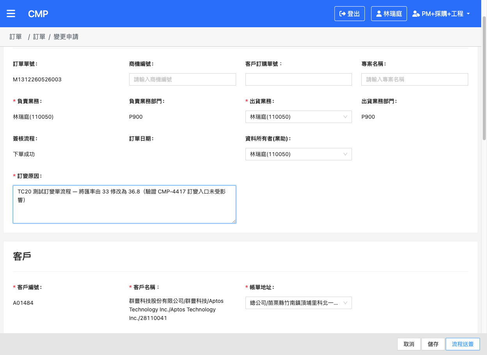<br>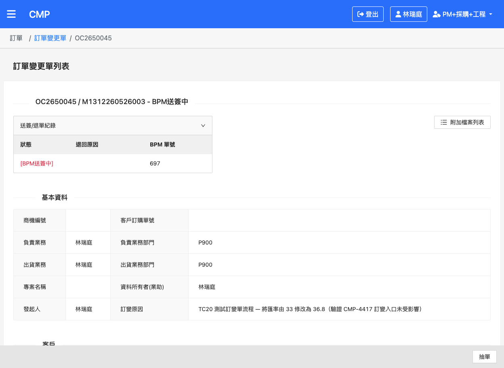 |
| 結果 | ✅ Pass |

---

### AC6 — 影響範圍（updateFields 共用 API 其他呼叫端）

#### <a id="tc21"></a>TC21 — `customerPoNumber` 即時編輯仍正常

| 項目 | 內容 |
|------|------|
| 單號 | [20260526653468](https://cmp-uat-100.metaage.com.tw/main/orders/20260526653468)（訂單 A） |
| 前置 | 已安裝 XHR 攔截器 |
| 步驟 | ① 編輯訂單 → 訂單主檔 → 修改「客戶採購單號」<br>② 點該欄位旁的儲存按鈕 |
| 預期 | • PATCH `/orders/{id}/fields` 200<br>• Request body：<br>`{"data":[{"type":"HEADER","field":"customerPoNumber","value":"<新值>"}]}`<br>• notify success<br>• 對應檔案：`order-header.component.ts:437` |
| 實際 | • 訂單 A 編輯頁 → 「客戶訂購單號」欄位輸入「PO-TC21-TEST」<br>• 點該欄位 label 旁「儲存」按鈕<br>• PATCH `/order-v2/orders/20260526653468/fields` → **200**<br>• Request body：<br>`{"data":[{"type":"HEADER","field":"customerPoNumber","value":"PO-TC21-TEST"}]}` ✅<br>• notify success「更新成功 — 更新欄位成功」 ✅<br>• 確認 CMP-4417 共用 `updateFields` API 未影響原本即時編輯流程 |
| 截圖 | 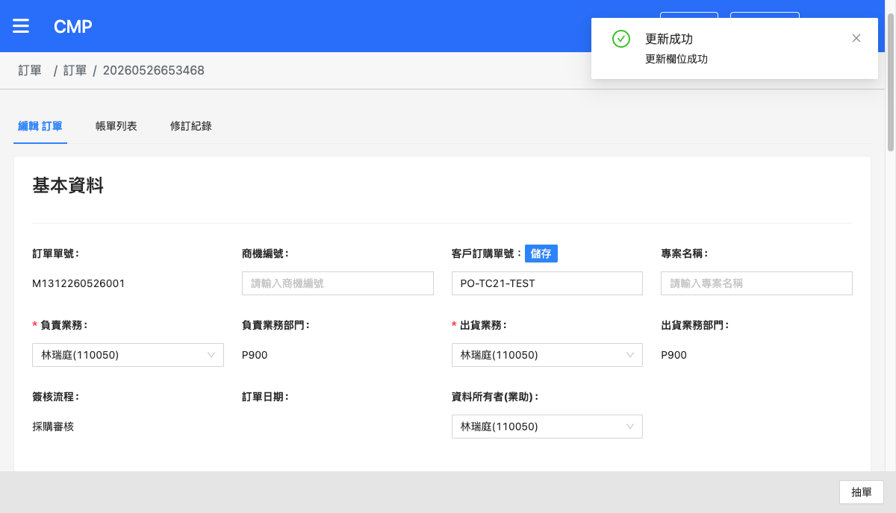 |
| 結果 | ✅ Pass |

#### <a id="tc22"></a>TC22 — 子單 `purpose`（用途說明）即時編輯仍正常

| 項目 | 內容 |
|------|------|
| 單號 | [20260527591050](https://cmp-uat-100.metaage.com.tw/main/orders/20260527591050)（OTHERS 型 418 單，子單 ID `2026052759105001`，原 purpose=「測試」）|
| 步驟 | ① 編輯訂單 → 子單面板 → 修改「用途說明」<br>② 點該欄位儲存按鈕 |
| 預期 | • PATCH `/orders/{id}/fields` 200<br>• Request body：<br>`{"data":[{"type":"BODY","field":"purpose","value":"<新值>","orderDetailId":"<子單id>"}]}`<br>• notify success<br>• 對應檔案：`sub-order.component.ts:778` |
| 實際 | • OTHERS 型訂單 20260527591050 子單面板捲到底部找到「* 用途說明 [儲存]」欄位（label 旁藍色 inline 儲存按鈕）<br>• textarea 改為「TC22 測試用途說明 - 2026-05-27T01:36」<br>• 點儲存：<br>　– PATCH `/order-v2/orders/20260527591050/fields` → **200**<br>　– Request body：<br>　　`{"data":[{"type":"BODY","field":"purpose","value":"TC22 測試用途說明 - 2026-05-27T01:36","orderDetailId":"2026052759105001"}]}` ✅<br>　– notify success「更新成功 — 更新欄位成功」 ✅<br>• 完全符合 SD 預期（`type=BODY`、含 `orderDetailId` 子單 id），證實 CMP-4417 共用 `updateFields` API 未影響原本子單即時編輯流程 |
| 截圖 | 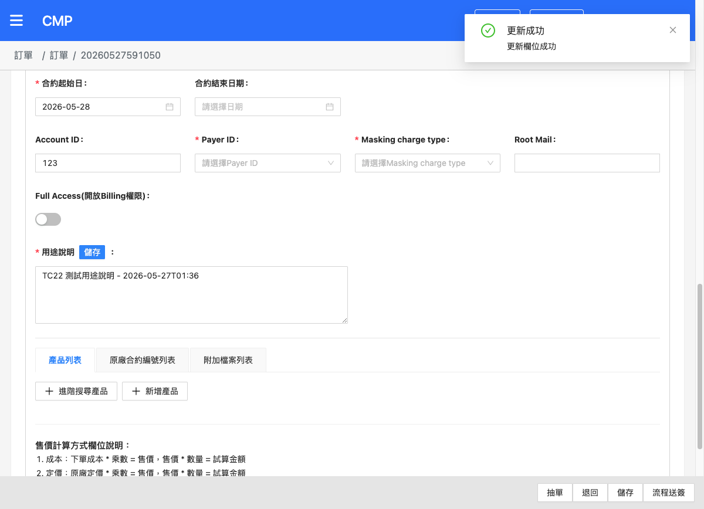 |
| 結果 | ✅ Pass |

---

## 五、測試結果總覽

| AC / 類別 | TC 數 | Pass | Fail | Blocked | 備註 |
|----------|-------|------|------|---------|------|
| AC1 欄位可編輯 | 7 | 7 | 0 | 0 | TC01–TC07 |
| AC2 儲存行為 | 6 | 6 | 0 | 0 | TC08–TC13（TC13 採購身份完成驗證）|
| AC3 輸入驗證 | 4 | 4 | 0 | 0 | TC14–TC17 |
| AC4 權限控管 | 2 | 1 | 0 | 0 | TC18 Pass；TC19 N/A（唯讀角色無詳細頁入口，系統層級已阻擋）|
| AC5 訂變入口 | 1 | 1 | 0 | 0 | TC20（OC2650045 完整送簽至 BPM）|
| AC6 影響範圍 | 2 | 2 | 0 | 0 | TC21 / TC22 皆通過 |
| **總計** | **22** | **21** | **0** | **0** | TC19 N/A 不列入分母 |

---

## 六、缺陷紀錄

本次測試**無發現缺陷**。

---

## 七、附錄

### A. XHR 攔截器（複製即用）

```js
agent-browser eval "
(function() {
  if (window.__capInstalled) return 'already';
  window.__capInstalled = true;
  window.__cap = [];
  const oOpen = XMLHttpRequest.prototype.open;
  const oSend = XMLHttpRequest.prototype.send;
  XMLHttpRequest.prototype.open = function(m, u) {
    this.__m = m; this.__u = u;
    return oOpen.apply(this, arguments);
  };
  XMLHttpRequest.prototype.send = function(b) {
    const x = this;
    const u = x.__u || '';
    if (u.indexOf('/fields') > -1) {
      const it = { m: x.__m, u: u, body: b };
      window.__cap.push(it);
      x.addEventListener('load', () => { it.s = x.status; it.r = x.responseText?.slice(0, 500); });
    }
    return oSend.apply(this, arguments);
  };
  return 'ok';
})();
"
```

讀取捕獲結果：`agent-browser eval "JSON.stringify(window.__cap)"`

### B. 直接查詢訂單狀態（避免 UI 快取）

```js
agent-browser eval "(async () => {
  const r = await fetch('https://cmp-uat-100-svc.metaage.com.tw/order-v2/orders/{orderId}', {
    headers: { 'Authorization': 'Bearer ' + (localStorage.getItem('AccessToken') || '') }
  });
  const d = await r.json();
  return {
    status: d.data?.header?.status,
    exchangeRateType: d.data?.header?.exchangeRateType,
    exchangeRate: d.data?.header?.exchangeRate,
    exchangeRateDay: d.data?.header?.exchangeRateDay,
  };
})();"
```

### C. 預期 Payload 對照表

| 場景 | Request Body |
|------|--------------|
| CUSTOM | `[{type:'HEADER',field:'exchangeRateType',value:'CUSTOM'},{type:'HEADER',field:'exchangeRate',value:<number>}]` |
| BKTW | `[{type:'HEADER',field:'exchangeRateType',value:'BKTW'},{type:'HEADER',field:'exchangeRateDay',value:<string>}]` |
| 其他 | `[{type:'HEADER',field:'exchangeRateType',value:'<enum>'}]` |
| customerPoNumber | `[{type:'HEADER',field:'customerPoNumber',value:<string>}]` |
| purpose | `[{type:'BODY',field:'purpose',value:<string>,orderDetailId:<id>}]` |

### D. 顯示條件對照（重點重申）

```
顯示 Save 按鈕：mode === OrderMode.edit && status !== ApprovalStatus.update
匯率欄位可編輯：mode === OrderMode.edit && currentStatus !== ApprovalStatus.update
ma-form readonly：mode === OrderMode.review || status === ApprovalStatus.update
```
