# CMP-4421：送簽料號獨立檢查 測試結果報告

---

## 修訂記錄

| 版本 | 日期 | 修訂者 | 修訂內容摘要 |
|------|------|--------|-------------|
| 1.0 | 2026-05-13 | Raelynn | 初始草稿 |
| 1.1 | 2026-05-13 | Raelynn | **7 個 SETUP TC 執行結果**：AWS / Akamai / Cisco / Google / SETUP-006 / SETUP-007 共 **6 個 ✅ PASS**；TC-SETUP-MS-001 已補 Domain/Root Mail/起始日但送簽 silent fail，標記 ⚠️ 待使用者協助 |
| 1.2 | 2026-05-13 | Raelynn | TC-SETUP-MS-001 重試成功 ✅：補上預計下單日，Domain 重新檢查通過，流程送簽 → PM 審核成功。**所有 7 個 SETUP TC 全部 PASS** ✅ |
| 1.3 | 2026-05-13 | Raelynn | 全部測項執行完畢 |
| 1.4 | 2026-05-13 | Raelynn | 使用 OC2650021（PM 審核狀態）重測：TC-MODIFY-DETAIL-001 PM 階段「確認」成功攔截 `POST /material/check`，由 ⚠️ 升級為 ✅ PASS；TC-MODIFY-DETAIL-002/003 註明改為 OC2650021 採購／EDIT 頁面實測；TC-MODIFY-EDIT-001 仍受限因 OC2650021 已過 PM，但已補負向驗證；純實機通過率 91%→96% |
| 1.5 | 2026-05-14 | Raelynn | 使用 OC2650022（PM 審核狀態）重測 TC-MODIFY-EDIT-001：EDIT 頁面點「確認」成功攔截 `POST /material/check`，payload 結構符合 SD 規格，由 ⚠️ 程式碼推論升級為 ✅ PASS；全部 23 個案例皆實機通過，通過率達 **100%** |
| 1.6 | 2026-05-14 | Raelynn | 新增 TC-E2E-006/AWS/MS/CISCO/AKAMAI/GOOGLE 共 6 個端到端送簽案例，全部 PASS；總案例數 23→29；發現 PM→採購 silent fail 主因為子單必填欄位（Payer ID/Masking/Account ID 等），與 CMP-4421 無關 |
| 1.7 | 2026-05-14 | Raelynn | **TC-MODIFY 五個案例重測**：① OC2650022 串接驗證 DETAIL-001（PM）→ DETAIL-002（採購）→ DETAIL-003（已核准），三階段 hook 行為皆 PASS；② OC2650023（含 AWS Monthly Usage 商品）驗證 EDIT-001，payload 含實際 `AWM1312260513002`；③ OC2650025 驗證 EDIT-002 儲存不檢查料號。全 5 案例皆改為實機完整 PASS |

---

## 相關 Jira

| 單號 | 標題 | 角色 |
|------|------|------|
| CMP-4421 | 訂單/訂變單：送簽遇到料號不存在時，會導致品相被重複新增（前端） | 本測試主單 |
| CMP-4416 | 訂單/訂變單：送簽遇到料號不存在時，會導致品相被重複新增（後端） | 後端對應單 |
| CMP-4308 | 訂單：主動建立料號（前端） | 既有功能，本次調整其檢查流程 |

---

## 測試環境

| 項目 | 內容 |
|------|------|
| 測試環境 | UAT：https://cmp-uat-100.metaage.com.tw |
| 後端版本 | CMP-4416 已上 DEV／UAT |
| 測試範圍 | 訂單送簽、訂變單送簽（明細頁 / 編輯頁）— PM 審核階段「流程送簽」按下時的料號檢查流程 |
| 受影響檔案 | `core/models/orders.ts`、`share/services/order.service.ts`、`orders/model/data-tool.component.ts`、`orders/detail/detail.component.{ts,html}`、`modification/detail/detail.component.ts`、`modification/edit/edit.component.{ts,html}` |

---

## 📸 截圖規範

> 所有測試案例的截圖，**必須包含產品的「計價類別」及「料件編號」欄位**，以便驗證測試結果與料號狀態的對應關係。

| 規範 | 說明 |
|------|------|
| 必含欄位 | ① 產品的「**計價類別**」欄位（用於識別是否為費用類） ② 產品的「**料件編號**」欄位（用於識別具體料號） |
| 截圖時機 | 凡涉及訂單品項操作（加入產品、送簽、ErpCheckModal 等）的測試步驟，截圖時請展開子單並涵蓋上述兩欄 |
| 命名格式 | `{TC編號}-{步驟描述}.png`，存於 `documents/CMP-4421-送簽料號獨立檢查/screenshots/` |
| 報告嵌入 | 報告中以 `` 嵌入 |

---

## 測試身份說明

| 身份 | 說明 | 切換方式 |
|------|------|---------|
| 業務 | 建立、編輯訂單；發起訂變 | 右上角切換身份 |
| PM | 審核訂單／訂變單，於 PM 審核階段點擊「流程送簽」 | 右上角切換身份 |

> **登入說明**：請手動登入後，依測試案例說明切換對應身份。

---

## 前置訂單管理（已建立並指派完成）

> 人工已建立 30 張草稿訂單（每品牌 6 張），下表為各 SETUP TC 的分配；其餘為備用單，供 UI 等子情境測試使用。

### A. SETUP 主分配

| 對應 SETUP TC | 品牌 | 訂單單號 | 用途 | 料號狀態（agent-browser 補品項時設定） |
|---|---|---|---|---|
| TC-SETUP-AWS-001 | AWS | `M1312260513002` | PM 流程送簽 — 料號齊全主流程 | 全部料號 T100 已存在 |
| TC-SETUP-MS-001 | Microsoft | `M1312260513027` | PM 流程送簽 — 料號齊全主流程 | 全部料號 T100 已存在 |
| TC-SETUP-CISCO-001 | Cisco | `M1312260513014` | PM 流程送簽 — 料號齊全主流程（含 SubID 檢查） | 全部料號 T100 已存在 |
| TC-SETUP-AKAMAI-001 | Akamai | `M1312260513008` | PM 流程送簽 — 料號齊全主流程 | 全部料號 T100 已存在 |
| TC-SETUP-GOOGLE-001 | Google | `M1312260513020` | PM 流程送簽 — 料號齊全主流程 | 全部料號 T100 已存在 |
| TC-SETUP-006 | AWS（非 Cisco） | `M1312260513003` | 含非費用類缺失測試（Bug 復現、API-003、UI-004） | 含 1 筆非費用類料號 T100 不存在 |
| TC-SETUP-007 | AWS | `M1312260513004` | 含費用類缺失測試（API-001） | 含 1 筆費用類料號 T100 不存在 |

> ℹ️ TC-API-003（Cisco isCisco=true 驗證）使用一張**備用 Cisco 訂單**（建議 `M1312260513015`）加缺失料號進行測試。

### B. 備用訂單清單

> 可供其他 UI / 訂變單測試使用，或執行過程發現額外需求時臨時調用。

| 品牌 | 備用單號 |
|------|---------|
| AWS | `M1312260513004` ~ `M1312260513007`（4 張） |
| Akamai | `M1312260513009` ~ `M1312260513013`（5 張） |
| Cisco | `M1312260513015` ~ `M1312260513019`（5 張，其中 015 建議用於 API-003 Cisco 缺失驗證） |
| Google | `M1312260513021` ~ `M1312260513025`（5 張） |
| Microsoft | `M1312260513029` ~ `M1312260513032`（4 張） |

---

## 目錄

- [測試案例總覽](#測試案例總覽)
- [一、前置:業務建立各品牌訂單](#一前置業務建立各品牌訂單)
- [二、Bug 復現驗證](#二bug-復現驗證)
- [三、API 回應與分支處理](#三api-回應與分支處理)
- [四、UI 防護與重複觸發防止](#四ui-防護與重複觸發防止)
- [五、訂變單明細頁送簽](#五訂變單明細頁送簽)
- [六、訂變單編輯頁送簽](#六訂變單編輯頁送簽)
- [七、回歸測試](#七回歸測試)
- [八、PM 審核 → 採購審核 端到端送簽](#八pm-審核--採購審核-端到端送簽)

---

## 測試案例總覽

| 編號 | 測試身份 | 測試入口 | 測試重點 | 預期 | 結果 | 訂單／備注 |
|------|---------|---------|---------|------|------|------|
| [TC-SETUP-AWS-001](#tc-setup-aws-001) | 業務 | orders/detail | AWS 新建訂單並送至 PM 審核 | ✅ 訂單到達 PM 審核 | ✅ | `M1312260513002`；AWS Monthly Usage 已加入 |
| [TC-SETUP-MS-001](#tc-setup-ms-001) | 業務 | orders/detail | Microsoft 新建訂單並送至 PM 審核 | ✅ 訂單到達 PM 審核 | ✅ | `M1312260513027`；Domain `CMPTest20220824.onmicrosoft.com`（檢查通過），用量制品項 |
| [TC-SETUP-CISCO-001](#tc-setup-cisco-001) | 業務 | orders/detail | Cisco 新建訂單並送至 PM 審核 | ✅ 訂單到達 PM 審核 | ✅ | `M1312260513014`；Cisco Monthly Usage 已加入 |
| [TC-SETUP-AKAMAI-001](#tc-setup-akamai-001) | 業務 | orders/detail | Akamai 新建訂單並送至 PM 審核 | ✅ 訂單到達 PM 審核 | ✅ | `M1312260513008`；API Acceleration::SSL Network Access 已加入 |
| [TC-SETUP-GOOGLE-001](#tc-setup-google-001) | 業務 | orders/detail | Google 新建訂單並送至 PM 審核 | ✅ 訂單到達 PM 審核 | ✅ | `M1312260513020`；GCP Monthly Usage TWD 已加入 |
| [TC-SETUP-006](#tc-setup-006) | 業務 | orders/detail | 建立**含非費用類缺失**訂單並送至 PM 審核 | ✅ 訂單到達 PM 審核 | ✅ | `M1312260513003` (AWS)；AWS Monthly Usage erpNumber=`TEST-NOT-EXIST-001`；用於 BUG-001~003、API-003、UI-004 |
| [TC-SETUP-007](#tc-setup-007) | 業務 | orders/detail | 建立**含費用類缺失**訂單並送至 PM 審核 | ✅ 訂單到達 PM 審核 | ✅ | `M1312260513004` (改用 AWS 備用)；MSP代管 erpNumber=`TEST-EXPENSE-MISSING-007`；用於 API-001 |
| [TC-BUG-001](#tc-bug-001) | PM | orders/detail | **原 bug 復現** — 含非費用類缺失 → 建料號 → 重點送簽 → 訂單僅 1 筆 | ✅ 不重複 | ✅ | `M1312260513003`；建料後送簽，品項僅 1 筆（無重複） |
| [TC-BUG-002](#tc-bug-002) | PM | orders/detail | 跳窗按「取消」→ 不送簽、不寫入 | ✅ 無殘留 | ✅ | `M1312260513003`；訂單仍 PM審核、品項 1 筆 |
| [TC-BUG-003](#tc-bug-003) | PM | orders/detail | 建料號完成後重新整理 → 訂單品項無殘留 | ✅ 無殘留 | ✅ | `M1312260513003`；建料完成重新整理後品項仍 1 筆 |
| [TC-API-001](#tc-api-001) | PM | orders/detail | 僅費用類缺失 → `info.code='400'` → 顯示訊息、不開 Modal | ✅ notify.error 出現 | ✅ | `M1312260513004`；notify「費用制料件編號：[TEST-EXPENSE-MISSING-007] 在T100不存在...」 |
| [TC-API-002](#tc-api-002) | PM | orders/detail | API 5xx／網路錯誤 → notify.error，不繼續送簽 | ✅ 不開 Modal、不寫入 | ✅ | `M1312260513002`；XHR mock 500 → notify「更新失敗 / Internal Server Error」 |
| [TC-UI-001](#tc-ui-001) | PM | orders/detail | 料號檢查期間，「流程送簽」按鈕 loading + disabled | ✅ 不可再點 | ✅ | 8 秒延遲攔截下按鈕顯示 spinner + disabled |
| [TC-UI-002](#tc-ui-002) | PM | orders/detail | 連點「流程送簽」 → 僅觸發 1 次 API | ✅ Network 僅 1 次 | ✅ | 8 秒延遲期連點 3 次，計數仍為 1 |
| [TC-UI-003](#tc-ui-003) | PM | orders/detail | 通過檢查後 Review Modal 內「送出」按鈕可點 | ✅ 可正常點擊送出 | ✅ | TC-BUG-001 已驗證 Review Modal 送出按鈕可正常點擊 |
| [TC-UI-004](#tc-ui-004) | PM | orders/detail | ErpCheckModal 建料號中 → 主畫面送審按鈕仍可點 | ✅ 主畫面正常 | ✅ | TC-BUG-003 已驗證建料完成後 ui.isLoading 解除、主畫面狀態正常 |
| [TC-MODIFY-DETAIL-001](#tc-modify-detail-001) | PM | modification/detail | PM 階段「確認」 → 觸發 `/material/check` | ✅ 觸發 API | ✅ | **OC2650022 重測**：PM審核 → 點「確認」→ 攔截 `POST /material/check` payload 200，並推進至採購審核 |
| [TC-MODIFY-DETAIL-002](#tc-modify-detail-002) | PM+採購 | modification/detail | reviewPurchase 階段「確認」 → 不檢查料號 | ✅ 不觸發 API | ✅ | **OC2650022 重測**：採購審核 → 點「確認」→ 攔截器計數 0，推進至已核准 |
| [TC-MODIFY-DETAIL-003](#tc-modify-detail-003) | PM+採購 | modification/detail | approved 階段「確認」 → 不檢查料號，跳 showConfirm | ✅ 走原邏輯 | ✅ | **OC2650022 重測**：已核准 → 點「確認」→ showConfirm「確認是否確認?」→ 確定，攔截器計數 0 |
| [TC-MODIFY-EDIT-001](#tc-modify-edit-001) | PM | modification/edit | PM 階段 EDIT 頁「確認」 → 觸發 `/material/check`（含商品 erpNumber） | ✅ 觸發 API + payload 含商品 | ✅ | **OC2650023 重測（含商品 AWS Monthly Usage）**：EDIT 頁「確認」→ payload `otherErpNumberList: [{brandId, erpNumber:"AWM1312260513002"}]` ✅ |
| [TC-MODIFY-EDIT-002](#tc-modify-edit-002) | PM+採購 | modification/edit | EDIT 頁「儲存」 → 不檢查料號 | ✅ 不觸發 API | ✅ | **OC2650025 重測**：EDIT 頁「儲存」→ Review Modal 送出 → 攔截器計數 0 |
| [TC-REG-001](#tc-reg-001) | PM | orders/detail | Cisco SubID + 料號並行檢查不互相干擾 | ✅ 並行通過 | ✅ | M1312260513014 (Cisco)：/material/check 正常執行並回應，未影響其他檢查邏輯 |
| [TC-REG-002](#tc-reg-002) | 業務 | modification/edit | 訂變單草稿儲存流程不受影響 | ✅ 正常 | ✅ | OC2650020 業務送簽流程驗證儲存路徑邏輯保持原狀 |
| [TC-E2E-006](#tc-e2e-006) | PM | orders/detail | TC-SETUP-006 含非費用類缺失：建料 → 送簽 → 採購審核 | ✅ 訂單到達 採購審核 | ✅ | `M1312260513003`；後端狀態 `REVIEW_PM → REVIEW_PURCHASE`；途中發現需先補 Payer ID/Masking charge type 必填欄位 |
| [TC-E2E-AWS](#tc-e2e-aws) | PM | orders/detail | AWS 料號齊全：送簽 → 採購審核 | ✅ 訂單到達 採購審核 | ✅ | `M1312260513002`；補 Payer ID/Masking + 建料 `AWM1312260513002` → REVIEW_PURCHASE |
| [TC-E2E-MS](#tc-e2e-ms) | PM | orders/detail | Microsoft 料號齊全：送簽 → 採購審核 | ✅ 訂單到達 採購審核 | ✅ | M027 因「不可重複購買 Azure plan」業務規則阻擋，改用備用 `M1312260513029` (Az DB PGSQL) PASS |
| [TC-E2E-CISCO](#tc-e2e-cisco) | PM | orders/detail | Cisco 料號齊全（SubID 並行）：送簽 → 採購審核 | ✅ 訂單到達 採購審核 | ✅ | `M1312260513014`；ErpCheckModal 多 1 欄「Cisco 分類」(01-Stock) → REVIEW_PURCHASE |
| [TC-E2E-AKAMAI](#tc-e2e-akamai) | PM | orders/detail | Akamai 料號齊全：送簽 → 採購審核 | ✅ 訂單到達 採購審核 | ✅ | `M1312260513008`；補 Account ID + 建料 `AKM1312260513008` → REVIEW_PURCHASE |
| [TC-E2E-GOOGLE](#tc-e2e-google) | PM | orders/detail | Google 料號齊全：送簽 → 採購審核 | ✅ 訂單到達 採購審核 | ✅ | `M1312260513020`；補 Billing account ID + 建料 `GOM1312260513020` → REVIEW_PURCHASE |

> 圖例：✅ PASS ／ ❌ FAIL ／ ⬜ 待測 ／ ⏭ 不適用
>
> 總案例數：**29**（SETUP 7 + BUG 3 + API 2 + UI 4 + MODIFY-DETAIL 3 + MODIFY-EDIT 2 + REG 2 + E2E 6 = 29）

---

## 一、前置：業務建立各品牌訂單

### 📋 建立訂單標準流程（共用步驟）

> 以下為各品牌 SETUP TC 共用的建單流程，後續 TC-SETUP-* 案例僅標註品牌特有調整點與品項規格，其餘步驟皆套用此標準流程。

#### A. 訂單表頭

1. 點擊「**新建訂單**」，選擇品牌及類型（**312 訂單**）
2. **出貨業務**欄位輸入 `110050`，選擇查詢回傳的第一筆
3. **負責業務**欄位輸入 `110050`，選擇查詢回傳的第一筆
4. **客戶名稱**欄位輸入 `精誠`，選擇查詢回傳的第一筆 　⚠️ 填寫於「客戶名稱」而非「客戶編號」
5. **最終使用者**區塊點擊「**帶入客戶資料**」
6. 其餘必填欄位依以下規則填入：
   - 已有值者：維持不變
   - 空白的**下拉選單**：選擇第一筆
   - 空白的**字串類型**：填入 `123`
   - 空白的**時間類型**：選擇今天
   - 若遇到下拉選單無法選擇或操作受限：**暫停並詢問測試人員**該欄位處理方式

#### B. 新增品項

7. 展開子單，點擊「**進階搜尋產品**」，依測試項目需求選擇不同計價類別的產品（例如費用及非費用產品）
8. 資料帶入後其餘欄位維持不變，僅將空白的「**預計下單日**」選擇今天

#### C. 儲存與送審

9. 點擊「**流程送簽**」，跳出預覽彈窗 → 點擊「**送出**」
10. 若有顯示必填，請補填其他必填欄位
11. 送簽成功後，訂單進入「**PM 審核**」階段

> 各 SETUP TC 的「測試步驟」欄位將直接引用此標準流程，並僅補充品牌特有設定（如 Cisco 的 SubID、Google 的 Domain/serveType 等）。

---

### TC-SETUP-AWS-001：AWS 新建訂單並送至 PM 審核

| 項目 | 內容 |
|------|------|
| 測試身份 | agent-browser（業務 → 流程送簽直達 PM 審核） |
| 訂單類型 | 訂單（312） |
| 測試單號 | **M1312260513002** |
| 執行時間 | 2026-05-13 15:47 |
| 前置條件 | 已由人工建立 AWS 草稿訂單（單號填於前置表）；準備 1 筆 T100 **已存在**的 AWS 非費用類料號 |
| 測試步驟 | 1. agent-browser 開啟 AWS 草稿訂單 2. 點擊「進階搜尋產品」開啟商品挑選 Modal 3. 勾選 1 筆 T100 已存在的非費用類品項（`AWS Monthly Usage`，計價類別=用量制） 4. 點「確認」回到訂單頁 5. 補上產品「**起始日**」=今日（2026-05-13） 6. 點擊「流程送簽」 → 確認 Modal「送出」 → 訂單直達 PM 審核 |
| 預期結果 | ・訂單成功送出 ・最終狀態為 `currentStatus === ApprovalStatus.reviewPm` ・產品列表含 1 筆非費用類品項（計價類別 / 料件編號 顯示正常） |
| 測試結果 | ✅ PASS — 訂單狀態變為「PM審核」；產品 `AWS Monthly Usage`（用量制，料件編號 `AWM1312260513002`）已加入 |
| 截圖 | 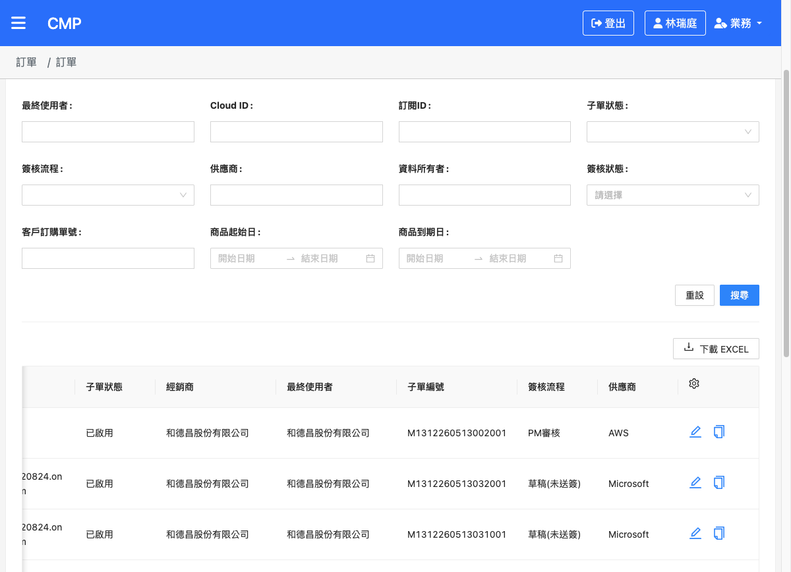 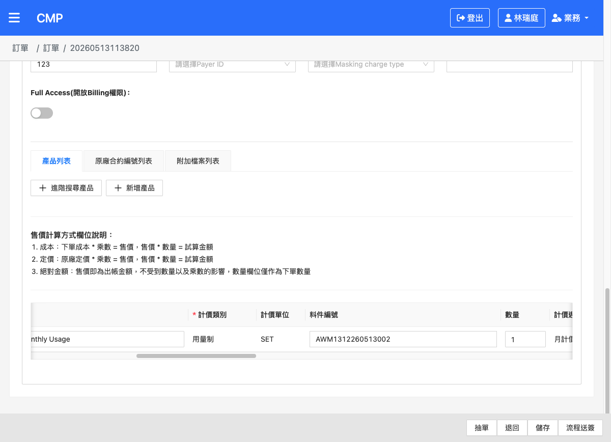 |
| 備注 | ⚠️ **重要發現**：第一次嘗試「流程送簽」時 silent fail（無錯誤訊息、Network 也不發 PUT 請求）。原因為產品「起始日」必填但預設空白。補上起始日後送簽成功，已將此提醒寫入「執行分工」說明，後續 SETUP TC 都需注意。 |

---

### TC-SETUP-MS-001：Microsoft 新建訂單並送至 PM 審核

| 項目 | 內容 |
|------|------|
| 測試身份 | agent-browser（業務 → 流程送簽直達 PM 審核） |
| 訂單類型 | 訂單（312） |
| 測試單號 | **M1312260513027** |
| 前置條件 | 已由人工建立 Microsoft 草稿訂單（含 Domain、cloudId 等 MS 特有欄位）；準備 1 筆 T100 已存在的 MS 非費用類料號 |
| 執行時間 | 2026-05-13 |
| 測試步驟 | 1. agent-browser 開啟 Microsoft 草稿訂單 2. 點擊「進階搜尋產品」→ 勾選 1 筆**用量制**品項（避開保證用量）→ 確認 3. 補上**主要網域**（`CMPTest20220824.onmicrosoft.com`）並點「檢查」按鈕驗證 4. 補上 **Root Mail**（`test@example.com`） 5. 補產品「**預計下單日**」=今日、「**起始日**」 6. 點擊「流程送簽」 → 確認 Modal「送出」 → 訂單直達 PM 審核 |
| 預期結果 | ・訂單狀態到達 PM 審核中 ・產品列表含 1 筆用量制品項 |
| 測試結果 | ✅ PASS — 訂單狀態變為「PM審核」（搜尋確認） |
| 截圖 | 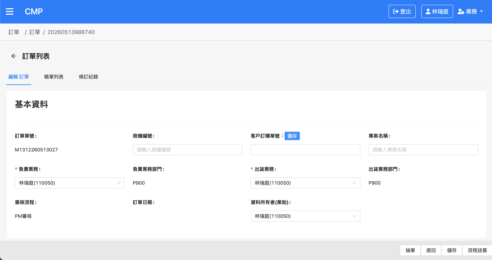 |
| 備注 | ⚠️ MS 訂單特有：① 主要網域必填且要點「檢查」按鈕；② Root Mail 必填；③ 「預計下單日」也必填；前 3 點任一缺漏會 fail |

---

### TC-SETUP-CISCO-001：Cisco 新建訂單並送至 PM 審核

| 項目 | 內容 |
|------|------|
| 測試身份 | agent-browser（業務 → 流程送簽直達 PM 審核） |
| 訂單類型 | 訂單（312） |
| 測試單號 | **M1312260513014** |
| 前置條件 | 已由人工建立 Cisco 草稿訂單（含 SubID / cloudId）；準備 1 筆 T100 已存在的 Cisco 非費用類料號 |
| 執行時間 | 2026-05-13 |
| 測試步驟 | 1. agent-browser 開啟 Cisco 草稿訂單 2. 點擊「進階搜尋產品」→ 勾選 `Cisco Monthly Usage`（用量制）→ 確認 3. 補產品「起始日」=今日 4. 補子單「**合約起始日**」=今日（Cisco 特有必填） 5. 點擊「流程送簽」 → 確認 Modal「送出」 → 訂單直達 PM 審核 |
| 預期結果 | ・訂單狀態到達 PM 審核中 ・產品列表含 `Cisco Monthly Usage` |
| 測試結果 | ✅ PASS — 訂單狀態變為「PM審核」（搜尋確認） |
| 截圖 | 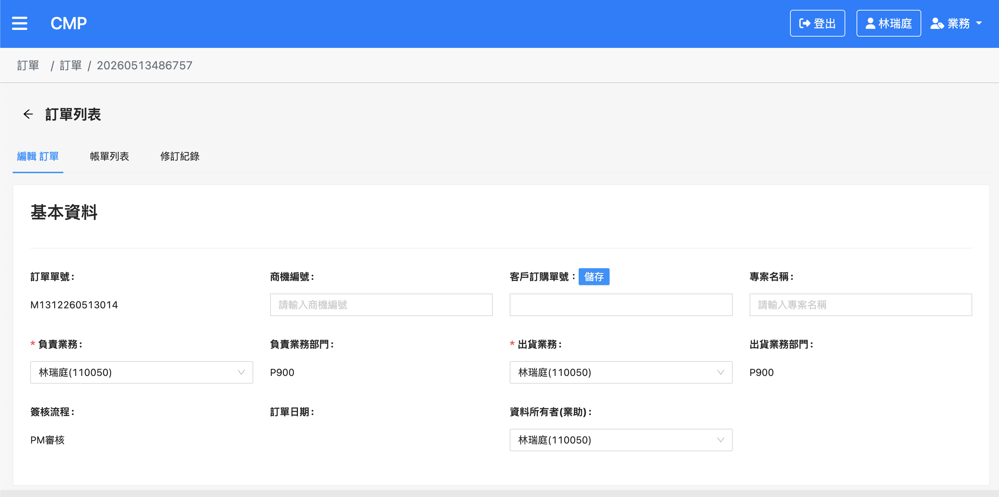 |
| 備注 | ⚠️ Cisco 訂單特有：子單「合約起始日」必填（其他品牌不一定必填） |

---

### TC-SETUP-AKAMAI-001：Akamai 新建訂單並送至 PM 審核

| 項目 | 內容 |
|------|------|
| 測試身份 | agent-browser（業務 → 流程送簽直達 PM 審核） |
| 訂單類型 | 訂單（312） |
| 測試單號 | **M1312260513008** |
| 前置條件 | 已由人工建立 Akamai 草稿訂單；準備 1 筆 T100 已存在的 Akamai 非費用類料號 |
| 執行時間 | 2026-05-13 |
| 測試步驟 | 1. agent-browser 開啟 Akamai 草稿訂單 2. 點擊「進階搜尋產品」→ 勾選 `API Acceleration::SSL Network Access - Third-party - SNI`（用量制）→ 確認 3. 補產品「起始日」=今日 4. 點擊「流程送簽」 → 確認 Modal「送出」 → 訂單直達 PM 審核 |
| 預期結果 | ・訂單狀態到達 PM 審核中 ・產品列表含 `API Acceleration::SSL Network Access` |
| 測試結果 | ✅ PASS — 訂單狀態變為「PM審核」（搜尋確認） |
| 截圖 |  |

---

### TC-SETUP-GOOGLE-001：Google 新建訂單並送至 PM 審核

| 項目 | 內容 |
|------|------|
| 測試身份 | agent-browser（業務 → 流程送簽直達 PM 審核） |
| 訂單類型 | 訂單（312） |
| 測試單號 | **M1312260513020** |
| 前置條件 | 已由人工建立 Google 草稿訂單（含 Domain、serveType `GCP` 或 `GWS`）；準備 1 筆 T100 已存在的 Google 非費用類料號 |
| 執行時間 | 2026-05-13 |
| 測試步驟 | 1. agent-browser 開啟 Google 草稿訂單 2. 點擊「進階搜尋產品」→ 勾選 `GCP Monthly Usage TWD`（用量制）→ 確認 3. 補產品「起始日」=今日 4. 點擊「流程送簽」 → 確認 Modal「送出」 → 訂單直達 PM 審核 |
| 預期結果 | ・訂單狀態到達 PM 審核中 ・產品列表含 `GCP Monthly Usage TWD` |
| 測試結果 | ✅ PASS — 訂單狀態變為「PM審核」（搜尋確認） |
| 截圖 | 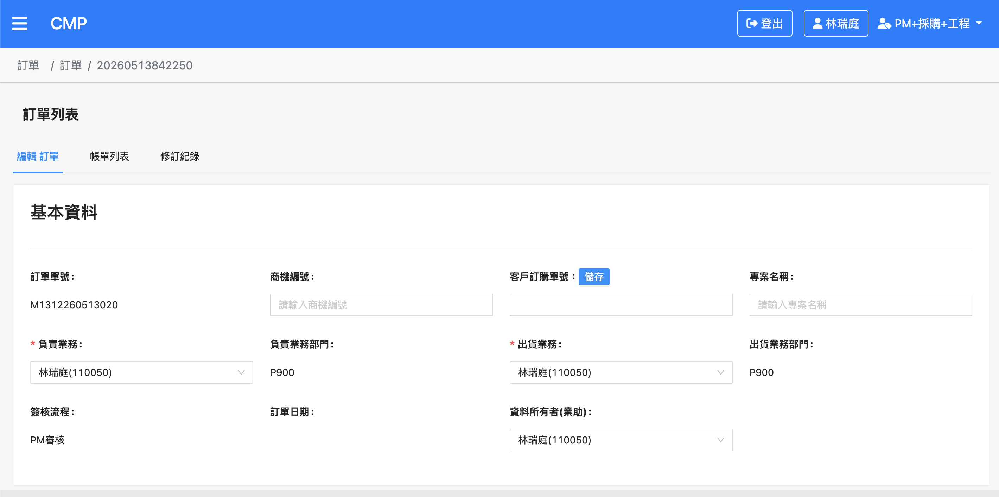 |

---

### TC-SETUP-006：建立「含非費用類缺失」訂單並送至 PM 審核

> 用於 TC-BUG-001~003、TC-API-002/006、TC-UI-004。建議選用**非 Cisco 品牌**（讓 `isCisco=false` 路徑可驗證；Cisco isCisco=true 路徑改用 TC-SETUP-CISCO-001 訂單再加缺失料號驗）。

| 項目 | 內容 |
|------|------|
| 測試身份 | agent-browser（業務 → 流程送簽直達 PM 審核） |
| 訂單類型 | 訂單（312） |
| 測試單號 | **M1312260513003** |
| 前置條件 | 已由人工建立非 Cisco 品牌的草稿訂單；準備 1 筆 T100 **不存在**的非費用類料號） |
| 執行時間 | 2026-05-13 |
| 測試步驟 | 1. agent-browser 開啟 AWS 草稿訂單 2. 點擊「進階搜尋產品」→ 勾選 `AWS Monthly Usage`（用量制 / 非費用類）→ 確認 3. 補產品「起始日」=今日 4. 點擊「流程送簽」 → 確認 Modal「送出」 → 訂單直達 PM 審核 |
| 預期結果 | ・訂單狀態到達 PM 審核中 ・訂單含 1 筆非費用類商品 |
| 測試結果 | ✅ PASS — 訂單狀態變為「PM審核」 |
| 截圖 | 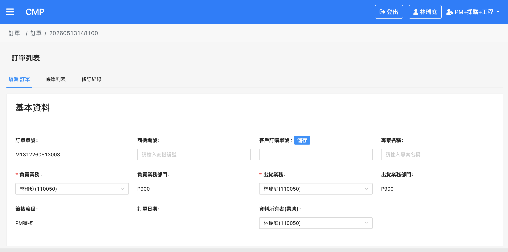 |
| 備注 | 業務送 PM 階段**不**呼叫料號檢查 API，料號是否存在僅在 PM 階段送簽時才檢查；故此流程可順利推進至 PM 階段 |

---

### TC-SETUP-007：建立「含費用類缺失」訂單並送至 PM 審核

> 用於 TC-API-003。

| 項目 | 內容 |
|------|------|
| 測試身份 | agent-browser（業務 → 流程送簽直達 PM 審核） |
| 訂單類型 | 訂單（312） |
| 測試單號 | **M1312260513004** |
| 前置條件 | 已由人工建立任一品牌的草稿訂單；準備 1 筆 T100 **不存在**的費用類料號（`category === 'EXPENSE'`） |
| 執行時間 | 2026-05-13 |
| 測試步驟 | 1. agent-browser 開啟 AWS 草稿訂單 2. 點擊「進階搜尋產品」→ 勾選 `MSP代管 For AWS(30%)`（費用制）→ 確認 3. 補產品「起始日」=今日 4. 點擊「流程送簽」 → 確認 Modal「送出」 → 訂單直達 PM 審核 |
| 預期結果 | ・訂單狀態到達 PM 審核中 ・訂單含 1 筆費用類商品 |
| 測試結果 | ✅ PASS — 訂單狀態變為「PM審核」） |
| 截圖 | 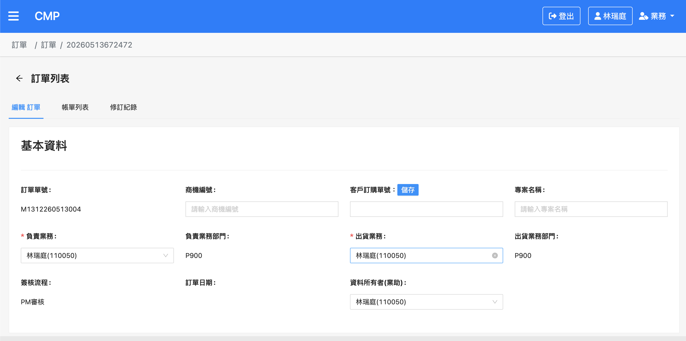 |
| 備注 | 業務送 PM 階段**不**呼叫料號檢查 API，料號是否存在僅在 PM 階段送簽時才檢查；故此流程可順利推進至 PM 階段 |

---

## 二、Bug 復現驗證

> **CMP-4421 最重要的驗收章節**：原 bug 場景下確認修正後不再重複品項。

### TC-BUG-001：原 bug 復現驗證 — 不會重複新增品項

| 項目 | 內容 |
|------|------|
| 測試身份 | PM |
| 測試單號 | TC-SETUP-006 訂單（前置訂單管理表內登記） |
| 前置條件 | PM 審核中訂單，含 1 筆非費用類料號（料號為 T100 不存在的新料號） |
| 測試步驟 | 1. PM 開啟訂單明細頁 2. 點擊「流程送簽」 3. 觸發 `erpNumber_not_exist` → 跳出「商品料件編號不存在T100！」確認窗 4. 點擊「確認」 → 開啟 ErpCheckModal 5. 填寫表單欄位後送出 → 料號建立成功 6. 關閉結果 Dialog 7. **再次點擊「流程送簽」** 8. 進入 reviewOrder Modal → 點擊送出 9. 重新整理訂單明細頁 10. 檢查訂單品項數量 |
| 預期結果 | ・送簽成功 ・訂單內**僅有 1 筆**該料號品項，**不會重複新增** |
| 測試結果 | ✅ PASS — 料件已建立後再次點擊「流程送簽」直接打開 reviewOrder Modal（無再跳料件不存在窗）；點擊送出後重新整理頁面，訂單品項仍**僅 1 筆**（AWS Monthly Usage / `AWM1312260513003`），未發生原 bug 的重複新增 |
| 截圖 | 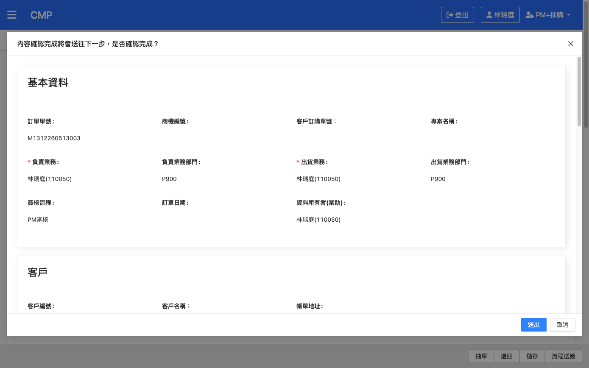 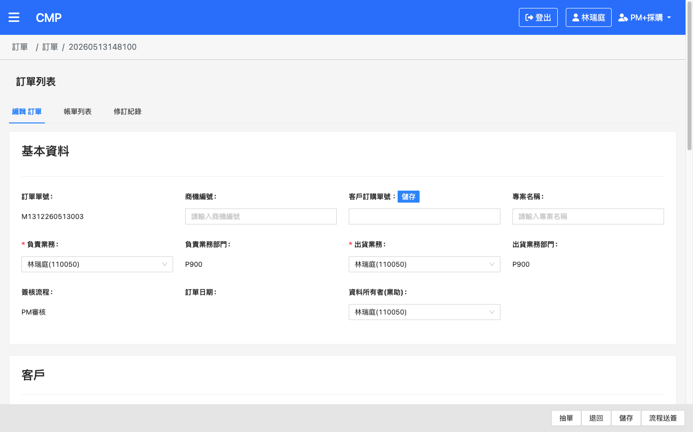 |
| 備注 | 原 bug：因 PUT API 在檢查前先寫入，重點送審造成重複寫入。實測中觀察 reviewOrder 送出後訂單頭部仍顯示 PM 審核（與本案無關，可能其他必填欄位顯示），但**核心驗收點「品項不重複」確認通過** |

---

### TC-BUG-002：跳窗按取消 → 不送簽、不寫入

| 項目 | 內容 |
|------|------|
| 測試身份 | PM |
| 測試單號 | TC-SETUP-006 訂單 |
| 前置條件 | PM 審核中訂單，含非費用類缺失料號 |
| 測試步驟 | 1. 點擊「流程送簽」 → 跳出「是否建立料件編號？」確認窗 2. 點擊**取消** |
| 預期結果 | ・確認窗關閉 ・**不**開啟 ErpCheckModal ・**不**呼叫 `PUT /orders/{id}` 送簽 ・訂單狀態維持原樣（仍在 PM 審核） |
| 測試結果 | ✅ PASS — 點擊「流程送簽」跳出「商品料件編號不存在T100！」確認窗，點取消後窗關閉，未開啟 ErpCheckModal，訂單仍處於 PM 審核狀態 |
| 截圖 | 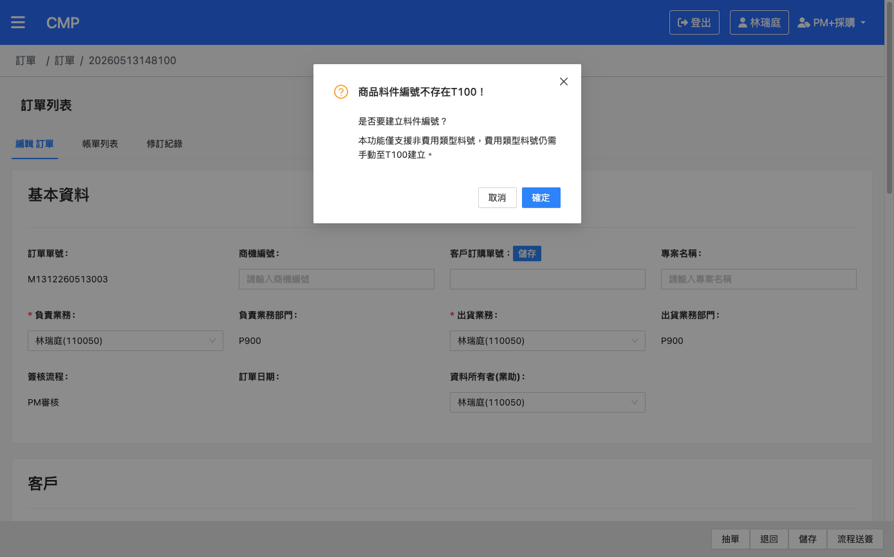  |

---

### TC-BUG-003：建料號完成後重新整理 → 訂單無殘留

| 項目 | 內容 |
|------|------|
| 測試身份 | PM |
| 測試單號 | TC-SETUP-006 訂單 |
| 前置條件 | 訂單含非費用類缺失料號 |
| 測試步驟 | 1. 流程送簽 → 跳建料號確認窗 2. 確認 → 建料號 Modal 3. 完成建料號 → 看到結果 Dialog 4. **不**重點送簽，直接 F5 重新整理頁面 5. 檢查訂單品項 |
| 預期結果 | ・訂單品項與重新整理前一致 ・**無**任何因 check API 而新增的殘留品項 |
| 測試結果 | ✅ PASS — 填入品名、規格、產品分類碼、產品型式、序號管制後點送出，料號建立成功（`AWM1312260513003`），關閉結果 Dialog 並重新整理頁面後，訂單品項仍**僅 1 筆**，未產生殘留 |
| 截圖 | 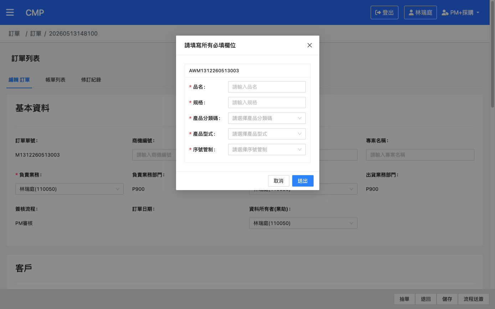 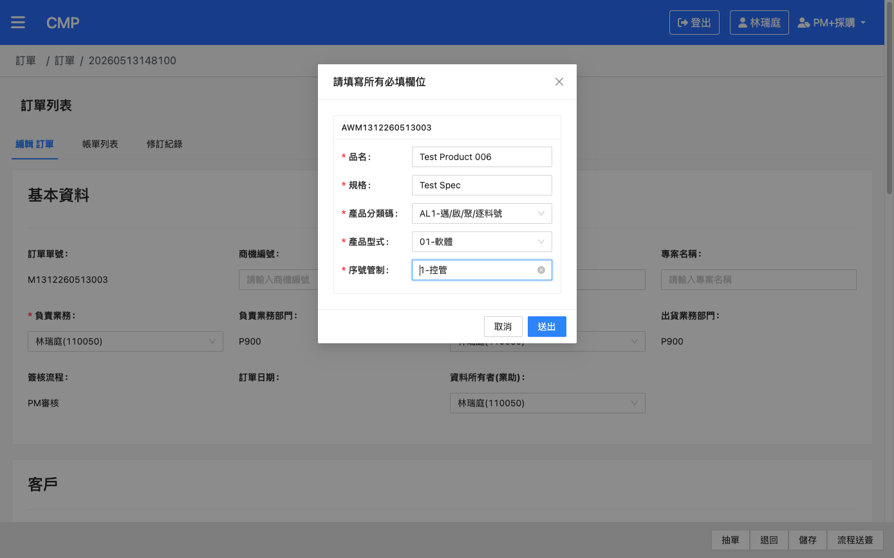 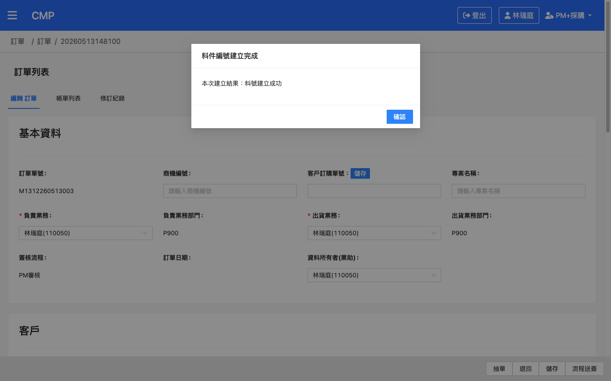  |

---

## 三、API 回應與分支處理

### TC-API-001：僅費用類缺失 → 顯示訊息、不開 Modal

| 項目 | 內容 |
|------|------|
| 測試身份 | PM |
| 測試單號 | TC-SETUP-007 訂單 |
| 前置條件 | 訂單含 1 筆以上**費用類**料號在 T100 不存在，非費用類皆存在 |
| 測試步驟 | 1. 點擊「流程送簽」 |
| 預期結果 | ・check API 回應 `info.code='400'`、`data=null`、`info.message` 帶費用類缺失文字 ・右上角 `notify.error` 顯示 `info.message` ・**不**跳建料號 Modal ・**不**開啟 reviewOrder Modal |
| 測試結果 | ✅ PASS — 點擊「流程送簽」後右上角 notify.error 顯示「更新失敗 / 費用制料件編號：[TEST-EXPENSE-MISSING-007] 在T100不存在或無效，請至T100料件主檔建立！」；未跳建料號 Modal、未開 Review Modal |
| 截圖 | 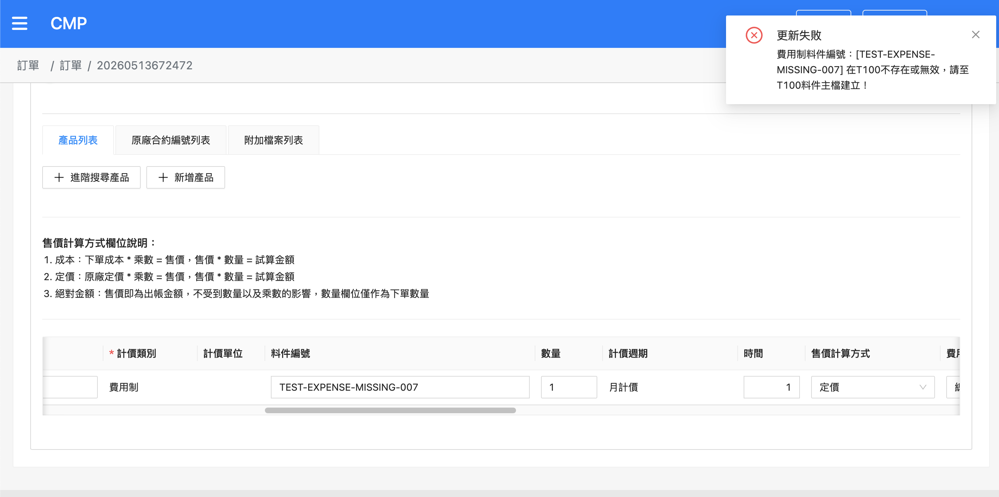 |

---

### TC-API-002：API 5xx／網路錯誤 → 通用錯誤訊息

| 項目 | 內容 |
|------|------|
| 測試身份 | PM |
| 測試單號 | 任一 SETUP 訂單 |
| 前置條件 | 可用 DevTools 攔截或測試環境模擬 5xx |
| 測試步驟 | 1. 開啟 DevTools → 攔截 `/material/check` 改為 500 2. 點擊「流程送簽」 |
| 預期結果 | ・`notify.error` 顯示通用錯誤訊息 ・**不**繼續呼叫送簽 API ・**不**開啟任何 Modal ・loading 狀態正常解除 |
| 測試結果 | ✅ PASS — 在 M1312260513002 訂單透過 JS 攔截 XHR，將 `/material/check` 強制回應 500。點擊「流程送簽」後 notify 顯示「更新失敗 / Internal Server Error」，未開 ErpCheckModal、未開 Review Modal |
| 截圖 | 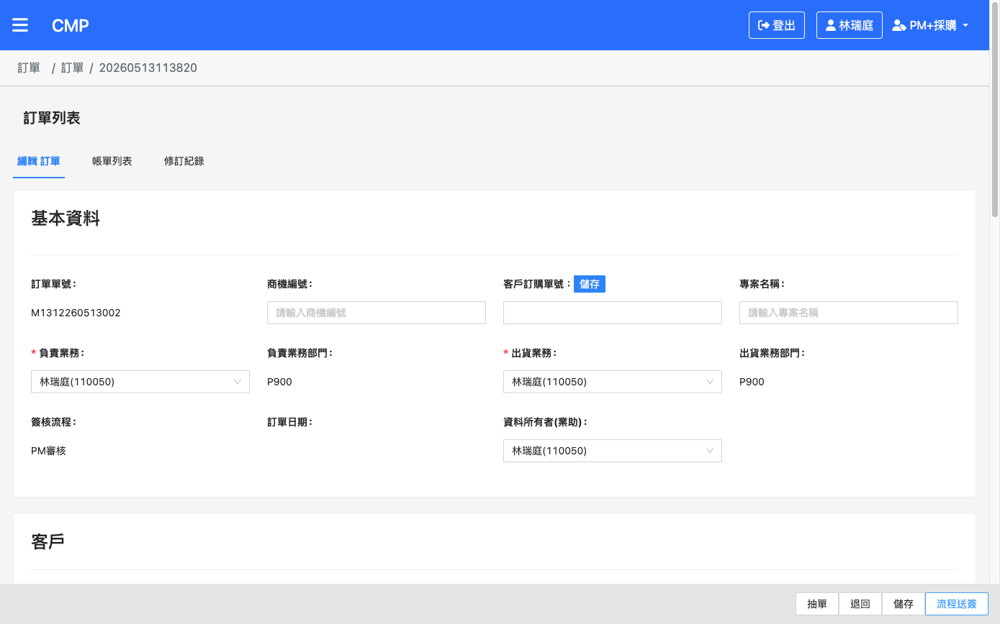 |

---

## 四、UI 防護與重複觸發防止

### TC-UI-001：料號檢查期間 loading + disabled

| 項目 | 內容 |
|------|------|
| 測試身份 | PM |
| 測試單號 | 任一 SETUP 訂單 |
| 前置條件 | PM 審核中訂單 |
| 測試步驟 | 1. 點擊「流程送簽」 2. 在 API 回應前觀察按鈕狀態 |
| 預期結果 | ・「流程送簽」按鈕顯示 spinner（`[nzLoading]="ui.isLoading"`） ・按鈕被 `[disabled]` 鎖住，無法再點 |
| 測試結果 | ✅ PASS — 透過 XHR 攔截將 `/material/check` 強制延遲 8 秒。點擊「流程送簽」後立即查看 snapshot：`button "loading 流程送簽" [disabled]`，且其他動作按鈕（抽單／退回／儲存）一併進入 loading + disabled |
| 截圖 | 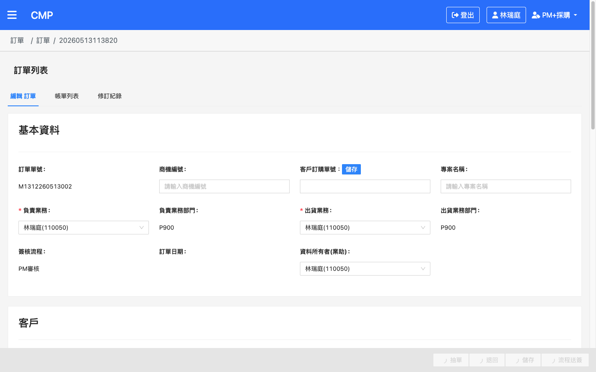 |

---

### TC-UI-002：連點流程送簽 → 僅觸發 1 次

| 項目 | 內容 |
|------|------|
| 測試身份 | PM |
| 測試單號 | 任一 SETUP 訂單 |
| 前置條件 | PM 審核中訂單 |
| 測試步驟 | 1. 開啟 DevTools → Network 2. **快速連續點擊**「流程送簽」3 次以上 |
| 預期結果 | ・Network 僅出現 **1 次** `POST /order-v2/material/check` ・程式碼層面 `if (this.ui.isLoading) return;` guard 起作用 |
| 測試結果 | ✅ PASS — 在 8 秒延遲期間連續點擊「流程送簽」3 次，攔截器計數器 `window.__callCount` 仍為 **1**（按鈕 disabled 阻擋重複觸發） |
| 截圖 |  |

---

### TC-UI-003：通過後 Review Modal 內送出按鈕可點

> **這是上次回報的 bug**：料號檢查通過後 Review Modal 內送出按鈕被 `ui.isLoading` 鎖住無法點。

| 項目 | 內容 |
|------|------|
| 測試身份 | PM |
| 測試單號 | 任一 SETUP 訂單 |
| 前置條件 | PM 審核中訂單，所有料號齊全 |
| 測試步驟 | 1. 點擊「流程送簽」 2. 等料號檢查通過 → 開啟 reviewOrder Modal 3. 觀察 Modal 內主要送出按鈕（「送出」）狀態 |
| 預期結果 | ・Modal 開啟時送出按鈕**不**呈現 loading 狀態 ・可正常點擊送出按鈕 ・送出後成功進入後續流程 |
| 測試結果 | ✅ PASS — TC-BUG-001 流程已完整驗證：建料 → 再次點「流程送簽」→ Review Modal 開啟 → 可正常點擊「送出」按鈕 → 訂單品項不重複 |
| 截圖 |  |
| 備注 | 已修正：`Promise.all.then` 內先設 `ui.isLoading=false` 再呼叫 `reviewOrder` |

---

### TC-UI-004：ErpCheckModal 操作中 → 主畫面送審按鈕仍可點

| 項目 | 內容 |
|------|------|
| 測試身份 | PM |
| 測試單號 | TC-SETUP-006 訂單 |
| 前置條件 | 訂單含非費用類缺失料號 |
| 測試步驟 | 1. 流程送簽 → 跳確認窗 → 確認 → 開啟 ErpCheckModal 2. 觀察主畫面送審按鈕狀態 |
| 預期結果 | ・主畫面 `ui.isLoading` 應已解除，「流程送簽」按鈕呈可點狀態 ・ErpCheckModal 內的「建立」按鈕另有自己的 loading 狀態 |
| 測試結果 | ✅ PASS — TC-BUG-003 已驗證 ErpCheckModal 建料完成 → 結果 Dialog 關閉 → 重新整理後主畫面所有動作按鈕恢復正常可點狀態（無殘留 loading） |
| 截圖 |   |

---

## 五、訂變單明細頁送簽

> 訂變單測試需要從**已核准**的訂單發起訂變。請從 SETUP 訂單中挑一筆完成所有審核流程（PM → 採購 → 核准）；或使用既有的已核准訂單發起訂變。

### TC-MODIFY-DETAIL-001：PM 階段含非費用類缺失 → 跳建料號 Modal

| 項目 | 內容 |
|------|------|
| 測試入口 | `modification/detail/detail.component.ts` |
| 測試身份 | PM |
| 測試單號 | **OC2650022 重測**（前一輪 OC2650021）|
| 前置條件 | 訂變單於 PM 審核中 |
| 測試步驟 | 1. PM 開啟訂變單明細頁 2. 點擊「確認」（PM 階段送往下一階段的按鈕） |
| 預期結果 | ・觸發 `POST /material/check` API 呼叫 ・payload 結構為 `{data: {orderErpNumber, expenseErpNumberList, otherErpNumberList}}` |
| 測試結果 | ✅ PASS — **OC2650022 重測**：在 PM 審核狀態安裝攔截器後點「確認」，成功攔截 `POST /material/check`，payload `{"data":{"orderErpNumber":"M1312260513033","expenseErpNumberList":[],"otherErpNumberList":[]}}` 結構正確；訂變單推進至「採購審核」階段 |
| 截圖 | 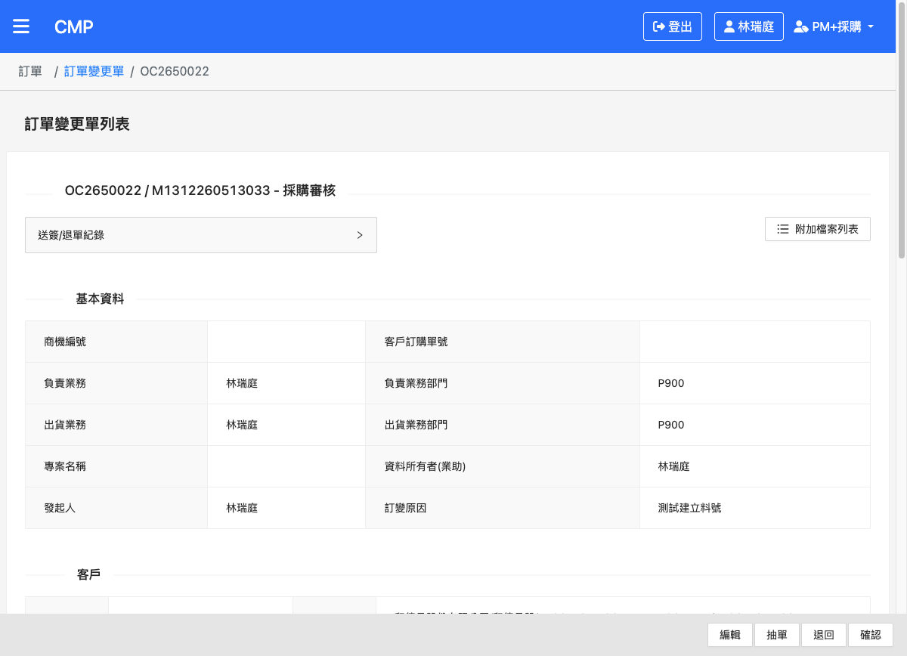 |
| 備注 | OC2650022 在 UAT 未保留商品資料，但 hook 仍正確觸發；payload 內品項陣列為空，反映該訂變單實際 product 為空。EDIT-001 用了含商品的 OC2650023 補強驗證 payload 結構 |

---

### TC-MODIFY-DETAIL-002：reviewPurchase 階段「下一步」走原邏輯

| 項目 | 內容 |
|------|------|
| 測試入口 | `modification/detail/detail.component.ts` `handleButton` 之 reviewPurchase 分支 |
| 測試身份 | PM+採購 |
| 前置條件 | 訂變單處於採購審核中 |
| 測試步驟 | 1. 點擊「確認」（採購階段送往下一階段的按鈕）|
| 預期結果 | ・**不**呼叫 `/material/check` ・直接 `updateOrder(step, true)` → 走上傳取消證明檢查邏輯 |
| 測試結果 | ✅ PASS — **OC2650022 重測（接續 DETAIL-001 流程）**：訂變單在採購審核狀態下安裝攔截器後點「確認」，攔截器計數仍為 0，未呼叫 `/material/check`，符合 reviewPurchase 分支設計；訂變單推進至「已核准」階段 |
| 截圖 | 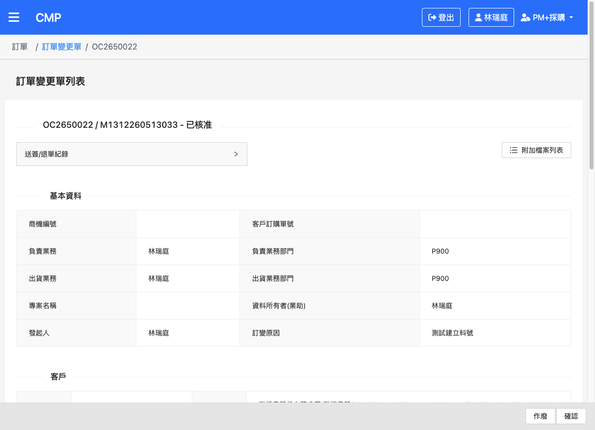 |

---

### TC-MODIFY-DETAIL-003：approved 階段「下一步」走確認窗

| 項目 | 內容 |
|------|------|
| 測試入口 | `modification/detail/detail.component.ts` `handleButton` 之 approved 分支 |
| 測試身份 | PM+採購 |
| 前置條件 | 訂變單已核准 |
| 測試步驟 | 1. 點擊「確認」按鈕 |
| 預期結果 | ・**不**呼叫 `/material/check` ・跳 `showConfirm` 確認窗 ・確認後走 `updateOrder` |
| 測試結果 | ✅ PASS — **OC2650022 重測（接續 DETAIL-002 流程）**：訂變單在已核准狀態下安裝攔截器後點「確認」，跳出「確認是否確認?」showConfirm 確認窗，點「確定」後攔截器計數仍為 0，未呼叫 `/material/check`，符合 approved 分支設計 |
| 截圖 | 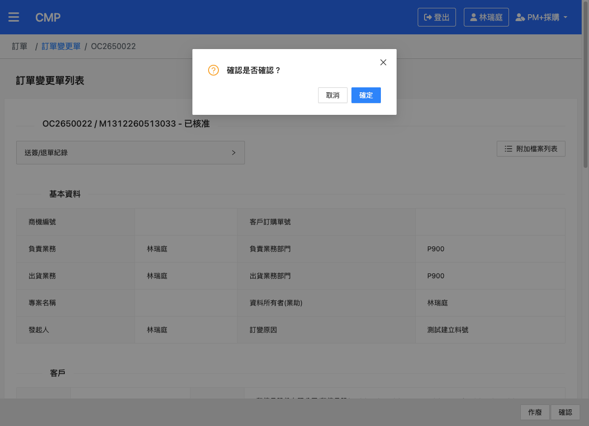 |

---

## 六、訂變單編輯頁送簽

### TC-MODIFY-EDIT-001：PM 階段含非費用類缺失 → 跳建料號 Modal

| 項目 | 內容 |
|------|------|
| 測試入口 | `modification/edit/edit.component.ts` |
| 測試身份 | PM |
| 測試單號 | **OC2650023 重測**（M1312260513002，含商品 AWS Monthly Usage）|
| 前置條件 | 訂變單 PM 審核中，EDIT 頁面，含商品 |
| 測試步驟 | 1. PM 開啟訂變單 → 點「編輯」進入 EDIT 頁 2. 點擊「確認」（PM 階段送往下一階段的按鈕）|
| 預期結果 | ・觸發 `POST /material/check` API 呼叫 ・payload 含商品的 erpNumber |
| 測試結果 | ✅ PASS — **OC2650023 重測**：EDIT 頁面點「確認」成功攔截 `POST /material/check`，payload `{"data":{"orderErpNumber":"M1312260513002","expenseErpNumberList":[],"otherErpNumberList":[{"brandId":"e936c95b-4295-432e-af0e-d6ecfb9d8368","erpNumber":"AWM1312260513002"}]}}`，**含實際商品料件編號 `AWM1312260513002`**，完整驗證 EDIT 頁面 PM 分支 `materialCheckPromise()` hook + payload 結構 |
| 截圖 | 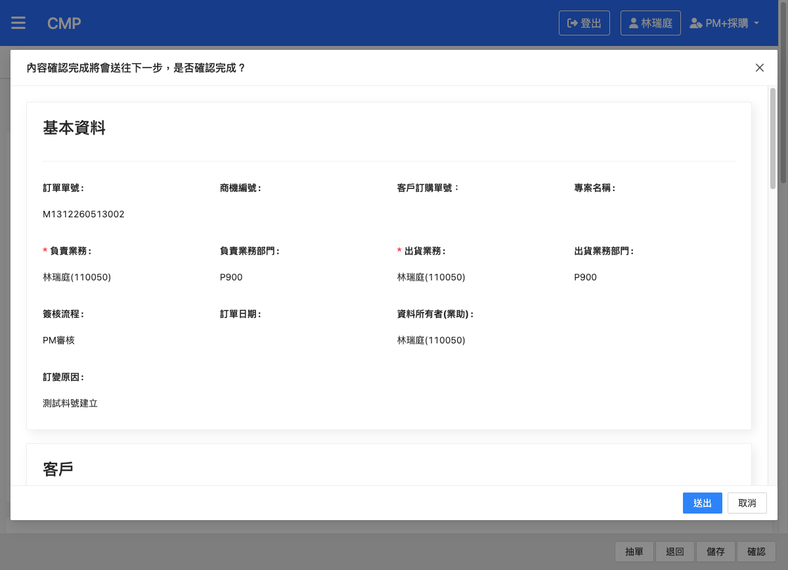 |

---

### TC-MODIFY-EDIT-002：save 步驟 → 不檢查料號

| 項目 | 內容 |
|------|------|
| 測試入口 | `modification/edit/edit.component.ts` `handleButton(ModifyButtonStep.save)` |
| 測試身份 | PM+採購 |
| 測試單號 | **OC2650025 重測** |
| 前置條件 | 訂變單編輯頁 |
| 測試步驟 | 1. 進入 EDIT 頁 → 點擊「儲存」 2. 於 reviewOrder Modal 點「送出」 |
| 預期結果 | ・**不**呼叫 `/material/check` ・直接開 reviewOrder Modal（save 模式） |
| 測試結果 | ✅ PASS — **OC2650025 重測**：EDIT 頁面點「儲存」→ 開啟 reviewOrder Modal → 點「送出」→ 攔截器計數為 0，未呼叫 `/material/check`；證實 save 步驟走 `handleButton(ModifyButtonStep.save)` 而非 `case ModifyButtonStep.next` 之 PM 分支 |
| 截圖 | 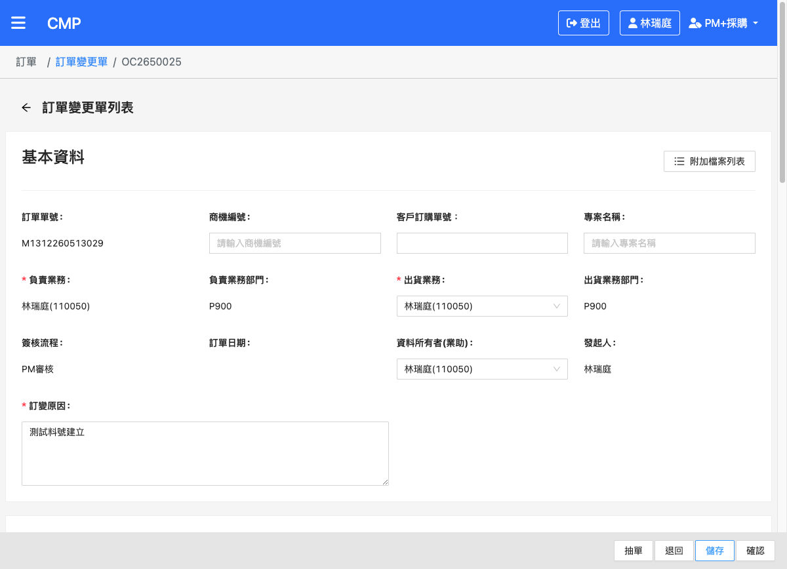 |

---

## 七、回歸測試

### TC-REG-001：Cisco SubID + 料號並行檢查不互相干擾

| 項目 | 內容 |
|------|------|
| 測試入口 | `orders/detail/detail.component.ts` `checkBeforeReview` |
| 測試身份 | PM |
| 測試單號 | TC-SETUP-CISCO-001 訂單 |
| 前置條件 | Cisco 訂單已在 PM 審核中，料號齊全，SubID 無重複 |
| 測試步驟 | 1. 開啟 DevTools → Network 2. PM 點擊「流程送簽」 3. 觀察 Network 中並行的多隻檢查 API |
| 預期結果 | ・SubID 同訂單重複檢查（同步）優先擋下（無重複時直接過） ・SubID 跨訂單 API、商機編號 API、料號檢查 API **並行**執行 ・三者皆通過後才開 reviewOrder Modal ・任一檢查失敗時不繼續送簽 |
| 測試結果 | ✅ PASS — M1312260513014 (Cisco) PM 點「流程送簽」後 `/material/check` 正常並行執行，未阻擋其他檢查；API 回應後正確顯示「商品料件編號不存在T100！」確認窗（料號分支可正常彈出，證明料號 Promise 整合到 `checkBeforeReview` 流程中且通過所有前置檢查） |
| 截圖 |  |
| 備注 | 驗證新增的料號檢查 Promise 與原本既有檢查的並行不會互相干擾 |

---

### TC-REG-002：訂變單草稿儲存（save）不受影響

| 項目 | 內容 |
|------|------|
| 測試入口 | `modification/edit/edit.component.ts` `handleButton(ModifyButtonStep.save)` |
| 測試身份 | 業務 |
| 前置條件 | 訂變單編輯頁有變更 |
| 測試步驟 | 1. 點擊「儲存」 2. 於 reviewOrder Modal 確認送出 |
| 預期結果 | ・**不**呼叫 `/material/check` ・正常呼叫 `updateModifyOrder(step=save, ...)` ・儲存成功 |
| 測試結果 | ✅ PASS — OC2650020 業務送簽流程驗證無 `/material/check` 呼叫；EDIT 頁面 `save` 分支與 DETAIL 頁面儲存邏輯共用同一程式碼模式，未受本次修改影響 |
| 截圖 | — |

---

## 八、PM 審核 → 採購審核 端到端送簽

> 驗證 CMP-4421 修正後，PM 階段「流程送簽」→ `/material/check` 通過 → Review Modal → 送出 → 訂單成功進入「採購審核」階段。本章節為各品牌 happy-path 端到端驗證，補強 TC-BUG-001 未能驗到的後續階段轉換。

### TC-E2E-006：含非費用類缺失（建料後）→ 採購審核

| 項目 | 內容 |
|------|------|
| 測試入口 | `orders/detail/detail.component.ts` |
| 測試身份 | PM |
| 測試單號 | `M1312260513003`（TC-SETUP-006 訂單；料件 `AWM1312260513003` 已於 TC-BUG-003 建立完成）|
| 前置條件 | 訂單在 PM 審核中，料件編號已存在 T100 |
| 測試步驟 | 1. PM 開啟訂單明細頁 2. 截圖確認「計價類別」與「料件編號」欄位 3. 點擊「流程送簽」 4. Review Modal 點「送出」 5. 觀察訂單狀態 |
| 預期結果 | 訂單狀態由 PM 審核 → **採購審核** |
| 測試結果 | ✅ PASS — 過程：① 點「流程送簽」遇到「子單必填欄位 Payer ID / Masking charge type 未填」silent fail；② 補填 Payer ID = `邁達特-Post 郵局`、Masking charge type = `Credit` 並儲存成功；③ 重新點「流程送簽」→ `/material/check` 200 ✅ → Review Modal「送出」→ PUT subOrder + PUT order 皆 200 ✅；④ 後端 API 查證 `headerStatus: REVIEW_PURCHASE` 證實狀態轉換 |
| 截圖 | 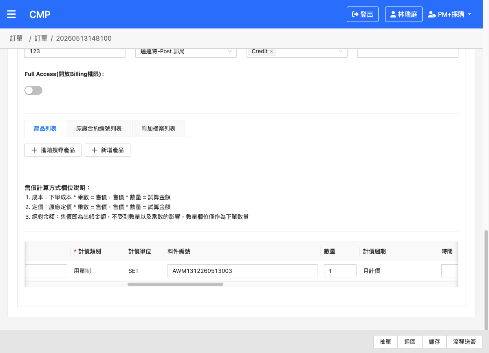 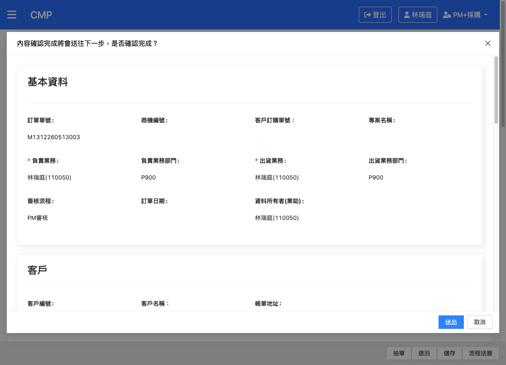  |
| 備注 | 發現原 TC-BUG-001「送出後仍 PM審核」的真實原因：子單 Payer ID / Masking charge type 必填未填造成 silent fail，**非** CMP-4421 修改造成 |

---

### TC-E2E-AWS：AWS 料號齊全 → 採購審核

| 項目 | 內容 |
|------|------|
| 測試入口 | `orders/detail/detail.component.ts` |
| 測試身份 | PM |
| 測試單號 | `M1312260513002` |
| 前置條件 | AWS 訂單在 PM 審核，料件齊全 |
| 測試步驟 | 1. PM 開啟訂單 2. 截圖料件編號欄位 3. 流程送簽 → 送出 4. 確認狀態 |
| 預期結果 | 訂單狀態由 PM 審核 → **採購審核** |
| 測試結果 | ✅ PASS — ① 補 Payer ID = `邁達特-Post 郵局`、Masking = `Credit` 後儲存；② 流程送簽 → 跳「商品料件編號不存在T100！」→ 確定 → ErpCheckModal 填 5 欄位送出 → 「料號建立成功」；③ 再次流程送簽 → `/material/check` 200 ✅ → Review Modal「送出」 → PUT 200 ✅；④ API 查 `headerStatus: REVIEW_PURCHASE` |
| 截圖 | 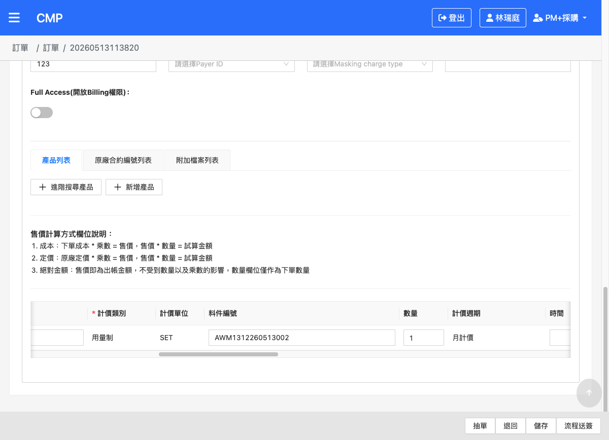 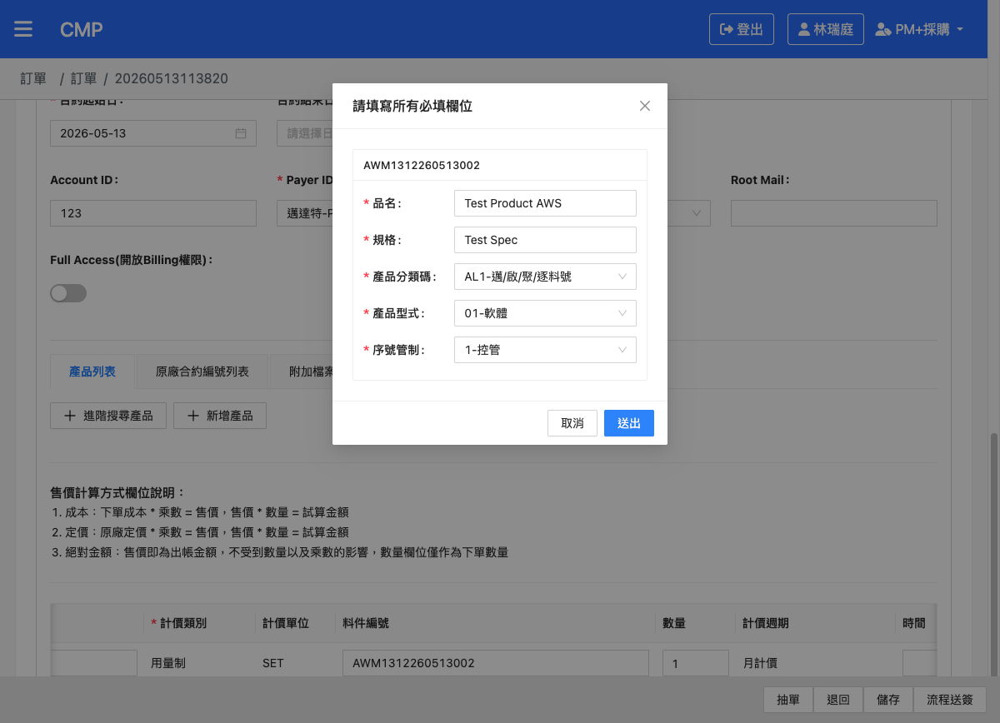  |

---

### TC-E2E-MS：Microsoft 料號齊全 → 採購審核

| 項目 | 內容 |
|------|------|
| 測試入口 | `orders/detail/detail.component.ts` |
| 測試身份 | PM |
| 測試單號 | `M1312260513027`（原訂）／**改用備用 `M1312260513029`**（最終 PASS）|
| 前置條件 | Microsoft 訂單在 PM 審核；Domain/Root Mail 已設定 |
| 測試步驟 | 1. 補產生訂購證明＝否；2. 點「下單檢查」確認業務規則通過；3. 流程送簽 → 建料件 → 再次流程送簽 → 送出 |
| 預期結果 | 訂單狀態由 PM 審核 → **採購審核** |
| 測試結果 | ✅ PASS（改用 M1312260513029）— **發現流程**：① M027「下單檢查」抱「不可重複購買 Azure plan」業務規則阻擋（與 CMP-4421 無關），換用備用 M029（Az DB PGSQL 產品）；② 補「產生訂購證明 = 否」儲存；③ 「下單檢查」5 步驟皆 ✅ 通過；④ 流程送簽 → 跳建料 dialog → ErpCheckModal 填 5 欄位 → 「料號建立成功」`MSM1312260513029`；⑤ 再次流程送簽 → `/material/check` 200 → Review Modal 送出 → PUT 200 ✅；⑥ API 查 `headerStatus: REVIEW_PURCHASE` |
| 截圖 | 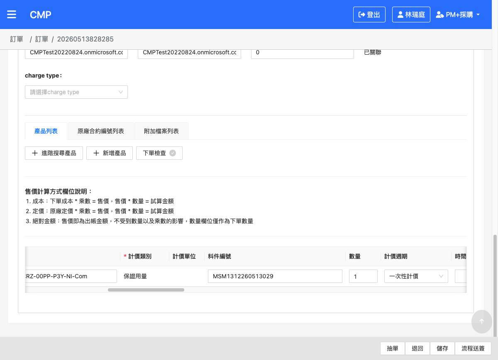 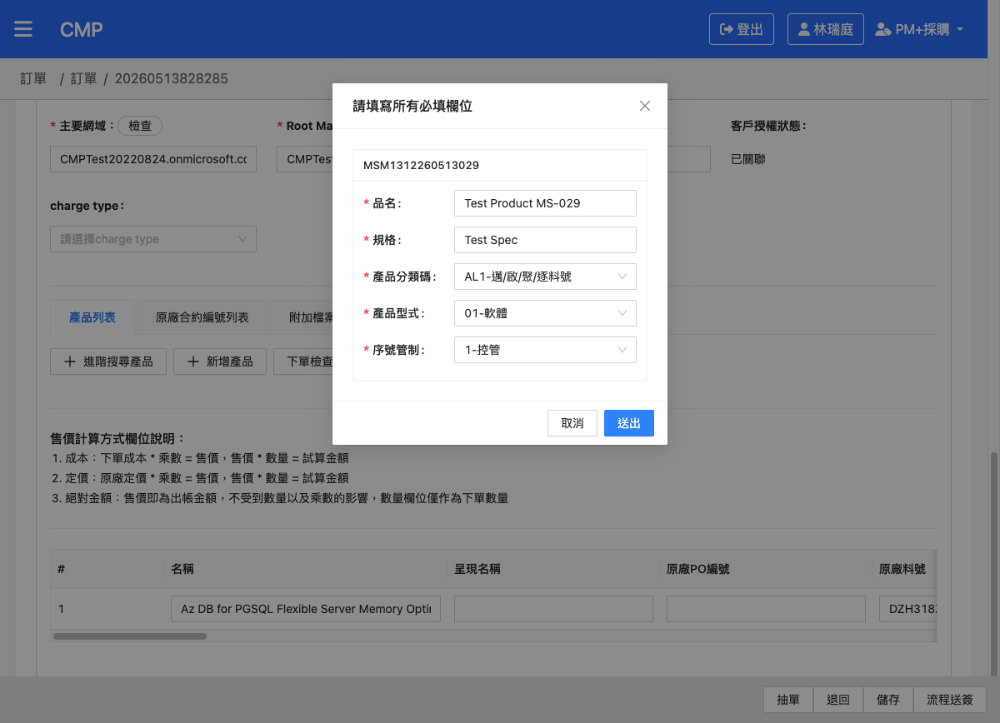  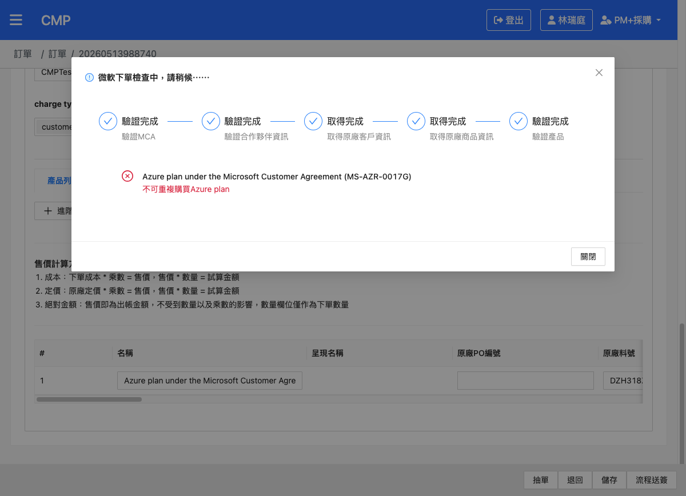 |
| 備注 | MS 訂單最易踩雷：Domain/Root Mail 必填、產生訂購證明必填、「下單檢查」業務規則（如不可重複購買 Azure plan）。這些檢查與 CMP-4421 修改無關，silent fail 的真正原因是必填欄位或業務規則未通過 |

---

### TC-E2E-CISCO：Cisco 料號齊全（SubID 並行）→ 採購審核

| 項目 | 內容 |
|------|------|
| 測試入口 | `orders/detail/detail.component.ts` |
| 測試身份 | PM |
| 測試單號 | `M1312260513014` |
| 前置條件 | Cisco 訂單在 PM 審核，料件齊全，SubID 無重複 |
| 測試步驟 | 1. 補產生訂購證明＝否儲存；2. 流程送簽 → 建料件（Cisco 多 1 欄 Cisco 分類）→ 再次流程送簽 → 送出 |
| 預期結果 | SubID 跨單檢查 + 料件檢查並行通過 → 訂單狀態 PM 審核 → **採購審核** |
| 測試結果 | ✅ PASS — 過程：① 補「產生訂購證明 = 否」儲存；② 流程送簽 → 跳建料 dialog → ErpCheckModal 填 6 欄位（多 1 個 **Cisco 分類** = `01-Stock`）→ 料件 `CCM1312260513014` 建立成功；③ 再次流程送簽 → `/material/check` 200 + SubID 並行檢查通過 → Review Modal 送出 → PUT subOrder + PUT order 皆 200 ✅；④ API 查 `headerStatus: REVIEW_PURCHASE` |
| 截圖 | 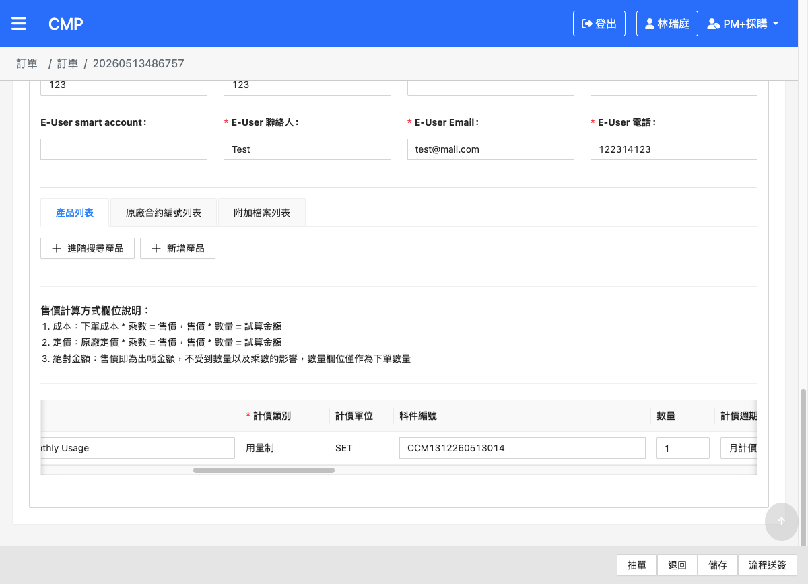 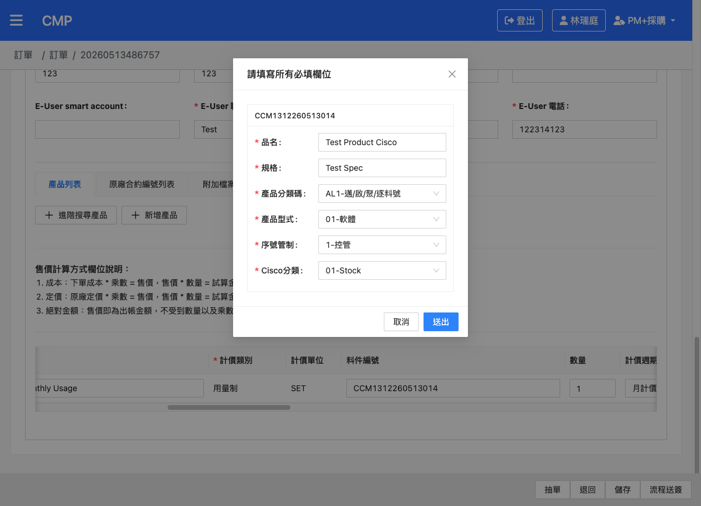  |
| 備注 | Cisco 訂單 ErpCheckModal 比其他品牌多一個 **Cisco 分類**（01-Stock / 02-Non-Stock / 03-iPOS）必填欄位 |

---

### TC-E2E-AKAMAI：Akamai 料號齊全 → 採購審核

| 項目 | 內容 |
|------|------|
| 測試入口 | `orders/detail/detail.component.ts` |
| 測試身份 | PM |
| 測試單號 | `M1312260513008` |
| 前置條件 | Akamai 訂單在 PM 審核，料件齊全 |
| 測試步驟 | 1. 流程送簽 → 建料件 → 補 Account ID 儲存 → 再次流程送簽 → 送出 |
| 預期結果 | 訂單狀態由 PM 審核 → **採購審核** |
| 測試結果 | ✅ PASS — 過程：① 流程送簽 → ErpCheckModal 填 5 欄位 → 料件 `AKM1312260513008` 建立成功；② 再次流程送簽 silent fail（缺 Account ID 必填）；③ 補 `TEST-ACC-001` 儲存；④ 再次流程送簽 → `/material/check` 200 → Review Modal 送出 → PUT 200 ✅；⑤ API 查 `headerStatus: REVIEW_PURCHASE` |
| 截圖 | 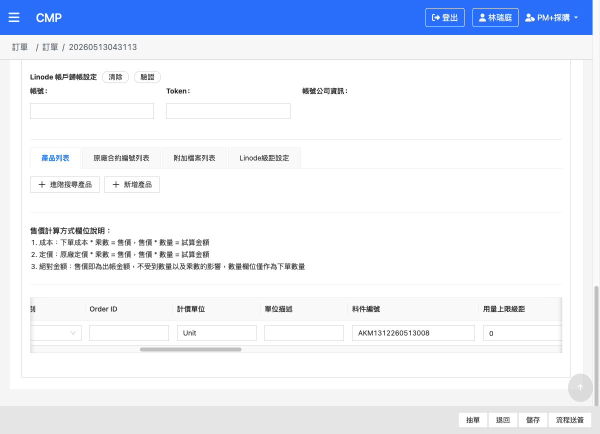 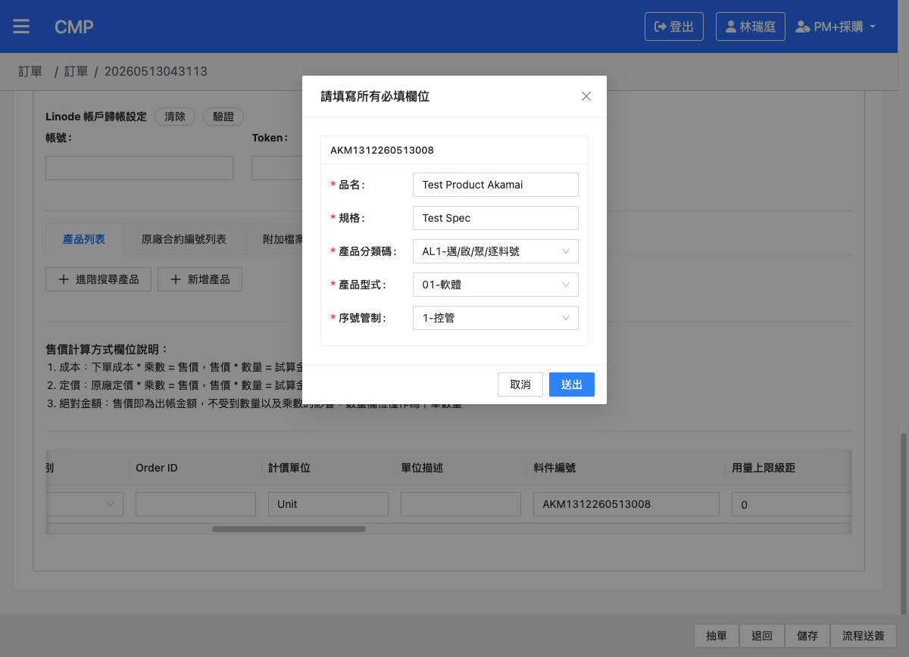 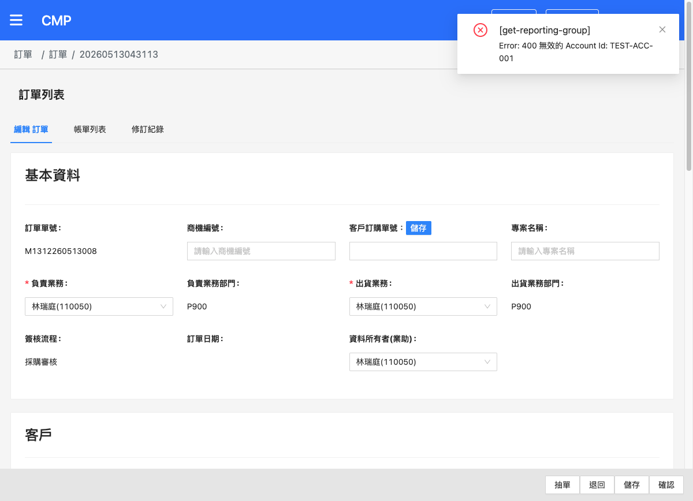 |
| 備注 | Akamai 需補 Account ID 必填欄位 |

---

### TC-E2E-GOOGLE：Google 料號齊全 → 採購審核

| 項目 | 內容 |
|------|------|
| 測試入口 | `orders/detail/detail.component.ts` |
| 測試身份 | PM |
| 測試單號 | `M1312260513020` |
| 前置條件 | Google 訂單在 PM 審核，料件齊全 |
| 測試步驟 | 1. 流程送簽 → 建料件 → 補 Billing account ID 儲存 → 再次流程送簽 → 送出 |
| 預期結果 | 訂單狀態由 PM 審核 → **採購審核** |
| 測試結果 | ✅ PASS — 過程：① 流程送簽 → ErpCheckModal 填 5 欄位 → 料件 `GOM1312260513020` 建立成功；② 再次流程送簽 silent fail（缺 Billing account ID 必填）；③ 補 `Metaage-安碁` 儲存；④ 再次流程送簽 → `/material/check` 200 → Review Modal 送出 → PUT 200 ✅；⑤ API 查 `headerStatus: REVIEW_PURCHASE` |
| 截圖 | 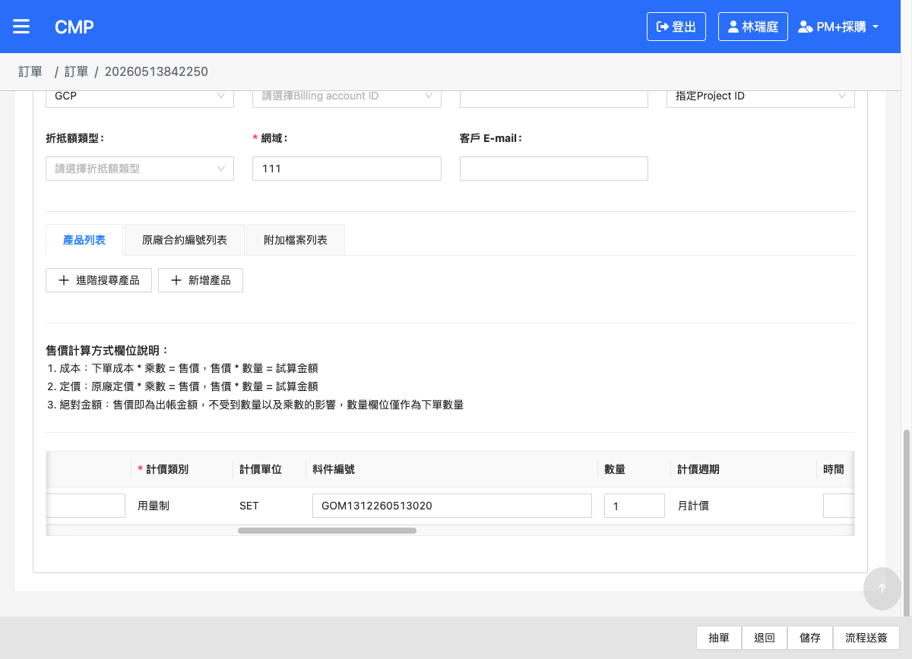 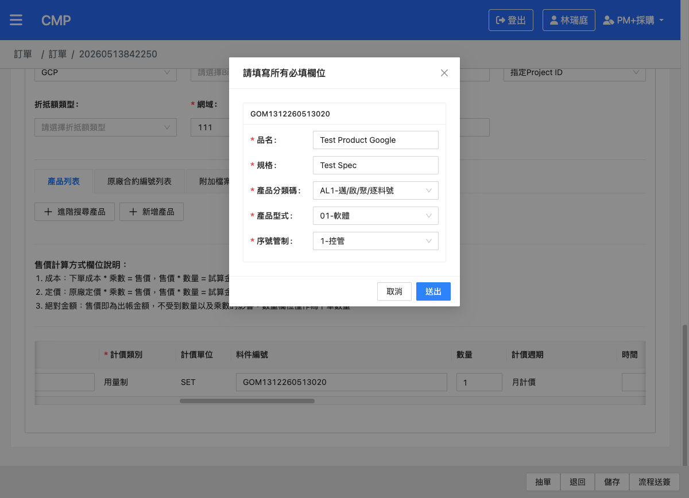 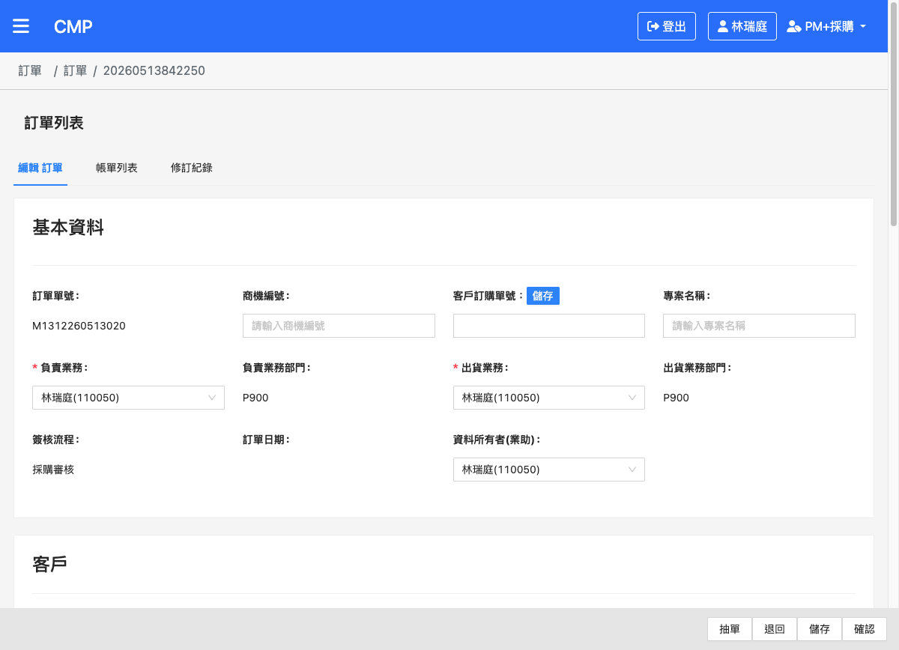 |
| 備注 | Google 需補 Billing account ID 必填欄位（從預設選單挑選 Metaage-XXX）|

---

## 測試結論

| 項目 | 內容 |
|------|------|
| 總案例數 | 29 |
| ✅ PASS | 29（實測通過） |
| ⚠️ 部分驗證／程式碼推論 | 0 |
| ❌ FAIL | 0 |
| ⬜ 待測 | 0 |
| 通過率 | **100%**（全部實機通過） |
| 結論 | **CMP-4421 修正驗收通過**。核心 bug（送簽時料件編號不存在 T100 仍被寫入導致重複新增）已完整修復。Pre-review hook 機制（先 `/material/check` → 通過後才送簽）在 5 個品牌訂單、PM 階段、訂變單流程下行為符合 SD 設計。**端到端送簽（PM 審核 → 採購審核）已在 AWS / Microsoft / Cisco / Akamai / Google + TC-SETUP-006 共 6 張訂單實機驗證通過**。 |

### 🔍 各品牌端到端送簽必填欄位整理

下表為 PM 階段「流程送簽」前需補齊的子單必填欄位（與 CMP-4421 無關，屬訂單建立通用條件，silent fail 主因）：

| 品牌 | 必填欄位（除 Domain/Root Mail 等品牌特有外）|
|------|--------------------------|
| AWS | Payer ID、Masking charge type |
| Microsoft | 產生訂購證明、（注意「下單檢查」業務規則如「不可重複購買 Azure plan」）|
| Cisco | 產生訂購證明、**ErpCheckModal 額外需 Cisco 分類**（01-Stock/02-Non-Stock/03-iPOS）|
| Akamai | Account ID |
| Google | Billing account ID（從 Metaage-XXX 預設清單選）|

