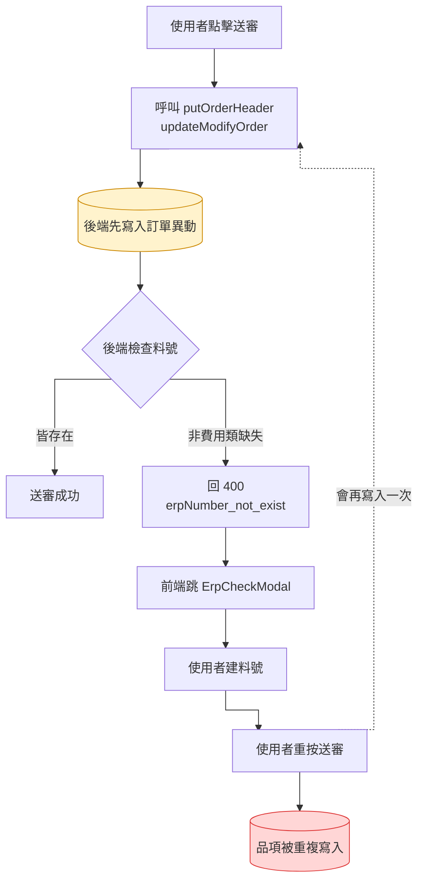
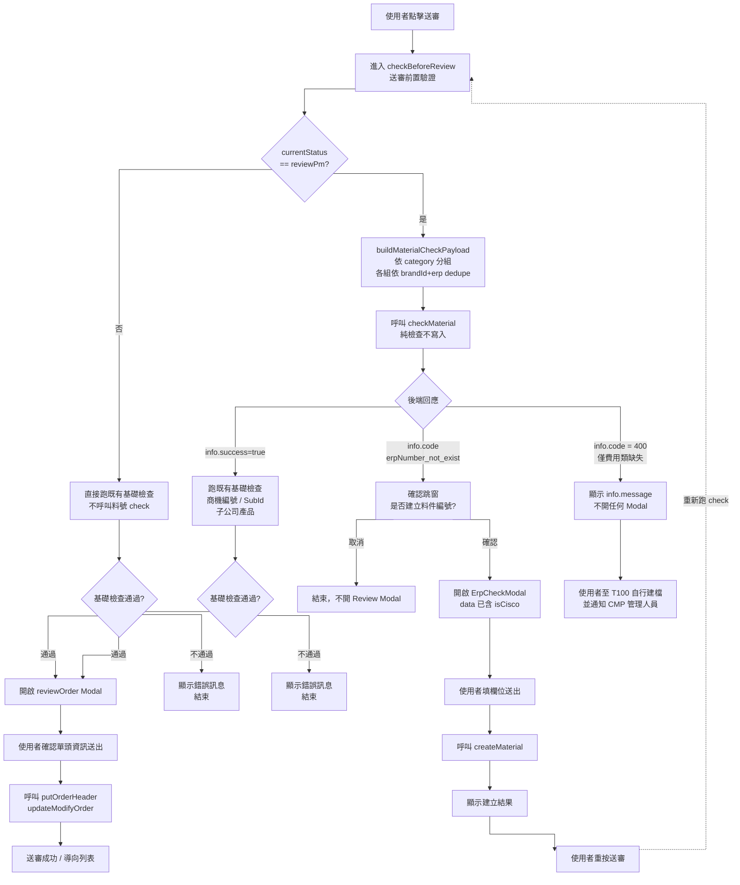
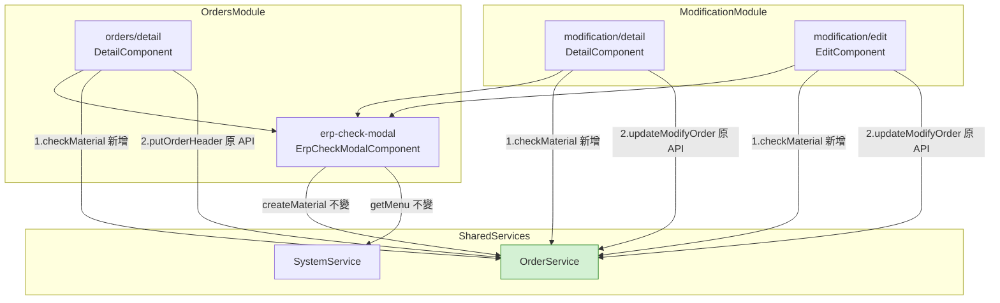
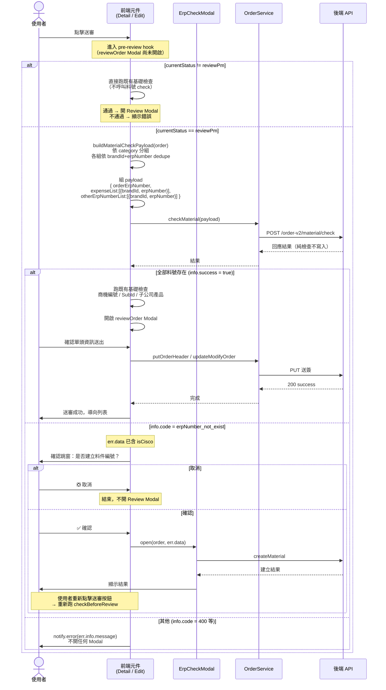

## 修訂紀錄

| **版本** | **日期** | **修訂內容** | **修訂者** |
| --- | --- | --- | --- |
| v1.0 | 2026-05-12 | 初始化文件（Bug 修正：送簽料號檢查改為獨立 API） | Raelynn |
| v1.1 | 2026-05-12 | 依 CMP-4421 後端 comment 對齊實際 API 格式：Request 改為物件結構（含 `orderErpNumber` / `brandId` / 費用類與非費用類分組清單），「僅費用類缺失」error code 由 `expense_erpNumber_invalid` 改為通用 `400`；相應調整前端料號收集 helper 與呼叫端 | Raelynn |
| v1.2 | 2026-05-12 | 兩項調整：① 前端料號檢查改在 `checkBeforeReview`（reviewOrder Modal 之前）執行，原 `saveOrderHeader` 入口不再攔截；② Request 結構再次更新——`brandId` 從頂層移除，改為每筆料號自帶（`expenseList: [{brandId, erpNumber}]` / `otherErpNumberList: [{brandId, erpNumber}]`），同時自然支援多品牌訂單 | Raelynn |
| v1.3 | 2026-05-12 | 依 review 意見調整：① 介面 `MaterialErpItem` / `MaterialCheckPayload` 放 `core/models/orders.ts`；② helper `buildMaterialCheckPayload` 放 `orders/model/data-tool.component.ts`（三元件繼承共用）；③ 料號收集**不**排除 `connotation` 內含品，只依費用 / 非費用分組；④ 料號檢查改為「`currentStatus === reviewPm` 才執行」、且**先於**基礎檢查（`Promise.all`）；錯誤處理 inline 不另拆方法 | Raelynn |

## 相關 Jira 單

| 單號 | 標題 | 角色 |
| --- | --- | --- |
| CMP-4421 | 訂單/訂變單：送簽遇到料號不存在時，會導致品相被重複新增（前端） | 本 SD 主單 |
| CMP-4416 | 訂單/訂變單：送簽遇到料號不存在時，會導致品相被重複新增（後端） | 後端對應單 |
| CMP-4308 | 訂單：主動建立料號（前端） | 既有功能，本次調整其檢查流程 |
| CMP-4119 | 訂單：主動建立料號（後端） | 既有功能 |

## 目錄

1. 目標
2. Bug 根因分析
3. 修正方向
4. 實作架構設計
   * 4.1 系統流程圖（新舊對比）
   * 4.2 元件關係圖
   * 4.3 序列圖
5. 實作
   * 5.1 後端 API contract
   * 5.2 修改檔案
6. 影響範圍分析
7. 注意事項與測試重點

---

## 1. 目標

修正 CMP-4308 上線後使用者 Mina 反應之缺陷：**在 PM 審核階段新增費用類品項並送簽時，若遇到料號需建立的流程，最終會導致該品項被重複寫入訂單**。

修正方式：將原本綁在送簽 API 內的「料號檢查」拆出，獨立成一支純檢查（不寫入）API；前端在送簽前先呼叫此 API 並依結果決定是否進入建料號流程或繼續送簽，避免送簽 API 在檢查失敗時提早寫入訂單資料。

---

## 2. Bug 根因分析


CMP-4308 將「料號是否存在於 T100」的檢查實作於送簽 API 之內：

* `PUT /order-v2/orders/{id}`（訂單送審）
* `PUT /order-v2/order/modify/{id}`（訂變單送審）

後端流程為：

1. 收到 PUT 請求 → **先儲存訂單異動內容（含新增的費用類品項）至 DB**
2. 接著檢查訂單品項的料號是否皆存在於 T100
3. 若有非費用類料號不存在 → 回 `400 erpNumber_not_exist` + 待建清單
4. 前端攔截錯誤碼 → 跳 `ErpCheckModal` → 建料號 API → 使用者**自行重按送

送簽 API 將「寫入」與「檢查」綁在同一個交易裡執行，且寫入發生在檢查之前；任何讓使用者「回頭補資料再重送」的設計，都會造成重送時的二次寫入。

正確設計應為「**先檢查（不寫入），通過後才送簽（寫入）**」。

---

## 3. 修正方向

依 PM 與後端討論結論（記錄於 CMP-4421 / CMP-4416 描述）：

### 3.1 後端（CMP-4416，已上 DEV）

1. 新增 `POST /order-v2/material/check`，**僅檢查不寫入**訂單。
2. Request 由前端**先依 `category` 分組為費用類 / 非費用類**後傳入；每筆料號自帶 `brandId`，自然支援多品牌訂單：
   * `orderErpNumber`：當前訂單單號（來源 `order.header.orderErpNumber`）。
   * `expenseList`：費用類料號（`OrderProduct.category === 'EXPENSE'`）陣列，每筆為 `{ brandId, erpNumber }`。
   * `otherErpNumberList`：非費用類料號陣列，每筆為 `{ brandId, erpNumber }`。
3. **error code 僅區分兩種**：
   * **包含非費用類料號缺失** → `info.code = 'erpNumber_not_exist'`，`data` 為待建料號陣列（含後端依 `brandId` 計算後給出的 `isCisco` 旗標）→ 前端走建料號流程。
   * **僅費用類缺失** → `info.code = '400'`（通用），`data = null`，`info.message` 帶有完整費用類缺失料號文字 → 前端僅顯示通知。
4. 原 `PUT orders/{id}` / `PUT order/modify/{id}` **不再做料號檢查**（料號檢查邏輯完全移轉到新 API）。

### 3.2 前端（CMP-4421，本 SD 範圍）

1. 新增 `OrderService.checkMaterial(payload)` 對應後端新 API。
2. **料號檢查觸發條件**：當前訂單狀態為 PM 審核（`currentStatus === reviewPm`）才執行；其他狀態（草稿、業助、採購審核、已核准等）皆不呼叫。
3. **執行順序**：料號檢查**先於**既有基礎檢查；料號通過 → 跑既有檢查 → 全過才開 reviewOrder Modal。
4. 三入口的觸發點：
   * `orders/detail`：`checkBeforeReview(step)` 內最上方判斷 `currentStatus === ApprovalStatus.reviewPm`；是 → 先料號檢查 → 通過後跑既有 `Promise.all` 基礎檢查 → 全過於 `.then` 內直接呼叫 `reviewOrder('review', step)`；否 → 直接走既有 `Promise.all` 邏輯。
   * `modification/detail`：`handleButton` 內 `ModifyButtonStep.next` 分支最上方判斷 `currentStatus === ModifyOrderStatus.reviewPm`；是 → 先料號檢查 → 通過後再走原本三條 `updateOrder` 路徑；否 → 直接走既有路徑。
   * `modification/edit`：`handleButton` 內 `ModifyButtonStep.next` 分支最上方判斷 `currentStatus === ModifyOrderStatus.reviewPm`；是 → 先料號檢查 → 通過後 `reviewOrder(step, this.order)`；否 → 直接 `reviewOrder`。
5. 料號收集邏輯（`buildMaterialCheckPayload`）：
   * 走遍 `order.body[*].products[*]`，**僅依 `category === 'EXPENSE'` 分組**為費用類 / 非費用類。
   * **不**排除 `connotation` 內含品：依需求補充，所有 `erpNumber` 都列出即可。
   * 各組內以 `Map<brandId|erpNumber, item>` 合併（dedupe），key 採 `(brandId, erpNumber)` 組合。
   * 跳過空白 `erpNumber`。
   * 每筆 `brandId` 取自所屬子單 `sub.brand.id`。
6. 依 check API 結果決定後續行為：
   * **通過**（`info.success = true`）→ 進入既有 pre-review 檢查 / Review Modal 流程，**完全不動原本送簽邏輯**（`putOrderHeader` / `updateModifyOrder` 不再需要 `fullError` 模式）。
   * **`erpNumber_not_exist`** → 取 `err.data`（後端已附 `isCisco`）開啟 `ErpCheckModal`；使用者建立完料號後重按送審 → 重新跑 check。
   * **其他錯誤碼**（含 `info.code === '400'` 的費用類缺失情境）→ `NzNotificationService.error` 顯示 `err.info.message`，不開啟任何 Modal。
   * 錯誤處理 inline 寫在 `checkMaterial.subscribe` 內，**不另拆方法**。

---

## 4. 實作架構設計

### 4.1 系統流程圖（新舊對比）

#### 4.1.1 舊流程（CMP-4308，含 bug）



#### 4.1.2 新流程（CMP-4421，本次修正）




> 圖檔產出方式：使用 `mcp-uml` 或 mermaid CLI 由上方 Mermaid 原始碼匯出 SVG，置於 `diagrams/` 資料夾。

### 4.2 元件關係圖




### 4.3 序列圖




---

## 5. 實作

### 5.1 後端 API contract

> 以下格式依 CMP-4421 後端（jackycheng，2026-05-07）comment 所提供之實際 API 規格。後端已上 DEV。

#### 5.1.1 料號檢核 API

* **Endpoint**：`POST /order-v2/material/check`
* **語意**：純檢查，不對訂單做任何寫入。

**Request：**

```json
{
  "data": {
    "orderErpNumber": "M1312123456789",
    "expenseList": [
      { "brandId": "xxxxxxxxxxxx", "erpNumber": "MISC-ABCDEFG" }
    ],
    "otherErpNumberList": [
      { "brandId": "xxxxxxxxxxxx", "erpNumber": "AWM1312123456789" }
    ]
  }
}
```

| 欄位 | 型別 | 來源 / 說明 |
| --- | --- | --- |
| `orderErpNumber` | string | 訂單單號（`order.header.orderErpNumber`） |
| `expenseList` | `{brandId, erpNumber}[]` | 費用類品項清單（`OrderProduct.category === 'EXPENSE'`）；`brandId` 取所屬子單 `sub.brand.id`；以 `(brandId, erpNumber)` 為 key dedupe |
| `otherErpNumberList` | `{brandId, erpNumber}[]` | 非費用類品項清單；dedupe 規則同上 |

> **欄位命名注意**：`expenseList` 無 `ErpNumber` 後綴，但 `otherErpNumberList` 有；此為後端定義，前端介面對齊即可，不要自行統一。
>
> **多品牌訂單**：每筆料號自帶 `brandId`，原本「單張訂單單一品牌」的假設不再必要；前端按子單品牌逐筆組裝即可。
>
> **isCisco 由後端推導**：前端不需傳 `isCisco`，後端依 `brandId` 自行判斷後，在回應的 `data` 中附帶。

**Response — 全部存在：**

```json
{
  "data": null,
  "info": {
    "success": true,
    "code": "200",
    "message": "...",
    "queryTime": null,
    "exception": null
  },
  "page": null
}
```

**Response — 含非費用類缺失（`info.code = 'erpNumber_not_exist'`）：**

```json
{
  "data": [
    {
      "erpNumber": "AWE1312251210001",
      "isCisco": false
    }
  ],
  "info": {
    "code": "erpNumber_not_exist",
    "message": "料件編號，在T100的資料中不存在或無效，請檢查！",
    "queryTime": null,
    "exception": null,
    "success": false
  },
  "page": null
}
```

> `data` 為待建料號陣列，**每筆已含 `isCisco`**，可直接 cast 為 `ErpProductPayload[]` 傳給 `ErpCheckModal.open()`。
> 注意 `info.code` 為應用層代碼，HTTP status 可能仍是 200/400（依後端統一規則處理；前端以 `info.success` / `info.code` 為準）。

**Response — 僅費用類缺失（`info.code = '400'`）：**

```json
{
  "data": null,
  "info": {
    "code": "400",
    "message": "費用制料件編號：[MISC-ABCDEFG, MISC-GFEDCBA] 在T100不存在或無效，請至T100料件主檔建立！",
    "queryTime": null,
    "exception": null,
    "success": false
  },
  "page": null
}
```

> 此情境 `info.code` 為通用 `400`（非特定碼）。前端的分支判斷邏輯為：
> * `info.code === 'erpNumber_not_exist'` → 開建料號 Modal
> * 其餘任何 `info.success === false` → 直接顯示 `info.message`（涵蓋僅費用類缺失、其他驗證錯誤、伺服器錯誤）

#### 5.1.2 原送簽 API（後端調整後）

* `PUT /order-v2/orders/{id}`、`PUT /order-v2/order/modify/{id}` **不再內含料號檢查邏輯**。
* 即送簽 API 不會再回 `erpNumber_not_exist`。
* 前端因此可移除 `fullError` 模式，回歸標準錯誤處理。

---

### 5.2 修改檔案

#### 5.2.1 `src/app/share/services/order.service.ts`

| 變更 | 說明 |
| --- | --- |
| 新增 `checkMaterial()` | 對應後端 `POST /order-v2/material/check`，純檢查料號是否存在。回傳完整錯誤物件（含 `info.code`、`data`），呼叫端依錯誤碼分支處理。 |
| `putOrderHeader()` 移除 `fullError` 參數 | 不再需要攔截 `erpNumber_not_exist`；保留參數會誤導後續維護，建議直接移除（與 CMP-4308 變更回滾）。若擔心過渡期，可保留參數但呼叫端一律傳 `false`。 |
| `updateModifyOrderWithFullError()` 移除 | 同上理由。`buildModifyOrderRequestData()` 可保留供 `updateModifyOrder` 使用。 |
| `createMaterial()` 不變 | 沿用 CMP-4308 既有實作。 |

**Step 1：介面定義 — 放 `src/app/core/models/orders.ts`**

```typescript
/** 料號檢核 API 的單筆料號項目 */
export interface MaterialErpItem {
  brandId: string;
  erpNumber: string;
}

/** 料號檢核 API request payload */
export interface MaterialCheckPayload {
  /** 訂單單號 */
  orderErpNumber: string;
  /** 費用類料號清單（dedupe by brandId+erpNumber） */
  expenseList: MaterialErpItem[];
  /** 非費用類料號清單（dedupe by brandId+erpNumber） */
  otherErpNumberList: MaterialErpItem[];
}
```

> 介面集中於 `core/models/orders.ts`，與既有 `Order` / `OrderProduct` / `ErpProduct` 等型別同處，便於跨模組匯入且避免循環依賴。

**Step 2：`checkMaterial` 方法 — 加在 `src/app/share/services/order.service.ts`**

```typescript
import { MaterialCheckPayload } from 'src/app/core/models/orders';

/** 料號檢核（純檢查，不寫入訂單） */
checkMaterial(payload: MaterialCheckPayload): Observable<ResponseData> {
  const url = `${environment['apiUrl']}/${this.gateway.order}material/check`;
  return this.http.post<ResponseData>(url, new RequestData(payload)).pipe(
    catchError((error) => {
      if (error.error?.info) {
        return throwError(() => error.error);
      }
      const errorMessage = error.error?.message || error.message || 'Unknown error';
      return throwError(() => new Error(errorMessage));
    }),
  );
}
```

> 與 `putOrderHeader(fullError=true)` 相同的「直接走 HttpClient 以保留完整錯誤物件」模式；用於依 `info.code` 分支處理。

**Step 3：`buildMaterialCheckPayload` helper — 加在 `src/app/orders/model/data-tool.component.ts`**

三入口元件（`orders/detail`、`modification/detail`、`modification/edit`）皆 `extends DataTool`（已驗證於 `data-tool.component.ts` 之 import 鏈），把 helper 作為 `DataTool` 的 protected 方法是最自然的位置：

* 三個元件可直接 `this.buildMaterialCheckPayload(this.order)` 呼叫，無需 import。
* 與既有 `saveTranceNote()` 等共用工具方法並列，符合 `DataTool` 既有設計慣例。
* 不需額外新增 util 檔案，降低 module 變動。

詳細實作見 §5.2.2。

#### 5.2.2 `buildMaterialCheckPayload` helper（加在 `DataTool`）

加在 `src/app/orders/model/data-tool.component.ts` 內，作為 `DataTool` 的 protected 方法供三個 `extends DataTool` 的元件直接呼叫。

```typescript
import { ProductCate } from 'src/app/core/models/commodity';
import {
  MaterialCheckPayload,
  MaterialErpItem,
  Order,
} from 'src/app/core/models/orders';

export class DataTool {
  // ... 既有方法 ...

  /**
   * 從 order 組出料號檢核 API 的 payload
   * - 依 OrderProduct.category === 'EXPENSE' 分組
   * - 各組以 Map<brandId|erpNumber, item> dedupe（同 erpNumber 不同品牌不合併）
   * - 跳過空白 erpNumber
   * - brandId 取自所屬子單 sub.brand.id
   */
  protected buildMaterialCheckPayload(order: Order): MaterialCheckPayload {
    const expenseMap = new Map<string, MaterialErpItem>();
    const otherMap = new Map<string, MaterialErpItem>();

    for (const sub of order.body ?? []) {
      const brandId = sub.brand?.id ?? '';
      for (const p of sub.products ?? []) {
        if (!p.erpNumber) { continue; }
        const key = `${brandId}|${p.erpNumber}`;
        const item: MaterialErpItem = { brandId, erpNumber: p.erpNumber };
        const target = p.category === ProductCate.expense ? expenseMap : otherMap;
        if (!target.has(key)) {
          target.set(key, item);
        }
      }
    }

    return {
      orderErpNumber: order.header?.orderErpNumber ?? '',
      expenseList: Array.from(expenseMap.values()),
      otherErpNumberList: Array.from(otherMap.values()),
    };
  }
}
```

**設計理由說明：**

| 項目 | 決策 | 理由 |
| --- | --- | --- |
| 放在 `DataTool` 而非新 util 檔 | 加為 protected 方法 | 三入口元件都 `extends DataTool`，可直接 `this.buildMaterialCheckPayload(...)`；與 `saveTranceNote()` 等共用工具同處，符合既有慣例 |
| `category === 'EXPENSE'` 判定費用類 | 採用 `ProductCate.expense` 列舉（值為 `'EXPENSE'`） | 既有 [commodity.ts:102-108](src/app/core/models/commodity.ts#L102-L108) 已定義，沿用避免魔術字串 |
| **不**排除 `connotation` 內含品 | 全部料號都列出 | 依需求補充：所有品項的 `erpNumber` 都送檢，依費用類 / 非費用類分組即可；不做內含品篩選邏輯，減少前端假設與分歧 |
| `brandId` 取自所屬子單 | 逐子單取 `sub.brand.id` | 每筆料號自帶 brandId，自然支援多品牌訂單 |
| dedupe key 採 `(brandId, erpNumber)` 組合 | 不只用 erpNumber | 不同品牌的同 erpNumber 是不同料號（極端情境），不應合併 |
| 不再傳 `isCisco` | 從 payload 移除 | 後端依每筆 `brandId` 自行判斷 Cisco，並在回應 `data` 中附帶 `isCisco` 給前端 |

#### 5.2.3 `src/app/orders/detail/detail.component.ts`

| 變更 | 說明 |
| --- | --- |
| 新增 `import` | 匯入 `ApprovalStatus`、`ErpProductPayload`（`buildMaterialCheckPayload` 由父類別 `DataTool` 提供，無須額外 import） |
| `checkBeforeReview()` 改造 | 最上方判斷 `currentStatus === ApprovalStatus.reviewPm`：是 → 先料號檢查 → 通過後跑既有 `Promise.all`；否 → 直接跑既有 `Promise.all` 邏輯 |
| `Promise.all().then` 內邏輯 | 全過後直接呼叫 `reviewOrder('review', step)`（保留原寫法，不另抽方法） |
| 錯誤處理 | inline 寫在 `checkMaterial.subscribe` 內，**不另拆方法** |
| **`saveOrderHeader()` 不動** | 不再需要 fullError 模式；保持原本對 `putOrderHeader(headerData, orderID, step)` 的呼叫（移除 CMP-4308 v1 時加上的第四個參數 `true`） |
| `putOrderHeader` 內 `error` 分支 | 移除 `erpNumber_not_exist` 攔截（該錯誤碼不再從 PUT API 回傳） |

**核心改造：**

```typescript
checkBeforeReview(step: OrderButtonStep) {
  // PM 審核階段才需要料號檢查；其他狀態跳過直接走既有基礎檢查
  if (this.orderStep.currentStatus !== ApprovalStatus.reviewPm) {
    this.runPreReviewChecks(step);
    return;
  }

  // PM 階段：先料號檢查
  const payload = this.buildMaterialCheckPayload(this.order);
  this.ui.isLoading = true;

  this.orderSvc.checkMaterial(payload).subscribe({
    next: (res) => {
      this.ui.isLoading = false;
      if (res?.info?.success) {
        // 料號通過 → 接到既有基礎檢查
        this.runPreReviewChecks(step);
        return;
      }
      // 後端業務錯誤包在 200 success=false 回傳
      this.notify.error(this.translate.instant('update failed'), res?.info?.message || '');
    },
    error: (err) => {
      this.ui.isLoading = false;
      if (err?.info?.code === 'erpNumber_not_exist') {
        // err.data 已含 isCisco，可直接傳給 ErpCheckModal
        const erpProducts: ErpProductPayload[] = err.data ?? [];
        this.nzModalSvc.confirm({
          nzTitle: this.translate.instant('erp number not in t100'),
          nzContent: this.erpConfirmContent,
          nzOnOk: () => this.erpCheckModal.open(this.order, erpProducts),
        });
        return;
      }
      // 僅費用類缺失 (info.code = '400') 或其他錯誤 → 僅顯示通知
      this.notify.error(this.translate.instant('update failed'), err?.info?.message || err);
    },
  });
}

/** 既有基礎檢查（原 checkBeforeReview 內容抽出） */
private runPreReviewChecks(step: OrderButtonStep) {
  const checks: Promise<boolean>[] = [];
  checks.push(this.getQuotation());

  if (this.order.body[0].brand.id === this.configBrandId['Cisco']) {
    const duplicatedSubID = this.checkSubIdExistInOrder();
    if (duplicatedSubID) {
      this.notify.error(this.translate.instant('error message'), '請先確認 SubID 是否都不重複');
      return;
    }
    checks.push(this.checkSubIdExist(false));
  }

  if (this.checkSubCompanyProduct(this.order)) { return; }

  Promise.all(checks).then(results => {
    if (results.every(r => r)) {
      this.reviewOrder('review', step);
    }
  }).catch(error => {
    console.error(error);
    this.notify.error(this.translate.instant('error message'), '');
  });
}
```

> **為什麼需要 status 判斷？** `OrderButtonStep.next` 在「草稿 → 業務 → 業助 → PM → 採購 → ...」各狀態切換時都可能觸發，只有「PM → 採購」這段才需要料號檢查（沿用 CMP-4308 範圍）；不加判斷會造成早期 step 也打 check API。
>
> **為什麼料號檢查放最前？** 通過後接到既有 `Promise.all` → `.then` 內**直接**呼叫 `reviewOrder`，邏輯線性、不需多包一層 callback。料號失敗的錯誤處理也限定在自己的 subscribe 內，**不污染**既有 `Promise.all().then` 邏輯。
>
> **要不要 `runPreReviewChecks` 這個抽出？** 原本 `checkBeforeReview` 函式本身就是這段邏輯；本次將原內容改名為 `runPreReviewChecks` 抽出，主要為了在「非 PM」與「PM 料號通過後」兩條路徑都能共用，避免複製貼上。若不想抽，也可改為 inline + 條件分支，但可讀性會略差。

#### 5.2.4 `src/app/modification/detail/detail.component.ts`

現況：`ModifyButtonStep.next` 在 `handleButton` 內分三條路徑（`reviewPurchase` 直送、`approved` 透過 `showConfirm` 確認後送、其餘直送），最終都呼叫 `this.updateOrder(step, withProof)`。本次調整將「料號檢查」插在 `updateOrder` 呼叫之前。

| 變更 | 說明 |
| --- | --- |
| 新增 `import` | 匯入 `ErpProductPayload`（`buildMaterialCheckPayload` 由父類別 `DataTool` 提供） |
| `handleButton` 內 `ModifyButtonStep.next` 分支 | 最上方判斷 `currentStatus === ModifyOrderStatus.reviewPm`：是 → 先料號檢查 → 通過後**再走原本三條路徑**；否 → 直接走原本三條路徑 |
| 錯誤處理 | inline 寫在 `checkMaterial.subscribe` 內，**不另拆方法** |
| `updateModifyOrder` 呼叫處 | 改回 `updateModifyOrder()`（取代 `updateModifyOrderWithFullError()`），並移除 `erpNumber_not_exist` 攔截 |

**核心改造：**

```typescript
case ModifyButtonStep.next:
  // PM 階段才料號檢查；其他狀態保留原本三條 updateOrder 路徑
  if (this.orderStep.currentStatus === ModifyOrderStatus.reviewPm) {
    this.checkMaterialThenSubmit(step);
    break;
  }
  this.dispatchUpdateOrder(step);
  break;

/** 既有三條 updateOrder 路徑抽出，供「直接送」與「料號通過後送」共用 */
private dispatchUpdateOrder(step: ModifyButtonStep) {
  if (this.orderModify.status === ModifyOrderStatus.reviewPurchase) {
    this.updateOrder(step, true);
  } else if (this.orderStep.currentStatus === ModifyOrderStatus.approved) {
    const confirmTitle = this.translate.instant('confirm to action', {
      action: this.translate.instant('confirm'),
    });
    this.showConfirm(confirmTitle, this.updateOrder.bind(this), step);
  } else {
    this.updateOrder(step, false);
  }
}

private checkMaterialThenSubmit(step: ModifyButtonStep) {
  const payload = this.buildMaterialCheckPayload(this.orderOri);
  this.ui.isSaving = true;

  this.orderSvc.checkMaterial(payload).subscribe({
    next: (res) => {
      this.ui.isSaving = false;
      if (res?.info?.success) {
        // 料號通過 → 繼續原本三條路徑
        this.dispatchUpdateOrder(step);
        return;
      }
      this.notify.error(this.translate.instant('update failed'), res?.info?.message || '');
    },
    error: (err) => {
      this.ui.isSaving = false;
      if (err?.info?.code === 'erpNumber_not_exist') {
        const erpProducts: ErpProductPayload[] = err.data ?? [];
        this.nzModalSvc.confirm({
          nzTitle: this.translate.instant('erp number not in t100'),
          nzContent: this.erpConfirmContent,
          nzOnOk: () => this.erpCheckModal.open(this.orderOri, erpProducts),
        });
        return;
      }
      this.notify.error(this.translate.instant('update failed'), err?.info?.message || err);
    },
  });
}
```

> **為什麼用 `currentStatus === reviewPm` 判斷？** 訂變單在 PM 審核階段送採購審核時才需要料號檢查；其他狀態（`reviewPurchase` 直送下站、`approved` 走確認跳窗等）不必。
>
> **抽出 `dispatchUpdateOrder`**：把原本三條 `updateOrder` 分支邏輯抽成共用方法，「直接送」與「料號通過後送」可共用，避免複製貼上。

#### 5.2.5 `src/app/modification/edit/edit.component.ts`

現況：`handleButton` 在 `ModifyButtonStep.save` / `next` 共用 case，都直接呼叫 `reviewOrder(step, this.order)`。本次在 `case ModifyButtonStep.next` 內最上方加入 PM 狀態判斷與料號檢查。

| 變更 | 說明 |
| --- | --- |
| 新增 `import` | 匯入 `ErpProductPayload`（`buildMaterialCheckPayload` 由父類別 `DataTool` 提供） |
| `handleButton` 拆出獨立 `next` case | 把原本與 `save` 合併的 case 拆開，`next` 內最上方判斷 `currentStatus === ModifyOrderStatus.reviewPm`：是 → 先料號檢查 → 通過後 `reviewOrder(step, this.order)`；否 → 直接 `reviewOrder` |
| 錯誤處理 | inline 寫在 `checkMaterial.subscribe` 內 |
| `reviewOrder()` 本身不動 | 既有 `hasError` 檢查與 Modal 邏輯保留 |
| `updateModifyOrder` 呼叫處 | 改回 `updateModifyOrder()`，並移除 `erpNumber_not_exist` 攔截 |

**核心改造：**

```typescript
case ModifyButtonStep.save:
  this.reviewOrder(step, this.order);
  break;

case ModifyButtonStep.next:
  // PM 階段才料號檢查；其他狀態直接走原本 reviewOrder
  if (this.orderStep.currentStatus === ModifyOrderStatus.reviewPm) {
    this.checkMaterialThenReview(step);
    break;
  }
  this.reviewOrder(step, this.order);
  break;

private checkMaterialThenReview(step: ModifyButtonStep.next) {
  const payload = this.buildMaterialCheckPayload(this.order);
  this.ui.isLoading = true;

  this.orderSvc.checkMaterial(payload).subscribe({
    next: (res) => {
      this.ui.isLoading = false;
      if (res?.info?.success) {
        // 料號通過 → 進入既有 reviewOrder 流程（含其原本的 hasError 檢查與 Modal）
        this.reviewOrder(step, this.order);
        return;
      }
      this.notify.error(this.translate.instant('update failed'), res?.info?.message || '');
    },
    error: (err) => {
      this.ui.isLoading = false;
      if (err?.info?.code === 'erpNumber_not_exist') {
        const erpProducts: ErpProductPayload[] = err.data ?? [];
        this.nzModalSvc.confirm({
          nzTitle: this.translate.instant('erp number not in t100'),
          nzContent: this.erpConfirmContent,
          nzOnOk: () => this.erpCheckModal.open(this.order, erpProducts),
        });
        return;
      }
      this.notify.error(this.translate.instant('update failed'), err?.info?.message || err);
    },
  });
}
```

> **料號檢查放在 `handleButton` 內、`reviewOrder` 之前**：保留 `reviewOrder` 既有結構（`hasError` 訂變原因 / 子公司產品檢查 + Modal 建立），只在外層攔截 PM 狀態時先料號檢查。這樣 `reviewOrder` 本身不必拆，維護成本最低。
>
> **料號收集時機**：`reviewOrder` 還沒進入 → `this.order` 是使用者最新編輯結果；`prepareModifyOrder` 的 diff 計算發生在 `updateOrder` 內、Modal submit 之後，與料號收集無關，**不需等 diff**。

#### 5.2.6 模板（HTML）

* `src/app/orders/detail/detail.component.html`、`modification/detail/detail.component.html`、`modification/edit/edit.component.html` **無需新增元件**（`<app-erp-check-modal>` 與 `#erpConfirmContent` 沿用 CMP-4308 既有區塊）。

#### 5.2.7 `src/app/orders/orders.module.ts`

* 無變更（`ErpCheckModalComponent` 仍由此模組提供 / 匯出）。

#### 5.2.8 i18n

* `confirm create erp number`、`erp number not in t100`、`create material not supported` 等鍵值**沿用 CMP-4308 既有翻譯**。
* 若後端 `expense_erpNumber_invalid` 之 `info.message` 已涵蓋顯示文字，前端無需新增鍵值。

---

## 6. 影響範圍分析

### 6.1 改動檔案清單

| 檔案 | 動作 | 風險等級 |
| --- | --- | --- |
| `src/app/core/models/orders.ts` | 新增 `MaterialErpItem` / `MaterialCheckPayload` 介面 | 低 |
| `src/app/share/services/order.service.ts` | 新增 `checkMaterial` 方法；移除 `fullError` 模式與 `updateModifyOrderWithFullError` | 中（影響三個元件呼叫端） |
| `src/app/orders/model/data-tool.component.ts` | 新增 protected 方法 `buildMaterialCheckPayload(order)`，三元件繼承共用 | 低 |
| `src/app/orders/detail/detail.component.ts` | `checkBeforeReview` 加入 `currentStatus === reviewPm` 判斷與料號檢查；抽出 `runPreReviewChecks`；移除 `saveOrderHeader` 的 `fullError` 與 `erpNumber_not_exist` 分支 | 中 |
| `src/app/modification/detail/detail.component.ts` | `handleButton` 的 `ModifyButtonStep.next` 分支加入料號檢查；抽出 `dispatchUpdateOrder`；移除 `updateModifyOrderWithFullError` 與 `erpNumber_not_exist` 分支 | 中 |
| `src/app/modification/edit/edit.component.ts` | `handleButton` 的 `ModifyButtonStep.next` 拆出獨立 case 並加入料號檢查；移除 `updateModifyOrderWithFullError` 與 `erpNumber_not_exist` 分支 | 中 |
| `src/app/orders/detail/erp-check-modal/erp-check-modal.component.*` | **無變更** | — |

### 6.2 行為差異速覽

| 情境 | CMP-4308（修正前） | CMP-4421（修正後） |
| --- | --- | --- |
| 送審 + 料號齊全 | 1 次 PUT，成功 | 1 次 POST check + 1 次 PUT，成功 |
| 送審 + 非費用類缺料號 | 1 次 PUT（**已寫入**）→ 跳 Modal → 建料號 → 重按送審（**重複寫入**） | 1 次 POST check（不寫入）→ 跳 Modal → 建料號 → 重按送審 → 再 1 次 POST check + 1 次 PUT，乾淨完成 |
| 送審 + 僅費用類缺料號 | 1 次 PUT（**已寫入**）→ 錯誤通知（**寫入殘留**） | 1 次 POST check（不寫入）→ 錯誤通知（無殘留） |
| 重新整理頁面 | 看到已寫入的殘留資料 | 無殘留 |

### 6.3 過渡期相容性

* **後端（CMP-4416）尚未上線前**：前端可暫不上線本 SD，或保留兩段邏輯（先 check，再走原本帶 fullError 的 PUT 模式），但會增加複雜度，不建議。
* **建議部署順序**：後端 → 前端。前端若先上線，新 check API 不存在會直接報錯，使用者連送審都無法執行。

---

## 7. 注意事項與測試重點

### 7.1 實作注意

1. **料號檢查觸發條件**：僅當 `currentStatus === reviewPm`（PM 審核階段送採購審核）才呼叫 check API；其他 step / status 一律跳過，避免不必要的 API 呼叫與不正確的攔截。
2. **料號檢查置於 pre-review hook 最前**：先料號檢查 → 通過後跑既有基礎檢查 → 全過才開 reviewOrder Modal。**不要**改放在 `saveOrderHeader` / `updateOrder` 入口（會造成 Modal 疊加）。
3. **錯誤處理 inline**：`checkMaterial.subscribe` 的 `next` / `error` 內直接寫分支處理，**不**另拆 `handleMaterialCheckError` 方法；三入口各自寫各自的（pattern 雖然相同，但能保留每個元件對 `this.order` / `this.orderOri`、loading flag 等的本地差異）。
4. **料號分組與去重**：以 `Map<brandId|erpNumber, item>` 在費用類 / 非費用類兩個桶分別 dedupe；費用類判定以 `OrderProduct.category === ProductCate.expense`（`'EXPENSE'`）為唯一條件。
5. **不排除內含品**：`connotation === true` 的內含品其 `erpNumber` 也照常送檢，不做特殊跳過處理；前端只負責分組與 dedupe，是否有效由後端判斷。
6. **多品牌訂單支援**：每筆料號自帶 `brandId`（從所屬子單 `sub.brand.id` 取得），不再有「單張訂單僅一個品牌」的限制；同 erpNumber 跨品牌不合併。
7. **isCisco 不再由前端傳**：後端依每筆 `brandId` 自行判斷，並在 `erpNumber_not_exist` 回應的 `data` 中附帶 `isCisco`，可直接 cast 為 `ErpProductPayload[]` 餵給 `ErpCheckModal.open()`。
8. **送簽按鈕鎖**：check API 還沒回前，送審按鈕需 disable / 顯示 loading，避免使用者連點觸發多次 check。
9. **取消跳窗**：使用者於「是否建立料件編號？」確認框按取消時，**絕對不要** fallback 去開 reviewOrder Modal 或呼叫送簽 API。
10. **重按送審後重新跑 check**：使用者於 Modal 建完料號後關閉，必須由使用者**主動再次點送審**才會再跑一次 check（沿用 CMP-4308 行為）；不自動串接。
11. **API 失敗 fallback**：若 check API 因網路或其他非業務錯誤失敗（如 5xx 或前端 catch error），應顯示通用錯誤訊息且**不**繼續開 reviewOrder Modal、不繼續呼叫送簽 API；不可假設 check 失敗等於檢查通過。
12. **回應分支判斷以 `info.code` 為準**：前端必須以 `info.code === 'erpNumber_not_exist'` 為唯一「開建料號 Modal」條件，其他 `info.success === false` 一律走「顯示訊息」分支。
13. **`info.code === '400'` 不一定只代表費用類缺失**：此為後端通用錯誤碼，可能涵蓋其他驗證失敗。前端不應據此判斷「費用類」語意，僅以「不是 `erpNumber_not_exist` → 顯示 `info.message`」處理。
14. **空料號清單**：若 `expenseList` 與 `otherErpNumberList` 皆為空（無任何品項）—— 理論上送審按鈕應被前置驗證擋下；保守起見仍呼叫 check API，由後端決定行為。
15. **欄位命名不對稱**：後端定義 `expenseList`（無 ErpNumber 後綴）與 `otherErpNumberList`（有後綴）並存；前端 `MaterialCheckPayload` 介面照搬，不自行統一命名。
16. **helper 放父類別**：`buildMaterialCheckPayload` 放 `DataTool`（三元件皆繼承），各元件直接 `this.buildMaterialCheckPayload(...)` 取用；與其他共用工具（`saveTranceNote` 等）並列。

### 7.2 測試重點（複現原 bug + 驗證修正）

| 測試案例 | 步驟 | 預期結果 |
| --- | --- | --- |
| TC-01 全部料號齊全 | PM 審核階段送審 | 1 次 check + 1 次 PUT，導向列表 |
| TC-02 含 1 筆非費用類缺料號 | PM 審核階段送審 | 跳建料號 Modal；建完後資料庫無殘留多餘品項 |
| TC-03 重現原 bug | 新增 1 筆費用類品項（料號不存在）→ 送審 → 建料號 → 再次送審 | 訂單內**僅有 1 筆**該品項（無重複） |
| TC-04 僅費用類缺料號 | 新增費用類品項（料號 T100 失效）送審 | 顯示錯誤通知；**不**開 Modal；資料庫無殘留 |
| TC-05 跳窗取消 | 跳建料號確認框按取消 | 不送簽、不寫入、UI 回到送審前狀態 |
| TC-06 重新整理排除 | TC-02 流程中於 Modal 開啟時重新整理 | 訂單內無暫存品項殘留 |
| TC-07 訂變單明細頁送簽 | `modification/detail` 同上各情境 | 行為與訂單一致 |
| TC-08 訂變單編輯頁送簽 | `modification/edit` 同上各情境 | 行為與訂單一致；diff 後收集料號正確 |
| TC-09 連點送審 | 快速連點送審按鈕 | 僅觸發一次 check + 一次 PUT |
| TC-10 同料號跨子單 | 同一料號出現在多個子單同品牌 | check API 各組內各僅收到一筆（已合併） |
| TC-11 費用 + 非費用混合缺失 | 同時含費用類與非費用類缺失料號送審 | 後端回 `erpNumber_not_exist`，前端走建料號流程（費用類部分由訊息提示或後端策略決定） |
| TC-12 內含產品料號 | 含 `connotation = true` 的品項送審 | check API 未包含內含品料號（已被 helper 跳過） |
| TC-13 payload 分組正確性 | 子單同時包含 EXPENSE / 非 EXPENSE 兩種 category 的品項 | payload 內 `expenseList` 與 `otherErpNumberList` 各自正確分組 |
| TC-14 基礎檢查失敗 | 商機編號 / SubId 等基礎檢查失敗時送審 | 基礎檢查顯示錯誤，**料號 check API 完全不被呼叫**；不開 Review Modal |
| TC-15 料號 check 失敗時 Review Modal 不開 | 料號檢查回 `erpNumber_not_exist` 或其他錯誤 | reviewOrder 確認 Modal 不應開啟；僅顯示對應 Modal / 通知 |
| TC-16 多品牌訂單 | 訂單含多個子單，各子單品牌不同（理論情境） | payload 內每筆料號 `brandId` 正確對應其所屬子單品牌 |

### 7.3 回滾策略

若上線後出現問題：

1. 前端 revert 本 SD 對應 commit（回到 CMP-4308 狀態）。
2. 後端維持 CMP-4416 上線，新 check API 仍可用（但前端不呼叫）。
3. 若需要完整回滾，後端 PUT API 須恢復料號檢查邏輯，與前端版本對齊。

---

## 附錄 A：版本演進差異速查

### v1.0 → v1.1（對齊後端 comment）

| 項目 | v1.0（初版推測） | v1.1（後端 comment 對齊） |
| --- | --- | --- |
| Request `data` 結構 | `Array<{erpNumber, isCisco}>` | `Object { orderErpNumber, brandId, expenseErpNumberList, otherErpNumberList }` |
| 訂單單號 | 未傳 | 必傳 `orderErpNumber` |
| 品牌資訊 | 每筆料號附 `isCisco` | 整體傳 `brandId`，由後端推導 isCisco |
| 費用 / 非費用分組 | 後端負責 | **前端**負責（依 `category === 'EXPENSE'`） |
| 「全部存在」回應 | `data: []`、`info.success: true` | `data: null`、`info.success: true` |
| 「含非費用類缺失」回應 | `info.code = erpNumber_not_exist` | 一致；`data` 每筆含 `isCisco` |
| 「僅費用類缺失」回應 | `info.code = expense_erpNumber_invalid` | `info.code = '400'`（通用碼），`data: null` |
| 前端分支判斷 | 三條 code 各自判斷 | 僅判斷 `erpNumber_not_exist`，其他皆顯示 `info.message` |

### v1.1 → v1.2（pre-review hook + 多品牌支援）

| 項目 | v1.1 | v1.2 |
| --- | --- | --- |
| 料號檢查觸發點 | `saveOrderHeader` / `updateModifyOrder` 入口 | `checkBeforeReview` 等 **pre-review hook**（reviewOrder Modal 之前） |
| 失敗時 UX | 已過 review Modal + submit 才擋，Modal 疊加複雜 | review Modal 還沒開，乾淨；建料號完成後重點送審即可 |
| Step 判斷 | 內部需 `shouldCheckMaterial(step)` | 自然只在 `OrderButtonStep.next` / `ModifyButtonStep.next` 觸發，無需另判 |
| 訂變單明細頁 | 改 `saveOrderHeader` 邏輯 | 新增 `checkBeforeReview(step, withProof)` 函式，改寫 `handleButton` 三條路徑 |
| 訂變單編輯頁 | 改 `saveOrderHeader` 邏輯 | 在 `reviewOrder` 開頭插入；抽出 `openReviewModal` |
| Request `brandId` | 頂層唯一一個（單品牌訂單假設） | **每筆料號自帶**，自然支援多品牌訂單 |
| `expenseErpNumberList` 命名 | `string[]` | 改名 `expenseList: {brandId, erpNumber}[]` |
| `otherErpNumberList` 命名 | `string[]` | 保留命名，型別改 `{brandId, erpNumber}[]` |
| Dedupe key | `erpNumber` | `(brandId, erpNumber)` 組合 |

### v1.2 → v1.3（review 意見落實）

| 項目 | v1.2 | v1.3 |
| --- | --- | --- |
| 介面 `MaterialErpItem` / `MaterialCheckPayload` 位置 | `share/services/order.service.ts` 或 `core/models/orders.ts` 擇一 | **明確放** `core/models/orders.ts` |
| `buildMaterialCheckPayload` 位置 | 獨立 util 檔 `erp-check.util.ts` | **改放** `orders/model/data-tool.component.ts`（三元件皆 `extends DataTool`，直接以 `this.` 呼叫） |
| 內含品 `connotation` 處理 | 跳過不送檢 | **不**跳過，全部料號都送檢 |
| 料號檢查順序 | 基礎檢查（`Promise.all`）**之後** | 基礎檢查**之前**；料號通過 → 接到既有 `Promise.all` |
| Step / status 判斷 | 「自然只在 next 觸發，無需另判」 | **需要**：以 `currentStatus === reviewPm` 為唯一觸發條件 |
| `orders/detail` 結構 | 新增 `checkMaterialBeforeReview` + `handleMaterialCheckError` 兩私有方法 | **inline**：只新增 `runPreReviewChecks`（既有檢查抽出），錯誤處理 inline 在 subscribe 內 |
| `modification/detail` 結構 | 新增 `checkBeforeReview(step, withProof)` + `handleMaterialCheckError` | **inline**：新增 `checkMaterialThenSubmit` + `dispatchUpdateOrder`（既有三條路徑抽出共用），錯誤處理 inline |
| `modification/edit` 結構 | 改 `reviewOrder` 內部，抽出 `openReviewModal` | **不動 `reviewOrder`**：只在 `handleButton` 的 `next` case 拆出並前置料號檢查 |

---

## 附錄 B：圖檔產出

`diagrams/` 內預計產出之 SVG：

| 檔名 | 內容 |
| --- | --- |
| `4.1.2-system-flow-new.svg` | 新流程系統圖（§4.1.2） |
| `4.2-component-relation.svg` | 元件關係圖（§4.2） |
| `4.3-sequence.svg` | 序列圖（§4.3） |

> 圖檔由 Mermaid 原始碼透過 `mcp-uml` 或 `@mermaid-js/mermaid-cli` 匯出；SVG 寬度依 Confluence 寫入規範統一為 1200。
