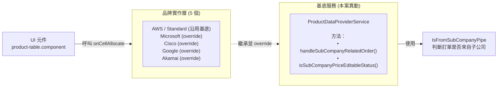
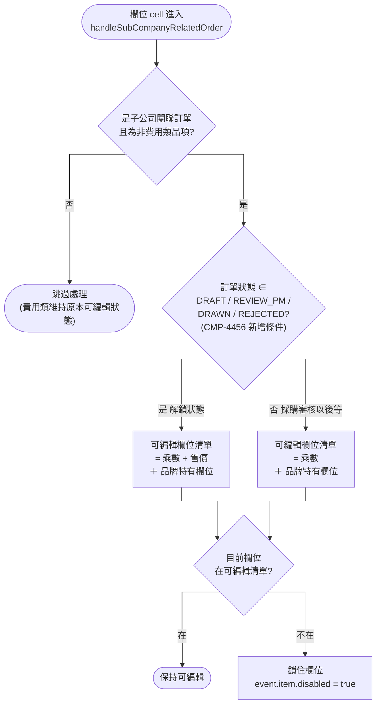

# CMP-4456 SD：母公司收到子公司訂單可修改品項售價與乘數（前端）

## 版本紀錄

| 版本 | 日期 | 修訂內容 | 修訂者 |
|---|---|---|---|
| v1.0 | 2026-05-26 | 初版建立 | Raelynn |
| v2.0 | 2026-05-27 | 依 CMP SD 標準目錄重整、刪除與本案無關章節 | Raelynn |
| v2.1 | 2026-05-28 | 解鎖狀態擴大為 草稿/PM審核/已抽單/已退回 | Raelynn |

## 文件資訊

| 項目 | 內容 |
|---|---|
| 專案名稱 | 母公司收到子公司訂單，草稿/PM 審核時可修改品項售價與乘數（前端） |
| 相關後端單號 | 無（後端 API 已支援，無需配合改動） |
| 參考實作 | `IsFromSubCompanyPipe`、`handleSubCompanyRelatedOrder` 既有覆寫慣例 |
| 參考 Confluence SA | CMP_SA_T100訂單 |

---

## 目錄

1. 需求描述
   - 1.1 功能背景
   - 1.2 目標
   - 1.3 影響範圍
2. 子公司關聯訂單欄位可編輯規則
   - 2.1 現況
   - 2.2 本案調整
   - 2.3 各品牌可編輯欄位對照
3. 實作架構設計
   - 3.1 組件關係圖
   - 3.2 決策流程圖
4. 實作
   - 4.1 修改檔案

---

## 1. 需求描述

### 1.1 功能背景

CMP 系統中，子公司拋訂單給母公司後，母公司開啟訂單時：

- 非費用類品項，受 `handleSubCompanyRelatedOrder()` 限制，**只能改 `multiplier`（乘數）**，`sellingPrice`（售價）一律鎖死。
- 母公司若要修改 `sellingPrice`，必須建立訂變單（Order Change）並經審核流程，作業繁瑣。


### 1.2 目標

比照訂變單彈性，於下列條件下放開售價編輯：

| 條件 | 規則 |
|---|---|
| 訂單來源 | 子公司關聯訂單（由 `IsFromSubCompanyPipe` 判斷） |
| 品項類別 | 非費用類（用量 / 訂閱 / 授權） |
| 訂單狀態 | `DRAFT`（草稿）／ `REVIEW_PM`（PM 審核）／ `DRAWN`（已抽單）／ `REJECTED`（已退回）— 抽單與退回視同回到草稿 |
| 對象品牌 | AWS / Microsoft / Cisco / Google / Akamai 全品牌 |

`multiplier` 維持原本一律可改的行為，本案僅針對 `sellingPrice` 增加狀態 gating。

### 1.3 影響範圍

| 範圍 | 是否變動 |
|---|---|
| 子公司關聯訂單編輯頁（DRAFT / REVIEW_PM / DRAWN / REJECTED）`sellingPrice` 解鎖 | ✅ 本案目標 |
| 訂單儲存 API payload | ❌ 沿用既有 PUT `/order-v2/orders/{id}`，欄位已支援 |
| 自有訂單（非子公司來源）| ❌ 不變 |
| 費用類品項 | ❌ 不變（既有路徑早已允許編輯）|
| 訂變單（modify mode）流程 | ❌ 不變（走 `handleModifyOrder` / `getSubCompanyFields`，本案未動）|
| 路由 / Guard / 狀態管理 | ❌ 無新增 |

---

## 2. 子公司關聯訂單欄位可編輯規則

### 2.1 現況

`ProductDataProviderService.handleSubCompanyRelatedOrder()` 為基底實作，邏輯：
「子公司關聯訂單 + 非費用類 → 除 `multiplier` 以外全部 disabled」。

5 個品牌 DataProvider 多數有自己的 override，但**售價（`sellingPrice`）在多數品牌的 license 與 perUnit 類別中仍被鎖死**。

### 2.2 本案調整

在基底（與各品牌 override）的 `allowedFields` 組裝邏輯中，**額外依訂單狀態 gating** 補上 `sellingPrice`：

```ts
if (this.isSubCompanyPriceEditableStatus(orderHeader.status)) {
  allowedFields.push('sellingPrice');
}
```

判斷 helper（位於基底，protected 提供給子類沿用）：

```ts
protected isSubCompanyPriceEditableStatus(
  status: ApprovalStatus | ModifyOrderStatus
): boolean {
  return status === ApprovalStatus.draft
    || status === ApprovalStatus.reviewPm
    || status === ApprovalStatus.drawn
    || status === ApprovalStatus.rejected;
}
```

> `DRAWN`（已抽單）與 `REJECTED`（已退回）視同回到草稿，允許母公司於這兩個狀態下再次修改售價。

為了讓子類能拿到狀態，`handleSubCompanyRelatedOrder()` 簽章新增 `orderHeader: OrderHeader` 參數，5 個品牌覆寫同步補上。

### 2.3 各品牌可編輯欄位對照

| 品牌 | 類別 | 本案前 | 本案後（DRAFT / REVIEW_PM / DRAWN / REJECTED）| 本案後（其後狀態）|
|---|---|---|---|---|
| AWS / Standard（沿用基底）| 全類 | multiplier | multiplier, **sellingPrice** | multiplier |
| Microsoft | license | multiplier | multiplier, **sellingPrice** | multiplier |
| Microsoft | perUnit | multiplier, subscriptionId | multiplier, **sellingPrice**, subscriptionId | multiplier, subscriptionId |
| Microsoft | subscription | multiplier, showName, sellingPrice, originalPO, commitmentAmount, subscriptionId | （同左）| （同左）|
| Cisco | license | multiplier | multiplier, **sellingPrice** | multiplier |
| Cisco | perUnit / subscription | multiplier, showName, sellingPrice, originalPO | （同左）| （同左）|
| Google | license | multiplier | multiplier, **sellingPrice** | multiplier |
| Google | perUnit / subscription | multiplier, showName, sellingPrice | （同左）| （同左）|
| Akamai | 全類 | multiplier, showName, extra.orderId, unit, unitDescription, tierEnd, originalPrice, **sellingPrice** | （同左）| （同左）|

> 註 1：subscription 等類別在多家品牌原本即「全狀態開放 `sellingPrice`」，本案不收斂，避免回歸風險。
> 註 2：Akamai 既有 `allowedFields` 永遠包含 `sellingPrice`，與本案放寬方向一致，因此沿用既有規則，不額外加狀態 gating；簽章仍須對齊。

---

## 3. 實作架構設計

### 3.1 組件關係圖

靜態結構，不含流程順序。





**重點**：

- 本案改的是基底的 `handleSubCompanyRelatedOrder` + 新增 protected helper；5 個品牌共用，全品牌一次受益。
- AWS / Standard 沒有 override，直接吃基底新邏輯。
- `IsFromSubCompanyPipe` 判斷邏輯本案不動。

### 3.2 決策流程圖

`handleSubCompanyRelatedOrder` 內部判斷流程（基底與各品牌 override 共用骨架）。





**重點**：本案新增的是 Q2 這個分支；訂單狀態屬於 DRAFT / REVIEW_PM / DRAWN / REJECTED 時 `sellingPrice` 加入清單，其他狀態（採購審核之後等）退回原本只有乘數的行為。

---

## 4. 實作

### 4.1 修改檔案

5 個檔案，總異動約 50 行。

#### 4.1.1 `product-data-provider.service.ts`（基底）

路徑：`src/app/orders/sub-order/products/data-service/product-data-provider.service.ts`

**簽章變更**：`handleSubCompanyRelatedOrder()` 新增 `orderHeader: OrderHeader` 參數。

**實作重構**（早回 + `allowedFields` 模式）：

```ts
handleSubCompanyRelatedOrder(
  event: TypeColumnsComponent,
  product: any,
  isFromSubCompany: boolean,
  orderHeader: OrderHeader
): void {
  if (!isFromSubCompany || !product.id || product.category === ProductCate.expense) return;

  // 預設可編輯：乘數；草稿/PM審核/已抽單/已退回 階段加開售價 (CMP-4456)
  const allowedFields = ['multiplier'];
  if (this.isSubCompanyPriceEditableStatus(orderHeader.status)) {
    allowedFields.push('sellingPrice');
  }

  if (!allowedFields.includes(event.item.internalVariableName)) {
    event.item = { ...event.item, disabled: true };
  }
}

protected isSubCompanyPriceEditableStatus(
  status: ApprovalStatus | ModifyOrderStatus
): boolean {
  return status === ApprovalStatus.draft
    || status === ApprovalStatus.reviewPm
    || status === ApprovalStatus.drawn
    || status === ApprovalStatus.rejected;
}
```

呼叫點同步補參數：

```ts
this.handleSubCompanyRelatedOrder(event, product, isFromSubCompany, orderHeader);
```

#### 4.1.2 `microsoft-data-provider.service.ts`

路徑：`src/app/orders/sub-order/products/data-service/microsoft-data-provider.service.ts`

override 簽章補 `orderHeader`，並在 `allowedFields` 初始化後加入狀態 gating：

```ts
override handleSubCompanyRelatedOrder(
  event: TypeColumnsComponent,
  product: any,
  isFromSubCompany: boolean,
  orderHeader: OrderHeader
): void {
  if ((isFromSubCompany && product.id && product.category !== ProductCate.expense) ||
      (!product.id && (product.dataSource === 'CLONE' || product.dataSource === 'SUBSCRIPTION'))) {
    const allowedFields = ['multiplier'];

    // 草稿/PM審核/已抽單/已退回 階段，全類別開放售價 (CMP-4456)
    if (this.isSubCompanyPriceEditableStatus(orderHeader.status)) {
      allowedFields.push('sellingPrice');
    }

    if (product.category === ProductCate.perUnit) {
      allowedFields.push('subscriptionId');
    } else if (product.category === ProductCate.subscription) {
      allowedFields.push('showName', 'sellingPrice', 'originalPO',
                         'extra.commitmentAmount', 'subscriptionId');
      if (event.item.internalVariableName === 'originalPO' ||
          event.item.internalVariableName === 'extra.commitmentAmount') {
        event.item = { ...event.item, editable: true, disabled: false };
      }
    }

    if (!allowedFields.includes(event.item.internalVariableName)) {
      event.item = { ...event.item, disabled: true };
    }
  }
}
```

> 註：第二個 `||` 分支「子公司新增品項拋送母公司」狀態必為 DRAFT，會走 `isSubCompanyPriceEditableStatus` 的 true path，行為一致。

#### 4.1.3 `cisco-data-provider.service.ts`

路徑：`src/app/orders/sub-order/products/data-service/cisco-data-provider.service.ts`

override 簽章補 `orderHeader`，並在 `allowedFields = ['multiplier']` 後加入：

```ts
// 草稿/PM審核 階段，全類別開放售價 (CMP-4456)
if (this.isSubCompanyPriceEditableStatus(orderHeader.status)) {
  allowedFields.push('sellingPrice');
}
```

perUnit / subscription 已含 `sellingPrice`，不受影響；license 類在本案後始可改 `sellingPrice`。

#### 4.1.4 `google-data-provider.service.ts`

路徑：`src/app/orders/sub-order/products/data-service/google-data-provider.service.ts`

調整同 Cisco：override 簽章補 `orderHeader`，在 `allowedFields = ['multiplier']` 後加入狀態 gating push `sellingPrice`。

#### 4.1.5 `akamai-data-provider.service.ts`

路徑：`src/app/orders/sub-order/products/data-service/akamai-data-provider.service.ts`

僅補簽章對齊：override 多接 `orderHeader: OrderHeader` 參數，**不調整 allowedFields**。
既有 `allowedFields` 已永久包含 `sellingPrice`，與本案放寬目標一致；經與 PO 確認沿用既有規則。

```ts
override handleSubCompanyRelatedOrder(
  event: TypeColumnsComponent,
  product: any,
  isFromSubCompany: boolean,
  orderHeader: OrderHeader  // CMP-4456: 對齊基底簽章；akamai 既有規則已含售價，不需狀態 gating
): void {
  // ... 原邏輯不動
}
```

---

## 參考文件

- JIRA：[CMP-4456](https://metaage-corp.atlassian.net/browse/CMP-4456)
- 參考 SD 範本：[SD_4417_訂單直接修改匯率（前端）](https://metaage-corp.atlassian.net/wiki/x/goD7Cg)
