# CMP-4456 測試結果報告
### 訂單：母公司收到子公司訂單，草稿及 PM 審核時，可修改品項售價與乘數

| 項目 | 內容 |
|---|---|
| JIRA | [CMP-4456](https://metaage-corp.atlassian.net/browse/CMP-4456) |
| 測試環境 | CMP UAT（https://cmp-uat-100.metaage.com.tw） |
| 測試身份 | 母公司 — PM+採購 |
| 測試瀏覽器 | agent-browser |
| 修訂者 | Raelynn |
| 修訂日期 | 2026-05-28 |
| 測試狀態 | ✅ 完成 — Cisco 無子公司，其餘 4 個品牌於「抽單退回草稿(DRAWN)」與「PM 審核(REVIEW_PM)」狀態皆通過 |

---

## 一、子公司訂單判斷依據

訂單後端 response 滿足下列條件時，視為「子公司關聯訂單」（母公司端）：

```json
"orderSource": {
  "type": "CLONE",
  "parentId": "<子公司原始訂單 ID，須有值>"
}
```

`type === 'CLONE'` 且 `parentId` 有值，兩者同時成立。每張測試單在進入編輯前，先以下列指令確認 orderSource 結構：

```js
agent-browser eval "(async () => {
  const r = await fetch('https://cmp-uat-100-svc.metaage.com.tw/order-v2/orders/{orderId}', {
    headers: { 'Authorization': 'Bearer ' + (localStorage.getItem('AccessToken') || '') }
  });
  const d = await r.json();
  return d.data?.header?.orderSource;  // 應為 { type: 'CLONE', parentId: '...' }
})();"
```

---

## 二、測試單號

| 品牌 | 訂單單號 |
|---|---|
| AWS | M1312260109008、M1312251230001 |
| Google | M1312260109010、M1312260108002 |
| Microsoft | M1312260527004 |
| Akamai | M1312260527006 |

每張單皆為已標註可測試的草稿單。

---

## 三、測試案例

實測共 8 案：4 個品牌 ×（「抽單退回草稿(DRAWN)」 + 「PM 審核(REVIEW_PM)」）兩個狀態。每案驗證同一張單在該狀態下任一品項的「售價」與「乘數」皆可編輯並儲存（不分品項類別）。

> **解鎖狀態範圍**：CMP-4456 v2.1 將 `DRAFT`、`DRAWN`（已抽單）、`REJECTED`（已退回）、`REVIEW_PM`（PM 審核）視同一組解鎖售價編輯。本輪測試完整覆蓋 DRAWN 與 REVIEW_PM 兩個狀態，驗證解鎖邏輯。

每案共通測試步驟：

1. PM+採購 身份進入訂單編輯頁。
2. 透過 API (`/order-v2/orders/{orderId}`) 確認 `orderSource = { type: 'CLONE', parentId: 有值 }` 且 `status = 'DRAWN'`。
3. 捲動至品項列表，於任一品項修改「售價」與「乘數」欄位。
4. 點「儲存」→ 確認彈窗點「送出」。
5. 觀察 notify「更新成功」並透過 API 重撈該訂單，比對 `multiplier` / `sellingPrice` 是否為新值。

---

### 已抽單退回草稿（DRAWN）狀態

#### TC-01 — AWS：M1312260109008

- 測試結果：✅ 通過
- URL id：`20260109910765`
- orderSource：`{ type: 'CLONE', parentId: '20260109203748' }` ✓
- 訂單狀態：DRAWN
- 修改前 → 後：
  - `multiplier`：4 → **2.5**
  - `sellingPrice`：4 → **2.5**
- API 重撈確認持久化通過

**修改前**（乘數=4、售價=4 皆為白底可編輯）：

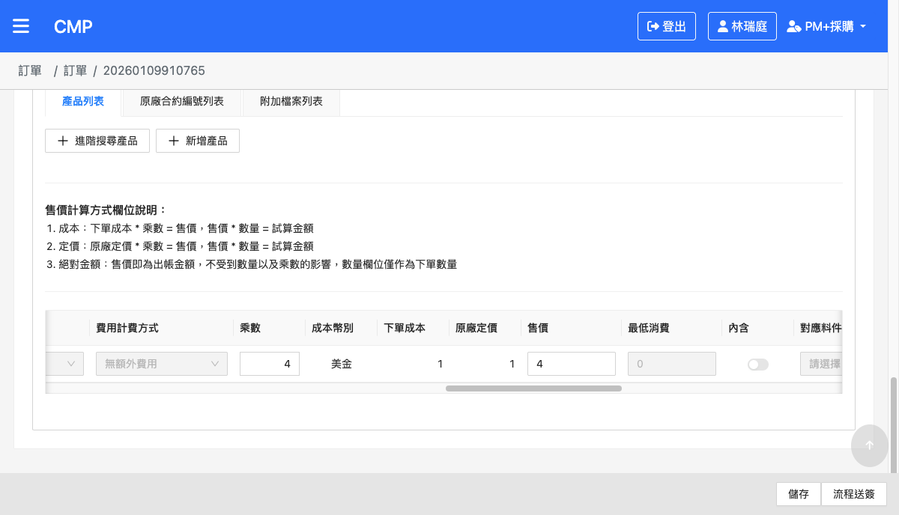

**修改後**（乘數=2.5、售價=2.5）：

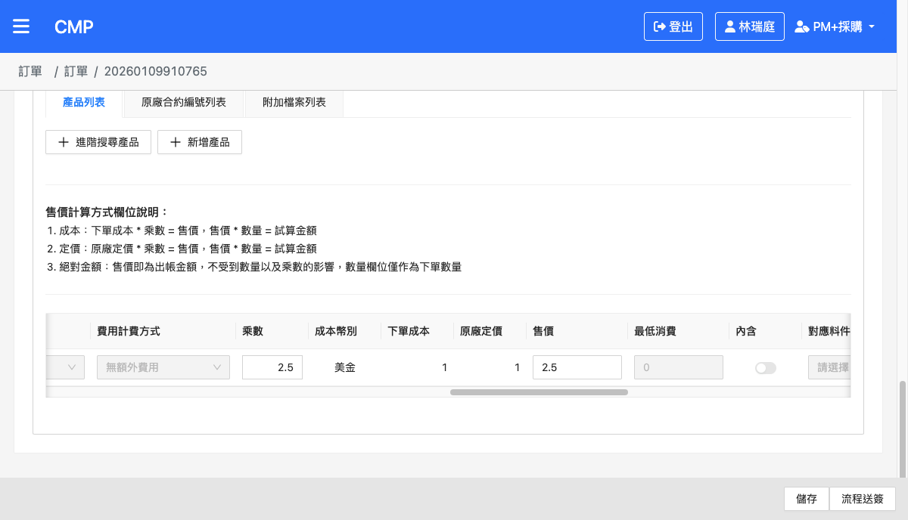

#### TC-02 — Google：M1312260109010

- 測試結果：✅ 通過
- URL id：`20260109322079`
- orderSource：`{ type: 'CLONE', parentId: '20260109819419' }` ✓
- 訂單狀態：DRAWN
- 修改前 → 後：
  - `multiplier`：2 → **3**
  - `sellingPrice`：5 → **8**

**修改前**（乘數=2、售價=5）：

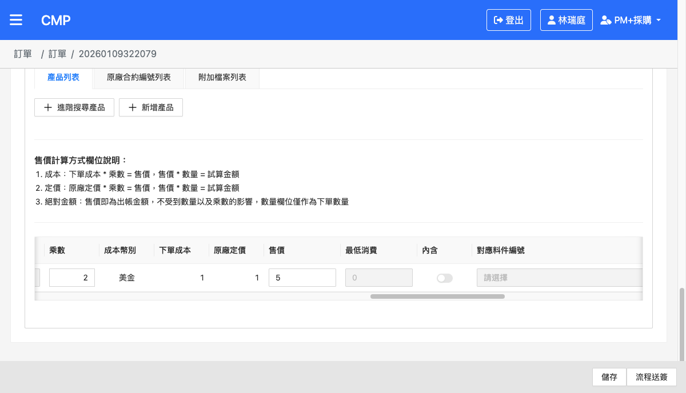

**修改後**（乘數=3、售價=8）：


#### TC-03 — Microsoft：M1312260527004（LICENSE 類別，CMP-4456 解鎖核心）

- 測試結果：✅ 通過 — **本案最關鍵驗證點**：MS LICENSE 在原版 CMP-4456 之前售價為鎖住，本版（含 DRAWN 解鎖）後可改
- URL id：`20260527129731`
- orderSource：`{ type: 'CLONE', parentId: '20260527921890' }` ✓
- 訂單狀態：DRAWN
- 品項類別：LICENSE
- 修改前 → 後：
  - `multiplier`：1.8 → **2**
  - `sellingPrice`：11404.8 → **12672**（MS 雙向連動：cost × multiplier）

**修改前**（LICENSE 類別，乘數=2、售價=12672 皆為白底可編輯，下單成本=6336 灰色禁用）：

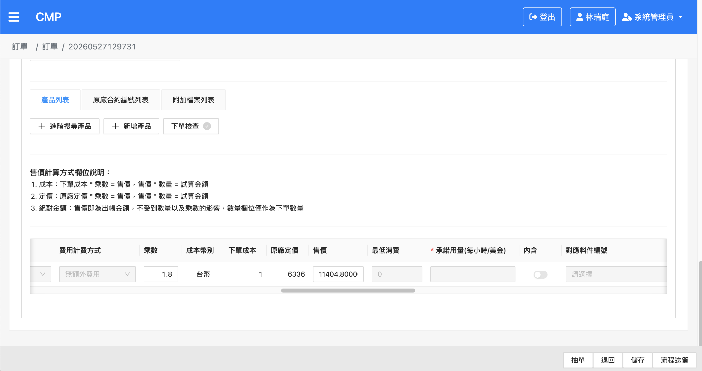

**修改後**（乘數=2、售價=12672）：

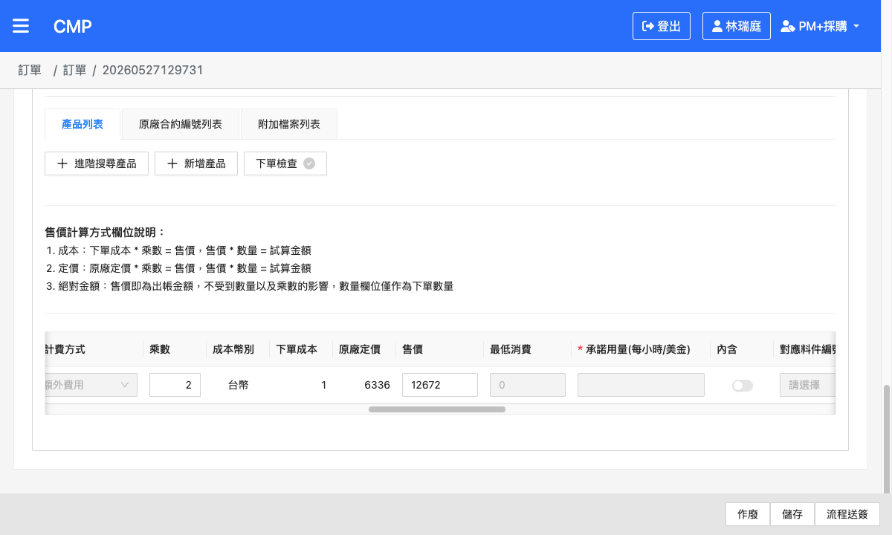

#### TC-04 — Akamai：M1312260527006

- 測試結果：✅ 通過
- URL id：`20260527962775`
- orderSource：`{ type: 'CLONE', parentId: '20260527677323' }` ✓
- 訂單狀態：DRAWN
- 品項計價方式：`COST_BASE`
- 修改前 → 後：
  - 超量單價(`sellingPrice`)：8 → **12**
  - `multiplier`：後端連動更新為 **12**
- 備註：Akamai 此品項 UI 不渲染 `multiplier` 輸入框（Akamai 自身設定，非 CMP-4456 範圍），驗證集中於超量單價可改

**修改前**（超量單價=8 為白底可編輯）：

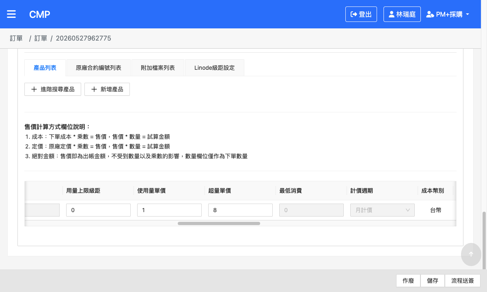

**修改後**（超量單價=12）：

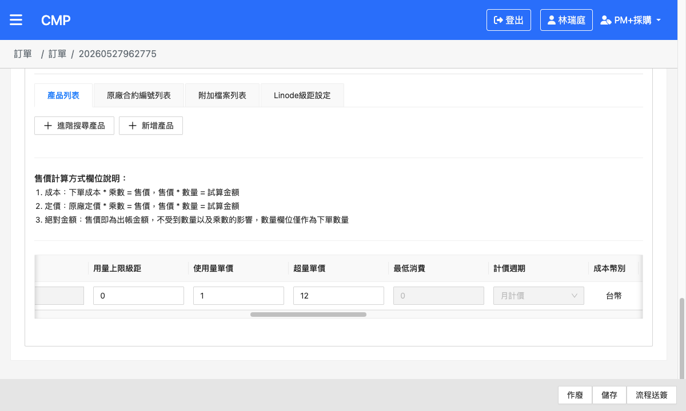

---

### PM 審核（REVIEW_PM）狀態

#### TC-05 — AWS：M1312260109008（REVIEW_PM）

- 測試結果：✅ 通過
- URL id：`20260109910765`
- orderSource：`{ type: 'CLONE', parentId: '20260109203748' }` ✓
- 訂單狀態：REVIEW_PM
- 修改前 → 後：
  - `multiplier`：2.5 → **7**（cost=1 不變，雙向連動）
  - `sellingPrice`：2.5 → **7**
- API 重撈確認持久化通過

**修改前**（乘數=2.5、售價=2.5 皆為白底可編輯）：

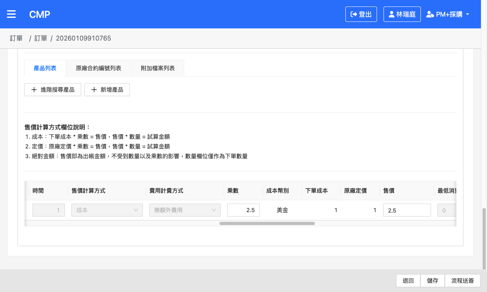

**修改後**（乘數=7、售價=7）：


#### TC-06 — Google：M1312260109010（REVIEW_PM）

- 測試結果：✅ 通過
- URL id：`20260109322079`
- orderSource：`{ type: 'CLONE', parentId: '20260109819419' }` ✓
- 訂單狀態：REVIEW_PM
- 售價計算方式：定價（原廠定價=1）
- 修改前 → 後：
  - `multiplier`：3 → **4**
  - `sellingPrice`：8 → **10**（手動覆寫，與乘數×定價脫鉤）

**修改前**（乘數=3、售價=8）：

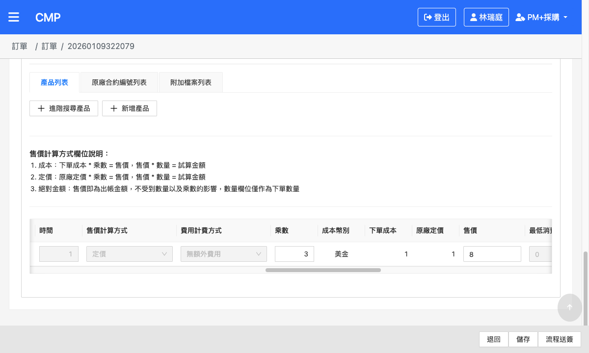

**修改後**（乘數=4、售價=10）：

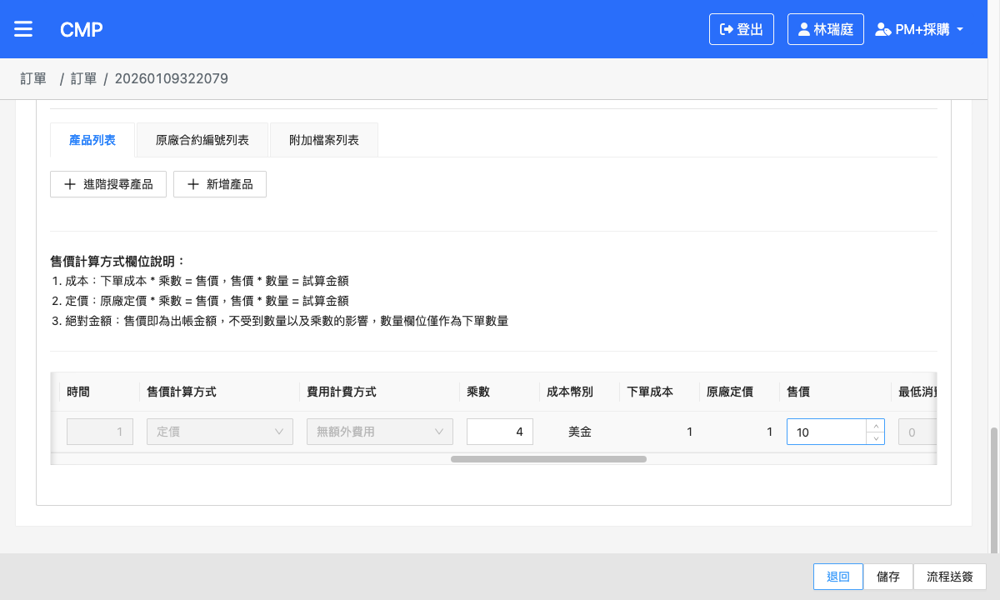

#### TC-07 — Microsoft：M1312260527004（REVIEW_PM，LICENSE 類別）

- 測試結果：✅ 通過 — **本案最關鍵驗證點**：MS LICENSE 在原版 CMP-4456 之前售價為鎖住，本版於 REVIEW_PM 亦解鎖
- URL id：`20260527129731`
- orderSource：`{ type: 'CLONE', parentId: '20260527921890' }` ✓
- 訂單狀態：REVIEW_PM
- 品項類別：LICENSE
- 售價計算方式：定價（原廠定價=6336）
- 修改前 → 後：
  - `multiplier`：2 → **3**
  - `sellingPrice`：12672 → **19008**（6336 × 3 = 19008，定價×乘數連動）

**修改前**（LICENSE 類別，乘數=2、原廠定價=6336、售價=12672 皆為白底可編輯）：

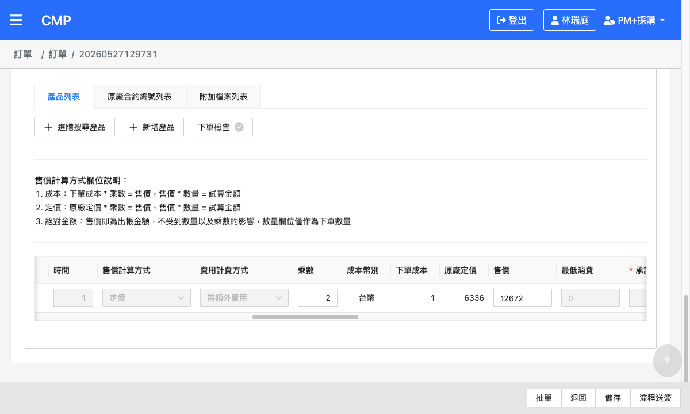

**修改後**（乘數=3、售價=19008）：

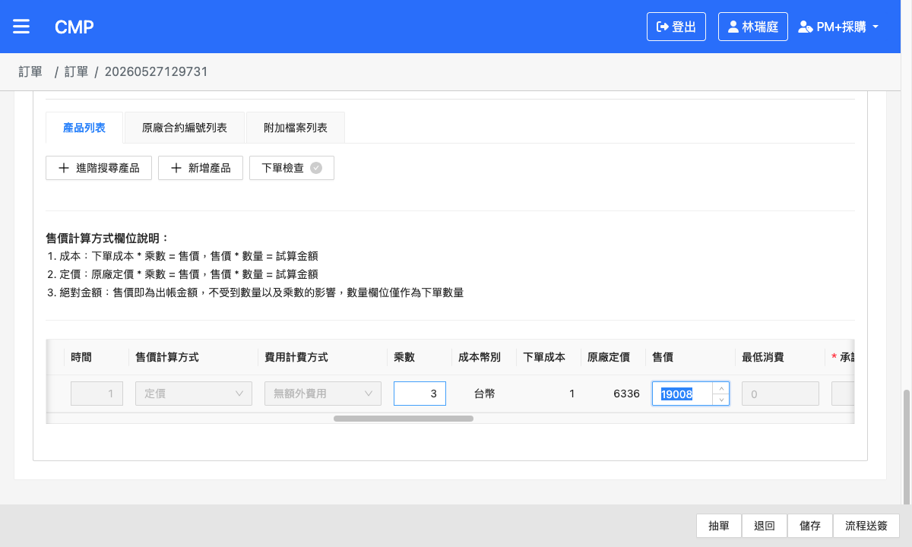

#### TC-08 — Akamai：M1312260527006（REVIEW_PM）

- 測試結果：✅ 通過
- URL id：`20260527962775`
- orderSource：`{ type: 'CLONE', parentId: '20260527677323' }` ✓
- 訂單狀態：REVIEW_PM
- 品項計價方式：`COST_BASE`
- 修改前 → 後：
  - 超量單價(`sellingPrice`)：12 → **15**
  - `multiplier`：後端連動更新為 **15**
- 備註：Akamai 此品項 UI 不渲染 `multiplier` 輸入框（Akamai 自身設定，非 CMP-4456 範圍），驗證集中於超量單價可改

**修改前**（超量單價=12 為白底可編輯）：

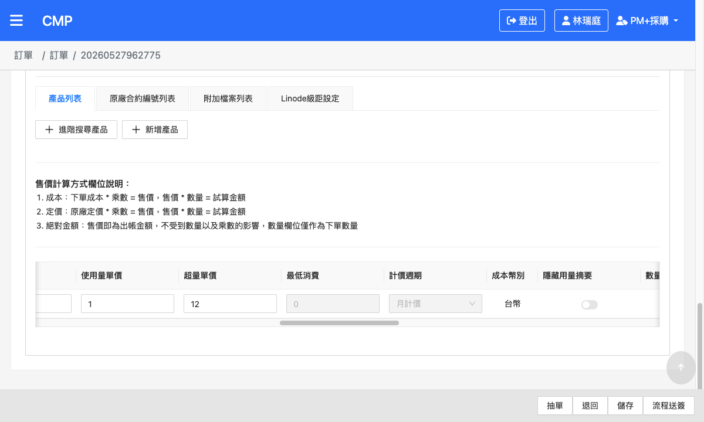

**修改後**（超量單價=15）：

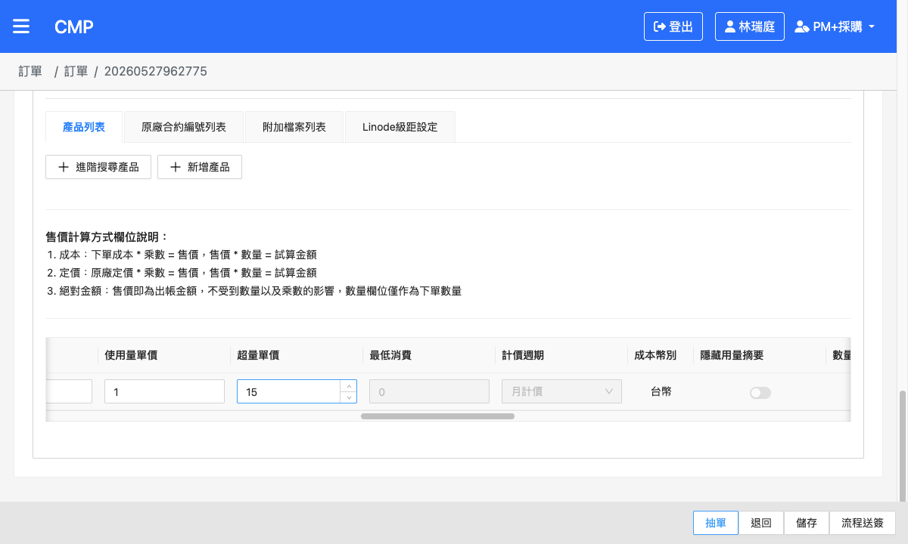

---

## 四、執行紀錄欄位（測試時填寫）

| 欄位 | 說明 |
|---|---|
| 測試結果 | ✅ 通過 / ❌ 失敗 |
| 修改前 / 後值 | 售價、乘數的 before / after |
| 截圖 | `screenshots/TC-XX-{描述}.png` |
| 備註 | 異常狀況、踩雷紀錄 |
