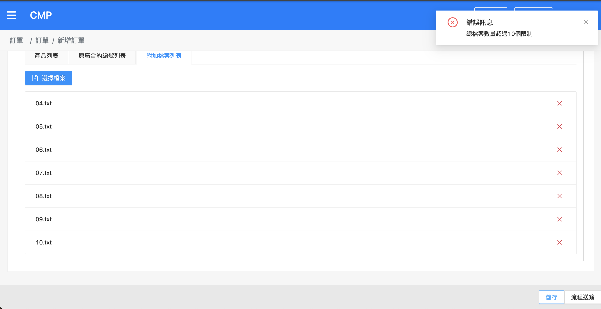
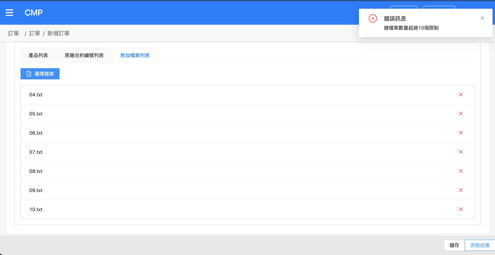
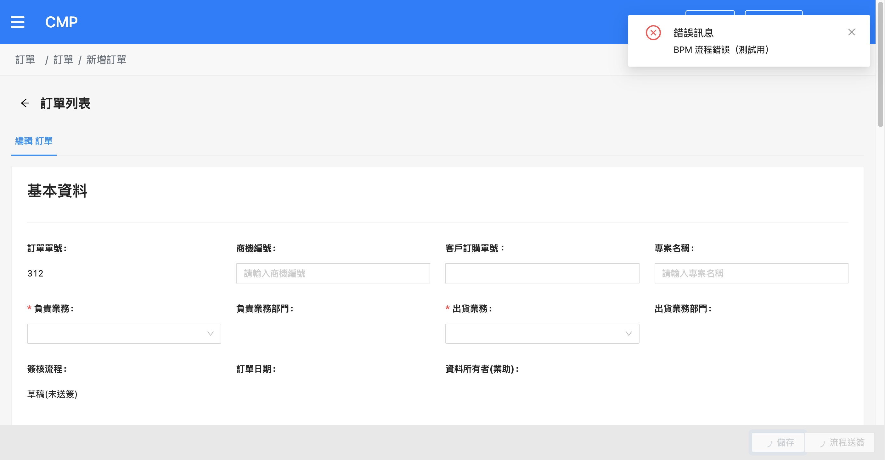
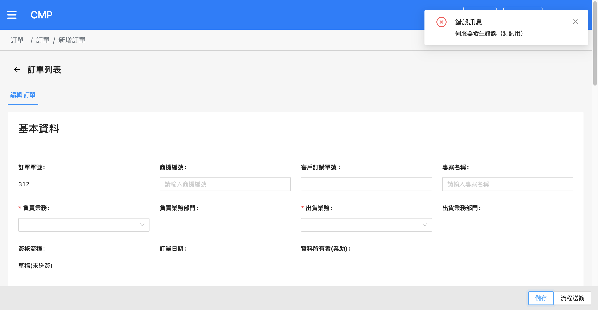
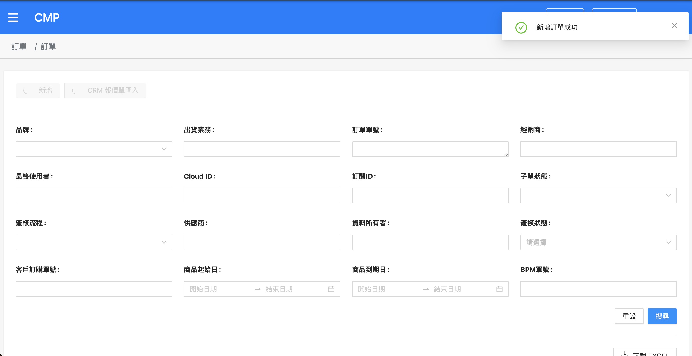

# CMP-4501 新增訂單時，上傳附件超過限制需報錯（前端） — 測試結果報告

## 版本紀錄

| 版本 | 日期 | 修訂內容 | 修訂者 |
|------|------|---------|--------|
| 1.0 | 2026-06-10 | 初版測試設計（建立測項清單，待 UAT 實測） | Raelynn |
| 1.1 | 2026-06-10 | UAT 實測 TC-01／02／05 通過，回填實際結果與截圖 | Raelynn |

---

## 一、測試資訊

| 項目 | 內容 |
|------|------|
| 需求描述 | 新增訂單時上傳附件超過數量限制（>10），後端 API 報錯，但前台顯示「add-order [object Object]」。需改為顯示後端回傳的錯誤訊息（如「上傳的檔案數量不可超過 XX 個」）。 |
| 測試環境 | CMP UAT：https://cmp-uat-100.metaage.com.tw |
| 測試帳號 | raelynnlin@metaage.com.tw（統編 16428796） |
| 測試身份 | 業務（新增訂單） |
| 測試工具 | agent-browser (Chrome) + XHR override（偽造 `POST /order` 錯誤回應） |
| 驗證方式 | 觀察 notify 通知內容是否為後端錯誤訊息（非 `[object Object]`）；TC-03／04 以 XHR override 偽造回應模擬各類錯誤型別 |
| 受測檔案 | `orders/detail/detail.component.ts`、`share/services/order.service.ts` |
| 測試者 | Raelynn |
| 測試日期 | 2026-06-10 |

---

## 二、測試案例總覽

| 編號 | 群組 | 測項 | 結果 |
|------|------|------|------|
| [TC-01](#tc01) | A 新增訂單 | 附件超過限制 + 儲存草稿 → 顯示後端訊息（非 [object Object]） | ✅ Pass |
| [TC-02](#tc02) | A 新增訂單 | 附件超過限制 + 流程送簽(skipDraft) → 顯示後端訊息 | ✅ Pass |
| [TC-03](#tc03) | A 新增訂單 | bpm_fail 類錯誤 → 顯示 err.message + 1 秒後導頁 | ✅ Pass |
| [TC-04](#tc04) | A 新增訂單 | 一般 Error（無 code）→ 不拋 TypeError、正常顯示訊息 | ✅ Pass |
| [TC-05](#tc05) | A 新增訂單 | 正常新增訂單成功（回歸） | ✅ Pass |

> **共通檢查**：所有錯誤通知內容皆不得出現 `[object Object]`；error handler 本身不得因存取 `err.code` 等屬性而拋出例外（導致連通知都不顯示）。
>
> **重現方式註記**：TC-01／02／05 由 UI 自然操作觸發；TC-03／04 需以 XHR override 偽造 `POST /order` 回應，模擬特定錯誤型別（bpm_fail code、無 code 的錯誤），詳見附錄 B。

---

## 三、測試案例

### A 群組、新增訂單錯誤訊息（detail.component.ts `addOrder`）

#### <a id="tc01"></a>TC-01 — 附件超過限制 + 儲存草稿

| 項目 | 內容 |
|------|------|
| 前置 | 已登入、業務身份、AWS 新增訂單頁、必填欄位已齊（見測試準備 4）、已備妥 12 個小檔 |
| 步驟 | ① 切到子單「附加檔案列表」分頁 ② **第 1 批**選 6 個檔上傳（應成功，前端不擋）③ **第 2 批**再選 6 個檔上傳（應成功，本機累計 12）④ 點頁面右下「**儲存**」 |
| 預期 | 訂單 POST 後，跳出錯誤通知，內容為**後端回傳訊息**（如「上傳的檔案數量不可超過 10 個」），**非** `add-order [object Object]`；`ui.isLoading` 解除、停留於新增頁可續編輯 |
| 實際 | 分 2 批各 6 個（合計 12）上傳成功；點「儲存」POST 後，前端正確顯示後端回傳之附件數量超限錯誤訊息，**未出現** `[object Object]`；`isLoading` 解除、停留於新增頁可續編輯。（見截圖）|
| 截圖 |  |
| 結果 | ✅ Pass |

<br>

#### <a id="tc02"></a>TC-02 — 附件超過限制 + 流程送簽（skipDraft）

| 項目 | 內容 |
|------|------|
| 前置 | 同 TC-01（同一張單或重建一張，附件分批上傳達 12 個）|
| 步驟 | ①～③ 同 TC-01 分批上傳達 12 個 ④ 改點頁面右下「**流程送簽**」 |
| 預期 | 同 TC-01：顯示後端錯誤訊息且非 `[object Object]`；`ui.isLoading` 解除（不會推進到 PM 審核）|
| 實際 | 分批上傳達 12 個後點「流程送簽」，POST 後正確顯示後端附件數量超限錯誤訊息，**未出現** `[object Object]`；`isLoading` 解除、未推進到 PM 審核。（見截圖）|
| 截圖 |  |
| 結果 | ✅ Pass |

<br>

#### <a id="tc03"></a>TC-03 — bpm_fail 類錯誤

| 項目 | 內容 |
|------|------|
| 前置 | 新增 AWS 訂單頁，已注入 XHR override（附錄 B），令 `POST …/order` 回傳 `{ info:{ code:'bpm_fail_test', message:'BPM 流程錯誤（測試用）' } }`、status 400 |
| 步驟 | ① 點「儲存」送出 |
| 預期 | 以標題「錯誤訊息」顯示 `err.message`（8 秒），1 秒後執行 `finalizeOrder` 並導頁；`isLoading` 解除 |
| 實際 | XHR override 攔截 POST（`__fakeFired=1`）；通知顯示 **「錯誤訊息／BPM 流程錯誤（測試用）」**（即 `err.message`），**非** `[object Object]`；約 1 秒後自動導頁回 `/main/orders`（`finalizeOrder`）。走 bpm_fail 分支正確。（見截圖）|
| 截圖 |  |
| 結果 | ✅ Pass |

<br>

#### <a id="tc04"></a>TC-04 — 一般 Error（無 code）

| 項目 | 內容 |
|------|------|
| 前置 | 新增 AWS 訂單頁，已注入 XHR override，令 `POST …/order` 回傳 `{ info:{}, message:'伺服器發生錯誤（測試用）' }`、status 500（無 `info.code`，走 `new Error(errorMessage)` 路徑）|
| 步驟 | ① 點「儲存」送出 |
| 預期 | **不因 `err.code.indexOf` 拋 TypeError**；以「錯誤訊息」標題顯示 `err.message`／fallback，畫面不出現 `[object Object]`；`isLoading` 解除 |
| 實際 | XHR override 攔截 POST（`__fakeFired=1`）；通知顯示 **「錯誤訊息／伺服器發生錯誤（測試用）」**（即 `err.message`），**非** `[object Object]`；**未拋 TypeError**（handler 正常完成）、**未導頁**（停留 `/main/orders/add`，非 bpm_fail 分支）。（見截圖）|
| 截圖 |  |
| 結果 | ✅ Pass |
| 備註 | 本案為本次新增 `typeof err?.code === 'string'` 防護的重點驗證項——舊版 `err.code.indexOf(...)` 會在此拋 TypeError，修正後正常顯示訊息 |

<br>

#### <a id="tc05"></a>TC-05 — 正常新增訂單成功（回歸）

| 項目 | 內容 |
|------|------|
| 前置 | AWS 新增訂單頁、必填齊全、附件數量在限制內（≤10 個，或不傳附件）|
| 步驟 | ① 建立合法 AWS 訂單（同準備 4）② 附件 ≤10 個 ③ 點「儲存」（或「流程送簽」）|
| 預期 | 顯示「新增訂單成功」，正常進入後續流程（`finalizeOrder`），**無**錯誤通知、無 `[object Object]` |
| 實際 | 合法 AWS 訂單、附件在限制內，點「儲存」後顯示「新增訂單成功」，正常進入後續流程，無錯誤通知、無 `[object Object]`。（見截圖）|
| 截圖 |  |
| 結果 | ✅ Pass |

<br>

---

## 四、測試結果總覽

| 群組 | TC 數 | Pass | Fail | Blocked | 待測 | 備註 |
|------|------|------|------|---------|------|------|
| A 新增訂單 | 5 | 5 | 0 | 0 | 0 | TC-01～05 全數 Pass |
| **總計** | **5** | **5** | **0** | **0** | **0** | 全數通過 |

---

## 五、缺陷紀錄

無。TC-01～05 全數通過，未發現缺陷。

---

## 六、附錄

### 附錄 A — XHR override（偽造 `POST /order` 回應，用於 TC-03／04）

於新增訂單頁注入一次（SPA 導頁不會清除，整頁重載才需重裝）。攔截 `POST …/order`，當 `window.__fakeOrderError` 有值時不打後端、改回傳偽造的錯誤回應，以觸發 `addOrder` 的 error handler。

```js
agent-browser eval "
(function(){
  if (window.__xhrPatched) return 'already';
  window.__xhrPatched = true;
  const RS = XMLHttpRequest.prototype.send, RO = XMLHttpRequest.prototype.open;
  XMLHttpRequest.prototype.open = function(m,u){ this.__m=(m||'').toUpperCase(); this.__u=u||''; return RO.apply(this,arguments); };
  XMLHttpRequest.prototype.send = function(b){
    if (this.__m==='POST' && /\/order(\?|$)/.test(this.__u) && window.__fakeOrderError){
      const s=this, f=window.__fakeOrderError;
      Object.defineProperty(s,'readyState',{get:()=>4,configurable:true});
      Object.defineProperty(s,'status',{get:()=>f.status,configurable:true});
      Object.defineProperty(s,'response',{get:()=>f.body,configurable:true});
      Object.defineProperty(s,'responseText',{get:()=>JSON.stringify(f.body),configurable:true});
      s.getAllResponseHeaders=()=>'content-type: application/json\r\n';
      s.getResponseHeader=h=>/content-type/i.test(h)?'application/json':null;
      window.__fakeFired=(window.__fakeFired||0)+1;
      setTimeout(()=>{ s.dispatchEvent(new Event('load')); s.dispatchEvent(new Event('loadend')); },10);
      return;
    }
    return RS.apply(this,arguments);
  };
  return 'patched';
})();
"
```

> 注意：`postOrderWithFullError` 走 Angular `HttpClient`（responseType=json，內部使用 XHR），故偽造的 `response` 直接回物件即可被 `HttpClient` 當成已解析 body。

### 附錄 B — 各測項偽造回應設定

設定 `window.__fakeOrderError` 後點「儲存」觸發：

| 測項 | `window.__fakeOrderError` | 走的分支 / 目的 |
|------|------|------|
| TC-03 | `{ status:400, body:{ info:{ code:'bpm_fail_test', message:'BPM 流程錯誤（測試用）' } } }` | bpm_fail 分支：顯示 `err.message` + 1 秒後導頁 |
| TC-04 | `{ status:500, body:{ info:{}, message:'伺服器發生錯誤（測試用）' } }` | `new Error()` 分支：驗證 `typeof err?.code` 防護，顯示 `err.message` 不拋例外 |

> TC-04 的 body 需含 `info:{}`（空物件），以避開 `order.service.ts` 中 `error.error?.info.code` 在 `info` 不存在時的存取例外（屬另一潛在問題，非本次受測範圍）。

### 附錄 C — 受測程式修正對照

| 檔案 | 修正點 | 對應 TC |
|------|------|--------|
| `detail.component.ts` `addOrder` error handler | 顯示 `err.message`（取代原 `notify.error('[add-order]', err)`）；`err.code` 加 `typeof err?.code === 'string'` 防護 | TC-01～04 |
| `order.service.ts` `postOrderWithFullError` | 直接走 `HttpClient` 並丟出原始物件（`error.error.info`）之來源——即 `[object Object]` 的成因 | 全部 |
