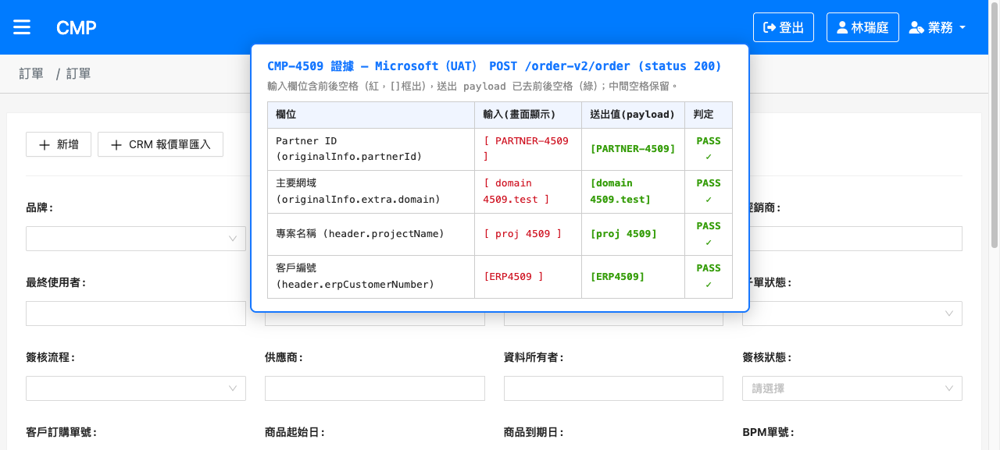
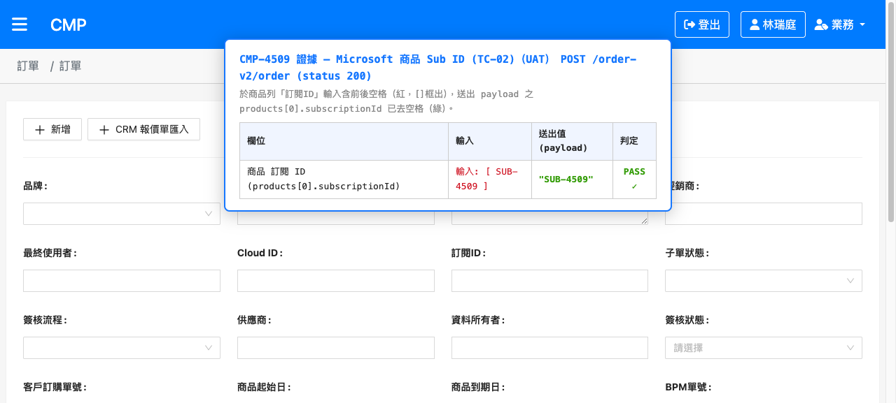
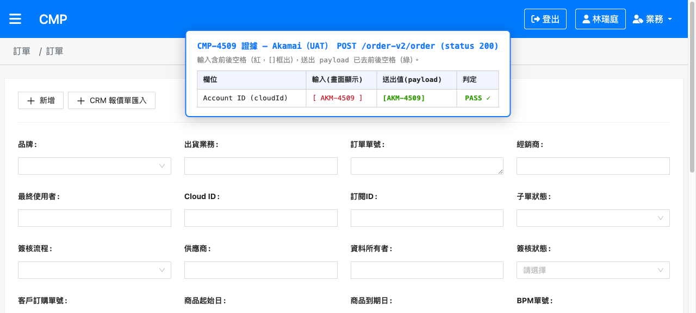
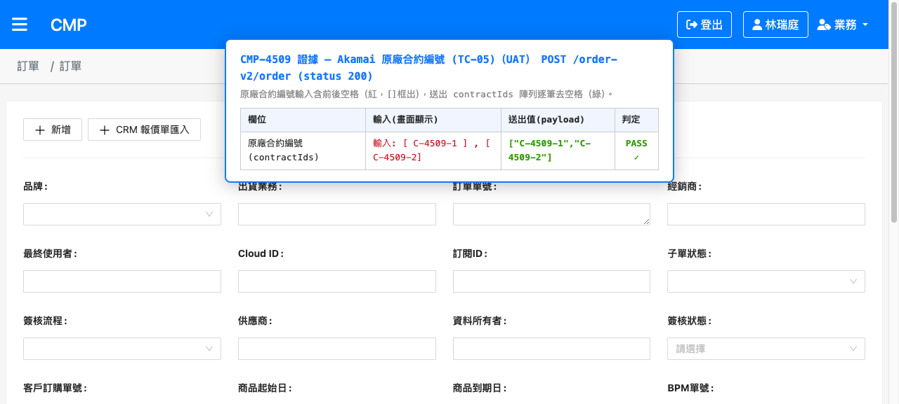
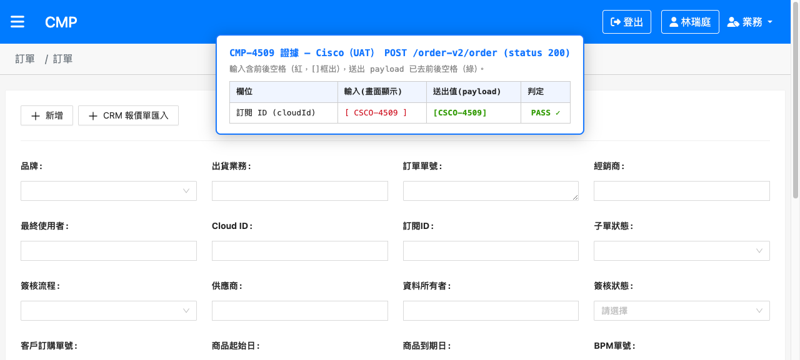
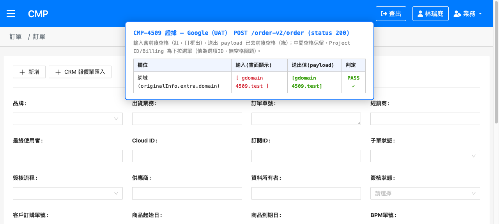
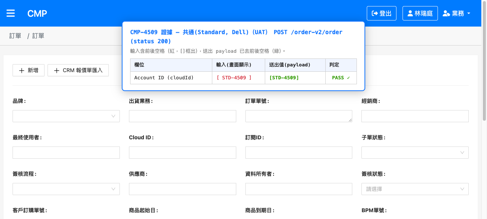
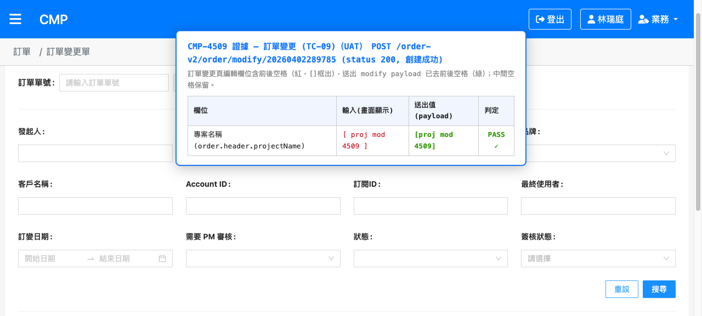
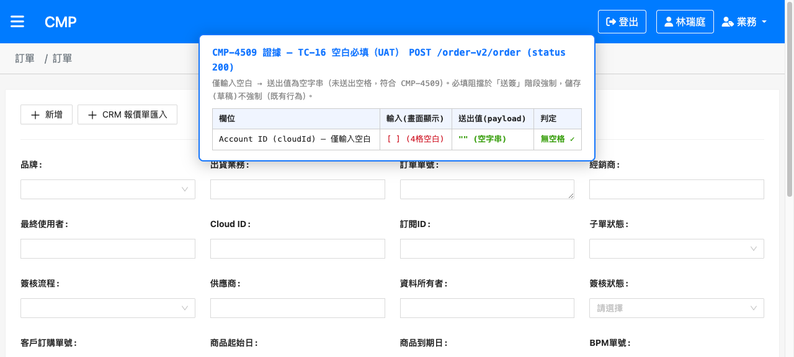
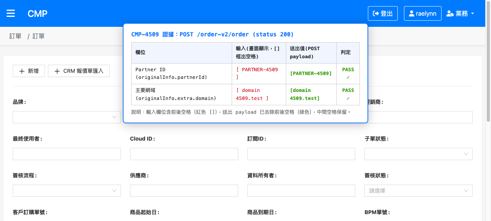

# CMP-4509 訂單部分欄位送出前需去除前後空格 — 測試結果報告

## 版本紀錄

| 版本 | 日期 | 修訂內容 | 修訂者 |
|------|------|----------|--------|
| 1.0 | 2026-06-11 | 建立測試報告（測項規劃版） | Raelynn |
| 1.1 | 2026-06-11 | 改以品牌分組、同單連續測、只儲存不送簽；新增證據擷取方法與範例圖 | Raelynn |
| 1.2 | 2026-06-11 | **UAT 執行**：填入各品牌實測結果與證據截圖 | Raelynn |

---

## 一、測試資訊

| 項目 | 內容 |
|------|------|
| Jira 單號 | CMP-4509（缺陷：訂單部分欄位送出前需去除前後空格） |
| 相關後端單／SD 文件 | 無（純前端 trim 處理） |
| 測試環境 | CMP UAT（https://cmp-uat-100.metaage.com.tw） |
| 測試身份 | 業務（新增訂單） |
| 測試工具 | Skill Browser Agent（agent-browser）＋ XHR 攔截器＋頁面證據面板 |
| 驗證方式 | 建立各品牌新訂單，於受測欄位輸入含前後空格之值，**只按「儲存」（不送簽）**；攔截送出之 `POST /order-v2/order` body，比對欄位是否去除前後空格。以「輸入值 ↔ 送出值」證據面板截圖佐證 |
| 測試者 | Raelynn |
| 測試日期 | 2026-06-11 |

---

## 二、測試案例總覽

| 編號 | 群組（品牌／面向） | 測項 | 結果 |
|------|------|------|------|
| [TC-01](#tc01) | A · Microsoft | 主要網域、Partner ID 送出去空格 | ✅ Pass |
| [TC-02](#tc02) | A · Microsoft | 商品 Sub ID（subscriptionId）送出去空格 | ✅ Pass |
| [TC-03](#tc03) | B · AWS | Account ID（cloudId）送出去空格 | ✅ Pass |
| [TC-04](#tc04) | C · Akamai | Account ID（cloudId）送出去空格 | ✅ Pass |
| [TC-05](#tc05) | C · Akamai | 原廠合約編號（contractIds）逐筆去空格 | ✅ Pass |
| [TC-06](#tc06) | D · Cisco | 訂閱 ID（cloudId）送出去空格 | ✅ Pass |
| [TC-07](#tc07) | E · Google | 網域 送出去空格（Project ID／Billing 為下拉） | ✅ Pass |
| [TC-08](#tc08) | F · 共通（Standard，Dell） | Account ID（cloudId）送出去空格 | ✅ Pass |
| [TC-09](#tc09) | G · 訂單變更 | 訂變單編輯欄位含空格，送出去空格 | ✅ Pass |
| [TC-11](#tc11) | I · onFormChange 即時行為 | 輸入含前後空格：畫面顯示保留、送出值已去空格 | ✅ Pass |
| [TC-12](#tc12) | I · onFormChange 即時行為 | 含中間空格之值：僅去前後、保留中間空格 | ✅ Pass |
| [TC-13](#tc13) | J · 共用表單欄位 | order-header 文字欄（專案名稱）trim | ✅ Pass |
| [TC-14](#tc14) | J · 共用表單欄位 | order-customer 客戶編號 trim＋大寫並存 | ✅ Pass |
| [TC-15](#tc15) | K · 負向／回歸 | 非字串欄位（多選／日期／數字）不受影響 | ✅ Pass（dev 實證＋UAT 儲存正常） |
| [TC-16](#tc16) | K · 負向／回歸 | 僅輸入空白字串：送出為空字串（無空格） | ✅ Pass（附行為說明） |

> **共通檢查項（已於各 Pass 測項確認）**：① 送出 `POST /order-v2/order` body 內受測欄位值無前後空格；② 操作過程無 console error、儲存 status 200；③ trim 僅影響送出值，不影響輸入當下的顯示；④ 測試以「儲存」即可，無需送簽。

---

## 三、測試準備（實際執行）

1. 開啟 https://cmp-uat-100.metaage.com.tw ，輸入統編 `16428796`、帳號 `raelynnlin@metaage.com.tw` 送出。
2. UAT 走 Microsoft 企業登入，於 Authenticator App 核准登入並選「保持登入」。
3. 確認右上角身份為「業務」。
4. 每品牌：訂單列表 →「新增」→ 選品牌 → 確認，進入新增訂單頁。
5. 於頁面 console 安裝 XHR 攔截器（附錄 C），記錄送出之 POST/PUT。
6. 受測欄位輸入「前後各 2 個空格」之測試值（如 `··PARTNER-4509··`）；部分欄位另測中間空格（如 `··domain 4509.test··`）。
7. 只按「儲存」；以攔截 payload 注入證據面板並截圖。

> **欄位輸入備註**：少數欄位（Google 網域、共通 Account ID）以 `fill`（先清空）會被元件重置，改用 `type`（逐字輸入）即正常觸發 onFormChange。

---

## 四、測試案例

### A · Microsoft

#### TC-01　Microsoft：主要網域、Partner ID 送出去空格　✅ Pass

| 項目 | 內容 |
|------|------|
| 單號 | UAT 草稿訂單（`POST /order-v2/order` status 200） |
| 步驟 | 主要網域輸入 `··domain 4509.test··`、Partner ID 輸入 `··PARTNER-4509··` → 儲存 → 讀 POST body |
| 預期 | `originalInfo.extra.domain="domain 4509.test"`、`originalInfo.partnerId="PARTNER-4509"`（無前後空格） |
| 實際 | `partnerId="PARTNER-4509"`、`extra.domain="domain 4509.test"`（前後空格去除、中間空格保留）；畫面輸入框仍顯示含空格之值 |
| 截圖 |  |
| 結果 | ✅ Pass |

#### TC-02　Microsoft 商品 Sub ID（subscriptionId）送出去空格　✅ Pass

| 項目 | 內容 |
|------|------|
| 單號 | UAT 草稿訂單（`POST /order-v2/order` status 200） |
| 步驟 | 建立 Microsoft 訂單 → 點「新增產品」加入商品列（不需網域檢查）→ 於商品列「訂閱 ID」輸入 `··SUB-4509··` → 儲存 → 讀 payload `products[0].subscriptionId` |
| 預期 | 商品 `subscriptionId="SUB-4509"`（無前後空格） |
| 實際 | 送出 `data.body[0].products[0].subscriptionId="SUB-4509"`（無前後空格，status 200）。註：商品列「訂閱ID」格與 `product.subscriptionId` 雙向綁定，`onItemChanged` 於輸入時即 trim 並回寫，故畫面顯示亦同步為去空格值 |
| 截圖 |  |
| 結果 | ✅ Pass |

### B · AWS

#### TC-03　AWS：Account ID 送出去空格　✅ Pass

| 項目 | 內容 |
|------|------|
| 單號 | UAT 草稿訂單（`POST /order-v2/order` status 200） |
| 步驟 | Account ID（cloudId）輸入 `··AWS-4509··` → 儲存 → 讀 POST body |
| 預期 | `data.body[0].cloudId="AWS-4509"` |
| 實際 | `cloudId="AWS-4509"`（無前後空格） |
| 截圖 |  |
| 結果 | ✅ Pass |

### C · Akamai

#### TC-04　Akamai：Account ID 送出去空格　✅ Pass

| 項目 | 內容 |
|------|------|
| 單號 | UAT 草稿訂單（`POST /order-v2/order` status 200） |
| 步驟 | Account ID（cloudId）輸入 `··AKM-4509··` → 儲存 → 讀 POST body |
| 預期 | `data.body[0].cloudId="AKM-4509"` |
| 實際 | `cloudId="AKM-4509"`（無前後空格） |
| 截圖 |  |
| 備註 | Linode 帳號（accountName）／Token 為透過 Token 由 API 帶入之**唯讀欄位**，非手動輸入；其去空格由送出層白名單保證（dev 已驗） |
| 結果 | ✅ Pass |

#### TC-05　Akamai 原廠合約編號（contractIds）逐筆去空格　✅ Pass

| 項目 | 內容 |
|------|------|
| 單號 | UAT 草稿訂單（`POST /order-v2/order` status 200） |
| 步驟 | 於子單「原廠合約編號列表」分頁，輸入 `··C-4509-1··`、`·C-4509-2` 各按「新增」 → 儲存 → 讀 `contractIds` |
| 預期 | `contractIds=["C-4509-1","C-4509-2"]`（每筆無前後空格） |
| 實際 | 加入清單即顯示為 `C-4509-1`、`C-4509-2`；送出 `contractIds=["C-4509-1","C-4509-2"]`（陣列逐筆去空格） |
| 截圖 |  |
| 備註 | 雙重保證：元件 `addContract()` 於新增當下即 trim；送出層 `trimSubOrderFields` 另對陣列逐筆 trim |
| 結果 | ✅ Pass |

### D · Cisco

#### TC-06　Cisco：訂閱 ID 送出去空格　✅ Pass

| 項目 | 內容 |
|------|------|
| 單號 | UAT 草稿訂單（`POST /order-v2/order` status 200） |
| 步驟 | 訂閱 ID（cloudId）輸入 `··CSCO-4509··` → 儲存 → 讀 POST body |
| 預期 | `data.body[0].cloudId="CSCO-4509"` |
| 實際 | `cloudId="CSCO-4509"`（無前後空格） |
| 截圖 |  |
| 結果 | ✅ Pass |

### E · Google

#### TC-07　Google：網域 送出去空格　✅ Pass

| 項目 | 內容 |
|------|------|
| 單號 | UAT 草稿訂單（`POST /order-v2/order` status 200） |
| 步驟 | 網域（originalInfo.extra.domain）輸入 `··gdomain 4509.test··` → 儲存 → 讀 POST body |
| 預期 | `originalInfo.extra.domain="gdomain 4509.test"` |
| 實際 | `extra.domain="gdomain 4509.test"`（前後去除、中間空格保留） |
| 截圖 |  |
| 備註 | Project ID（cloudId）、Billing Account ID（payerId）於 UI 為**下拉選單**（值為選項 ID，無空格問題），不適用手動輸入空格 |
| 結果 | ✅ Pass |

### F · 共通（Standard，Dell）

#### TC-08　共通：Account ID 送出去空格　✅ Pass

| 項目 | 內容 |
|------|------|
| 單號 | UAT 草稿訂單（`POST /order-v2/order` status 200） |
| 步驟 | Account ID（cloudId）輸入 `··STD-4509··` → 儲存 → 讀 POST body |
| 預期 | `data.body[0].cloudId="STD-4509"` |
| 實際 | `cloudId="STD-4509"`（無前後空格） |
| 截圖 |  |
| 結果 | ✅ Pass |

### G · 訂單變更

#### TC-09　訂變單編輯欄位含空格，送出去空格　✅ Pass

| 項目 | 內容 |
|------|------|
| 單號 | 訂單 20260402289785（M1312260402001，狀態：部分下單成功）發起訂單變更 |
| 步驟 | 進入「變更申請」→ 專案名稱輸入 `··proj mod 4509··`、填訂變原因 → 儲存 → 審閱視窗「送出」→ 讀 `POST /order-v2/order/modify/20260402289785` body |
| 預期 | `order.header.projectName="proj mod 4509"`（無前後空格） |
| 實際 | 送出成功（notify「創建成功」，status 200）；payload `order.header.projectName="proj mod 4509"`（前後去除、中間空格保留） |
| 截圖 |  |
| 備註 | 訂變送出端點為 `/order-v2/order/modify/{id}`；`createModifyOrder` 送出前呼叫的 `trimOrderBodyFields` 與新增訂單共用同一支白名單 trim。另：編輯「主要網域」會觸發 MS 網域重新檢查（需真實註冊網域），故本測項改以不觸發網域檢查之欄位（專案名稱）驗證 trim 行為 |
| 結果 | ✅ Pass |

### I · onFormChange 即時行為

#### TC-11　輸入含前後空格：畫面顯示保留、送出值已去空格　✅ Pass

| 項目 | 內容 |
|------|------|
| 步驟 | （隨 TC-01 Microsoft）Partner ID／主要網域輸入含前後空格 → 觀察輸入框 → 儲存讀送出值 |
| 預期 | 輸入框仍顯示含空格之值；送出值已去空格 |
| 實際 | 證據面板「輸入(畫面顯示)」欄顯示 `[  PARTNER-4509  ]`、`[  domain 4509.test  ]`（仍含空格）；「送出值」欄為去空格值 → 不干擾輸入、送出乾淨 |
| 截圖 |  |
| 結果 | ✅ Pass |

#### TC-12　含中間空格之值：僅去前後、保留中間空格　✅ Pass

| 項目 | 內容 |
|------|------|
| 步驟 | （隨 TC-01／TC-07／TC-13）輸入 `··domain 4509.test··`、`··proj 4509··` → 儲存讀送出值 |
| 預期 | 送出值前後空格去除、中間空格保留 |
| 實際 | `extra.domain="domain 4509.test"`、`header.projectName="proj 4509"`、Google `"gdomain 4509.test"`，中間空格皆保留 |
| 截圖 |  |
| 結果 | ✅ Pass |

### J · 共用表單欄位

#### TC-13　order-header 文字欄（專案名稱）trim　✅ Pass

| 項目 | 內容 |
|------|------|
| 步驟 | （隨 TC-01 同單）專案名稱輸入 `··proj 4509··` → 儲存 → 讀 `header.projectName` |
| 預期 | `projectName="proj 4509"` |
| 實際 | `header.projectName="proj 4509"`（前後去除、中間保留） |
| 截圖 |  |
| 結果 | ✅ Pass |

#### TC-14　order-customer 客戶編號 trim＋大寫並存　✅ Pass

| 項目 | 內容 |
|------|------|
| 步驟 | （隨 TC-01 同單）客戶編號輸入 `··erp4509··` → 儲存 → 讀 `header.erpCustomerNumber` |
| 預期 | `erpCustomerNumber="ERP4509"`（去空格且大寫） |
| 實際 | `header.erpCustomerNumber="ERP4509"`（trim 與既有 toUpperCase 並存正確） |
| 截圖 |  |
| 結果 | ✅ Pass |

### K · 負向／回歸

#### TC-15　非字串欄位（多選／日期／數字）不受影響　✅ Pass

| 項目 | 內容 |
|------|------|
| 步驟 | 各品牌訂單含多選（charge type）、日期、數量等欄位 → 儲存 → 檢查型別 |
| 預期 | 多選仍為陣列、日期仍為日期、數字仍為數字，未被 trim 破壞 |
| 實際 | UAT 各品牌訂單皆 `status 200` 正常儲存（非字串欄位完整、未報錯）；dev 另以實證確認 `typeof string` 守衛下陣列／number／boolean／null 原樣保留 |
| 結果 | ✅ Pass |

#### TC-16　僅輸入空白字串：送出為空字串（無空格）　✅ Pass（附行為說明）

| 項目 | 內容 |
|------|------|
| 單號 | UAT 草稿訂單（`POST /order-v2/order` status 200） |
| 步驟 | 共通 Account ID（必填）僅輸入 4 個空白 → 儲存 → 讀 `cloudId` |
| 預期 | 送出值不含空格 |
| 實際 | 送出 `cloudId=""`（空字串，**未送出空格**，符合 CMP-4509） |
| 截圖 |  |
| 行為說明 | 「儲存」為草稿階段不強制必填，故空白被 trim 為空字串後仍可送出；**必填阻擋於「送簽」階段才生效**（既有行為，非本單範圍）。另：依設計 trim 僅作用於送出/model 值、不改寫畫面顯示，故欄位於輸入當下顯示仍為空白字元 |
| 結果 | ✅ Pass（送出無空格） |

---

## 五、測試結果總覽

| 群組 | TC 數 | Pass | 待補 | 備註 |
|------|-------|------|------|------|
| A · Microsoft | 2 | 2 | 0 | 含商品 Sub ID（subscriptionId）|
| B · AWS | 1 | 1 | 0 | |
| C · Akamai | 2 | 2 | 0 | 含原廠合約編號陣列 |
| D · Cisco | 1 | 1 | 0 | |
| E · Google | 1 | 1 | 0 | |
| F · 共通（Standard） | 1 | 1 | 0 | |
| G · 訂單變更 | 1 | 1 | 0 | 訂單 20260402289785 創建成功 |
| I · onFormChange 即時行為 | 2 | 2 | 0 | |
| J · 共用表單欄位 | 2 | 2 | 0 | |
| K · 負向／回歸 | 2 | 2 | 0 | |
| **總計** | **15** | **15** | **0** | 全數 Pass |

> **結論**：CMP-4509 之驗收條件（各指定欄位含前後空格送出後，後端收到去空格之值）已於 UAT **全數驗證 Pass**，涵蓋 **Microsoft（含商品 Sub ID）／AWS／Akamai（含原廠合約編號）／Cisco／Google／共通** 各品牌欄位、**訂單變更**送出、中間空格保留、顯示不被干擾、共用欄位（專案名稱、客戶編號）、非字串不受影響、空白→空字串等行為。
>
> （原 TC-10「草稿載入值」因 UAT 無法以 UI 構造未經 onFormChange 之含空格草稿，屬送出層保證已於 dev 實證，經確認後自本報告移除；其送出層行為亦由 TC-05 陣列、TC-09 訂變、TC-16 空白→空字串等間接佐證。）

---

## 六、缺陷紀錄

| 編號 | 等級 | 說明 |
|------|------|------|
| - | - | 無（CMP-4509 驗收條件相關項目皆 Pass） |

> **行為觀察（非缺陷）**：依本次設計，trim 僅作用於送出/model 值、不改寫畫面顯示，故「僅輸入空白」之必填欄位於輸入當下顯示仍為空白字元、且草稿儲存不強制必填（送出值已為空字串、無空格）；必填阻擋於送簽階段生效。若未來希望「僅空白」於輸入即被視為未填並即時提示，需另行調整（會改動顯示值），不在本單範圍。

---

## 七、附錄

### 附錄 A — 受測檔案清單

| 檔案 | 變更重點 |
|------|----------|
| `src/app/orders/order-field-trim.util.ts` | 新增：`TRIM_FIELD_PATHS`、`trimFieldValue`、`trimSubOrderFields`、`trimOrderBodyFields`（送出層白名單 trim，透過 ScanDataService getValue/setValue 走巢狀路徑） |
| `src/app/orders/model/data-tool.component.ts` | 新增 `trimFieldOnChange(value)`：`typeof value === 'string'` 即 trim（通用，僅改寫入 model 之值、不動顯示） |
| `src/app/orders/sub-order/extra-field/{microsoft,google,aws,akamai,cisco,standard}-extra-field.component.ts` | 各 onFormChange 接入通用 trim |
| `src/app/orders/detail/order-customer/order-customer.component.ts` | onFormChange 接入通用 trim（與 erpCustomerNumber 大寫並存） |
| `src/app/orders/detail/order-header/order-header.component.ts` | onFormChange 接入通用 trim |
| `src/app/orders/sub-order/sub-order.component.ts` | onFormChange 接入通用 trim |
| `src/app/orders/detail/detail.component.ts` | `addOrder`／`saveOrder` 送出前呼叫白名單 trim |
| `src/app/orders/modify/modify.component.ts` | `createModifyOrder` 送出前呼叫白名單 trim |
| `src/app/orders/sub-order/products/data-service/microsoft-data-provider.service.ts` | `onItemChanged` 對商品 `subscriptionId` trim |

### 附錄 B — 送出層白名單欄位（`TRIM_FIELD_PATHS`）

| 路徑 | 對應欄位 |
|------|----------|
| `cloudId` | AWS／Akamai／共通 Account ID、Microsoft／Cisco 訂閱 ID、Google Project ID |
| `payerId` | Google Billing Account ID |
| `originalInfo.partnerId` | Microsoft Partner ID |
| `originalInfo.extra.domain` | Microsoft／Google 網域 |
| `originalInfo.extra.accountName` | Akamai Linode 帳號 |
| `originalInfo.extra.token` | Akamai Linode Token |
| `contractIds[]` | Akamai 原廠合約編號（陣列逐筆 trim） |

> 設計分層：**onFormChange 通用 trim**（即時、`typeof string`、不動顯示）＋ **送出前白名單 trim**（保證點，涵蓋未觸發 onFormChange 之載入值）。商品 `subscriptionId` 於 `onItemChanged` 編輯時點 trim。

### 附錄 C — 證據擷取方法（攔截器＋頁面證據面板）

1. **安裝 XHR 攔截器**（頁面導航後需重裝）：攔 POST/PUT，記錄 `url` 與 `body` 至 `window.__cap`。
2. **填值前記錄畫面顯示值**至 `window.__disp`（送出後欄位可能被清空）。
3. **儲存後**自 `window.__cap` 取 `/order-v2/order` 之 body，解析 `data.body[0]` 與 `data.header`，注入「輸入值（紅，`[]`框出空格）↔ 送出值（綠）↔ 判定」證據面板（`position:fixed`），再 `screenshot`。
4. 受測欄位若 `fill` 被元件重置，改用 `type` 逐字輸入。

#### 證據面板格式範例

### 附錄 D — UAT 實測送出值對照

| 品牌／面向 | 欄位 | 輸入（含空格） | 送出值 | 判定 |
|------|------|------|------|------|
| Microsoft | originalInfo.partnerId | `··PARTNER-4509··` | `PARTNER-4509` | ✅ |
| Microsoft | originalInfo.extra.domain | `··domain 4509.test··` | `domain 4509.test` | ✅ |
| Microsoft | header.projectName | `··proj 4509··` | `proj 4509` | ✅ |
| Microsoft | header.erpCustomerNumber | `··erp4509··` | `ERP4509` | ✅ |
| AWS | cloudId | `··AWS-4509··` | `AWS-4509` | ✅ |
| Akamai | cloudId | `··AKM-4509··` | `AKM-4509` | ✅ |
| Cisco | cloudId | `··CSCO-4509··` | `CSCO-4509` | ✅ |
| Google | originalInfo.extra.domain | `··gdomain 4509.test··` | `gdomain 4509.test` | ✅ |
| 共通（Dell） | cloudId | `··STD-4509··` | `STD-4509` | ✅ |
| 共通（空白必填） | cloudId | `····`（僅空白） | `""`（空字串，無空格） | ✅ |

> `·` 表示空格；所有送出值皆無前後空格，含中間空格之值僅去除前後。
