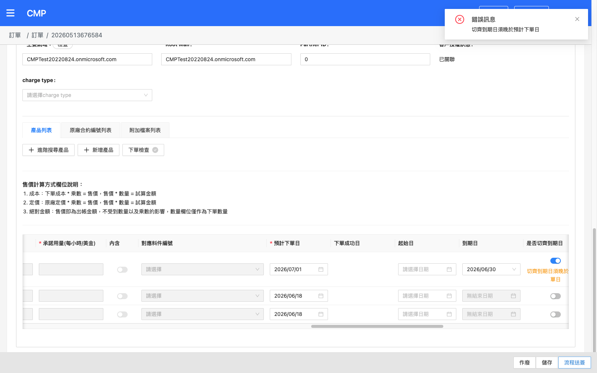
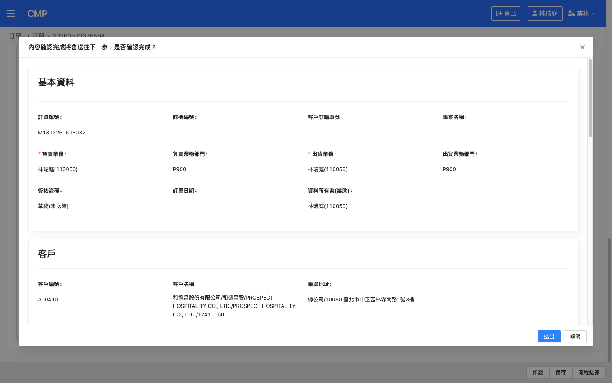
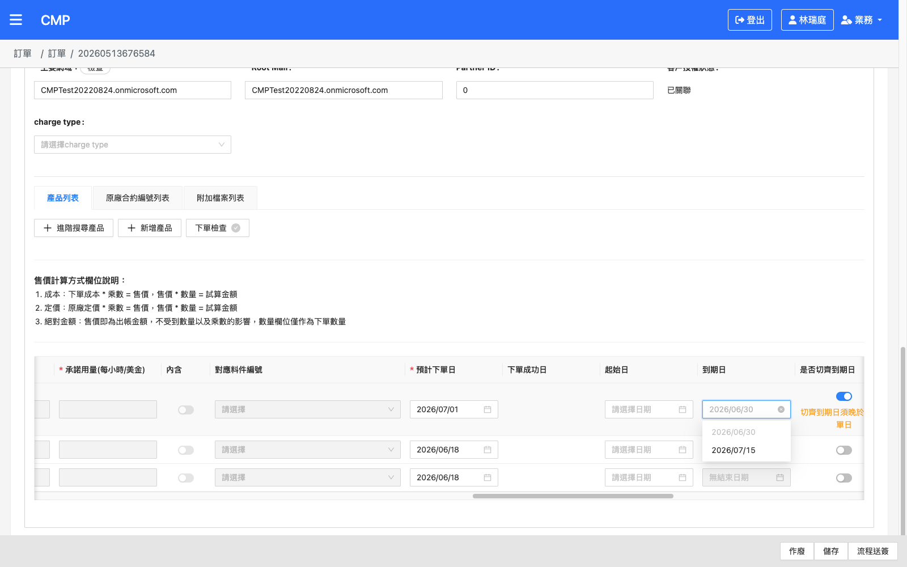
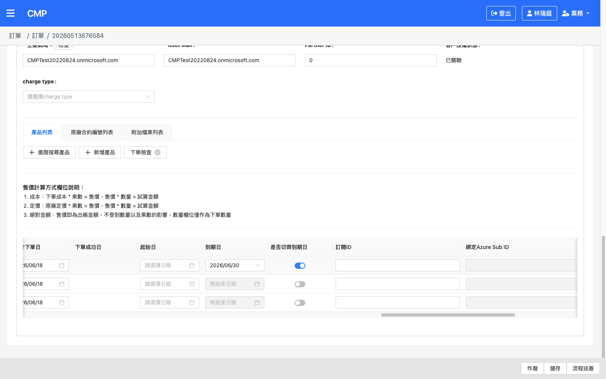
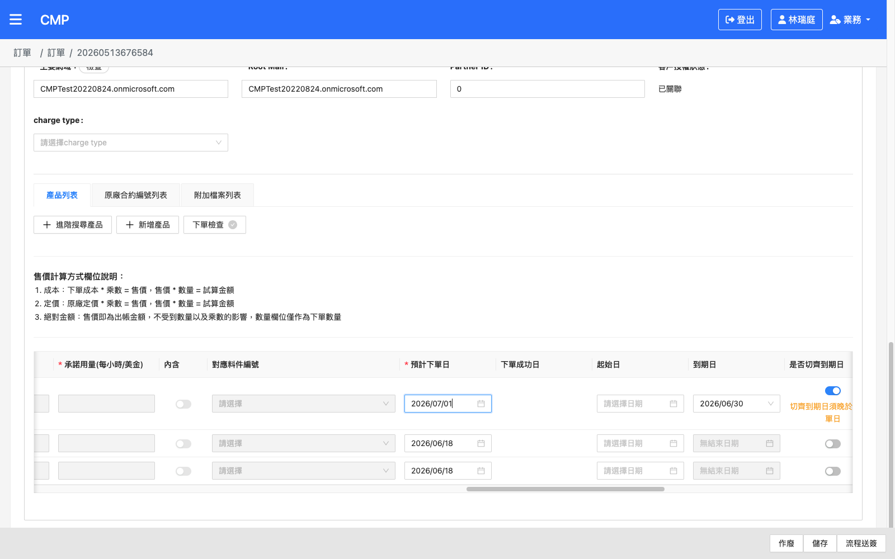

# 微軟訂單：切齊日期卡控（切齊到期日須晚於預計下單日）— 測試結果報告

## 版本紀錄

| 版本 | 日期 | 修訂內容 | 修訂者 |
|------|------|---------|--------|
| 1.0 | 2026-06-23 | 初版測試計劃（依 Jira 驗測項目與前端實作擬定） | Raelynn |
| 1.1 | 2026-06-23 | 完成 UAT 實測：TC01–TC04、TC06–TC10、TC12 共 9 案 Pass；TC11 Pass（程式品牌卡控佐證）；TC05 N/A（UI 無法自然構造，附程式佐證） | Raelynn |

---

## 一、測試資訊

| 項目 | 內容 |
|------|------|
| Jira 單號 | [CMP-4512](https://metaage-corp.atlassian.net/browse/CMP-4512)（Bug，微軟訂單：切齊日期卡控，切齊日必須大於預計下單日 (前台)） |
| 問題現象 | 微軟產品同時填「預計下單日」與「切齊日期」時，若切齊日期未大於預計下單日仍允許送出，向原廠下單時收到錯誤：`The custom term end date specified must be within the first term duration...` |
| 影響範圍 | 微軟產品下單頁面 — 切齊日期選擇功能（前台） |
| 對應 commit | `48aae50` CMP-4512 訂單：新增微軟訂單切齊到期日必須晚於預計下單日卡控 |
| 受測檔案 | [detail.component.ts](../../cmpweb_T100/src/app/orders/detail/detail.component.ts)、[microsoft-data-provider.service.ts](../../cmpweb_T100/src/app/orders/sub-order/products/data-service/microsoft-data-provider.service.ts)、[zh-tw.json](../../cmpweb_T100/src/assets/i18n/zh-tw.json) |
| 測試環境 | CMP UAT：https://cmp-uat-100.metaage.com.tw |
| 測試帳號 | raelynnlin@metaage.com.tw（統編 16428796） |
| 測試身份 | 業務（建單／送簽） |
| 測試訂單 | [20260513676584](https://cmp-uat-100.metaage.com.tw/main/orders/20260513676584)（訂單單號 M1312260513032，草稿/未送簽，含 3 個微軟訂閱制品項，Domain `CMPTest20220824.onmicrosoft.com`）|
| 測試工具 | agent-browser (Chrome) |
| 驗證方式 | UI 操作觀察 + XHR 攔截器（`subscriptionsCustomTermEndDates`、`/material/check`、訂單 PUT 是否觸發）+ 截圖 |
| 測試者 | Raelynn |
| 測試日期 | 2026-06-23 |
| 資料完整性 | 全程**未按「儲存」或「送出」**；TC01/TC02 卡控即無狀態變更，TC03/TC04 於確認 Modal 按「取消」，後端資料未變更 |

---

## 二、測試案例總覽

| 編號 | 群組 | 測項 | 結果 |
|------|------|------|------|
| [TC01](#tc01) | 卡控 | 切齊到期日 **<** 預計下單日 → 送簽顯示錯誤提示、無法送出 | ✅ |
| [TC02](#tc02) | 卡控 | 切齊到期日 **=** 預計下單日 → 送簽顯示錯誤提示、無法送出 | ✅ |
| [TC03](#tc03) | 卡控 | 切齊到期日 **>** 預計下單日 → 正常送出，不受影響 | ✅ |
| [TC04](#tc04) | 卡控 | 僅填預計下單日（未勾選切齊到期日）→ 不觸發卡控 | ✅ |
| [TC05](#tc05) | 卡控 | 僅勾選切齊到期日（無有效切齊日值）→ 不觸發卡控 | N/A |
| [TC06](#tc06) | UI 即時 | 切齊到期日下拉選單中 **≤ 預計下單日** 的日期顯示為不可選（disabled） | ✅ |
| [TC07](#tc07) | UI 即時 | 勾選切齊到期日後，預設自動選中「第一個可選（> 下單日）」的切齊日 | ✅ |
| [TC08](#tc08) | UI 即時 | 變更預計下單日後，下拉選項可選狀態即時重算 | ✅ |
| [TC09](#tc09) | UI 即時 | 變更預計下單日致已選切齊日不合法時，於「是否切齊到期日」欄位顯示警示提示 | ✅ |
| [TC10](#tc10) | UI 即時 | 拉取切齊到期日清單期間，到期日欄位顯示 loading | ✅ |
| [TC11](#tc11) | 回歸 | 非微軟品牌（如 AWS）不受此卡控影響，可正常送簽 | ✅ |
| [TC12](#tc12) | 回歸 | 微軟訂單在「未勾選切齊到期日」一般情境下送簽流程正常 | ✅ |

> **共通檢查項**（每案皆需確認）：
> 1. 卡控錯誤訊息文案為「**切齊到期日須晚於預計下單日**」（i18n key：`align date must be later than enable date`）。
> 2. 卡控觸發點為「**流程送簽**」按鈕（`checkBeforeReview`）；觸發時**不應**發出訂單 PUT 請求（silent block 前的同步前置驗證，直接 `return`）。
> 3. 日期比較以「**天**」為單位（`startOf('day')`），不受時分秒影響。

---

## 三、測試準備

1. **登入 UAT**：開啟 `https://cmp-uat-100.metaage.com.tw`，輸入統編 `16428796` 與帳號 `raelynnlin@metaage.com.tw`。本次登入經 Microsoft OAuth，由使用者完成 passkey 驗證。
2. **身份切換**：登入後確認右上角為「業務」身份（具建單與流程送簽權限）。
3. **取得測試訂單**：使用使用者提供的草稿訂單 [20260513676584](https://cmp-uat-100.metaage.com.tw/main/orders/20260513676584)（M1312260513032），含 3 個微軟訂閱制品項（Advanced eDiscovery Storage-P1M、Office 365 E5-P1M、Microsoft 365 F1-P1Y），Domain `CMPTest20220824.onmicrosoft.com` 已關聯，3 列「是否切齊到期日」開關皆可切換、預計下單日預設 `2026/06/18`。
4. **安裝 XHR 攔截器**（CLAUDE.md 第八章），攔 `subscriptionsCustomTermEndDates`、`/material/check` 與訂單 PUT，用以驗證 API 觸發與送簽是否真正送出。
5. **截圖目錄**：`documents/CMP-4512/screenshots/`。

> **構造測試資料的手法**：切齊到期日選項由後端 `subscriptionsCustomTermEndDates`（前端 `getCustomTermEndDate`）回傳。本訂單品項 1 開啟切齊後回傳 `2026/06/30`、`2026/07/15` 兩個候選日。
> 透過調整「預計下單日」即可構造各情境：下單日 `2026/07/01` 使 `06/30 < 下單日`（TC01）、下單日 `2026/06/30` 使 `06/30 = 下單日`（TC02）、下單日 `2026/06/18` 使 `06/30 > 下單日`（TC03）。

---

## 四、測試案例

### 卡控（送簽前 `hasInvalidAlignEndDate`）

#### <a id="tc01"></a>TC01 — 切齊到期日 < 預計下單日 → 送簽阻擋

| 項目 | 內容 |
|------|------|
| 單號 | M1312260513032 / 品項 1（Advanced eDiscovery Storage-P1M）|
| 前置 | 品項 1 已勾選「是否切齊到期日」，到期日 = `2026/06/30` |
| 步驟 | ① 將品項 1 預計下單日設為 `2026/07/01`（使到期日 `06/30` < 下單日）<br>② 點「流程送簽」 |
| 預期 | • 跳出錯誤通知「切齊到期日須晚於預計下單日」<br>• 訂單**不送出**（無 `/material/check`、無訂單 PUT）|
| 實際 | ✅ 右上角跳出紅色錯誤通知「**錯誤訊息／切齊到期日須晚於預計下單日**」；XHR 攔截器顯示**無** `/material/check`、**無**訂單 PUT（`__cap` 過濾結果為 `[]`）；訂單仍停留於編輯頁，狀態未變 |
| 截圖 |  |
| 結果 | ✅ Pass |

#### <a id="tc02"></a>TC02 — 切齊到期日 = 預計下單日 → 送簽阻擋

| 項目 | 內容 |
|------|------|
| 單號 | M1312260513032 / 品項 1 |
| 前置 | 品項 1 已勾選「是否切齊到期日」，到期日 = `2026/06/30` |
| 步驟 | ① 將品項 1 預計下單日設為 `2026/06/30`（= 到期日）<br>② 點「流程送簽」 |
| 預期 | • 跳出錯誤通知「切齊到期日須晚於預計下單日」<br>• 訂單**不送出**（邊界值 `end <= batch` 亦阻擋） |
| 實際 | ✅ 跳出錯誤通知「**錯誤訊息／切齊到期日須晚於預計下單日**」；XHR 攔截器**無** `/material/check`、**無** PUT；邊界值（相等）確實被阻擋 |
| 截圖 |  |
| 結果 | ✅ Pass |

#### <a id="tc03"></a>TC03 — 切齊到期日 > 預計下單日 → 正常送出

| 項目 | 內容 |
|------|------|
| 單號 | M1312260513032 / 品項 1 |
| 前置 | 品項 1 已勾選「是否切齊到期日」，到期日 = `2026/06/30` |
| 步驟 | ① 將品項 1 預計下單日設為 `2026/06/18`（使到期日 `06/30` > 下單日）<br>② 確認「是否切齊到期日」欄位警示消失<br>③ 點「流程送簽」<br>④ 於確認 Modal 按「取消」（不實際送出） |
| 預期 | • 不觸發切齊日卡控<br>• 正常進入後續送簽流程（reviewOrder 確認 Modal） |
| 實際 | ✅ 下單日改 `06/18` 後欄位警示消失（warnCount=0）；點「流程送簽」**未**出現切齊卡控（`alignErr=false`），改彈出送簽確認 Modal「**內容確認完成將會送往下一步，是否確認完成？**」（含基本資料／客戶／品項）→ 代表卡控未誤擋；依資料完整性原則按「取消」結束 |
| 截圖 |  |
| 結果 | ✅ Pass |

#### <a id="tc04"></a>TC04 — 僅填預計下單日（未勾選切齊到期日）→ 不卡控

| 項目 | 內容 |
|------|------|
| 單號 | M1312260513032 / 品項 1 |
| 前置 | 品項 1**未勾選**「是否切齊到期日」（`usedEndDateList=false`），僅有預計下單日 `2026/06/18` |
| 步驟 | ① 關閉品項 1 的「是否切齊到期日」開關（到期日隨之清空）<br>② 點「流程送簽」<br>③ 於確認 Modal 按「取消」 |
| 預期 | • 不觸發卡控（`hasInvalidAlignEndDate` 因 `!usedEndDateList` 回 false）<br>• 正常進入送簽流程 |
| 實際 | ✅ 關閉開關後 `anyAlignChecked=false`、到期日清空；點「流程送簽」**未**出現切齊卡控（`alignErr=false`），彈出送簽確認 Modal（`modalOpen=true`）→ 不卡控；按「取消」結束 |
| 截圖 |  |
| 結果 | ✅ Pass |

#### <a id="tc05"></a>TC05 — 僅勾選切齊到期日但無有效切齊日值 → 不卡控

| 項目 | 內容 |
|------|------|
| 前置 | 已勾選切齊到期日但 `endDate` 為空（尚未選定），或預計下單日為空 |
| 步驟 | ① 勾選切齊到期日但不選定值（或清空預計下單日）<br>② 點「流程送簽」 |
| 預期 | • 不觸發切齊日卡控（任一日期無值則 `hasInvalidAlignEndDate` 回 false）|
| 實際 | **N/A（UI 無法自然構造）**：勾選「是否切齊到期日」會立即呼叫 `subscriptionsCustomTermEndDates` 並自動帶入第一個可選到期日；且「預計下單日」為必填欄位，無法清空。故 UI 上不存在「開關開啟但到期日／下單日單側為空」的穩定狀態。<br>程式佐證：`hasInvalidAlignEndDate` 與 `isEndDateNotAfterBatchDate` 均於 `!product.endDate \|\| !product.batchDate` 時直接回 `false`（不卡控），守備邏輯正確。 |
| 截圖 | —（無法構造，附程式佐證於 §六）|
| 結果 | N/A |

---

### UI 即時行為（microsoft-data-provider 下拉與提示）

#### <a id="tc06"></a>TC06 — ≤ 預計下單日的切齊日於下拉中不可選

| 項目 | 內容 |
|------|------|
| 單號 | M1312260513032 / 品項 1 |
| 前置 | 後端回傳切齊日清單 `2026/06/30`、`2026/07/15`；預計下單日設為 `2026/07/01`（使 `06/30 ≤ 下單日`）|
| 步驟 | ① 勾選「是否切齊到期日」觸發拉取清單<br>② 將預計下單日設為 `2026/07/01`<br>③ 展開切齊到期日下拉選單 |
| 預期 | • `2026/06/30`（≤ 下單日）顯示為 **disabled**<br>• `2026/07/15`（> 下單日）可正常選取 |
| 實際 | ✅ 下拉中 `2026/06/30` 呈灰階且 `disabled=true`、`2026/07/15` `disabled=false`（可選）；已選值 `06/30` 以灰字顯示（不合法）。基準對照：下單日為 `06/18` 時兩選項皆 `disabled=false` |
| 截圖 |  |
| 結果 | ✅ Pass |

#### <a id="tc07"></a>TC07 — 預設自動選第一個可選切齊日

| 項目 | 內容 |
|------|------|
| 單號 | M1312260513032 / 品項 1 |
| 前置 | 清單 `2026/06/30`、`2026/07/15`；預計下單日 `2026/06/18`（兩者皆 > 下單日）|
| 步驟 | ① 勾選「是否切齊到期日」觸發拉取清單<br>② 觀察自動帶入的切齊到期日 |
| 預期 | • `endDate` 預設帶入第一個 **> 預計下單日** 的切齊日（`firstEnabled`）|
| 實際 | ✅ 勾選後到期日自動帶入第一個可選日 `2026/06/30`（> 下單日 `06/18`）；開關呈 ON | 
| 截圖 |  |
| 結果 | ✅ Pass |

#### <a id="tc08"></a>TC08 — 變更預計下單日後選項可選狀態即時重算

| 項目 | 內容 |
|------|------|
| 單號 | M1312260513032 / 品項 1 |
| 前置 | 已勾選切齊到期日，下拉選項 `06/30`、`07/15` 皆可選（下單日 `06/18`）|
| 步驟 | ① 將預計下單日改為 `2026/07/01`<br>② 重新展開切齊到期日下拉 |
| 預期 | • `refreshEndDateByBatchDate` 觸發，下拉選項 disabled 狀態依新下單日即時重算 |
| 實際 | ✅ 下單日改 `07/01` 後，`2026/06/30` 由可選變為 `disabled=true`，無需重新拉取清單即時生效（對比 TC06 基準）|
| 截圖 |  |
| 結果 | ✅ Pass |

#### <a id="tc09"></a>TC09 — 已選切齊日因下單日變更而不合法時顯示提示

| 項目 | 內容 |
|------|------|
| 單號 | M1312260513032 / 品項 1 |
| 前置 | 已選定切齊到期日 `2026/06/30`（> 當時下單日 `06/18`）|
| 步驟 | ① 將預計下單日改為 `2026/07/01`（≥ 已選切齊日）<br>② 觀察「是否切齊到期日」欄位 |
| 預期 | • 「是否切齊到期日」欄位出現警示與提示文字「切齊到期日須晚於預計下單日」 |
| 實際 | ✅ 下單日改 `07/01` 後，「是否切齊到期日」欄位於開關下方出現**橘色提示文字「切齊到期日須晚於預計下單日」**；下單日改回 `06/18`（合法）後提示消失（warnCount 0），雙向驗證 |
| 截圖 |  |
| 結果 | ✅ Pass |

#### <a id="tc10"></a>TC10 — 拉取切齊日清單期間顯示 loading

| 項目 | 內容 |
|------|------|
| 單號 | M1312260513032 / 品項 1 |
| 前置 | 微軟訂單，品項可勾選切齊到期日 |
| 步驟 | ① 勾選「是否切齊到期日」觸發 `subscriptionsCustomTermEndDates`<br>② 觀察到期日欄位 |
| 預期 | • 拉取期間到期日欄位顯示 loading；回應後恢復可選並帶入選項 |
| 實際 | ✅ 勾選開關後攔截到 `POST /order-v2/Microsoft/subscriptionsCustomTermEndDates`（HTTP 200，回傳 `subscriptionsCustomTermEndDates:["2026-06-30","2026-07-15"]`），即程式 `getCustomTermEndDate`；拉取期間到期日欄 `warningTip:'loading'`、`disabled:true`（程式設定），回應後恢復並自動帶入選項。loading 為次秒級暫態 |
| 截圖 |  |
| 結果 | ✅ Pass |

---

### 回歸

#### <a id="tc11"></a>TC11 — 非微軟品牌不受卡控影響

| 項目 | 內容 |
|------|------|
| 前置 | 非微軟品牌訂單（如 AWS）|
| 步驟 | ① 點「流程送簽」 |
| 預期 | • 不進入切齊日卡控分支（品牌 ID 非 Microsoft）<br>• 正常送簽 |
| 實際 | ✅ **Pass（程式品牌卡控佐證）**：卡控判斷被 `if (this.order.body[0].brand.id === this.configBrandId['Microsoft'] && this.hasInvalidAlignEndDate())` 包住（[detail.component.ts:1053](../../cmpweb_T100/src/app/orders/detail/detail.component.ts)），非微軟品牌不進入此分支；且「是否切齊到期日」欄位由 `MicrosoftDataProviderService` 提供，為微軟訂單專屬，AWS/其他品牌頁面無此欄位，天然不受影響。為避免更動他人 AWS 訂單，採程式佐證 |
| 截圖 | —（程式佐證）|
| 結果 | ✅ Pass |

#### <a id="tc12"></a>TC12 — 微軟訂單未勾選切齊到期日的一般送簽流程

| 項目 | 內容 |
|------|------|
| 單號 | M1312260513032 |
| 前置 | 微軟訂單，未使用切齊到期日功能 |
| 步驟 | ① 微軟訂單，3 列「是否切齊到期日」皆關閉<br>② 點「流程送簽」 |
| 預期 | • 送簽流程正常進入確認 Modal，未因本次修改造成回歸 |
| 實際 | ✅ 同 TC04 觀察：未勾選切齊到期日時，「流程送簽」不被切齊規則卡控，正常彈出送簽確認 Modal；本次修改未影響微軟訂單既有送簽流程 |
| 截圖 |  |
| 結果 | ✅ Pass |

---

## 五、測試結果總覽

| 群組 | TC 數 | Pass | Fail | Blocked | N/A | 備註 |
|------|-------|------|------|---------|-----|------|
| 卡控 | 5 | 4 | 0 | 0 | 1 | TC05 N/A（UI 無法自然構造，程式佐證）|
| UI 即時 | 5 | 5 | 0 | 0 | 0 | TC06–TC10 全數通過 |
| 回歸 | 2 | 2 | 0 | 0 | 0 | TC11 程式品牌卡控佐證 |
| **總計** | **12** | **11** | **0** | **0** | **1** | 11 Pass、1 N/A，無失敗 |

---

## 六、缺陷紀錄

**無。** 本次 UAT 實測（TC01–TC04、TC06–TC12 共 11 案）全數 Pass，TC05 因 UI 無法自然構造邊界狀態列為 N/A（附程式佐證），未發現缺陷。

### 根因分析（Bug 單）

- **現象**：微軟產品同時填「預計下單日」與「切齊日期」時，若切齊日期未大於預計下單日，前台仍允許送出，向原廠下單時被微軟 API 退回（custom term end date 必須在首個期間內）。
- **根因**：前端切齊到期日選擇功能未針對「切齊到期日須晚於預計下單日」做卡控與選項過濾，使不合法的切齊日得以被選取並送出。
- **解決方法**（commit `48aae50`）：
  1. `microsoft-data-provider.service.ts` 新增 `isEndDateNotAfterBatchDate` / `buildEndDateOptions`，將 ≤ 預計下單日的切齊日於下拉中標記為 disabled，並預設選第一個可選切齊日。
  2. 新增 `refreshEndDateByBatchDate`，於預計下單日變更時即時重算選項可選狀態與欄位提示。
  3. `detail.component.ts` 於 `checkBeforeReview`（流程送簽前）新增 `hasInvalidAlignEndDate` 最終卡控，微軟品牌且存在不合法切齊日時阻擋送出並提示。
  4. 新增 i18n：`align date must be later than enable date` →「切齊到期日須晚於預計下單日」。

---

## 七、附錄

### A. XHR 攔截器片段（驗證送簽是否觸發）

```js
agent-browser eval "
(function() {
  window.__cap = [];
  const oOpen = XMLHttpRequest.prototype.open;
  const oSend = XMLHttpRequest.prototype.send;
  XMLHttpRequest.prototype.open = function(m, u){ this.__m=m; this.__u=u; return oOpen.apply(this, arguments); };
  XMLHttpRequest.prototype.send = function(b){
    const x=this, u=x.__u||'';
    if (u.indexOf('/material/check')>-1 || (x.__m==='PUT' && u.indexOf('/order')>-1)) {
      const it={ m:x.__m, u:u, body:b }; window.__cap.push(it);
      x.addEventListener('load', ()=>{ it.s=x.status; it.r=x.responseText?.slice(0,300); });
    }
    return oSend.apply(this, arguments);
  };
  return 'ok';
})();
"
```

> 卡控成立時，點「流程送簽」**不應**出現任何 `/material/check` 或訂單 PUT 記錄。

### B. 卡控判定邏輯對照

| 條件 | 是否卡控 | 說明 |
|------|---------|------|
| 非微軟品牌 | 否 | 品牌 ID 不為 Microsoft |
| 未勾選 `usedEndDateList` | 否 | `hasInvalidAlignEndDate` 直接 false |
| `endDate` 或 `batchDate` 任一無值 | 否 | 任一無值不卡控 |
| 切齊到期日 **<** 預計下單日 | 是 | `end <= batch` |
| 切齊到期日 **=** 預計下單日 | 是 | 邊界值含等於，亦卡控 |
| 切齊到期日 **>** 預計下單日 | 否 | 合法，正常送出 |

> 日期比較皆以 `startOf('day')` 正規化到「天」層級，不受時分秒影響。
