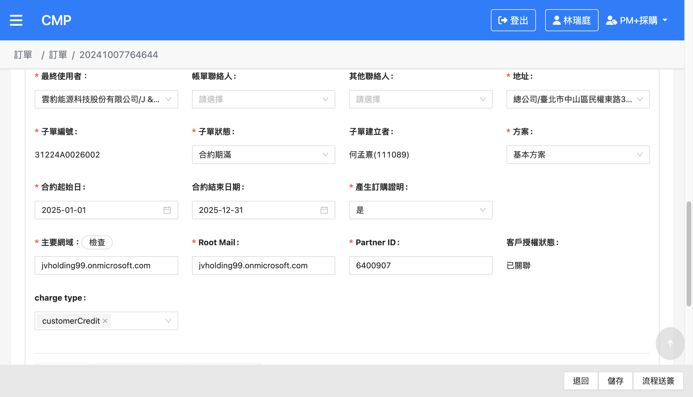
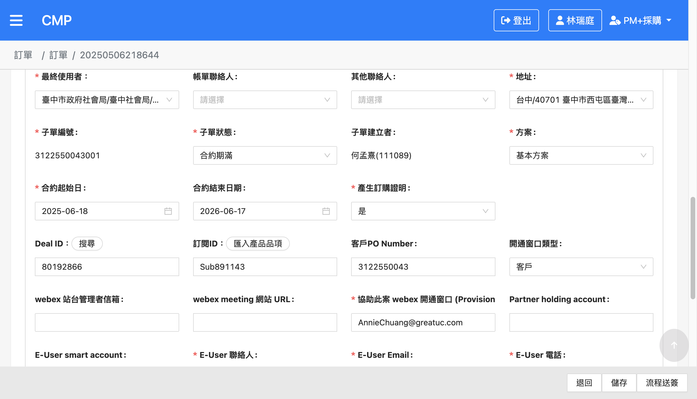
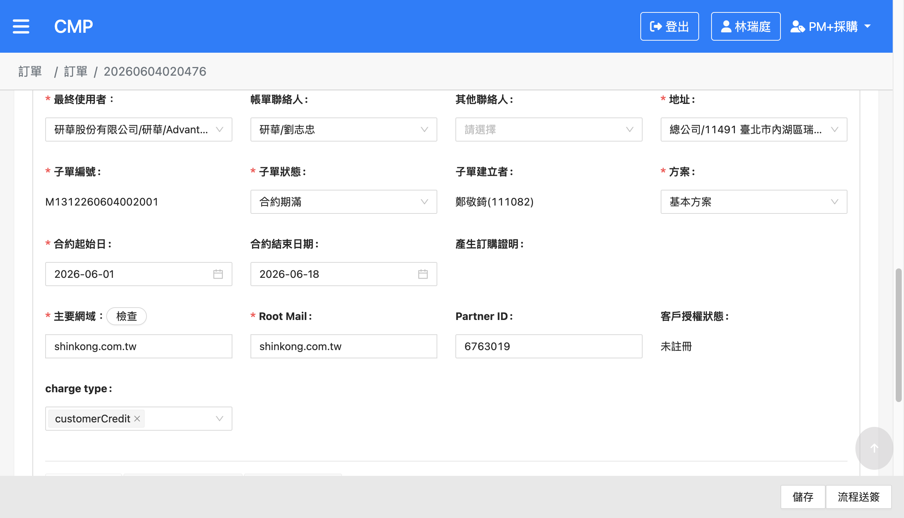
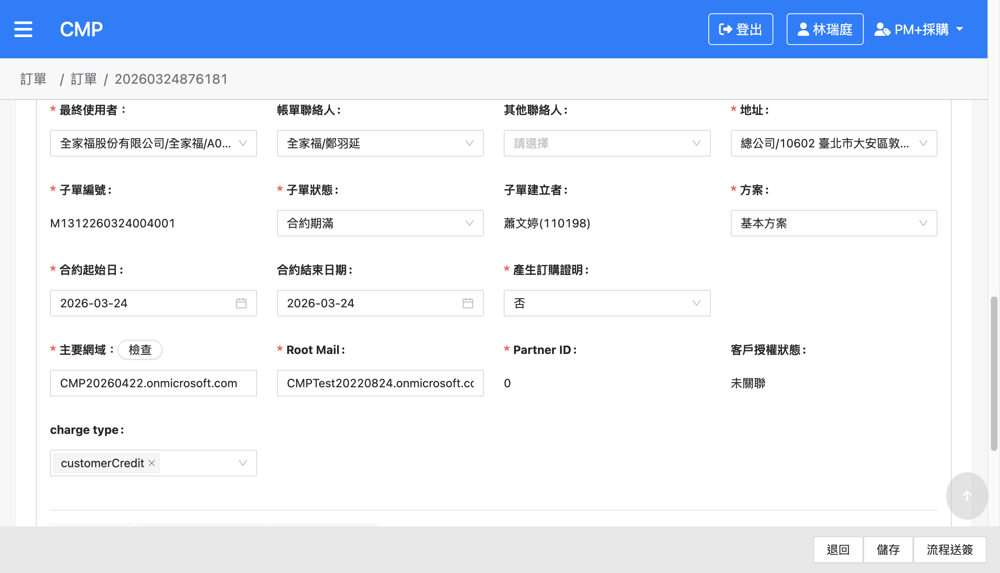
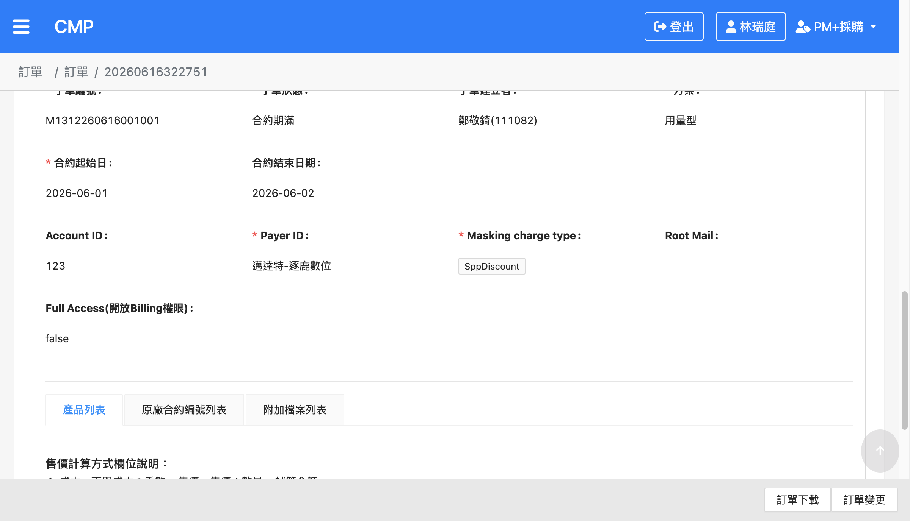
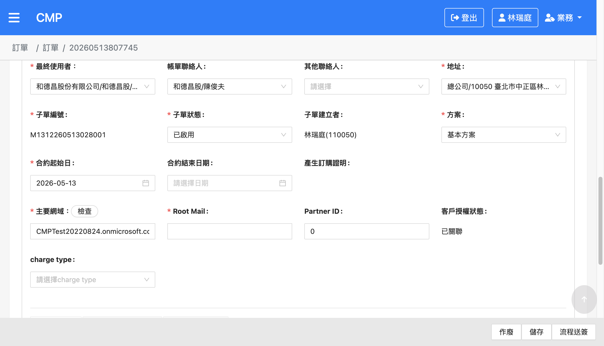
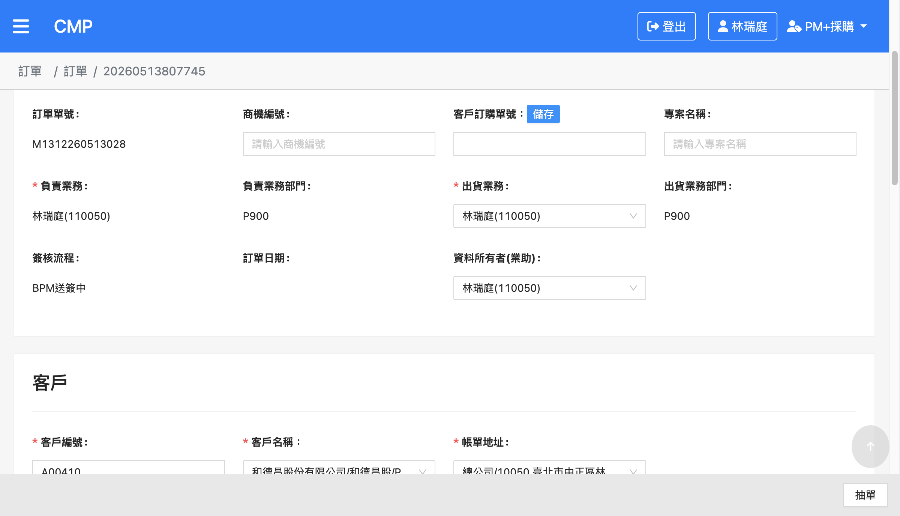
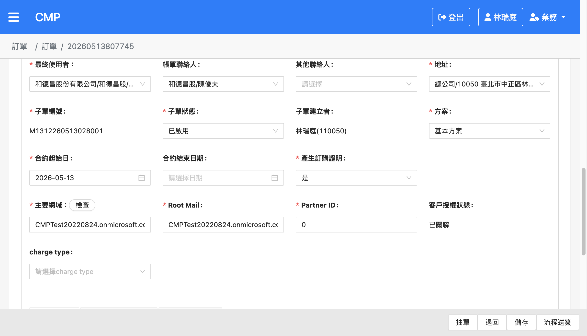
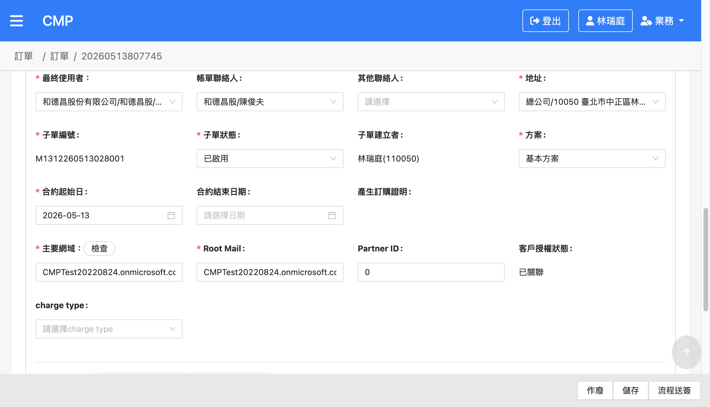
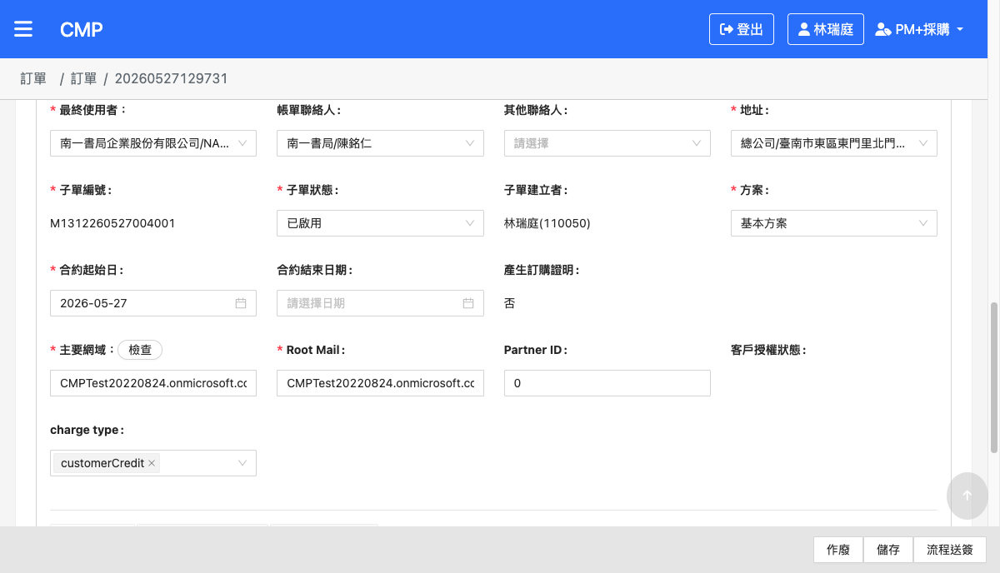

# CMP-4514 訂單：子單「產生訂購證明」預設值改為「是」(前台) — 測試結果報告

## 版本紀錄

| 版本 | 日期 | 修訂內容 | 修訂者 |
|------|------|----------|--------|
| v1.0 | 2026-06-22 | 初版，依 CMP-4514 程式變更建立並完成 UAT 測試（TC-01～TC-05 全數通過） | Raelynn |
| v1.1 | 2026-06-22 | 新增 TC-06：實際操作草稿訂單「送簽→BPM核准→PM審核」端到端流程，驗證自然轉換至 PM審核 時正確帶入「是」 | Raelynn |
| v1.2 | 2026-06-22 | 新增 TC-07（抽單後值保留）：暫記疑似缺陷 DEF-01 — 抽單後 `isGeneratePurchaseProof` 回到 undefined；補充根因分析 | Raelynn |
| v1.3 | 2026-06-22 | 經情境 A／B 完整實測（TC-08：PM審核 改值並儲存→退回→值保留 false）與程式碼分析，釐清退回／抽單為 header-only、不覆寫子單已存值，現行行為正確；撤除 DEF-01、TC-07 改判為 Pass、新增 TC-08，全數通過無缺陷 | Raelynn |

---

## 一、測試資訊

| 項目 | 內容 |
|------|------|
| Jira 單號 | [CMP-4514](https://metaage-corp.atlassian.net/browse/CMP-4514) — 訂單：子單「產生訂購證明」，預設值改為"是" (前台) |
| 需求類型 | 任务（前台調整） |
| 測試環境 | CMP UAT：https://cmp-uat-100.metaage.com.tw |
| 後端 | cmp-uat-100-svc.metaage.com.tw |
| 測試帳號 | 統編 16428796 / raelynnlin@metaage.com.tw |
| 測試身份 | PM+採購、業務（TC-06 送簽用） |
| 測試工具 | agent-browser（瀏覽器自動化）+ 後端 API 直查（`/order-v2/orders/{id}`） |
| 驗證方式 | UI 觀察「產生訂購證明」欄位預設值與可編輯狀態；並以後端 API 確認該子單 `isGeneratePurchaseProof` 原始值（undefined / true / false）作為對照 |
| 受測檔案 | [src/app/orders/sub-order/sub-order.component.ts](../../cmpweb_T100/src/app/orders/sub-order/sub-order.component.ts)（commit `ef48c352`） |
| 測試者 | Raelynn |
| 測試日期 | 2026-06-22 |

### 變更摘要

於 `sub-order.component.ts` 子單欄位初始化邏輯（微軟 / 思科品牌）中新增（[L313–L319](../../cmpweb_T100/src/app/orders/sub-order/sub-order.component.ts#L313-L319)）：

```text
僅在「PM 審核階段」（this.orderHeader.status === REVIEW_PM，此欄位才開放編輯）
且 isGeneratePurchaseProof 為 undefined / null 時，帶入預設值 true（「是」），
並同步寫回 ma-form 的欄位顯示值（f.value）。
```

- 僅適用 **微軟 (Microsoft)** 與 **思科 (Cisco)** 品牌子單。
- 草稿 / 抽單 / 退回等「審核前」狀態若未曾選擇，維持 undefined（欄位可見但唯讀、不顯示預設值）。
- 若先前已選過值（是 / 否）則保留原值，不被覆蓋。

---

## 二、測試案例總覽

| 編號 | 群組 | 測項 | 結果 |
|------|------|------|------|
| [TC-01](#tc01) | 預設值帶入 | 微軟子單於 PM 審核階段、未曾設定 →「產生訂購證明」預設為「是」且可編輯 | ✅ Pass |
| [TC-02](#tc02) | 預設值帶入 | 思科子單於 PM 審核階段、未曾設定 →「產生訂購證明」預設為「是」且可編輯 | ✅ Pass |
| [TC-03](#tc03) | 審核前狀態 | 微軟子單於「草稿」階段 → 欄位顯示但唯讀，不帶入預設值（維持空） | ✅ Pass |
| [TC-04](#tc04) | 保留已選值 | 子單先前已選「否」→ PM 審核仍為「否」，不被覆蓋為「是」 | ✅ Pass |
| [TC-05](#tc05) | 回歸 | 非微軟 / 思科品牌（AWS）子單 →「產生訂購證明」欄位不顯示 | ✅ Pass |
| [TC-06](#tc06) | 端到端流程 | 草稿訂單實際「流程送簽 → BPM核准 → PM審核」後，PM審核 階段正確自動帶入「是」 | ✅ Pass |
| [TC-07](#tc07) | 退回後值（未存檔） | 情境B：PM審核 **未修改未儲存** 該值，直接退回／抽單 → 子單 `isGeneratePurchaseProof` 維持 undefined（顯示空白）為正確（預設「是」僅為顯示、未存檔） | ✅ Pass |
| [TC-08](#tc08) | 退回後值（已存檔） | 情境A：PM審核 **修改並儲存**（是→否）後退回 → 子單 `isGeneratePurchaseProof` 保留為 PM審核 設定值（否），不被清為 undefined | ✅ Pass |

> 共通檢查項：各 TC 開啟頁面無 JS console error；「產生訂購證明」欄位之 readonly 狀態符合階段規則（僅 PM 審核可編輯）。
> 驗證原則：先以後端 API 取得該子單 `isGeneratePurchaseProof` 原始值，再對照 UI 顯示，確認預設值是「程式帶入」而非「資料庫既有」。
> TC-01～TC-05 以「狀態篩選」取得既有各階段訂單驗證；TC-06 則實際操作一張草稿訂單走完完整送簽流程，驗證自然轉換到 PM審核 時的顯示。

---

## 三、測試準備

1. 以 agent-browser（headed 模式）開啟 https://cmp-uat-100.metaage.com.tw，由使用者完成 Microsoft (Azure AD) 通行金鑰登入。
2. 登入後於右上角切換至 **PM+採購** 身份。
3. 確認 UAT 已部署含 commit `ef48c352` 的版本（PM 審核 MS/Cisco 子單可見「產生訂購證明」預設「是」）。
4. 於訂單列表以「品牌」「簽核狀態＝待您簽核」篩選取得 MS / Cisco / AWS 訂單；並透過後端 API 批次確認各子單 `isGeneratePurchaseProof` 原始值，挑選符合各 TC 前置的測試資料。
5. 截圖存放於 `documents/CMP-4514/screenshots/`。

### 本次採用之測試資料（後端 API 對照）

| TC | 訂單 ID | 子單編號 | 品牌 | 訂單狀態 | 後端 `isGeneratePurchaseProof` 原始值 |
|----|---------|----------|------|----------|----------------------------------------|
| TC-01 | 20241007764644 | 31224A0026002 | Microsoft | REVIEW_PM（PM審核） | undefined（未設定） |
| TC-02 | 20250506218644 | 3122550043001 | Cisco | REVIEW_PM（PM審核） | undefined（未設定） |
| TC-03 | 20260604020476 | M1312260604002001 | Microsoft | DRAFT（草稿/未送簽） | undefined（未設定） |
| TC-04 | 20260324876181 | M1312260324004001 | Microsoft | REVIEW_PM（PM審核） | **false** |
| TC-05 | 20260616322751 | M1312260616001001 | AWS | APPROVAL（已核准） | （AWS 無此欄位） |
| TC-06 | 20260513807745 | M1312260513028001 | Microsoft | DRAFT →（送簽）→ REVIEW_BPM →（BPM核准）→ REVIEW_PM | undefined（全程未設定） |
| TC-07 | 20260513807745 | M1312260513028001 | Microsoft | REVIEW_PM →（抽單，未存檔）→ DRAWN | undefined（未存檔，維持） |
| TC-08 | 20260527129731 | M1312260527004001 | Microsoft | REVIEW_PM →（改否+儲存→退回）→ REJECTED | undefined → **false**（儲存後保留） |

> **CMP 訂單簽核流程（程式 `ApprovalStatusOrder`）**：`草稿(0) → BPM送簽中(1) → PM審核(2) → 採購審核(3) → …`。業務「流程送簽」後，訂單會先進入 **BPM送簽中（外部 Sysage BPM 簽核）**，待 BPM 核准後才轉為 **PM審核**。`isGeneratePurchaseProof` 在整段流程中皆維持 undefined，直到 PM 於 PM審核 階段開啟訂單時，由 CMP-4514 程式帶入「是」。

---

## 四、測試案例

<a id="tc01"></a>
### TC-01 微軟子單 PM 審核階段預設「是」

| 項目 | 內容 |
|------|------|
| 單號 | 訂單 20241007764644、子單 31224A0026002（Microsoft） |
| 前置 | 後端確認該子單 `isGeneratePurchaseProof` 為 undefined；訂單 header 狀態為 REVIEW_PM |
| 步驟 | ① 以 PM+採購 身份開啟 `/main/orders/20241007764644` ② 捲動至微軟子單區塊 ③ 觀察「產生訂購證明」欄位預設值與可編輯狀態 ④ 點開下拉確認選項 |
| 預期 | 欄位預設選中「是」，且可編輯（非 readonly），下拉有「是 / 否」選項 |
| 實際 | 欄位顯示 **「是」**，控制項 `disabled=false`（可編輯）、為必填；點開下拉可見「是」「否」兩選項，確認可互動。後端原始值為 undefined → 確認「是」係程式預設帶入 |
| 截圖 |  |
| 結果 | ✅ Pass |

<a id="tc02"></a>
### TC-02 思科子單 PM 審核階段預設「是」

| 項目 | 內容 |
|------|------|
| 單號 | 訂單 20250506218644、子單 3122550043001（Cisco，含 Deal ID 80192866 / 訂閱ID Sub891143） |
| 前置 | 後端確認該子單 `isGeneratePurchaseProof` 為 undefined；訂單 header 狀態為 REVIEW_PM |
| 步驟 | ① 以 PM+採購 身份開啟 `/main/orders/20250506218644` ② 捲動至思科子單區塊 ③ 觀察「產生訂購證明」欄位 |
| 預期 | 欄位預設選中「是」，且可編輯 |
| 實際 | 欄位顯示 **「是」**，控制項 `disabled=false`（可編輯）、為必填。後端原始值為 undefined → 確認「是」係程式預設帶入。驗證思科與微軟走同一程式分支（`isMicrosoft \|\| isCisco`）行為一致 |
| 截圖 |  |
| 結果 | ✅ Pass |

<a id="tc03"></a>
### TC-03 審核前（草稿）階段欄位唯讀且不帶預設值

| 項目 | 內容 |
|------|------|
| 單號 | 訂單 20260604020476、子單 M1312260604002001（Microsoft） |
| 前置 | 後端確認該子單 `isGeneratePurchaseProof` 為 undefined；訂單狀態為 DRAFT（草稿/未送簽，非 PM 審核） |
| 步驟 | ① 以 PM+採購 身份開啟 `/main/orders/20260604020476` ② 觀察微軟子單「產生訂購證明」欄位 |
| 預期 | 欄位顯示但唯讀（不可編輯），且未帶入「是」預設值（維持空白） |
| 實際 | 欄位標籤存在但控制項內容為 **空**（無「是」亦無「否」、未顯示可編輯下拉）。確認非 PM 審核階段不會套用預設值，與 TC-01（同為微軟、undefined，但因 PM 審核而顯示「是」）形成明確對照 |
| 截圖 |  |
| 結果 | ✅ Pass |

<a id="tc04"></a>
### TC-04 已選「否」於 PM 審核保留不覆蓋

| 項目 | 內容 |
|------|------|
| 單號 | 訂單 20260324876181、子單 M1312260324004001（Microsoft） |
| 前置 | 後端確認該子單 `isGeneratePurchaseProof` 已為 **false**；訂單 header 狀態為 REVIEW_PM |
| 步驟 | ① 以 PM+採購 身份開啟 `/main/orders/20260324876181` ② 觀察「產生訂購證明」欄位值 |
| 預期 | 欄位仍為「否」，未被預設值「是」覆蓋 |
| 實際 | 欄位顯示 **「否」**、可編輯。後端原始值為 false → 確認程式在 PM 審核階段「僅當 undefined/null 才帶預設」，已存值不被覆蓋。（另：思科亦有相同情形之資料 20250506489003 / 20251113533221，後端 igp=false，行為一致） |
| 截圖 |  |
| 結果 | ✅ Pass |

<a id="tc05"></a>
### TC-05 非微軟/思科品牌不顯示欄位（回歸）

| 項目 | 內容 |
|------|------|
| 單號 | 訂單 20260616322751、子單 M1312260616001001（AWS） |
| 前置 | AWS 品牌訂單（已核准） |
| 步驟 | ① 以 PM+採購 身份開啟 `/main/orders/20260616322751` ② 捲動至 AWS 子單區塊 ③ 確認是否出現「產生訂購證明」欄位 |
| 預期 | 「產生訂購證明」欄位不顯示 |
| 實際 | AWS 子單面板呈現 Account ID / Payer ID / Masking charge type / Root Mail / Full Access 等 AWS 專屬欄位，**全頁無「產生訂購證明」欄位**（程式中該欄位 visible 預設為 false，僅微軟/思科才設為 true）。回歸正常 |
| 截圖 |  |
| 結果 | ✅ Pass |

<a id="tc06"></a>
### TC-06 草稿送簽 → PM審核 端到端流程顯示「是」

| 項目 | 內容 |
|------|------|
| 單號 | 訂單 20260513807745 / M1312260513028、子單 M1312260513028001（Microsoft，建立者：林瑞庭） |
| 前置 | 一張微軟草稿訂單，子單 `isGeneratePurchaseProof` 未設定（undefined） |
| 步驟 | ① 以 **業務** 身份開啟草稿訂單，確認「產生訂購證明」為空白／唯讀 ② 點「流程送簽」→ reviewOrder 確認視窗點「送出」③ 觀察送簽後訂單狀態 ④ 由 BPM 核准後，再開啟訂單觀察 PM審核 階段「產生訂購證明」欄位 |
| 預期 | 草稿階段欄位空白；送簽成功；到達 PM審核 後欄位自動帶入「是」且可編輯 |
| 實際 | ① 草稿階段欄位 **空白**（唯讀，無預設）→ 截圖 1 ② 點「流程送簽」首次因子單 **Root Mail** 必填未填被擋（silent fail，無 PUT）；補填 Root Mail 後再送簽，發出 `PUT /order-v2/orders/{id}/orderDetails/{subId}`(200) 與 `PUT /order-v2/orders/{id}`(200)，送簽成功 ③ 送簽後狀態為 **REVIEW_BPM（BPM送簽中）**，欄位仍唯讀無預設 → 截圖 2 ④ 經使用者於 BPM 系統核准後，狀態轉為 **REVIEW_PM（PM審核）**；後端 `isGeneratePurchaseProof` 仍為 undefined，前端「產生訂購證明」**自動帶入「是」且可編輯** → 截圖 3 |
| 截圖 | <br><br> |
| 備註 | 此 TC 證實：完整「草稿→送簽→BPM核准→PM審核」路徑下，CMP-4514 預設邏輯在自然轉換到 PM審核 時正確觸發；中間的 BPM送簽中 階段不會誤帶預設值，也不會改動 `isGeneratePurchaseProof`。另發現 MS 子單 **Root Mail 為送簽必填**，未填會 silent fail（與 CLAUDE.md 排查順序一致）。 |
| 結果 | ✅ Pass |

<a id="tc07"></a>
### TC-07 退回／抽單後值（情境B：PM審核 未修改未儲存）

| 項目 | 內容 |
|------|------|
| 單號 | 訂單 20260513807745 / M1312260513028、子單 M1312260513028001（Microsoft） |
| 前置 | 承 TC-06，訂單位於 PM審核（REVIEW_PM），「產生訂購證明」前端顯示預設「是」（後端 igp 為 undefined，**未存檔**） |
| 步驟 | ① 以 業務 身份於 PM審核 開啟訂單（欄位顯示「是」，但未做任何修改／儲存）② 點「抽單」③ 以後端 API 確認子單 `isGeneratePurchaseProof` ④ 重新開啟訂單觀察 UI |
| 預期 | 因 PM審核 並未實際修改並儲存該值（顯示「是」僅為前端預設），抽單後子單 `isGeneratePurchaseProof` **維持 undefined（UI 空白）為正確行為** |
| 實際 | 「抽單」僅發出 `PUT /order-v2/orders/{id}`，**body 不含 `isGeneratePurchaseProof`**（僅變更 header 狀態）；抽單後狀態為 **DRAWN（已抽單）**，後端子單 igp **維持 undefined**；UI 欄位顯示 **空白**。✅ 符合規格（與情境 A 之 TC-08 形成對照） |
| 截圖 |  |
| 說明 | CMP-4514 的預設「是」僅於 `status === REVIEW_PM` 載入時於前端記憶體設定 (`this.subOrder.isGeneratePurchaseProof = true`) 供顯示，**未自動持久化**；除非 PM 實際修改並儲存（見 TC-08）。抽單／退回僅更新 header，不帶子單 body，故未存檔者維持 undefined。此為正確設計。 |
| 結果 | ✅ Pass |

<a id="tc08"></a>
### TC-08 退回後值保留（情境A：PM審核 修改並儲存）

| 項目 | 內容 |
|------|------|
| 單號 | 訂單 20260527129731 / M1312260527001、子單 M1312260527004001（Microsoft，REVIEW_PM，原 igp=undefined） |
| 前置 | 一張位於 PM審核（REVIEW_PM）的微軟訂單，「產生訂購證明」前端顯示預設「是」 |
| 步驟 | ① 以 PM+採購 身份開啟訂單 ② 將「產生訂購證明」由「是」**改為「否」** ③ 點「儲存」→ reviewOrder 視窗「送出」 ④ 後端 API 確認儲存後 igp ⑤ 點「退回」並填退回理由、確認 ⑥ 後端 API 確認退回後 igp ⑦ 重新開啟觀察 UI |
| 預期 | 儲存後 igp=false；退回（僅更新 header）後 igp **保留為 false（否）**，與 PM審核 設定值一致，不被清為 undefined |
| 實際 | ② 改為「否」③ 儲存發出 `PUT /order-v2/orders/{id}/orderDetails/{subId}`（body 含 `isGeneratePurchaseProof:false`，200）④ 後端 igp = **false** ⑤ 退回發出 `PUT /order-v2/orders/{id}`（body **不含 igp**，僅 header，200）⑥ 退回後狀態 **REJECTED（已退回）**，後端 igp **仍為 false** ⑦ UI 欄位顯示 **否**（已退回階段為唯讀，顯示的是持久化值，非預設）。✅ 與預期一致 |
| 截圖 |  |
| 結果 | ✅ Pass |

---

## 五、測試結果總覽

| 群組 | TC 數 | Pass | Fail | Blocked | 備註 |
|------|-------|------|------|---------|------|
| 預設值帶入 | 2 | 2 | 0 | 0 | TC-01（MS）、TC-02（Cisco） |
| 審核前狀態 | 1 | 1 | 0 | 0 | TC-03（草稿） |
| 保留已選值 | 1 | 1 | 0 | 0 | TC-04（否保留） |
| 回歸 | 1 | 1 | 0 | 0 | TC-05（AWS 不顯示） |
| 端到端流程 | 1 | 1 | 0 | 0 | TC-06（草稿→送簽→BPM→PM審核） |
| 退回後值保留 | 2 | 2 | 0 | 0 | TC-07（未存檔→undefined，正確）、TC-08（已存檔→保留） |
| **總計** | **8** | **8** | **0** | **0** | 全數通過，無缺陷 |

---

## 六、缺陷紀錄

無缺陷。

### 行為釐清（退回／抽單後「產生訂購證明」之值）

延伸測試（TC-07／TC-08）針對「退回／抽單後值是否保留 PM審核 設定值」進行驗證，經程式碼分析與實測確認**現行行為正確**，整理如下：

| 情境 | PM審核 是否修改並儲存 | 退回／抽單後後端 igp | UI 顯示 | 判定 |
|------|----------------------|----------------------|---------|------|
| A（TC-08） | 有（改為否並儲存） | **false（保留）** | 否 | ✅ 與 PM審核 一致 |
| B（TC-07） | 無（僅看到預設「是」未存） | **undefined** | 空白 | ✅ 正確（預設僅顯示，未存檔） |

**機制（[detail.component.ts](../../cmpweb_T100/src/app/orders/detail/detail.component.ts)）**：

- **儲存**：`saveOrder()` 對有變更的子單發 `putAddSolution()`（含子單 body）→ **持久化** `isGeneratePurchaseProof`。
- **抽單／退回／作廢**：`updateOrderStatus()`（註解：「僅更新 step」）→ `putOrderHeader()` 僅送 header（退回另帶 rejectReason），**不帶子單 body** → 不覆寫子單已存值。
- **CMP-4514 預設「是」**：僅於 `status === REVIEW_PM` 載入時於前端記憶體設定 (`this.subOrder.isGeneratePurchaseProof = true`) 供顯示，**未自動標記變更／未自動存檔**；需 PM 實際修改並儲存才會寫入後端。

**結論**：退回／抽單只更新 header、不動子單已存值。故「PM審核 有修改並儲存 → 退回後值與 PM審核 一致」「PM審核 未存 → 退回後維持 undefined」皆為**設計上正確之行為**，符合需求預期，非缺陷。

> 備註：報告初版（v1.2）曾將情境 B 暫記為疑似缺陷 DEF-01，後經情境 A／B 完整實測與程式碼分析釐清為正確行為，已於 v1.3 撤除。

---

## 七、附錄

### A. 後端訂單查詢（取狀態 / 子單 isGeneratePurchaseProof 原始值）

> 本次以此法批次確認測試資料的原始 `isGeneratePurchaseProof`，以區分「程式預設帶入」與「資料庫既有值」。注意：訂單明細在 `data.body` 為子單陣列。

```js
agent-browser eval "(async () => {
  const r = await fetch('https://cmp-uat-100-svc.metaage.com.tw/order-v2/orders/{orderId}', {
    headers: { 'Authorization': 'Bearer ' + (localStorage.getItem('AccessToken') || '') }
  });
  const d = await r.json();
  const body = Array.isArray(d.data?.body) ? d.data.body : Object.values(d.data?.body || {});
  return JSON.stringify({
    status: d.data?.header?.status,
    subs: body.map(s => ({ brand: s.brand?.name, igp: ('isGeneratePurchaseProof' in s) ? s.isGeneratePurchaseProof : 'undef' }))
  });
})();"
```

### B. UI 欄位狀態擷取（判斷預設值與可編輯）

```js
agent-browser eval "(() => {
  const labels = [...document.querySelectorAll('*')].filter(e => e.children.length===0 && e.textContent.trim()==='產生訂購證明');
  return JSON.stringify(labels.map(lab => {
    let c = lab;
    for (let i=0;i<8 && c.parentElement;i++){ c = c.parentElement; if(/ant-form-item(?!-label)/.test(c.className)) break; }
    const sel = c.querySelector('.ant-select');
    return { value: sel ? sel.textContent.trim() : '(none)', disabled: sel ? /disabled/.test(sel.className) : null };
  }));
})();"
```

### C. 程式判斷對照表

| 品牌 | 訂單狀態 | 後端 igp | UI 顯示 | 可編輯 | 對應 TC |
|------|----------|----------|---------|--------|---------|
| Microsoft | REVIEW_PM | undefined | 是（程式預設） | 是 | TC-01 |
| Cisco | REVIEW_PM | undefined | 是（程式預設） | 是 | TC-02 |
| Microsoft | DRAFT | undefined | （空，不帶預設） | 否（唯讀） | TC-03 |
| Microsoft | REVIEW_PM | false | 否（保留原值） | 是 | TC-04 |
| AWS | 任一 | （無此欄位） | 不顯示 | — | TC-05 |
| Microsoft | REVIEW_BPM（送簽後、PM審核前） | undefined | （空，不帶預設） | 否（唯讀） | TC-06 ③ |
| Microsoft | DRAFT→送簽→BPM→REVIEW_PM | undefined（全程） | 是（到 PM審核 才帶入） | 是 | TC-06 ④ |
| Microsoft | REVIEW_PM→抽單（未存檔）→DRAWN | undefined（維持） | 空（無預設） | 否（唯讀） | TC-07 |
| Microsoft | REVIEW_PM 改否+儲存→退回→REJECTED | false（持久化保留） | 否 | 否（唯讀） | TC-08 |

### D. 退回／抽單 之 API 行為（儲存 vs 狀態變更）

| 動作 | 程式進入點 | 送出 API | 是否帶子單 `isGeneratePurchaseProof` |
|------|-----------|----------|--------------------------------------|
| 儲存 | `saveOrder()` | `PUT …/orderDetails/{subId}` + `PUT …/orders/{id}` | **是**（子單 body 含 igp）→ 持久化 |
| 抽單／作廢 | `updateOrderStatus()` | `PUT …/orders/{id}`（orderData=null） | 否（僅 header）→ 不覆寫已存值 |
| 退回 | `updateOrderStatus()` | `PUT …/orders/{id}`（含 rejectReason） | 否（僅 header）→ 不覆寫已存值 |
