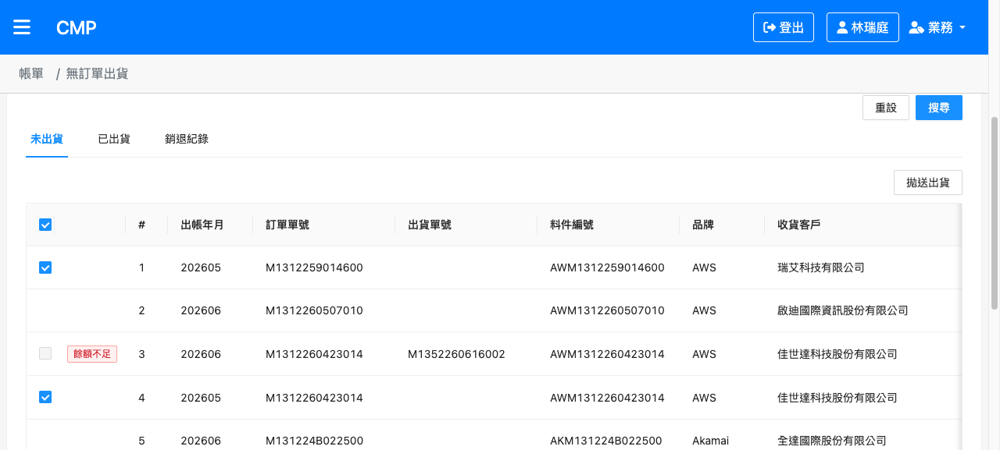
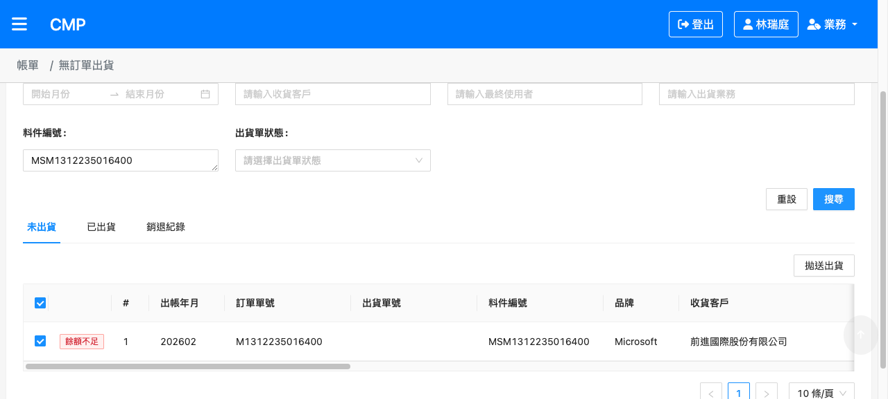
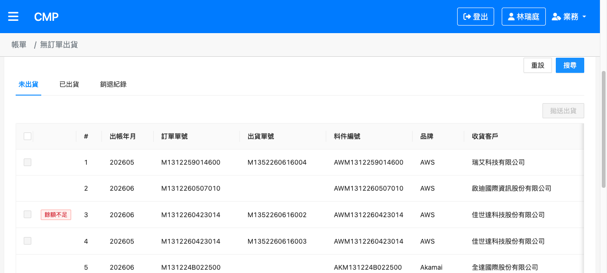
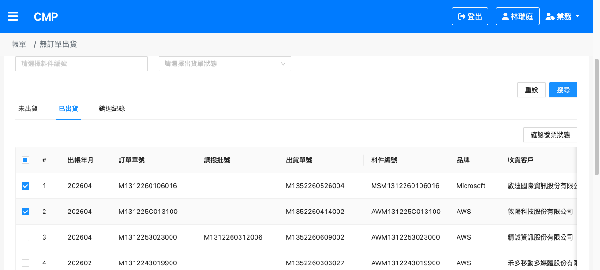
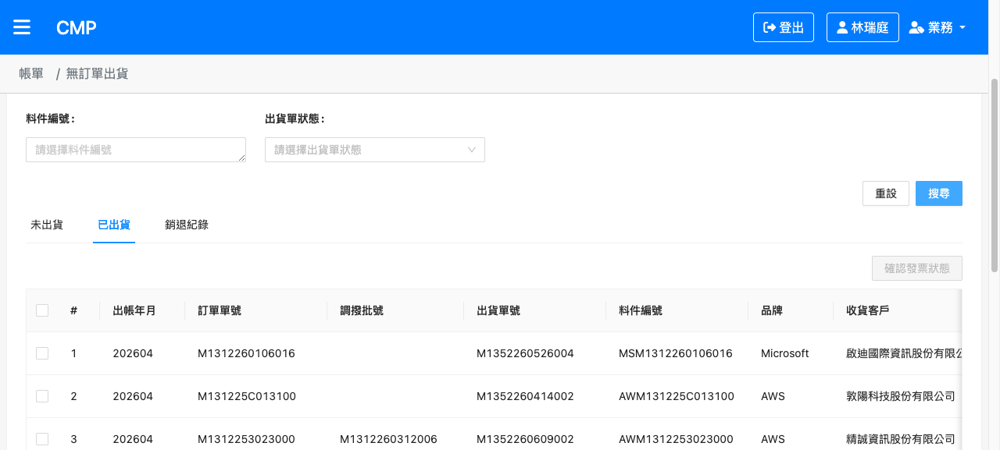
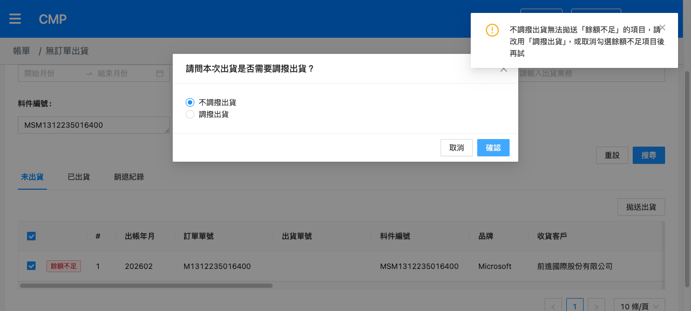
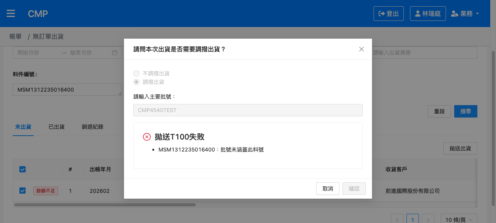

# CMP-4540 無訂單出貨：全選會勾選到「不可勾選」的單並拋送至後端 — 測試結果報告

## 版本紀錄

| 版本 | 日期 | 修訂內容 | 修訂者 |
|------|------|---------|--------|
| 1.0 | 2026-06-16 | 初版測試設計（建立測項清單） | Raelynn |
| 1.1 | 2026-06-16 | UAT 實測回填：TC-01/02/04/05/06/10 Pass；補根因證據（warehouseId 為陣列） | Raelynn |
| 1.2 | 2026-06-16 | 以品牌=Microsoft、出帳年月 202601–202606 取得「可勾選且餘額不足」列（MSM1312235016400），補測 TC-03/08/09 全數 Pass；最終 9 測項全數 Pass | Raelynn |
| 1.3 | 2026-06-16 | 於「六、缺陷紀錄」新增完整根因分析（warehouseId 為陣列致全選 `!!` 誤選 + 拋送前未過濾） | Raelynn |
| 1.4 | 2026-06-16 | 根因分析改寫為開頭摘要並加上處理方法 | Raelynn |

---

## 問題根因與處理（摘要）

**造成原因**：後端回傳的 `warehouseId` 是**陣列**，無入庫單號的列為空陣列 `[]`。畫面以 `warehouseId?.length` 判斷是否顯示勾選框（空陣列 → 不顯示，即不可勾選），但「全選」舊邏輯用 `!!warehouseId` 判斷，而**空陣列在 JavaScript 為 truthy（`!![] === true`）**，導致全選把這些「畫面根本沒有勾選框」的列也勾選；又因拋送前未再過濾，這些不該出貨的列被送到後端而造成異常。

**處理方法**：抽出單一可勾選判準 `isSelectableRow()`（以 `warehouseId?.length`、`status === 'NONE'` 為準），讓「全選」與「拋送（不調撥／調撥）」共用同一判準，並在重新搜尋／切換頁籤時清除勾選。餘額不足仍維持可勾選（符合 CMP-4526）。

---

## 一、測試資訊

| 項目 | 內容 |
|------|------|
| Jira 單號 | [CMP-4540](https://metaage-corp.atlassian.net/browse/CMP-4540) |
| 相關單號 | CMP-4526（餘額不足開放勾選、不調撥阻擋）、CMP-4243／CMP-4244（已出貨勾選致後端 500 之前例） |
| 測試環境 | CMP UAT：https://cmp-uat-100.metaage.com.tw |
| 測試頁面 | 無訂單出貨 `/main/bills/no-order`（entry=`no-order`）→「未出貨」頁籤 |
| 測試帳號 | raelynnlin@metaage.com.tw（統編 16428796） |
| 驗證方式 | ① 畫面觀察＋ DOM `.ant-checkbox-checked`／`.ant-checkbox-disabled` 判斷勾選狀態；② XHR 攔截 `POST …/ship/send` 之 request payload 與 response |
| 受測檔案 | `src/app/no-order/no-order.component.ts`（`isSelectableRow`、`onAllItemsCheck`、`shipping`、`transferShipping`、`doSearch`、`tabChange`） |
| 部署確認 | lazy chunk `no-order.module-BSHDEEF3.js` 含 `isSelectableRow`，確認 CMP-4540 已部署 UAT |
| 測試者 | Raelynn |
| 測試日期 | 2026-06-16 |

---

## 二、測試案例總覽

| 編號 | 群組 | 測項 | 結果 |
|------|------|------|------|
| [TC-01](#tc01) | 全選範圍正確性 | 全選排除「無入庫單號」（未顯示 checkbox）的列 | ✅ Pass |
| [TC-02](#tc02) | 全選範圍正確性 | 全選排除「狀態≠NONE」（disabled）的列 | ✅ Pass |
| [TC-03](#tc03) | 全選範圍正確性 | 全選仍包含「餘額不足」列（CMP-4526 未回退） | ✅ Pass |
| [TC-04](#tc04) | 全選範圍正確性 | 全選後拋送 payload 僅含可勾選列 | ✅ Pass |
| [TC-05](#tc05) | 勾選狀態重置 | 重新搜尋清除勾選（表頭框／列勾選／按鈕） | ✅ Pass |
| [TC-06](#tc06) | 勾選狀態重置 | 切換頁籤清除勾選 | ✅ Pass |
| [TC-08](#tc08) | 拋送業務規則 | 不調撥拋送：含餘額不足 → 前端阻擋並提示 | ✅ Pass |
| [TC-09](#tc09) | 拋送業務規則 | 調撥拋送：含餘額不足 → 前端不擋、正常送出 | ✅ Pass |
| [TC-10](#tc10) | 後端異常防呆 | 全選＋拋送不再造成後端異常 | ✅ Pass |

> **共通檢查**：每次全選操作後，表頭全選 checkbox 的勾選／半選狀態與實際被勾選的可勾選列一致；不可勾選列（無 checkbox／disabled）任何情況下都不應呈現被勾選 — 實測符合。
>
> **餘額不足測試資料**：以品牌=Microsoft、出帳年月 202601–202606 篩出「可勾選且餘額不足」列 `MSM1312235016400`（ym=202602、warehouseId=`["M1456260323001"]`、status=NONE、isEnough=false、客戶前進國際），供 TC-03/08/09 驗證。
>
> **換頁重置**：本次未修改換頁清除機制（既有 `onPageChange→resetCheckEvent` 綁定 + ma-table 內建清 `checked`），故不另列測項。

---

## 三、測試準備

1. **登入 UAT**：開啟 `https://cmp-uat-100.metaage.com.tw`，以測試帳號完成 Microsoft 帳號 + Authenticator 驗證，進入「無訂單出貨」`/main/bills/no-order`，身份為「業務」。
2. **確認部署**：以 `fetch` 取得頁面已載入的 JS 資源並搜尋 `isSelectableRow`，命中 lazy chunk `no-order.module-BSHDEEF3.js`，確認修正已上版。
3. **安裝 XHR 攔截器**（攔 `ship/send`、`ship/list`，詳見附錄 A）。
4. **取得資料分布**：直接 `POST invoice-v1/ship/list` 取回全部未出貨資料並分類（詳見附錄 D），確認第 1 頁含可勾選／無入庫單號／disabled 三類列。
5. **截圖路徑**：`documents/CMP-4540/screenshots/`。

---

## 四、測試案例

> **第 1 頁資料組成（實測）**：
> | 列 | 料件編號 | warehouseId | status | isEnough | 類型 |
> |---|---|---|---|---|---|
> | 1 | AWM1312259014600 | `["M1456260511011"]` | NONE | true | ✅ 可勾選 |
> | 2 | AWM1312260507010 | `[]` | NONE | true | 無 checkbox |
> | 3 | AWM1312260423014 | `["M1456260610004"]` | **NOT_CONFIRMED** | false | disabled（且餘額不足） |
> | 4 | AWM1312260423014 | `["M1456260511009"]` | NONE | true | ✅ 可勾選 |
> | 5–10 | AKM/MISC… | `[]` | NONE | true | 無 checkbox |

### 群組一、全選範圍正確性（CMP-4540 核心修正）

#### <a id="tc01"></a>TC-01 — 全選排除「無入庫單號」（未顯示 checkbox）的列

| 項目 | 內容 |
|------|------|
| 前置 | 「未出貨」頁、第 1 頁含可勾選列與無入庫單號列（列 2、5–10） |
| 步驟 | ① 確認列 2、5–10 畫面無勾選框 ② 點表頭「全選」 |
| 預期 | 無入庫單號列不被勾選 |
| 實際 | 全選後 DOM 檢查：列 2、5–10（`warehouseId=[]`，無 `.ant-checkbox`）皆未勾選；`checkedCount=2`（僅列 1、4） |
| 截圖 |  |
| 結果 | ✅ Pass |

<br>

#### <a id="tc02"></a>TC-02 — 全選排除「狀態≠NONE」（disabled）的列

| 項目 | 內容 |
|------|------|
| 前置 | 第 1 頁含 disabled 列（列 3，`NOT_CONFIRMED`，畫面顯示紅色「餘額不足」標籤、checkbox 灰階） |
| 步驟 | ① 確認列 3 checkbox 為 disabled ② 點表頭「全選」 |
| 預期 | disabled 列不被勾選 |
| 實際 | 全選後列 3 `.ant-checkbox-disabled` 且未勾選（`checked=false`）；僅列 1、4 被勾 |
| 截圖 | （列 3「餘額不足」紅標、灰階未勾） |
| 結果 | ✅ Pass |

<br>

#### <a id="tc03"></a>TC-03 — 全選仍包含「餘額不足」列（CMP-4526 未回退）

| 項目 | 內容 |
|------|------|
| 前置 | 品牌=Microsoft、出帳年月 202601–202606 篩出可勾選餘額不足列 MSM1312235016400（ym=202602，畫面顯示「餘額不足」紅標、checkbox 可勾） |
| 步驟 | ① 搜尋顯示該列 ② 點「全選」 |
| 預期 | 餘額不足列「有」被勾選 |
| 實際 | 全選後該列 `checked=true`（`.ant-checkbox-checked`）、紅標「餘額不足」仍在、拋送鈕啟用 — 餘額不足列確實被全選，CMP-4526 未回退 |
| 截圖 |  |
| 結果 | ✅ Pass |

<br>

#### <a id="tc04"></a>TC-04 — 全選後拋送 payload 僅含可勾選列

| 項目 | 內容 |
|------|------|
| 前置 | 已裝 `ship/send` 攔截器；全選後僅列 1、4 被勾 |
| 步驟 | ① 全選 ② 點「拋送出貨」→ 選「不調撥出貨」→「確認」 ③ 讀取攔截到的 `ship/send` body |
| 預期 | `items` 僅含列 1、4 兩筆，不含無入庫單號／disabled 列 |
| 實際 | 攔截 `POST invoice-v1/ship/send`，body：<br>`{"data":{"items":[{"invoiceYearMonth":"202605","orderId":"20250922265161","erpNumber":"AWM1312259014600"},{"invoiceYearMonth":"202605","orderId":"20260423047301","erpNumber":"AWM1312260423014"}]}}`<br>**恰為 2 筆可勾選列，無其他列** |
| 截圖 | （payload 證據見附錄 A／本列實際欄） |
| 結果 | ✅ Pass |

<br>

### 群組二、勾選狀態重置

> 因 TC-04 拋送已消耗「未出貨」僅有的 2 筆可勾選列，TC-05／TC-06 改於「已出貨」頁籤建立選取後驗證 — 重置邏輯（`doSearch`／`tabChange` → `resetCheckEvent`）為共用之元件層程式，對兩頁籤一致適用。

#### <a id="tc05"></a>TC-05 — 重新搜尋清除勾選

| 項目 | 內容 |
|------|------|
| 前置 | 「已出貨」頁籤、搜尋後勾選若干列（`checkedCount=6`、「確認發票狀態」鈕啟用） |
| 步驟 | ① 勾選列 ② 點「搜尋」 |
| 預期 | 搜尋後表頭未勾、列皆未勾、按鈕回 disabled |
| 實際 | 搜尋後 `checkedCount=0`、`headerChecked=false`、「確認發票狀態」鈕 disabled |
| 截圖 |  →  |
| 結果 | ✅ Pass |

<br>

#### <a id="tc06"></a>TC-06 — 切換頁籤清除勾選

| 項目 | 內容 |
|------|------|
| 前置 | 「已出貨」頁籤、勾選若干列（`checkedCount=3`、按鈕啟用） |
| 步驟 | ① 勾選列 ② 切到「未出貨」頁籤 ③ 切回「已出貨」頁籤 |
| 預期 | 切換後勾選清空、按鈕 disabled |
| 實際 | 切回後 `checkedCount=0`、「確認發票狀態」鈕 disabled |
| 截圖 |  |
| 結果 | ✅ Pass |

<br>

### 群組三、拋送業務規則（維持 CMP-4526）

#### <a id="tc08"></a>TC-08 — 不調撥拋送：含餘額不足 → 前端阻擋並提示

| 項目 | 內容 |
|------|------|
| 前置 | 已勾選餘額不足列 MSM1312235016400；已裝 `ship/send` 攔截器 |
| 步驟 | 拋送出貨 → 選「不調撥出貨」→ 確認 |
| 預期 | 前端攔截並警告，不發送 `ship/send` |
| 實際 | `sendCount=0`（**未發送** ship/send）；跳出警告「不調撥出貨無法拋送『餘額不足』的項目，請改用『調撥出貨』，或取消勾選餘額不足項目後再試」 |
| 截圖 |  |
| 結果 | ✅ Pass |

<br>

#### <a id="tc09"></a>TC-09 — 調撥拋送：含餘額不足 → 前端不擋、正常送出

| 項目 | 內容 |
|------|------|
| 前置 | 已勾選餘額不足列 MSM1312235016400；已裝 `ship/send` 攔截器 |
| 步驟 | 拋送出貨 → 選「調撥出貨」→ 填主要批號（測試值 `CMP4540TEST`）→ 確認 |
| 預期 | 前端不擋，正常送出（帶 mainBatch），交 T100 判斷 |
| 實際 | `ship/send` **有發送**，body：`{"data":{"mainBatch":"CMP4540TEST","items":[{"invoiceYearMonth":"202602","orderId":"20230911876980","erpNumber":"MSM1312235016400"}]}}`；回應 HTTP 200，`data:["MSM1312235016400：批號未涵蓋此料號"]`、`success:true` — 前端未擋，由 T100 業務驗證（測試批號未涵蓋該料號，故實際未轉移，無資料汙染） |
| 截圖 |  |
| 結果 | ✅ Pass |

<br>

### 群組四、後端異常防呆（CMP-4540 目標驗證）

#### <a id="tc10"></a>TC-10 — 全選＋拋送不再造成後端異常

| 項目 | 內容 |
|------|------|
| 前置 | 第 1 頁含可勾選／無入庫單號／disabled 混合列（重現原始情境） |
| 步驟 | ① 全選 ② 拋送「不調撥」→ 確認 ③ 觀察後端回應 |
| 預期 | 後端不因「不可勾選列被送入」報錯 |
| 實際 | `ship/send` 回應 **HTTP 200**：`{"data":{"totalCount":2,"successCount":2,"failCount":0,"errorMessage":[]},"info":{"code":"200","message":"拋送出貨完成","success":true}}` — 無系統異常，2 筆可勾選列拋送成功 |
| 截圖 |  |
| 結果 | ✅ Pass |

<br>

---

## 五、測試結果總覽

| 群組 | TC 數 | Pass | Fail | Blocked | 備註 |
|------|------|------|------|---------|------|
| 一、全選範圍正確性 | 4 | 4 | 0 | 0 | |
| 二、勾選狀態重置 | 2 | 2 | 0 | 0 | 重新搜尋／切換頁籤 |
| 三、拋送業務規則 | 2 | 2 | 0 | 0 | 以 Microsoft 餘額不足列驗證 |
| 四、後端異常防呆 | 1 | 1 | 0 | 0 | |
| **總計** | **9** | **9** | **0** | **0** | 全數 Pass，0 Fail |

---

## 六、缺陷紀錄

**無缺陷。** Bug 造成原因與處理方法見文件開頭〈問題根因與處理（摘要）〉；該修正經 TC-01～TC-10 實測全數通過（全選排除不可勾選列、拋送 payload 僅含可勾選列、後端不再報錯、搜尋／切頁籤重置）。

### 觀察事項（非本單缺陷，供參考）

| 編號 | 等級 | 說明 |
|------|------|------|
| OBS-1 | 低 | `doSearch` 於拋送成功後被呼叫時，`filter.and` 出現重複的 `status NOT POSTED` 條件（攔截到 2 筆相同條件）。不影響查詢結果，屬既有行為，與本單無關。 |

---

## 七、附錄

### 附錄 A — XHR 攔截器（攔 `ship/send`、`ship/list`）

```js
agent-browser eval "
(function() {
  window.__cap = [];
  const oOpen = XMLHttpRequest.prototype.open;
  const oSend = XMLHttpRequest.prototype.send;
  XMLHttpRequest.prototype.open = function(m, u) { this.__m = m; this.__u = u; return oOpen.apply(this, arguments); };
  XMLHttpRequest.prototype.send = function(b) {
    const x = this; const u = x.__u || '';
    if (u.indexOf('/ship/send') > -1 || u.indexOf('/ship/list') > -1 || u.indexOf('/ship2025/') > -1) {
      const it = { m: x.__m, u: u, body: b };
      window.__cap.push(it);
      x.addEventListener('load', () => { it.s = x.status; it.r = x.responseText?.slice(0, 500); });
    }
    return oSend.apply(this, arguments);
  };
  return 'ok';
})();
"
```
操作後讀取：`agent-browser eval "JSON.stringify(window.__cap)"`

### 附錄 B — 拋送 API 與 payload 結構（實測）

| 動作 | API | body |
|------|-----|------|
| 不調撥 | `POST {svc}/invoice-v1/ship/send` | `{ "data": { "items": [{ invoiceYearMonth, orderId, erpNumber }, ...] } }` |
| 調撥 | `POST {svc}/invoice-v1/ship/send` | `{ "data": { "mainBatch": "...", "items": [...] } }` |

> `items` 來源為 `selectData` 經 `isSelectableRow` 過濾後組成；`ship2025` 進入點對應 `ship2025/send`。

### 附錄 C — 可勾選判準 `isSelectableRow`（受測邏輯）

| 條件 | 說明 |
|------|------|
| `entry === 'ship2025'` 或 `warehouseId?.length > 0` | 須有入庫單號（ship2025 進入點除外）；否則畫面不顯示 checkbox。**注意 warehouseId 為陣列**，故以 `.length` 判斷 |
| `status === 'NONE'` | 狀態為 NONE 才可勾；非 NONE 在畫面為 disabled |
| （不納入 `isEnough`） | 餘額不足仍可勾選，符合 CMP-4526；不調撥於拋送時另行阻擋 |

### 附錄 D — 資料分布查詢（分類用）

```js
agent-browser eval "(async()=>{const r=await fetch('https://cmp-uat-100-svc.metaage.com.tw/invoice-v1/ship/list',{method:'POST',headers:{'Content-Type':'application/json','Authorization':'Bearer '+(localStorage.getItem('AccessToken')||'')},body:JSON.stringify({filter:{and:[{field:'status',comparator:'NOT',value:'POSTED'}],or:[],sort:{},pageSize:200,pageIndex:1,fields:[]}})});const d=await r.json();const rows=(d.data||[]);return JSON.stringify({total:rows.length, selectable:rows.filter(x=>x.warehouseId&&x.warehouseId.length&&x.status==='NONE').length, noWh:rows.filter(x=>!x.warehouseId||!x.warehouseId.length).length, disabled:rows.filter(x=>x.status!=='NONE').length, notEnough:rows.filter(x=>x.isEnough===false).length});})()"
```
> 實測（拋送前）：total 50+、可勾選 2、無入庫單號 47、disabled 1、餘額不足 1（該筆同時為 disabled）。
