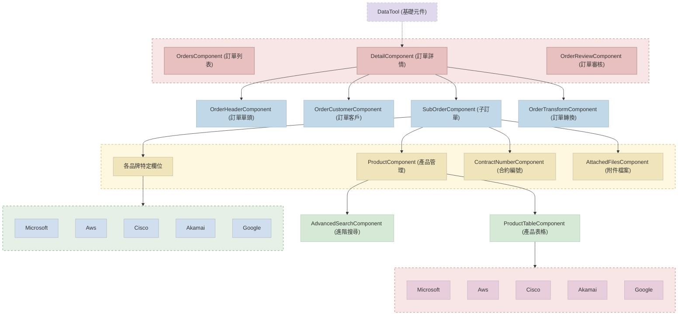
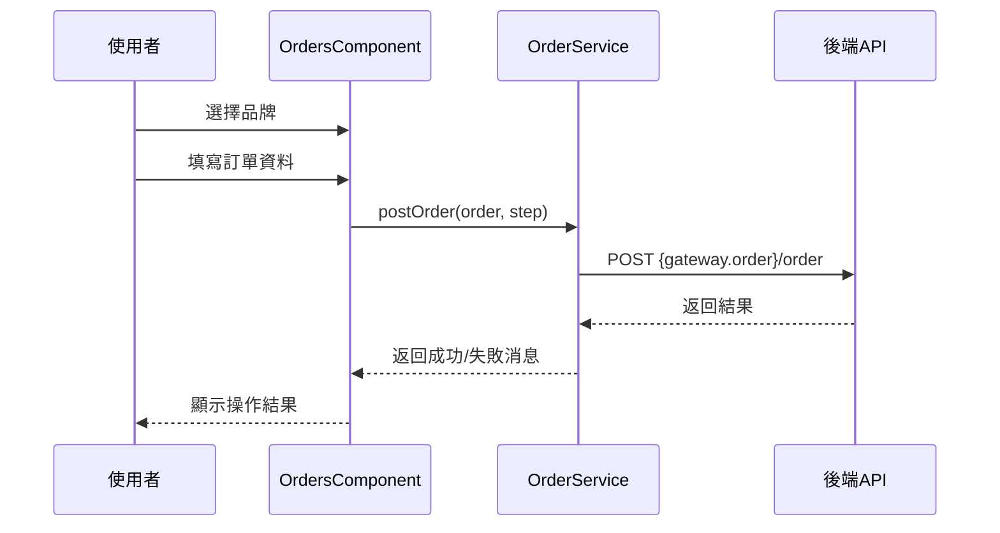
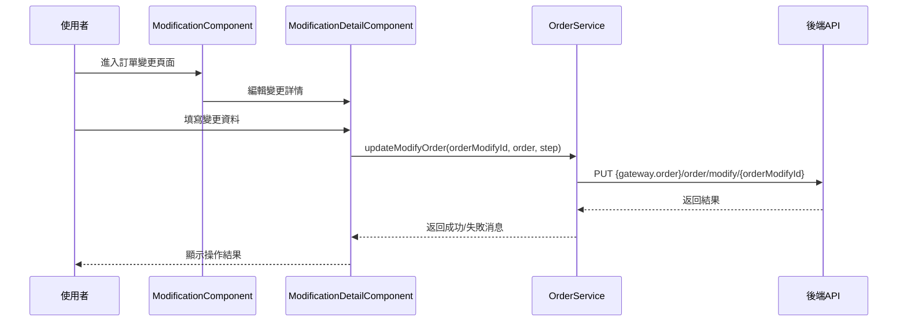
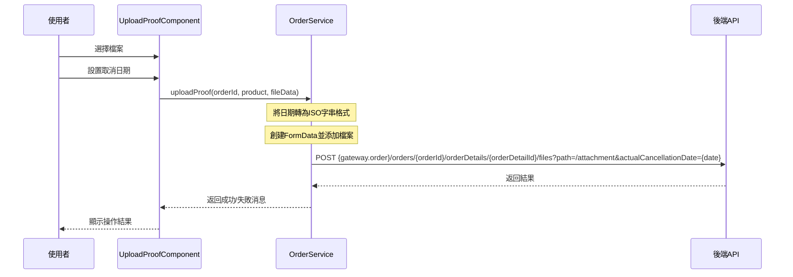
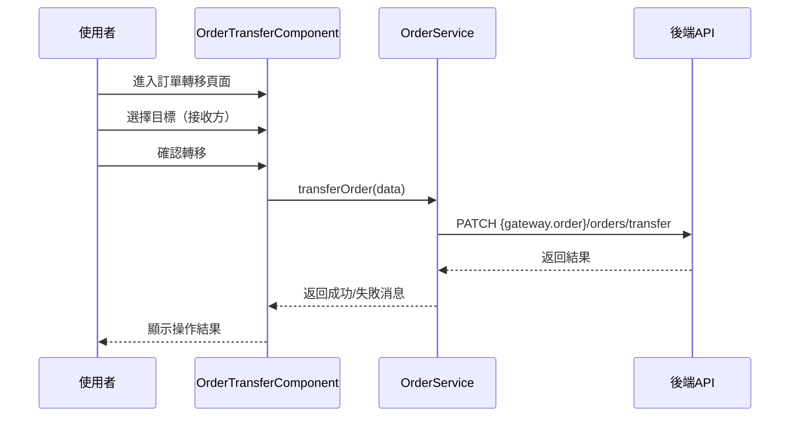

# 修訂紀錄

- **20250609 定義初版內容**
  主要為 CMP-3093 新版訂單、訂變單、子公司相關與 T100 串接的修正及調整。


# 訂單相關元件關聯圖

## 主要元件說明

### 元件層級結構



### 元件說明及層級

```
OrdersComponent (訂單列表)
├── 主要訂單管理介面，包含訂單列表檢視和基本操作
├── 提供訂單搜尋、篩選功能
├── 支援建立新訂單、複製訂單
├── 支援匯出訂單資料
└── CRM 報價單轉訂單功能
```

```
DetailComponent (訂單詳情)
│
├── OrderHeaderComponent (訂單單頭)
│   ├── 訂單詳細資訊頁面
│   ├── 包含訂單單頭與單身資訊
│   ├── 管理訂單建立和修改流程
│   └── 集成多個子元件以顯示完整訂單資訊
│
├── OrderCustomerComponent (訂單客戶)
│   ├── 管理訂單相關的客戶資訊
│   └── 包含客戶編號、聯絡方式、付款相關資訊
│
├── SubOrderComponent (子訂單)
│   ├── 管理子訂單資訊，包含產品項目與相關設定
│   ├── 處理訂單產品項目的新增、編輯、刪除
│   │
│   ├── 各品牌特定欄位
│   │   ├── MicrosoftExtraFieldComponent
│   │   ├── AwsExtraFieldComponent
│   │   ├── CiscoExtraFieldComponent
│   │   ├── AkamaiExtraFieldComponent
│   │   └── GoogleExtraFieldComponent
│   │
│   ├── ProductComponent (產品管理)
│   │   ├── 產品選擇和管理介面
│   │   ├── 產品新增、編輯、刪除功能
│   │   │
│   │   ├── ProductTableComponent (產品表格)
│   │   │   ├── 顯示產品列表
│   │   │   ├── 依據不同品牌顯示不同欄位與資訊
│   │   │   │
│   │   │   ├── MicrosoftComponent
│   │   │   ├── AwsComponent
│   │   │   ├── CiscoComponent
│   │   │   ├── AkamaiComponent
│   │   │   └── GoogleComponent
│   │   │
│   │   └── AdvancedSearchComponent (進階搜尋)
│   │       └── 提供產品的進階搜尋功能
│   │
│   ├── ContractNumberComponent (合約編號)
│   │   └── 管理合約編號資訊
│   │
│   └── AttachedFilesComponent (附件檔案)
│       ├── 管理訂單相關的附件檔案
│       └── 提供檔案上傳、下載功能
│
└── OrderTransformComponent (訂單轉換)
    └── 處理子訂單資料複製至代理商功能
```

```
※ DataTool (基礎元件)
  └── 作為基礎類別被 DetailComponent 繼承使用
```

```
OrderReviewComponent (訂單檢視)
  └── 提供訂單預覽與PDF下載功能
```

### 可擴展性設計

```
模組擴展機制
│
├── 品牌擴展設計
│   ├── 策略模式 - 根據品牌類型動態選擇實現邏輯
│   │   └── 例：不同品牌使用不同的產品驗證邏輯
│   │
│   ├── 工廠模式 - 創建品牌特定的元件和服務
│   │   └── 例：根據品牌ID創建對應的額外欄位元件
│   │
│   └── 依賴注入 - 靈活配置品牌特定服務
│       └── 例：針對特定品牌提供特定的API服務
│
├── 訂單流程擴展
│   ├── 狀態模式 - 不同訂單狀態下的行為封裝
│   └── 命令模式 - 將訂單操作封裝成獨立命令
│
└── 介面抽象
    ├── 通用介面定義 - 確保不同實現遵循相同契約
    └── 裝飾器模式 - 動態添加功能到現有元件
```


### 共用 Model 與 Pipe

```
共用 Model (Core Models)
│
├── 訂單相關 (orders.ts)
│   ├── Order - 訂單主要資料結構
│   ├── OrderHeader - 訂單單頭資料
│   ├── SubOrder - 訂單單身資料
│   ├── OrderProduct - 訂單產品資料
│   ├── ApprovalStatus - 訂單狀態
│   ├── OrderStatus - 出帳狀態
│   ├── ModifyOrder - 訂變單資料
│   ├── OrderModify - 訂變單相關資訊
│   ├── DiffList - 訂變單差異比對資料
│   ├── LeaseModeList - 計價週期對照表
│   ├── ExchangeRateType - 匯率類型
│   ├── OrderMode - 訂單操作模式
│   └── OrderButtonStep - 訂單操作步驟
│
├── 品牌相關 (brands.ts)
│   ├── Brand - 品牌資料結構
│   └── BrandList - 品牌列表
│
├── 商品相關 (commodity.ts)
│   ├── OrderSalesModel - 銷售模式
│   └── Product - 商品資料結構
│
├── 訂閱管理相關 (subscription.ts)
│   ├── Subscription - 訂閱資料結構
│   ├── ActionType - 訂閱操作類型
│   └── SubscriptionHistory - 訂閱歷史記錄
│
├── 權限相關 (permission.ts)
│   ├── Permission - 權限資料結構
│   └── PermissionEnum - 權限類型
│
├── IAM 相關 (iam.ts)
│   ├── IamType - 認證類型
│   ├── RoleResp - 角色資料結構
│   └── UserInfo - 使用者資訊結構
│
└── Response 相關 (response-data.ts)
    ├── ResponseData - API回應資料結構
    └── ErrorResponse - 錯誤回應資料結構
```

```
共用 Pipe (Core Pipes)
│
├── 核心管道
│   ├── OrderStatusPipe - 訂單狀態文字轉換
│   ├── CurrencySymbolPipe - 貨幣符號轉換
│   ├── DateFormatPipe - 日期格式轉換
│   ├── ProductStatusPipe - 產品狀態文字轉換
│   ├── NumberFormatPipe - 數字格式轉換
│   └── BillingCyclePipe - 計費週期文字轉換
│
└── 訂單模組自定義管道 (orders/pipes)
    ├── BrandExtraFieldReadonlyPipe - 品牌額外欄位唯讀判斷
    ├── CanDeleteProductPipe - 產品刪除權限判斷
    ├── CanDeleteSolutionPipe - 解決方案刪除權限判斷
    ├── CanModifyInputPipe - 輸入欄位修改權限判斷
    ├── FooterButtonPipe - Footer 按鈕顯示邏輯
    ├── GetValidListingPipe - 有效清單過濾
    ├── ShowValidateBtnPipe - 驗證按鈕顯示邏輯
    └── UploadFilesCountPipe - 上傳檔案計數
```

<br>

### 元件使用 API 

#### 1. 訂單列表元件 (OrdersComponent)
- orderService.getOrderList()：搜尋訂單列表
  > `POST {gateway.order}/orders`
- orderService.export()：匯出訂單資料
  > `POST {gateway.order}/orders/export`
- orderService.copyOrder()：複製訂單
  > `POST {gateway.order}/orders/{orderId}/copy`
- orderService.getOrderBrandList()：搜尋品牌列表
  > `GET {gateway.order}/orders/brands`
- orderService.getOrderStatusList()：取得出帳狀態列表
  > `GET {gateway.order}/orders/status`
- orderService.getApprovalStatus()：取得簽核狀態列表
  > `GET {gateway.order}/orders/approval-status`
- orderService.getEstimateList()：透過 CRM 商機編號取得報價單
  > `GET {gateway.order}/estimates/by-opportunity/{opportunityId}`
- orderService.getEstimate()：取得 CRM 報價詳情
  > `GET {gateway.order}/estimates/{estimateId}`
- orderService.getEstimateDetail()：取得 CRM 報價單版本內容
  > `GET {gateway.order}/estimates/{estimateId}/versions/{versionId}`
- brandService.getBrandList()：取得品牌列表
  > `GET {gateway.brand}/brands`

#### 2. 訂單詳情元件 (DetailComponent)
- orderService.getOrder()：取得訂單詳情
  > `GET {gateway.order}/orders/{orderId}`
- orderService.postOrder()：新增訂單
  > `POST {gateway.order}/orders`
- orderService.putOrderHeader()：更新訂單單頭
  > `PUT {gateway.order}/orders/{orderId}/header`
- orderService.postOrderHistory()：搜尋修訂紀錄
  > `POST {gateway.order}/orders/{orderId}/history`
- orderService.getOrderNextStep()：取得訂單下一個狀態及必填欄位
  > `GET {gateway.order}/orders/{orderId}/next-step`
- orderService.postAddSolution()：新增子單
  > `POST {gateway.order}/orders/{orderId}/solutions`
- orderService.putAddSolution()：更新子單
  > `PUT {gateway.order}/orders/{orderId}/solutions/{solutionId}`
- orderService.deleteSolution()：刪除子單
  > `DELETE {gateway.order}/orders/{orderId}/solutions/{solutionId}`
- orderService.checkOrderFieldData()：檢查訂單單號是否重複
  > `POST {gateway.order}/orders/validate-field`
- orderService.cloneSubsidiaryOrder()：複製子公司訂單
  > `POST {gateway.order}/orders/{orderId}/clone-subsidiary`
- orderService.uploadOrderFiles()：上傳訂單檔案
  > `POST {gateway.order}/orders/{orderId}/files`
- brandService.getSolutionList()：取得方案列表
  > `GET {gateway.brand}/brands/{brandId}/solutions`
- brandService.getPayerList()：取得 payer 列表
  > `GET {gateway.brand}/brands/{brandId}/payers`
- brandService.getUsageType()：取得 usage type
  > `GET {gateway.brand}/brands/{brandId}/usage-types`

#### 3. 訂單單頭元件 (OrderHeaderComponent)
- orderService.updateCustomerPoNumber()：更新客戶訂購單號
  > `PATCH {gateway.order}/orders/{orderId}/customer-po-number`
- orderService.getT100EmployeeDepartment()：查詢員工部門
  > `GET {gateway.order}/t100/employee-departments`
- orderService.getOrderErpNumber()：取得訂單單號資訊
  > `GET {gateway.order}/orders/{orderId}/erp-number`
- userService.getUserList()：取得使用者列表
  > `GET {gateway.user}/users`
- orderService.getDepartment()：根據使用者取得部門資訊
  > `GET {gateway.order}/departments/by-user/{userId}`

#### 4. 訂單客戶元件 (OrderCustomerComponent)
- customersService.getCustomerList()：搜尋客戶
  > `POST {gateway.customer}/customers`
- customersSvc.getCustomer()：取得客戶資料
  > `GET {gateway.customer}/customers/{customerId}`
- customersSvc.getCustomerByRule()：根據規則查詢客戶
  > `POST {gateway.customer}/customers/by-rule`
- customersSvc.getContactList()：取得客戶聯絡人清單
  > `GET {gateway.customer}/customers/{customerId}/contacts`
- orderService.getT100PaymentTermsMenu()：付款條件選單
  > `GET {gateway.order}/t100/payment-terms`
- orderService.getT100TaxCodeMenu()：稅別選單
  > `GET {gateway.order}/t100/tax-codes`
- orderService.getT100CurrencyMenu()：幣別選單
  > `GET {gateway.order}/t100/currencies`

#### 5. 子訂單元件 (SubOrderComponent)
- orderService.postAddSolution()：新增訂單單身
  > `POST {gateway.order}/orders/{orderId}/solutions`
- orderService.putAddSolution()：更新訂單單身
  > `PUT {gateway.order}/orders/{orderId}/solutions/{solutionId}`
- orderService.deleteSolution()：刪除訂單單身
  > `DELETE {gateway.order}/orders/{orderId}/solutions/{solutionId}`
- brandService.getSolutionList()：取得方案列表
  > `GET {gateway.brand}/brands/{brandId}/solutions`
- orderService.checkOrderFieldData()：檢查 SubID 重複
  > `POST {gateway.order}/orders/validate-field`

#### 6. 產品管理元件 (ProductComponent)
- orderService.addProducts()：新增產品
  > `POST {gateway.order}/orders/{orderId}/solutions/{solutionId}/products`
- orderService.updateProducts()：更新產品
  > `PUT {gateway.order}/orders/{orderId}/solutions/{solutionId}/products/{productId}`
- orderService.deleteProduct()：刪除產品
  > `DELETE {gateway.order}/orders/{orderId}/solutions/{solutionId}/products/{productId}`
- productService.getProduct()：取得產品詳情
  > `GET {gateway.product}/products/{productId}`
- productService.searchProducts()：搜尋產品列表
  > `POST {gateway.product}/products/search`

#### 7. 附件檔案元件 (AttachedFilesComponent)
- orderService.getOrderFileList()：取得訂單檔案列表
  > `GET {gateway.order}/orders/{orderId}/files`
- orderService.uploadOrderFiles()：上傳訂單檔案
  > `POST {gateway.order}/orders/{orderId}/files`
- orderService.downloadOrderFile()：下載訂單檔案
  > `GET {gateway.order}/orders/{orderId}/files/{fileId}/download`
- orderService.deleteOrderFile()：刪除訂單檔案
  > `DELETE {gateway.order}/orders/{orderId}/files/{fileId}`

#### 8. 訂單轉移元件 (OrderTransformComponent)
- orderService.transferOrder()：採購單轉移
  > `PATCH {gateway.order}/orders/transfer`
- orderService.cloneSubsidiaryOrder()：複製子公司訂單
  > `POST {gateway.order}/orders/{orderId}/clone-subsidiary`
- orderService.checkOrderFieldData()：驗證訂單編號
  > `POST {gateway.order}/orders/validate-field`

#### 9. 上傳證明元件 (UploadProofComponent)
- orderService.uploadProof()：上傳證明檔案
  > `POST {gateway.order}/orders/{orderId}/orderDetails/{orderDetailId}/files`
- orderService.afterOrderCancel()：下單後取消
  > `PATCH {gateway.order}/orders/{orderId}/cancel-after-order`
- orderService.getProofTypeList()：取得證明檔案類型列表
  > `GET {gateway.order}/proof-types`

#### 10. 訂單變更元件 (ModificationComponent)
- orderService.getModifyOrderList()：搜尋訂單變更列表
  > `POST {gateway.order}/orders/modify`
- orderService.getModifyOrder()：取得訂變單資訊
  > `GET {gateway.order}/orders/modify/{modifyOrderId}`
- orderService.createModifyOrder()：新增訂變單
  > `POST {gateway.order}/orders/{orderId}/modify`
- orderService.updateModifyOrder()：更新訂變單
  > `PUT {gateway.order}/orders/modify/{modifyOrderId}`
- orderService.getModifyNextStep()：取得訂變單下一步驟
  > `GET {gateway.order}/orders/modify/{modifyOrderId}/next-step`
- orderService.getOrder()：取得訂單詳情
  > `GET {gateway.order}/orders/{orderId}`

#### 11. 各品牌相關 API：
  - ##### Microsoft
    - orderService.checkDomain()：檢查 domain 是否存在
      > `POST {gateway.order}/Microsoft/domains/validate`
    - orderService.getMicrosoftCustomerList()：微軟原廠客戶查詢
      > `GET {gateway.order}/Microsoft/customers`
    - orderService.checkMicrosoftCustomer()：確認客戶是否接受原廠合約
      > `POST {gateway.order}/Microsoft/customers/validate`
    - orderService.getRiBillingCycle()：取得 RI 商品計價週期
      > `GET {gateway.order}/Microsoft/ri-billing-cycles`
    - orderService.checkProducts()：檢查產品 U 數
      > `POST {gateway.order}/Microsoft/products/validate`
    - orderService.getAzureEntitlements()：取得 Azure 方案
      > `GET {gateway.order}/Microsoft/azure-entitlements`
    - orderService.getCustomTermEndDate()：取得自訂結束日期
      > `GET {gateway.order}/Microsoft/custom-term-end-date`
    - orderService.getMicrosoftTenantDomains()：取得微軟客戶租戶
      > `GET {gateway.order}/Microsoft/tenant-domains`
    - orderService.getMicrosoftProductFamily()：取得微軟商品系列
      > `GET {gateway.order}/Microsoft/product-families`

  - ##### Akamai
    - orderService.akamaiReportingGroup()：Reporting group 查詢
      > `GET {gateway.order}/Akamai/reporting-groups`
    - orderService.checkLinodeAccount()：驗證 Linode 帳戶
      > `POST {gateway.order}/Akamai/linode-accounts/validate`
    - orderService.getLinodeProductList()：取得 Linode 產品列表
      > `GET {gateway.order}/Akamai/linode-products`

  - ##### Cisco
    - orderService.getDealIdList()：取得 Deal ID 商品列表
      > `GET {gateway.order}/Cisco/deal-ids`
    - orderService.getSubIdDetail()：取得訂閱細節
      > `GET {gateway.order}/Cisco/subscriptions/{subId}`
    - orderService.checkSubIdExist()：檢查 SubID 是否存在
      > `POST {gateway.order}/Cisco/subscriptions/validate`
    - orderService.getCiscoQuoteInfo()：取得 Cisco 報價資訊
      > `GET {gateway.order}/Cisco/quotes/{quoteId}`

  - ##### AWS
    - orderService.getPayerList()：取得 AWS 付款人列表
      > `GET {gateway.order}/AWS/payers`
    - orderService.getUsageTypeList()：取得 AWS 使用類型列表
      > `GET {gateway.order}/AWS/usage-types`
    - orderService.checkAwsAccount()：驗證 AWS 帳戶
      > `POST {gateway.order}/AWS/accounts/validate`

  - ##### Google
    - orderService.getGoogleAccountInfo()：取得 Google 帳戶資訊
      > `GET {gateway.order}/Google/accounts/{accountId}`
    - orderService.checkGoogleAccount()：驗證 Google 帳戶
      > `POST {gateway.order}/Google/accounts/validate`

#### 12. 基礎元件 (DataTool) 使用的 API：
- brandService.getSolutionList()：取得方案列表
  > `GET {gateway.brand}/brands/{brandId}/solutions`
- brandService.getPayerList()：取得 payer 列表
  > `GET {gateway.brand}/brands/{brandId}/payers`
- brandService.getUsageType()：取得 usage type
  > `GET {gateway.brand}/brands/{brandId}/usage-types`

---

# 訂單相關元件循序圖

## 資料流程循序圖

### 1. 建立訂單流程



### 2. 訂單變更流程



### 3. 上傳證明流程



### 4. 訂單轉移流程



## 技術實現細節

1. **API 路徑結構**:
   - 大多數 API 路徑基於 `{gateway.order}` 設定值，來源於 `environment` 配置
   - 檔案相關 API 通常在訂單詳情路徑下 `orders/{orderId}/orderDetails/{orderDetailId}/files`
   - 品牌特定 API 通常使用品牌前綴，如 `Microsoft/`, `Cisco/`, `Akamai/`

2. **請求方法**:
   - 查詢列表通常使用 `POST` 方法，傳送 `Filter` 物件進行篩選
   - 單一資源查詢通常使用 `GET` 方法
   - 資源建立使用 `POST` 方法
   - 資源更新使用 `PUT` 或 `PATCH` 方法
   - 資源刪除使用 `DELETE` 方法

3. **檔案上傳**:
   - 使用 `FormData` 物件封裝檔案數據
   - 上傳路徑通常包含 `path` 查詢參數指定目標目錄

---

# 異動變更

- ## CMP-3093
  - **CMP-3093**: 調整為新版訂單(前端)
    - **CMP-3121**: 新版訂單變更單：新增/修改 訂單變更單
    - **CMP-3229**: 新版訂單-複製子公司訂單至代理商的確認畫面
    - **CMP-3642** 訂單：T100欄位名稱調整
    - **CMP-3643** 訂單變更單：T100欄位名稱調整
    - **CMP-3644** 客戶：T100欄位名稱調整
    - **CMP-3706** 新版訂單-料件編號拋送T100建立

  ### 1. 變更概述
  - **欄位命名調整**：配合 T100 調整多個欄位命名。
  - **介面顯示優化**：為符合使用者需求，移除冗餘欄位，調整欄位順序。
  - **功能強化與規則優化**：增強系統功能，並根據業務需求調整操作規則。
  - **程式碼優化與問題修復**：清理無用代碼，修復已知問題，提高系統效能與穩定性。
  - **品牌特定功能整合**：強化各品牌特定功能，整合各品牌共用流程。

  ### 2. 欄位名稱調整
  https://dtimis.sharepoint.com/:x:/r/sites/msteams_5557fe/_layouts/15/Doc.aspx?sourcedoc=%7BC8929D97-A1B7-47F0-B6B8-95006FA5F7E4%7D&file=CMP%20v.s.%20T100%20%E6%AC%84%E4%BD%8D%E5%90%8D%E7%A8%B1%E5%B0%8D%E7%85%A7%E8%A1%A8.xlsx&action=default&mobileredirect=true

  ### 3. 核心檔案異動分析

  #### 3.1 業務邏輯調整
  - 原「採購單」改為「訂單」
    - 修改所有有關採購單的翻譯
    - 刪除 `CustomTranslationLoader`，取消覆蓋 appModule - createTranslateLoader 的邏輯
    - src/app/app.module.ts:
        ```javascript
        TranslateModule.forRoot({
          loader: {
            provide: TranslateLoader,
            useClass: CustomTranslationLoader,
            deps: [HttpClient, PermissionService, AuthService]
          }
        })
        ```
        改為：
        ```javascript
        TranslateModule.forRoot({
          loader: {
            provide: TranslateLoader,
            useFactory: (createTranslateLoader),
            deps: [HttpClient, PermissionService, AuthService]
          }
        })
        ```

  - **作廢功能**：訂單移除「刪除」功能，改為於［草稿］、［已拒絕］、［已抽單］狀態時可作廢
    - src/app/core/models/orders.ts  OrderButtonStep 新增 invalid
        ```javascript
        export enum OrderButtonStep {
          invalid = 'INVALID',    // 作廢
        }
        ```
    - src/app/orders/detail/detail.component.ts
        ```javascript
        1. orderSteps 新增 { step: OrderButtonStep.invalid, label: 'btn_INVALID' } // 作廢

        2. handleButton(step: OrderButtonStep) {
          switch (step) {
            //.....
            /** 作廢 */
            case OrderButtonStep.invalid:
              this.updateOrderStatus(step);
              break;
          }
        }

        3. updateOrderStatus(step: OrderButtonStep.previous | OrderButtonStep.invalid | OrderButtonStep.draw) {
          this.ui.isLoading = true;

          let orderData = null;
          if (step === OrderButtonStep.previous) {
            const tranceNote = new TranceNote();
            tranceNote.type = 'UPDATE';
            tranceNote.field = 'rejectReason';
            tranceNote.oldData = this.order.header.rejectReason ?? '';
            tranceNote.newData = this.reason;
            tranceNote.message = this.translate.instant('reject reason');

            orderData = {
              rejectReason: this.reason,
              tranceNote: [tranceNote]
            };
          }

          this.orderSvc.putOrderHeader(orderData, this.orderID, step).subscribe({
            next: (res) => {
              if (res && res.data && res.info && res.info.success) {
                this.notify.success('', res.info.message);
                this.router.navigate(['main/orders']);
              } else {
                this.notify.error('[update-orderHeader]', res.info.message);
                this.ui.isLoading = false;
              }
            },
            error: (err) => {
              console.error('[update-orderHeader]', err);
              this.notify.error('[update-orderHeader]', err);
              this.ui.isLoading = false;
            },
          });
        }

        4. 刪除 drawnOrder(step: OrderButtonStep){}
        ```
    - src/app/share/services/order.service.ts 更新：
        ```javascript
        /** 更新訂單單頭 */
        putOrderHeader(orderHeader: any, orderId: string, step: OrderButtonStep): Observable<ResponseData> {
          //...
          // 檢查是否需要傳送 orderHeader
          const requestData = orderHeader
            ? new RequestData({
              ...orderHeader,
              filterAttribute: undefined, // 刪除不必要的 filterAttribute
              step,
            })
            : new RequestData({ step });

          return this.api.put(this.gateway.order + 'orders/' + orderId, requestData);
        }
        ```

  - **操作子單**：訂單在［草稿］、［已拒絕］、［已抽單］狀態下可以 **新增**、**複製**、**編輯子單**
    - src/app/orders/detail/detail.component.html
      ```html
      <span *ngIf="order.header.status === ApprovalStatus.draft">
      ```
      改為
      ```html
      <span *ngIf="order.header.status === ApprovalStatus.draft || 
                   order.header.status === ApprovalStatus.reject || 
                   order.header.status === ApprovalStatus.drawn">
      ```
    - src/app/orders/detail/order-header/order-header.component.ts
      ```javascript
      if (this.order.header.status === ApprovalStatus.draft) { //... }
      ```
      改為
      ```javascript
      if (this.order.header.status === ApprovalStatus.draft || 
          this.order.header.status === ApprovalStatus.rejected || 
          this.order.header.status === ApprovalStatus.drawn) { //... }
      ```
    - src/app/orders/pipes/canDeleteProduct.pipe.ts
      `export class CanDeleteProductPipe implements PipeTransform` 新增 `orderHeaderStatus === ApprovalStatus.drawn`
    - src/app/orders/pipes/showValidateBtn.pipe.ts
      `const payerCloudStatusNotIn` 新增 `ApprovalStatus.rejected`, `ApprovalStatus.drawn`, `ModifyOrderStatus.rejected`
    - src/app/orders/sub-order/extra-field/microsoft/microsoft-extra-field.component.ts
      `const isRequiredStatus` 新增 
      `this.orderStep.currentStatus !== ApprovalStatus.rejected` &&
      `this.orderStep.currentStatus !== ApprovalStatus.drawn`
  - 調整欄位順序以符合使用者需求

  #### 3.2 元件與服務層級異動

  ##### 訂單單頭元件 (`order-header.component.ts`)
  - **移除欄位**：ERP負責業務、請購部門
  - **訂單單號**：
    - 原「312編號」改為「訂單單號」(CMP-3093)
    - 改為訂單「草稿」階段送簽到「BPM簽核中」時由後端生成，移除舊有 312 檢查及其關聯異動 (CMP-3093)
      - src/app/orders/detail/order-header/order-header.component.ts 
        ```javascript
        刪除：
        ngOnInit(): void {
          // 創建或草稿時可以修改312訂單編號
          if (this.order.header.status === ApprovalStatus.draft) {
            this.filterAttribute.filter(f => f.internalVariableName === 'orderErpNumber').forEach(f => f.readonly = false);
          }
          // 銷售模式非POC或自用，312訂單編號為必填
          if (this.order.header.salesModel !== OrderSalesModel.selfUse && this.order.header.salesModel !== OrderSalesModel.poc) {
            this.filterAttribute.filter(f => f.internalVariableName === 'orderErpNumber').forEach(f => f.required = true);
          } else {
            this.filterAttribute.filter(f => f.internalVariableName === 'orderErpNumber').forEach(f => f.required = false);
          }

          // 訂變狀態
          if (this.mode === OrderMode.modify) {
            switch (e.internalVariableName) {
              // 312訂單編號
              case 'orderErpNumber':
                const orderErpAttribute = this.filterAttribute.find(f => f.internalVariableName === 'orderErpNumber');

                if (orderErpAttribute) {
                  orderErpAttribute.successTip = '';
                  orderErpAttribute.errorTip = '';

                  // 跟原本的312訂單編號一樣就不重新檢查
                  if (this.oriOrderHeader.orderErpNumber === e.value || (!e.value && !orderErpAttribute.required)) {
                    return;
                  }

                  if (!e.value && orderErpAttribute.required) {
                    orderErpAttribute.errorTip = this.translate.instant('This field is required!');
                    return;
                  }

                  // 312開頭，共10碼
                  const regex = new RegExp('^312{1}[a-zA-Z0-9]{7}$');
                  if (!regex.test(e.value)) {
                    orderErpAttribute.errorTip = this.translate.instant('order erp number format error');
                    return;
                  }

                  this.checkOrderErpNumber(e.value, subCompany);
                }
                break;

              // 銷售模式
              case 'salesModel':
                const orderErpAttr = this.filterAttribute.find(f => f.internalVariableName === 'orderErpNumber');
                if (orderErpAttr) {
                  if (e.value !== OrderSalesModel.selfUse && e.value !== OrderSalesModel.poc) {
                    orderErpAttr.required = true;
                    if (!orderErpAttr.value) {
                      orderErpAttr.errorTip = this.translate.instant('This field is required!');
                    }
                  } else {
                    orderErpAttr.required = false;
                    orderErpAttr.errorTip = '';
                  }
                }
                break;
            }
          }
        }
        ```
        刪除：
        ```javascript
        getOrderErpNumber(erpNumber: string, subCompany: boolean, orderId ?: string): Observable < any > { }

        checkOrderErpNumber(erpNumber: string, subCompany: boolean) { }

        checkErpNumberExist(erpNumber: string, orderErpNumberAttr: FilterAttribute) { }

        getErpNumberData(erpNumber: string, subCompany: boolean, orderErpNumberAttr: FilterAttribute) { }

        updateCustomerPoNumber(event: any) { }

        override setErpNumber(category: string, orderErpNumber: string, originalSku: string): string { }
        ```
  - **銷售模式**：新增「訂單儲存後不提供修改」限制 (CMP-3121)
    - src/app/orders/detail/order-header/order-header.component.ts
      - 銷售模式 attribute 新增 `readOnly`
        ```javascript
        new FilterAttribute({
          //...
          internalVariableName: "salesModel",
          readonly: true,
        })
        ```
      - `ngOnInit` 新增
        ```javascript
        // [銷售模式] 訂單儲存後不提供修改
        if (this.mode === OrderMode.add) {
          this.filterAttribute.filter(f => f.internalVariableName === 'salesModel').forEach(f => f.readonly = false);
        }
        ```
  - **商機編號**：從報價單匯入時，須從商機編號帶入相關客戶資料，而在經銷商欄位的客戶資料不提供編輯 (CMP-3121)
  - **客戶訂購單號**：
    - 原「ERP客戶訂單號碼」改為「客戶訂購單號」(CMP-3093)
    - 開放編輯 (CMP-3093)
    - 保留「更新儲存按鈕」供使用者隨時調整 (CMP-3093)
  - **業務與部門**：
    - 新增「負責業務部門」、「出貨業務」、「出貨業務部門」等欄位 (CMP-3229)
    - 實作業務人員與部門自動關聯功能 (CMP-3229)
    - 確保部門資料與員工資料一致性 (CMP-3229)
  - **資料所有者**：原「建單人」改為「資料所有者」(CMP-3093)

  ##### 訂單客戶元件 (`order-customer.component.ts`)
  - **客戶編號**：原「ERP客編」調整名稱為「客戶編號」
  - **客戶編號、公司名稱** (CMP-3093)：
    - 輸入後帶回客戶主檔
    - 可編輯階段
      - 訂單：草稿、已抽單、已拒絕
      - 訂單變更單：創建、已抽單、已拒絕
    - 重新設計客戶資料連動機制，確保資料一致性
    - 實現連續輸入時的延遲查詢，避免頻繁 API 調用
  - **聯絡人管理** (CMP-3093)：
    - 優化聯絡人選單顯示格式
    - 重構聯絡人資料載入邏輯，提高查詢效率
  - **付款相關設定** (CMP-3093)：
    - 移除欄位：「出帳幣別」
    - 「付款條件」、「幣別」、「稅別代碼」提供下拉選單修改
    - 由「稅別代碼」帶入「稅率」，不可修改
    - 僅訂單［草稿］、［已拒絕］、［已抽單］狀態可修改
  - **業務部門關聯** (CMP-3093)：
    - 不得修改，根據所輸入的業務取得相對應的部門後並帶入

  ##### 訂單轉換元件 (`order-transform.component.ts`)
  - **複製子公司訂單至代理商** (CMP-3229)：
    - **移除欄位**：「邁達特代理商312編號」欄位，改由系統自動產生新312訂單編號
    - **新增欄位**：「邁達特負責業務」欄位
      - 搜尋邏輯：可搜尋邁達特公司的有效使用者(具業務或業助身份者)
      - 支援中文名、員工編號、email搜尋功能

  ##### 產品管理元件 (`product.component.ts`)
  - **料件編號**：
    - 原「ERP料號」改為「料件編號」
    - 取消前端預設帶入，由後端於 訂單單號 建立時同步產生
    - 「非費用制」產品需灰階，僅由系統帶入，使用者不可填寫
     「費用制」開放使用者填寫，不會帶入
  - **新增欄位**：「品名」、「規格」
    - 新增訂單、草稿階段：「品名」必填，「規格」欄位灰階不可填，訂變時不可修改
    - PM審核階段：「規格」必填，「品名」欄位灰階不可填，訂變時不可修改

  ##### 子公司相關
  - 修改的訂單存在任意一張子單有跟子公司綁定的話，此張訂單不允許使用新增＆複製子單功能
    判斷依據：`order.header.orderSource.parentId` 是否有值
  - 子公司拋轉到母公司的訂變單，不能刪除子單
    判斷依據：`orderModify.linkedOrderModifyId` 是否有值
  - 子公司的訂變單在PM審核階段不需要呼叫原廠取消API或是強制上傳取消證明
  - 商品：
    - 與子公司關聯連的母公司訂單/訂變單，==非費用類== 商品只能編輯［乘數］，此會在送簽階段檢核檢查
    - 僅能新增［==非費用類商品==］、且［==非訂閱管理來源==］、且［==非子公司複製來源==］的商品
    - 子公司拋轉到母公司的訂變單，不能刪除 ==非費用類== 的商品
      判斷依據：`orderModify.linkedOrderModifyId` 是否有值

- ## CMP-XXXX
  - **CMP-XXXX**: 標題。

  ### 1. 變更概述
  - **概述項目1**：詳細說明。
  - **概述項目2**：詳細說明。
  - **概述項目3**：詳細說明。

  ### 2. 核心檔案異動分析

