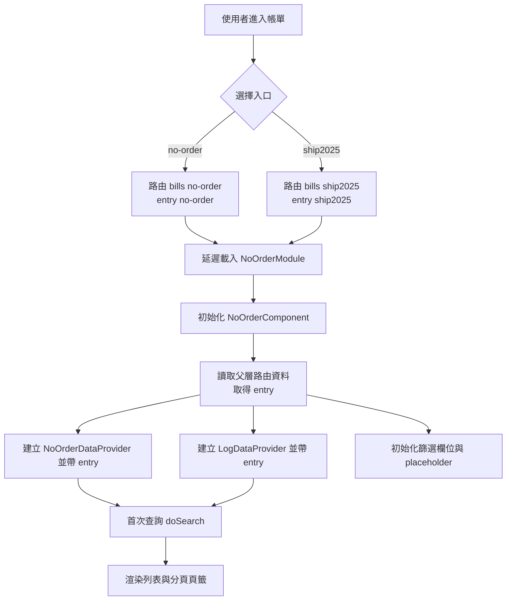
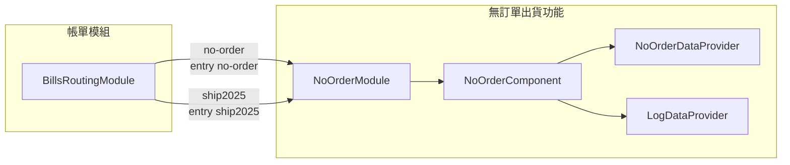
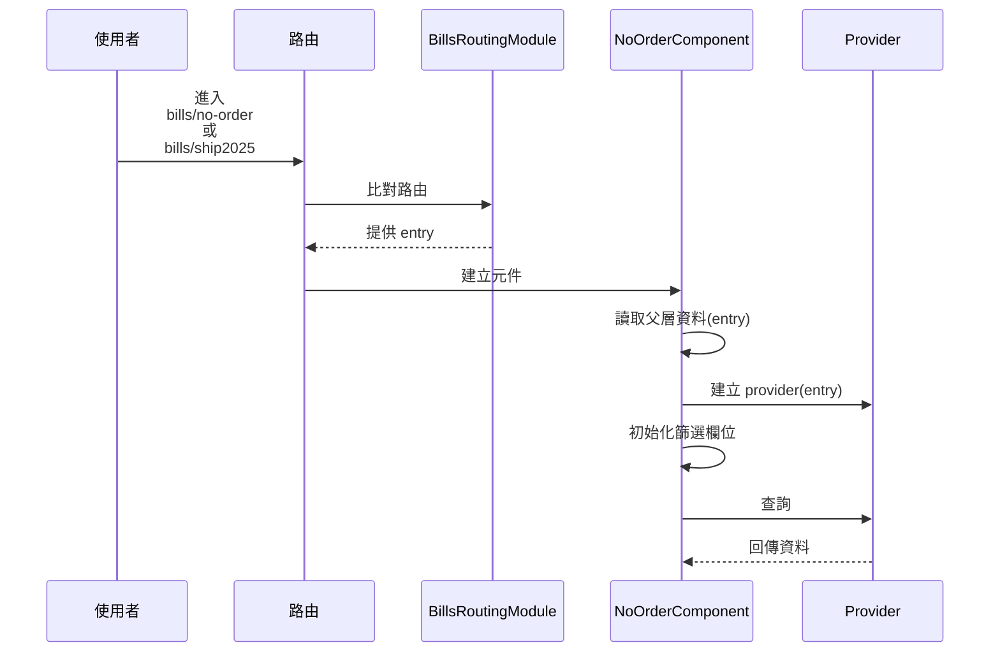

## 修訂紀錄

| **版本** | **日期** | **修訂內容** | **修訂者** |
| --- | --- | --- | --- |
| v1.0 | 2026-01-05 | 初始化文件 | Raelynn |
| v1.1 | 2026-01-08 | 更新：新增「上傳 2025 未出貨 Excel」按鈕之相關文件描述 | Raelynn |

## 相關Jira單：

* CMP-4008 無訂單出貨單需要追加一個 "2025年未出貨" 的出貨單列表(前端)
* CMP-4002 無訂單出貨單需要追加一個 "2025年未出貨" 的出貨單列表(後端)

## 目錄：

1. 目標
2. 功能需求
3. 實作架構設計
   * 3.1 系統流程圖
   * 3.2 元件關係圖
   * 3.3 序列圖
4. 實作

## 1. 目標

1. 解決歷史資料處理問題：提供專屬獨立功能頁面處理 2025 年以前(含)在舊系統未出貨的資料。
2. 維持操作一致性：確保新功能的操作邏輯與現有的「無訂單出貨單」模組基本一致，但數量欄位顯示依照匯入的資料為主。
3. 系統整合：確保 2025 年未出貨資料能正確拋轉至 T100 系統。


## 2. 功能需求

1. 新增獨立功能頁面：在「帳單」選單下新增一個名為「2025年未出貨」的獨立功能頁面，使用同一個模組（`NoOrderModule`）
   - `no-order`（既有）
   - `ship2025`（新增）
2. 資料顯示：顯示 2025 年資料的未出貨出貨單資料列表。
3. 列表規格：欄位與功能按鈕與現有「無訂單出貨」列表一致，但需額外增加「數量」欄位。
4. 拋轉邏輯：支援批次勾選並拋轉至 T100，拋轉方式與現有流程相同。
5. 上傳庫存：提供 excel 上傳的功能，此功能僅限系統管理員可以使用，位置位於介面最上方。


## 3. 實作架構設計

### 3.1 系統流程圖



### 3.2 元件關係圖



### 3.3 序列圖（以 entry 為準）




## 4. 實作

### 4.1 `src/app/bills/bills-routing.module.ts`

- 新增入口 `ship2025`，並在 `no-order` 補上 `data.entry` 供共用模組辨識。

```ts
{
  path: 'no-order',
  data: { breadcrumb: 'no order', entry: 'no-order' },
  canActivate: [AuthGuard],
  loadChildren: () => import('../no-order/no-order.module').then(m => m.NoOrderModule)
},
{
  path: 'ship2025',
  data: { breadcrumb: '2025 unshipped', entry: 'ship2025' },
  canActivate: [AuthGuard],
  loadChildren: () => import('../no-order/no-order.module').then(m => m.NoOrderModule)
},
```

### 4.2 `src/app/no-order/no-order.component.ts`

- `NoOrderComponent` 讀取 `route.parent.data.entry` 以辨識入口。
- 初始化 providers 時，會把 `entry` 傳入 `NoOrderDataProvider` / `LogDataProvider`。
- 呼叫 `NoOrderService` 時也會把 `entry` 傳入，用來決定 API 路徑。
- `ship2025` 入口新增「上傳2025未出貨」功能，並限定僅系統管理員操作。

```ts
entry: 'no-order' | 'ship2025' | string | null = null;

/** 是否為管理員角色 */
isSuperAdmin = false;

ui = {
  // ...existing code...
  /** 上傳中 */
  isUploading: false,
}

constructor(
  // ...existing code...
  private authSvc: AuthService,
) {
  this.isSuperAdmin = this.authSvc.currentRole?.iamType === 'SUPER_ADMIN';
}

ngOnInit() {
  this.route.parent?.data
    .pipe(take(1))
    .subscribe(data => {
      this.entry = data?.['entry'] ?? null;

      this.dataProvider = new NoOrderDataProvider(this.translate, this.notify, this.noOrdersSvc, this.entry);
      this.logDataProvider = new LogDataProvider(this.translate, this.notify, this.noOrdersSvc, this.entry);

      // 初始化篩選欄位
      this.initFilterAttributes();

      this.getBrand();
      this.doSearch(new Filter);
    });
}

/** 上傳2025未出貨檔案 */
selectFileToUpload(event: any) {
  const fileList: FileList = event.target.files;
  if (!fileList) return;

  const allFiles: File[] = Array.from(fileList);

  if (!allFiles.length) {
    event.target.value = '';
    return;
  }

  this.ui.isUploading = true;

  this.noOrdersSvc.uploadShip2025Data(allFiles).subscribe({
    next: (res) => {
      this.ui.isUploading = false;
      if (res && res.info && res.info.success) {
        this.notify.success('', this.translate.instant('upload success'));
        this.doSearch(new Filter());
      } else {
        this.notify.error('', res.info?.message);
      }
    },
    error: (err) => {
      this.ui.isUploading = false;
      this.notify.error('', err.message);
    }
  });
}
```

### 4.3 `src/app/no-order/no-order.component.html`

- 使用 Angular v18 `@if`，避免 provider 尚未建立時存取 `options.columnSet`。
- `ship2025` 入口新增上傳區塊：僅在 `entry === 'ship2025'` 且 `isSuperAdmin === true` 時顯示「上傳 2025 未出貨 Excel」的選檔按鈕。

```html
<nz-card class="ant-card">
  @if (entry === 'ship2025' && isSuperAdmin) {
    <div nz-flex>
      <input #inputFile type="file" hidden
             [accept]="'.xlsx, .xls'"
             (change)="selectFileToUpload($event)">
      <button nz-button nzType="default"
              (click)="inputFile.click()"
              [nzLoading]="ui.isUploading">
        <span nz-icon nzType="upload" nzTheme="outline" [hidden]="ui.isUploading"></span>
        {{ 'select file to upload with type' | translate: { type: '.xlsx' } }}
      </button>
    </div>
    <nz-divider></nz-divider>
  }

  @if (dataProvider) {
    <ma-table #listTable
              [dataProvider]="dataProvider"
              [width]="(dataProvider.options.columnSet.length * 150) + 'px'"
              [customTheadTpl]="theadTmp"
              [customTemplates]="{'isEnoughTmp': isEnoughTmp, 'isDepositTmp': isDepositTmp}"
              [beforeRowSettingCell]="beforeRowSettingCell"
              [beforeRowSettingCellSpace]="0.2"></ma-table>
  }

  @if (logDataProvider) {
    <ma-table [dataProvider]="logDataProvider"
              [width]="(logDataProvider.options.columnSet.length * 150) + 'px'"></ma-table>
  }
</nz-card>
```

### 4.4 `src/app/no-order/no-order.dataProvider.ts`

- `NoOrderDataProvider` 建立時帶入 `entry`。
- `doQuery()` 呼叫 `NoOrderService.getShippingList(filter, entry)`，以決定 API 路徑。
- 當 `entry` 為 `ship2025` 時，於 table 欄位中插入 `quantity`。

```ts
constructor(
  //...
  private entry: 'no-order' | 'ship2025' | string | null = null,
) {
  super();

  const columnSet: FilterAttribute[] = [];
  columnSet.push(
    // ...既有欄位略...

    // ship2025 專用欄位
    ...(this.entry === 'ship2025'
      ? [
          new FilterAttribute({
            name: this.translate.instant('quantity'),
            internalVariableName: 'quantity',
            space: 0.6,
          }),
        ]
      : []),

    // ...既有欄位略...
  );

  this.options.columnSet = columnSet;
}

override doQuery(event: Filter): Observable<boolean> {
  // ...existing code...
  this.noOrdersSvc.getShippingList(filter, this.entry).subscribe({ /*...*/ });
}
```

### 4.5 `src/app/no-order/log.dataProvider.ts`

- `LogDataProvider` 建立時帶入 `entry`。
- `doQuery()` 呼叫 `NoOrderService.getLogList(filter, entry)`，以決定 API 路徑。

```ts
constructor(
  //...
  private entry: 'no-order' | 'ship2025' | string | null = null,
) {
  super();
}

override doQuery(event: Filter): Observable<boolean> {
  // ...existing code...
  this.noOrdersSvc.getLogList(this.filter, this.entry).subscribe({ /*...*/ });
}
```

### 4.6 `src/app/share/services/no-order.service.ts`

- 增加 `NoOrderEntry` 型別。
- 所有 API method（`getShippingList/getLogList/shipment/checkCancelable/doCancel`）新增 `type: NoOrderEntry` 參數。
- 透過 `invoicePrefix(type)` 將 `entry` 映射成 API prefix：
  - `no-order` → `ship`
  - 其他（包含 `ship2025` / null / 未知字串）→ `ship2025`

```ts
export type NoOrderEntry = 'no-order' | 'ship2025' | string | null;

getShippingList(filter: Filter, type: NoOrderEntry): Observable<ResponseData> {
  const prefix = this.invoicePrefix(type);
  return this.api.post(this.gateway.invoice + `${prefix}/list`, new RequestData(filter));
}

getLogList(filter: Filter, type: NoOrderEntry): Observable<ResponseData> {
  const prefix = this.invoicePrefix(type);
  return this.api.post(this.gateway.invoice + `${prefix}/cancel/history`, new RequestData(filter));
}

shipment(data: any[], type: NoOrderEntry): Observable<ResponseData> {
  const prefix = this.invoicePrefix(type);
  return this.api.post(this.gateway.invoice + `${prefix}/send`, new RequestData(data));
}

checkCancelable(data: any, type: NoOrderEntry): Observable<ResponseData> {
  const prefix = this.invoicePrefix(type);
  return this.api.post(this.gateway.invoice + `${prefix}/checkCancelable`, new RequestData(data));
}

doCancel(id: string, type: NoOrderEntry): Observable<ResponseData> {
  const prefix = this.invoicePrefix(type);
  return this.api.post(this.gateway.invoice + `${prefix}/runCancel/` + id, new RequestData({}));
}
```

### 4.7 `src/app/share/services/no-order.service.ts`

- 新增 `uploadShip2025Data(files: File[])`：
  - 使用 `FormData`（欄位名 `files`）
  - 呼叫 `POST {gateway.invoice}ship2025/upload`

```ts
/** 上傳2025未出貨資料 */
uploadShip2025Data(files: File[]): Observable<ResponseData> {
  const formData = new FormData();
  for (const file of files) {
    formData.append('files', file, file.name);
  }
  return this.api.post(`${this.gateway.invoice}ship2025/upload`, formData);
}
```
