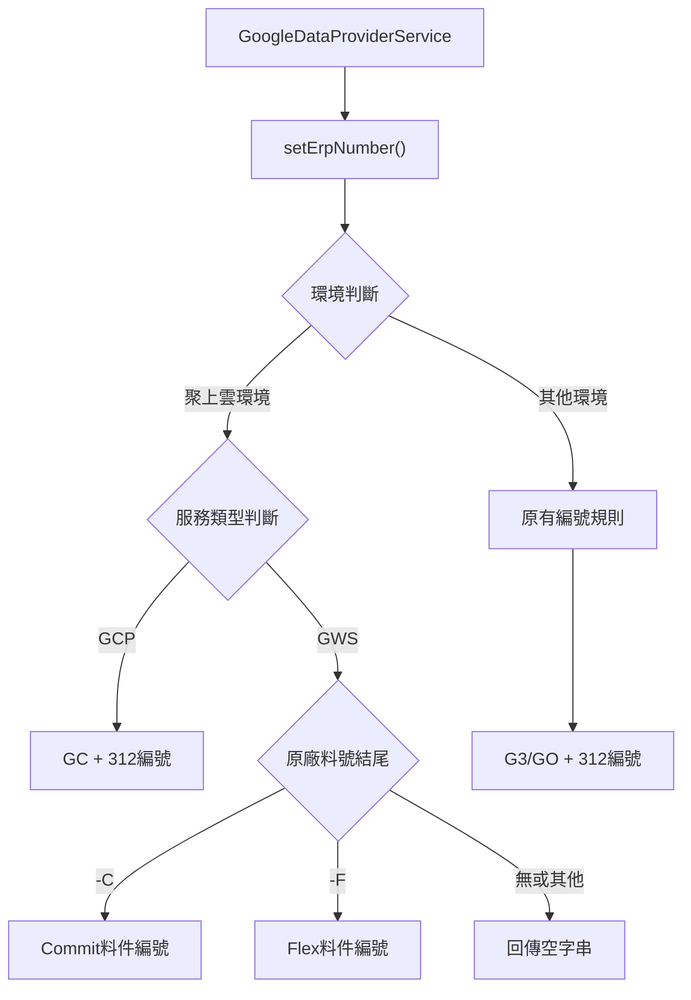
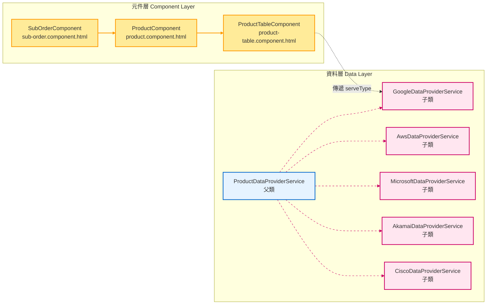
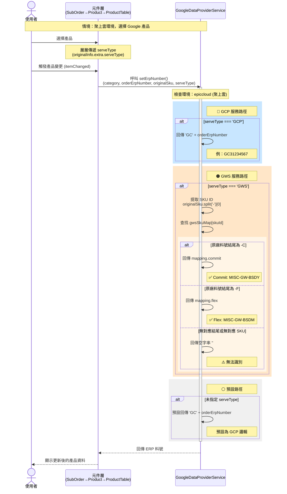

## 修訂紀錄
| **版本** | **日期** | **修訂者** | **修訂內容** |
| --- | --- | --- | --- |
| 1.0 | 2025/10/16 | 開發團隊 | 初版建立：Google ERP料件編號生成規則異動 |

## 相關Jira單
CMP-3887 聚上雲環境：Google ERP料件編號生成規則異動

## 目錄
1. 目標
2. 前端設計
   - 2.1 實作架構設計
   - 2.2 元件關係圖
   - 2.3 序列圖
3. 實作細節
   - 3.1 修改檔案清單
   - 3.2 ProductDataProviderService 修改（父類）
   - 3.3 GoogleDataProviderService 修改（子類）
   - 3.4 其他品牌 DataProvider 修改（子類）
   - 3.5 元件層傳遞 serveType 參數
   - 3.6 編號格式對比
   - 3.7 GWS SKU 對應表

## 1. 目標

因應聚上雲環境的特殊需求，需要調整 Google ERP 料件編號的生成規則。主要目標：

- 修改 `GoogleDataProviderService` 中的 `setErpNumber()` 方法
- 確保料件編號生成符合聚上雲環境的規範
- 維持與其他環境的相容性

## 2. 前端設計

### 2.1 實作架構設計



### 2.2 元件關係圖



**圖例說明：**
- 🟡 **黃色區塊**：本次修改的檔案
- 🔵 **藍色區塊**：父類（定義介面）
- 🔴 **粉色區塊**：子類（實作邏輯）
- **實線箭頭**：serveType 參數傳遞方向
- **虛線箭頭**：繼承關係（override setErpNumber）

### 2.3 序列圖

以下為聚上雲環境中，使用者選擇 Google 產品時的 ERP 料號生成流程：



**圖例說明：**
- 🔵 **藍色區塊**：GCP 服務路徑（簡單邏輯）
- 🟠 **橘色區塊**：GWS 服務路徑（複雜 SKU 對應邏輯）
- ⚪ **灰色區塊**：預設路徑（fallback）
- `alt...else...end`：條件分支語法，相當於 `if-else if-else`

## 3. 實作細節

### 3.1 修改檔案清單

本次修改涉及以下 11 個檔案：

| # | 檔案路徑 | 修改內容 |
|---|---------|---------|
| 1 | `src/app/orders/sub-order/products/data-service/product-data-provider.service.ts` | 父類：更新 `setErpNumber()` 方法，增加 `serveType` 參數 |
| 2 | `src/app/orders/sub-order/products/data-service/google-data-provider.service.ts` | Google 子類：新增 `gwsSkuMap` 對應表、重寫 `setErpNumber()` 方法邏輯 |
| 3 | `src/app/orders/sub-order/products/data-service/aws-data-provider.service.ts` | AWS 子類：更新 `setErpNumber()` 方法簽名（增加 `serveType` 參數） |
| 4 | `src/app/orders/sub-order/products/data-service/microsoft-data-provider.service.ts` | Microsoft 子類：更新 `setErpNumber()` 方法簽名（增加 `serveType` 參數） |
| 5 | `src/app/orders/sub-order/products/data-service/akamai-data-provider.service.ts` | Akamai 子類：更新 `setErpNumber()` 方法簽名（增加 `serveType` 參數） |
| 6 | `src/app/orders/sub-order/products/data-service/cisco-data-provider.service.ts` | Cisco 子類：更新 `setErpNumber()` 方法簽名（增加 `serveType` 參數） |
| 7 | `src/app/orders/sub-order/sub-order.component.html` | 從 `subOrder.originalInfo['extra']?.serveType` 取得服務類型並傳遞給 `app-product` 元件 |
| 8 | `src/app/orders/sub-order/products/product.component.html` | 傳遞 `serveType` 給 `app-order-product-table` 元件 |
| 9 | `src/app/orders/sub-order/products/product.component.ts` | 新增 `serveType` 輸入屬性、傳遞給子元件 |
| 10 | `src/app/orders/sub-order/products/product-table/product-table.component.ts` | 新增 `serveType` 輸入屬性、監聽 `serveType` 變化並更新 ERP 料號 |
| 11 | `src/app/orders/sub-order/products/product-table/product-table.component.html` | 傳遞 `serveType` 參數給 `dataProvider.onItemChanged()` |

### 3.2 ProductDataProviderService 修改（父類）

**檔案位置：** `src/app/orders/sub-order/products/data-service/product-data-provider.service.ts`

**修改內容：** 更新 `setErpNumber()` 方法，增加可選參數

```typescript
setErpNumber(category: string, orderErpNumber: string, originalSku: string, serveType?: string): string {
  return '';
}
```

**修改原因：**
- 子類 `GoogleDataProviderService` 需要額外的 `serveType` 參數來區分 GCP 與 GWS
- 為保持繼承關係一致性，父類方法需同步更新
- 設為可選參數，不影響其他品牌的現有邏輯

**影響範圍：**
- 所有品牌的 DataProvider（AWS、Microsoft、Akamai、Cisco、Google）都有 override 此方法
- 因此所有子類都需要同步更新方法參數定義，增加 `serveType?: string` 參數
- 除了 Google 之外，其他品牌不使用此參數，僅保持參數定義一致

### 3.3 GoogleDataProviderService 修改（子類）

**檔案位置：** `src/app/orders/sub-order/products/data-service/google-data-provider.service.ts`

#### 修改 1：新增 GWS SKU 對應表

在類別中新增私有唯讀屬性 `gwsSkuMap`，定義 12 組 GWS 產品的 Commit/Flex 料件編號對應關係：

```typescript
/** GWS SKU 對應表 (Commit/Flex) */
private readonly gwsSkuMap: Record<string, { commit: string; flex: string }> = {
  '1010020028': { commit: 'MISC-GW-BSDY', flex: 'MISC-GW-BSDM' },
  '1010020027': { commit: 'MISC-GW-BSTY', flex: 'MISC-GW-BSTM' },
  '1010020025': { commit: 'MISC-GW-BPSY', flex: 'MISC-GW-BPSM' },
  '1010500001': { commit: 'MISC-GW-COPR', flex: 'MISC-GW-COPR' },
  '1010060003': { commit: 'MISC-GW-EESY', flex: 'MISC-GW-EESY' },
  '1010020020': { commit: 'MISC-GW-EPSY', flex: 'MISC-GW-EPSM' },
  '1010020026': { commit: 'MISC-GW-ESDY', flex: 'MISC-GW-ESDY' },
  '1010020029': { commit: 'MISC-GW-ESTY', flex: 'MISC-GW-ESTY' },
  '1010470005': { commit: 'MISC-GW-GMEP', flex: 'MISC-GW-GMEP' },
  '1010310008': { commit: 'MISCGWEDUP1Y', flex: 'MISCGWEDUP2Y' },
  '1010310005': { commit: 'MISCGWEDUS1Y', flex: 'MISCGWEDUS2Y' },
  '1010370001': { commit: 'MISCGWEUTL1Y', flex: 'MISCGWEUTL2Y' },
};
```

**說明：**
- 對應表 Key 為 SKU ID（從原廠料號取得，格式如 `1010020028-C`，取前段 `1010020028`）
- 每個 SKU ID 對應一組 `{ commit, flex }` 料件編號

#### 修改 2：重寫 setErpNumber() 方法

完整重寫 `setErpNumber()` 方法，實作聚上雲環境的特殊邏輯：

```typescript
override setErpNumber(category: string, orderErpNumber: string, originalSku: string, serveType?: string): string {
  const companyId = this.currentUser?.companyId;
  if (!companyId) {
    return '';
  }
  orderErpNumber = orderErpNumber || '';

  const type = serveType ?? '';

  switch (companyId) {
    case this.configCompanyId['metaage']:
      return 'G3' + orderErpNumber;

    // 主要更新部分－聚上雲：
    case this.configCompanyId['epiccloud']: {
      if (type === 'GCP') {
        return 'GC' + orderErpNumber;
      }
      if (type === 'GWS') {
        const skuId = (originalSku || '').split('-')[0];
        if (!skuId) return '';
        const mapping = this.gwsSkuMap[skuId];
        if (!mapping) return '';
        const isCommit = /-C$/i.test(originalSku);
        const isFlex = /-F$/i.test(originalSku);
        if (isCommit) return mapping.commit;
        if (isFlex) return mapping.flex;
        // 若原廠料號結尾未對應到 -C 或 -F，回傳空字串
        return '';
      }
      return 'GC' + orderErpNumber;
    }

    case this.configCompanyId['inspir']:
      return 'GO' + orderErpNumber;

    default:
      return '';
  }
}
```


**邏輯說明：**

1. **邁達特環境** (`metaage`)：維持原邏輯，回傳 `G3` + 312編號
2. **聚上雲環境** (`epiccloud`)：
   - **GCP 服務**：回傳 `GC` + 312編號
   - **GWS 服務**：
     - 從 `originalSku` 提取 SKU ID（以 `-` 分割取第一段）
     - 在 `gwsSkuMap` 中查找對應的料件編號
     - 根據 `originalSku` 結尾判斷：
       - 以 `-C` 結尾（不區分大小寫）：回傳 Commit 料件編號
       - 以 `-F` 結尾（不區分大小寫）：回傳 Flex 料件編號
       - 無對應結尾或無法識別：回傳空字串 `''`
   - **未指定服務類型**：預設回傳 `GC` + 312編號
3. **啟迪環境** (`inspir`)：維持原邏輯，回傳 `GO` + 312編號
4. **其他環境**：回傳空字串

### 3.4 其他品牌 DataProvider 修改（子類）

為了保持繼承關係一致性，所有 override `setErpNumber()` 方法的品牌 DataProvider 都需要同步更新方法參數定義。

**修改檔案：**
- `src/app/orders/sub-order/products/data-service/aws-data-provider.service.ts`
- `src/app/orders/sub-order/products/data-service/microsoft-data-provider.service.ts`
- `src/app/orders/sub-order/products/data-service/akamai-data-provider.service.ts`
- `src/app/orders/sub-order/products/data-service/cisco-data-provider.service.ts`

**修改內容：**

將原本的方法參數定義：
```typescript
override setErpNumber(category: string, orderErpNumber: string, originalSku: string): string {
  // ...實作內容維持不變
}
```

更新為：
```typescript
override setErpNumber(category: string, orderErpNumber: string, originalSku: string, serveType?: string): string {
  // ...實作內容維持不變
}
```

**說明：**
- 這些品牌的 DataProvider 內部邏輯**不需要修改**
- 僅增加 `serveType?: string` 參數以保持與父類參數定義一致
- 由於是可選參數，這些品牌不需要實際使用此參數
- Microsoft 的參數定義稍有不同（`orderErpNumber: string|''`），同樣只需要增加 `serveType?: string`

### 3.5 元件層傳遞 serveType 參數

為了讓 `setErpNumber()` 能接收到正確的服務類型，需要從訂單資料中提取 `serveType` 並層層傳遞到 DataProvider。

#### 修改 1：sub-order.component.html

**檔案位置：** `src/app/orders/sub-order/sub-order.component.html`

從 `subOrder.originalInfo['extra']?.serveType` 取得服務類型，並傳遞給 `app-product` 元件：

```html
<app-product [orderHeader]="orderHeader"
             ...
             [serveType]="subOrder.originalInfo['extra']?.serveType"
             ...></app-product>
```

**說明：**
- `originalInfo.extra.serveType` 為 Google 子單儲存的服務類型欄位
- 使用可選鏈運算子 `?.` 避免 `extra` 不存在時報錯

#### 修改 2：product.component.ts

**檔案位置：** `src/app/orders/sub-order/products/product.component.ts`

新增 `serveType` 輸入屬性：

```typescript
/** (子單-google) 服務類型 */
@Input() serveType!: 'GCP' | 'GWS';
```

在進階搜尋時，使用 `serveType` 參數呼叫 `setErpNumber()`：

```typescript
// erp料號
product.erpNumber = product.erpSku ? product.erpSku : 
  this.dataProvider.setErpNumber(product.category, this.orderHeader.orderErpNumber, product.originalSku, this.serveType);
```

#### 修改 3：product.component.html

**檔案位置：** `src/app/orders/sub-order/products/product.component.html`

將 `serveType` 傳遞給 `app-order-product-table` 元件：

```html
<app-order-product-table ...
                         [serveType]="serveType"
                         ...></app-order-product-table>
```

#### 修改 4：product-table.component.ts

**檔案位置：** `src/app/orders/sub-order/products/product-table/product-table.component.ts`

**新增輸入屬性：**

```typescript
/** (子單-google) 服務類型 */
@Input() serveType!: 'GCP' | 'GWS';
```

**監聽 serveType 變化：**

在 `ngOnChanges()` 中監聽 `serveType` 變化，當服務類型改變時，更新所有產品的 ERP 料號：

```typescript
// serveType
if (changes['serveType'] && !changes['serveType'].firstChange) {
  this.products.forEach(product => {
    product.erpNumber = this.dataProvider.setErpNumber(
      product.category, 
      this.orderErpNumber, 
      product.originalSku, 
      this.serveType
    );
  });
}
```

**說明：**
- 由於父類 `setErpNumber()` 方法已增加 `serveType` 參數，所以這裡也需要傳入以保持參數定義一致

#### 修改 5：product-table.component.html

**檔案位置：** `src/app/orders/sub-order/products/product-table/product-table.component.html`

在 `ma-tree-table` 的 `itemChanged` 事件中傳遞 `serveType` 參數：

```html
<ma-tree-table #maTable
               ...
               (itemChanged)="dataProvider.onItemChanged($event, orderHeader, cloudId, partnerId, serveType)"
               ...></ma-tree-table>
```

**說明：**
- 當使用者在表格中選擇產品時，透過 `itemChanged` 事件觸發
- `dataProvider.onItemChanged()` 會呼叫 `onProductSelect()`
- 最終會呼叫 `setErpNumber()` 生成 ERP 料號

### 3.6 編號格式對比

| 環境 | 服務類型 | 原格式 | 新格式 | 範例 |
|------|---------|--------|--------|------|
| 邁達特 | Google | `G3{312編號}` | 維持不變 | `G331234567` |
| 啟迪 | Google | `GO{312編號}` | 維持不變 | `GO31234567` |
| 聚上雲 | GCP | `GC{312編號}` | 維持不變 | `GC31234567` |
| 聚上雲 | GWS (Commit) | `GC{312編號}` | `{SKU對應Commit}` | `MISC-GW-BSDY` |
| 聚上雲 | GWS (Flex) | `GC{312編號}` | `{SKU對應Flex}` | `MISC-GW-BSDM` |
| 聚上雲 | GWS (無後綴) | `GC{312編號}` | `''` (空字串) | - |

### 3.7 GWS SKU 對應表

| 品名 | SKU ID | Commit 料件編號 | Flex 料件編號 |
|------|--------|----------------|---------------|
| Google Workspace Business-Business Standard | 1010020028 | MISC-GW-BSDY | MISC-GW-BSDM |
| Google Workspace Starter-Business Starter | 1010020027 | MISC-GW-BSTY | MISC-GW-BSTM |
| Google Workspace Business-Business Plus | 1010020025 | MISC-GW-BPSY | MISC-GW-BPSM |
| Google Workspace Colab-Colab Pro | 1010500001 | MISC-GW-COPR | MISC-GW-COPR |
| Google Workspace Enterprise-Enterprise Essentials | 1010060003 | MISC-GW-EESY | MISC-GW-EESY |
| Google Workspace Enterprise-Enterprise Plus | 1010020020 | MISC-GW-EPSY | MISC-GW-EPSM |
| Google Workspace Enterprise-Enterprise Standard | 1010020026 | MISC-GW-ESDY | MISC-GW-ESDY |
| Google Workspace Enterprise-Enterprise Starter | 1010020029 | MISC-GW-ESTY | MISC-GW-ESTY |
| Google Workspace for Education-Gemini for Education Premium | 1010470005 | MISC-GW-GMEP | MISC-GW-GMEP |
| Google Workspace for Education-Google Workspace for Education Plus | 1010310008 | MISCGWEDUP1Y | MISCGWEDUP2Y |
| Google Workspace for Education-Google Workspace for Education Standard | 1010310005 | MISCGWEDUS1Y | MISCGWEDUS2Y |
| Google Workspace for Education-Google Workspace for Education Teaching and Learning Upgrade | 1010370001 | MISCGWEUTL1Y | MISCGWEUTL2Y |

