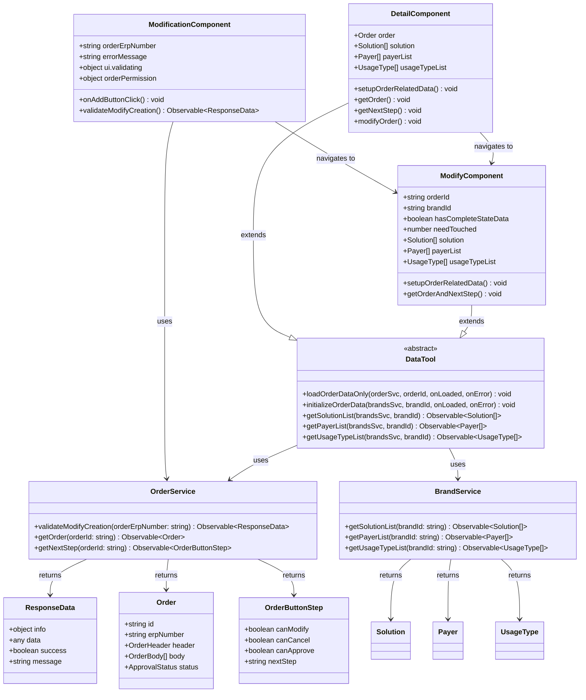
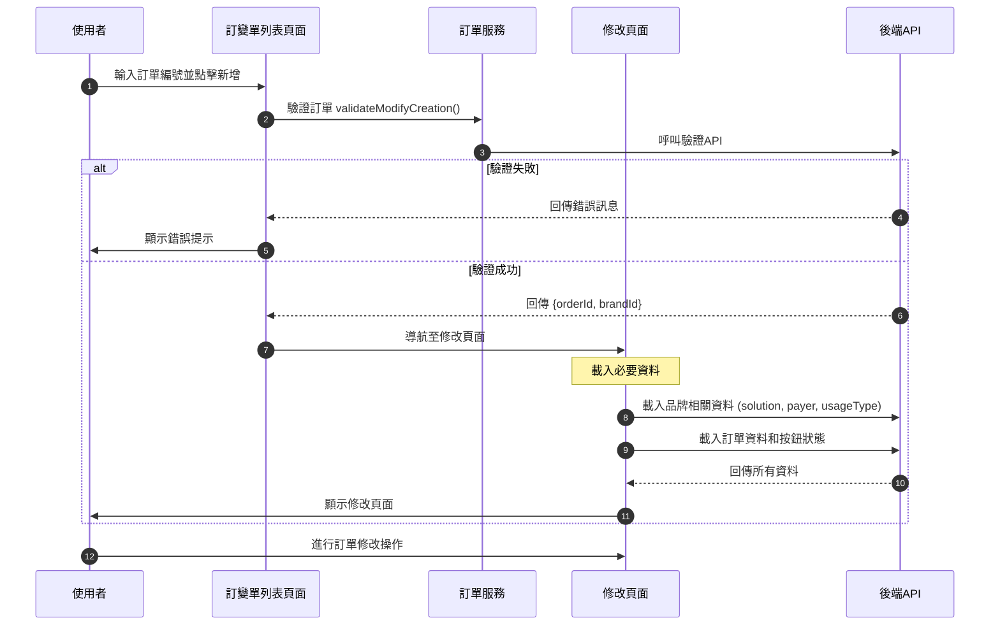
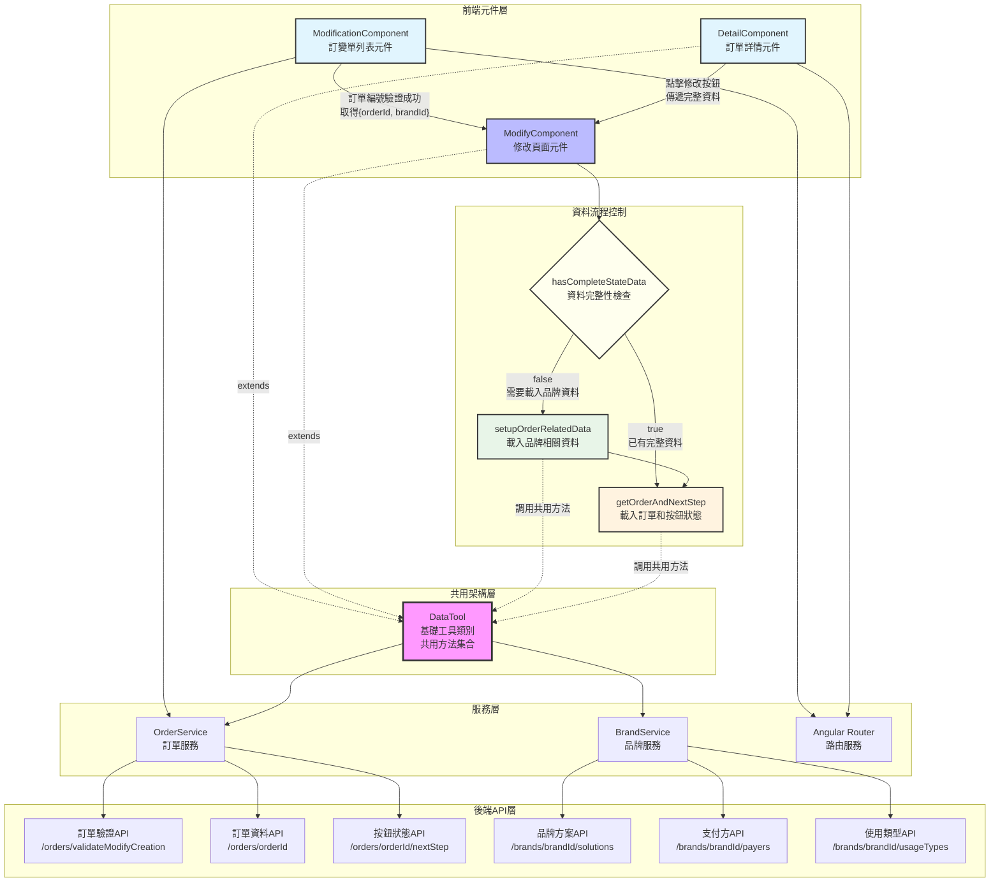

# SD_新版訂單/訂變單新增「備註」欄位（前端）

## 修訂紀錄
| **日期** | **修訂者** | **修訂內容** |
| --- | --- | --- |
| 2025/08/06 | Raelynn | 依據系統分析文件建立初版系統設計 |
| 2025/08/06 | Raelynn | 修改流程設計，優化使用者體驗 |
| 2025/08/07 | Raelynn | 更新元件互動設計，新增 DataTool 服務設計和修改頁面適配設計 |
| 2025/09/22 | Raelynn | 基於重構成果更新 DataTool 共用方法設計，優化修改頁面適配邏輯 |
| 2025/09/23 | Raelynn | 更新系統架構圖表：資料模型類別圖、整體架構循序圖、元件關係圖 |

## 相關Jira單：
- CMP-3801 新版訂變單：列表增加新增訂變單按鈕(前端)
- CMP-3802 新版訂變單：列表增加新增訂變單按鈕(後端)

## 目錄

1. [設計目標](#1-設計目標)
2. [系統架構設計](#2-系統架構設計)
   - 2.1 [UI 設計](#21-ui-設計)
   - 2.2 [資料模型類別圖](#22-資料模型類別圖)
   - 2.3 [整體架構（循序圖）](#23-整體架構循序圖)
   - 2.4 [元件關係圖](#24-元件關係圖)
3. [實作細節](#3-實作細節)
   - 3.1 [元件互動設計](#31-元件互動設計)
   - 3.2 [訂單服務設計](#32-訂單服務設計)
   - 3.3 [DataTool 類別擴展設計](#33-datatool-類別擴展設計)
   - 3.4 [DetailComponent 訂單變更設計](#34-detailcomponent-訂單變更設計)
   - 3.5 [修改頁面適配設計](#35-修改頁面適配設計)

## 1. 設計目標
此功能旨在提供使用者於訂變單列表頁面中快速建立訂變單的能力，並確保訂單符合變更條件。
- 在訂變單列表頁面新增訂單編號輸入區塊和新增按鈕
- 實作訂單編號格式及狀態驗證機制
- 處理多種錯誤情境和提供適當的使用者回饋
- 成功驗證後導向至訂變單編輯頁面

## 2. 系統架構設計

### 2.1 UI 設計
 - 在訂變單列表頁面新增輸入區塊
  
 - 錯誤訊息顯示
  

### 2.2 資料模型類別圖



### 2.3 整體架構（循序圖）



### 2.4 元件關係圖



## 3. 實作細節

### 3.1 元件互動設計

- modification.component.html
  ```html
  @if (orderPermission['order-v1.createOrderModify'] && orderPermission['order-v2.validateModifyCreation']) {
    <!-- 新增 -->
    <div nz-row>
      <nz-form-label nzFor="orderErpNumber" class="orderErpNumber-label">{{ 'order number' | translate}}</nz-form-label>
      <nz-form-control [nzSm]="4" [nzXs]="24" class="mr-2">
        <input nz-input id="orderErpNumber"
               [(ngModel)]="orderErpNumber"
               [placeholder]="'please fill input' | translate: {input: 'order number' | translate}" />
        @if (errorMessage) {
          <div class="error-message text-danger mt-1">
            {{ errorMessage }}
          </div>
        }
      </nz-form-control>
      <div nz-col [nzSm]="2" [nzXs]="24">
        <button nz-button
                class="d-flex align-items-center"
                (click)="onAddButtonClick()"
                [nzLoading]="ui.validating"
                [disabled]="!orderErpNumber.trim()">
          <span nz-icon nzType="plus" nzTheme="outline"></span>
          {{ 'add' | translate | titlecase }}{{ 'modify order' | translate | titlecase }}
        </button>
      </div>
    </div>
    <nz-divider></nz-divider>
  }
  ```

- modification.component.ts:
  ```typescript
  // 訂變單列表元件類別
  export class ModificationComponent {

    /** order 權限 */
    orderPermission: { [key: string]: Permission } = {};

    /** 訂單號輸入 */
    orderErpNumber: string = '';

    /** 錯誤訊息 */
    errorMessage: string = '';
    
    /** UI 狀態 */
    ui = {
      validating: false;
    };
    
    ngOnInit(): void {
      // 合併 order-v1 和 order-v2 的權限
      this.orderPermission = {
        ...this.permission.getPermission('order-v1'),
        ...this.permission.getPermission('order-v2')
      };
    }
    
    /** 新增修改訂單按鈕點擊事件 */
    onAddButtonClick(): void {
      this.errorMessage = '';
      this.ui.validating = true;

      // 保存當前訂單號
      const currentOrderErpNumber = this.orderErpNumber.trim();

      // 呼叫 API 驗證訂單狀態
      this.orderSvc.validateModifyCreation(currentOrderErpNumber).subscribe({
        next: (res) => {
          this.ui.validating = false;

          if (res.info.success && res.data) {
            // 驗證通過後，直接導航到修改頁面
            const orderId = res.data;
            this.router.navigate(['/main/orders', orderId, 'modify'], {
              state: { 
                orderId: orderId,
                brandId: res.data.brandId,
                hasCompleteStateData: false  // 標示沒有完整資料，需要載入
              }
            });
          } else {
            this.errorMessage = res.info.message || this.translate.instant('order validation failed');
          }
        },
        error: (error) => {
          this.ui.validating = false;
          this.errorMessage = error || this.translate.instant('order validation failed');
        }
      });
    }
  }
  ```

### 3.2 訂單服務設計

在現有的 OrderService 中新增訂單驗證方法。

- share/services/order.service.ts:
  ```typescript
  validateModifyCreation(orderErpNumber: string): Observable<ResponseData> {
    return this.api.get(this.gateway.order + 'orders/validateModifyCreation/' + orderErpNumber);
  }
  ```
  response:
  ```typescript
  data: {
    "orderId": "20250922398799",
    "brandId": "a5ce669b-51ba-4698-919f-84b65bf7174e"
  }
  ```

### 3.3 DataTool 類別擴展設計

基於現有的重構成果，DataTool 類別已經具備了完善的共用方法架構。以下為相關設計說明：

```typescript
// DataTool 類別中的共用方法（已實現）
export class DataTool {
  
  /** 載入單一訂單資料 */
  loadOrderDataOnly(
    orderSvc: OrderService,
    orderId: string,
    onOrderLoaded: (order: Order, oriOrder: Order) => void,
    onError?: (err: any) => void
  ): void {
    // 專門載入訂單資料的方法
  }

  /** 初始化訂單相關資料 */
  initializeOrderData(
    brandsSvc: BrandService,
    brandId: string,
    onDataLoaded: (solution: any[], payerList: any[], usageTypeList: any[]) => void,
    onError?: (err: any) => void
  ): void {
    // 根據品牌ID載入相關資料：solution, payerList, usageTypeList
    // 使用 forkJoin 並行載入，提升效能
  }

  /** 取得方案列表 */
  getSolutionList(brandsSvc: BrandService, brandId: string): Observable<any[]> { }

  /** 取得支付方列表 */
  getPayerList(brandsSvc: BrandService, brandId: string): Observable<any[]> { }

  /** 取得使用類型列表 */
  getUsageTypeList(brandsSvc: BrandService, brandId: string): Observable<any[]> { }
}
```

### 3.4 DetailComponent 訂單變更設計

DetailComponent 在訂單詳情頁面中負責載入和顯示訂單資料，並在使用者點擊訂單變更時傳遞完整資料到 ModifyComponent。

#### 3.4.1 DetailComponent 初始化流程

```typescript
// orders/detail/detail.component.ts
export class DetailComponent extends DataTool implements OnInit {
  
  ngOnInit(): void {
    //....
    // 統一處理相關資料載入
    this.setupOrderRelatedData();
  }
}
```

#### 3.4.2 相關資料載入

```typescript
/** 如果有 brandId 就載入相關資料 */
private setupOrderRelatedData() {
  const brandId = this.order.body[0]?.brand?.id;

  if (brandId) {
    // 並行載入品牌資料和按鈕狀態，不需要等待
    this.initializeOrderData(
      this.brandsSvc,
      brandId,
      (solution: any[], payerList: any[], usageTypeList: any[]) => {
        this.solution = solution;
        this.payerList = payerList;
        this.usageTypeList = usageTypeList;
      },
      (err) => {
        console.error('Error setting up brand data:', err);
      }
    );

    // 取得按鈕狀態，不需要等待品牌資料載入完成
    if (this.permission.flat['order-v1.getNextStep']) {
      this.getNextStep();
    }
  }
}
```

#### 3.4.3 訂單資料載入

```typescript
/** 取得訂單 */
getOrder() {
  this.ui.isLoading = true;

  // 先載入訂單資料
  this.loadOrderDataOnly(
    this.orderSvc,
    this.orderID,
    (order: Order, oriOrder: Order) => {
      this.panels = [];
      this.reviewPanels = [];
      this.order = order;
      this.oriOrder = oriOrder;

      this.handleOrderHeader(this.order.header);
      this.handleOrderBody(this.order.body, this.panels, this.reviewPanels, this.checkOrderResault);

      // 訂單載入完成後，會在 setupOrderRelatedData() 中載入品牌相關資料
      this.ui.isLoading = false;
      this.ui.firstLoading = false;
    },
    (err) => {
      console.error('[order-detail]', err);
      this.notify.error('[order-detail]', err);
      this.ui.isLoading = false;
      this.ui.firstLoading = false;
    }
  );
}
```

#### 3.4.4 訂單變更導航

DetailComponent 在使用者點擊訂單變更時，會傳遞完整的資料到 ModifyComponent：

```typescript
/** 訂單變更 */
modifyOrder() {
  this.router.navigate([`${this.router.url}`, 'modify'], {
    state: {
      //....
      hasCompleteStateData: true, // 明確標示有完整資料
    }
  });
}
```

#### 3.4.5 移除部分程式碼、搬移至 DataTool
```typeScript
handleBrandData() {
  // ....
  this.setPayerList();
  this.setUsageTypeList();
  // ....
}

/** 設定 this.solution */
setSolutionList() {
  // ....
}

/** 設定 this.payerList */
setPayerList() {
  // ....
}

/** 設定 this.usageTypeList */
setUsageTypeList() {
  // ....
}
```

#### 3.4.6 資料載入策略說明

DetailComponent 採用並行載入策略以提升效能：

1. **第一階段**: 載入訂單基本資料（`loadOrderDataOnly`）
2. **第二階段**: 並行載入相關所需資料和按鈕狀態
   - 品牌資料載入：`initializeOrderData`（solution, payerList, usageTypeList）
   - 按鈕狀態載入：`getNextStep`（不需要等待品牌資料）

這種設計的優勢：
- **並行處理**: 品牌資料和按鈕狀態同時載入，減少等待時間
- **獨立性**: `getNextStep` 只需要 brandId 和 orderId，不依賴品牌相關資料
- **使用者體驗**: 按鈕狀態更快顯示，使用者可以更早看到可用操作
- **資料完整性**: 在跳轉到修改頁面時，所有必要資料都已載入完成

### 3.5 修改頁面適配設計

ModifyComponent 繼承 DataTool 並處理兩種進入方式：從詳情頁進入（有完整資料）和直接從列表頁進入（需載入資料）。

```typescript
// orders/modify/modify.component.ts
export class ModifyComponent extends DataTool implements OnInit {
  
  /** 是否有完整的 state 資料 */
  hasCompleteStateData = false;
  
  constructor(...) {
    super(translate, scanDataSvc, notify);
    
    // 從路由 state 取得資料
    const navigation = this.router.getCurrentNavigation();
    const state = navigation?.extras?.state;

    if (state?.['orderId']) {
      this.orderId = state['orderId'];
      this.brandId = state['brandId'];
      this.hasCompleteStateData = state['hasCompleteStateData'];

      // 如果有完整的 state 資料，載入其他資料
      if (this.hasCompleteStateData) {
        this.solution = state['solution'];
        this.payerList = state['payerList'];
        this.usageTypeList = state['usageTypeList'];
        this.needTouched = state['needTouched'] || 0;
      } else {
        // 沒有完整 state 資料時，初始化為 1 以確保表單驗證能正常觸發
        this.needTouched = 1;
      }
    } else {
      // 沒有 state 就返回上一頁
      this.backToOrderPage();
      return;
    }
  }
  
  ngOnInit(): void {
    //....

    // 根據是否有完整 state 資料決定載入流程
    if (this.brandId && !this.hasCompleteStateData) {
      // 從列表頁新增進入，需要自行載入其他所需資料
      this.setupOrderRelatedData();
    } else {
      // 從詳情頁進入，有完整的 state 資料，直接載入訂單並處理
      this.ui.dataLoading = true;
      this.getOrderAndNextStep();
    }
  }

  /**
   * 載入其他所需資料（用於從列表頁直接進入的情況）
   */
  private setupOrderRelatedData(): void {
    this.ui.dataLoading = true;

    // 先載入品牌相關資料
    this.initializeOrderData(
      this.brandsSvc,
      this.brandId,
      (solution: any[], payerList: any[], usageTypeList: any[]) => {
        this.solution = solution;
        this.payerList = payerList;
        this.usageTypeList = usageTypeList;

        // 品牌資料載入完成後，載入訂單資料和按鈕狀態
        this.getOrderAndNextStep();
      },
      (err) => {
        console.error('[setupBrandRelatedData]', err);
        this.notify.error('[setupBrandRelatedData]', err);
        this.ui.dataLoading = false;
      }
    );
  }

  /**
   * 並行載入訂單資料和按鈕狀態
   */
  private getOrderAndNextStep(): void {
    // 使用 forkJoin 並行載入訂單資料和下一步按鈕狀態
    // ...existing implementation...
  }
}
```

這種設計基於實際的程式碼架構：

1. **`hasCompleteStateData` 標記**: 用來區分兩種進入方式
   - `true`: 從詳情頁進入，已有完整資料（solution, payerList, usageTypeList）
   - `false`: 從列表頁進入，需要載入品牌相關資料

2. **條件式資料載入**: 
   - 有完整資料時直接執行 `getOrderAndNextStep()`
   - 沒有完整資料時先執行 `setupOrderRelatedData()` 載入品牌資料

3. **`initializeOrderData()` 共用方法**: 
   - 根據品牌ID載入相關資料（solution, payerList, usageTypeList）
   - 使用 forkJoin 並行載入，提升效能