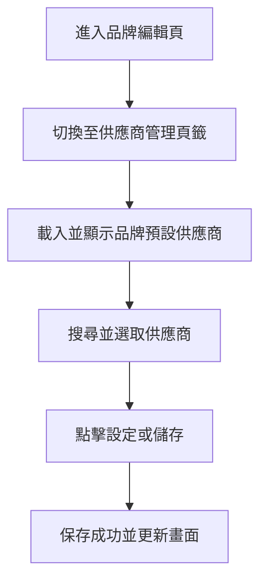
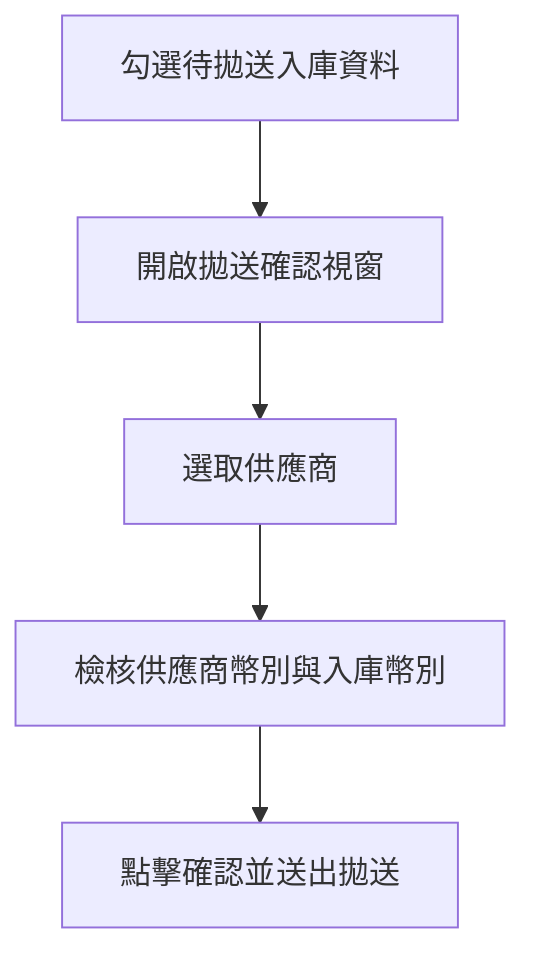
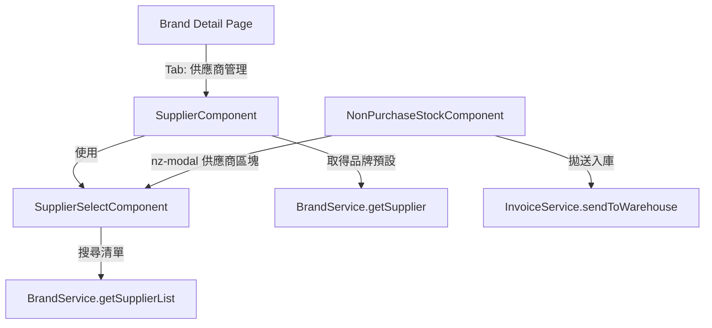
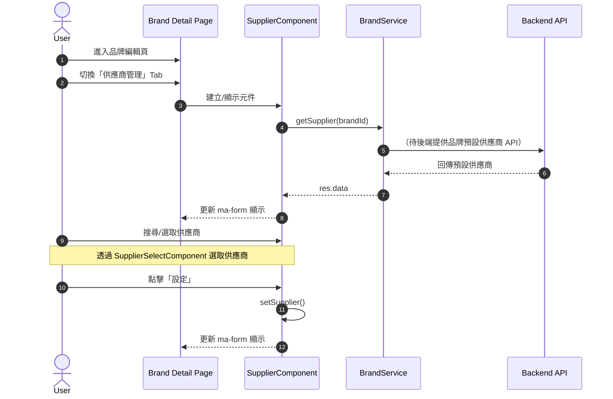
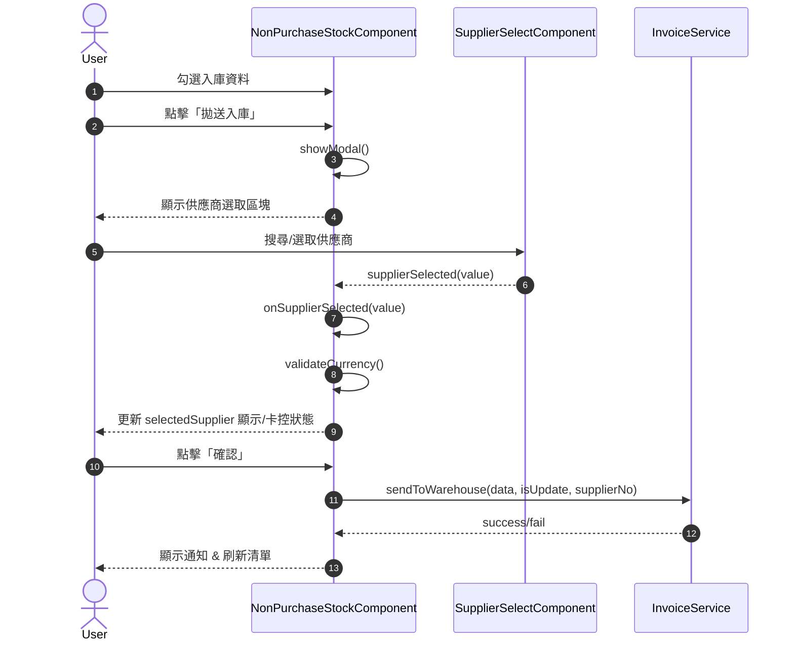

## 修訂紀錄

| **版本** | **日期** | **修訂內容** | **修訂者** |
| --- | --- | --- | --- |
| v1.0 | 2026-01-30 | 初始化文件 | Raelynn |

## 相關Jira單：

* CMP-4121 入庫＆品牌：品牌增加預設供應商以及入庫選擇供應商功能(前端)
* CMP-4122 入庫＆品牌：品牌增加預設供應商以及入庫選擇供應商功能(後端)

## 目錄：

1. 目標
2. 功能需求
3. 實作架構設計
   * 3.1 系統流程圖
   * 3.2 元件關係圖
   * 3.3 序列圖
4. 實作

## 1. 目標
1. 品牌增加「預設供應商」管理功能：可查看目前預設供應商，並透過查詢與單選方式設定/更新。
2. 入庫拋送增加供應商選擇功能：開啟拋送確認視窗後由使用者選取供應商，並於確認拋送時依所選供應商資料拋送給 T100（目前前端未自動預帶品牌預設供應商）。
3. 入庫拋送增加卡控：供應商幣別需與所選入庫項目的 `originalCurrency` 一致，否則禁止確認並於清單標示不一致。

## 2. 功能需求
### 2.1  品牌需要增加設定預設供應商的功能
  1. 品牌編輯頁新增頁籤：供應商管理。
  2. 進入頁籤時，需顯示該品牌目前已設定的預設供應商資訊（若未設定則顯示空/無資料）。
  3. 使用者可透過查詢並以單選方式選取供應商。
  4. 選取後必須點擊「設定/儲存」按鈕才會生效。
  5. 保存成功後，需更新下方顯示的預設供應商資訊。

### 2.2 拋送入庫時，需要增加供應商設定與對應卡控
  1. 開啟拋送入庫確認視窗時，供應商為必填（目前不自動預設帶入品牌預設供應商）。
  2. 供應商選單為單選下拉選單；使用者選取後，右側需即時顯示目前「所選擇供應商」。
  3. 若使用者點擊下拉的清除（clear），右側「所選擇供應商」顯示需同步清空，並要求使用者重新選取。
  4. 拋送時需依照使用者所選擇的供應商資料拋送給 T100。
  5. 供應商幣別需與所選入庫項目的 `originalCurrency` 一致；不一致時需顯示錯誤狀態，且禁止按下「確認」。

## 3. 實作架構設計

### 3.1 系統流程圖

#### 3.1.1 品牌：載入並設定預設供應商

#### 3.1.2 入庫拋送：選取供應商與卡控

### 3.2 元件關係圖

### 3.3 序列圖

#### 3.3.1 品牌：載入並設定預設供應商

#### 3.3.2 入庫拋送：預設帶入與選取供應商

## 4. 實作

### 4.1 新增供應商管理 component 
- `src/app/brand/detail/supplier/supplier.component.html`
- `src/app/brand/detail/supplier/supplier.component.ts`
- `src/app/brand/detail/supplier/supplier.component.scss`

#### 4.1.1 UI/互動
1. 以 `app-supplier-select` 提供供應商查詢與單選。
2. 使用者選取供應商後，點擊「設定」按鈕才會將選取結果套用到下方唯讀資訊顯示。
3. 下方以 `ma-form`（readonly）顯示品牌目前設定的預設供應商資訊。

#### 4.1.2 資料來源
1. 初始載入：
  - 於 `ngOnInit()` 呼叫 `BrandService.getSupplier(brandId)` 取得該品牌目前預設供應商。
  - 取得資料後，將資料 mapping 到 `filterAttribute` 供 `ma-form` 顯示。
2. 共用 mapping：
  - 抽出 `setSupplierToFilterAttrs(data)`，避免重複撰寫 `filterAttribute.forEach(...)`。
3. 儲存：
  - 目前 `setSupplier()` 以 `setTimeout` 模擬儲存成功流程（// call API），待後端 API 完成後再替換為實際呼叫。

### 4.2 品牌管理模組及編輯頁面增加 供應商管理 入口
- `src/app/brand/brand.module.ts`
- `src/app/brand/detail/detail.component.html`

#### 4.2.1 模組註冊
1. `BrandModule` 增加宣告 `SupplierComponent`。

#### 4.2.2 編輯頁籤入口
1. 品牌編輯頁面（detail tabset）新增「供應商管理」頁籤並載入 `app-supplier`。

### 4.3 新增共用組件 SupplierSelectComponent
- `src/app/share/share.module.ts`
- `src/app/share/components/supplier-select/supplier-select.component.html`
- `src/app/share/components/supplier-select/supplier-select.component.ts`
- `src/app/share/components/supplier-select/supplier-select.component.scss`

#### 4.3.1 註冊/匯出
1. `ShareModule` 增加宣告與 export：`SupplierSelectComponent`，供其他模組直接使用。

#### 4.3.2 功能說明
1. `nz-select` server search（`nzServerSearch` + `nzShowSearch`）：
  - 使用者輸入關鍵字後 debounce 300ms。
  - 關鍵字長度 < 2 則不送查詢、清空清單。
  - 透過 `BrandService.getSupplierList(filter)` 取得供應商清單。
2. 綁定方式：採用 `[ngModel]="value"` + `(ngModelChange)`，由 component 內自行決定何時更新 `value` 與觸發事件。

#### 4.3.3 Inputs
1. `allowClear`: 是否允許清除。
2. `disabled`: 是否停用。
3. `placeholder`: placeholder（目前 template 使用固定翻譯字串，後續可擴充成依 input 覆蓋）。
4. `value`: 目前選擇的供應商物件。

#### 4.3.4 Outputs
1. `valueChange`: 配合 `[(value)]` 雙向綁定使用（會回傳供應商物件或 `null`）。
2. `supplierSelected`: 只在「選取供應商」時觸發（不會在 clear 時觸發）。
3. `supplierCleared`: 只在「清除選取」時觸發。

> 設計目的：外層若不希望 clear 動作影響「已選供應商顯示/狀態」，請使用 `supplierSelected` 而非直接依賴 `valueChange`。

### 4.4 入庫頁面增加供應商選擇功能
- `src/app/posting/non-purchase-stock/non-purchase-stock.component.html`
- `src/app/posting/non-purchase-stock/non-purchase-stock.component.ts`

#### 4.4.1 UI
1. 拋送入庫確認視窗（modal）新增供應商區塊：
  - 左側：`app-supplier-select` 下拉單選。
  - 右側：顯示「所選擇供應商」。
2. modal 清單增加刪除 icon（X），可移除單筆待拋送資料。

#### 4.4.2 供應商狀態
1. 開啟 modal 時（`showModal()`）：重置供應商選取/檢核狀態（目前未實作自動預帶品牌預設供應商；原 `getSupplier()` 已註解保留）。
2. 送出拋送前供應商為必填；未選取供應商時「確認」為 disabled。

#### 4.4.3 事件處理
1. `SupplierSelectComponent` 的 `(supplierSelected)` 綁定到 `onSupplierSelected($event)`：
  - 使用者選取供應商後，更新 `selectedSupplier`。
2. clear 行為：
  - `(supplierCleared)` 綁定到 `onSupplierCleared()`，會同步清空右側顯示與檢核狀態。

#### 4.4.4 幣別卡控
1. 使用者選取供應商時觸發幣別檢核：供應商幣別需與 modal 清單所有項目的 `originalCurrency` 一致。
2. 不一致時：
  - 右側「所選擇供應商」顯示紅字（`supplierCurrencyError=true`）。
  - modal 清單逐筆標示不一致項目（`isMismatch=true`），並在表格中套用紅色字體。
  - 「確認」按鈕 disabled。

#### 4.4.5 modal 清單刪除
1. 點擊刪除 icon 會從 `selectedList` 移除該筆，並同步取消主表格該筆 `_itemChecked`。
2. 刪除後會重新檢核幣別狀態（刪除時不額外跳通知）。

### 4.5 i18n（新增/更新翻譯鍵值）
- `src/assets/i18n/zh-tw.json`

新增鍵值：
1. `supplier management`
2. `supplier code`
3. `supplier name`
4. `payment terms`
5. `selected supplier`