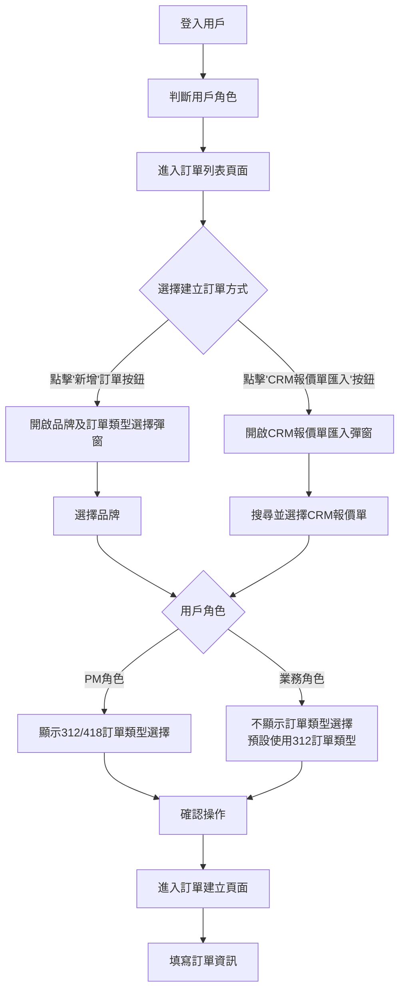
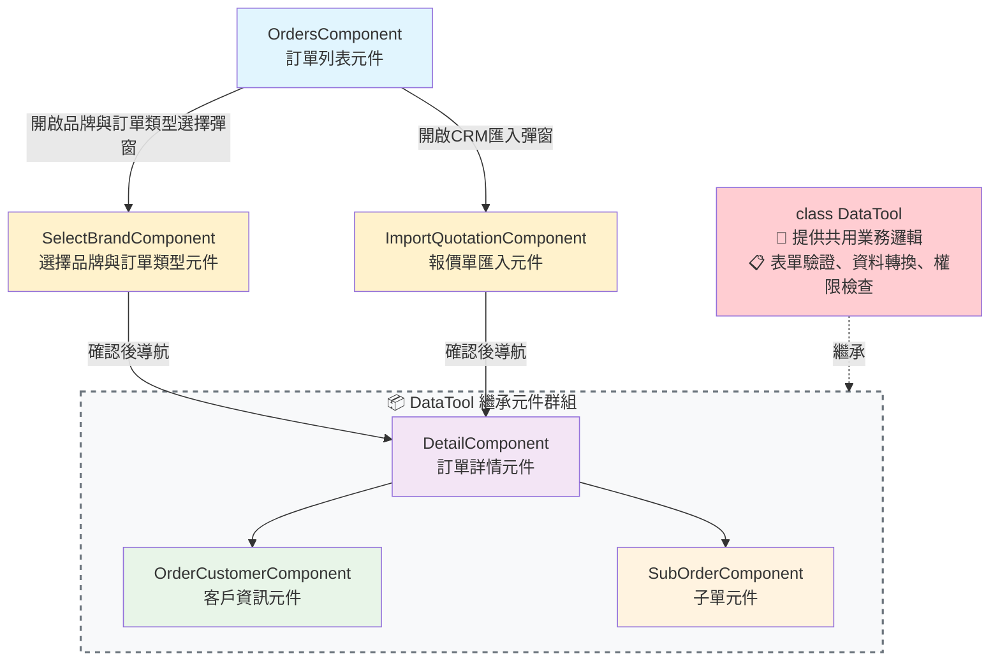
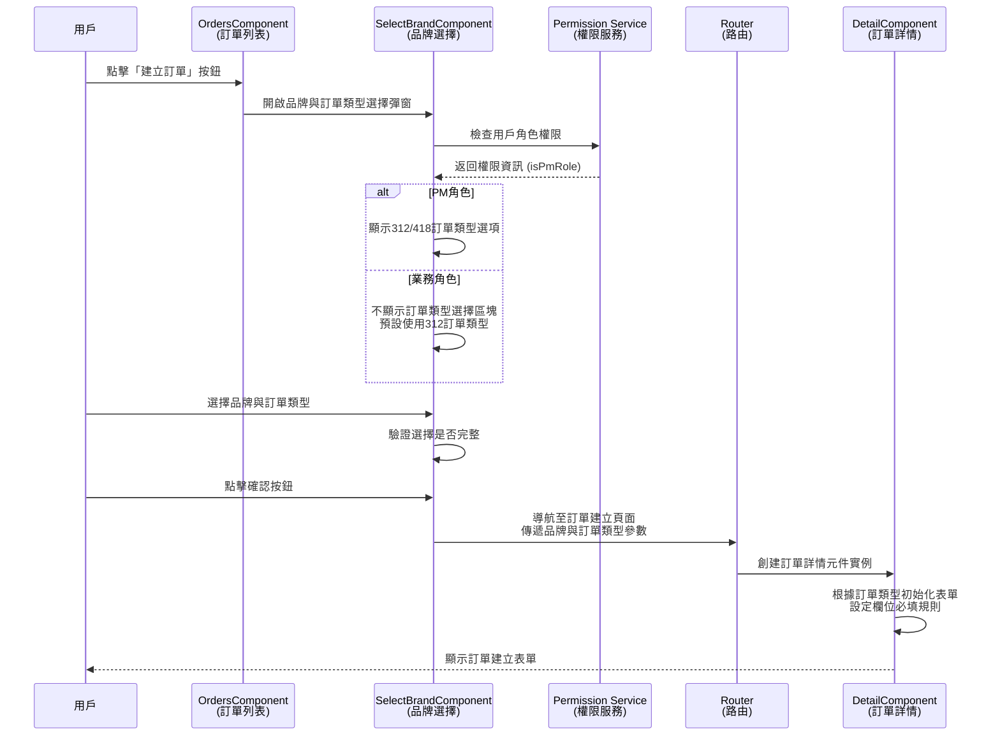
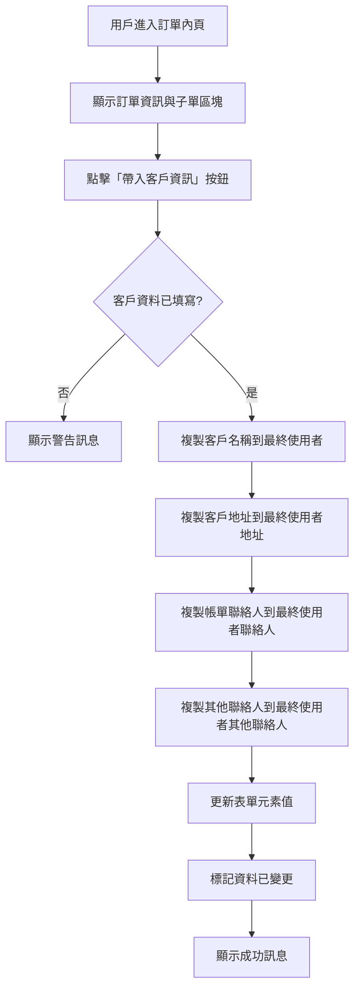
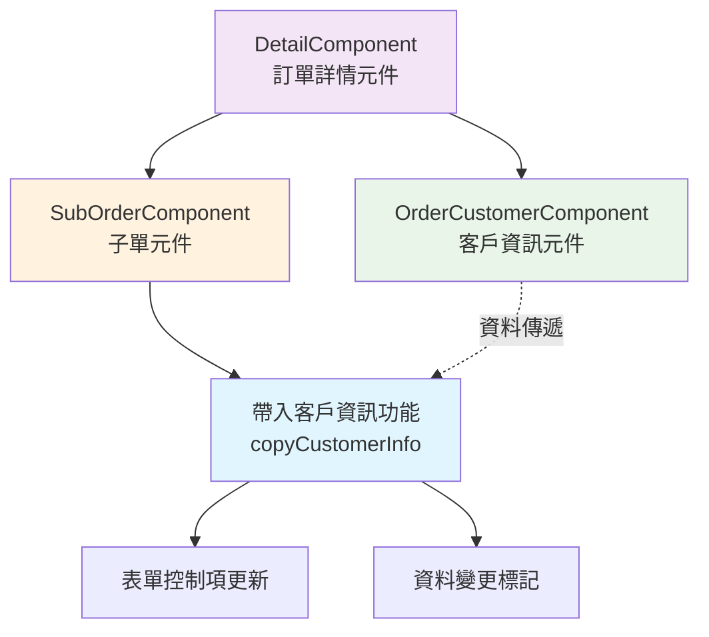
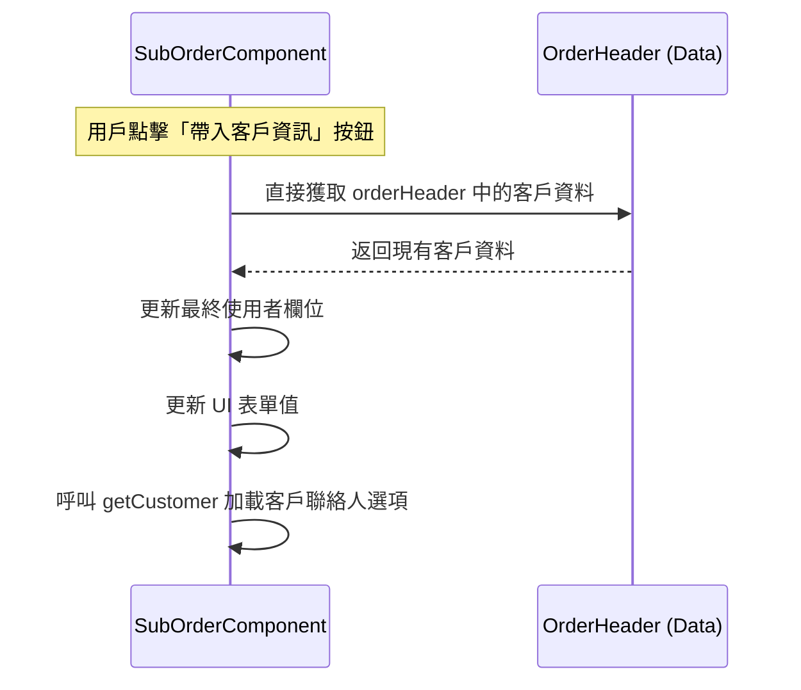

## 修訂紀錄

| **版本** | **日期** | **修訂者** | **修訂內容** |
| --- | --- | --- | --- |
| 1.0 | 2025/08/08 | Raelynn | 初版建立 |
| 1.1 | 2025/08/15 | Raelynn | 增加「新增訂單類型實作」與「客戶資料帶入功能」 |
| 1.2 | 2025/08/15 | Raelynn | 優化「客戶資料帶入功能」實作，使用 lodash 深層複製防止資料參考問題 |
| 1.3 | 2025/08/18 | Raelynn | 整合文檔結構，優化章節安排 |
| 1.4 | 2025/08/19 | Raelynn | 更新系統流程圖、元件關係圖，完善必填欄位變更總結表格 |
| 1.5 | 2025/08/20 | Raelynn | 新增 DetailComponent 訂單類型接收實作說明 |
| 1.6 | 2025/08/22 | Raelynn | 新增透過職務查找使用者API變更說明，配合418訂單類型多角色查詢需求 |
| 1.7 | 2025/11/11 | Raelynn | 新增訂單介面：訂單單號顯示 312 / 418 以方便使用者辨識當前建立訂單類型 |

## 相關Jira單：

* CMP-3778 新版訂單：銷售模式移除改為透過312/418切分是否自用訂單(前端)
* CMP-3813 新版訂單：銷售模式移除改為透過312/418(後端)

## 目錄：

1. [目標](#1-目標)
2. [前端設計](#2-前端設計)
   * 2.1 [訂單類型邏輯設計](#21-訂單類型邏輯設計)
   * 2.2 [UI 設計變更](#22-ui-設計變更)
   * 2.3 [必填欄位變更總結](#23-必填欄位變更總結)
3. [訂單類型選擇與銷售模式移除實作](#3-訂單類型選擇與銷售模式移除實作)
   * 3.1 [實作架構設計](#31-實作架構設計)
     * 3.1.1 [系統流程圖](#311-系統流程圖)
     * 3.1.2 [元件關係圖](#312-元件關係圖)
     * 3.1.3 [訂單類型選擇序列圖](#313-訂單類型選擇序列圖)
   * 3.2 [訂單建立流程元件實作](#32-訂單建立流程元件實作)
     * 3.2.1 [SelectBrandComponent (選擇品牌元件)](#321-selectbrandcomponent-選擇品牌元件)
     * 3.2.2 [ImportQuotationComponent (報價單匯入元件)](#322-importquotationcomponent-報價單匯入元件)
     * 3.2.3 [OrdersComponent (訂單列表元件)](#323-orderscomponent-訂單列表元件)
     * 3.2.4 [DetailComponent (訂單詳情元件)](#324-detailcomponent-訂單詳情元件)
     * 3.2.5 [OrderHeaderComponent (子單單頭元件)](#325-orderheadercomponent-子單單頭元件)
   * 3.3 [銷售模式移除實作](#33-銷售模式移除實作)
     * 3.3.1 [客戶標題顯示](#331-客戶標題顯示)
     * 3.3.2 [客戶資料欄位是否必填](#332-客戶資料欄位是否必填)
     * 3.3.3 [最終使用者公司名稱與地址](#333-最終使用者公司名稱與地址)
     * 3.3.4 [複製子公司訂單](#334-複製子公司訂單)
     * 3.3.5 [報價單匯入](#335-報價單匯入)
     * 3.3.6 [微軟相關檢查](#336-微軟相關檢查)
   * 3.4 [相關API調整](#34-相關api調整)
     * 3.4.1 [透過職務查找使用者API](#341-透過職務查找使用者api)
4. [最終使用者「帶入客戶資訊」功能實作](#4-最終使用者帶入客戶資訊功能實作)
   * 4.1 [功能需求說明](#41-功能需求說明)
   * 4.2 [實作架構設計](#42-實作架構設計)
     * 4.2.1 [功能流程圖](#421-功能流程圖)
     * 4.2.2 [元件關係圖](#422-元件關係圖)
     * 4.2.3 [序列圖](#423-序列圖)
   * 4.3 [元件實作細節](#43-元件實作細節)
   * 4.4 [前端測試案例](#44-前端測試案例)

## 1. 目標

1. 移除 CMP 2.0 系統中訂單模組的「銷售模式」欄位，並改為使用 312/418 訂單類型與最終使用者邏輯的實作方案。主要目標包括：

   * 移除現有訂單內頁的銷售模式 (salesModel) 選單
   * 訂單編號由系統根據當前登入用戶角色與選擇自動產生(312/418)
   * 實作 312/418 訂單類型的前端邏輯
   * 移除銷售模式相關判斷並改為依訂單類型判斷
     - 312: 直銷、經銷、經銷自用
     - 418: 自用、POC
   * 最終使用者改全必填，客戶欄位維持僅 312 訂單需必填
   * `partnerId` 改為全必填
   * `複製子公司訂單` 改為 全可以複製
   * CRM 匯入：
     - 「銷售模式」改為「CRM 銷售模式」
     - 送出前的商機檢查 ([CMP-2939](https://metaage-corp.atlassian.net/browse/CMP-2939))，
        - 原本：需檢查「輸入商機編號時需檢查在 CRM 系統的經銷商跟 CMP 的經銷商是否為同一家客戶，直銷模式下則檢查 CRM EndUser 跟 CMP 的經銷商是否為同一家客戶 ([CMP-3218](https://metaage-corp.atlassian.net/browse/CMP-3218))，相同才可以允許儲存，不同時需跳出錯誤訊息提示」，
        - 直銷模式判斷 改為：當 CMP 最終使用者與客戶一致時，要檢查 CRM EndUser

2. 最終使用者區塊實作「帶入客戶資訊」功能以快速填入最終使用者資訊

## 2. 前端設計

### 2.1 訂單類型邏輯設計

1. 移除現有 enum `OrderSalesModel`
2. 根據用戶角色控制訂單類型選擇的顯示:
   - 業務角色：不顯示訂單類型選擇區塊，預設使用 312 訂單（需要開發票）
   - PM 角色：顯示訂單類型選擇區塊，可建立 312 或 418 訂單（418 不開發票，可轉為312訂單）
3. 312 訂單類型：標準訂單
4. 418 訂單類型：POC/自用訂單

### 2.2 UI 設計變更

1. 移除訂單詳情頁的「銷售模式」下拉選單
2. 新增訂單/匯入報價單 時增加「選擇訂單類型」
3. 新增「同客戶資料」勾選方塊，可將客戶資料自動填入最終使用者欄位

### 2.3 必填欄位變更總結

銷售模式移除後，各欄位的必填邏輯變更如下：

| **欄位分類** | **欄位名稱** | **舊邏輯（基於銷售模式）** | **新邏輯（基於訂單類型）** | **元件位置** |
| --- | --- | --- | --- | --- |
| **客戶資訊** | • ERP客戶編號 (erpCustomerNumber)<br/>• 客戶 (customer.id)<br/>• 客戶聯絡人 (customerContact.id)<br/>• 帳單聯絡人 (billingContact.id)<br/>• 帳單地址 (billingAddress) | selfUse/POC時不必填，其他必填 | 312訂單必填，418訂單不必填 | OrderCustomerComponent |
| **最終使用者資訊** | • 最終使用者公司 (endUser.id)<br/>• 最終使用者地址 (endUserBillingAddress) | distribution/POC時必填，其他不必填 | **全部必填**（由後端回傳欄位決定） | SubOrderComponent |
| **微軟相關** | Partner ID (originalInfo.partnerId) | distribution模式下PM後階段必填 | **全部必填** | MicrosoftExtraFieldComponent |

**訂單類型對應關係：**
- **312訂單（OrderType.normal）**：標準訂單，對應原來的直銷/經銷/經銷自用模式
- **418訂單（OrderType.poc）**：POC/自用訂單，對應原來的自用/POC模式

**重要變更：**
1. 客戶資訊欄位：改為根據訂單類型判斷（`this.orderType === OrderType.normal`）
2. 最終使用者資訊：統一改為全必填，不再依賴前端邏輯判斷
3. Partner ID：移除銷售模式限制，改為全必填

## 3. 訂單類型選擇與銷售模式移除實作

### 3.1 實作架構設計

該功能實作採用模組化的設計架構，透過多個元件協同工作來完成訂單類型選擇與銷售模式移除的功能。

#### 3.1.1 系統流程圖



#### 3.1.2 元件關係圖



#### 3.1.3 訂單類型選擇序列圖



### 3.2 訂單建立流程元件實作

#### 3.2.1 SelectBrandComponent (選擇品牌元件)
**修改內容及方式**：
擴充訂單類型選擇功能，根據用戶角色控制訂單類型選擇區塊的顯示，新增 `showOrderTypeSelection` 輸入屬性控制顯示

- select-brand.component.ts
  ```typescript
  export class SelectBrandComponent implements OnInit {
    @Input() showOrderTypeSelection: boolean = false; // 控制是否顯示訂單類型選擇區塊
    isPmRole: boolean = false; // 是否為PM角色
    orderTypeOptions: Array<{ value: string, label: string }> = [];
    selectedOrderType: string = '312'; // 預設選擇312訂單類型
    
    ngOnInit() {
      // 判斷是否為PM角色
      this.isPmRole = !!this.permission.flat['iam-v1.pm'];
      
      // 只有PM角色才顯示訂單類型選擇區塊
      if (this.isPmRole && this.showOrderTypeSelection) {
        this.orderTypeOptions = [
          { value: '312', label: '312 訂單' },
          { value: '418', label: '418 訂單' }
        ];
      } else {
        // 業務角色不顯示選項，直接使用預設的312訂單類型
        this.selectedOrderType = '312';
      }
    }
  }
  ```

- select-brand.component.html
  ```html
  <!-- 只有PM角色才顯示訂單類型選擇區塊 -->
  <ng-container *ngIf="showOrderTypeSelection && isPmRole">
    <nz-form-item>
      <nz-form-label [nzSpan]="24" nzFor="orderType">{{ 'orderType' | translate }}</nz-form-label>
      <nz-form-control [nzSpan]="24">
        <nz-select [(ngModel)]="selectedOrderType" name="orderType">
          <nz-option *ngFor="let type of orderTypeOptions"
                    [nzValue]="type.value"
                    [nzLabel]="type.label"></nz-option>
        </nz-select>
      </nz-form-control>
    </nz-form-item>
  </ng-container>
  ```

#### 3.2.2 ImportQuotationComponent (報價單匯入元件)
**修改內容及方式**：
新增訂單類型選擇功能，根據用戶角色控制訂單類型選擇區塊的顯示

- import-quotation.component.ts
  ```typescript
  /** 新增訂單選擇的訂單類型 */
  orderType: string = '312'; // 預設為312訂單類型
  /** 新增訂單類型相關屬性 */
  isPmRole: boolean = false; // 是否為PM角色
  orderTypeOptions: Array<{ value: string, label: string }> = []; // 訂單類型選項陣列
  
  ngOnInit() {
    // 判斷是否為PM角色
    this.isPmRole = !!this.permission.flat['iam-v1.pm'];
    
    // 只有PM角色才設定訂單類型選項
    if (this.isPmRole) {
      this.orderTypeOptions = [
        { value: '312', label: '312 訂單' },
        { value: '418', label: '418 訂單' }
      ];
    }
    // 業務角色不顯示選項，預設使用312訂單類型
  }
  ```

- import-quotation.component.html
  ```html
  <!-- 訂單類型 - 只有PM角色才顯示 -->
  <nz-form-item *nzSpaceItem *ngIf="isPmRole">
    <nz-form-label class="font-weight-bold">{{ 'orderType' | translate }}</nz-form-label>
    <nz-form-control class="min-width-200">
      <nz-select [(ngModel)]="orderType" [nzDropdownMatchSelectWidth]="true"
                 [nzPlaceHolder]="'please fill select' | translate: { select: 'orderType' | translate}"
                 [nzDisabled]="!productList?.length || ui.isVersionLoading"
                 [nzLoading]="ui.isVersionLoading">
        <nz-option *ngFor="let orderType of orderTypeOptions"
                   [nzValue]="orderType.value"
                   [nzLabel]="orderType.label"></nz-option>
      </nz-select>
    </nz-form-control>
  </nz-form-item>
  ```

#### 3.2.3 OrdersComponent (訂單列表元件)
**修改內容及方式**：
擴充 `selectBrand()` 方法及 `openCrmDataModal()` 方法，傳遞訂單類型參數

- orders.component.ts
  ```typescript
  selectBrand(): void {
    const modal: NzModalRef = this.nzModalSvc.create({
      nzContent: SelectBrandComponent,
      nzData: {
        // ...現有參數
        showOrderTypeSelection: true, // 顯示訂單類型選擇區塊
      },
      nzFooter: [{
        label: this.translate.instant('confirm'),
        onClick: componentInstance => {
          this.router.navigate(['add'], {
            relativeTo: this.route,
            state: {
              // ...現有參數
              orderType: componentInstance!.selectedOrderType, // 傳遞訂單類型
            },
          });
        }
      }]
    });
  }
  
  /** CRM 商機搜尋訂單 Modal */
  openCrmDataModal() {
    const modal: NzModalRef = this.nzModalSvc.create({
      //...
      nzFooter: [{
        label: this.translate.instant('import'),
        type: 'primary',
        onClick: componentInstance => {
          // ...現有程式碼
          this.router.navigate(['add'], {
            relativeTo: this.route,
            state: {
              // ...現有參數
              orderType: componentInstance!.orderType, // 傳遞訂單類型
            },
          });
        }
      }]
    });
  }
  ```

#### 3.2.4 DetailComponent (訂單詳情元件)
**修改內容及方式**：
接收並設定從 OrdersComponent 傳遞過來的訂單類型參數，在新建訂單時初始化 orderType

- detail.component.ts
  ```typescript
  constructor(
    // ...
  ) {
    const nav = this.router.getCurrentNavigation();
    if (nav && nav.extras && nav.extras.state && nav.extras.state['brand']) {
      // 設定訂單類型 - 從 navigation state 接收 orderType 參數
      this.order.header.orderType = nav.extras.state['orderType'];
    }
  }
  ```

#### 3.2.5 OrderHeaderComponent (子單單頭元件)

**功能說明**：
在訂單單號欄位顯示所選之 312 或 418，讓使用者在訂單內頁能直觀地識別當前建立的訂單類型，避免混淆。

**實作步驟**：

1. **定義訂單類型值對應表 (orders.ts)**
   ```typescript
   /** 訂單類型對應的 ERP 單別代碼 */
   export const OrderTypeValue: Record<OrderType, string> = {
     [OrderType.normal]: '312',
     [OrderType.others]: '418',
   };
   ```

2. **在元件中導出 OrderTypeValue (order-header.component.ts)**
   ```typescript
   export class OrderHeaderComponent extends DataTool implements OnInit, OnChanges {
     // ...existing code...
     
     // 將 OrderTypeValue 導出給 template 使用
     get OrderTypeValue() { return OrderTypeValue; }
     
      filterAttribute: FilterAttribute[] = [
        // 訂單單號
        new FilterAttribute({
          internalVariableName: "orderErpNumber",
          properties: {
            'customTemplateId': 'customOrderErpNumber' // 🔶 增加自訂義 templateId
          }
          // 其他設定....
        }),
        //.....
      ]
     
     ngOnChanges(changes: SimpleChanges) {
       // ...existing code...
       
       // 🔶 新增時還沒有訂單單號，此處用 custom template 以顯示當前建立的訂單類型
       if (changes['mode']?.currentValue === OrderMode.add) {
         const orderErpNumberAttr = this.filterAttribute.find(
           f => f.internalVariableName === 'orderErpNumber'
         );
         
         if (orderErpNumberAttr) {
           orderErpNumberAttr.type = FilterAttributeType.custom;
           orderErpNumberAttr.readonly = false;
         }
       }
       
       // ...existing code...
     }
   }
   ```

3. **在模板中顯示訂單類型代碼 (order-header.component.html)**
   ```html
    <!-- 🔶 ma-form 增加自定義 template 綁定 -->
    <ma-form #headerForm
            [customTemplates]="{
              //...
              'customOrderErpNumber': customOrderErpNumber,
            }"></ma-form>

    <!-- 🔶 訂單單號 -->
    <ng-template #customOrderErpNumber>
      <span>{{ OrderTypeValue[order.header.orderType] }}</span>
    </ng-template>
   ```

### 3.3 銷售模式移除實作

#### 3.3.1 客戶標題顯示

在客戶資訊區塊的標題處，根據 `salesModel` 的值決定是否顯示"經銷商"標籤：

**修改方式**： ➡️ 都刪除不顯示

- modification/detail.component.html
  ```html
  <span *ngIf="order.header.salesModel === 'DISTRIBUTION' || order.header.salesModel === 'DISTRIBUTOR_SELF_USE'">({{ 'dealer' | translate }})</span>
  ```
- order/detail/order-customer.html
  ```html
  <span *ngIf="order.header.salesModel === 'DISTRIBUTION' || order.header.salesModel === 'DISTRIBUTOR_SELF_USE'">({{ 'dealer' | translate | titlecase }})</span>
  ```

#### 3.3.2 客戶資料欄位是否必填

當 salesModel 為 自用 (selfUse) 或 POC 時，相關欄位不強制必填；其他模式則必填。

- order-customer.component.ts
  ```typescript
  ngOnChanges(changes: SimpleChanges) {
    // ......
    if (changes['salesModel'] && (!changes['salesModel'].firstChange || isModifyMode)) {
      this.onSalesModelChange();
    }
    // ......
  }

  /** 修改 [銷售模式] 時的連動 */
  onSalesModelChange() {
    const filters: string[] = ['erpCustomerNumber', 'customer.id', 'customer.id', 'customerContact.id', 'billingContact.id', 'billingAddress'];
    const isRequired = !(this.salesModel === OrderSalesModel.selfUse || this.salesModel === OrderSalesModel.poc);
    filters.forEach(filter => {
      this.filterAttribute
        .filter(f => f.internalVariableName === filter)
        .forEach(f => {
          f.required = isRequired;
          if (!isRequired) {
            f.errorTip = '';
          }
      });
    });
  }
  ```

  **修改方式**： ➡️ 改為判斷 orderType
  ```typescript
  ngOnChanges(changes: SimpleChanges) {
    // ......
    if (changes['orderType'] && (!changes['orderType'].firstChange || isModifyMode)) {
      this.onOrderTypeChange();
    }
    // ......
  }

  /** 修改 [訂單類型] 時的連動 */
  onOrderTypeChange() {
    const filters: string[] = ['erpCustomerNumber', 'customer.id', 'customer.id', 'customerContact.id', 'billingContact.id', 'billingAddress'];
    const isRequired = this.orderType === OrderType.normal;
    filters.forEach(filter => {
      this.filterAttribute.filter(f => f.internalVariableName === filter).forEach(f => {
        f.required = isRequired;
        if (!isRequired) {
          f.errorTip = '';
        }
      });
    });
  }
  ```

#### 3.3.3 最終使用者公司名稱與地址
當 salesModel 為 經銷(distribution) 或 POC 時，子單最終使用者的 `公司名稱 (endUser.id)` 與 `地址 (endUserBillingAddress)` 為必填 。
**修改方式**： ➡️ 改為皆 **必填** ，由後端回傳欄位 
- data-tool.component.ts
  ```typescript
  // 檢查必填欄位
  checkOrder(...) {
    // ......
    // 銷售模式為經銷或POC，公司名稱與地址為必填
    if (order.header.salesModel === OrderSalesModel.distribution || order.header.salesModel === OrderSalesModel.poc) {
      // 公司名稱
      if (!(newData['endUser'] && newData['endUser'].id) && attribute) {
        checkOrderResault.bodyRequiredColumn.push(this.translate.instant('enduser'));
        this.setErrorTip(attribute, 'endUser.id');
      }
      // 地址
      if (!newData['endUserBillingAddress'] && attribute) {
        checkOrderResault.bodyRequiredColumn.push(this.translate.instant('address'));
        this.setErrorTip(attribute, 'endUserBillingAddress');
      }
    }
    // ......
  }
  ```

- sub-order.component.ts
  ```typescript
  ngOnChanges(changes: SimpleChanges) {
    // ......
    // 銷售模式
    if (changes['salesModel']) {

      // 銷售模式為經銷或POC，公司名稱與地址為必填
      if (this.salesModel === OrderSalesModel.distribution || this.salesModel === OrderSalesModel.poc) {
        this.filterAttribute.filter(f => f.internalVariableName === 'endUser.id').forEach(f => f.required = true);
        this.filterAttribute.filter(f => f.internalVariableName === 'endUserBillingAddress').forEach(f => f.required = true);
      } else {
        this.filterAttribute.filter(f => f.internalVariableName === 'endUser.id').forEach(f => f.required = false);
        this.filterAttribute.filter(f => f.internalVariableName === 'endUserBillingAddress').forEach(f => f.required = false);
      }

      // 銷售模式為「直銷」或「經銷自用」，子單的「公司名稱」、「帳單聯絡人」、「其他聯絡人」、「地址」欄位改為灰階不可填寫
      const noCompanySituation = this.salesModel === OrderSalesModel.directSelling || this.salesModel === OrderSalesModel.distributionSelfUse;
      const companyInfos = ['endUser.id', 'endUserContact.id', 'endUserOtherContact', 'endUserBillingAddress'];
      companyInfos.forEach(info => {
        this.filterAttribute.filter(f => f.internalVariableName === info).forEach(f => f.disabled = noCompanySituation);
      });
    }
  }

  setCustomRequiredAttribute() {
    // 銷售模式為經銷或POC，公司名稱與地址為必填
    if (this.orderHeader.salesModel === OrderSalesModel.distribution || this.orderHeader.salesModel === OrderSalesModel.poc) {
      // 公司名稱
      if (!(this.subOrder['endUser'] && this.subOrder['endUser'].id)) {
        this.filterAttribute.filter(f => f.internalVariableName === 'endUser.id').forEach(f => {
          f.hasFeedback = true;
          f.errorTip = this.translate.instant('This field is required!');
        });
      } else {
        this.filterAttribute.filter(f => f.internalVariableName === 'endUser.id').forEach(f => {
          f.errorTip = '';
        });
      }

      // 地址
      if (!this.subOrder['endUserBillingAddress']) {
        this.filterAttribute.filter(f => f.internalVariableName === 'endUserBillingAddress').forEach(f => {
          f.hasFeedback = true;
          f.errorTip = this.translate.instant('This field is required!');
        });
      } else {
        this.filterAttribute.filter(f => f.internalVariableName === 'endUserBillingAddress').forEach(f => {
          f.errorTip = '';
        });
      }
    }
  }
  ```


#### 3.3.4 複製子公司訂單
複製子公司訂單時，限制 經銷 / 經銷自用模式 不可複製
**修改方式**： ➡️ 改為皆 **可複製**
- order/detail.component.ts
  ```typescript
  showCloneOrderModal() {
    // ......
    if (this.order.header.salesModel === OrderSalesModel.distribution || this.order.header.salesModel === OrderSalesModel.distributionSelfUse) {
      this.notify.warning('', this.translate.instant('salesModel cannot be distribution'));
      modal.destroy();
      this.ui.isLoading = false;
      return;
    }
    // ......
  }
  ```

#### 3.3.5 報價單匯入
原本需檢查「輸入商機編號時需檢查在 CRM 系統的經銷商跟 CMP 的經銷商是否為同一家客戶，直銷模式下則檢查 CRM EndUser 跟 CMP 的經銷商是否為同一家客戶，相同才可以允許儲存，不同時需跳出錯誤訊息提示」，其中的 直銷模式判斷 改為「當 CMP 最終使用者與客戶一致時，要檢查 CRM EndUser 」

- order/detail.component.ts
  ```typescript
  /** 送簽前檢查，檢查過了再 review order detail */
  checkBeforeReview(step: OrderButtonStep) {
    const checks: Promise<boolean>[] = [
      this.getQuotation(),  // 進行商機編號檢查
      // 未來可添加更多的檢查方法
    ];
    // ......
  }

  /** 商機編號取得報價單 */
  getQuotation(): Promise<boolean> {
    this.ui.isLoading = true;
    return new Promise((resolve, reject) => {
      const quotation = this.order.header.quotationId || '';
      const customerId = this.order.header.customer.id || '';

      if (!quotation || !customerId) {
        this.ui.isLoading = false;
        return resolve(true);
      }

      this.orderSvc.getEstimateList(quotation, 'quotation').subscribe({
        next: (res) => {
          if (!res?.info?.success || !res.data || !res.data.quotationId) {
            this.notify.error(
              this.translate.instant('error message'),
              res.data?.length ? '' : this.translate.instant('no result for quotation')
            );
            this.ui.isLoading = false;
            return resolve(false);
          }

          // 改變判斷邏輯：當 CMP 最終使用者與客戶一致時，要檢查 CRM EndUser
          // 先檢查是否有最終使用者與客戶一致的情況
          const isEndUserSameAsCustomer = this.isEndUserSameAsCustomer();
          
          // 根據不同情況進行檢查
          const crmCustomer = isEndUserSameAsCustomer
            ? res.data.enduserInfoId  // 如果最終使用者與客戶一致，檢查 CRM EndUser
            : res.data.distributorId; // 否則檢查 CRM 經銷商
          
          if (crmCustomer !== customerId) {
            this.notify.error(
              this.translate.instant('error message'),
              isEndUserSameAsCustomer
                ? this.translate.instant('CRM end user does not match CMP customer')
                : this.translate.instant('CRM dealer does not match CMP customer')
            );
            this.ui.isLoading = false;
            return resolve(false);
          }
          
          this.ui.isLoading = false;
          resolve(true);
        },
        error: (err) => {
          console.error(err);
          this.notify.error(this.translate.instant('error message'), '');
          this.ui.isLoading = false;
          reject(err);
        }
      });
    });
  }
  
  /** 檢查最終使用者是否與客戶相同 */
  isEndUserSameAsCustomer(): boolean {
    const customerId = this.order.header.customer?.id;
    
    // 檢查每個子單的最終使用者是否與客戶相同
    // 只要有一個子單的最終使用者與客戶相同，就視為最終使用者與客戶一致
    return this.order.body.some(subOrder => 
      subOrder.endUser && subOrder.endUser.id === customerId
    );
  }
  ```

#### 3.3.6 微軟相關檢查

在訂單修改檢查功能中，需根據 salesModel 及訂單狀態執行微軟相關檢查：

* 檢查產品 U 數
  - order/sub-order/products/products.component.ts
    ```typescript
    /** 微軟檢查產品 U 數 */
    checkProducts() {
      // ......
      const data: {
        cloudId: string,
        products: OrderProduct[],
        originalInfo: any,
        salesModel: string
      } = {
        //......
        salesModel: this.salesModel,
      };

      (this.dataProvider as MicrosoftDataProviderService).checkProducts(data).subscribe({
        // ......
      });
    }
    ```

  - modification/detail.component.ts
    ```typescript
    /** 微軟檢查產品 U 數 */
    checkProducts(subOrder: SubOrder, index: number) {
      // ......
      const data: {
        cloudId: string,
        products: OrderProduct[],
        originalInfo: any,
        salesModel: string
      } = {
        // ......
        salesModel: this.order.header.salesModel,
      };

      this.microsoftDataSvc.checkProducts(data).subscribe(
        // ......
      )
    }
    ```
  - microsoft-data-provider.service.ts
    ```typescript
    checkProducts(data: { cloudId: string, products: OrderProduct[], originalInfo: any, salesModel: string }): Observable<boolean> {
      return new Observable(sub => {
        this.ui.isChecking = true;
        this.ui.isChecked = undefined;

        this.orderSvc.checkProducts(data).subscribe({
          // ...呼叫後端API檢查產品，並傳入salesModel參數...
        })
      })
    }
    ```

  - order.service.ts
    ```typescript
    /** 檢查產品 U 數 */
    checkProducts(data: { cloudId: string, products: OrderProduct[], originalInfo: any, salesModel: string }): Observable<ResponseData> {
      return this.api.post(this.gateway.order + 'Microsoft/checkProducts', new RequestData(data));
    }
    ```

* partnerId 欄位是否必填
  - data-tool.component.ts
    ```typescript
    // partner id，PM之後的階段都是必填
    const getPartnerIdVal = this.scanDataSvc.getValue(newData, ('originalInfo.partnerId').split('.'));
    const isRequiredStatus =
      orderBaseStep.currentStatus === ApprovalStatus.reviewPm ||
      orderBaseStep.currentStatus === ApprovalStatus.reviewPurchase;
    if (order.header.salesModel === OrderSalesModel.distribution && !getPartnerIdVal && attribute && isRequiredStatus) {
      checkOrderResault.bodyRequiredColumn.push('partnerId');
      this.setErrorTip(attribute, 'originalInfo.partnerId');
    }
    ```

  - microsoft-extra-field.component.ts
    ```typescript
    setPartnerIdAttributes() {
      const isRequiredStatus =
        this.orderStep.buttonList.some(btn => btn === OrderButtonStep.next) &&
        this.orderStep.currentStatus !== ApprovalStatus.draft &&
        this.orderStep.currentStatus !== ApprovalStatus.rejected &&
        this.orderStep.currentStatus !== ApprovalStatus.drawn &&
        this.orderStep.currentStatus !== ApprovalStatus.update;

      this.filterAttribute
        .filter(f => f.internalVariableName === 'originalInfo.partnerId')
        .forEach(f => {
          f.required = this.salesModel === OrderSalesModel.distribution && isRequiredStatus;
        });
    }
    ```

* 取得partnerId
  - microsoft-extra-field.component.ts
    ```typescript
    getPartnerId() {
      if (!(this.customerId && (this.salesModel === OrderSalesModel.distribution || this.salesModel === OrderSalesModel.distributionSelfUse || this.salesModel === OrderSalesModel.poc))) {
        return;
      }
      let filter = new Filter();
      filter.and.push({
        field: 'customerId',
        comparator: Comparator.equal,
        value: this.customerId,
      });
      // ......
    }
    ```


### 3.4 相關API調整

#### 3.4.1 透過職務查找使用者API

##### 3.4.1.1 規格說明
**[POST] /user-v1/user/searchByJobs**

**變更目的**：支援418訂單類型多角色查詢，擴展API功能以滿足業務搜尋時需要支援多種身份角色的需求。

**注意事項**：此API調整主要配合418訂單類型的多角色查詢需求，前端需同步調整呼叫方式。

##### 3.4.1.2 API變更對比

| **項目** | **調整前** | **調整後** |
| --- | --- | --- |
| **端點路徑** | `POST /user-v1/user/{job}` | `POST /user-v1/user/searchByJobs` |
| **查詢方式** | 單一職務角色查詢 | 多角色查詢支援 |

##### 3.4.1.3 Request 參數對比

| **參數名稱** | **型別** | **必填** | **說明** | **變更狀態** |
| --- | --- | --- | --- | --- |
| data | `List<String>` | 是 | 職務角色陣列（如：["sales", "engineer"]） | 新增 |

##### 3.4.1.4 功能說明

1. **多角色查詢**：新增 `data` 參數支援一次查詢多個職務角色
2. **418訂單類型支援**：特別針對418訂單類型的業務搜尋需求，允許同時查詢多種身份角色的用戶
3. **向下相容**：保留原有的filter查詢機制，確保既有功能不受影響

##### 3.4.1.5 前端調整重點

前端需配合此API變更調整呼叫方式，特別是在418訂單類型的使用者搜尋場景中，將原本的單一角色查詢改為多角色陣列查詢。


## 4. 最終使用者「帶入客戶資訊」功能實作

### 4.1 功能需求說明

最終使用者區塊實作「帶入客戶資訊」功能以快速填入最終使用者資訊：

* 點擊後將單頭客戶資料帶入單身
* 此功能在訂單內頁中，最終使用者的區塊顯示
* 勾選時需要將客戶資訊帶入聯絡人對應欄位
* 勾選後客戶帶入最終使用者對應關係如下表：

| **客戶欄位** | **最終使用者欄位** |
| --- | --- |
| 客戶名稱 | 最終使用者 |
| 帳單地址 | 地址 |
| 帳單聯絡人 | 帳單聯絡人 |
| 其他聯絡人 | 其他聯絡人 |

### 4.2 實作架構設計

該功能的實作採用直接獲取資料的方式，簡化元件間通訊。

#### 4.2.1 功能流程圖



#### 4.2.2 元件關係圖



#### 4.2.3 序列圖



### 4.3 元件實作細節

#### 4.3.1 SubOrderComponent (子單元件)

在 SubOrderComponent 中增加「帶入客戶資訊」按鈕，並直接從 orderHeader 獲取客戶資料：

- sub-order.component.html
  ```html
  <!-- 最終使用者區塊標題列 -->
  <div class="mb-4">
    <button nz-button (click)="copyCustomerInfo()">
      {{ 'copy from customer' | translate }}
    </button>
  </div>
  ```

- sub-order.component.ts
  ```typescript
  /** 最終使用者帶入客戶資料 */
  copyCustomerInfo() {
    if (!this.orderHeader?.customer?.id) {
      this.notify.warning('', this.translate.instant('No customer information available'));
      return;
    }

    // 從 endUser.id 的 FilterAttribute 找出對應的選項
    const endUserAttribute = this.filterAttribute.find(f => f.internalVariableName === 'endUser.id');
    if (endUserAttribute) {
      // 確保選項列表中有客戶，如果沒有就添加
      const existingOption = endUserAttribute.options?.find(opt => opt.internalVariableName === this.orderHeader.customer.id);
      if (!existingOption && endUserAttribute.options) {
        endUserAttribute.options.push(new OptionAttribute({
          name: this.orderHeader.customer.name,
          internalVariableName: this.orderHeader.customer.id,
          data: { serialNumber: this.orderHeader.customer.serialNumber || '' }
        }));
      }

      // 設置最終使用者值為客戶 ID
      endUserAttribute.value = this.orderHeader.customer.id;
    }

    // 深層複製客戶資料物件，避免修改到原始資料
    this.subOrder.endUser = {
      id: this.orderHeader.customer.id,
      name: this.orderHeader.customer.name,
      serialNumber: this.orderHeader.customer.serialNumber || '',
    };

    // 帶入地址
    this.subOrder.endUserBillingAddress = this.orderHeader.billingAddress;
    
    // 深層複製帳單聯絡人
    if (this.orderHeader.billingContact) {
      this.subOrder.endUserContact = _.cloneDeep(this.orderHeader.billingContact);
    } else {
      this.subOrder.endUserContact = { id: '' } as any;
    }
    this.subOrder.endUserContactId = this.orderHeader.billingContact?.id || '';

    // 更新表單值
    this.filterAttribute.filter(f => f.internalVariableName === 'endUserBillingAddress').forEach(f => {
      f.value = this.orderHeader.billingAddress;
    });
    
    this.filterAttribute.filter(f => f.internalVariableName === 'endUserContact.id').forEach(f => {
      f.value = this.orderHeader.billingContact?.id || '';
    });

    // 深層複製其他聯絡人
    if (this.orderHeader.otherContact) {
      if (Array.isArray(this.orderHeader.otherContact)) {
        this.subOrder.endUserOtherContact = _.cloneDeep(this.orderHeader.otherContact);
        this.subOrder.endUserOtherContactId = this.orderHeader.otherContact.map((contact: any) => contact.id);
        
        // 更新表單值
        this.filterAttribute.filter(f => f.internalVariableName === 'endUserOtherContact').forEach(f => {
          f.value = this.orderHeader.otherContact.map((contact: any) => contact.id);
        });
      } else {
        const contact = this.orderHeader.otherContact as any;
        this.subOrder.endUserOtherContact = contact ? [_.cloneDeep(contact)] : [];
        this.subOrder.endUserOtherContactId = contact.id ? [contact.id] : [];
        
        // 更新表單值
        this.filterAttribute.filter(f => f.internalVariableName === 'endUserOtherContact').forEach(f => {
          f.value = contact.id ? [contact.id] : [];
        });
      }
    } else {
      this.subOrder.endUserOtherContact = [];
      this.subOrder.endUserOtherContactId = [];
      
      // 更新表單值
      this.filterAttribute.filter(f => f.internalVariableName === 'endUserOtherContact').forEach(f => {
        f.value = [];
      });
    }

    // 標記資料已變更
    this.subOrder.isChange = true;

    // 通知用戶操作成功
    this.notify.success('', this.translate.instant('Customer info copied to end user successfully'));

    // 加載客戶下拉選單資料 - 這會刷新聯絡人和地址選項
    this.getCustomer(this.orderHeader.customer.id);
  }
  ```

這種實現方式的優點：
1. **減少網絡請求**：直接使用現有的 orderHeader 資料，無需重新獲取客戶資料
2. **即時反饋**：用戶操作後即時更新 UI，無需等待 API 響應
3. **數據處理靈活**：能夠處理 otherContact 可能為單一對象或陣列的情況
4. **數據隔離安全**：使用 lodash 的 `cloneDeep` 方法進行深層複製，避免因物件參考導致修改原始資料
5. **實作簡單**：集中在一個方法中處理所有邏輯，易於維護

### 4.4 前端測試案例

| **測試案例** | **預期結果** |
| --- | --- |
| 點擊「帶入客戶資訊」按鈕 | 客戶資訊成功複製到最終使用者對應欄位 |
| 客戶資料尚未填寫時點擊按鈕 | 按鈕顯示警告訊息 |
| 單頭有完整客戶資料（含聯絡人） | 所有資料正確複製，包括多個其他聯絡人 |
| 單頭只有基本客戶資料（無聯絡人） | 僅基本資料被複製，聯絡人欄位被清空 |
| 在多子單情況下點擊按鈕 | 僅影響當前子單，不影響其他子單 |
| 複製後修改最終使用者資料 | 不影響原始客戶資料（確認深層複製正常運作） |
