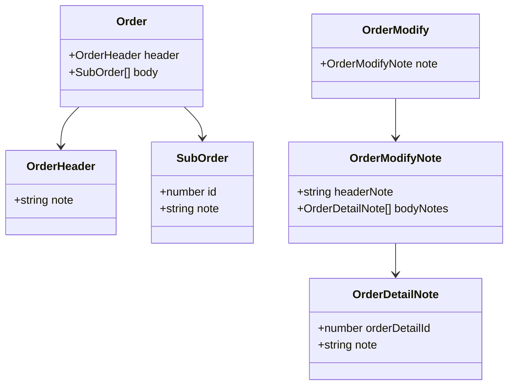
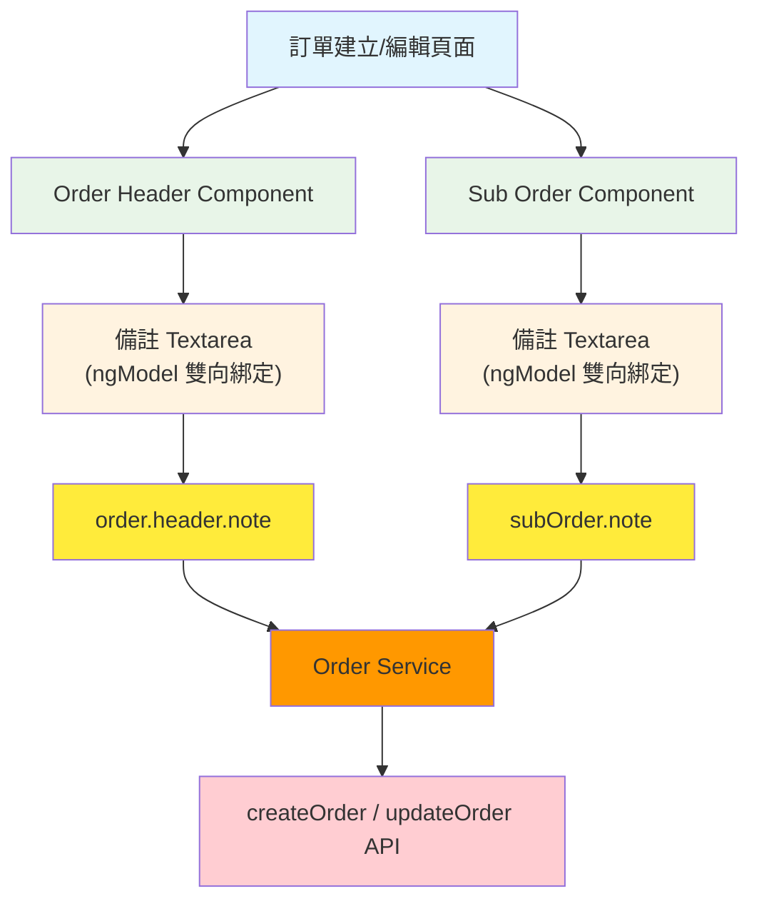
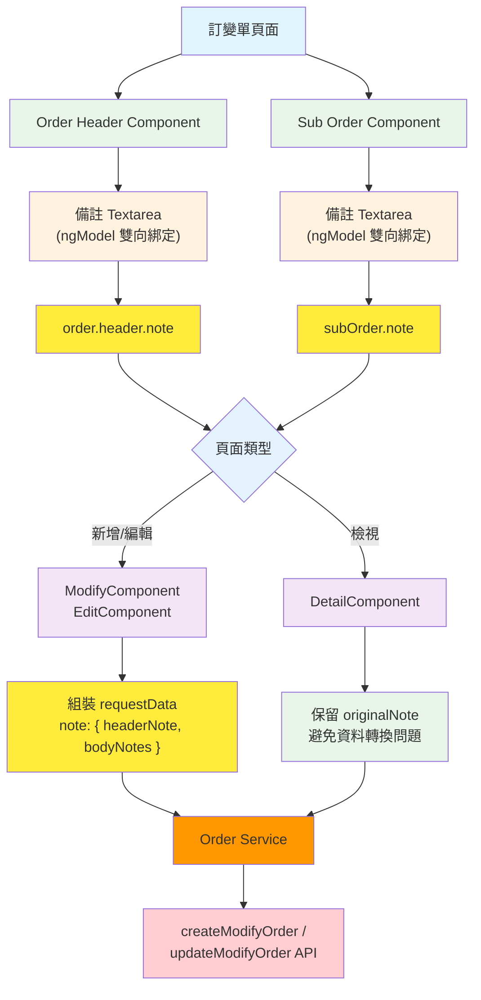
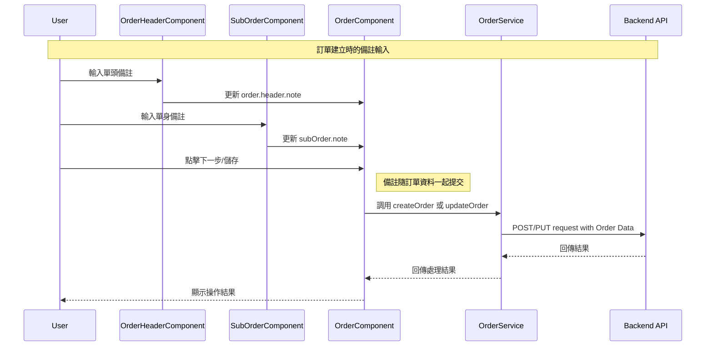
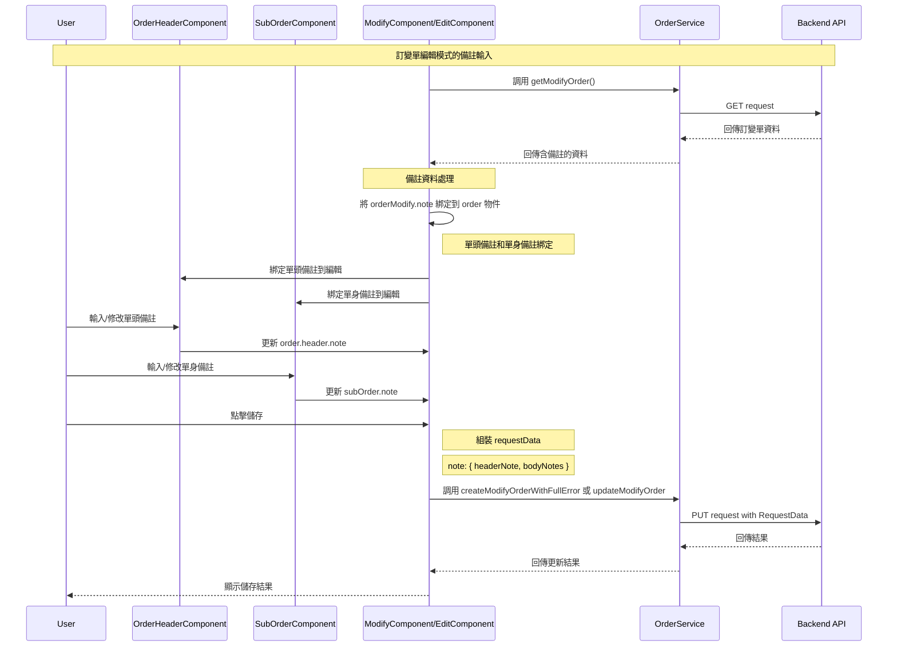
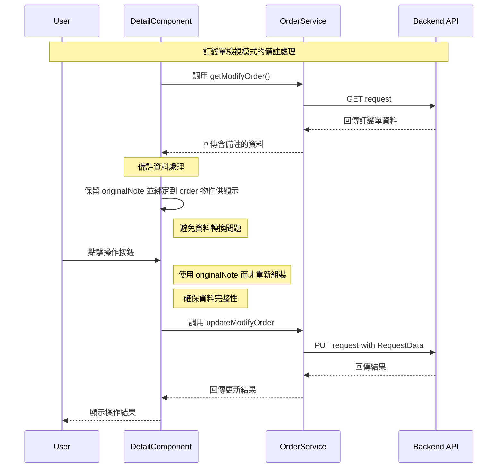

## 修訂紀錄

| **版本** | **日期** | **修訂者** | **修訂內容** |
| --- | --- | --- | --- |
| 1.0 | 2025/08/29 | Raelynn | 初版建立 |


## 相關Jira單：

* CMP-3415 新版訂單、訂變單：單頭、單身加上「備註」欄位 (前端)
* CMP-3414 訂單、訂變單：單頭、單身加上「備註」欄位 (後端)

## 目錄：

1. [目標](https://metaage-corp.atlassian.net/wiki/spaces/CMP/pages/34013407/SD_#1.-%E7%9B%AE%E6%A8%99)
2. [前端設計](https://metaage-corp.atlassian.net/wiki/spaces/CMP/pages/34013407/SD_#2.-%E5%89%8D%E7%AB%AF%E8%A8%AD%E8%A8%88)
   - 2.1 [UI 設計](https://metaage-corp.atlassian.net/wiki/spaces/CMP/pages/34013407/SD_#2.1-UI%E8%A8%AD%E8%A8%88)
   - 2.2 [實作架構設計](https://metaage-corp.atlassian.net/wiki/spaces/CMP/pages/34013407/SD_#2.2-%E5%AF%A6%E4%BD%9C%E6%9E%B6%E6%A7%8B%E8%A8%AD%E8%A8%88)
     - 2.2.1 [資料模型修改](https://metaage-corp.atlassian.net/wiki/spaces/CMP/pages/34013407/SD_#2.2.1-%E8%B3%87%E6%96%99%E6%A8%A1%E5%9E%8B%E4%BF%AE%E6%94%B9)
     - 2.2.2 [[訂單] 元件關係圖](https://metaage-corp.atlassian.net/wiki/spaces/CMP/pages/34013407/SD_#2.2.2-%5B%E8%A8%82%E5%96%AE%5D%E5%85%83%E4%BB%B6%E9%97%9C%E4%BF%82%E5%9C%96)
     - 2.2.3 [[訂變單] 元件關係圖](https://metaage-corp.atlassian.net/wiki/spaces/CMP/pages/34013407/SD_#2.2.3-%5B%E8%A8%82%E8%AE%8A%E5%96%AE%5D%E5%85%83%E4%BB%B6%E9%97%9C%E4%BF%82%E5%9C%96)
     - 2.2.4 [[訂單] 備註輸入流程](https://metaage-corp.atlassian.net/wiki/spaces/CMP/pages/34013407/SD_#2.2.4-%5B%E8%A8%82%E5%96%AE%5D%E5%82%99%E8%A8%BB%E8%BC%B8%E5%85%A5%E6%B5%81%E7%A8%8B)
     - 2.2.5 [[訂變單] 編輯模式備註輸入流程](https://metaage-corp.atlassian.net/wiki/spaces/CMP/pages/34013407/SD_#2.2.5-%5B%E8%A8%82%E8%AE%8A%E5%96%AE%5D%E7%B7%A8%E8%BC%AF%E6%A8%A1%E5%BC%8F%E5%82%99%E8%A8%BB%E8%BC%B8%E5%85%A5%E6%B5%81%E7%A8%8B)
     - 2.2.6 [[訂變單] 檢視模式備註處理流程](https://metaage-corp.atlassian.net/wiki/spaces/CMP/pages/34013407/SD_#2.2.6-%5B%E8%A8%82%E8%AE%8A%E5%96%AE%5D%E6%AA%A2%E8%A6%96%E6%A8%A1%E5%BC%8F%E5%82%99%E8%A8%BB%E8%99%95%E7%90%86%E6%B5%81%E7%A8%8B)
3. [實作細節](https://metaage-corp.atlassian.net/wiki/spaces/CMP/pages/34013407/SD_#3.-%E5%AF%A6%E4%BD%9C%E7%B4%B0%E7%AF%80)
   - 3.1 [orderService API 修改](https://metaage-corp.atlassian.net/wiki/spaces/CMP/pages/34013407/SD_#3.1-orderService%20API%E4%BF%AE%E6%94%B9)
   - 3.2 [訂單單頭、訂變單單頭 (編輯頁面)](https://metaage-corp.atlassian.net/wiki/spaces/CMP/pages/34013407/SD_#3.2-%E8%A8%82%E5%96%AE%E5%96%AE%E9%A0%AD%E3%80%81%E8%A8%82%E8%AE%8A%E5%96%AE%E5%96%AE%E9%A0%AD%20(%E7%B7%A8%E8%BC%AF%E9%A0%81%E9%9D%A2))
   - 3.3 [訂變單新增](https://metaage-corp.atlassian.net/wiki/spaces/CMP/pages/34013407/SD_#3.3-%E8%A8%82%E8%AE%8A%E5%96%AE%E6%96%B0%E5%A2%9E)
   - 3.4 [訂單單身、訂變單單身 (編輯頁面)](https://metaage-corp.atlassian.net/wiki/spaces/CMP/pages/34013407/SD_#3.4-%E8%A8%82%E5%96%AE%E5%96%AE%E8%BA%AB%E3%80%81%E8%A8%82%E8%AE%8A%E5%96%AE%E5%96%AE%E8%BA%AB%20(%E7%B7%A8%E8%BC%AF%E9%A0%81%E9%9D%A2))
   - 3.5 [訂變單 (編輯頁面)](https://metaage-corp.atlassian.net/wiki/spaces/CMP/pages/34013407/SD_#3.5-%E8%A8%82%E8%AE%8A%E5%96%AE%20(%E7%B7%A8%E8%BC%AF%E9%A0%81%E9%9D%A2))
   - 3.6 [訂變單 (檢視頁面)](https://metaage-corp.atlassian.net/wiki/spaces/CMP/pages/34013407/SD_#3.6-%E8%A8%82%E8%AE%8A%E5%96%AE%20(%E6%AA%A2%E8%A6%96%E9%A0%81%E9%9D%A2))
   - 3.7 [訂變單檢視頁面單身備註 pipe](https://metaage-corp.atlassian.net/wiki/spaces/CMP/pages/34013407/SD_#3.7-%E8%A8%82%E8%AE%8A%E5%96%AE%E6%AA%A2%E8%A6%96%E9%A0%81%E9%9D%A2%E5%96%AE%E8%BA%AB%E5%82%99%E8%A8%BB%20pipe)


## 1. 目標

本需求旨在為新版訂單（Order）和訂變單（Modify Order）系統的單頭（Header）和單身（Body）添加「備註」欄位，提供用戶更完善的訂單資訊記錄能力。

- 在訂單單頭新增備註欄位，允許用戶記錄整張訂單的相關備註資訊
- 在訂單單身（子單）新增備註欄位，允許用戶為每個子單記錄特定的備註資訊
- 在訂變單系統中支援備註欄位的修改與記錄
- 確保備註資訊在訂單流程中的完整保存與傳遞


## 2. 前端設計

### 2.1 UI 設計

### 2.2 實作架構設計

#### 2.2.1 資料模型修改

- **orders.ts 新增：**
  ```typescript
  export class OrderHeader {    
    /** 備註 */
    note: string = '';
  }
  ```
  ```typescript
  export class SubOrder {    
    /** 備註 */
    note: string = '';
  }
  ```

  ```typescript
  export class OrderModify {    
    /** 備註 */
    note: {
      headerNote: string;
      bodyNotes: [
        {
          orderDetailId: number;
          note: string;
        }
      ];
    };
  }
  ```

- **資料模型類別圖：**


#### 2.2.2 [訂單] 元件關係圖



#### 2.2.3 [訂變單] 元件關係圖



#### 2.2.4 [訂單] 備註輸入流程



#### 2.2.5 [訂變單] 編輯模式備註輸入流程



#### 2.2.6 [訂變單] 檢視模式備註處理流程




### 3. 實作細節

#### 3.1 orderService API 修改
- **order.service.ts**
  ```typescript
  updateModifyOrder(orderModifyId: string, data: any): Observable<ResponseData> {
    return this.api.put(this.gateway.order + `order/modify/${orderModifyId}`, new RequestData(data));
  }
  ```

#### 3.2 訂單單頭、訂變單單頭 (編輯頁面)
- **order-header.component.html**
  ```html
  <!-- 備註 -->
  <div nz-row class="custom-row">
    <div nz-col nzSpan="12">
      <nz-form-label class="font-weight-bold">{{ 'remark' | translate }}</nz-form-label>
      <nz-form-control>
        @if (!readOnly){
          <textarea rows="4" nz-input
                    placeholder="{{ 'please fill input' | translate:{ input: 'remark' | translate } }}"
                    [(ngModel)]="order.header.note"></textarea>
        } @else {
          {{ order.header.note }}
        }
      </nz-form-control>
    </div>
  </div>
  ```

#### 3.3 訂變單新增
- **orders/modify.component.ts**
  ```typescript
  /** API: 新增訂變單 */
  createModifyOrder(step: ModifyButtonStep) {
    this.prepareModifyOrder(this.order, this.oriOrder);
    this.ui.isLoading = true;
    const requestData = {
      order: this.order,
      step,
      modifyReason: this.order.header.modifyReason,
      note: {
        headerNote: this.order.header.note,
        bodyNotes: this.order.body.map(b => ({ orderDetailId: b.id, note: b.note })),
      },

      // 當 uploadEventIds 有值時，會展開 { uploadEventIds: 值 } 加進 data
      ...(this.uploadEventIds && { uploadEventIds: this.uploadEventIds })
    }
    
    this.orderSvc.createModifyOrderWithFullError(this.order.header.id, requestData).subscribe({
      // ...handle response...
    });
  }
  ```

#### 3.4 訂單單身、訂變單單身 (編輯頁面)
- **orders/sub-order.component.html**
  ```html
  <!-- 備註 -->
  <div nz-row class="custom-row">
    <div nz-col nzSpan="12">
      <nz-form-label class="font-weight-bold">{{ 'remark' | translate }}</nz-form-label>
      <nz-form-control>
        @if (!readOnly){
          <textarea rows="4" nz-input
                    [(ngModel)]="subOrder.note"
                    [placeholder]="'please fill input' | translate: {input: ('remark' | translate)}"></textarea>
        } @else {
          {{ subOrder.note }}
        }
      </nz-form-control>
    </div>
  </div>
  ```

#### 3.5 訂變單 (編輯頁面)
- **modification/edit.component.ts**
  ```typescript
  /** API: 取得訂變單資訊 */
  getModifyOrder() {
    this.ui.isLoading = true;
    this.orderSvc.getModifyOrder(this.orderId).subscribe({
      next: (res) => {
        // ...existing code...
        if (res && res.data && res.info && res.info.success) {
          this.order = res.data.order;
          this.order.header.modifyReason = res.data.orderModify.modifyReason;

          // 備註 - 從訂變單資料綁定到 order 物件
          this.order.header.note = res.data.orderModify.note.headerNote || '';
          this.order.body.forEach(b => {
            const bodyNote = res.data.orderModify.note.bodyNotes.find((n: { orderDetailId: string; }) => n.orderDetailId === b.id);
            b.note = bodyNote ? bodyNote.note : '';
          });

          this.oriOrder = _.cloneDeep(this.order);
          this.orderModify = res.data.orderModify;
        }
      }
    });
  }

  updateOrder(step: ModifyButtonStep, order: Order, rejectReason?: string) {
    // ...existing code...
    
    const { modifyReason, filterAttribute, ...headerWithoutExtras } = order.header;
    const bodyWithoutFilterAttr = order.body.map(({ filterAttribute, ...rest }: any) => rest);
    
    const requestData = {
      order: {
        ...order,
        header: headerWithoutExtras,
        body: bodyWithoutFilterAttr
      },
      step,
      rejectReason: step === ModifyButtonStep.previous ? rejectReason : undefined,
      modifyReason,
      note: {
        headerNote: order.header.note || '',
        bodyNotes: order.body.map(b => ({
          orderDetailId: b.id,
          note: b.note || ''
        }))
      }
    };
    
    this.orderSvc.updateModifyOrder(this.orderModify.id, requestData).subscribe({
      // ...handle response...
    });
  }
  ```

#### 3.6 訂變單 (檢視頁面)
- **modification/detail.component.html**
  ```html
  <!-- 單頭備註顯示 -->
  <nz-descriptions-item [nzSpan]="2"
                        [nzTitle]="'remark' | translate">
    <div>{{ orderModify.note!.headerNote || '' }}</div>
  </nz-descriptions-item>
  ```
  </br>

- **modification/detail.component.ts**
  ```typescript
  export class DetailComponent extends DataTool implements OnInit {
    /** 原始備註資料 */
    originalNote: any;

    /** API: 取得訂變單資訊 */
    getModifyOrder() {
      this.ui.isLoading = true;
      this.orderSvc.getModifyOrder(this.orderId).subscribe({
        next: (res) => {
          // ...existing code...
          if (res && res.data && res.info && res.info.success) {
            this.order = res.data.order;
            this.orderModify = res.data.orderModify;

            // 保留原始備註資料
            this.originalNote = res.data.orderModify.note || {
              headerNote: '',
              bodyNotes: []
            };

            // 備註 - 從原始資料綁定到 order 物件
            this.order.header.note = this.originalNote.headerNote || '';
            this.order.body.forEach(b => {
              const bodyNote = this.originalNote.bodyNotes.find((n: { orderDetailId: string; }) => n.orderDetailId === b.id);
              b.note = bodyNote ? bodyNote.note : '';
            });
          }
        }
      });
    }

    updateOrder(step: ModifyButtonStep, needUpload: boolean, rejectReason?: string) {
      // ...existing code...
      
      const requestData = {
        order: {
          ...this.orderOri,
          header: headerWithoutExtras,
          body: bodyWithoutFilterAttr
        },
        step,
        rejectReason: step === ModifyButtonStep.previous ? rejectReason : undefined,
        modifyReason,
        note: this.originalNote // 將 note 資料綁定回傳
      };
      
      this.orderSvc.updateModifyOrder(this.orderModify.id, requestData).subscribe({
        // ...handle response...
      });
    }
  }
  ```
  </br>

- **modification/detail/sub-order.component.html**
  ```html
  <!-- 舊有子單備註顯示 -->
  <nz-descriptions-item [nzSpan]="2" [nzTitle]="'remark' | translate">
    <div>{{ orderModify.note | subOrderNote : subOrder.id }}</div>
  </nz-descriptions-item>

  <!-- 新增子單備註顯示 -->
  <nz-descriptions-item [nzSpan]="2" [nzTitle]="'remark' | translate">
    <div>{{ orderModify.note | subOrderNote : subOrder.id }}</div>
  </nz-descriptions-item>
  ```

#### 3.7 訂變單檢視頁面單身備註 pipe
- **SubOrderNotePipe**
  為了避免模板中重複調用函數造成效能問題，建立了專用的 pure pipe：
  ```typescript
  transform(orderModifyNote: any, subOrderId: string): string {
    if (!orderModifyNote?.bodyNotes || !subOrderId) {
      return '';
    }

    const bodyNote = orderModifyNote.bodyNotes.find(
      (note: { orderDetailId: number; note: string }) =>
        note.orderDetailId.toString() === subOrderId
    );

    return bodyNote ? bodyNote.note : '';
  }
  ```
</br>

- **modification.module.ts**
  ```typescript
  @NgModule({
    declarations: [
      SubOrderNotePipe,
    ],
  })
  ```
