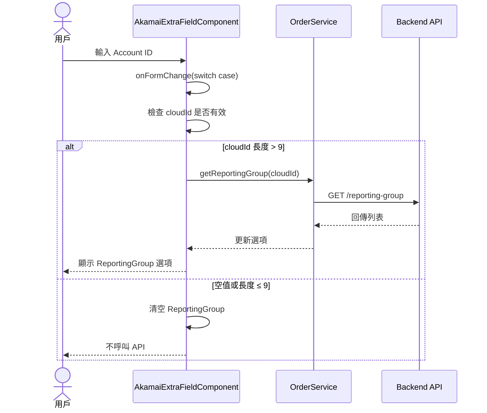

## 修訂紀錄
| **版本** | **日期** | **修訂內容** | **修訂者** | 
| --- | --- | --- | --- |
| 1.0 | 2025-10-28 | 初版 | Raelynn |

## 相關Jira單
- CMP-3903 訂單及訂變單：Akamai調整子公司必填欄位判斷邏輯（前端）
- CMP-3817 訂單及訂變單：Akamai調整子公司必填欄位判斷邏輯（後端）

## 目錄
1. 目標
2. 需求說明
3. 序列圖
4. 實作細節
   - 4.1 影響範圍
   - 4.2 程式碼修改說明


## 1. 目標

調整 Akamai 訂單及訂變單的前端邏輯，當 Account ID 為空值或無效值時，避免觸發 ReportingGroup API 查詢，防止產生錯誤訊息。

## 2. 需求說明

### 2.1 背景
- **前端需求（CMP-3903）**：Akamai 訂單、訂單變更單在子公司的全部流程中 Account ID 為「非必填」，僅母公司在「PM 審核」階段才需卡控必填，當 Account ID 為非必填時可為空值，因此在該值為空時不觸發 ReportingGroup 查詢 API，避免產生錯誤訊息

### 2.2 核心需求

#### 2.2.1 API 呼叫條件調整（本次實作重點）
- 當 Account ID 為**空值**或**長度不足**時，不呼叫 `getReportingGroup()` API
- 避免因空值或無效值觸發 API 而產生不必要的錯誤訊息
- 當 Account ID 變更時，清空 ReportingGroup 欄位的值

## 3. 前端設計
### 3.1 序列圖



## 4. 實作細節

### 4.1 影響範圍

- **主要元件**：`AkamaiExtraFieldComponent`
- **檔案位置**：`src/app/orders/sub-order/extra-field/akamai/akamai-extra-field.component.ts`
- **修改方法**：
  - `setAttribute()` - 載入資料時的條件判斷
  - `onFormChange()` - 表單變更時的邏輯處理

### 4.2 程式碼修改說明

#### 4.2.1 setAttribute() 方法修改

**目的**：在載入資料時，判斷是否應該呼叫 `getReportingGroup()` API


**修改說明**：
1. 新增 `reportingGroup[0].value.length` 檢查，確保 ReportingGroup 有值
2. **新增 `this.subOrder.cloudId` 檢查，確保 Account ID 不為空**
3. 避免在 Account ID 為空時呼叫 API 造成錯誤

**修改前**：
```typescript
if (this.permission.flat['order-v1.getAkamaiCustomer'] && reportingGroup[0].value) {
  this.getReportingGroup(this.subOrder.cloudId);
}
```

**修改後**：
```typescript
if (this.permission.flat['order-v1.getAkamaiCustomer'] &&
    reportingGroup[0].value && reportingGroup[0].value.length &&
    this.subOrder.cloudId) {
  this.getReportingGroup(this.subOrder.cloudId);
}
```

---

#### 4.2.2 onFormChange() 方法重構

**目的**：將多個 if 判斷重構為 switch case 結構，提升可讀性與維護性

**修改說明**：

1. **改用 switch case 結構**：
   - 更清晰的邏輯分支
   - 易於維護和擴展
   - 未來新增其他欄位處理更容易

2. **cloudId (Account ID) case**：
   - **新增：清空 ReportingGroup 的值和選項**
   - 只有當 cloudId 長度 > 9 時才呼叫 `getReportingGroup()` API
   - 防止空值或短值觸發 API 錯誤

3. **提前初始化 extra 物件**：
   - 避免在各個 case 中重複檢查

**修改後**：
```typescript
onFormChange(e: { filterAttribute: FilterAttribute[], internalVariableName: string, value: any }) {
  this.subOrder.isChange = true;
  this.updateValidationError(e);

  // 確保 extra 物件存在
  if (!this.subOrder.originalInfo['extra']) {
    this.subOrder.originalInfo['extra'] = {};
  }

  switch (e.internalVariableName) {
    case 'cloudId':
      // 清空 ReportingGroup
      this.filterAttribute.filter(f => f.internalVariableName === 'originalInfo.usageType')
        .forEach(f => {
          f.value = [];
        });
      this.subOrder.originalInfo['usageType'] = [];

      // 如果 cloudId 長度大於 9，取得 ReportingGroup
      if (e.value && e.value.length > 9) {
        this.getReportingGroup(e.value);
      }
      break;

    case 'originalInfo.extra.accountName':
    case 'originalInfo.extra.token':
      // 如果 accountName 或 token 被清空，需要清除驗證結果、公司名稱、isVerify
      if (e.value === '' || !e.value) {
        this.linodeVerifyResult = '';
        this.linodeFilterAttribute.filter(f => f.internalVariableName === 'originalInfo.extra.companyName')
          .forEach(f => f.value = '');
        this.subOrder.originalInfo['extra'].isVerify = null;
        this.subOrder.originalInfo['extra'].companyName = null;
      }
      break;

    default:
      // 其他欄位不需要特別處理
      break;
  }

  this.scanDataSvc.setValue(this.subOrder, e.value, e.internalVariableName.split('.'));
}
```
