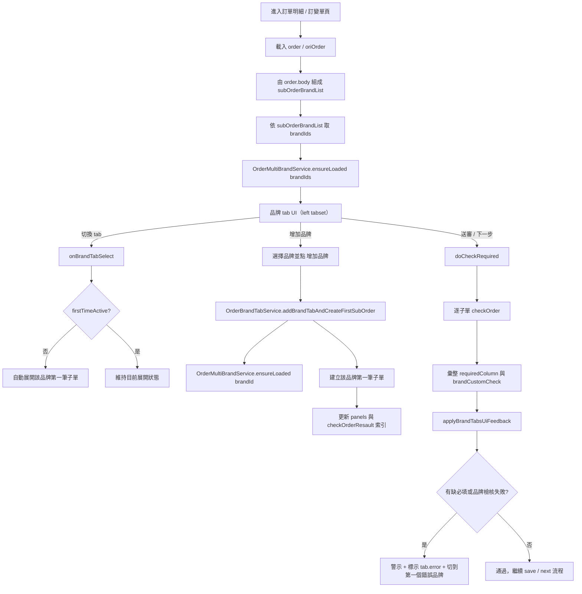
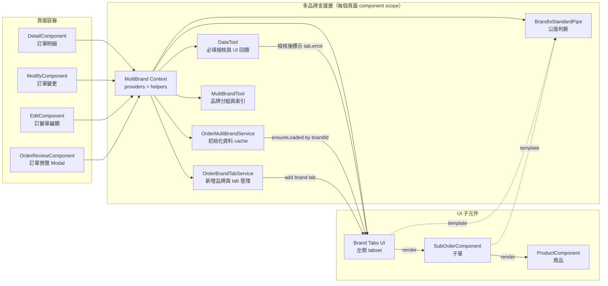
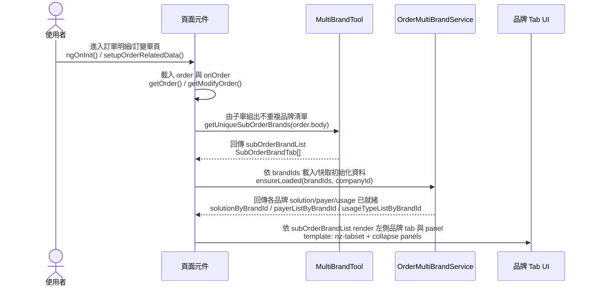
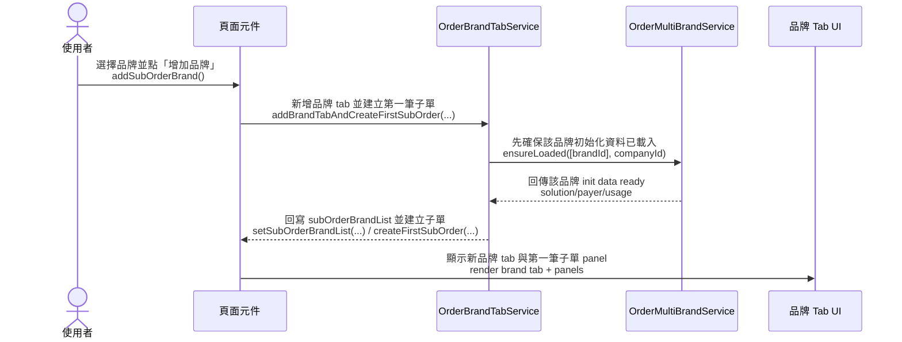
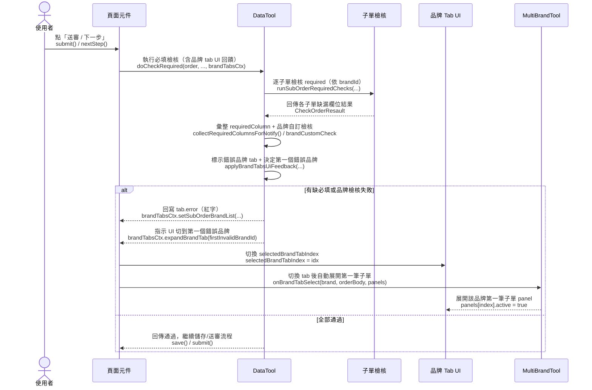

## 修訂紀錄

| **版本** | **日期** | **修訂內容** | **修訂者** |
| --- | --- | --- | --- |
| v1.0 | 2026-02-11 | 初始化文件 | Raelynn |

## 相關Jira單：

* CMP-4017 無訂單出貨單：多個雲產品線需要同一張312訂單 - 訂單修改
* CMP-4043 無訂單出貨單：多個雲產品線需要同一張312訂單 - 訂單修改 (後端)

## 目錄：

1. 目標
2. 功能需求
3. 實作架構設計
   * 3.1 系統流程圖
   * 3.2 元件關係圖
   * 3.3 序列圖
   * 3.4 核心資料結構
   * 3.5 多品牌工具與服務
   * 3.6 UI/互動
4. 實作

## 1. 目標
現行系統設計為「一張訂單 = 一個品牌」，當客戶需要同時採購多個雲產品線（如 Microsoft + Cisco）時，必須分別建立多張訂單。

## 2. 功能需求
1. 一張訂單（Order）可同時包含多個品牌（Brand）的子單（SubOrder）。
2. 子單以「品牌 tab」進行分組瀏覽：
    - 每個品牌一個 tab
    - tab 內容只顯示該品牌底下的子單
3. 支援「增加品牌」：
    - 使用 brand select 選擇尚未出現在子單中的品牌
    - 新增品牌 tab 後，需能建立該品牌的第一筆子單
4. 支援「刪除子單」後的品牌 tab 清理：
    - 當某品牌最後一筆子單被刪除時，該品牌 tab 需自動消失
    - 避免 tab index 越界（自動校正到最後一個）
5. 多品牌初始化資料（solution / payerList / usageTypeList）需以 brandId 分開快取與載入狀態管理。
6. 必填檢核（nextStep required fields）需支援「多品牌 by brandId」：
    - API 回傳 requiredFields（以 brandId 為 key）
    - 檢核、提示欄位翻譯需依子單品牌判斷
7. 多品牌檢核的 UI 回饋：
    - 當某品牌底下有任一子單缺必填，該品牌 tab 需標示錯誤（紅字）
    - 送審時自動切換並展開第一個錯誤品牌（僅 UI 回饋，不影響原本檢核判斷）
8. 採購審核（reviewPurchase）狀態需隱藏新增商品按鈕（避免流程中新增商品）。

## 3. 實作架構設計
### 3.1 系統流程圖

> 本章以「訂單明細 / 訂變單」共用的多品牌流程為主，示意 UI 操作與資料載入/檢核之間的互動。



### 3.2 元件關係圖

> 以 Orders 模組為核心，訂單明細、訂單預覽、訂變單等畫面共用相同的多品牌工具/服務。



### 3.3 序列圖

> 依情境拆為三張序列圖：進到頁面且已存在多品牌、增加品牌、送審/下一步必填檢核（含錯誤品牌 tab 自動切換與展開）。

#### 3.3.1 進到頁面且已存在多品牌



#### 3.3.2 新增品牌



#### 3.3.3 送審/下一步必填檢核



### 3.4 核心資料結構
- `Order.body: SubOrder[]`：子單同時保留 `brandId` 與 `brand: Brand`（便於舊邏輯相容 + 多品牌 UI）。
- `BaseStep.requiredFields?: RequiredFieldsByBrandId`：多品牌必填欄位 map（key=brandId）。
- `SubOrderBrandTab extends Brand`：品牌 tab model，新增 `firstTimeActive` 與 `error` 以支援初次自動展開與錯誤標示。

### 3.5 多品牌工具與服務
- `MultiBrandTool`：
   - 由 `order.body` 組成不重複的品牌清單
   - 依 brandId 取得子單 index（保持與 panels/checkOrderResault 索引一致）
   - 提供穩定的 trackKey（避免新增/刪除/切換時 Angular 重建造成 UI 抖動）
   - 處理品牌 tab 初次點擊時自動展開第一筆子單

- `OrderMultiBrandService`（每個 component 透過 `providers` 建立獨立 instance）：
   - 以 brandId 分開快取 solution/payer/usage 清單
   - 管理每個品牌的載入狀態（unloaded/loading/loaded/failed）
   - 提供 `ensureLoaded` 與 `ensureLoadedAndWait` 統一載入行為

- `OrderBrandTabService`（每個 component 透過 `providers` 建立獨立 instance）：
   - 統一處理「新增品牌 tab」與 brand select disabled（避免同品牌重複新增）
   - 子單刪除後 tab index normalize，避免越界

### 3.6 UI/互動
- 訂單明細 / 訂變單頁面：
   - 上方提供「增加品牌」select + button
   - 左側 `nz-tabset` 依 `subOrderBrandList` 產生品牌 tab
   - 每個品牌 tab 內顯示該品牌的子單 collapse panel
   - 若檢核失敗，tab label 以 `.error` 樣式標示

## 4. 實作
### 4.1 變更檔案清單（依目錄）
#### src/app/core/models/
- `src/app/core/models/orders.ts`
- `src/app/core/models/brands.ts`

#### src/app/orders/model/
- `src/app/orders/model/data-tool.component.ts`
- `src/app/orders/model/multi-brand-tool.ts`

#### src/app/orders/services/
- `src/app/orders/services/order-brand-map.service.ts`（由 store 重構/更名而來）
- `src/app/orders/services/order-brand-tab.service.ts`

#### src/app/orders/pipes/
- `src/app/orders/pipes/brand-is-standard.pipe.ts`

#### src/app/orders/detail/
- `src/app/orders/detail/detail.component.html`
- `src/app/orders/detail/detail.component.scss`
- `src/app/orders/detail/detail.component.ts`
- `src/app/orders/detail/order-header/order-header.component.ts`
- `src/app/orders/detail/order-review/order-review.component.html`
- `src/app/orders/detail/order-review/order-review.component.scss`
- `src/app/orders/detail/order-review/order-review.component.ts`
- `src/app/orders/detail/order-transform/order-transform.component.ts`

#### src/app/orders/modify/
- `src/app/orders/modify/modify.component.html`
- `src/app/orders/modify/modify.component.scss`
- `src/app/orders/modify/modify.component.ts`

#### src/app/orders/sub-order/
- `src/app/orders/sub-order/sub-order.component.ts`
- `src/app/orders/sub-order/products/product.component.html`
- `src/app/orders/sub-order/products/product.component.ts`

#### src/app/orders/
- `src/app/orders/orders.module.ts`

#### src/app/modification/
- `src/app/modification/detail/detail.component.html`
- `src/app/modification/detail/detail.component.scss`
- `src/app/modification/detail/detail.component.ts`
- `src/app/modification/detail/sub-order/sub-order.component.ts`
- `src/app/modification/edit/edit.component.html`
- `src/app/modification/edit/edit.component.scss`
- `src/app/modification/edit/edit.component.ts`
- `src/app/modification/modification.component.ts`
- `src/app/modification/upload-proof/upload-proof.component.ts`

#### src/app/brand/
- `src/app/brand/brand.component.ts`

#### src/assets/i18n/
- `src/assets/i18n/zh-tw.json`

### 4.2 實作細節

#### 4.2.1 Model：多品牌必填欄位與品牌 tab model
**src/app/core/models/orders.ts**（多品牌必填欄位）
```ts
/** nextStep 必填欄位（以 brandId 作為 key） */
export type RequiredFieldsByBrandId = Record<string, RequiredFieldGroup>; // 🔸 支援多品牌 required fields

export class BaseStep {
   currentStatus!: ApprovalStatus | ModifyOrderStatus;

   /** API 回傳多品牌必填欄位，以 brandId 作為 key */
   requiredFields?: RequiredFieldsByBrandId; // 🔸 依 brandId 分組的必填欄位

   requiredField: RequiredFieldGroup = {
      header: [],
      body: [],
      product: [],
   };
}
```

**src/app/core/models/brands.ts**（品牌 tab model）
```ts
export interface SubOrderBrandTab extends Brand {
   /** 是否為第一次啟用/展開 */
   firstTimeActive: boolean; // 🔸 品牌 tab 初次切換自動展開

   /** 品牌檢核是否有錯誤 */
   error?: boolean; // 🔸 送審檢核後的 UI 錯誤標示
}
```

#### 4.2.2 Tool：子單分品牌索引與穩定 trackKey
**src/app/orders/model/multi-brand-tool.ts**
```ts
import _ from 'lodash';
import { Filter, Comparator } from '@metaage/metaage-ant-desing';
import { Observable, of } from 'rxjs';
import { map, catchError } from 'rxjs/operators';
import { BrandService } from 'src/app/share/services/brand.service';
import { Brand, SubOrderBrandTab } from 'src/app/core/models/brands';
import { SubOrder } from 'src/app/core/models/orders';
import { Panels } from 'src/app/core/models/orders';
import { Injectable } from '@angular/core';

@Injectable({ providedIn: 'root' })
export class MultiBrandTool {
   /**
    * 組成不重複的子單品牌清單
    * @param orderBody 訂單子單
    */
   public getUniqueSubOrderBrands(orderBody: SubOrder[] | null | undefined): SubOrderBrandTab[] {
      return _.uniqBy(
         (orderBody || [])
            .map((b) => b?.brand)
            .filter((b): b is Brand => !!b && !!b.id),
         'id'
      ).map((b) => ({
         ...b,
         firstTimeActive: false,
      }));
   }

   /**
    * 取得指定品牌(tab)底下的子單 index，保持與 panels/checkOrderResault 的索引一致
    * @param orderBody 訂單子單
    * @param brandId 品牌 id
    */
   public getSubOrderIndexesByBrand(orderBody: SubOrder[] | null | undefined, brandId: string): number[] {
      if (!brandId) { return []; }
      return (orderBody || [])
         .map((subOrder, idx) => ({ subOrder, idx }))
         .filter(({ subOrder }) => (subOrder?.brandId || subOrder?.brand?.id) === brandId)
         .map(({ idx }) => idx);
   }

   /**
    * 品牌 tab 被選取
    * - 若該品牌 firstTimeActive=false，且該品牌第一筆子單尚未展開，則自動展開
    * - 選取後將 firstTimeActive 設為 true
    */
   public onBrandTabSelect(
      brand: SubOrderBrandTab,
      orderBody: SubOrder[] | null | undefined,
      panels: Panels[] | null | undefined,
   ): void {
      if (!brand) return;

      if (!brand.firstTimeActive) {
         const indexes = this.getSubOrderIndexesByBrand(orderBody, brand.id);
         const firstIndex = indexes[0];

         if (firstIndex !== undefined && panels?.[firstIndex] && !panels[firstIndex].active) {
            panels[firstIndex].active = true;
            panels[firstIndex].alreadyOpen = true;
         }

         brand.firstTimeActive = true;
      }
   }

   /**
    * 取得啟用中的品牌清單
    * @param brandSvc BrandService
    */
   public getEnabledBrandList(brandSvc: BrandService): Observable<Brand[]> {
      const brandFilter = new Filter({
         and: [{ field: 'status', comparator: Comparator.equal, value: 'enable' }],
         pageSize: -1
      });

      return brandSvc.getBrandList(brandFilter).pipe(
         map((res: any) => {
            if (res && res.data && res.info && res.info.success) {
               return res.data as Brand[];
            }
            return [];
         }),
         catchError((err) => {
            console.error('[get-brand-list]', err);
            return of([] as Brand[]);
         })
      );
   }

   /**
    * 提供 template 用的穩定 track key：優先用後端 id，否則使用已建立的 trackKey 或建立一個暫時的 trackKey
    */
   public getSubOrderTrackKey(subOrder?: SubOrder | null | undefined, index?: number): string | number {
      // 刪除/切換時 reconcile 過程可能短暫拿到 undefined；這裡回傳穩定 fallback，避免每次計算不同 key 造成重建
      if (!subOrder) return index != null ? `subOrder-idx-${index}` : 'subOrder-empty';

      this.ensureSubOrderTrackKey(subOrder);
      return (subOrder as any).trackKey ?? (index != null ? `subOrder-idx-${index}` : '');
   }

   /**
    * 確保單筆 subOrder 有穩定的 trackKey（一次性寫入物件上）
    * 優先使用後端 id，若沒有則建立一個臨時的 trackKey。
    * 這個方法會直接在 subOrder 物件上設定 `trackKey` 屬性，template 可直接使用該屬性。
    */
   public ensureSubOrderTrackKey(subOrder?: SubOrder | null | undefined): void {
      if (!subOrder) return;
      const anyOrder = subOrder as any;
      if (anyOrder.trackKey) return; // 已有則跳過

      // 優先使用後端 id（若存在），否則建立一個暫時的 trackKey
      anyOrder.trackKey = subOrder.id ? String(subOrder.id) : (globalThis.crypto?.randomUUID?.() ?? `tk_${Date.now()}_${Math.random().toString(36).slice(2,8)}`);
   }

   /**
    * 對整個 orderBody 列表一次性確保每筆 subOrder 都有 trackKey
    */
   public ensureTrackKeysForList(orderBody?: SubOrder[] | null | undefined): void {
      (orderBody || []).forEach((so) => this.ensureSubOrderTrackKey(so));
   }
}
```

#### 4.2.3 Service：多品牌初始化資料載入與品牌 tab 管理
**src/app/orders/services/order-brand-map.service.ts**
```ts
import { Injectable, signal } from '@angular/core';
import { Comparator, Filter, Sort } from '@metaage/metaage-ant-desing';
import { forkJoin, of } from 'rxjs';
import { catchError, map } from 'rxjs/operators';
import { BrandService } from 'src/app/share/services/brand.service';
import { environment } from 'src/environments/environment';
import { PayerId, Solution } from 'src/app/core/models/orders';

export type BrandDataLoadState = 'unloaded' | 'loading' | 'loaded' | 'failed';

/**
 * 每個 component 各自 new 一個 instance（透過 providers）以避免交互汙染。
 *
 * 用途：統一管理「依 brandId 載入」的 solution / payerList / usageTypeList，並做快取與載入狀態。
 */
@Injectable()
export class OrderMultiBrandService {
   /** 方案 / payer / usage 列表（多品牌 by brandId） */
   readonly solutionByBrandId = signal<Record<string, Solution[]>>({});
   readonly payerListByBrandId = signal<Record<string, PayerId[]>>({});
   readonly usageTypeListByBrandId = signal<Record<string, string[]>>({});

   /** 依品牌載入狀態 */
   readonly brandDataLoadStateByBrandId = signal<Record<string, BrandDataLoadState>>({});

   private readonly configBrandId = environment['brandId'] as Record<string, string>;

   constructor(private brandsSvc: BrandService) {}

   /**
    * 讓外部（component）在「已經有完整資料」的情境（如從 state 帶入）先灌入 store。
    * 會同時把 loadState 設為 loaded。
    */
   dataFromState(params: {
      solutionByBrandId?: Record<string, Solution[]>;
      payerListByBrandId?: Record<string, PayerId[]>;
      usageTypeListByBrandId?: Record<string, string[]>;
   }) {
      const solution = params.solutionByBrandId ?? {};
      const payer = params.payerListByBrandId ?? {};
      const usage = params.usageTypeListByBrandId ?? {};

      this.solutionByBrandId.set(solution);
      this.payerListByBrandId.set(payer);
      this.usageTypeListByBrandId.set(usage);

      const states: Record<string, BrandDataLoadState> = {};
      for (const k of new Set([...Object.keys(solution), ...Object.keys(payer), ...Object.keys(usage)])) {
         states[k] = 'loaded';
      }
      this.brandDataLoadStateByBrandId.update((prev) => ({ ...prev, ...states }));
   }

   /**
    * 依 brandIds 載入一次（已 loaded/loading 會略過；failed 允許重試）。
    */
   ensureLoaded(brandIds: Array<string | null | undefined>, companyId: string | null | undefined) {
      const ids = Array.from(new Set(brandIds.filter((id): id is string => !!id)));
      if (ids.length === 0) return;

      const current = this.brandDataLoadStateByBrandId();

      for (const brandId of ids) {
         const state = current[brandId] ?? 'unloaded';
         if (state === 'loaded' || state === 'loading') continue;

         this.brandDataLoadStateByBrandId.update((prev) => ({ ...prev, [brandId]: 'loading' }));

         this.loadBrandInitData(brandId, companyId).subscribe({
            next: ({ solution, payerList, usageTypeList }) => {
               this.solutionByBrandId.update((prev) => ({ ...prev, [brandId]: solution }));
               this.payerListByBrandId.update((prev) => ({ ...prev, [brandId]: payerList }));
               this.usageTypeListByBrandId.update((prev) => ({ ...prev, [brandId]: usageTypeList }));
               this.brandDataLoadStateByBrandId.update((prev) => ({ ...prev, [brandId]: 'loaded' }));
            },
            error: (err: unknown) => {
               console.error('[OrderMultiBrandService.ensureLoaded]', brandId, err);
               this.brandDataLoadStateByBrandId.update((prev) => ({ ...prev, [brandId]: 'failed' }));
            }
         });
      }
   }

   /** 方便 template 直接取值（未載入則回空陣列） */
   getSolutionList(brandId: string | null | undefined): Solution[] {
      if (!brandId) return [];
      return this.solutionByBrandId()[brandId] ?? [];
   }
   getPayerList(brandId: string | null | undefined): PayerId[] {
      if (!brandId) return [];
      return this.payerListByBrandId()[brandId] ?? [];
   }
   getUsageTypeList(brandId: string | null | undefined): string[] {
      if (!brandId) return [];
      return this.usageTypeListByBrandId()[brandId] ?? [];
   }

   /**
    * 取得啟用中的方案列表
    * - companyId 若有則以 crmCustomerId 篩選
    */
   getSolutionListApi(brandId: string, companyId: string | null | undefined) {
      const filter = new Filter();
      filter.sort['modifyDate'] = Sort.desc;
      if (companyId) {
         filter.and.push(
            { field: 'crmCustomerId', comparator: Comparator.equal, value: companyId },
            { field: 'status', comparator: Comparator.equal, value: 'enable' }
         );
      } else {
         filter.and.push({ field: 'status', comparator: Comparator.equal, value: 'enable' });
      }

      return this.brandsSvc.getSolutionList(brandId, filter).pipe(
         map((res: any) => (res?.info?.success && Array.isArray(res?.data)) ? (res.data as Solution[]) : []),
         catchError((err: unknown) => {
            console.error('[OrderMultiBrandService.getSolutionList]', err);
            return of([] as Solution[]);
         })
      );
   }

   /** 取得 payer 列表（AWS/Google 才需要） */
   fetchPayerList(brandId: string) {
      const filter = new Filter();
      filter.pageSize = -1;
      return this.brandsSvc.getPayerList(brandId, filter).pipe(
         map((res: any) => (res?.info?.success && Array.isArray(res?.data)) ? (res.data as PayerId[]) : []),
         catchError((err: unknown) => {
            console.error('[OrderMultiBrandService.fetchPayerList]', err);
            return of([] as PayerId[]);
         })
      );
   }

   /** 取得 usage type（AWS 才需要） */
   fetchUsageTypeList(brandId: string) {
      return this.brandsSvc.getUsageType(brandId).pipe(
         map((res: any) => (res?.info?.success && Array.isArray(res?.data)) ? (res.data as string[]).slice().sort() : []),
         catchError((err: unknown) => {
            console.error('[OrderMultiBrandService.fetchUsageTypeList]', err);
            return of([] as string[]);
         })
      );
   }

   /**
    * 單一品牌初始化資料（行為對齊原 DataTool.initializeOrderData）
    */
   initializeOrderData(brandId: string, companyId: string | null | undefined) {
      const solution$ = this.getSolutionListApi(brandId, companyId);

      // 根據品牌決定是否載入 payer list
      const needPayerList = brandId === this.configBrandId['AWS'] || brandId === this.configBrandId['Google'];
      const payerList$ = needPayerList ? this.fetchPayerList(brandId) : of([] as PayerId[]);

      // 根據品牌決定是否載入 usage type list
      const needUsageTypeList = brandId === this.configBrandId['AWS'];
      const usageTypeList$ = needUsageTypeList ? this.fetchUsageTypeList(brandId) : of([] as string[]);

      return forkJoin({ solution: solution$, payerList: payerList$, usageTypeList: usageTypeList$ });
   }

   private loadBrandInitData(brandId: string, companyId: string | null | undefined) {
      return this.initializeOrderData(brandId, companyId);
   }

   /**
    * 依 brandId 取得載入狀態（未出現在 map 視為 unloaded）
    */
   getBrandLoadState(brandId: string | null | undefined): BrandDataLoadState {
      if (!brandId) return 'unloaded';
      return this.brandDataLoadStateByBrandId()[brandId] ?? 'unloaded';
   }

   /**
    * 確保資料已載入，並回傳一個 Promise：
    * - resolve: 指定 brandId 全部進入 loaded
    * - reject: timeout 或載入失敗（failed）
    */
   async ensureLoadedAndWait(
      brandIds: Array<string | null | undefined>,
      companyId: string | null | undefined,
      opts?: { timeoutMs?: number; pollMs?: number }
   ): Promise<void> {
      const ids = Array.from(new Set(brandIds.filter((id): id is string => !!id)));
      if (ids.length === 0) return;

      this.ensureLoaded(ids, companyId);

      const timeoutMs = opts?.timeoutMs ?? 15000;
      const pollMs = opts?.pollMs ?? 50;
      const start = Date.now();

      // 簡單輪詢：避免在 component-side 自己寫定時器/訂閱
      while (true) {
         const stateMap = this.brandDataLoadStateByBrandId();
         const anyFailed = ids.some((id) => (stateMap[id] ?? 'unloaded') === 'failed');
         if (anyFailed) {
            throw new Error('brand init data load failed');
         }

         const allLoaded = ids.every((id) => (stateMap[id] ?? 'unloaded') === 'loaded');
         if (allLoaded) {
            return;
         }

         if (Date.now() - start > timeoutMs) {
            throw new Error('brand init data load timeout');
         }

         await new Promise((r) => setTimeout(r, pollMs));
      }
   }
}
```

**src/app/orders/services/order-brand-tab.service.ts**
```ts
import { Injectable } from '@angular/core';
import { Brand, SubOrderBrandTab } from 'src/app/core/models/brands';
import { OrderMultiBrandService } from './order-brand-map.service';

export type BrandOptionWithDisabled = Brand & { disabled?: boolean };

/**
 * 每個 component 各自 new 一個 instance（透過 providers）以避免交互汙染。
 *
 * 用途：統一管理「品牌 tab 增加/移除」與 brand select disabled 計算。
 *
 * 設計目標：
 * - 不直接綁定特定 component
 * - 不直接改動 order.body/panels/checkOrderResault（由 component 傳入 callback 處理）
 */
@Injectable()
export class OrderBrandTabService {
   constructor(private brandMultiSvc: OrderMultiBrandService) {}

   /**
    * 品牌清單排除既有子單的品牌
    */
   applyDisabledToBrandList(brandList: BrandOptionWithDisabled[], subOrderBrandList: SubOrderBrandTab[]): BrandOptionWithDisabled[] {
      const selectedIds = new Set((subOrderBrandList || []).map((b) => b.id));
      return (brandList || []).map((b) => ({
         ...(b as any),
         disabled: selectedIds.has(b.id),
      }));
   }

   /**
    * 新增品牌 tab：
    * - 若已存在：回傳 selectedIndex，並讓 caller 自己決定是否呼叫 onBrandTabSelect
    * - 若不存在：新增 tab，等待該品牌資料載入完成後，透過 callback 建立第一筆子單
    */
   async addBrandTabAndCreateFirstSubOrder(params: {
      selectedAddBrand: Brand | null;
      subOrderBrandList: SubOrderBrandTab[];
      companyId: string | null | undefined;

      /** 建立第一筆子單（由 component 呼叫 DataTool.addSubOrder 實作） */
      createFirstSubOrder: (brand: Brand) => void;
   }): Promise<{
      existed: boolean;
      selectedBrandTabIndex: number;
      subOrderBrandList: SubOrderBrandTab[];
      /** 是否成功新增第一筆子單（已存在品牌時永遠 false） */
      createdFirstSubOrder: boolean;
   }> {
      const selected = params.selectedAddBrand;
      if (!selected?.id) {
         return {
            existed: false,
            selectedBrandTabIndex: 0,
            subOrderBrandList: params.subOrderBrandList,
            createdFirstSubOrder: false,
         };
      }

      const existedIndex = params.subOrderBrandList.findIndex((b) => b.id === selected.id);
      if (existedIndex >= 0) {
         return {
            existed: true,
            selectedBrandTabIndex: existedIndex,
            subOrderBrandList: params.subOrderBrandList,
            createdFirstSubOrder: false,
         };
      }

      // 先建 tab + 子單，init data 在背景載入
      this.brandMultiSvc.ensureLoaded([selected.id], params.companyId);

      const newBrandTab: SubOrderBrandTab = {
         ...(selected as any),
         firstTimeActive: false,
      };
      const nextSubOrderBrandList = [...params.subOrderBrandList, newBrandTab];
      const newIndex = nextSubOrderBrandList.length - 1;

      params.createFirstSubOrder(selected);

      return {
         existed: false,
         selectedBrandTabIndex: newIndex,
         subOrderBrandList: nextSubOrderBrandList,
         createdFirstSubOrder: true,
      };
   }

   /**
    * 刪除子單後的品牌 tab 後處理（規則 B）：
    * - subOrderBrandList 應由「目前 order.body」重新計算後傳入
    * - 若目前選到的 tab index 超界，幫忙修正到最後一個
    */
   normalizeTabIndex(params: {
      selectedBrandTabIndex: number;
      subOrderBrandList: SubOrderBrandTab[];
   }): number {
      const max = Math.max(0, (params.subOrderBrandList?.length ?? 1) - 1);
      return Math.min(Math.max(0, params.selectedBrandTabIndex), max);
   }
}
```

**src/app/share/services/order.service.ts**（nextStep API：brandId 支援多筆 query）
```ts
getOrderNextStep(orderId: string | null, brandId?: string[], status?: string) {
   // 🔸 多品牌情境下，brandId 可能為多筆（brandId=a&brandId=b...）
   const param = orderId
      ? `orderId=${orderId}`
      : `${this.buildMultiParam('brandId', brandId)}&status=${status}`;

   return this.api.get(this.gateway.order + `order/nextStep?${param}`);
}

getModifyNextStep(orderModifyId: string | null, brandId?: string[], status?: string): Observable<ResponseData> {
   // 🔸 訂變單 nextStep 同樣支援多品牌
   const param = orderModifyId
      ? `orderModifyId=${orderModifyId}`
      : `${this.buildMultiParam('brandId', brandId)}&status=${status}`;

   return this.api.get(this.gateway.order + `order/modify/nextStep?${param}`);
}

private buildMultiParam(key: string, arr?: string[]): string {
   if (!arr || arr.length === 0) return '';
   return arr.map(v => `${key}=${encodeURIComponent(v)}`).join('&');
}
```

#### 4.2.4 UI：訂單明細（品牌 tab、增加品牌、錯誤標示）
**src/app/orders/detail/detail.component.html**
```html
<!-- 增加品牌 -->
@if (canAddSubOrder && !(oriOrder.header | isFromSubCompany)) {
   <nz-select [(ngModel)]="selectedAddBrand">...</nz-select>
   <button (click)="addSubOrderBrand(); selectedAddBrand = null">
      {{ 'add brand' | translate }} <!-- 🔸 新增品牌按鈕 -->
   </button>
}

<!-- 依品牌分頁籤 -->
@for (brand of subOrderBrandList; track brand.id) {
   <nz-tab (nzSelect)="onBrandTabSelect(brand, order.body, panels)">
      <ng-template #nzTabLabel>
         <span [ngClass]="{'error': brand.error}">
            {{ brand.name }} <!-- 🔸 品牌 tab 缺必填紅字標示 -->
         </span>
      </ng-template>

      <!-- 顯示該品牌子單 -->
      @for (i of getSubOrderIndexesByBrand(order.body, brand.id); track getSubOrderTrackKey(order.body[i], i)) {
         ...
      }
   </nz-tab>
}
```

**src/app/orders/detail/detail.component.scss**
```scss
.ant-tabs-tab > button > span.error {
   color: red; // 🔸 品牌 tab 錯誤顯示
}

.brand-select {
   width: 200px;
   margin-right: 16px; // 🔸 增加品牌 UI 排版
}
```

**src/app/orders/detail/detail.component.ts**（資料載入 + doCheckRequired 的品牌 UI 回饋）
```ts
subOrderBrandList: SubOrderBrandTab[] = []; // 🔸 品牌 tab 清單
selectedBrandTabIndex = 0; // 🔸 控制目前選到的品牌 tab

private setupOrderRelatedData() {
   const brandIds = Array.from(new Set((this.subOrderBrandList || []).map(b => b?.id).filter(Boolean)));
   this.brandMultiSvc.ensureLoaded(brandIds, this.currentUserValue?.companyId); // 🔸 多品牌資料統一載入
}

this.doCheckRequired(
   ...,
   {
      subOrderBrandList: this.subOrderBrandList,
      setSubOrderBrandList: (list) => (this.subOrderBrandList = list), // 🔸 回寫 tab.error
      expandBrandTab: (brandId) => {
         // 🔸 自動切到第一個錯誤品牌並展開第一筆子單
      }
   }
);
```

#### 4.2.5 必填檢核：多品牌 requiredFields + tab 錯誤回饋
**src/app/orders/model/data-tool.component.ts**（doCheckRequired 摘要）
```ts
doCheckRequired(..., brandTabsCtx?: {
   subOrderBrandList: SubOrderBrandTab[];
   setSubOrderBrandList?: (list: SubOrderBrandTab[]) => void;
   expandBrandTab?: (brandId: string) => void;
}) {
   this.initDoCheckRequiredHeader(checkOrderResault); // 🔸 重構拆出
   this.runSubOrderRequiredChecks(...);              // 🔸 重構拆出

   // 🔸 檢核完成後，標示錯誤品牌 + 展開第一個錯誤品牌（僅 UI 回饋）
   this.applyBrandTabsUiFeedback(order, checkOrderResault, brandTabsCtx);
}

private collectRequiredColumnsForNotify(order: Order, checkOrderResault: CheckOrderResault): string[] {
   // 🔸 required 欄位翻譯需依子單品牌 brandId
   const subBrandId = subOrder?.brandId || subOrder?.brand?.id || '';
   requiredColumn = requiredColumn.concat(item.bodyRequiredColumn.map((col) =>
      this.translate.instant(this.getTranslatedFieldName(col, subBrandId))
   ));
   return requiredColumn;
}
```

#### 4.2.6 採購審核隱藏新增商品按鈕
**src/app/orders/sub-order/products/product.component.html**
```html
@let canAddProducts = (
   status === ApprovalStatus.draft ||
   status === ApprovalStatus.reviewPm ||
   status === ApprovalStatus.drawn ||
   status === ApprovalStatus.rejected ||
   status === ModifyOrderStatus.create
   /* 🔸 刻意不包含 reviewPurchase，以隱藏新增商品按鈕 */
);

@if (canAddProducts) {
   <button (click)="addProduct()">{{ 'add product' | translate }}</button>
}
```

#### 4.2.7 Pipe：依 brandId 判斷是否公版
**src/app/orders/pipes/brand-is-standard.pipe.ts**
```ts
import { Pipe, PipeTransform } from '@angular/core';

type BrandLike = { id?: string; isStandard?: boolean };

/**
 * 依 brandId 從 brandList 取得該品牌是否為公版
 * - pure pipe：會在 brandId 或 brandList 參考變更時重新計算
 * - 找不到 brandId 時依需求回傳 true
 */
@Pipe({
   name: 'brandIsStandard',
   pure: true,
})
export class BrandIsStandardPipe implements PipeTransform {
   transform(
      brandId: string | null | undefined,
      brandList: BrandLike[] | null | undefined,
   ): boolean {
      if (!brandId) {
         return true;
      }

      const list = brandList || [];
      const found = list.find(brand => brand?.id === brandId);

      // 找不到 brandId：依需求回傳 true
      if (!found) {
         return true;
      }

      return Boolean(found.isStandard);
   }
}
```

#### 4.2.8 i18n：增加品牌字串
**src/assets/i18n/zh-tw.json**
```json
"add brand": "增加品牌" // 🔸 多品牌 UI 文案
```

#### 4.2.9 訂單預覽：依品牌分頁顯示（review / download PDF）
**src/app/orders/detail/order-review/order-review.component.ts**
```ts
/** 方案（依 brandId） */
@Input() solutionByBrandId: Record<string, Solution[]> = {}; // 🔸 多品牌 solution map

/** 子單品牌清單 */
subOrderBrandList: SubOrderBrandTab[] = []; // 🔸 預覽視窗也需要品牌分頁

constructor() {
   // 組成不重複的子單品牌清單
   this.subOrderBrandList = this.dataTool.getUniqueSubOrderBrands(this.order.body);
}
```

**src/app/orders/detail/order-review/order-review.component.html**
```html
<!-- 依品牌分頁籤 -->
@for (brand of subOrderBrandList; track brand.id) {
   <nz-tab [nzTitle]="brand.name" (nzSelect)="dataTool.onBrandTabSelect(brand, order.body, reviewPanels)">
      <!-- 顯示該品牌子單 -->
      @for (i of dataTool.getSubOrderIndexesByBrand(order.body, brand.id); track i) {
         ...
      }
   </nz-tab>
}
<!-- 🔸 PDF 模式（pdfView=true）改以品牌段落輸出 -->
```

#### 4.2.10 訂變單（Modification）編輯頁：沿用同一套多品牌 service/tab 管理
**src/app/modification/edit/edit.component.ts**
```ts
/** 子單品牌清單 */
subOrderBrandList: SubOrderBrandTab[] = []; // 🔸 訂變單也支援多品牌
selectedBrandTabIndex = 0;                 // 🔸 tab index 需要可控

@Component({
   ...,
   providers: [OrderMultiBrandService, OrderBrandTabService], // 🔸 每個 component 獨立 instance
})
export class EditComponent {
   getModifyOrder() {
      ...
      this.subOrderBrandList = this.getUniqueSubOrderBrands(this.order.body);
      const brandIds = Array.from(new Set((this.subOrderBrandList || []).map(b => b?.id).filter(Boolean)));
      this.brandMultiSvc.ensureLoaded(brandIds, this.currentUserValue?.companyId);
      ...
   }
}
```

#### 4.2.11 子單元件：補上 isStandard input，供多品牌公版/客製差異使用
**src/app/orders/sub-order/sub-order.component.ts**
```ts
/** 是否為standard版本 */
@Input() isStandard!: boolean; // 🔸 由外層依 brandId 決定是否公版
```

#### 4.2.12 品牌管理：支援 isStandard 欄位（並於列表上展示）
**src/app/brand/brand.component.ts**
```ts
this.dataProvider.options.columnSet.push(new FilterAttribute({
   name: this.translate.instant('use public settings'),
   internalVariableName: 'isStandard',
   type: FilterAttributeType.boolean,
   disabled: true, // 🔸 於列表顯示是否公版（此處不開放直接編輯）
}));
```

#### 4.2.13 訂單單頭元件：移除 brandId input，避免多品牌重複傳遞
**src/app/orders/detail/order-header/order-header.component.ts**
```ts
export class OrderHeaderComponent extends DataTool implements OnInit, OnChanges {
   /** 訂單 */
   @Input() order!: Order;

   /** 單頭(未修改) */
   @Input() oriOrderHeader!: OrderHeader;

   // 🔸 移除 @Input() brandId
   // - 多品牌情境下由外層依子單 brandId/brand.id 管理
}
```

#### 4.2.14 訂單複製/關聯視窗：移除 brandId 來源，改由 modal data 傳入單頭
**src/app/orders/detail/order-transform/order-transform.component.ts**
```ts
export class OrderTransformComponent extends DataTool implements OnInit {
   readonly nzModalData: any = inject(NZ_MODAL_DATA);

   /** 單頭 */
   @Input() orderHeader!: OrderHeader;

   constructor(...) {
      super(translate, scanDataSvc, notify);
      this.orderHeader = this.nzModalData.orderHeader;
      // 🔸 不再由 modal data 取得/注入 brandId
   }
}
```

#### 4.2.15 多品牌 tabs 視覺一致：統一 .order-body 下的 tabs active 樣式與 padding
**src/app/orders/detail/order-review/order-review.component.scss**
**src/app/orders/modify/modify.component.scss**
**src/app/modification/edit/edit.component.scss**
**src/app/modification/detail/detail.component.scss**
```scss
::ng-deep {
   .order-body {
      /* 🔸 多品牌 tabs */
      .ant-tabs-tab-active { background-color: #e6f7ff; }
      .ant-tabs-left>.ant-tabs-nav .ant-tabs-tab { padding: 8px 16px 8px 8px; }
   }
}
```

#### 4.2.16 多品牌 tab 標題：改用 template 支援 brand.error 紅字提示
**src/app/orders/modify/modify.component.html**
**src/app/modification/edit/edit.component.html**
```html
<!-- 🔸 自訂 tab title，讓品牌分頁可顯示錯誤狀態 -->
@for (brand of subOrderBrandList; track brand.id) {
   <nz-tab [nzTitle]="nzTabLabel" (nzSelect)="onBrandTabSelect(brand, order.body, panels)">
      <ng-template #nzTabLabel>
         <span [ngClass]="{'error': brand.error}">
            {{ brand.name }}
         </span>
      </ng-template>
      ...
   </nz-tab>
}
```

#### 4.2.17 品牌 tab 錯誤樣式：error 紅字
**src/app/orders/modify/modify.component.scss**
**src/app/modification/edit/edit.component.scss**
```scss
::ng-deep {
   .order-body {
      .ant-tabs-tab > button > span.error {
         color: red;
      }
   }
}
```

#### 4.2.18 訂單訂變單（Orders/Modify）：移除測試用硬塞多品牌子單資料
**src/app/orders/modify/modify.component.ts**
```ts
private getOrderAndNextStep() {
   const getOrder$ = this.orderSvc.getOrder(this.orderId);

   getOrder$.subscribe({
      next: (orderRes) => {
         if (orderRes && orderRes.data && orderRes.info && orderRes.info.success) {
            this.order = orderRes.data;
            this.oriOrder = _.cloneDeep(orderRes.data);

            // - 子單品牌清單改由 API 回傳的 order.body 動態組成
            this.subOrderBrandList = this.getUniqueSubOrderBrands(this.order.body);

            const brandIds = (this.subOrderBrandList || []).map(b => b?.id).filter((id): id is string => !!id);
            this.brandMultiSvc.ensureLoaded(brandIds, this.currentUserValue?.companyId);
         }
      },
   });
}
```

#### 4.2.19 產品元件：補齊狀態 enum getter，供 template 判斷審核/訂變狀態
**src/app/orders/sub-order/products/product.component.ts**
```ts
import {
   ...,
   ApprovalStatus,
   ModifyOrderStatus,
} from 'src/app/core/models/orders';

export class ProductComponent implements OnChanges {
   /** 訂單狀態 */
   get ApprovalStatus() { return ApprovalStatus; }

   /** 訂變單狀態 */
   get ModifyOrderStatus() { return ModifyOrderStatus; }
}
```

#### 4.2.20 OrdersModule：宣告/匯出 BrandIsStandardPipe，供外層以 brandId 判斷公版
**src/app/orders/orders.module.ts**
```ts
import { BrandIsStandardPipe } from './pipes/brand-is-standard.pipe';

@NgModule({
   declarations: [
      ...,
      BrandIsStandardPipe,
   ],
   exports: [
      ...,
      BrandIsStandardPipe,
   ],
})
export class OrdersModule {}
```

#### 4.2.21 訂變單（Modification）檢視頁：子單區塊改為品牌分頁顯示
**src/app/modification/detail/detail.component.html**
```html
<!-- 🔸 子單內容依品牌分頁呈現 -->
<div class="order-body">
   <nz-tabset [nzTabPosition]="'left'" [nzAnimated]="false">
      @for (brand of subOrderBrandList; track brand.id) {
         <nz-tab [nzTitle]="brand.name">
            @for (i of getSubOrderIndexesByBrand(order.body, brand.id); track i) {
               @let subOrder = order.body[i];
               <app-modify-sub-order
                  [order]="order"
                  [orderModify]="orderModify"
                  [subOrder]="subOrder"
                  [subOrderIdx]="i"
                  [solution]="getSolutionsByBrandId(brand.id)"></app-modify-sub-order>
            }
         </nz-tab>
      }
   </nz-tabset>
</div>
```

#### 4.2.22 訂變單（Modification）檢視頁：依品牌批次載入 solutionByBrandId
**src/app/modification/detail/detail.component.ts**
```ts
getModifyOrder() {
   this.orderSvc.getModifyOrder(this.orderId).subscribe({
      next: (res) => {
         if (res?.info?.success) {
            this.order = res.data.order;

            // 🔸 組成不重複的子單品牌清單
            this.subOrderBrandList = this.getUniqueSubOrderBrands(this.order.body);

            // 🔸 依品牌批次取得方案，避免多品牌互相覆蓋
            this.setSolutionListByBrands(this.subOrderBrandList);
         }
      },
   });
}

setSolutionListByBrands(brands: Brand[]) {
   const missingBrandIds = ...;
   const requests = missingBrandIds.map((brandId) =>
      this.brandMultiSvc.getSolutionListApi(brandId, this.currentUserValue?.companyId)
   );
   // 🔸 forkJoin 全部回來後再更新 solutionByBrandId
   forkJoin(requests).subscribe(...);
}
```

#### 4.2.23 訂變單子單元件：selector 調整 + implements OnChanges（改動點更清楚）
**src/app/modification/detail/sub-order/sub-order.component.ts**
```ts
import { Component, Input, OnChanges, OnInit, SimpleChanges } from '@angular/core';

@Component({
   selector: 'app-modify-sub-order', // 🔸 selector 調整（外層 detail.component.html 改用此 tag）
   templateUrl: './sub-order.component.html',
   styleUrls: ['./sub-order.component.scss']
})
export class SubOrderComponent implements OnInit, OnChanges {
   @Input() subOrder!: SubOrder;
   @Input() solution: Solution[] = [];

   ngOnChanges(changes: SimpleChanges): void {
      // 🔸 多品牌切換 tab / panel 時，同一個元件 instance 會被餵入不同的 subOrder
      //    因此需要在 Input 變更時同步：聯絡人資料、匯率欄位顯示
      if (changes['subOrder'] && this.subOrder) {
         if (this.subOrder.endUser.id) {
            this.getContactPersonList(this.subOrder.endUser.id);
         }

         if (this.subOrder.exchangeRateType) {
            const exchangeRateType = this.subOrder.exchangeRateType;
            const exchangeRateDesc = this.newOrderDescriptions.find(desc => desc.path === 'exchangeRate');
            const exchangeRateDayDesc = this.newOrderDescriptions.find(desc => desc.path === 'exchangeRateDay');
            // ...依 exchangeRateType 切換 visible
         }
      }

      // 🔸 solution list 可能晚於 subOrder 載入（依品牌批次載入），需在更新時回填下拉來源
      if (changes['solution'] && this.solution) {
         const solution = this.newOrderDescriptions.find(item => item.path === 'solution.id');
         if (solution) {
            solution.source = this.solution;
         }
      }
   }
}
```

#### 4.2.24 訂變單列表篩選：品牌欄位改從 body.brand._id 過濾（支援多品牌 body[]）
**src/app/modification/modification.component.ts**
```ts
// '品牌' 條件調整
const brand = this.filter.and.find(filter => filter.field === 'brand.id');
if (brand) {
   brand.field = 'listField.body.brand._id';
   // 🔸 多品牌下 brand 存在於 listField.body[]
}
```

#### 4.2.25 上傳取消證明（UploadProof）：微軟品牌判斷改用 bodyIndex，避免多品牌誤判
**src/app/modification/upload-proof/upload-proof.component.ts**
```ts
// 🔸 從 diff.path 解析出正確的 bodyIndex，再以 bodyIndex 取 brandId
const bodyIndex = parseInt(bodyStr.match(/body\[(\d+)\]/)?.[1] || '-1', 10);
...

// 微軟：訂閱或授權或用量
if (this.order.body[bodyIndex].brandId === this.configBrandId['Microsoft']) {
   ...
}
```