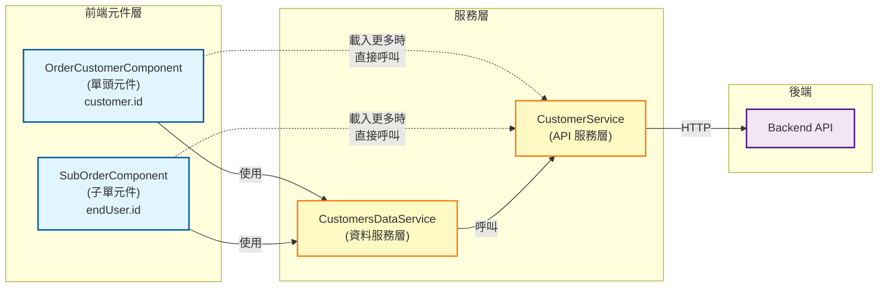
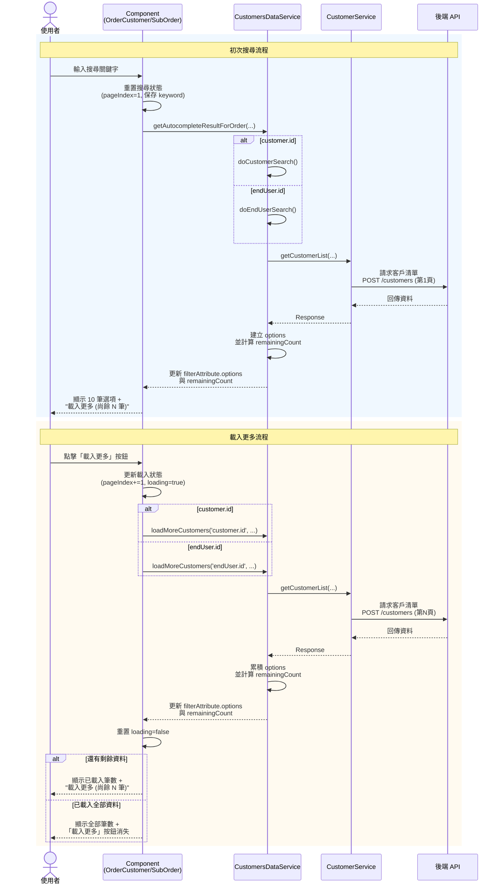

# SD_訂單：最終使用者搜尋結果優化

## 修訂紀錄
| **版本** | **日期** | **修訂內容** | **修訂者** |
| --- | --- | --- | --- |
| 1.0 | 2025-10-30 | 初版建立 | Raelynn |
| 1.1 | 2025-11-05 | 調整 setCustomerName 方法，移除多餘 serialNumber 參數 | Raelynn |
| 1.2 | 2025-11-05 | 新增 computeRemainingCount 方法統一剩餘筆數計算邏輯 | Raelynn |

## 相關 Jira 單
- **CMP-3898** - 訂單：最終使用者搜尋結果優化

## 目錄
1. 需求背景
2. 解決方案
   - 2.1 設計概念
   - 2.2 核心功能
   - 2.3 適用範圍
3. 前端設計
   - 3.1 元件關係圖
   - 3.2 序列圖
4. 實作細節
   - 4.1 修改檔案清單
   - 4.2 CustomersDataService 修改
   - 4.3 SubOrderComponent 修改
   - 4.4 OrderCustomerComponent 修改
   - 4.5 UI 模板設計

## 1. 需求背景
優化搜尋結果顯示機制，確保使用者能查詢到完整結果，提供「載入更多」功能以支援分頁瀏覽。

<br>

## 2. 解決方案

### 2.1 設計概念
- 初次搜尋返回第 1 頁 (10 筆)
- 點擊「載入更多」追加第 2 頁 (累積 20 筆)
- 持續累積直到全部載入
- 動態顯示剩餘筆數

### 2.2 核心功能
| 功能 | 說明 |
|------|------|
| **初次搜尋** | 返回第 1 頁，顯示剩餘筆數 |
| **載入更多** | 追加下一頁資料到現有選項 |
| **剩餘計算** | 總筆數 - 已載入筆數 |
| **狀態追蹤** | 記錄當前頁碼與搜尋關鍵字 |
| **Loading 指示** | 載入時顯示 Loading 圖示 |

<br>

## 3. 前端設計

### 3.1 元件關係圖



### 3.2 序列圖




## 4. 實作細節

### 4.1 修改檔案清單

| 檔案路徑 | 修改內容 |
|---------|---------|
| •`src/app/share/services/customers-data.service.ts` | • 重構 `getAutocompleteResultForOrder` 方法<br>• 抽取 `doCustomerSearch`、`doEndUserSearch` 私有方法<br>• 新增 `buildAttributeOption` 方法統一建立選項<br>• 新增 `getCustomerDisplayName` 方法統一客戶名稱顯示<br>• 新增 `loadMoreCustomers` 統一載入方法 |
| • `src/app/orders/sub-order/sub-order.component.ts`<br>• `src/app/orders/detail/order-customer/order-customer.component.ts` | • 導入 `FilterSingleProperty`<br>• 新增 `ui` 狀態管理(`customerListLoading`, `currentPageIndex`, `currentSearchKeyword`)<br>• 新增/修改 `onSelectSearch` 方法重置分頁狀態<br>• 新增 `loadMoreCustomer` 方法呼叫 Service 統一方法<br>• **order-customer 額外修改**：在多處使用展開運算子 `...f.properties` 保留現有屬性 |
| • `src/app/orders/sub-order/sub-order.component.html`<br>• `src/app/orders/detail/order-customer/order-customer.component.html` | • 在 `ma-form` 增加 `customTemplates` 參數註冊 `'optionsFooterTmp'`<br>• 新增 `optionsFooterTmp` 模板顯示「載入更多」按鈕與剩餘筆數<br>• 在模板中使用 `(click)="loadMoreCustomer()"` 事件觸發載入更多邏輯<br>• **order-customer 額外修改**：click 改綁定 `onSelectSearch()` 用於初始化搜尋狀態<br> |
| • `src/app/orders/sub-order/sub-order.component.scss`<br>• `src/app/orders/detail/order-customer/order-customer.component.scss` | • 新增 `.loadMore-btn` 樣式 |
| • `src/assets/i18n/zh-tw.json` | • 新增翻譯: `"load more": "載入更多"`<br>• 新增翻譯: `"remaining count": "尚餘{{count}}筆"` |

<br>

### 4.2 CustomersDataService 修改

**檔案位置:** `src/app/share/services/customers-data.service.ts`

#### 4.2.1 重構說明

為提升可維護性和程式碼重用性，將原本的 `getAutocompleteResultForOrder` 重構並新增以下方法：

**私有方法 (內部初始化)：**
- **doCustomerSearch()：** 將 `getAutocompleteResultForOrder` 中客戶搜尋邏輯 (customer.id) 抽出成獨立方法，並新增剩餘筆數計算
- **doEndUserSearch()：** 將 `getAutocompleteResultForOrder` 中最終使用者搜尋邏輯 (endUser.id) 抽出成獨立方法，並新增剩餘筆數計算
- **computeRemainingCount()：** 統一剩餘筆數計算邏輯，消除重複程式碼

**公用方法 (可重複調用)：**
- **buildAttributeOption()：** 統一建立客戶選項、消除重複的 name 建構邏輯
- **getCustomerDisplayName()：** 統一管理客戶名稱顯示格式
- **loadMoreCustomers()：** 統一載入更多客戶邏輯、供兩個元件共用

**主方法：**
- **getAutocompleteResultForOrder()：** 負責參數驗證、Filter 建立、Subject 推送

#### 4.2.2 主方法：getAutocompleteResultForOrder

```typescript
/** 搜尋公司 */
getAutocompleteResultForOrder(attr: FilterAttribute, value: string, filterAttribute: FilterAttribute[]) {
  //....

  // 根據類型推送到對應的 Subject 並初始化搜尋
  if (attr.internalVariableName === 'customer.id') {
    this.orderCustomerSearchSubject.next({
      //....
    });

    // 🔹 將邏輯抽出為獨立方法
    this.doCustomerSearch();
  } else if (attr.internalVariableName === 'endUser.id') {
    this.orderEndUserSearchSubject.next({
      //....
    });

    // 🔹 將邏輯抽出為獨立方法
    this.doEndUserSearch();
  }

  // 以下原本的內容合併進入 doCustomerSearch()、doEndUserSearch()
}
```

<br>

#### 4.2.3 私有方法：doCustomerSearch (customer.id)

**修改重點：**
- 將原本內嵌在 `getAutocompleteResultForOrder` 的邏輯抽出為獨立方法
- 使用 `buildAttributeOption()` 統一建立選項
- 使用 `computeRemainingCount()` 統一計算剩餘筆數
- 使用展開運算子 `...f.properties` 保留現有屬性 (如 `optionsFooterTemplateId`)

```typescript
/** 初始化訂單客戶搜尋 (customer.id) */
private doCustomerSearch(): void {
  if (this.isOrderCustomerSearchInit) {
    return;
  }

  this.isOrderCustomerSearchInit = true;
  this.orderCustomerSearchSubject.pipe(
    // ...debounceTime, distinctUntilChanged, switchMap 等原有邏輯
  ).subscribe({
    next: ({ res, data }) => {
      if (res.info.success && res.data) {
        // 🔹 使用統一方法建立選項
        const options = res.data.map((item: any) => this.buildAttributeOption(item));

        // 更新 filterAttribute
        data.filterAttribute
          .filter(f => f.internalVariableName === 'customer.id')
          .forEach(f => {
            f.options = options;

            // 🔹 計算並設定剩餘筆數
            f.properties = {
              ...f.properties,
              remainingCount: this.computeRemainingCount(res, res.data.length)
            };
          });
      }
    },
  });
}
```

<br>

#### 4.2.4 私有方法：doEndUserSearch (endUser.id)

**修改重點：**
- 將原本的內容抽出獨立方法
- 使用 `buildAttributeOption()` 統一建立選項
- 使用 `computeRemainingCount()` 統一計算剩餘筆數
- 使用展開運算子 `...f.properties` 保留現有屬性 (如 `optionsFooterTemplateId`)

```typescript
/** 初始化訂單最終使用者搜尋 (endUser.id) */
private doEndUserSearch(): void {
  if (this.isOrderEndUserSearchInit) {
    return;
  }

  this.isOrderEndUserSearchInit = true;
  this.orderEndUserSearchSubject.pipe(
    // ...debounceTime, distinctUntilChanged, switchMap 等原有邏輯
  ).subscribe({
    next: ({ res, data }) => {
      if (res.info.success && res.data) {
        // 🔹 使用統一方法建立選項 (傳入 page 資訊)
        const options = res.data.map((item: any) => this.buildAttributeOption(item));

        // 更新 filterAttribute
        data.filterAttribute
          .filter(f => f.internalVariableName === 'endUser.id')
          .forEach(f => {
            f.options = options.length > 0 ? options : [new OptionAttribute({
              name: data.attr.value,
              internalVariableName: undefined,
              visible: false
            })];

            // 🔹 計算並設定剩餘筆數
            f.properties = {
              ...f.properties,
              remainingCount: this.computeRemainingCount(res, res.data.length)
            };
          });
        if (!options.length && data.filterAttribute) {
          // 清空相關欄位略
        }
      }
    }
  });
}
```

<br>

#### 4.2.5 公用方法：buildAttributeOption

**修改重點：**
- 消除多處重複的 name 建構邏輯
- 未來修改格式只需改一處

```typescript
/** 建立客戶選項 */
buildAttributeOption(item: Customer): OptionAttribute {
  return new OptionAttribute({
    name: this.getCustomerDisplayName(item),
    internalVariableName: item.id,
    data: item
  });
}
```

<br>

#### 4.2.6 私有方法：computeRemainingCount

**修改重點：**
- 統一剩餘筆數計算邏輯，避免重複程式碼
- 初次搜尋時傳入 `res.data.length` (已載入筆數)
- 載入更多時傳入 `f.options.length` (累積已載入筆數)
- 計算公式：`總筆數 - 已顯示筆數`

```typescript
/** 計算剩餘筆數 */
private computeRemainingCount(res: any, showedCount: number): number | undefined {
  if (!res?.page?.dataCount) return undefined;
  return Math.max(0, res.page.dataCount - showedCount);
}
```

**使用範例：**

```typescript
// 初次搜尋 (doCustomerSearch / doEndUserSearch)
f.properties = {
  ...f.properties,
  remainingCount: this.computeRemainingCount(res, res.data.length)
};

// 載入更多 (loadMoreCustomers)
f.properties = {
  ...f.properties,
  remainingCount: this.computeRemainingCount(res, f.options.length)
};
```

<br>

#### 4.2.7 公用方法：loadMoreCustomers

**修改重點：**
- 將兩個元件中重複的載入邏輯抽取為統一方法
- 支援 `customer.id` 和 `endUser.id` 兩種欄位
- 使用 `computeRemainingCount()` 統一計算剩餘筆數
- 使用展開運算子 `...f.properties` 保留現有屬性
- 返回 Observable 供元件訂閱處理

```typescript
/** 載入更多客戶 */
loadMoreCustomers(
  fieldName: 'customer.id' | 'endUser.id',
  currentKeyword: string,
  currentPageIndex: number,
  filterAttribute: FilterAttribute[]
): Observable<{ success: boolean; newOptions?: OptionAttribute[] }> {
  return new Observable(sub => {
    // 建立過濾條件
    const autoFilter = new Filter();
    autoFilter.pageSize = 10;
    autoFilter.pageIndex = currentPageIndex;
    autoFilter.and.push({
      field: 'keyword',
      comparator: Comparator.like,
      value: currentKeyword
    }, {
      field: 'status',
      comparator: Comparator.equal,
      value: 1
    });
    
    this.customersService.getCustomerList(autoFilter, 'company').subscribe({
      next: (res: any) => {
        if (res.info.success && res.data) {
          // 建立新選項
          const newOptions = res.data.map((item: any) => this.buildAttributeOption(item));

          // 累積選項到現有的 options
          filterAttribute
            .filter(f => f.internalVariableName === fieldName)
            .forEach(f => {
              f.options = [...(f.options || []), ...newOptions];

              // 🔹 更新剩餘筆數
              f.properties = {
                ...f.properties,  // ← 保留現有 properties (重要!)
                remainingCount: this.computeRemainingCount(res, f.options.length)
              };
            });

          sub.next({ success: true, newOptions });
        } else {
          sub.next({ success: false });
        }
        sub.complete();
      },
      error: (err: any) => {
        // ...略
      }
    });
  });
}
```

> 註：`remainingCount` 由 `computeRemainingCount` 方法統一計算，傳入累積的 `f.options.length` 作為已顯示筆數。

<br>

### 4.3 SubOrderComponent 修改

**檔案位置:** `src/app/orders/sub-order/sub-order.component.ts`

#### 4.3.1 UI 狀態管理

```typescript
ui = {
  customerListLoading: false,        // 載入狀態指示
  currentPageIndex: 1,               // 當前頁碼 (1-based)
  currentSearchKeyword: '',          // 保存搜尋關鍵字
}
```

#### 4.3.2 FilterAttribute 配置

```typescript
// 公司名稱欄位
new FilterAttribute({
  name: this.translate.instant('enduser'),
  internalVariableName: "endUser.id",
  //...
  
  // 🔹 新增：設定選項尾部模板
  properties: {
    [FilterSingleProperty.optionsFooterTemplateId]: 'optionsFooterTmp'
  }
}),
```

#### 4.3.3 onSelectSearch 方法修改

```typescript
/** 搜尋公司名稱 */
onSelectSearch(event: any) {
  if (event.attr.internalVariableName === 'endUser.id') {
    // 🔹 新增：每次新搜尋時重置狀態
    this.ui.currentPageIndex = 1;              // 重置為第 1 頁
    this.ui.currentSearchKeyword = event.value; // 保存關鍵字 (關鍵！)
    
    // 呼叫服務層
    this.dataProvider.getAutocompleteResultForOrder(
      event.attr, 
      event.value, 
      this.filterAttribute
    );
  }
}
```

#### 4.3.4 新增方法：loadMoreCustomer

**修改重點：**
- 呼叫 Service 層的 `loadMoreCustomers` 統一方法
- 處理載入狀態與錯誤
- 錯誤時還原頁碼

```typescript
/** 載入更多客戶 */
loadMoreCustomer() {
  const endUserAttr = this.filterAttribute.find(f => f.internalVariableName === 'endUser.id');
  if (!endUserAttr || !this.ui.currentSearchKeyword) {
    return;
  }

  this.ui.currentPageIndex += 1;
  this.ui.customerListLoading = true;

  // 🔹 呼叫 Service 層統一方法
  this.dataProvider.loadMoreCustomers(
    'endUser.id',
    this.ui.currentSearchKeyword,
    this.ui.currentPageIndex,
    this.filterAttribute
  ).subscribe({
    next: (result) => {
      if (result.success) {
        this.ui.customerListLoading = false;
      } else {
        this.notify.error(this.translate.instant('error message'), 'Failed to load more customers');
        this.ui.customerListLoading = false;
        this.ui.currentPageIndex -= 1;
      }
    },
    error: (err) => {
      console.error('[load-more-customer]', err);
      this.notify.error(this.translate.instant('error message'), err);
      this.ui.customerListLoading = false;
      this.ui.currentPageIndex -= 1;  // 錯誤時還原頁碼
    }
  });
}
```

<br>

### 4.4 OrderCustomerComponent 修改

**檔案位置:** `src/app/orders/detail/order-customer/order-customer.component.ts`

#### 4.4.1 UI 狀態管理

```typescript
ui = {
  //...
  // 🔹 新增：客戶載入相關狀態
  customerListLoading: false,    // 載入狀態指示
  currentPageIndex: 1,           // 當前頁碼 (1-based)
  currentSearchKeyword: '',      // 保存搜尋關鍵字
}
```

#### 4.4.2 FilterAttribute 配置

```typescript
// 客戶名稱欄位
new FilterAttribute({
  name: this.translate.instant('customerName'),
  internalVariableName: "customer.id",
  //...

  // 🔹 新增：設定選項尾部模板
  properties: {
    [FilterSingleProperty.optionsFooterTemplateId]: 'optionsFooterTmp'
  }
}),
```

#### 4.4.3 新增方法：onSelectSearch

```typescript
/** 搜尋公司名稱 */
onSelectSearch(event: any) {
  if (event.attr.internalVariableName === 'customer.id') {
    this.ui.currentPageIndex = 1;              // 重置為第 1 頁
    this.ui.currentSearchKeyword = event.value; // 保存關鍵字
    
    // 呼叫服務層
    this.customerProvider.getAutocompleteResultForOrder(
      event.attr, 
      event.value, 
      this.filterAttribute
    );
  }
}
```

#### 4.4.4 新增方法：loadMoreCustomer

```typescript
/** 載入更多客戶 */
loadMoreCustomer() {
  const customerAttr = this.filterAttribute.find(f => f.internalVariableName === 'customer.id');
  if (!customerAttr || !this.ui.currentSearchKeyword) {
    return;
  }

  this.ui.currentPageIndex += 1;
  this.ui.customerListLoading = true;

  // 🔹 呼叫 Service 層統一方法
  this.customerProvider.loadMoreCustomers(
    'customer.id',
    this.ui.currentSearchKeyword,
    this.ui.currentPageIndex,
    this.filterAttribute
  ).subscribe({
    next: (result) => {
      if (result.success) {
        this.ui.customerListLoading = false;
      } else {
        this.notify.error(this.translate.instant('error message'), 'Failed to load more customers');
        this.ui.customerListLoading = false;
        this.ui.currentPageIndex -= 1;
      }
    },
    error: (err) => {
      console.error('[load-more-customer]', err);
      this.notify.error(this.translate.instant('error message'), err);
      this.ui.customerListLoading = false;
      this.ui.currentPageIndex -= 1;  // 錯誤時還原頁碼
    }
  });
}
```

#### 4.4.5 properties 展開運算子修改

**重要：** 在設定 `properties` 時使用展開運算子保留現有屬性

```typescript
// ❌ 錯誤寫法 (會覆蓋掉 optionsFooterTemplateId)
f.properties = { loading: true };

// ✅ 正確寫法 (保留現有屬性)
f.properties = { ...f.properties, loading: true };
```

**實際使用清單 (OrderCustomerComponent)：**

| 方法 | 寫法片段 |
|------|-----------|
| `getContactPersonData()` | `f.properties = { ...f.properties, loading: false }` |
| `onErpCustomerNumberChange()` | `f.properties = { ...f.properties, loading: true }` / error：`loading: false` |
| `setupErpCustomerNumberDebounce()` | `f.properties = { ...f.properties, loading: false }` |
| `setCustomerName()` | `customerAttribute.properties = { ...customerAttribute.properties, loading: false }` |
| `setBillingAddressOptions()` | `billingAddressField.properties = { ...billingAddressField.properties, loading: false }` |
| `updatePaymentTermsOptions()` | `paymentTermsAttr.properties = { ...paymentTermsAttr.properties, loading: true }` / 完成或失敗：`loading: false` |
| `setErpInfo()` (`updateField` 內部) | `attribute.properties = { ...attribute.properties, loading: false }` |

**Service 層 (CustomersDataService)：**

| 方法 | 寫法片段 |
|------|-----------|
| `doCustomerSearch()` | `f.properties = { ...f.properties, remainingCount: 計算值 }` |
| `doEndUserSearch()` | `f.properties = { ...f.properties, remainingCount: 計算值 }` |
| `loadMoreCustomers()` | `f.properties = { ...f.properties, remainingCount: remainingCount }` |

> 以上皆使用展開運算子以保留既有屬性 (例如 `optionsFooterTemplateId`) 並僅新增或更新必要欄位 (`loading` / `remainingCount`).

<br>

#### 4.4.6 方法調整：setCustomerName

移除傳入 serialNumber 參數，直接從 customer 上取得

**調整後核心片段：**
```typescript
setCustomerName(value: string, customer: any) {
  const inputCustomer = {
    id: value,
    name: this.customerProvider.getCustomerDisplayName(customer),
    serialNumber: customer.serialNumber || '',
  };
  this.order.header.customer = inputCustomer;
  // 更新欄位 + options + properties(loading: false) 省略...
}
```

<br>

### 4.5 UI 模板設計

#### 4.5.1 SubOrderComponent HTML

**檔案位置:** `src/app/orders/sub-order/sub-order.component.html`

**事件綁定修改：**
```html
<ma-form #customerForm
         [customTemplates]="{
           'optionsFooterTmp': optionsFooterTmp
         }"></ma-form>
```

**新增模板：**
```html
<!-- 公司-載入更多按鈕模板 -->
<ng-template #optionsFooterTmp
             let-remainingCount="item.properties['remainingCount']">
  @if(remainingCount && remainingCount > 0) {
  <div class="ant-select-item">
    <button nz-button  nzType="link"  class="loadMore-btn" (click)="loadMoreCustomer()">
      <span class="mr-1">{{ 'load more' | translate }}</span>
      <small class="mr-2">{{ 'remaining count' | translate: ({ count: remainingCount })}}</small>
      
      @if(ui.customerListLoading) {
        <span nz-icon nzType="loading" nzTheme="outline"></span>
      }
    </button>
  </div>
  }
</ng-template>
```

<br>

#### 4.5.2 OrderCustomerComponent HTML

**檔案位置:** `src/app/orders/detail/order-customer/order-customer.component.html`

**事件綁定修改：**
```html
<ma-form #customerForm
         [customTemplates]="{
          'optionsFooterTmp': optionsFooterTmp
         }"
         (onSelectSearch)="onSelectSearch($event)"></ma-form>
```

**新增模板：**
```html
<!-- 公司-載入更多 -->
<ng-template #optionsFooterTmp
             let-remainingCount="item.properties['remainingCount']">
  @if(remainingCount && remainingCount > 0) {
    <div class="ant-select-item">
      <button nz-button nzType="link" class="loadMore-btn"
              (click)="loadMoreCustomer()">
        <span class="mr-1">{{ 'load more' | translate }}</span>
        <small class="mr-2">{{ 'remaining count' | translate: ({ count: remainingCount })}}</small>
        @if(ui.customerListLoading) {
          <span nz-icon nzType="loading" nzTheme="outline"></span>
        }
      </button>
    </div>
  }
</ng-template>
```

<br>


#### 4.5.3 SubOrderComponent SCSS / OrderCustomerComponent SCSS

**檔案位置:** `src/app/orders/sub-order/sub-order.component.scss`
**檔案位置:** `src/app/orders/detail/order-customer/order-customer.component.scss`

```scss
.loadMore-btn {
  padding: 0;
  line-height: 1;
  height: unset;
}
```
