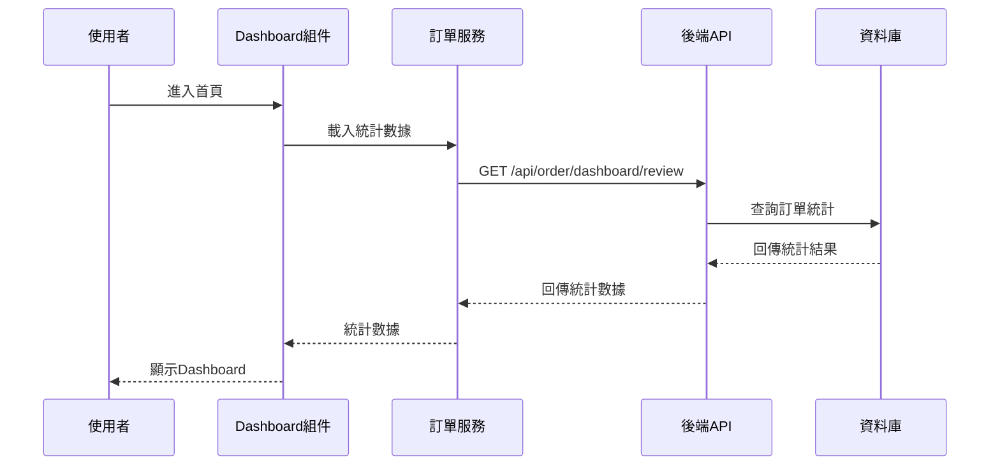
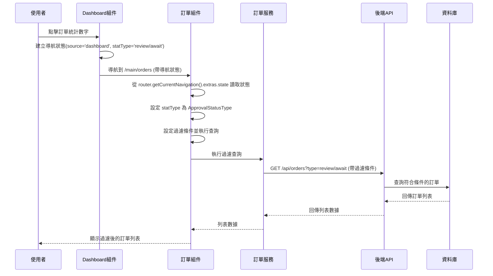
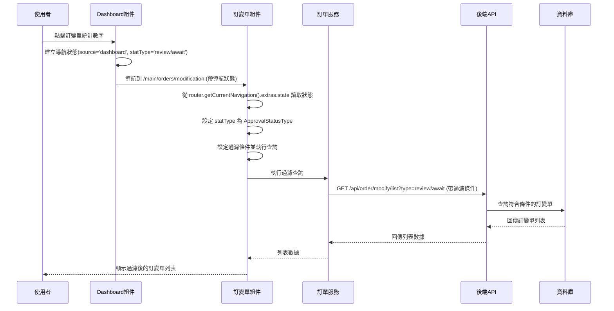
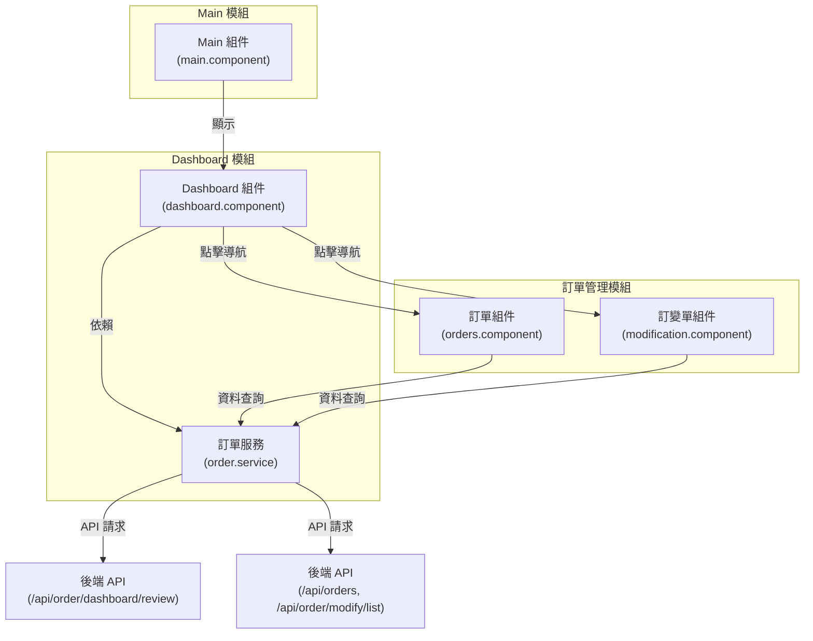

# CMP首頁Dashboard系統設計文件 (SD)

## 修訂紀錄

| 版本 | 日期 | 修訂者 | 修訂內容 |
|------|------|--------|----------|
| 1.0 | 2025/07/30 | Raelynn | 初版建立 |
| 1.1 | 2025/08/01 | Raelynn | 新增組件關係圖 |
| 1.2 | 2025/08/21 | Raelynn | 實作完成：API整合、資料模型重構 |

## 1. 系統架構設計

### 1.1 整體架構（循序圖）

#### 1.1.1 Dashboard 載入流程



#### 1.1.2 點擊數字導航流程 - 訂單



#### 1.1.3 點擊數字導航流程 - 訂變單



### 1.2 組件關係圖



## 2. 模組設計

### 2.1 Dashboard模組結構

```
src/app/share/components/dashboard/
├── dashboard.component.ts
├── dashboard.component.html
└── dashboard.component.scss

src/app/core/models/
└── orders.ts (包含Dashboard相關模型)
```

### 2.2 資料模型設計

#### core/models/orders.ts (Dashboard相關模型):

```typescript
export enum DashboardStatsType {
  order = 'order',
  modify = 'modify',
  external = 'external'
}

export enum ApprovalStatusType {
  review = 'review',    // 待您簽署
  await = 'await'       // 待簽署
}

export interface DashboardBaseStats {
  userReviewCount: number;        // 待您簽署
  awaitingReviewCount: number;    // 待簽署
}

// Dashboard統計數據結構
export type DashboardStats = Record<DashboardStatsType, DashboardBaseStats>;
```


## 3. 組件設計

### 3.1 Dashboard模板設計
主要使用 `nz-card` 實作類別區塊、`nz-statistic` 實作數據顯示。

#### share/components/dashboard.component.html:
```html
@for (card of statCards; track card.type) {
  <div nz-col [nzXs]="24" [nzSm]="24" [nzMd]="8" [nzLg]="8" [nzXl]="8"
       [hidden]="card.hidden">
    <nz-card [class]="'dashboard-stat-card dashboard-card-' + card.type">

      <!-- 卡片標題 -->
      <div class="stat-card-title">
        <span nz-icon nzType="info-circle" nzTheme="fill"></span>
        <div>{{ ('dashboard_' + card.type) | translate }}</div>
      </div>

      <!-- 數字顯示區域 -->
      <div nz-flex [nzJustify]="'space-around'" [nzAlign]="'center'">

        <!-- 待您簽署數字區塊 -->
        <ng-container *ngTemplateOutlet="statItemTpl; context: {
                       key: card.type,
                       type: ApprovalStatusType.review,
                       value: getStats(card.type)?.userReviewCount,
                       label: 'dashboard pending approval'}">
        </ng-container>

        <!-- 分隔線 -->
        <div class="stat-divider"></div>

        <!-- 待簽署數字區塊 -->
        <ng-container *ngTemplateOutlet="statItemTpl; context: {
                       key: card.type,
                       type: ApprovalStatusType.await,
                       value: getStats(card.type)?.awaitingReviewCount,
                       label: 'dashboard awaiting approval'}">
        </ng-container>
      </div>
    </nz-card>
  </div>
}

<!-- 共用 Template -->
<ng-template #statItemTpl let-key="key" let-type="type" let-value="value" let-label="label">
  <div (click)="onStatClick(key, type)">
    <nz-statistic [nzValue]="value" [nzTitle]="titleTpl"></nz-statistic>
    <ng-template #titleTpl>
      <div nz-flex [nzJustify]="'space-around'" [nzAlign]="'center'" class="{{ type }}">
        {{ label | translate }}
      </div>
    </ng-template>
  </div>
</ng-template>
```

### 3.2 Dashboard主組件

#### share/components/dashboard.component.ts
```typescript
export class DashboardComponent implements OnInit {
  dashboardStats: DashboardStats | null = null;
  loading = false;

  // 統計卡片配置
  statCards = [
    { type: DashboardStatsType.order, hidden: false },
    { type: DashboardStatsType.modify, hidden: false },
    { type: DashboardStatsType.external, hidden: true }
  ];

  get ApprovalStatusType() { return ApprovalStatusType; }

  constructor(
    private router: Router,
    private translate: TranslateService,
    private notify: NzNotificationService,
    private orderSvc: OrderService,
  ) { }

  ngOnInit() {
    this.loadDashboardData();
  }

  private loadDashboardData() {
    this.loading = true;

    // 載入統計數據，不載入使用者角色
    this.orderSvc.getDashboardReview().subscribe({
      next: (res) => {
        this.dashboardStats = res.data;
        this.loading = false;
      },
      error: (error) => {
        console.error(error);
        this.notify.error(this.translate.instant('error message'), error);
        this.loading = false;
      }
    });
  }

  onStatClick(type: DashboardStatsType, statType: ApprovalStatusType) {
    // 取得對應的統計物件
    const dashboardStats = this.dashboardStats;
    const baseStats = this.getStats(type);
    
    if (!dashboardStats || !baseStats) {
      console.warn('無法取得統計數據');
      return;
    }
    
    const navigationState = {
      source: 'dashboard',
      statType: statType
    };

    // 導航到對應的列表頁面
    this.navigateToList(type, navigationState);
  }

  /**
   * 導航到對應的列表頁面
   */
  private navigateToList(type: DashboardStatsType, navigationState: any) {
    let navigationPath: string[] = [];

    // 根據統計類型決定導航路徑
    switch (type) {
      case DashboardStatsType.order:
        navigationPath = ['/main/orders'];
        break;
      case DashboardStatsType.modify:
        navigationPath = ['/main/orders/modification'];
        break;
      case DashboardStatsType.external:
        // 外部訂單功能尚未實作，顯示提示訊息
        this.notify.info('功能開發中', '外部訂單功能正在開發中，敬請期待！');
        return;
      default:
        console.warn('未知的統計類型:', type);
        return;
    }

    // 執行導航，使用 state 而非 queryParams
    this.router.navigate(navigationPath, {
      state: navigationState
    }).then(success => {
      if (!success) {
        console.error(`導航失敗: ${navigationPath.join('/')}`);
        this.notify.error('導航失敗', '無法開啟對應的功能頁面，請稍後再試');
      }
    }).catch(error => {
      console.error('導航錯誤:', error);
      this.notify.error('導航錯誤', '開啟功能頁面時發生錯誤');
    });
  }

  /**
   * 根據卡片鍵值取得對應的統計數據
   */
  getStats(cardKey: DashboardStatsType): DashboardBaseStats | null {
    if (!this.dashboardStats) return null;

    let rawData: any = null;

    switch (cardKey) {
      case DashboardStatsType.order:
        rawData = this.dashboardStats[DashboardStatsType.order];
        break;
      case DashboardStatsType.modify:
        rawData = this.dashboardStats[DashboardStatsType.modify];
        break;
      case DashboardStatsType.external:
        rawData = this.dashboardStats[DashboardStatsType.external] || null;
        break;
      default:
        return null;
    }

    return rawData;
  }
}
```

## 4. 路由設計

### 4.1 Main組件整合

Dashboard組件不需要獨立路由，直接整合在 `main.component.html` 中作為首頁內容。

#### main.component.html
```html
<div class="main-content">
  <!-- Dashboard 組件 -->
   @if (!isAdmin) {
     <app-dashboard></app-dashboard>
   }
</div>
```
#### main.component.ts
```typescript
export class BillsComponent implements OnInit {
  isAdmin = false;

  ngOnInit() {
    // 在初始化時設定管理員狀態
    this.isAdmin = this.authService.currentRole?.iamType === 'SUPER_ADMIN';
  }
}
```

### 4.2 Bills組件整合

Bills頁面所有角色都可以訪問，但Dashboard組件只有業務/業助角色才會顯示。

#### bills.component.html
```html
<div class="bills-content">
  <!-- Dashboard 組件 - 僅業務/業助角色顯示 -->
  @if (showDashboard) {
    <app-dashboard></app-dashboard>
  }
  
  <!-- Bills 相關功能組件 -->
  <!-- ...existing bills content... -->
</div>
```
#### bills.component.ts
```typescript
export class BillsComponent implements OnInit {
  showDashboard = false;

  constructor(
    private authService: AuthService,
    private permission: PermissionService
  ) {}

  ngOnInit() {
    // 判斷是否為業務角色，決定是否顯示Dashboard
    this.showDashboard = !!this.permission.flat['iam-v1.sales'];
    
    // 其他初始化邏輯...
  }
}
```

### 4.3 導航邏輯與參數處理

Dashboard組件中的點擊導航邏輯會傳遞查詢參數到對應的列表頁面：

#### dashboard.component.ts - 導航邏輯
```typescript
onStatClick(type: DashboardStatsType, statType: string) {
  // 取得對應的統計物件
  const dashboardStats = this.dashboardStats;
  const baseStats = this.getStats(type);
    
  if (!dashboardStats || !baseStats) {
    console.warn('無法取得統計數據');
    return;
  }
    
  // 構建 state 數據
  const navigationState = { source: 'dashboard', statType: statType };
    
  // 導航到對應的列表頁面
  this.navigateToList(type, navigationState);
}
```

### 4.4 Orders組件參數接收

Orders組件需要在 `ngOnInit` 中監聽路由參數，並根據 `statType` 設定對應的過濾條件：

#### orders.component.ts - 參數接收與處理
```typescript
export class OrdersComponent implements OnInit {
  /** 統計類型 */
  statType: ApprovalStatusType | null = null;
  
  constructor(
    private router: Router,
    // ...other dependencies
  ) {
    // 檢查是否有來自Dashboard的參數（從router state中讀取）
    const navigation = this.router.getCurrentNavigation();
    if (navigation?.extras?.state) {
      const state = navigation.extras.state as any;
      if (state.source === 'dashboard' && state.statType) {
        this.statType = state.statType;
      }
    }
  }

  ngOnInit(): void {
    this.orderPermission = this.permission.getPermission('order-v1');

    if (!this.statType) {
      this.doSearch();
      return;
    }

    // 如果有來自 Dashboard 的統計類型，設定過濾條件
    const filter = new Filter();
    filter.and.push({
      field: 'approvalStatus',
      comparator: Comparator.equal,
      value: this.statType
    });

    this.filterAttribute.find(
      columnSet => columnSet.internalVariableName === 'approvalStatus'
    )!.value = this.statType;

    this.doSearch(filter);
  }
}
```

### 4.5 Modification組件參數接收

Modification組件同樣需要處理Dashboard傳來的參數：

#### modification.component.ts - 參數接收與處理

```typescript
export class ModificationComponent implements AfterContentInit {
  /** 統計類型 */
  statType: ApprovalStatusType | null = null;

  constructor(
    private router: Router,
    // ...other dependencies
  ) {
    // 檢查是否有來自Dashboard的參數（從router state中讀取）
    const navigation = this.router.getCurrentNavigation();
    if (navigation?.extras?.state) {
      const state = navigation.extras.state as any;
      if (state.source === 'dashboard' && state.statType) {
        this.statType = state.statType;
      }
    }
  }

  ngAfterContentInit(): void {
    if (!this.statType) {
      this.doSearch();
      return;
    }

    // 如果有來自 Dashboard 的統計類型，設定過濾條件
    const filter = new Filter();
    filter.and.push({
      field: 'approvalStatus',
      comparator: Comparator.equal,
      value: this.statType
    });

    this.filterAttribute.find(
      columnSet => columnSet.internalVariableName === 'approvalStatus'
    )!.value = this.statType;

    this.doSearch(filter);
  }
}
```

## 5. 服務層設計

### 5.1 訂單服務 (整合Dashboard功能)

#### share/services/order.service.ts
```typescript
  /** 取得 Dashboard 總表 */
  getDashboardReview(): Observable<ResponseData> {
    return this.api.get(this.gateway.order + 'dashboard/review');
  }

  /** 搜尋訂單列表（支援簽核狀態過濾） */
  getOrderList(filter: Filter, type?: ApprovalStatusType): Observable<ResponseData> {
    const typeParam = type ? '?type=' + type : '';
    return this.api.post(this.gateway.order + `orders${typeParam}`, new RequestData(filter));
  }

  /** 搜尋訂單變更列表（支援簽核狀態過濾） */
  getModifyOrderList(filter: Filter, type?: ApprovalStatusType): Observable<ResponseData> {
    const typeParam = type ? '?type=' + type : '';
    return this.api.post(this.gateway.order + `order/modify/list${typeParam}`, new RequestData(filter));
  }
```

**預計回應格式**:
```json
{
  "data": {
    "order": {
      "userReviewCount": 5,
      "awaitingReviewCount": 12
    },
    "modify": {
      "userReviewCount": 3,
      "awaitingReviewCount": 8
    },
    "external": {
      "userReviewCount": 0,
      "awaitingReviewCount": 0
    }
  },
  "info": {
    "success": true,
    "message": "",
    "code": "200"
  },
  "page": null
}
```
