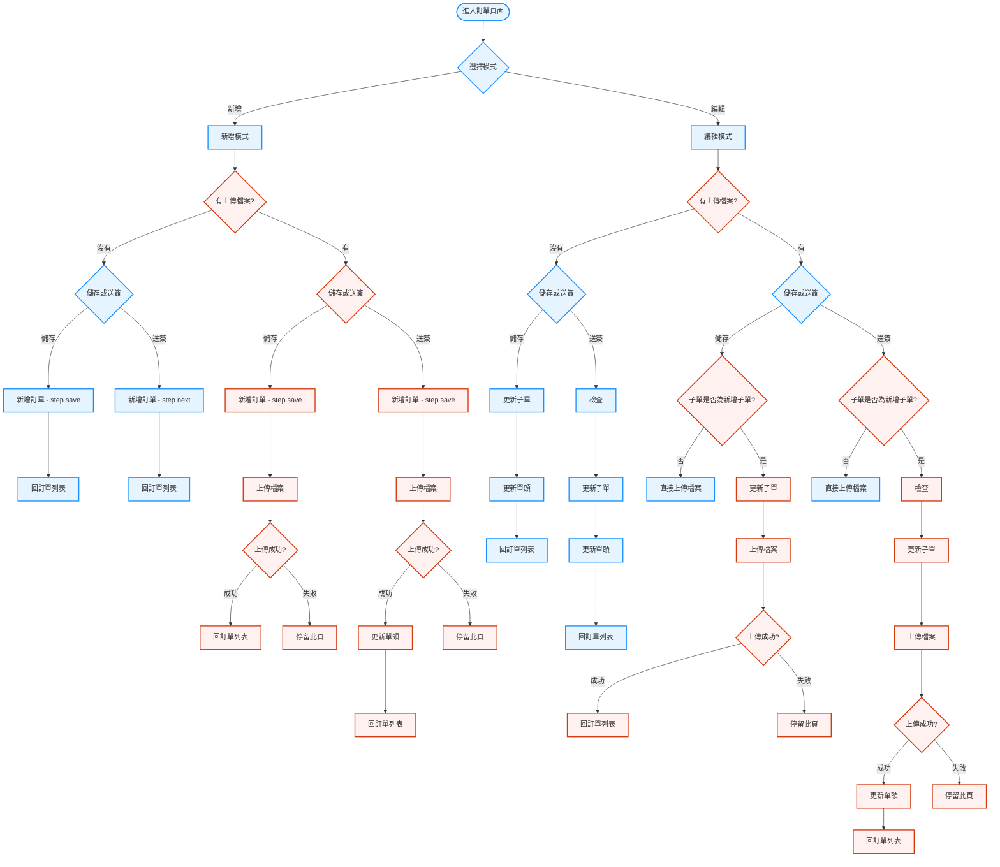

# 訂單儲存/送簽簡化情境流程圖

```mermaid
flowchart TD
    Start([進入訂單頁面]) --> Mode{選擇模式}
    Mode -->|新增| ActionA[新增模式]
    Mode -->|編輯| ActionB[編輯模式]
    ActionA --> FileCheckA{有上傳檔案?}
    FileCheckA -->|沒有| ChoiceA{儲存或送簽}
    ChoiceA -->|儲存| SaveA[新增訂單 - step save]
    SaveA --> HomeA[回訂單列表]
    ChoiceA -->|送簽| SaveB[新增訂單 - step next]
    SaveB --> HomeB[回訂單列表]
    FileCheckA -->|有| ChoiceB{儲存或送簽}
    ChoiceB -->|儲存| SaveC[新增訂單 - step save]
    SaveC --> FileUploadA[上傳檔案]
    FileUploadA --> UploadResultA{上傳成功?}
    UploadResultA -->|成功| HomeC[回訂單列表]
    UploadResultA -->|失敗| StayA[停留此頁]
    ChoiceB -->|送簽| SaveD[新增訂單 - step save]
    SaveD --> FileUploadB[上傳檔案]
    FileUploadB --> UploadResultB{上傳成功?}
    UploadResultB -->|成功| UpdateHeaderB[更新單頭]
    UpdateHeaderB --> HomeD[回訂單列表]
    UploadResultB -->|失敗| StayB[停留此頁]

    ActionB --> FileCheckB{有上傳檔案?}:::blue
    FileCheckB -->|沒有| ChoiceD{儲存或送簽}:::blue
    ChoiceD -->|儲存| SaveE[更新子單]
    SaveE --> SaveF[更新單頭]
    SaveF --> HomeE[回訂單列表]
    ChoiceD -->|送簽| CheckD[檢查]:::blue
    CheckD --> SaveI[更新子單]:::blue
    SaveI --> SaveJ[更新單頭]:::blue
    SaveJ --> HomeI[回訂單列表]
    FileCheckB -->|有| ChoiceE{儲存或送簽}:::blue
    ChoiceE -->|儲存| SubOrderCheck{子單是否為新增子單?}:::red
    SubOrderCheck -->|否| DirectUpload[直接上傳檔案]:::blue
    SubOrderCheck -->|是| SaveG[更新子單]:::red
    SaveG --> FileUploadC[上傳檔案]:::red
    FileUploadC --> UploadResultD{上傳成功?}:::red
    UploadResultD -->|成功| HomeH[回訂單列表]
    UploadResultD -->|失敗| StayD[停留此頁]
    ChoiceE -->|送簽| SubOrderCheckSign{子單是否為新增子單?}:::blue
    SubOrderCheckSign -->|否| DirectUploadSign[直接上傳檔案]:::blue
    SubOrderCheckSign -->|是| CheckSign[檢查]:::red
    CheckSign --> SaveK[更新子單]:::red
    SaveK --> FileUploadD[上傳檔案]:::red
    FileUploadD --> UploadResultE{上傳成功?}:::red
    UploadResultE -->|成功| UpdateHeaderC[更新單頭]:::red
    UpdateHeaderC --> HomeJ[回訂單列表]
    UploadResultE -->|失敗| StayE[停留此頁]

    %% 舊的流程藍色底
    classDef blue fill:#e6f4ff,stroke:#1890ff,stroke-width:2px;
    class Start,Mode,ActionA,ActionB,FileCheckA,ChoiceA,SaveA,SaveB,HomeA,HomeB,ChoiceD,FileCheckB,SaveE,SaveF,HomeE,CheckD,SaveI,SaveJ,HomeI,ChoiceE,SubOrderCheck,DirectUpload,SubOrderCheckSign,DirectUploadSign blue;
    %% 新增模式與上傳檔案步驟紅色底
    classDef pink fill:#fff1f0,stroke:#d4380d,stroke-width:2px;
    class ChoiceB,SaveC,SaveD,FileUploadA,FileUploadB,UploadResultA,UploadResultB,UpdateHeaderB,HomeC,HomeD,StayA,StayB pink;
    %% 編輯模式送簽-新增子單紅色底
    classDef red fill:#fff1f0,stroke:#d4380d,stroke-width:2px;
    class SaveG,FileUploadC,UploadResultD,HomeH,StayD,CheckSign,SaveK,FileUploadD,UploadResultE,UpdateHeaderC,HomeJ,StayE,FileCheckA,FileCheckB,ChoiceB,SaveC,SaveD,FileUploadA,FileUploadB,UploadResultA,UploadResultB,UpdateHeaderB,HomeC,HomeD,StayA,StayB red;
    class SubOrderCheck,SubOrderCheckSign red;
```
