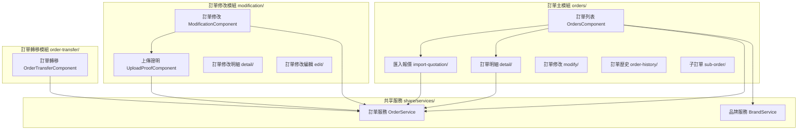

# 訂單相關組件關聯圖

## 主要組件關係圖

## 重要組件說明

### 1. OrdersComponent (訂單列表)
- 主要訂單管理介面，包含訂單列表檢視和基本操作
- 提供訂單搜尋、篩選功能
- 支援建立新訂單、複製訂單
- 支援匯出訂單資料
- 實作 CRM 報價單轉訂單功能
- 使用 API: `getOrderList()`, `copyOrder()`, `export()`

### 2. DetailComponent (訂單詳情)
- 訂單詳細資訊頁面
- 包含訂單單頭與單身資訊
- 管理訂單建立和修改流程
- 集成多個子元件以顯示完整訂單資訊

### 3. OrderHeaderComponent (訂單單頭)
- 管理訂單基本資訊
- 處理訂單單號、供應商、銷售人員等資訊
- 實作單頭資料驗證

### 4. OrderCustomerComponent (訂單客戶)
- 管理訂單相關的客戶資訊
- 處理經銷商、最終使用者等資訊
- 提供客戶選擇和資訊填寫功能

### 5. SubOrderComponent (子訂單)
- 子訂單管理介面
- 處理訂單產品項目的新增、編輯、刪除
- 管理產品相關的附加資訊與檔案

### 6. ProductComponent (產品管理)
- 產品選擇和管理介面
- 包含產品搜尋、新增功能
- 與 ProductTableComponent 組合顯示產品資訊

### 7. OrderTransformComponent (訂單轉換)
- 處理訂單資料轉換功能
- 提供格式轉換和資料整合

### 8. ImportQuotationComponent (匯入報價單)
- CRM 報價單匯入功能
- 提供報價單搜尋和匯入功能
- 支援不同品牌報價單的匯入處理

### 9. OrderHistoryComponent (訂單歷史)
- 顯示訂單變更歷史記錄
- 提供歷史版本比較功能

### 10. AttachedFilesComponent (附件檔案)
- 管理訂單相關的附件檔案
- 提供檔案上傳、下載、刪除功能

### 11. ModifyComponent (訂單修改)
- 處理訂單變更請求
- 管理訂單變更流程和審核

### 12. 各品牌元件
- MicrosoftComponent: 處理微軟特有產品資訊
- AwsComponent: 處理 AWS 特有產品資訊
- CiscoComponent: 處理思科特有產品資訊
- AkamaiComponent: 處理 Akamai 特有產品資訊
- GoogleComponent: 處理 Google 特有產品資訊

### 13. 各品牌額外欄位元件
- MicrosoftExtraFieldComponent: 微軟特有欄位處理
- AwsExtraFieldComponent: AWS 特有欄位處理
- CiscoExtraFieldComponent: 思科特有欄位處理
- AkamaiExtraFieldComponent: Akamai 特有欄位處理
- GoogleExtraFieldComponent: Google 特有欄位處理

### 14. OrderReviewComponent (訂單審核)
- 訂單審核流程介面
- 處理不同角色的審核權限和流程

## DetailComponent 五層級結構

DetailComponent 主要由以下組件階層構成：

```mermaid
graph TD
    %% 主要組件
    DetailComponent[訂單詳情 DetailComponent]
    
    %% 一級子元件
    OrderHeader[訂單單頭 OrderHeaderComponent]
    OrderCustomer[訂單客戶 OrderCustomerComponent]
    SubOrder[子訂單 SubOrderComponent]
    OrderTransform[訂單轉換 OrderTransformComponent]
    OrderReview[訂單審核 OrderReviewComponent]
    
    %% 二級子元件 - SubOrderComponent 的下層元件
    Product[產品管理 ProductComponent]
    ContractNumber[合約編號 ContractNumberComponent]
    AttachedFiles[附件檔案 AttachedFilesComponent]
    LinodeRange[Linode範圍 LinodeRangeComponent]
    
    %% 三級子元件 - ProductComponent 的下層元件
    ProductTable[產品表格 ProductTableComponent]
    AdvancedSearch[進階搜尋 AdvancedSearchComponent]
    
    %% 四級子元件 - ProductTableComponent 的下層元件
    BrandComponents[品牌元件群組]
    
    %% 五級子元件 - 各品牌元件
    Microsoft[Microsoft MicrosoftComponent]
    AWS[AWS AwsComponent]
    Cisco[Cisco CiscoComponent]
    Akamai[Akamai AkamaiComponent]
    Google[Google GoogleComponent]
    
    %% 二級子元件 - 各品牌額外欄位元件群組
    ExtraFields[額外欄位元件群組]
    
    %% 三級子元件 - 各品牌額外欄位元件
    MicrosoftExtra[Microsoft額外欄位 MicrosoftExtraFieldComponent]
    AwsExtra[AWS額外欄位 AwsExtraFieldComponent]
    CiscoExtra[Cisco額外欄位 CiscoExtraFieldComponent]
    AkamaiExtra[Akamai額外欄位 AkamaiExtraFieldComponent]
    GoogleExtra[Google額外欄位 GoogleExtraFieldComponent]
    
    %% 建立階層關係
    DetailComponent --> OrderHeader
    DetailComponent --> OrderCustomer
    DetailComponent --> SubOrder
    DetailComponent --> OrderTransform
    DetailComponent --> OrderReview
    
    SubOrder --> Product
    SubOrder --> ContractNumber
    SubOrder --> AttachedFiles
    SubOrder --> LinodeRange
    SubOrder --> ExtraFields
    
    Product --> ProductTable
    Product --> AdvancedSearch
    
    ProductTable --> BrandComponents
    
    BrandComponents --> Microsoft
    BrandComponents --> AWS
    BrandComponents --> Cisco
    BrandComponents --> Akamai
    BrandComponents --> Google
    
    ExtraFields --> MicrosoftExtra
    ExtraFields --> AwsExtra
    ExtraFields --> CiscoExtra
    ExtraFields --> AkamaiExtra
    ExtraFields --> GoogleExtra

    %% 樣式設定
    classDef mainComponent fill:#f9f,stroke:#333,stroke-width:2px;
    classDef level1 fill:#bbf,stroke:#333,stroke-width:1px;
    classDef level2 fill:#ddf,stroke:#333,stroke-width:1px;
    classDef level3 fill:#eef,stroke:#333,stroke-width:1px;
    classDef group fill:#ffe,stroke:#333,stroke-width:1px,stroke-dasharray: 5 5;
    
    class DetailComponent mainComponent;
    class OrderHeader,OrderCustomer,SubOrder,OrderTransform,OrderReview level1;
    class Product,ContractNumber,AttachedFiles,LinodeRange level2;
    class ProductTable,AdvancedSearch,MicrosoftExtra,AwsExtra,CiscoExtra,AkamaiExtra,GoogleExtra level3;
    class BrandComponents,ExtraFields group;
```

### 各層級說明

#### 第一層：DetailComponent (訂單詳情)
- 主要訂單詳細資訊頁面
- 統一管理訂單的所有資料與操作
- 整合所有子元件並協調它們之間的資料流
- 處理訂單送審、作廢、退回等業務流程

#### 第二層：直接子元件
1. **OrderHeaderComponent (訂單單頭)**
   - 管理訂單基本資訊
   - 顯示與編輯訂單號碼、訂單狀態等資訊

2. **OrderCustomerComponent (訂單客戶)**
   - 管理訂單相關的客戶資訊
   - 處理經銷商、最終使用者等資訊

3. **SubOrderComponent (子訂單)**
   - 管理子訂單資訊，包含產品項目與相關設定
   - 可以有多個實例，每個代表一個子訂單

4. **OrderTransformComponent (訂單轉換)**
   - 處理訂單資料轉換功能
   - 用於複製訂單給子公司

5. **OrderReviewComponent (訂單審核)**
   - 顯示訂單審核介面
   - 提供訂單預覽與PDF下載功能

#### 第三層：子訂單的子元件
1. **ProductComponent (產品管理)**
   - 產品選擇和管理介面
   - 產品新增、編輯、刪除功能

2. **ContractNumberComponent (合約編號)**
   - 管理合約編號資訊

3. **AttachedFilesComponent (附件檔案)**
   - 管理訂單相關的附件檔案
   - 提供檔案上傳、下載功能

4. **LinodeRangeComponent (Linode範圍)**
   - 管理Linode相關特定設定

#### 第四層：產品管理的子元件
1. **ProductTableComponent (產品表格)**
   - 顯示產品列表
   - 依據不同品牌顯示不同欄位與資訊

2. **AdvancedSearchComponent (進階搜尋)**
   - 提供產品的進階搜尋功能

#### 第五層：品牌特定元件
各品牌特有元件負責顯示與處理該品牌特有的產品資訊：
- **MicrosoftComponent**
- **AwsComponent**
- **CiscoComponent**
- **AkamaiComponent**
- **GoogleComponent**

### 額外元件：品牌額外欄位元件
處理各品牌產品的特殊欄位：
- **MicrosoftExtraFieldComponent**
- **AwsExtraFieldComponent**
- **CiscoExtraFieldComponent**
- **AkamaiExtraFieldComponent**
- **GoogleExtraFieldComponent**

### 資料流向與溝通機制

1. **DetailComponent** 作為主控元件：
   - 從服務中取得訂單資料
   - 將資料分發給各子元件
   - 整合子元件的資料變更

2. **各子元件互動方式**：
   - 使用 Input/Output 裝飾器進行父子元件間通訊
   - 共享訂單資料模型
   - 事件發布/訂閱機制處理跨元件通訊

3. **表單處理**：
   - 訂單資料透過表單控制項進行驗證和更改追蹤
   - 使用反應式表單進行資料雙向繫結
